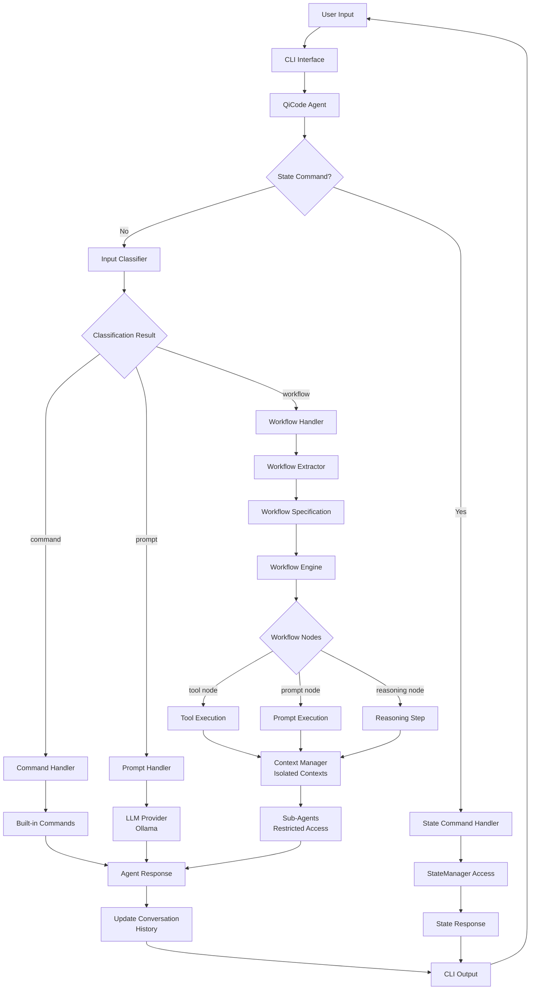
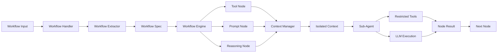
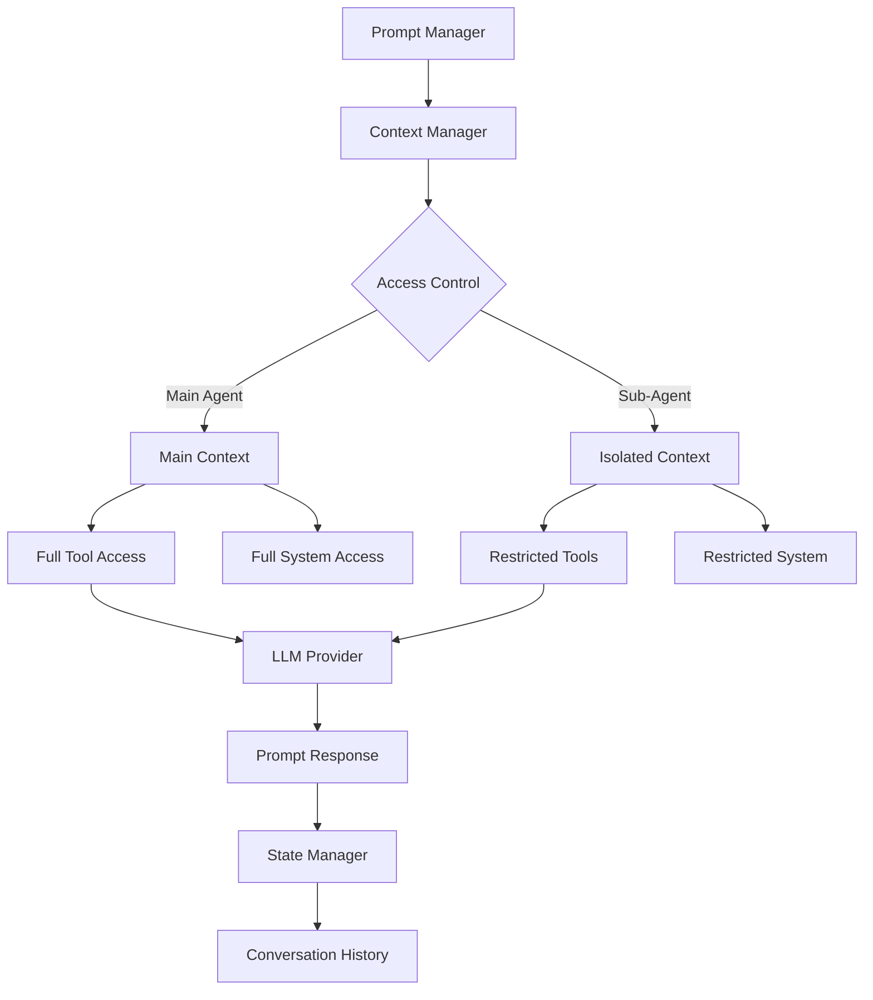

# qi-v2 Agent Current Architecture

## 🎯 **Current Architecture Overview**

The qi-v2 agent implements a **agent-centric architecture** with centralized state management and secure context isolation. This design provides superior modularity, testability, and security compared to traditional flow-through architectures.

```
┌─────────────────────────────────────────────────────────────────┐
│                           User Interface                        │
│                        (CLI / API / Web)                       │
└────────────────────────┬────────────────────────────────────────┘
                         │
┌────────────────────────▼────────────────────────────────────────┐
│                       QiCode Agent                              │
│  ┌─────────────────┐  ┌─────────────────┐  ┌─────────────────┐ │
│  │  StateManager   │  │ContextManager   │  │   Classifier    │ │
│  │   (owned)       │  │   (owned)       │  │   (owned)       │ │
│  └─────┬───────────┘  └─────┬───────────┘  └─────┬───────────┘ │
│        │                    │                    │             │
│  ┌─────▼───────────┐  ┌─────▼───────────┐  ┌─────▼───────────┐ │
│  │  Configuration  │  │  Conversations  │  │  Input Types    │ │
│  │  Models & State │  │  Sub-Contexts   │  │  cmd|prompt|wf  │ │
│  └─────────────────┘  └─────────────────┘  └─────────────────┘ │
└────────────────────────┬────────────────────────────────────────┘
                         │
        ┌────────────────┼────────────────┐
        │                │                │
┌───────▼──────┐ ┌───────▼──────┐ ┌───────▼──────┐
│   Command    │ │    Prompt    │ │   Workflow   │
│   Handler    │ │   Handler    │ │   Handler    │
└───────┬──────┘ └───────┬──────┘ └───────┬──────┘
        │                │                │
┌───────▼──────┐ ┌───────▼──────┐ ┌───────▼──────┐
│  Built-in    │ │ LLM Provider │ │  Workflow    │
│  Commands    │ │   (Ollama)   │ │  Extractor   │
└──────────────┘ └──────────────┘ └───────┬──────┘
                                          │
                                 ┌───────▼──────┐
                                 │  Workflow    │
                                 │   Engine     │
                                 └───────┬──────┘
                                         │
                                ┌───────▼──────┐
                                │ Sub-Agents + │
                                │    Tools     │
                                └──────────────┘
```

## 🏗️ **Core Architectural Principles**

### 1. **Agent-Centric Design**

The **Agent** is the central orchestrator that **owns** and manages other components:

```typescript
class QiCodeAgent implements IAgent {
  private stateManager: IStateManager;      // OWNED by agent
  private contextManager: IContextManager;  // OWNED by agent  
  private classifier: IClassifier;          // OWNED by agent
  
  // Agent coordinates all interactions
  async process(request: AgentRequest): Promise<AgentResponse> {
    // 1. Use classifier to determine input type
    const type = await this.classifier.classify(request.input);
    
    // 2. Use state manager for context and configuration
    const context = this.stateManager.getContext();
    
    // 3. Route to appropriate handler based on classification
    return await this.routeToHandler(type, request, context);
  }
}
```

### 2. **Contract-Based Interactions**

Components interact through well-defined contracts, not direct dependencies:

```
Agent ──contracts──> StateManager ──interfaces──> State Operations
Agent ──contracts──> ContextManager ──interfaces──> Context Operations  
Agent ──contracts──> Classifier ──interfaces──> Classification Operations
```

### 3. **Security Through Isolation**

Sub-agents operate in isolated contexts with restricted tool access:

```
Main Agent Context ──creates──> Isolated Sub-Context
                               │
                               ├── Limited Tool Access
                               ├── Path Restrictions  
                               ├── Time Limits
                               └── Memory Limits
```

## 📋 **Component Architecture**

### **1. QiCode Agent** (`src/agent/impl/QiCodeAgent.ts`)

**Role**: Central coordinator and orchestrator  
**Responsibilities**:
- Input classification and routing
- State and context management
- Handler coordination
- Security enforcement

```typescript
interface IAgent {
  initialize(): Promise<void>;
  process(request: AgentRequest): Promise<AgentResponse>;
  stream(request: AgentRequest): AsyncIterableIterator<AgentStreamChunk>;
  getStatus(): AgentStatus;
  shutdown(): Promise<void>;
}
```

**Integration Pattern**:
```typescript
// Agent owns managers and uses them via contracts
const stateManager = createStateManager();
const contextManager = new ContextManager(appContext);
const agent = createAgent(stateManager, contextManager, config);
```

### **2. State Manager** (`src/state/impl/StateManager.ts`)

**Role**: Centralized state and configuration management  
**Responsibilities**:
- Application configuration
- Session management  
- Conversation history
- Model information
- Context data

```typescript
interface IStateManager {
  getConfig(): AppConfig;
  getCurrentModel(): string;
  getCurrentSession(): SessionData;
  addConversationEntry(entry: ConversationEntry): void;
  // ... more state operations
}
```

**State Components**:
- **AppConfig**: System configuration and preferences
- **SessionData**: Current session and conversation history
- **ModelInfo**: Available LLM models and their status
- **AppContext**: Execution environment context

### **3. Context Manager** (`src/context/impl/ContextManager.ts`)

**Role**: Context isolation and security boundary management  
**Responsibilities**:
- Application context management
- Isolated context creation for sub-agents
- Security boundary enforcement
- Context lifecycle management

```typescript
interface IContextManager {
  getApplicationContext(): AppContext;
  createIsolatedContext(config: IsolatedContextConfig): IsolatedContext;
  validateContextAccess(contextId: string, operation: string): boolean;
  terminateContext(contextId: string): void;
}
```

**Context Types**:
- **AppContext**: Global application context
- **ConversationContext**: Conversation-specific context
- **IsolatedContext**: Secure sub-agent execution context

### **4. Input Classifier** (`src/classifier/impl/input-classifier.ts`)

**Role**: Three-type input classification  
**Responsibilities**:
- Command detection (`/help`, `/config`, `/model`)
- Prompt identification (`"hi"`, `"write quicksort"`)
- Workflow recognition (`"fix bug and run tests"`)

```typescript
interface IClassifier {
  classify(input: string, context?: ClassificationContext): Promise<ClassificationResult>;
}

type ClassificationType = 'command' | 'prompt' | 'workflow';
```

**Classification Logic**:
```typescript
// Command: Starts with command prefix
if (input.startsWith('/')) return 'command';

// Workflow: Complex multi-step tasks
if (hasMultipleActions(input) && hasFileReferences(input)) return 'workflow';

// Prompt: Simple conversational requests
return 'prompt';
```

### **5. Handlers** (`src/handlers/`)

**Role**: Type-specific request processing

#### **Command Handler** (`src/command/impl/command-handler.ts`)
- Built-in system commands
- State management commands (`/model`, `/status`, `/config`)
- Direct execution without LLM involvement

#### **Prompt Handler** (`src/prompt/impl/prompt-handler.ts`)
- Simple conversational requests
- Direct LLM provider integration
- Template rendering and response formatting

#### **Workflow Engine** (`src/workflow/impl/langgraph-workflow-engine.ts`)
- Complex multi-step task orchestration
- Sub-agent delegation with tool integration
- LangGraph-based workflow execution

## 🔄 **Request Processing Flow**

### **Complete Processing Pipeline**



### **Detailed Handler Processing**

#### **1. Input Reception & Classification**
```
User Input → CLI → Agent.process(request)
Agent → Classifier.classify(input) → {type, confidence}
```

#### **2. Workflow Processing (Complete Pipeline)**


#### **3. Context-Prompt Integration Design**

The context manager provides isolated execution environments for both workflow nodes and direct prompt processing:



**Key Integration Points**:
- **Prompt Handler** uses ContextManager for execution environment setup
- **Context isolation** applies to both direct prompts and workflow prompt nodes
- **State management** tracks all prompt interactions regardless of context
- **Security boundaries** enforce tool restrictions for sub-agent prompts

#### **4. State Management Integration**
```
Agent → StateManager.addConversationEntry(result)
Agent → StateManager.updateContext(changes)
StateManager → Session Persistence
StateManager → Configuration Updates
```

## 🛠️ **Tool Integration Architecture**

### **Tool Categories**

1. **Core Tools** - File operations, search, execution
2. **Memory Tools** - Persistent storage across sessions
3. **Notebook Tools** - Jupyter notebook integration
4. **Web Tools** - External content fetching
5. **Architecture Tools** - System design and analysis

### **Tool Access Patterns**

```typescript
// Main Agent: Full tool access
const mainAgent = new QiCodeAgent(stateManager, contextManager);
mainAgent.tools = getAllTools(); // All tools available

// Sub-Agent: Restricted tool access
const isolatedContext = contextManager.createIsolatedContext({
  restrictions: { readOnlyMode: true, blockedTools: ['SystemTool'] }
});
const subAgent = new SubAgent(isolatedContext);
subAgent.tools = getFilteredTools(restrictions); // Limited tools
```

### **Security Model**

```
Tool Request → Context Validation → Permission Check → Execution
                      ↓                    ↓              ↓
                 Context Exists?    User Approved?   Resource Available?
```

## 🔒 **Security Architecture**

### **Multi-Layer Security**

1. **Context Isolation**: Sub-agents run in isolated contexts
2. **Tool Restrictions**: Limited tool access based on context
3. **Path Restrictions**: File system access controls
4. **Time Limits**: Execution timeout enforcement
5. **Resource Limits**: Memory and CPU usage controls

### **Permission Model**

```typescript
interface SecurityRestrictions {
  readOnlyMode: boolean;           // Prevent write operations
  allowedPaths: string[];          // File system restrictions
  blockedCommands: string[];       // Prohibited commands
  blockedTools: string[];          // Prohibited tools
  requireApproval: boolean;        // User approval required
  maxExecutionTime: number;        // Timeout limits
  networkAccess: boolean;          // Network permissions
  systemAccess: boolean;           // System command permissions
}
```

## 📊 **Data Flow Architecture**

### **State Data Flow**
```
User Action → Agent → StateManager → State Update → Persistence
     ↓           ↓         ↓             ↓             ↓
  CLI Input → Process → Get Context → Update History → Save Session
```

### **Context Data Flow**
```
Agent Request → ContextManager → Context Creation → Security Setup
      ↓              ↓               ↓                    ↓
  Sub-Agent → Isolated Context → Restricted Tools → Safe Execution
```

### **Memory Data Flow**
```
Tool Execution → Memory Operation → Scope Validation → Storage
       ↓               ↓               ↓                ↓
   Context ID → Read/Write Request → User/Session/Global → Persist
```

## 🚀 **Current Implementation Status**

### ✅ **Completed Components**

1. **Core Agent Architecture**
   - `QiCodeAgent` with StateManager/ContextManager integration
   - Three-type input classification system
   - Handler routing and dispatch logic

2. **State Management**
   - Centralized configuration and session management
   - Conversation history tracking
   - Model information and switching

3. **Context Management**
   - Application context management
   - Isolated context creation for sub-agents
   - Security boundary enforcement

4. **Input Classification**
   - Rule-based three-type classification
   - Command/prompt/workflow detection
   - Confidence scoring and metadata

5. **Command System**
   - Built-in state management commands
   - `/model`, `/status`, `/config`, `/session` commands
   - Direct execution without LLM involvement

### 🔄 **In Development**

1. **Prompt Handler Integration**
   - LLM provider abstraction layer
   - Template rendering system
   - Response formatting and streaming

2. **Workflow Engine**
   - LangGraph-based workflow orchestration
   - Sub-agent delegation patterns
   - Tool integration and error handling

3. **Advanced Tool System**
   - MCP protocol integration
   - Tool permission management
   - Performance optimization

### 📋 **Planned Enhancements**

1. **Memory Integration**
   - Context-aware memory scoping
   - Persistent storage backends
   - Memory analytics and optimization

2. **Advanced Security**
   - Fine-grained permission system
   - Security policy configuration
   - Audit logging and monitoring

3. **Performance Optimization**
   - Caching layers for frequent operations
   - Batch processing for bulk operations
   - Resource usage monitoring

## 🏆 **Architecture Benefits**

### **1. Superior to Flow-Through Designs**

Traditional: `CLI → StateManager → Classifier → Agent → Tools`  
Our Design: `Agent owns StateManager/ContextManager and uses them via contracts`

**Benefits**:
- Clear ownership and responsibility
- Easier testing and mocking
- Better error handling and recovery
- More flexible component replacement

### **2. Security Through Isolation**

- Sub-agents cannot access parent context
- Tool access restricted by context
- Resource usage monitored and limited
- Security boundaries enforced automatically

### **3. Practical Classification System**

- Commands: Direct system operations
- Prompts: Simple conversational requests  
- Workflows: Complex multi-step tasks

**More practical than "everything is a workflow" approaches**

### **4. Centralized State Management**

- Single source of truth for configuration
- Consistent session management
- Unified history tracking
- Easy state persistence and recovery

## 🔮 **Future Architecture Evolution**

### **1. Distributed Agent System**
- Multiple specialized agents
- Cross-agent communication protocols
- Load balancing and failover

### **2. Plugin Architecture**
- Dynamic tool loading
- Third-party integrations
- Custom handler development

### **3. Advanced AI Integration**
- Multi-model orchestration
- Model-specific optimizations
- Intelligent routing and caching

---

## 📚 **Quick Reference**

### **Key Files**
- `src/agent/impl/QiCodeAgent.ts` - Main agent implementation
- `src/state/impl/StateManager.ts` - State management
- `src/context/impl/ContextManager.ts` - Context isolation
- `src/classifier/impl/input-classifier.ts` - Input classification

### **Key Patterns**
```typescript
// Agent creation with manager injection
const stateManager = createStateManager();
const contextManager = new ContextManager(appContext);
const agent = createAgent(stateManager, contextManager, config);

// Contract-based state access
const model = this.stateManager.getCurrentModel();
this.stateManager.addConversationEntry(entry);

// Context isolation for sub-agents
const isolatedContext = this.contextManager.createIsolatedContext(config);
const subAgent = new SubAgent(isolatedContext);
```

This architecture provides a robust, secure, and maintainable foundation for AI agent development with clear separation of concerns and strong security boundaries.