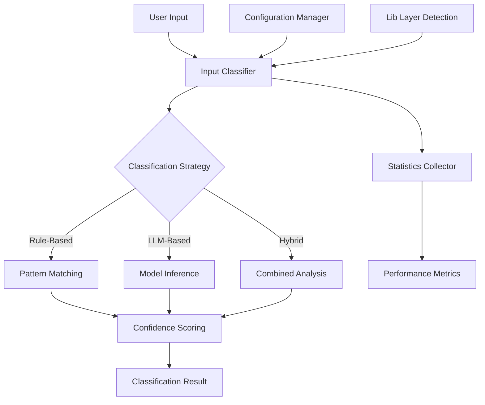

# Classifier Module - Design Guide

## 🎯 Purpose

The Classifier module provides intelligent three-type input classification for the qi-v2-agent system, categorizing user input into **Commands**, **Prompts**, or **Workflows** with confidence scoring and multiple implementation strategies.

## 📋 Requirements

### Functional Requirements
1. **Three-Type Classification**: Categorize inputs as command/prompt/workflow with high accuracy
2. **Confidence Scoring**: Provide transparency about classification certainty (0.0-1.0)
3. **Multiple Strategies**: Support rule-based, LLM-based, and hybrid classification methods
4. **Batch Processing**: Efficiently classify multiple inputs simultaneously
5. **Performance Monitoring**: Track classification statistics and performance metrics
6. **Graceful Fallback**: Automatic detection of lib layer with fallback to basic implementation

### Non-Functional Requirements
1. **Performance**: <1ms for rule-based, <100ms for LLM-based classification
2. **Accuracy**: >88% overall classification accuracy across input types
3. **Memory Efficiency**: <10MB baseline memory usage
4. **Extensibility**: Easy addition of new classification methods
5. **Reliability**: Graceful handling of edge cases and malformed inputs

## 🏗️ Architecture Design

### Core Components



### Component Responsibilities

#### 1. Input Classifier (Core Interface)
- **Purpose**: Main classification interface for all input processing
- **Responsibilities**:
  - Route inputs to appropriate classification strategies
  - Aggregate results and confidence scores
  - Maintain performance statistics
  - Handle batch processing efficiently

#### 2. Classification Strategies
- **Rule-Based Classifier**: Fast pattern matching with predefined indicators
- **LLM-Based Classifier**: Context-aware classification using language models
- **Hybrid Classifier**: Combines multiple strategies for optimal accuracy

#### 3. Configuration Manager
- **Purpose**: Manage classification parameters and thresholds
- **Responsibilities**:
  - Load and validate configuration settings
  - Support runtime configuration updates
  - Provide default configurations per strategy

#### 4. Statistics Collector
- **Purpose**: Monitor classification performance and accuracy
- **Responsibilities**:
  - Track classification counts by type and method
  - Calculate average confidence and processing times
  - Provide insights for optimization

## 🔄 Classification Logic

### Three-Type System

#### 1. Command Classification
- **Pattern**: Inputs starting with `/` prefix
- **Confidence**: Always 1.0 (100% accuracy)
- **Examples**: `/help`, `/status --verbose`, `/model "llama3.2"`
- **Processing**: Direct prefix matching, no ambiguity

#### 2. Prompt vs Workflow Distinction
- **Key Innovation**: Distinguishing simple requests from complex multi-step tasks
- **Prompt Examples**: 
  - "hi" → greeting pattern
  - "write quicksort in Python" → simple coding request
  - "explain async/await" → informational query
- **Workflow Examples**:
  - "fix bug in auth.ts and run tests" → multi-step with file operations
  - "create authentication system with JWT" → complex implementation task
  - "analyze codebase and generate documentation" → multi-step analysis

### Classification Algorithm

```typescript
// High-level classification flow
interface ClassificationFlow {
  // Stage 1: Command Detection (100% confidence)
  commandDetection: (input: string) => boolean
  
  // Stage 2: Complexity Analysis
  complexityAnalysis: (input: string) => ComplexityMetrics
  
  // Stage 3: Pattern Scoring
  promptScoring: (input: string, complexity: ComplexityMetrics) => number
  workflowScoring: (input: string, complexity: ComplexityMetrics) => number
  
  // Stage 4: Final Classification
  finalClassification: (scores: ScoreSet) => ClassificationResult
}

interface ComplexityMetrics {
  wordCount: number
  multiStepIndicators: number
  fileOperations: number
  technicalTerms: number
  actionVerbs: number
}
```

## 📊 Interfaces and Contracts

### Core Classification Interface

```typescript
interface IClassifier {
  // Primary classification methods
  classify(input: string, options?: ClassificationOptions): Promise<ClassificationResult>
  classifyBatch(inputs: string[]): Promise<ClassificationResult[]>
  
  // Configuration and introspection
  getSupportedTypes(): readonly ClassificationType[]
  getSupportedMethods(): readonly ClassificationMethod[]
  configure(config: Partial<ClassifierConfig>): void
  
  // Performance monitoring
  getStats(): ClassifierStats
  resetStats(): void
}

interface ClassificationResult {
  type: 'command' | 'prompt' | 'workflow'
  confidence: number                    // 0.0 - 1.0
  method: ClassificationMethod          // Detection method used
  processingTime?: number               // Milliseconds
  metadata?: Record<string, unknown>    // Additional data
  reasoning?: string                    // Human-readable explanation
}

interface ClassificationOptions {
  method?: ClassificationMethod         // Force specific method
  includeMetadata?: boolean            // Include detailed metadata  
  includeReasoning?: boolean           // Include reasoning explanation
  confidenceThreshold?: number         // Override default threshold
}
```

### Statistics and Monitoring

```typescript
interface ClassifierStats {
  totalClassifications: number
  averageConfidence: number
  averageProcessingTime: number
  typeDistribution: Record<ClassificationType, number>
  methodUsage: Record<ClassificationMethod, number>
  accuracyMetrics?: AccuracyMetrics
}

interface AccuracyMetrics {
  overallAccuracy: number
  perTypeAccuracy: Record<ClassificationType, number>
  confusionMatrix: ConfusionMatrix
}
```

## 🧠 Classification Strategies

### 1. Rule-Based Classification

#### Pattern Indicators
```typescript
interface RuleBasedIndicators {
  commandPrefix: string                 // Default: '/'
  
  promptIndicators: string[]           // Greeting, question words
  workflowIndicators: string[]         // Action verbs, multi-step terms
  
  fileOperationKeywords: string[]      // File manipulation terms
  technicalTerms: string[]             // Domain-specific vocabulary
  
  confidenceThresholds: {
    command: number                     // Always 1.0
    prompt: number                      // Default: 0.8
    workflow: number                    // Default: 0.7
  }
}
```

#### Scoring Algorithm
```typescript
interface ScoringAlgorithm {
  // Base scores
  basePromptScore: number              // Starting point for prompts
  baseWorkflowScore: number            // Starting point for workflows
  
  // Boost factors
  promptBoosts: {
    greetingPattern: number            // "hi", "hello" detection
    questionPattern: number            // "what", "how", "why" detection
    simpleCodeRequest: number          // Basic coding requests
  }
  
  workflowBoosts: {
    multiStepPattern: number           // "then", "and", "after" detection
    fileOperations: number             // File manipulation indicators
    technicalComplexity: number       // Technical term density
  }
  
  // Penalty factors
  penalties: {
    lengthPenalty: number              // Long inputs less likely to be prompts
    complexityPenalty: number          // Complex syntax reduces prompt score
  }
}
```

### 2. LLM-Based Classification (Future Enhancement)

#### Model Requirements
```typescript
interface LLMClassifierConfig {
  modelProvider: 'ollama' | 'openai' | 'custom'
  modelName: string
  temperature: number                   // Low for consistent classification
  maxTokens: number                    // Limit response length
  systemPrompt: string                 // Classification instructions
}
```

#### Structured Output Schema
```typescript
interface LLMClassificationResult {
  type: 'command' | 'prompt' | 'workflow'
  confidence: number
  reasoning: string
  indicators: {
    keyPhrases: string[]
    complexityFactors: string[]
    decisionFactors: string[]
  }
}
```

### 3. Hybrid Classification

#### Strategy Combination
```typescript
interface HybridStrategy {
  primaryMethod: ClassificationMethod
  fallbackMethods: ClassificationMethod[]
  
  confidenceThreshold: number          // Switch to fallback if below
  consensusRequired: boolean           // Require agreement between methods
  weightedVoting: boolean              // Weight methods by historical accuracy
}
```

## 🎯 Design Principles

### 1. Accuracy Over Speed (Within Limits)
- Prioritize classification accuracy while maintaining <100ms response times
- Use fastest method that meets accuracy requirements
- Implement fallback strategies for edge cases

### 2. Transparency and Explainability
- Provide confidence scores for all classifications
- Include human-readable reasoning when requested
- Expose decision factors and indicators used

### 3. Extensibility and Modularity
- Support pluggable classification strategies
- Enable easy addition of new input types
- Provide hooks for custom indicators and patterns

### 4. Performance Monitoring
- Built-in statistics collection and analysis
- Performance tracking across different strategies
- Support for A/B testing different approaches

## 🔍 Quality Attributes

### Accuracy Targets

| Input Type | Target Accuracy | Current Performance | Method |
|------------|----------------|-------------------|---------|
| Commands | 100% | 100% | Rule-based prefix |
| Prompts | >90% | ~90% | Pattern matching |
| Workflows | >85% | ~85% | Multi-factor analysis |
| Overall | >88% | ~88% | Combined strategies |

### Performance Targets

| Metric | Rule-Based | LLM-Based | Hybrid |
|--------|------------|-----------|--------|
| Latency | <1ms | <100ms | <50ms |
| Memory | <5KB | <20MB | <10MB |
| Throughput | >1000/sec | Model-dependent | >100/sec |
| Accuracy | ~88% | >95% (target) | >92% (target) |

### Reliability Requirements
- **Error Handling**: Graceful degradation on classification failures
- **Input Validation**: Handle malformed, empty, or extremely long inputs
- **Resource Management**: Prevent memory leaks in long-running processes
- **Configuration Validation**: Ensure valid configuration parameters

## 🚀 Success Criteria

### Functional Success
- ✅ Achieve >88% overall classification accuracy
- ✅ Support all three input types with appropriate confidence scoring
- ✅ Provide multiple classification strategies with automatic fallback
- ✅ Enable batch processing for performance optimization

### Technical Success
- ✅ Meet latency requirements for interactive use
- ✅ Maintain stable memory usage over time
- ✅ Provide comprehensive performance monitoring
- ✅ Support runtime configuration updates

### User Experience Success
- ✅ Transparent confidence scoring builds user trust
- ✅ Clear reasoning helps users understand classification decisions
- ✅ Consistent performance across different input patterns
- ✅ Graceful handling of edge cases and ambiguous inputs

## 🔮 Evolution Path

### Phase 1: Rule-Based Foundation (Current)
- ✅ Solid rule-based classification with pattern matching
- ✅ Comprehensive statistics and monitoring
- ✅ Multiple implementation strategies
- ✅ Lib layer integration with graceful fallback

### Phase 2: LLM Enhancement (Future)
- 🎯 Fine-tuned local models for classification
- 🎯 Context-aware classification using conversation history
- 🎯 Continuous learning from user feedback
- 🎯 Advanced ensemble methods combining multiple strategies

### Phase 3: Adaptive Intelligence (Future)
- 🎯 Self-improving accuracy through feedback loops
- 🎯 Domain-specific classification models
- 🎯 Real-time adaptation to user patterns
- 🎯 Predictive classification based on context

This design provides a robust foundation for intelligent input classification that can evolve from rule-based accuracy to sophisticated AI-driven understanding while maintaining reliability and performance standards.