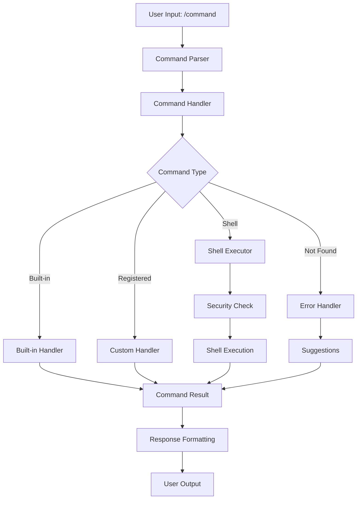

# Command Module - Design and Implementation Guide

## 🎯 Overview

The `@qi/command` module provides a comprehensive command execution system with built-in commands, extensible registration, and optional shell command integration. It enables direct system operations through a secure, well-structured command interface.

## 🏗️ Design Architecture

### Core Design Principles

1. **Extensible Command Registry** - Dynamic command registration with type-safe handlers
2. **Built-in Command System** - Essential commands (help, status, exit) included by default
3. **Security-First Shell Integration** - Optional shell command execution with whitelist protection
4. **Alias Support** - Multiple names for commands with automatic resolution
5. **Rich Error Handling** - Comprehensive error reporting and suggestions

### Module Structure

```
lib/src/impl/commands/
├── command-handler.ts          # Core command handler implementation
└── index.ts                    # Command exports

app/src/cli/impl/
├── command-handler.ts          # CLI-specific command handler with shell support
└── index.ts                    # CLI implementation exports

Core Components:
├── ICommandHandler            # Abstract command interface
├── BasicCommandHandler        # Library implementation
├── CLICommandHandler         # CLI implementation with shell support
└── CommandDefinition         # Command metadata and validation
```

### Architecture Flow



## 🔧 Implementation Details

### 1. Core Command Interface

#### ICommandHandler Interface
```typescript
export interface ICommandHandler {
  getAvailableCommands(): readonly CommandDefinition[]
  executeCommand(request: CommandRequest): Promise<CommandResult>
  validateCommand(commandName: string, parameters: ReadonlyMap<string, unknown>): Promise<boolean>
  registerCommand(definition: CommandDefinition, handler: CommandExecutor): void
  unregisterCommand(commandName: string): void
}
```

#### Command Types and Results
```typescript
export interface CommandDefinition {
  name: string
  description: string
  usage: string
  category?: string
  aliases?: string[]
  parameters?: CommandParameter[]
  requiresArgs?: boolean
}

export interface CommandRequest {
  commandName: string
  arguments: readonly string[]
  parameters: ReadonlyMap<string, unknown>
  context?: Map<string, unknown>
}

export interface CommandResult {
  status: 'success' | 'error' | 'not_found'
  content: string
  output: string
  commandName: string
  success: boolean
  suggestions?: string[]
  data?: unknown
  metadata?: Map<string, unknown>
}
```

### 2. Basic Command Handler Implementation

#### Library Implementation (Basic)
```typescript
export class BasicCommandHandler implements ICommandHandler {
  private commands = new Map<string, CommandDefinition>()
  private handlers = new Map<string, CommandExecutor>()
  private aliases = new Map<string, string>()
  
  constructor(initialConfig?: Map<string, unknown>) {
    this.registerBuiltinCommands()
  }
  
  async executeCommand(request: CommandRequest): Promise<CommandResult> {
    const commandName = this.resolveAlias(request.commandName)
    
    if (!this.commands.has(commandName)) {
      return {
        status: 'not_found',
        content: `Command '${request.commandName}' not found.`,
        output: `Command '${request.commandName}' not found.`,
        commandName: request.commandName,
        success: false,
        suggestions: this.getSuggestions(request.commandName),
        metadata: new Map([
          ['originalCommand', request.commandName],
          ['availableCommands', Array.from(this.commands.keys())]
        ])
      }
    }

    const definition = this.commands.get(commandName)!
    const handler = this.handlers.get(commandName)!

    // Validate parameters
    const validationResult = await this.validateCommand(commandName, request.parameters)
    if (!validationResult) {
      return {
        status: 'error',
        content: `Invalid parameters for command '${commandName}'.`,
        output: `Invalid parameters for command '${commandName}'.`,
        commandName: request.commandName,
        success: false,
        metadata: new Map([
          ['commandDefinition', definition],
          ['providedParameters', Object.fromEntries(request.parameters)]
        ])
      }
    }

    try {
      return await handler(request)
    } catch (error) {
      return {
        status: 'error',
        content: `Command execution failed: ${error instanceof Error ? error.message : String(error)}`,
        output: `Command execution failed: ${error instanceof Error ? error.message : String(error)}`,
        commandName: request.commandName,
        success: false,
        metadata: new Map([['error', error], ['commandName', commandName]])
      }
    }
  }
}
```

### 3. CLI Command Handler with Shell Support

#### Enhanced CLI Implementation
```typescript
export class CLICommandHandler implements ICommandHandler {
  private commandRegistry = new Map<string, CommandExecutor>()
  private commandDefinitions = new Map<string, CommandDefinition>()
  private aliasMap = new Map<string, string>()
  private shellCommandsEnabled = false
  
  // Safe shell commands whitelist
  private static SAFE_SHELL_COMMANDS = new Set([
    'ls', 'dir', 'pwd', 'whoami', 'date', 'echo', 'cat', 'head', 'tail',
    'grep', 'find', 'which', 'man', 'history', 'ps', 'top', 'df', 'du',
    'git', 'npm', 'bun', 'node', 'python', 'pip'
  ])
  
  async executeCommand(request: CommandRequest): Promise<CommandResult> {
    const startTime = Date.now()
    
    try {
      // Resolve command name (handle aliases)
      const resolvedCommand = this.resolveCommandName(request.commandName)
      
      // Check if it's a registered command
      if (this.commandRegistry.has(resolvedCommand)) {
        const handler = this.commandRegistry.get(resolvedCommand)!
        const result = await handler(request)
        
        return {
          ...result,
          metadata: new Map([
            ...result.metadata,
            ['executionTime', Date.now() - startTime]
          ])
        }
      }
      
      // Try shell command execution if enabled
      if (this.shellCommandsEnabled && this.isSafeShellCommand(resolvedCommand)) {
        return await this.executeShellCommand(request, startTime)
      }
      
      // Command not found
      return {
        status: 'not_found',
        content: `Command not found: ${request.commandName}. Use /help to see available commands.`,
        success: false,
        output: '',
        commandName: request.commandName,
        metadata: new Map([['executionTime', Date.now() - startTime]])
      }
    } catch (error) {
      return {
        status: 'error',
        content: `Command execution failed: ${error instanceof Error ? error.message : String(error)}`,
        success: false,
        output: '',
        commandName: request.commandName,
        metadata: new Map([['executionTime', Date.now() - startTime]])
      }
    }
  }
}
```

### 4. Built-in Command System

#### Essential Commands
```typescript
const BUILT_IN_COMMANDS: CommandDefinition[] = [
  {
    name: 'help',
    description: 'Show available commands and their usage',
    usage: '/help [command_name]',
    aliases: ['h', '?']
  },
  {
    name: 'exit',
    description: 'Exit the CLI application',
    usage: '/exit',
    aliases: ['quit', 'q']
  },
  {
    name: 'status',
    description: 'Show current application status',
    usage: '/status',
    aliases: ['info']
  },
  {
    name: 'clear',
    description: 'Clear the screen',
    usage: '/clear',
    aliases: ['cls']
  },
  {
    name: 'model',
    description: 'Show or change the current LLM model',
    usage: '/model [model_name]',
    requiresArgs: false
  }
]
```

#### Built-in Command Handlers
```typescript
private registerBuiltInCommands(): void {
  // Help command
  this.register('help', async (request) => {
    const args = request.arguments
    if (args.length > 0) {
      const help = this.getCommandHelp(args[0])
      return {
        status: 'success',
        content: help || `No help available for command: ${args[0]}`,
        output: help || `No help available for command: ${args[0]}`,
        commandName: 'help',
        success: true
      }
    }
    
    const commands = this.getAvailableCommands()
    let output = 'Available commands:\n\n'
    
    for (const cmd of commands) {
      output += `/${cmd.name} - ${cmd.description}\n`
    }
    
    output += '\nUse /help <command> for detailed usage information.'
    
    if (this.shellCommandsEnabled) {
      output += '\n\nShell commands are enabled. Common commands like ls, git, npm are available.'
    }
    
    return {
      status: 'success',
      content: output,
      output,
      commandName: 'help',
      success: true
    }
  })
  
  // Status command
  this.register('status', async (request) => {
    const context = request.context
    const output = [
      `Current State: ${context?.get('currentState') || 'unknown'}`,
      `Sub-state: ${context?.get('currentSubState') || 'unknown'}`,
      `Session ID: ${context?.get('sessionId') || 'unknown'}`,
      `Uptime: ${this.formatUptime(context?.get('startTime'))}`,
      `Commands Registered: ${this.commandRegistry.size}`,
      `Shell Commands: ${this.shellCommandsEnabled ? 'Enabled' : 'Disabled'}`
    ].join('\n')
    
    return {
      status: 'success',
      content: output,
      output,
      commandName: 'status',
      success: true,
      metadata: new Map([
        ['commandCount', this.commandRegistry.size],
        ['shellEnabled', this.shellCommandsEnabled]
      ])
    }
  })
}
```

### 5. Shell Command Integration

#### Security-First Shell Execution
```typescript
private async executeShellCommand(request: CommandRequest, startTime: number): Promise<CommandResult> {
  try {
    // Sanitize arguments to prevent injection
    const sanitizedArgs = request.arguments.map(arg => this.sanitizeShellArg(arg))
    const fullCommand = `${request.commandName} ${sanitizedArgs.join(' ')}`
    
    // Execute with timeout and buffer limits
    const { stdout, stderr } = await execAsync(fullCommand, {
      timeout: 30000, // 30 second timeout
      maxBuffer: 1024 * 1024 // 1MB buffer
    })
    
    return {
      status: 'success',
      content: stdout || stderr || 'Command executed successfully',
      output: stdout || stderr || 'Command executed successfully',
      commandName: request.commandName,
      success: true,
      metadata: new Map([
        ['executionTime', Date.now() - startTime],
        ['shellCommand', true],
        ['fullCommand', fullCommand]
      ])
    }
    
  } catch (error: any) {
    return {
      status: 'error',
      content: `Shell command failed: ${error.message || 'Unknown error'}`,
      output: error.stderr || '',
      commandName: request.commandName,
      success: false,
      metadata: new Map([
        ['executionTime', Date.now() - startTime],
        ['shellCommand', true],
        ['exitCode', error.code],
        ['errorType', 'shell-execution-failed']
      ])
    }
  }
}

private isSafeShellCommand(command: string): boolean {
  return CLICommandHandler.SAFE_SHELL_COMMANDS.has(command)
}

private sanitizeShellArg(arg: string): string {
  // Escape special characters to prevent injection
  return arg.replace(/[;&|`$(){}[\]]/g, '\\$&')
}
```

### 6. Command Registration and Management

#### Dynamic Command Registration
```typescript
registerCommand(definition: CommandDefinition, handler: CommandExecutor): void {
  // Validate command name
  if (!definition.name || !/^[a-zA-Z][a-zA-Z0-9_-]*$/.test(definition.name)) {
    throw new Error(`Invalid command name: ${definition.name}`)
  }
  
  // Register the handler and definition
  this.commandRegistry.set(definition.name, handler)
  this.commandDefinitions.set(definition.name, definition)
  
  // Register aliases
  if (definition.aliases) {
    for (const alias of definition.aliases) {
      this.aliasMap.set(alias, definition.name)
    }
  }
}

unregisterCommand(commandName: string): void {
  this.commandRegistry.delete(commandName)
  const definition = this.commandDefinitions.get(commandName)
  this.commandDefinitions.delete(commandName)
  
  // Remove aliases
  if (definition?.aliases) {
    for (const alias of definition.aliases) {
      this.aliasMap.delete(alias)
    }
  }
}
```

#### Command Discovery and Help
```typescript
getCommandHelp(name: string): string | null {
  const resolved = this.resolveCommandName(name)
  const definition = this.commandDefinitions.get(resolved)
  
  if (!definition) return null
  
  let help = `${definition.name}: ${definition.description}\n`
  help += `Usage: ${definition.usage}`
  
  if (definition.aliases?.length) {
    help += `\nAliases: ${definition.aliases.join(', ')}`
  }
  
  if (definition.parameters?.length) {
    help += '\nParameters:\n'
    for (const param of definition.parameters) {
      help += `  ${param.name}: ${param.description}`
      if (param.required) help += ' (required)'
      help += '\n'
    }
  }
  
  return help
}

private getSuggestions(input: string): string[] {
  const commands = Array.from(this.commands.keys())
  return commands
    .filter(cmd => cmd.includes(input) || input.includes(cmd))
    .slice(0, 3)
}
```

## 📊 Performance & Reliability

### Performance Characteristics

- **Command Lookup**: O(1) with Map-based registry
- **Alias Resolution**: O(1) with pre-computed alias map
- **Shell Command Execution**: Limited by system performance + 30s timeout
- **Memory Usage**: ~5KB baseline + command definitions
- **Registration**: O(1) for command registration and unregistration

### Security Features

1. **Shell Command Whitelist**: Only pre-approved commands allowed
2. **Argument Sanitization**: Escape special characters to prevent injection
3. **Execution Timeouts**: 30-second timeout prevents hanging commands
4. **Buffer Limits**: 1MB output buffer prevents memory exhaustion
5. **Command Validation**: Strict name validation with regex patterns

### Error Handling Strategy

```typescript
// Comprehensive error handling with context preservation
async executeCommand(request: CommandRequest): Promise<CommandResult> {
  const startTime = Date.now()
  const executionContext = {
    commandName: request.commandName,
    timestamp: new Date().toISOString(),
    sessionId: request.context?.get('sessionId')
  }
  
  try {
    // Command execution logic...
    
  } catch (error) {
    // Log error with full context
    console.error('Command execution failed:', {
      ...executionContext,
      error: error instanceof Error ? error.message : String(error),
      stack: error instanceof Error ? error.stack : undefined
    })
    
    return {
      status: 'error',
      content: `Command execution failed: ${error instanceof Error ? error.message : String(error)}`,
      success: false,
      output: '',
      commandName: request.commandName,
      metadata: new Map([
        ['executionTime', Date.now() - startTime],
        ['errorType', 'execution-failed'],
        ['errorDetails', error instanceof Error ? error.message : String(error)]
      ])
    }
  }
}
```

## 🔍 Key Design Decisions

### 1. Why Dual Implementation (Basic + CLI)?

**Problem**: Different contexts need different command capabilities
**Solution**: Basic handler for library use, enhanced CLI handler for interactive use

**Benefits**:
- **Library**: Lightweight, no shell access, security-focused
- **CLI**: Full-featured with shell integration and rich formatting
- **Shared Interface**: Common interface enables easy switching

### 2. Why Shell Command Whitelist?

**Problem**: Shell access creates security vulnerabilities
**Solution**: Explicit whitelist of safe commands with argument sanitization

**Security Features**:
- Pre-approved command list
- Argument injection prevention
- Execution timeouts
- Output buffer limits

### 3. Why Built-in Commands?

**Problem**: Every CLI needs basic commands (help, exit, status)
**Solution**: Include essential commands by default with extensible system

**Essential Commands**:
- **help**: Command discovery and usage information
- **exit**: Graceful application termination
- **status**: System state and configuration information
- **clear**: Screen clearing for better UX

### 4. Why Alias Support?

**Problem**: Users prefer different command names and shortcuts
**Solution**: Multiple aliases per command with automatic resolution

**Benefits**:
- User preference accommodation
- Backward compatibility
- Shortened commands for efficiency

## 🚀 Usage Examples

### Basic Command Handler Usage
```typescript
import { BasicCommandHandler } from '@qi/lib'

const handler = new BasicCommandHandler()

// Register custom command
handler.registerCommand(
  {
    name: 'greet',
    description: 'Greet the user',
    usage: '/greet [name]',
    aliases: ['hello', 'hi']
  },
  async (request) => {
    const name = request.arguments[0] || 'User'
    return {
      status: 'success',
      content: `Hello, ${name}!`,
      output: `Hello, ${name}!`,
      commandName: 'greet',
      success: true
    }
  }
)

// Execute command
const result = await handler.executeCommand({
  commandName: 'greet',
  arguments: ['Alice'],
  parameters: new Map()
})

console.log(result.output) // "Hello, Alice!"
```

### CLI Command Handler with Shell Support
```typescript
import { CLICommandHandler } from '@qi/cli'

const handler = new CLICommandHandler()

// Enable shell commands
handler.setShellCommandsEnabled(true)

// Register domain-specific command
handler.registerCommand(
  {
    name: 'deploy',
    description: 'Deploy the application',
    usage: '/deploy [environment]',
    category: 'deployment',
    requiresArgs: false
  },
  async (request) => {
    const env = request.arguments[0] || 'staging'
    
    // Simulate deployment logic
    console.log(`Deploying to ${env}...`)
    
    return {
      status: 'success',
      content: `Successfully deployed to ${env}`,
      output: `Successfully deployed to ${env}`,
      commandName: 'deploy',
      success: true,
      metadata: new Map([
        ['environment', env],
        ['deploymentId', `deploy-${Date.now()}`]
      ])
    }
  }
)

// Execute built-in command
const helpResult = await handler.executeCommand({
  commandName: 'help',
  arguments: [],
  parameters: new Map()
})

// Execute shell command (if enabled and whitelisted)
const lsResult = await handler.executeCommand({
  commandName: 'ls',
  arguments: ['-la'],
  parameters: new Map()
})
```

### Advanced Command with Parameters
```typescript
// Register command with parameter validation
handler.registerCommand(
  {
    name: 'config',
    description: 'Manage configuration settings',
    usage: '/config <get|set|list> [key] [value]',
    parameters: [
      {
        name: 'action',
        type: 'string',
        description: 'Action to perform',
        required: true,
        allowedValues: ['get', 'set', 'list']
      },
      {
        name: 'key',
        type: 'string',
        description: 'Configuration key',
        required: false
      },
      {
        name: 'value',
        type: 'string',
        description: 'Configuration value (for set action)',
        required: false
      }
    ]
  },
  async (request) => {
    const [action, key, value] = request.arguments
    
    switch (action) {
      case 'get':
        if (!key) {
          return {
            status: 'error',
            content: 'Key required for get action',
            output: 'Key required for get action',
            commandName: 'config',
            success: false
          }
        }
        
        const configValue = getConfiguration(key)
        return {
          status: 'success',
          content: `${key} = ${configValue}`,
          output: `${key} = ${configValue}`,
          commandName: 'config',
          success: true
        }
        
      case 'set':
        if (!key || !value) {
          return {
            status: 'error',
            content: 'Key and value required for set action',
            output: 'Key and value required for set action',
            commandName: 'config',
            success: false
          }
        }
        
        setConfiguration(key, value)
        return {
          status: 'success',
          content: `Set ${key} = ${value}`,
          output: `Set ${key} = ${value}`,
          commandName: 'config',
          success: true
        }
        
      case 'list':
        const configs = listConfigurations()
        return {
          status: 'success',
          content: configs.join('\n'),
          output: configs.join('\n'),
          commandName: 'config',
          success: true
        }
        
      default:
        return {
          status: 'error',
          content: `Unknown action: ${action}`,
          output: `Unknown action: ${action}`,
          commandName: 'config',
          success: false
        }
    }
  }
)
```

## 🧪 Testing Strategy

### Unit Tests
- Test command registration and unregistration
- Verify alias resolution works correctly
- Test parameter validation logic
- Validate error handling for invalid commands

### Security Tests
- Test shell command whitelist enforcement
- Verify argument sanitization prevents injection
- Test timeout handling for long-running commands
- Validate buffer limits prevent memory exhaustion

### Integration Tests
- Test built-in commands in realistic scenarios
- Verify command execution with CLI context
- Test shell command integration end-to-end
- Validate error recovery and reporting

### Performance Tests
- Measure command lookup performance
- Test memory usage with many registered commands
- Verify shell command execution performance
- Test concurrent command execution

## 🔮 Future Enhancements

### 1. Advanced Features
- **Command Pipelines**: Chain commands with pipes (|)
- **Command History**: Persistent command history with recall
- **Command Completion**: Tab completion for commands and arguments
- **Command Scheduling**: Cron-like scheduled command execution

### 2. Security Enhancements
- **Role-Based Access**: Command permissions based on user roles
- **Audit Logging**: Comprehensive command execution logging
- **Sandbox Execution**: Isolated environment for shell commands
- **Command Approval**: Require approval for destructive operations

### 3. User Experience
- **Interactive Commands**: Commands that prompt for additional input
- **Command Templates**: Pre-filled command templates
- **Visual Command Builder**: GUI for complex command construction
- **Command Documentation**: Rich help with examples and links

### 4. Integration Features
- **API Integration**: Execute commands via REST/GraphQL APIs
- **Webhook Commands**: Trigger commands from external events
- **Plugin System**: Third-party command plugins
- **Cloud Commands**: Execute commands on remote systems

This design provides a robust, secure, and extensible command system that serves as the foundation for direct user interaction with the qi-v2-agent system while maintaining security and performance standards.