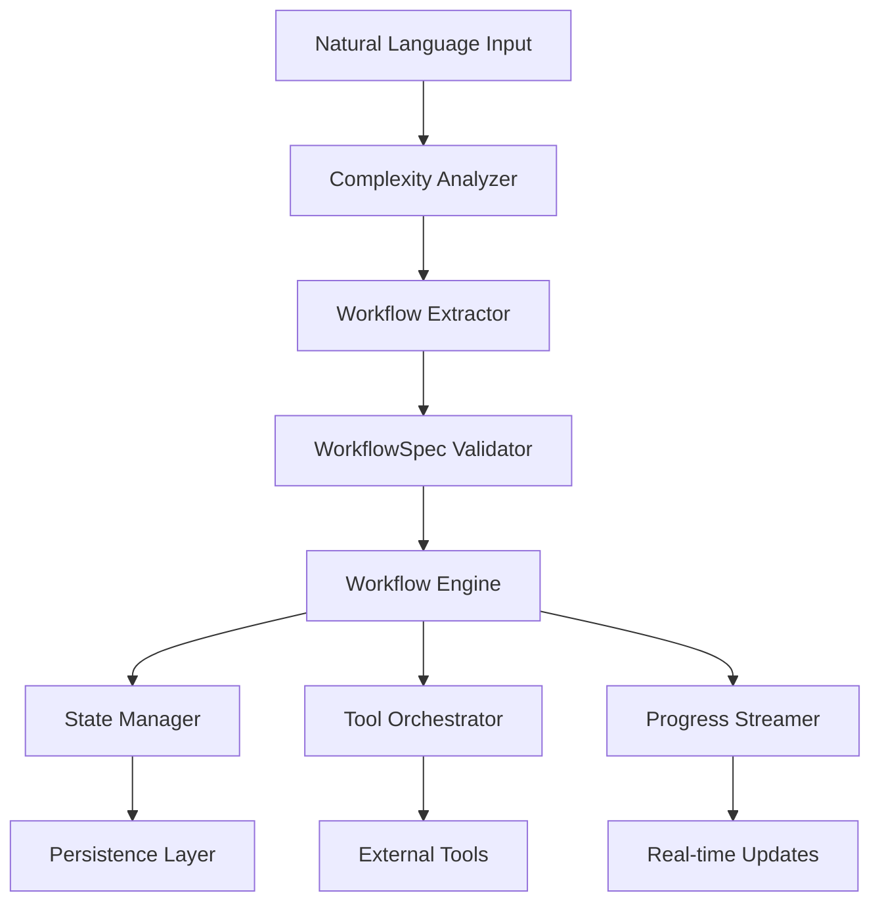

# Workflow Module - Design Guide

## 🎯 Purpose

The Workflow module converts natural language descriptions into executable multi-step task workflows and orchestrates their execution with real-time progress tracking and state persistence.

## 📋 Requirements

### Functional Requirements
1. **Natural Language Processing**: Convert user descriptions to structured workflow specifications
2. **Multi-Step Orchestration**: Execute complex workflows with multiple interconnected steps
3. **Real-Time Progress**: Provide streaming updates during workflow execution
4. **State Persistence**: Maintain workflow state across interruptions and failures
5. **Pattern-Based Processing**: Different workflow behaviors based on cognitive patterns
6. **Tool Integration**: Seamless integration with external tool providers

### Non-Functional Requirements
1. **Performance**: Workflow extraction <5s, execution latency <100ms between steps
2. **Reliability**: Automatic recovery from failures, graceful error handling
3. **Scalability**: Support workflows with 10-50 steps without performance degradation
4. **Maintainability**: Clear separation between extraction and execution logic

## 🏗️ Architecture Design

### Core Components



### Component Responsibilities

#### 1. Workflow Extractor
- **Purpose**: Convert natural language to structured WorkflowSpec
- **Input**: Natural language description + context
- **Output**: Validated WorkflowSpec with nodes and edges
- **Key Capabilities**:
  - Complexity analysis (simple/moderate/complex)
  - Mode detection (analytical/creative/problem-solving)
  - Structured output generation with validation

#### 2. Workflow Engine
- **Purpose**: Execute WorkflowSpec with state management and streaming
- **Input**: WorkflowSpec + initial state
- **Output**: Workflow results with execution path
- **Key Capabilities**:
  - Stateful execution with persistence
  - Streaming progress updates
  - Pattern-based node customization
  - Error recovery and retry logic

#### 3. State Manager
- **Purpose**: Maintain workflow execution state and enable recovery
- **Responsibilities**:
  - State persistence across failures
  - Checkpoint management
  - State transitions and validation
  - Context preservation

## 🔄 Data Flow

### 1. Extraction Flow
```
Natural Language → Complexity Analysis → Mode Detection → LLM Processing → WorkflowSpec → Validation → Executable Workflow
```

### 2. Execution Flow
```
WorkflowSpec → State Initialization → Node Execution → State Updates → Tool Integration → Progress Streaming → Final Results
```

## 📊 Interfaces and Contracts

### Core Interfaces

```typescript
// Workflow extraction interface
interface IWorkflowExtractor {
  extractWorkflow(input: string, context?: ProcessingContext): Promise<WorkflowExtractionResult>
  validateWorkflowSpec(spec: WorkflowSpec): Promise<boolean>
  getSupportedModes(): readonly WorkflowMode[]
}

// Workflow execution interface
interface IWorkflowEngine {
  createWorkflow(pattern: CognitivePattern, customizations?: WorkflowCustomization[]): ExecutableWorkflow
  execute(workflow: ExecutableWorkflow, initialState: WorkflowState): Promise<WorkflowResult>
  stream(workflow: ExecutableWorkflow, initialState: WorkflowState): AsyncIterableIterator<WorkflowStreamChunk>
  precompileWorkflows(patterns: readonly CognitivePattern[]): Promise<void>
}
```

### Data Structures

```typescript
// Workflow specification structure
interface WorkflowSpec {
  id: string
  name: string
  description: string
  nodes: WorkflowNodeSpec[]
  edges: WorkflowEdgeSpec[]
  parameters: Map<string, unknown>
}

// Node specification
interface WorkflowNodeSpec {
  id: string
  name: string
  type: 'input' | 'processing' | 'tool' | 'reasoning' | 'output' | 'decision' | 'validation'
  parameters: Map<string, unknown>
  requiredTools?: string[]
  dependencies?: string[]
}

// Workflow execution state
interface WorkflowState {
  input: string
  pattern: CognitivePattern
  domain: string
  context: Map<string, unknown>
  toolResults: ToolResult[]
  reasoningOutput: string
  output: string
  metadata: WorkflowMetadata
}
```

## 🧠 Cognitive Pattern System

### Pattern Types

#### 1. Analytical Pattern
- **Characteristics**: Systematic, methodical, structured approach
- **Workflow Behavior**: Sequential thinking → data analysis → synthesis
- **Use Cases**: Code analysis, system design, troubleshooting

#### 2. Creative Pattern  
- **Characteristics**: Innovative, experimental, flexible approach
- **Workflow Behavior**: Ideation → exploration → creative synthesis
- **Use Cases**: Architecture design, feature development, prototyping

#### 3. Problem-Solving Pattern
- **Characteristics**: Diagnostic, solution-focused, systematic resolution
- **Workflow Behavior**: Diagnostics → root cause analysis → solution generation
- **Use Cases**: Bug fixing, optimization, issue resolution

### Pattern Customization

```typescript
interface CognitivePattern {
  name: string
  description: string
  characteristics: readonly string[]
  workflowNodes: readonly string[]        // Pattern-specific nodes
  processingSequence: readonly string[]   // Execution order
  toolPreferences: readonly string[]      // Preferred tools
}
```

## 🔄 Workflow Execution Model

### Execution Phases

1. **Initialization Phase**
   - State setup and context enrichment
   - Pattern application and customization
   - Tool provider discovery

2. **Processing Phase**
   - Sequential/parallel node execution
   - Tool orchestration and integration
   - State updates and persistence

3. **Completion Phase**
   - Result synthesis and formatting
   - Final state persistence
   - Cleanup and resource management

### State Management

```typescript
interface WorkflowMetadata {
  startTime: number
  currentStage?: string
  processingSteps: string[]
  performance: Map<string, number>
}
```

## 🎯 Design Principles

### 1. Separation of Concerns
- **Extraction Logic**: Isolated from execution logic
- **Pattern Processing**: Separate from tool integration
- **State Management**: Independent of business logic

### 2. Composability
- **Node-Based Architecture**: Workflows composed of reusable nodes
- **Pattern Mixins**: Combine different cognitive approaches
- **Tool Agnostic**: Works with any tool provider implementation

### 3. Extensibility
- **Custom Nodes**: Easy addition of new node types
- **Pattern Extensions**: New cognitive patterns without core changes
- **Tool Integration**: Pluggable tool provider architecture

### 4. Reliability
- **State Persistence**: Survive failures and restarts
- **Error Recovery**: Graceful handling of node failures
- **Validation**: Comprehensive input and state validation

## 🔍 Quality Attributes

### Performance Requirements
- **Workflow Extraction**: <5 seconds for complex workflows
- **Node Execution**: <100ms latency between nodes
- **Memory Usage**: <50MB baseline + tool overhead
- **Concurrency**: Support 5 concurrent workflows

### Reliability Requirements
- **Availability**: 99.9% uptime during normal operation
- **Recovery**: Automatic recovery from transient failures
- **Data Integrity**: State consistency across failures
- **Error Handling**: Graceful degradation on tool failures

### Usability Requirements
- **Progress Visibility**: Real-time execution progress
- **Error Transparency**: Clear error messages and suggestions
- **Pattern Recognition**: Automatic pattern detection from input
- **Workflow Debugging**: Inspection of execution paths and state

## 🚀 Success Criteria

### Functional Success
- ✅ Successfully extract workflows from natural language (>85% accuracy)
- ✅ Execute multi-step workflows with tool integration
- ✅ Provide real-time progress updates and state persistence
- ✅ Support pattern-based workflow customization

### Technical Success
- ✅ Meet performance requirements under normal load
- ✅ Demonstrate reliability with error recovery
- ✅ Maintain clean separation between components
- ✅ Enable easy extension with new patterns and tools

This design provides the architectural foundation for a sophisticated workflow system that can understand natural language intent and execute complex multi-step processes with reliability and transparency.