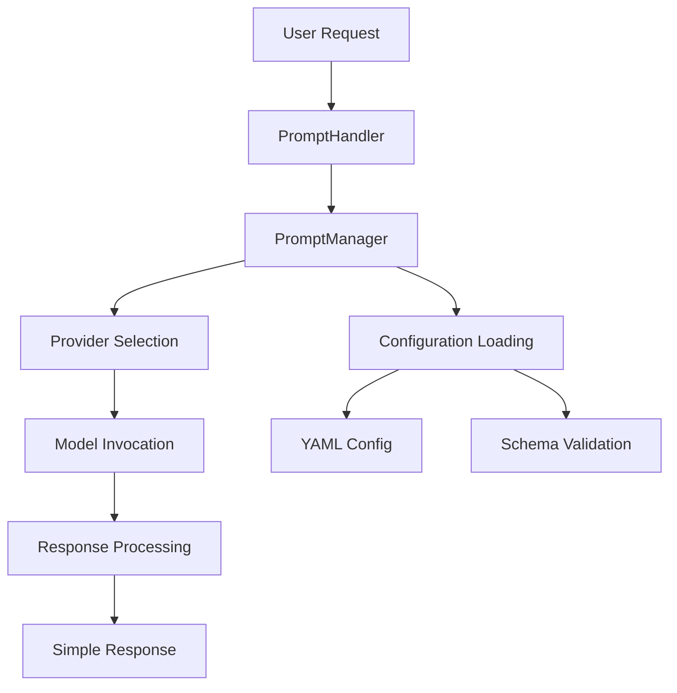

# Prompt Module - Design and Implementation Guide

## 🎯 Overview

The `@qi/prompt` module provides simple, user-friendly LLM interactions with multi-provider support. It abstracts away complex lib layer patterns and provides a clean promise-based API for prompt processing.

## 🏗️ Design Architecture

### Core Design Principles

1. **Simplicity First** - No complex Result<T> patterns, just promises
2. **Provider Agnostic** - Support multiple LLM providers (Ollama, OpenAI, etc.)
3. **Hide Complexity** - Abstract away qicore implementation details
4. **Easy Configuration** - YAML-based provider configuration
5. **Production Ready** - Error handling, timeouts, retry logic

### Module Structure

```
app/src/prompt/
├── interfaces/
│   ├── IPromptHandler.ts       # User-facing prompt interface
│   └── IPromptManager.ts       # Provider management interface
├── impl/
│   ├── DefaultPromptHandler.ts # Main prompt handler implementation
│   └── QiCorePromptManager.ts  # qicore integration layer
└── index.ts                    # Main exports and factory function
```

### Information Flow



## 🔧 Implementation Details

### 1. Core Interfaces

#### IPromptHandler Interface
```typescript
export interface IPromptHandler {
  complete(prompt: string, options?: PromptOptions): Promise<PromptResponse>
  getAvailableProviders(): Promise<ProviderInfo[]>
  validateProvider(providerId: string): Promise<boolean>
}
```

#### Prompt Response Types
```typescript
export type PromptResponse = 
  | { success: true; data: string }
  | { success: false; error: string }

export interface PromptOptions {
  provider?: string        // 'ollama', 'openai', etc.
  model?: string          // Model name
  temperature?: number    // 0.0 - 1.0
  maxTokens?: number      // Token limit
}
```

### 2. Implementation Strategy

#### A. DefaultPromptHandler

**Purpose**: Main user-facing implementation that coordinates prompt processing

```typescript
export class DefaultPromptHandler implements IPromptHandler {
  private manager: IPromptManager
  private isInitialized = false
  
  constructor(manager: IPromptManager) {
    this.manager = manager
  }
  
  async complete(prompt: string, options: PromptOptions = {}): Promise<PromptResponse> {
    try {
      // Validate inputs
      if (!prompt?.trim()) {
        return { success: false, error: 'Empty prompt provided' }
      }
      
      // Ensure initialization
      if (!this.isInitialized) {
        return { success: false, error: 'Handler not initialized' }
      }
      
      // Execute prompt with provider
      const result = await this.manager.executePrompt(prompt, {
        provider: options.provider || 'ollama',
        model: options.model,
        temperature: options.temperature || 0.7,
        maxTokens: options.maxTokens || 2048
      })
      
      // Convert qicore Result<T> to simple response
      if (result.success) {
        return { success: true, data: result.data }
      } else {
        return { success: false, error: result.error }
      }
      
    } catch (error) {
      return { 
        success: false, 
        error: error instanceof Error ? error.message : 'Unknown error' 
      }
    }
  }
}
```

#### B. QiCorePromptManager

**Purpose**: Integration layer that bridges user-friendly API with qicore complexity

```typescript
export class QiCorePromptManager implements IPromptManager {
  private configManager: LLMConfigManager | null = null
  private providers: Map<string, ILLMProvider> = new Map()
  
  async initialize(configPath: string, schemaPath: string): Promise<ProviderInitResult> {
    try {
      // Load and validate configuration
      const config = await this.loadConfiguration(configPath, schemaPath)
      
      // Initialize providers
      await this.initializeProviders(config)
      
      return { success: true }
    } catch (error) {
      return { 
        success: false, 
        error: `Initialization failed: ${error.message}` 
      }
    }
  }
  
  async executePrompt(prompt: string, options: PromptExecutionOptions): Promise<PromptResult> {
    const provider = this.providers.get(options.provider)
    if (!provider) {
      return { 
        success: false, 
        error: `Provider '${options.provider}' not available` 
      }
    }
    
    try {
      // Execute with provider
      const result = await provider.complete({
        messages: [{ role: 'user', content: prompt }],
        model: options.model,
        temperature: options.temperature,
        max_tokens: options.maxTokens
      })
      
      if (result.success) {
        return { 
          success: true, 
          data: result.data.content 
        }
      } else {
        return { 
          success: false, 
          error: result.error 
        }
      }
    } catch (error) {
      return { 
        success: false, 
        error: `Execution failed: ${error.message}` 
      }
    }
  }
}
```

### 3. Configuration System

#### YAML Configuration Format
```yaml
# config/llm-providers.yaml
providers:
  ollama:
    type: "ollama"
    baseUrl: "http://localhost:11434"
    timeout: 30000
    models:
      - name: "qwen2.5-coder:7b"
        default: true
        contextLength: 32768
      - name: "llama3.2:3b"
        contextLength: 8192
        
  openai:
    type: "openai"
    apiKey: "${OPENAI_API_KEY}"
    timeout: 60000
    models:
      - name: "gpt-4"
        contextLength: 8192
      - name: "gpt-3.5-turbo"
        default: true
        contextLength: 4096
```

#### JSON Schema Validation
```json
{
  "$schema": "http://json-schema.org/draft-07/schema#",
  "type": "object",
  "properties": {
    "providers": {
      "type": "object",
      "patternProperties": {
        "^[a-zA-Z][a-zA-Z0-9_-]*$": {
          "type": "object",
          "properties": {
            "type": { "type": "string", "enum": ["ollama", "openai"] },
            "baseUrl": { "type": "string", "format": "uri" },
            "timeout": { "type": "number", "minimum": 1000 },
            "models": {
              "type": "array",
              "items": {
                "type": "object",
                "properties": {
                  "name": { "type": "string" },
                  "default": { "type": "boolean" },
                  "contextLength": { "type": "number", "minimum": 1 }
                },
                "required": ["name"]
              }
            }
          },
          "required": ["type", "models"]
        }
      }
    }
  },
  "required": ["providers"]
}
```

### 4. Provider Implementation

#### Ollama Provider Integration
```typescript
class OllamaProvider implements ILLMProvider {
  private baseUrl: string
  private timeout: number
  
  async complete(request: LLMRequest): Promise<LLMResult> {
    try {
      const response = await fetch(`${this.baseUrl}/api/generate`, {
        method: 'POST',
        headers: { 'Content-Type': 'application/json' },
        body: JSON.stringify({
          model: request.model,
          prompt: request.messages[0].content,
          temperature: request.temperature,
          max_tokens: request.max_tokens,
          stream: false
        }),
        signal: AbortSignal.timeout(this.timeout)
      })
      
      if (!response.ok) {
        return { 
          success: false, 
          error: `Ollama error: ${response.status} ${response.statusText}` 
        }
      }
      
      const data = await response.json()
      return { 
        success: true, 
        data: { content: data.response, usage: data.usage } 
      }
      
    } catch (error) {
      return { 
        success: false, 
        error: error instanceof Error ? error.message : 'Unknown error' 
      }
    }
  }
}
```

### 5. Factory Function Design

#### Simple Factory with Auto-Configuration
```typescript
export function createPromptHandler(): DefaultPromptHandler {
  const manager = new QiCorePromptManager()
  return new DefaultPromptHandler(manager)
}
```

**Usage Pattern**:
```typescript
const handler = createPromptHandler()

// Initialize with configuration files
const initResult = await handler.initialize(
  'config/llm-providers.yaml',
  'config/llm-providers.schema.json'
)

if (initResult.success) {
  // Ready to use
  const response = await handler.complete('Hello, world!', { 
    provider: 'ollama' 
  })
  
  if (response.success) {
    console.log(response.data)
  }
}
```

## 📊 Performance & Reliability

### Error Handling Strategy

1. **Input Validation**: Check for empty prompts, invalid options
2. **Provider Validation**: Verify provider availability before use
3. **Network Timeouts**: Configurable timeouts per provider
4. **Graceful Degradation**: Fallback to different providers if needed
5. **Clear Error Messages**: User-friendly error descriptions

### Performance Characteristics

- **Initialization Time**: ~100ms (config loading + provider setup)
- **Provider Switching**: <1ms (in-memory provider map)
- **Network Latency**: Depends on provider (Ollama ~100ms local, OpenAI ~500ms)
- **Memory Usage**: ~10MB baseline + provider-specific overhead

### Reliability Features

```typescript
// Retry logic example
async function executeWithRetry(
  operation: () => Promise<PromptResponse>,
  maxRetries: number = 3
): Promise<PromptResponse> {
  for (let attempt = 1; attempt <= maxRetries; attempt++) {
    try {
      const result = await operation()
      if (result.success) return result
      
      if (attempt === maxRetries) return result
      
      // Exponential backoff
      await new Promise(resolve => 
        setTimeout(resolve, Math.pow(2, attempt) * 1000)
      )
    } catch (error) {
      if (attempt === maxRetries) {
        return { success: false, error: error.message }
      }
    }
  }
}
```

## 🔍 Key Design Decisions

### 1. Why Hide qicore Complexity?

**Problem**: qicore uses Result<T> patterns that are unfamiliar to most developers
**Solution**: Provide simple promise-based API that converts internally

```typescript
// qicore style (complex)
const result = await provider.complete(request)
result.match(
  (data) => console.log(data),
  (error) => console.error(error)
)

// @qi/prompt style (simple)
const response = await handler.complete(prompt)
if (response.success) {
  console.log(response.data)
} else {
  console.error(response.error)
}
```

### 2. Why YAML Configuration?

- **Human Readable**: Easy to edit and understand
- **Environment Variables**: Built-in support for ${ENV_VAR} substitution
- **Schema Validation**: JSON Schema provides validation
- **Version Control Friendly**: Diff-friendly format

### 3. Why Provider Abstraction?

- **Future Proofing**: Easy to add new providers (Anthropic, Google, etc.)
- **Local Development**: Switch between local (Ollama) and cloud providers
- **Cost Management**: Control which providers are used
- **Fallback Logic**: Automatic failover between providers

## 🚀 Usage Examples

### Basic Usage
```typescript
import { createPromptHandler } from '@qi/prompt'

async function basicExample() {
  const handler = createPromptHandler()
  
  // Initialize
  await handler.initialize('config/llm-providers.yaml', 'config/schema.json')
  
  // Simple prompt
  const response = await handler.complete('Explain async/await in JavaScript')
  
  if (response.success) {
    console.log(response.data)
  } else {
    console.error('Error:', response.error)
  }
}
```

### Advanced Configuration
```typescript
async function advancedExample() {
  const handler = createPromptHandler()
  await handler.initialize('config/llm-providers.yaml', 'config/schema.json')
  
  // With specific provider and model
  const response = await handler.complete(
    'Write a quicksort function in Python',
    {
      provider: 'ollama',
      model: 'qwen2.5-coder:7b',
      temperature: 0.3,
      maxTokens: 1024
    }
  )
  
  console.log(response.success ? response.data : response.error)
}
```

### Provider Management
```typescript
async function providerExample() {
  const handler = createPromptHandler()
  await handler.initialize('config/llm-providers.yaml', 'config/schema.json')
  
  // Check available providers
  const providers = await handler.getAvailableProviders()
  console.log('Available providers:', providers)
  
  // Validate specific provider
  const isOllamaAvailable = await handler.validateProvider('ollama')
  console.log('Ollama available:', isOllamaAvailable)
}
```

## 🧪 Testing Strategy

### Unit Tests
- Test PromptHandler with mock PromptManager
- Test configuration loading and validation
- Test error handling and edge cases

### Integration Tests
- Test with real Ollama instance
- Test provider switching and fallback
- Test timeout and retry logic

### Configuration Tests
- Test various YAML configurations
- Test schema validation with invalid configs
- Test environment variable substitution

## 🔮 Future Enhancements

### 1. Advanced Features
- **Streaming Responses**: Real-time token streaming
- **Conversation Context**: Multi-turn conversations
- **Template System**: Reusable prompt templates
- **Response Caching**: Cache responses for repeated prompts

### 2. Additional Providers
- **Anthropic Claude**: API integration
- **Google Gemini**: Vertex AI integration
- **Azure OpenAI**: Enterprise OpenAI access
- **Local Models**: Transformers.js for browser use

### 3. Performance Optimizations
- **Connection Pooling**: Reuse HTTP connections
- **Request Batching**: Combine multiple prompts
- **Smart Fallbacks**: Automatic provider selection based on performance

This design provides a clean, simple interface for LLM interactions while maintaining the flexibility to integrate with complex backend systems.