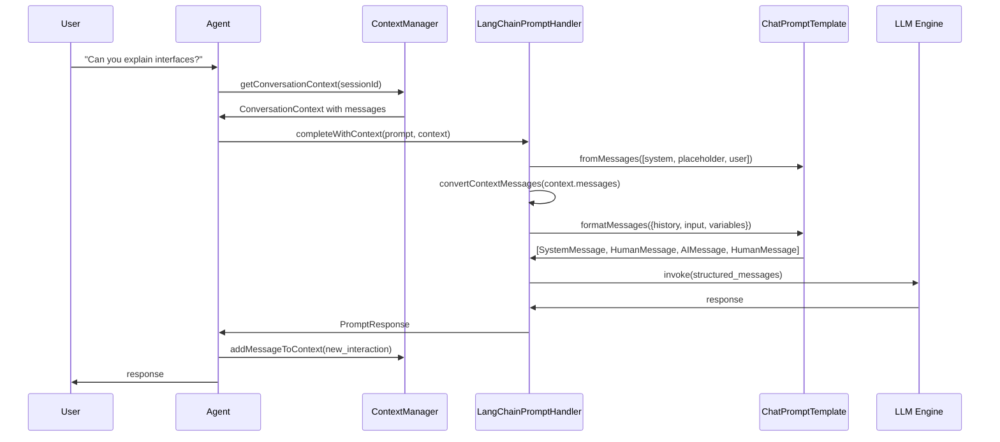
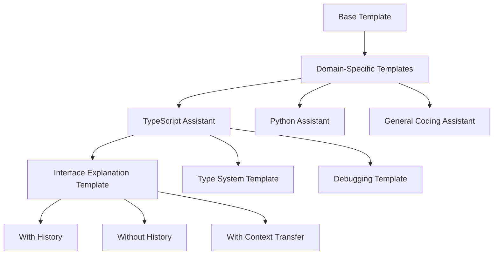
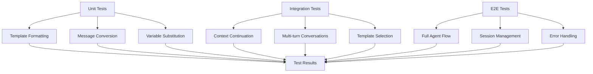

# Prompt System Flow Diagrams

## Current Implementation (String Concatenation)

```mermaid
graph TD
    A[User Input: "Can you explain interfaces?"] --> B[Context Manager]
    B --> C[Get Conversation History]
    C --> D[ContextAwarePromptHandler.buildPromptWithHistory()]
    D --> E[String Concatenation]
    E --> F["Previous conversation:\nuser: Hello, I'm learning TypeScript\nassistant: Mock response...\nCurrent request: Can you explain interfaces?"]
    F --> G[multi-llm-ts Engine]
    G --> H[Raw String to LLM]
    H --> I[LLM Response]
    
    style E fill:#ffcccc
    style F fill:#ffcccc
    style H fill:#ffcccc
```

**Problems with Current Flow**:
- ❌ Simple string concatenation loses message structure
- ❌ No proper system prompts or formatting
- ❌ LLM receives poorly formatted context
- ❌ Limited template flexibility

## Proper Implementation (LangChain Templates)

```mermaid
graph TD
    A[User Input: "Can you explain interfaces?"] --> B[Context Manager]
    B --> C[Get Conversation History as ContextMessage[]]
    C --> D[LangChainPromptHandler]
    D --> E[ChatPromptTemplate.fromMessages()]
    E --> F[Convert ContextMessages to LangChain Messages]
    F --> G[HumanMessage, AIMessage objects]
    G --> H[Template.formatMessages() with variables]
    H --> I[Structured Message Array]
    I --> J[SystemMessage, HumanMessage, AIMessage sequence]
    J --> K[multi-llm-ts Engine]
    K --> L[Properly Formatted Messages to LLM]
    L --> M[LLM Response]
    
    style E fill:#ccffcc
    style I fill:#ccffcc
    style J fill:#ccffcc
    style L fill:#ccffcc
```

**Benefits of Proper Flow**:
- ✅ Structured message objects preserve context
- ✅ System prompts provide proper instructions
- ✅ Template variables enable dynamic content
- ✅ Industry-standard prompt engineering

## Message Structure Comparison

### Current Format (String)
```
Previous conversation:
user: Hello, I'm learning TypeScript
assistant: Mock response to: "Hello, I'm learning TypeScript"...
Current request: Can you explain interfaces?
```

### Proper Format (LangChain Messages)
```typescript
[
  SystemMessage({
    content: "You are an AI coding assistant specialized in TypeScript. Current context: conversation"
  }),
  HumanMessage({
    content: "Hello, I'm learning TypeScript"
  }),
  AIMessage({
    content: "Great! I'd be happy to help you learn TypeScript. What specific aspect would you like to start with?"
  }),
  HumanMessage({
    content: "Can you explain interfaces?"
  })
]
```

## Template System Architecture

```mermaid
graph LR
    A[Template Definition] --> B[ChatPromptTemplate]
    C[Context Variables] --> D[Template Variables]
    E[Conversation History] --> F[MessagesPlaceholder]
    G[User Input] --> H[Current Message]
    
    B --> I[Template.formatMessages()]
    D --> I
    F --> I
    H --> I
    
    I --> J[Formatted Message Array]
    J --> K[LLM Engine]
```

## Context Integration Flow



## Template Hierarchy Design



## Migration Strategy Visualization

```mermaid
gantt
    title Prompt System Migration Timeline
    dateFormat  YYYY-MM-DD
    section Phase 1: Foundation
    Install LangChain deps          :done, dep, 2025-07-31, 1d
    Create LangChainPromptHandler   :active, handler, 2025-08-01, 2d
    Update ContextAwarePrompting    :pending, context, after handler, 2d
    Test basic functionality        :pending, test1, after context, 1d
    
    section Phase 2: Enhancement
    Domain-specific templates       :pending, templates, after test1, 3d
    Variable management system      :pending, variables, after templates, 2d
    System message strategies       :pending, system, after variables, 2d
    
    section Phase 3: Advanced
    Template composition            :pending, composition, after system, 3d
    Dynamic template selection      :pending, dynamic, after composition, 2d
    Performance optimization        :pending, perf, after dynamic, 2d
```

## Testing Strategy



This visual representation clearly shows why the current string concatenation approach is inadequate and how LangChain's structured message system provides a much better foundation for context-aware prompting.