# Agentic Workflows: Formal Definition & Architecture

## Formal Definition

### Mathematical Definition

An **Agentic Workflow** is a computational system `A = (S, T, P, M, E)` where:

- `S` = Set of states representing workflow progress
- `T` = Set of tools/actions available to agents
- `P` = Planning function that decomposes complex tasks
- `M` = Memory system for context retention
- `E` = Evaluation function for self-assessment and iteration

### Operational Definition

**Agentic Workflow**: An AI-driven process where autonomous agents make dynamic decisions, execute actions, and coordinate tasks with minimal human intervention through iterative reasoning loops.

**Key Characteristics**:
1. **Dynamic Control Flow**: Non-predetermined execution paths
2. **Autonomous Decision Making**: Agents choose next actions based on context
3. **Iterative Refinement**: Self-evaluation and improvement cycles
4. **Tool Integration**: External system interaction capabilities
5. **Memory Persistence**: Context retention across iterations

## Core Architecture: The Agent Loop

### Basic Agent Loop Pattern

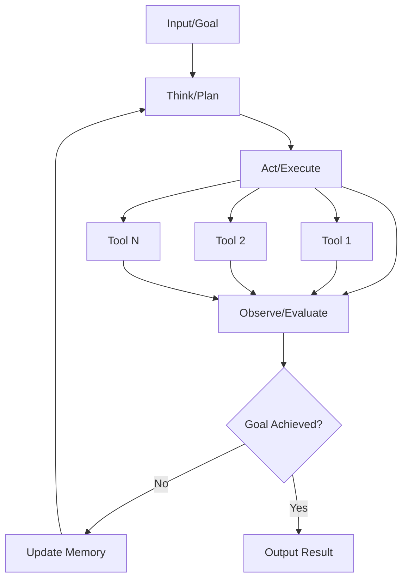

### Formal Agent Loop Algorithm

```
function AgentLoop(goal, tools, memory):
    state = initial_state(goal)
    
    while not goal_achieved(state):
        # Think Phase
        plan = planning_function(state, memory, goal)
        
        # Act Phase
        action = select_action(plan, tools)
        result = execute_action(action, tools)
        
        # Observe Phase
        observation = evaluate_result(result, goal)
        state = update_state(state, observation)
        memory = update_memory(memory, action, result, observation)
        
        # Reflection Phase
        if should_iterate(observation, goal):
            continue
        else:
            break
    
    return finalize_result(state, memory)
```

## Architectural Paradigms Comparison

### One-Shot Paradigm Architecture

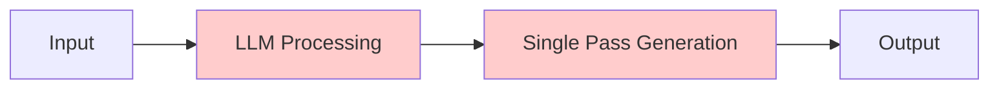

**Characteristics**:
- Linear execution flow
- No feedback loops
- No self-correction
- Single attempt at solution
- No tool interaction

### Agentic Workflow Architecture

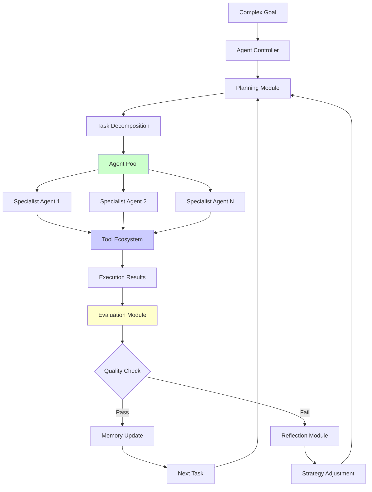

## Core Design Patterns

### 1. Reflection Pattern Architecture

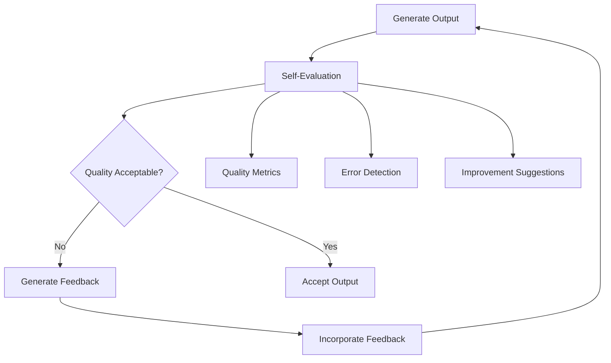

**Implementation**:
```typescript
interface ReflectionCycle<T> {
  generate(): Promise<T>;
  evaluate(output: T): Promise<EvaluationResult>;
  improve(output: T, feedback: Feedback): Promise<T>;
  shouldIterate(evaluation: EvaluationResult): boolean;
}
```

### 2. Tool Use Pattern Architecture

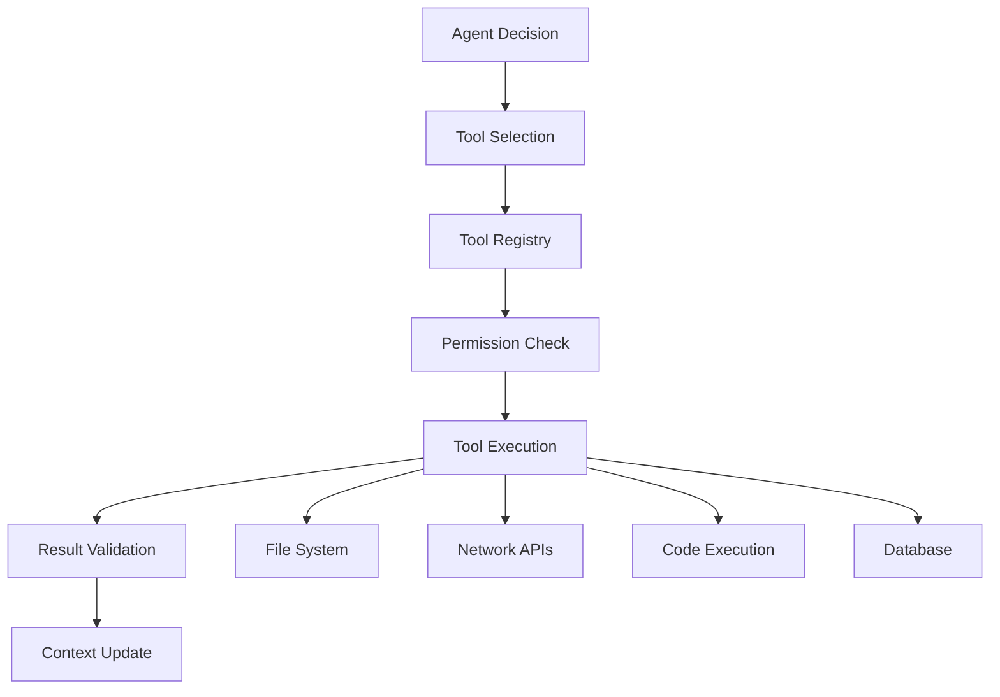

**Implementation**:
```typescript
interface ToolUsePattern {
  selectTool(context: Context, goal: Goal): Tool;
  validatePermissions(tool: Tool, context: Context): boolean;
  executeWithSafety(tool: Tool, params: any): Promise<ToolResult>;
  integrateResult(result: ToolResult, context: Context): Context;
}
```

### 3. Planning Pattern Architecture

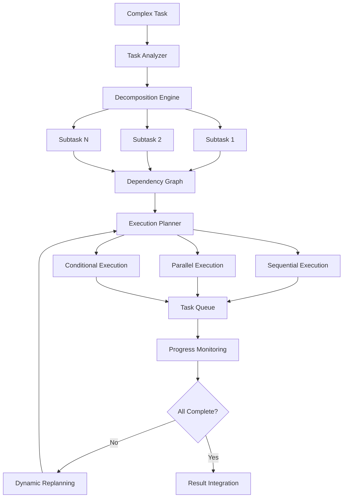

### 4. Multi-Agent Collaboration Architecture

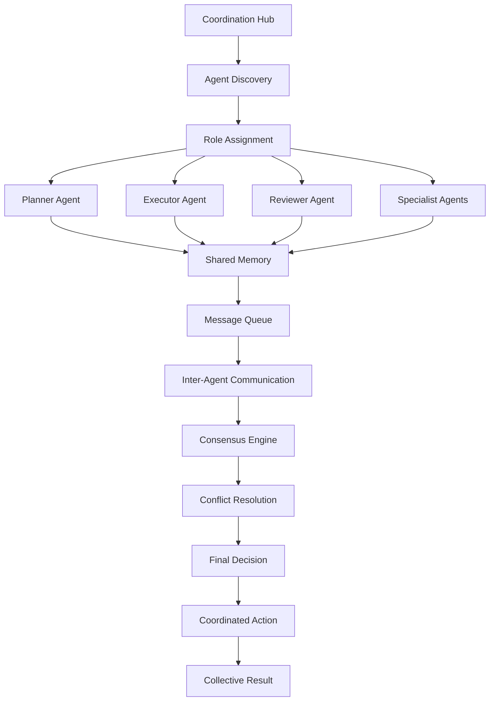

## Memory Architecture

### Three-Tier Memory System

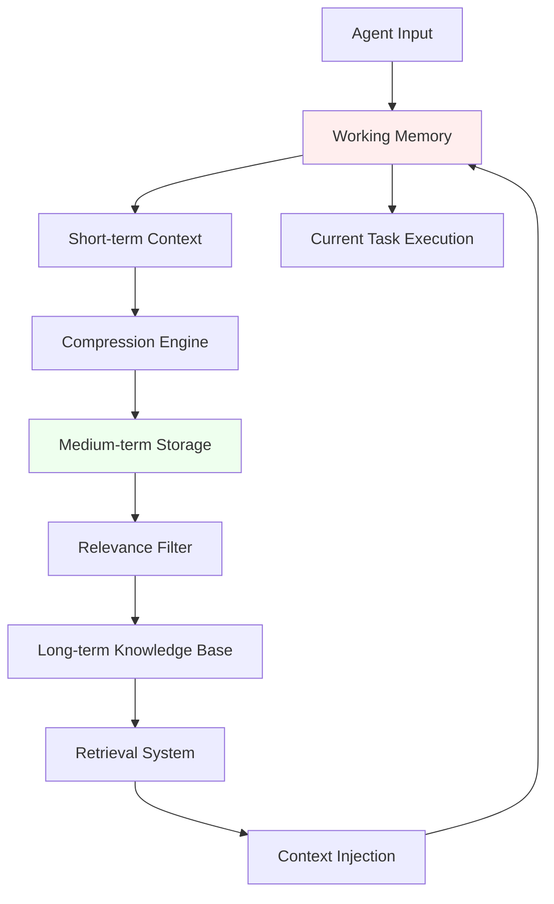

**Memory Types**:
- **Working Memory**: Active context for current task (limited capacity)
- **Episodic Memory**: Compressed session history and learnings
- **Semantic Memory**: Persistent knowledge and learned patterns

## Control Flow Patterns

### Router Pattern

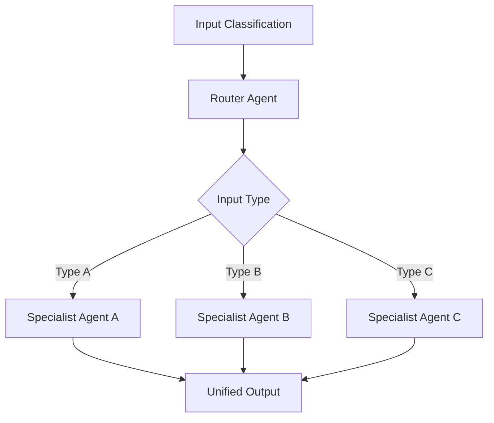

### Evaluator-Optimizer Pattern

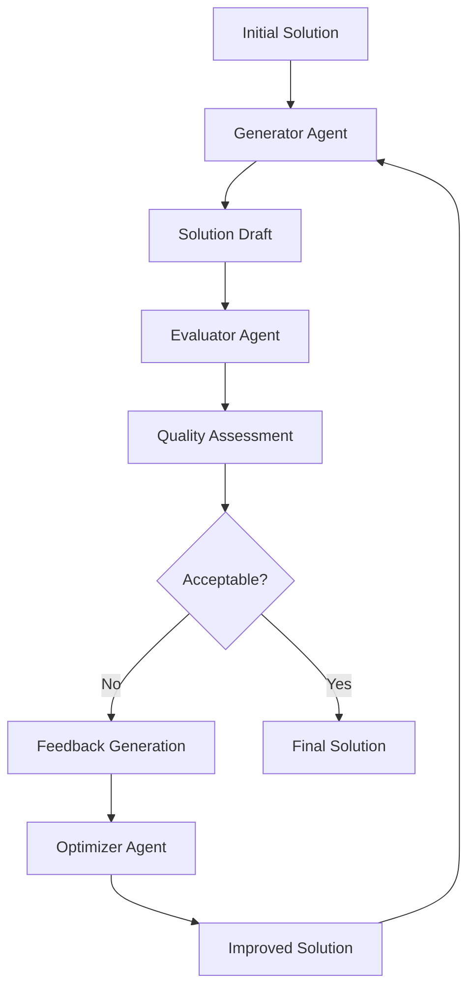

### Orchestrator-Worker Pattern

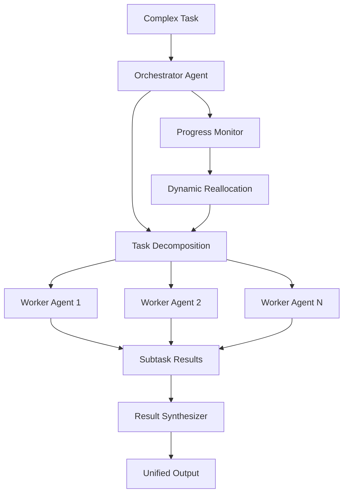

## Implementation Framework

### Core Components Interface

```typescript
interface AgenticWorkflow {
  // Core Loop
  execute(goal: Goal): Promise<Result>;
  
  // Agent Management
  registerAgent(agent: Agent): void;
  createSpecializedAgent(role: Role, capabilities: Capability[]): Agent;
  
  // Memory System
  memory: MemoryManager;
  
  // Tool Integration
  toolRegistry: ToolRegistry;
  
  // Planning & Execution
  planner: TaskPlanner;
  executor: TaskExecutor;
  
  // Evaluation & Reflection
  evaluator: QualityEvaluator;
  reflector: SelfReflectionEngine;
}

interface Agent {
  id: string;
  role: Role;
  capabilities: Capability[];
  
  think(context: Context): Promise<Plan>;
  act(plan: Plan, tools: Tool[]): Promise<ActionResult>;
  observe(result: ActionResult): Promise<Observation>;
  reflect(observations: Observation[]): Promise<Reflection>;
}
```

## Quality Metrics

### Performance Indicators

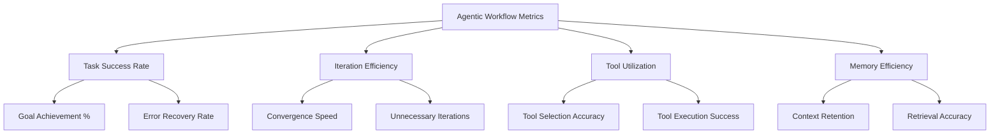

### Comparison Metrics: One-Shot vs Agentic

| Metric | One-Shot | Agentic Workflow |
|--------|----------|------------------|
| **Success Rate** | 48-67% | 90-95% |
| **Error Recovery** | 0% | 80-90% |
| **Complex Task Handling** | Poor | Excellent |
| **Resource Efficiency** | High | Medium |
| **Adaptation Capability** | None | High |
| **Learning Over Time** | None | Progressive |

## Formal Properties

### Convergence Guarantees

**Theorem**: An agentic workflow with proper termination conditions and bounded iteration limits will converge to a solution or explicit failure state.

**Proof Sketch**: 
- Finite state space with progress metrics
- Monotonic improvement through reflection
- Bounded iteration prevents infinite loops
- Explicit termination criteria ensure convergence

### Optimality Conditions

**Definition**: An agentic workflow achieves *ε-optimality* if the final solution quality is within ε of the theoretical optimum given the available tools and context.

**Factors affecting optimality**:
- Quality of evaluation functions
- Comprehensiveness of tool ecosystem
- Effectiveness of reflection mechanisms
- Adequacy of memory system

This formal framework provides the theoretical foundation for implementing high-performance agentic systems that can reliably outperform one-shot approaches on complex tasks.

---

## References

1. Russell, S., & Norvig, P. (2020). *Artificial Intelligence: A Modern Approach* (4th ed.). Pearson.

2. Yao, S., et al. (2022). "ReAct: Synergizing Reasoning and Acting in Language Models." *arXiv preprint arXiv:2210.03629*.

3. Shinn, N., et al. (2023). "Reflexion: Language Agents with Verbal Reinforcement Learning." *arXiv preprint arXiv:2303.11366*.

4. Wang, L., et al. (2023). "Plan-and-Solve Prompting: Improving Zero-Shot Chain-of-Thought Reasoning." *arXiv preprint arXiv:2305.04091*.

5. Wu, Q., et al. (2023). "AutoGen: Enabling Next-Gen LLM Applications via Multi-Agent Conversation." *arXiv preprint arXiv:2308.08155*.

6. Xi, Z., et al. (2023). "The Rise and Potential of Large Language Model Based Agents: A Survey." *arXiv preprint arXiv:2309.07864*.

7. Park, J. S., et al. (2023). "Generative Agents: Interactive Simulacra of Human Behavior." *ACM User Interface Software and Technology Symposium*.

8. Chase, H. (2022). "LangChain: Building Applications with LLMs through Composability." GitHub Repository.

9. Liu, J., et al. (2023). "AgentBench: Evaluating LLMs as Agents." *arXiv preprint arXiv:2308.03688*.

10. Qian, C., et al. (2023). "Communicative Agents for Software Development." *arXiv preprint arXiv:2307.07924*.

11. Anthropic. (2024). "Constitutional AI: Harmlessness from AI Feedback." *arXiv preprint arXiv:2212.08073*.

12. OpenAI. (2023). "GPT-4 Technical Report." *arXiv preprint arXiv:2303.08774*.

13. Finn, C., Abbeel, P., & Levine, S. (2017). "Model-Agnostic Meta-Learning for Fast Adaptation of Deep Networks." *International Conference on Machine Learning*.

14. Lake, B. M., et al. (2015). "Human-level concept learning through probabilistic program induction." *Science*, 350(6266), 1332-1338.

15. Silver, D., et al. (2016). "Mastering the game of Go with deep neural networks and tree search." *Nature*, 529(7587), 484-489.