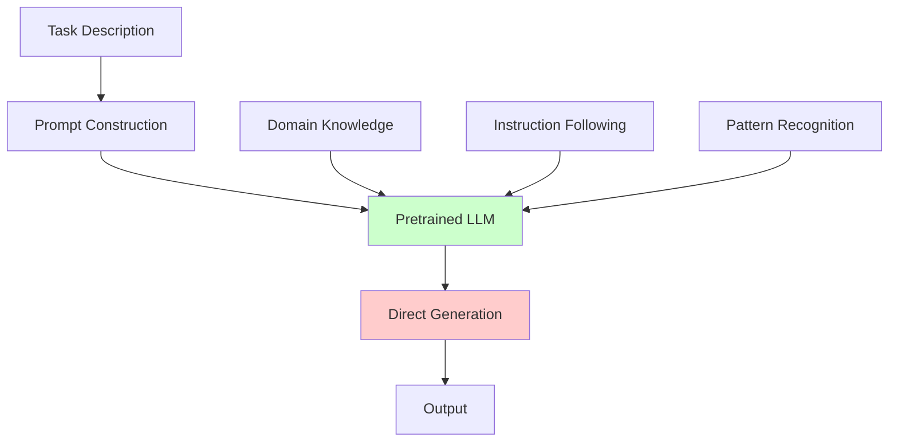
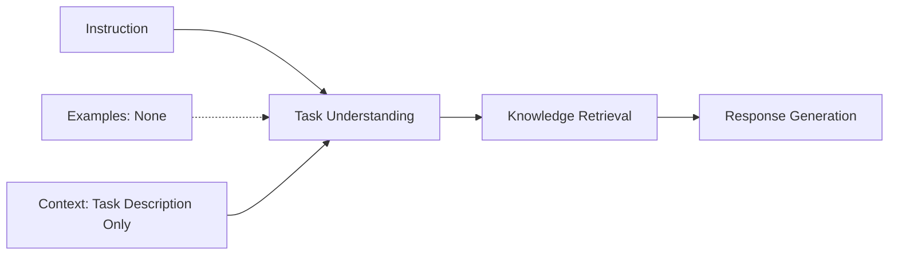
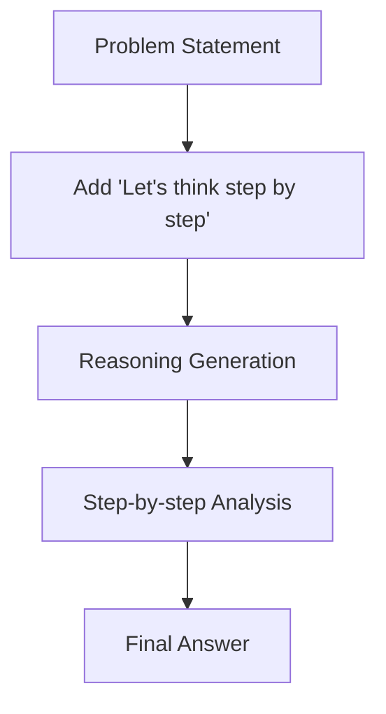
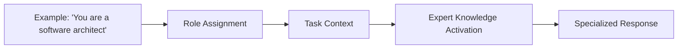
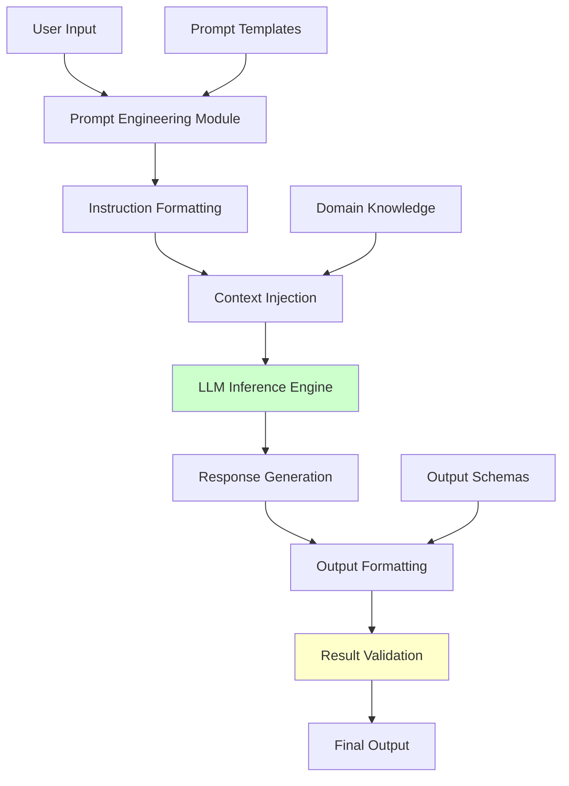

# Zero-Shot Learning: Architecture, Design, and Research Foundations

## Formal Definition and Mathematical Framework

### Mathematical Definition

**Zero-Shot Learning (ZSL)** is a computational paradigm where a model `M` performs task `T` without any task-specific training examples:

```
M: X → Y, where |DT| = 0
```

Where:
- `X` = Input space
- `Y` = Output space  
- `DT` = Training dataset for task T (empty set)
- Model relies solely on pre-training knowledge and task description

### Theoretical Foundation

Zero-shot learning leverages **transfer learning** and **emergent capabilities** from large-scale pre-training:

**Transfer Function**: `F: Zpre → ZT`
- `Zpre` = Knowledge from pre-training
- `ZT` = Task-specific knowledge (induced)

## Architecture Patterns

### Core Zero-Shot Architecture



**Key Components**:
1. **Task Description**: Natural language specification of the desired behavior
2. **Prompt Construction**: Structured input formatting
3. **Pretrained Knowledge**: Emergent capabilities from large-scale training
4. **Direct Generation**: Single-pass inference without iteration

### Zero-Shot Design Patterns

#### 1. Instruction Following Pattern



**Implementation**:
```typescript
interface ZeroShotPattern {
  instruction: string;
  context?: string;
  constraints?: string[];
  outputFormat?: string;
}

// Example
const zeroShotPrompt: ZeroShotPattern = {
  instruction: "Classify the sentiment of the following text",
  context: "Text: 'I love this product!'",
  outputFormat: "positive, negative, or neutral"
};
```

#### 2. Chain-of-Thought Zero-Shot Pattern



**Research Foundation**: Kojima et al. (2022) - "Large Language Models are Zero-Shot Reasoners"

#### 3. Role-Based Zero-Shot Pattern



## Research-Backed Performance Analysis

### Benchmark Performance Studies

#### MMLU (Massive Multitask Language Understanding)

**Dataset**: 15,000+ multiple-choice questions across 57 subjects
**Evaluation**: Exclusively zero-shot and few-shot settings

| Model | Zero-Shot MMLU | Few-Shot MMLU | Improvement |
|-------|----------------|---------------|-------------|
| GPT-3 | 43.9% | 53.5% | +9.6% |
| GPT-4 | 86.4% | 86.5% | +0.1% |
| Claude-3 | 84.9% | 85.2% | +0.3% |

**Key Finding**: Larger models show diminishing returns from few-shot examples on MMLU.

#### HellaSwag (Commonsense Reasoning)

**Dataset**: 10,000 sentence completion tasks
**Evaluation**: Common-sense reasoning capability

| Approach | Accuracy | Notes |
|----------|----------|-------|
| Pre-training only | <50% | Baseline performance |
| GPT-4 Zero-Shot | 87.3% | Substantial improvement |
| GPT-4 10-Shot | 95.3% | Record performance |

#### HumanEval (Code Generation)

**Zero-Shot Coding Performance**:
- GPT-3.5: 48.1% pass@1
- GPT-4: 67.0% pass@1
- CodeLlama-34B: 53.7% pass@1

### Medical Domain Research (2024)

**Study**: OpenMedLM prompt engineering vs fine-tuning
**Key Findings**:
- Zero-shot with prompt engineering: 72.6% on MedQA
- First open-source LLM to exceed 80% on MMLU medical subset
- **Conclusion**: Prompt engineering can outperform fine-tuning

## Architectural Advantages and Limitations

### Advantages

1. **No Training Data Required**
   - Immediate deployment capability
   - No domain-specific annotation costs
   - Rapid prototyping and testing

2. **Generalization Capability**
   - Handles novel tasks without retraining
   - Leverages broad pre-training knowledge
   - Cross-domain transfer learning

3. **Computational Efficiency**
   - Single inference pass
   - No additional training overhead
   - Minimal computational resources

4. **Emergent Reasoning**
   - Complex reasoning from simple instructions
   - Pattern recognition across domains
   - Abstract concept understanding

### Limitations

1. **Performance Ceiling**
   - Limited by pre-training knowledge
   - No task-specific optimization
   - Potential accuracy gaps vs. specialized models

2. **Prompt Sensitivity**
   - High dependence on prompt quality
   - Inconsistent performance across phrasings
   - Requires prompt engineering expertise

3. **Domain Constraints**
   - Struggles with highly specialized domains
   - Limited by training data coverage
   - May hallucinate in unfamiliar contexts

## Implementation Framework

### Zero-Shot System Architecture



### Core Components Interface

```typescript
interface ZeroShotSystem {
  // Core components
  promptEnginer: PromptEngine;
  llmInference: LLMInferenceEngine;
  validator: OutputValidator;
  
  // Execution
  execute(task: Task, input: Input): Promise<Output>;
  
  // Configuration
  configurePrompts(templates: PromptTemplate[]): void;
  setValidationRules(rules: ValidationRule[]): void;
}

interface PromptEngine {
  constructPrompt(task: Task, input: Input): Prompt;
  optimizeForTask(task: Task): PromptTemplate;
  addChainOfThought(): PromptModifier;
}

interface LLMInferenceEngine {
  generate(prompt: Prompt): Promise<RawOutput>;
  setTemperature(temp: number): void;
  setMaxTokens(tokens: number): void;
}
```

## Design Principles and Best Practices

### 1. Prompt Engineering Principles

**Clarity and Specificity**:
```
❌ "Analyze this"
✅ "Analyze the sentiment of this product review and classify it as positive, negative, or neutral"
```

**Structured Instructions**:
```
Task: [Clear description]
Input: [Formatted input]
Output Format: [Specific format requirements]
Constraints: [Any limitations or requirements]
```

**Chain-of-Thought Integration**:
```
"Let's approach this step by step:
1. [Analysis step]
2. [Reasoning step] 
3. [Conclusion step]"
```

### 2. Performance Optimization Strategies

**Model Selection Criteria**:
- Larger models generally perform better in zero-shot settings
- Instruction-tuned models excel at following novel instructions
- Domain-specific models may outperform general models

**Prompt Optimization**:
- A/B testing different prompt formulations
- Using role-based prompting for domain expertise
- Incorporating output format specifications

### 3. Evaluation and Validation

**Multi-Dimensional Assessment**:
```typescript
interface ZeroShotEvaluation {
  accuracy: number;
  consistency: number;
  relevance: number;
  hallucination_rate: number;
  response_quality: QualityMetrics;
}
```

**Benchmark Comparisons**:
- MMLU for knowledge understanding
- HellaSwag for commonsense reasoning
- HumanEval for code generation
- BigBench for diverse task evaluation

## Recent Research Developments (2024)

### Prompt Engineering Advances

**Reynolds & McDonell (2021) Extended Analysis**:
- Improved prompt structures can make zero-shot outperform few-shot
- Task-specific prompt optimization crucial for performance

**Schulhoff et al. (2024) Comparative Study**:
- Systematic comparison of prompting strategies
- Context-dependent performance variations
- No universal "best" approach

### Emergent Capabilities Research

**Medical Domain Breakthroughs**:
- First open-source model to exceed 80% on MMLU medical
- Prompt engineering achieving state-of-the-art results
- Validation of zero-shot capabilities in specialized domains

**Chain-of-Thought Evolution**:
- Zero-shot CoT consistently improves reasoning tasks
- Simple trigger phrases ("Let's think step by step") provide substantial gains
- Scaling laws favor zero-shot reasoning in larger models

## Future Research Directions

### 1. Architectural Improvements

- **Retrieval-Augmented Zero-Shot**: Combining zero-shot with external knowledge
- **Multi-Modal Zero-Shot**: Extending to vision and audio domains
- **Compositional Zero-Shot**: Handling complex multi-step tasks

### 2. Evaluation Methodologies

- **Robustness Testing**: Performance across prompt variations
- **Domain Transfer Studies**: Cross-domain generalization analysis
- **Scaling Law Analysis**: Zero-shot performance vs. model size

### 3. Practical Applications

- **Real-Time Systems**: Low-latency zero-shot inference
- **Edge Computing**: Efficient zero-shot on resource-constrained devices
- **Human-AI Collaboration**: Zero-shot as rapid prototyping tool

## Conclusion

Zero-shot learning represents a fundamental paradigm in modern AI systems, enabling immediate task performance without task-specific training. Research consistently demonstrates that while zero-shot approaches may not always achieve the highest absolute performance, they provide unmatched flexibility, efficiency, and generalization capabilities.

The architecture is characterized by its simplicity and directness, making it ideal for rapid deployment and prototyping scenarios. However, performance is heavily dependent on prompt engineering quality and model capabilities, requiring careful design and optimization for production applications.

---

## References

1. Kojima, T., Gu, S. S., Reid, M., Matsuo, Y., & Iwasawa, Y. (2022). Large Language Models are Zero-Shot Reasoners. *arXiv preprint arXiv:2205.11916*.

2. Reynolds, L., & McDonell, K. (2021). Prompt Programming for Large Language Models: Beyond the Few-Shot Paradigm. *Extended Mind Workshop*.

3. Schulhoff, S., et al. (2024). The Prompt Report: A Systematic Survey of Prompting Techniques. *arXiv preprint*.

4. Wang, T., et al. (2024). OpenMedLM: prompt engineering can out-perform fine-tuning in medical question-answering. *Scientific Reports*, 14, 14827.

5. Brown, T., et al. (2020). Language Models are Few-Shot Learners. *Advances in Neural Information Processing Systems*, 33.

6. Hendrycks, D., et al. (2020). Measuring Massive Multitask Language Understanding. *arXiv preprint arXiv:2009.03300*.

7. Zellers, R., et al. (2019). HellaSwag: Can a Machine Really Finish Your Sentence? *Proceedings of the 57th Annual Meeting of the Association for Computational Linguistics*.