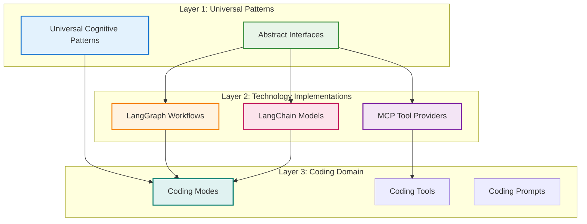
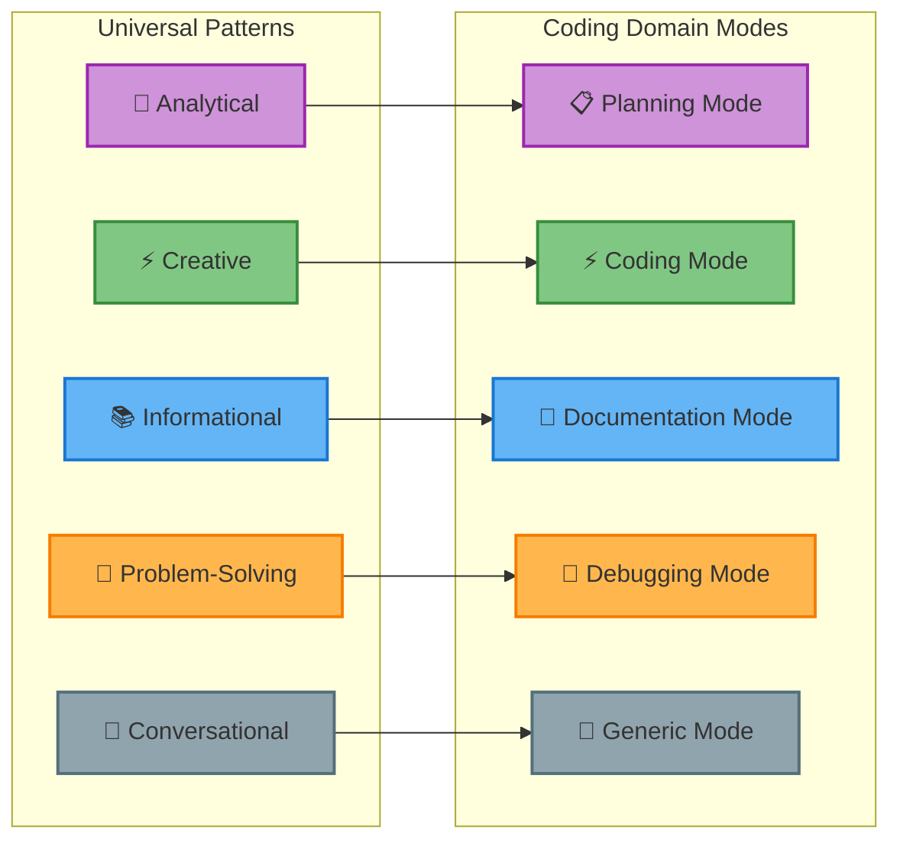

# Coding Domain Agent

## Overview

This document demonstrates how to specialize the **[Universal Agent Framework](./agent.md)** for software development using the **[concrete implementations](./agent.impl.md)** of the **[abstract interfaces](./agent.abstractions.md)**. The coding agent serves as a reference implementation showing how any domain can leverage the 3-layer architecture.

### 3-Layer Architecture Implementation



### Domain Specialization Approach

**Coding Agent = Abstract Patterns + LangChain/LangGraph/MCP + Development Mappings**

This implementation demonstrates how to:
- Use **abstract cognitive patterns** from Layer 1
- Leverage **concrete implementations** from Layer 2  
- Apply **domain-specific specializations** in Layer 3

---

## 1. Implementation Setup

### 1.1 Using the Concrete Implementations

The coding agent uses the implementations from **[agent.impl.md](./agent.impl.md)**:

```typescript
// lib/src/coding/coding-agent.ts
import { createUniversalAgent } from '../impl/setup.js';
import { CODING_DOMAIN_CONFIGURATION } from './coding-domain-config.js';
import { CODING_MCP_SERVERS } from './coding-mcp-config.js';
import type { IUniversalAgent } from '../abstractions/interfaces.js';

export async function createCodingAgent(): Promise<IUniversalAgent> {
  return createUniversalAgent({
    domain: CODING_DOMAIN_CONFIGURATION,
    patternMatcher: {
      confidenceThreshold: 0.8,
      enableLLMFallback: true,
      llmEndpoint: 'http://localhost:11434',
      fallbackModel: 'qwen2.5:7b'
    },
    workflowEngine: {
      enableCheckpointing: true,
      maxExecutionTime: 30000,
      enableStreaming: true
    },
    modelProvider: {
      models: [
        {
          providerId: 'ollama',
          modelId: 'qwen2.5-coder:7b',
          parameters: {
            temperature: 0.3,
            maxTokens: 4096,
            topP: 0.9
          },
          capabilities: {
            supportsStreaming: true,
            supportsToolCalling: false,
            supportsSystemMessages: true,
            maxContextLength: 32768,
            supportedMessageTypes: ['user', 'assistant', 'system']
          }
        }
      ],
      defaultProvider: 'ollama',
      defaultModel: 'qwen2.5-coder:7b'
    },
    toolProvider: {
      servers: CODING_MCP_SERVERS,
      patternToolMapping: [
        ['analytical', ['static-analysis', 'architecture-review']],
        ['creative', ['code-generation', 'file-operations']],
        ['informational', ['knowledge-base', 'examples']],
        ['problem-solving', ['error-analysis', 'testing']],
        ['conversational', ['basic-operations']]
      ]
    }
  });
}
```

### 1.2 Technology Stack Integration

| Component | Technology Choice | Reasoning |
|-----------|------------------|-----------|
| **Pattern Matching** | Rule-based + LangChain LLM fallback | Fast coding pattern detection with AI backup |
| **Workflow Engine** | LangGraph StateGraph | Robust state management for complex coding workflows |
| **Model Provider** | LangChain + Ollama | Local privacy-focused model execution |
| **Tool Provider** | MCP SDK | Standardized tool integration for development tools |
| **Memory** | LangGraph Checkpointing | Session persistence for coding conversations |

---

## 2. Cognitive Pattern Specialization for Coding

### 2.1 Abstract Pattern Mapping

The coding domain maps the [universal cognitive patterns](./agent.md#cognitive-framework) to development-specific modes:



### 1.2 Domain Mode Specifications

Each coding mode specializes the abstract cognitive pattern:

| Abstract Pattern | Coding Mode | Purpose | Keywords | Tools |
|-----------------|-------------|---------|----------|-------|
| **Analytical** | Planning | Architecture analysis, code review | review, analyze, design, architecture | static-analysis, architecture-review |
| **Creative** | Coding | Code generation, implementation | implement, code, create, build | code-generation, file-operations |
| **Informational** | Documentation | Code explanation, learning | explain, help, what, how, understand | knowledge-base, examples |
| **Problem-Solving** | Debugging | Error fixing, troubleshooting | fix, debug, error, problem | error-analysis, testing |
| **Conversational** | Generic | General coding chat | chat, discuss, general | basic-operations |

### 2.3 Domain Configuration

The coding domain implements the abstract `DomainConfiguration` interface:

```typescript
// lib/src/coding/coding-domain-config.ts
import type { DomainConfiguration, DomainMode } from '../abstractions/interfaces.js';

export const CODING_DOMAIN_CONFIGURATION: DomainConfiguration = {
  domain: "coding",
  version: "1.0.0", 
  description: "Software development assistant",
  patterns: new Map<string, DomainMode>([
    ['analytical', {
      abstractPattern: 'analytical',
      domainName: 'planning',
      domainKeywords: ['review', 'analyze', 'design', 'architecture', 'plan', 'refactor'],
      domainTools: ['static-analysis', 'architecture-review', 'code-metrics'],
      domainPrompts: ['coding-planning-prompt']
    }],
    ['creative', {
      abstractPattern: 'creative',
      domainName: 'coding',
      domainKeywords: ['implement', 'code', 'create', 'build', 'develop', 'write'],
      domainTools: ['code-generation', 'file-operations', 'syntax-checker'],
      domainPrompts: ['coding-implementation-prompt']
    }],
    ['informational', {
      abstractPattern: 'informational',
      domainName: 'documentation',
      domainKeywords: ['explain', 'help', 'what', 'how', 'understand', 'learn'],
      domainTools: ['knowledge-base', 'examples', 'documentation-search'],
      domainPrompts: ['coding-explanation-prompt']
    }],
    ['problem-solving', {
      abstractPattern: 'problem-solving', 
      domainName: 'debugging',
      domainKeywords: ['fix', 'debug', 'error', 'problem', 'issue', 'broken'],
      domainTools: ['error-analysis', 'testing', 'diagnostics'],
      domainPrompts: ['coding-debugging-prompt']
    }],
    ['conversational', {
      abstractPattern: 'conversational',
      domainName: 'generic',
      domainKeywords: ['chat', 'discuss', 'general', 'talk'],
      domainTools: ['basic-operations'],
      domainPrompts: ['coding-generic-prompt']
    }]
  ])
};
```

### 2.4 MCP Server Configuration

Coding-specific MCP servers for development tools:

```typescript
// lib/src/coding/coding-mcp-config.ts
export const CODING_MCP_SERVERS = [
  {
    name: 'filesystem',
    command: 'node',
    args: ['node_modules/@modelcontextprotocol/filesystem/dist/index.js'],
    env: {
      ALLOWED_PATHS: './src,./lib,./app,./docs',
      NODE_ENV: 'production'
    },
    patterns: ['creative', 'problem-solving']
  },
  {
    name: 'static-analysis',
    command: 'node', 
    args: ['tools/static-analysis-server.js'],
    env: {
      NODE_ENV: 'production'
    },
    patterns: ['analytical']
  },
  {
    name: 'sequential-thinking',
    command: 'node',
    args: ['node_modules/@modelcontextprotocol/sequential-thinking/dist/index.js'],
    env: {
      NODE_ENV: 'production'
    },
    patterns: ['analytical']
  },
  {
    name: 'web-search',
    command: 'python',
    args: ['-m', 'mcp_web_search'],
    env: {
      PYTHONPATH: '.'
    },
    patterns: ['informational']
  }
] as const;
```

---

## 3. Usage Example

### 3.1 Creating and Using the Coding Agent

```typescript
// app/src/coding-main.ts
import { createCodingAgent } from '../lib/src/coding/coding-agent.js';

async function main() {
  // Create the coding agent using the 3-layer architecture
  const codingAgent = await createCodingAgent();
  
  // Example: Planning request (analytical pattern)
  const planningResponse = await codingAgent.process({
    input: "Review the architecture of our React application and suggest improvements",
    context: {
      environmentContext: new Map([
        ['projectType', 'react-app'],
        ['currentFiles', ['src/App.tsx', 'src/components/']]
      ])
    }
  });
  
  // Example: Implementation request (creative pattern)  
  const codingResponse = await codingAgent.process({
    input: "Implement a user authentication component with TypeScript",
    options: { sessionId: 'coding-session-1' }
  });
  
  // Example: Debugging request (problem-solving pattern)
  const debugResponse = await codingAgent.process({
    input: "Fix the type errors in my React component",
    context: {
      environmentContext: new Map([
        ['errorType', 'typescript'],
        ['component', 'UserProfile.tsx']
      ])
    }
  });
  
  console.log('Planning:', planningResponse.content);
  console.log('Coding:', codingResponse.content);  
  console.log('Debug:', debugResponse.content);
}

main().catch(console.error);
```

### 3.2 Streaming Interface

```typescript
// Stream responses for real-time development assistance
async function streamingExample() {
  const codingAgent = await createCodingAgent();
  
  for await (const chunk of codingAgent.stream({
    input: "Create a REST API endpoint for user registration with validation"
  })) {
    console.log(`[${chunk.currentStage}] ${chunk.content}`);
    
    if (chunk.isComplete) {
      console.log(`Completed using pattern: ${chunk.pattern?.name}`);
      break;
    }
  }
}
```

---

## 4. Architecture Benefits

### 4.1 Technology Independence

The coding agent demonstrates how the 3-layer architecture enables flexibility:

- **Layer 1 (Abstractions)**: Universal patterns work for any development workflow
- **Layer 2 (Implementations)**: Could swap LangGraph for alternative workflow engines
- **Layer 3 (Domain)**: Could create legal, medical, or research agents using same foundation

### 4.2 Extensibility Example

Adding a new "testing" mode to the coding domain:

```typescript
// Extend the domain configuration
const ENHANCED_CODING_CONFIG = {
  ...CODING_DOMAIN_CONFIGURATION,
  patterns: new Map([
    ...CODING_DOMAIN_CONFIGURATION.patterns,
    ['testing', {
      abstractPattern: 'analytical', // Reuse analytical pattern
      domainName: 'testing',
      domainKeywords: ['test', 'spec', 'coverage', 'unit', 'integration'],
      domainTools: ['test-runner', 'coverage-analyzer', 'mock-generator'],
      domainPrompts: ['coding-testing-prompt']
    }]
  ])
};
```

### 4.3 Technology Migration Path

The architecture supports gradual technology migration:

1. **Model Provider**: Swap Ollama for OpenAI without changing domain logic
2. **Workflow Engine**: Replace LangGraph with custom state machine
3. **Tool Provider**: Migrate from MCP to direct tool integration
4. **Pattern Matcher**: Enhance with vector embeddings while keeping interfaces

---

## Summary

The coding domain agent demonstrates the power of the 3-layer architecture:

- **✅ Abstract Patterns**: Universal cognitive patterns provide consistent behavior
- **✅ Concrete Implementations**: LangChain/LangGraph/MCP provide robust capabilities  
- **✅ Domain Specialization**: Coding-specific tools and workflows for development tasks
- **✅ Technology Flexibility**: Components can be swapped without affecting other layers
- **✅ Extensible Design**: New patterns, tools, and capabilities easily added

This reference implementation shows how any domain can leverage the universal framework while maintaining full control over technology choices and domain-specific behavior.

**Framework References**:
- **[Universal Framework](./agent.md)** - Core patterns and architecture
- **[Abstract Interfaces](./agent.abstractions.md)** - Technology-agnostic contracts
- **[Concrete Implementations](./agent.impl.md)** - LangChain/LangGraph/MCP implementations
- **[Mode System](./agent.mode.md)** - Pattern detection and cognitive modes
