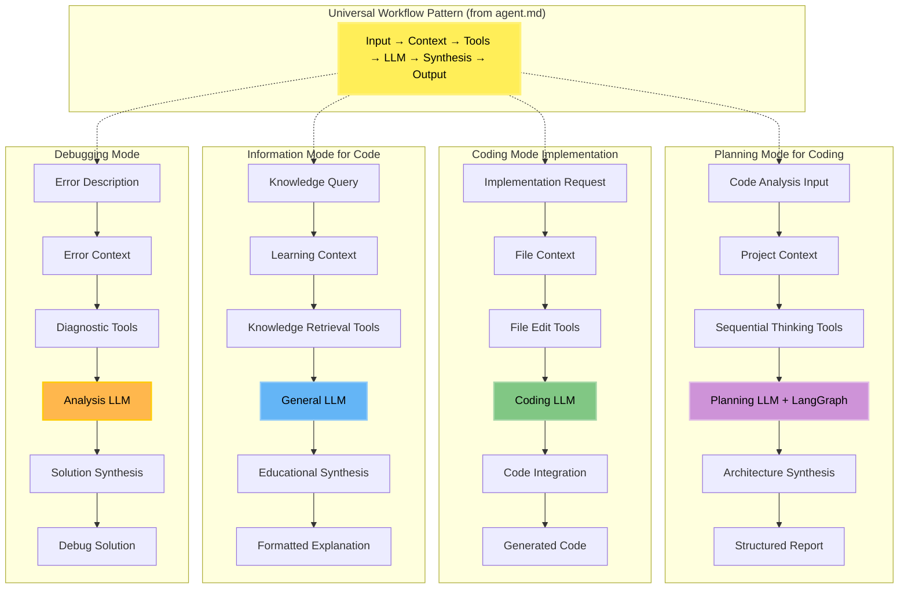
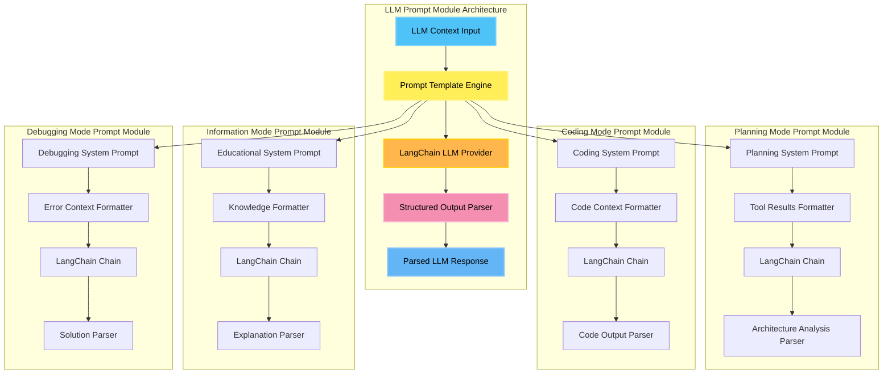
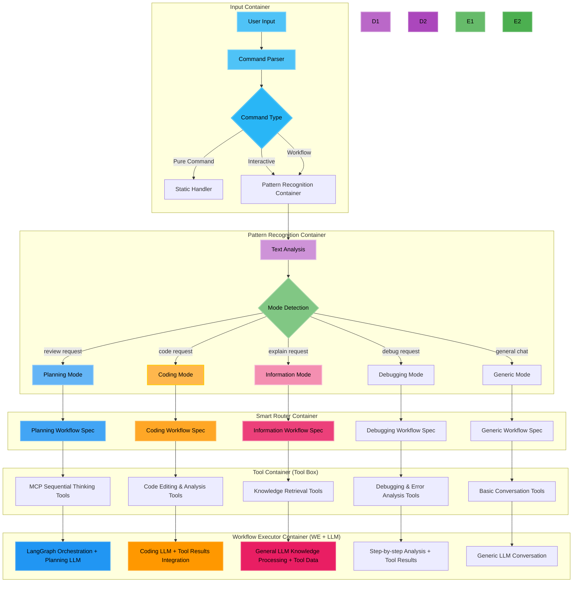
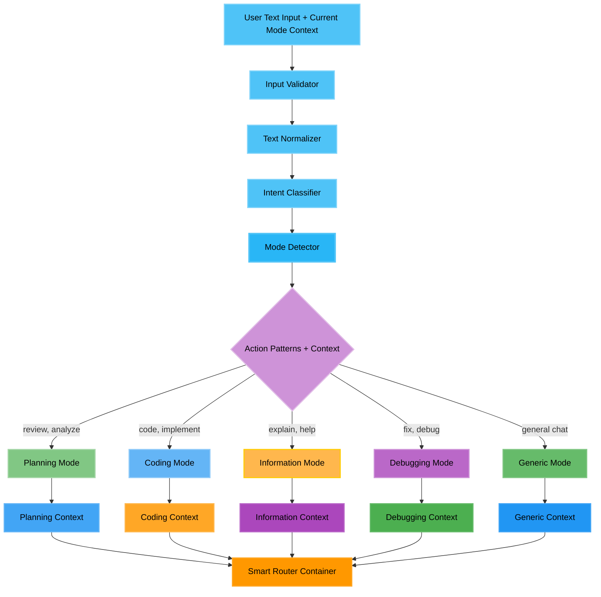
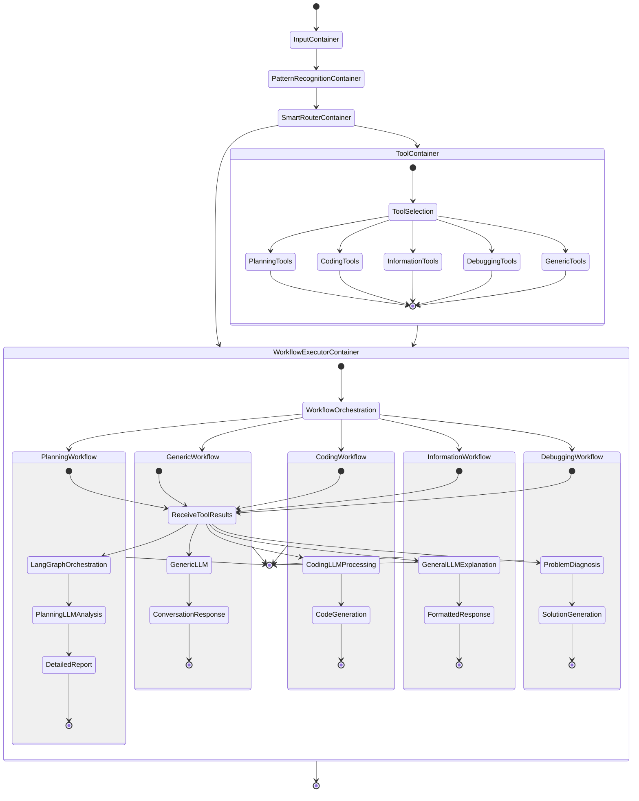
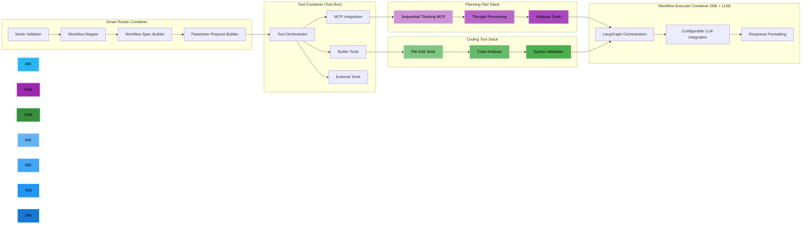
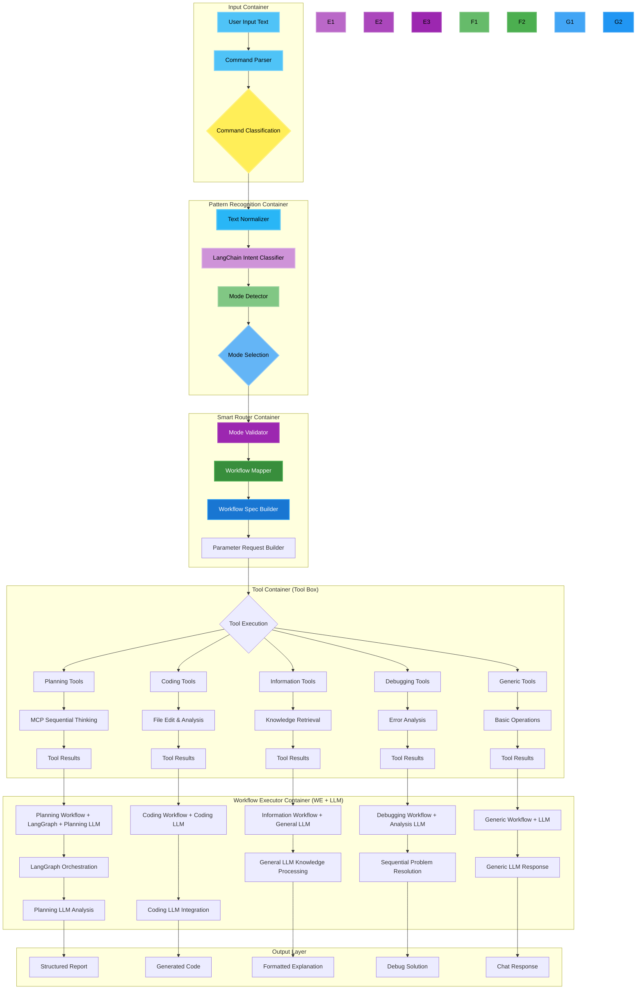
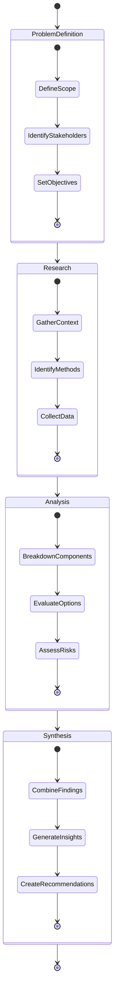
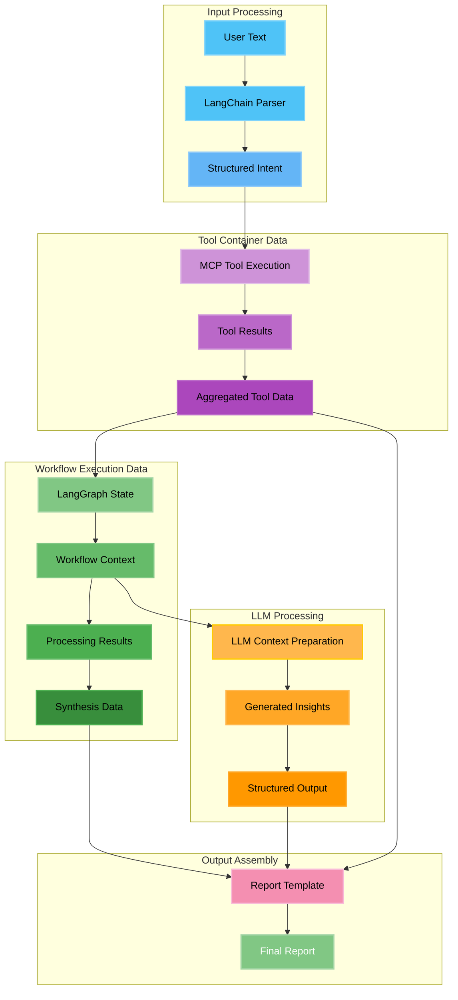

# Agent.Coder Implementation Guide

This document provides implementation guidance for building a coding assistant agent that implements the [5-container architecture](./agent.md) defined in the general agent model.

## Implementation Overview

The Agent.Coder implements the **Agent = Tool Box + WE + LLM** model with specific optimizations for coding workflows. Each container implements the interface contracts defined in [agent.md](./agent.md) with coding-specific configurations.

### LLM Model Configuration

The Workflow Executor Container supports configurable LLM models for different modes. The system is designed to work with various LLM providers and models:

**Mode-Specific LLM Configuration:**
- **Planning Mode**: Uses general reasoning models for structured analysis (e.g., `qwen3`, `llama3`, `mixtral`)
- **Coding Mode**: Uses code-specialized models for optimal code generation (e.g., `qwen3-coder`, `codellama`, `deepseek-coder`)
- **Information Mode**: Uses general models for explanations and documentation (e.g., `qwen3`, `llama3`)
- **Debugging Mode**: Uses reasoning models for systematic problem solving (e.g., `qwen3`, `llama3`)
- **Generic Mode**: Uses general conversation models (configurable based on preference)

**LLM Provider Support:**
- **Local Models**: Ollama server integration for local deployment
- **Cloud Models**: Extensible to support OpenAI, Anthropic, Google, etc.
- **Model Selection**: Configurable via `qi-config.yaml` per mode and use case

**Example Configuration:**
```yaml
workflow_executor:
  llm:
    providers:
      ollama:
        endpoint: "localhost:11434"
        models:
          planning: "qwen3"           # Example: could be llama3, mixtral, etc.
          coding: "qwen3-coder"       # Example: could be codellama, deepseek-coder, etc.
          information: "qwen3"        # Example: configurable based on needs
          debugging: "qwen3"          # Example: could be any reasoning model
          generic: "qwen3"            # Example: default conversation model
```

This design allows the system to work with any compatible LLM models while providing examples of effective model choices for each mode.

## Workflow Architecture for Coding

The Agent.Coder implements the [Abstract Workflow Architecture](./agent.md#abstract-workflow-architecture) defined in the general agent model, specialized for coding workflows.

### Coding-Specific Workflow Specializations

Each cognitive mode specializes the universal workflow pattern from [agent.md](./agent.md#abstract-workflow-architecture):



### LangGraph Implementation for Coding

The coding agent implements the abstract workflow patterns using LangGraph with coding-specific optimizations:

```typescript
// Coding-specific implementation of abstract workflow
const createCodingWorkflowGraph = (mode: CognitiveMode) => {
  const workflow = new StateGraph(WorkflowState);
  
  // Implement the universal pattern: Input → Context → Tools → LLM → Synthesis → Output
  workflow.addNode("input", processCodingInput);
  workflow.addNode("context", enrichCodingContext);
  workflow.addNode("tools", executeCodingTools);
  workflow.addNode("llm", processCodingLLM);
  workflow.addNode("synthesis", synthesizeCodingResults);
  workflow.addNode("output", formatCodingOutput);
  
  // Apply coding-specific orchestration
  if (mode === 'planning') {
    // Use iterative pattern for complex planning
    return createIterativeCodingWorkflow(workflow);
  } else if (mode === 'coding') {
    // Use parallel tool pattern for file operations
    return createParallelCodingWorkflow(workflow);
  } else {
    // Use sequential pattern for simple modes
    return createSequentialCodingWorkflow(workflow);
  }
};
```

This coding implementation follows the universal patterns defined in [agent.md](./agent.md#abstract-workflow-architecture) while optimizing for coding-specific requirements.

### LLM Integration Architecture

The LLM integration is indeed a **prompt module system** that integrates with LangChain/LangGraph for structured prompting and response handling.

**Important Clarification:**
- **LangGraph**: Provides workflow orchestration and state management
- **LangChain**: Provides the prompt abstraction layer, LLM integrations, and structured output parsing
- **Integration**: LangGraph orchestrates workflows that use LangChain prompt modules

#### LLM Package Stack

```typescript
// Package dependencies for LLM integration
import { ChatOllama } from '@langchain/community/chat_models/ollama';
import { PromptTemplate, ChatPromptTemplate } from '@langchain/core/prompts';
import { LLMChain } from 'langchain/chains';
import { StructuredOutputParser } from 'langchain/output_parsers';
import { BaseMessage, HumanMessage, SystemMessage } from '@langchain/core/messages';
```

**Core LLM Packages:**
- **`@langchain/core`**: Core LangChain functionality for **prompt abstractions**, messages, and schemas
- **`@langchain/community`**: Community LLM providers (Ollama, OpenAI, etc.)
- **`langchain/chains`**: Chain composition for complex LLM workflows  
- **`langchain/output_parsers`**: Structured output parsing and validation

#### Prompt Abstraction Layer (LangChain)

LangChain provides the prompt abstraction contracts that ensure consistency across all modes:

```typescript
// Abstract prompt contract that all modes implement
interface PromptContract {
  // Standard prompt structure
  systemPrompt: PromptTemplate;
  userPromptTemplate: PromptTemplate;
  outputSchema: StructuredOutputParser;
  
  // Required methods
  formatContext(toolResults: ToolResult[]): string;
  validateInput(input: any): boolean;
  parseOutput(response: string): ParsedResponse;
}

// Base prompt template following the contract
abstract class BasePromptModule implements PromptContract {
  protected abstract getSystemPromptTemplate(): string;
  protected abstract getOutputSchema(): Record<string, string>;
  
  constructor() {
    this.systemPrompt = PromptTemplate.fromTemplate(this.getSystemPromptTemplate());
    this.outputSchema = StructuredOutputParser.fromNamesAndDescriptions(this.getOutputSchema());
  }
  
  // Standard context formatting that all modes use
  formatContext(toolResults: ToolResult[]): string {
    return toolResults.map(result => 
      `Tool: ${result.toolName}\nStatus: ${result.status}\nData: ${JSON.stringify(result.data, null, 2)}`
    ).join('\n\n');
  }
}
```

#### LLM Node Implementation Pattern

The LLM processing in workflows is implemented as prompt modules:

```typescript
interface LLMPromptModule {
  // Core prompt components
  systemPrompt: PromptTemplate;
  userPromptTemplate: PromptTemplate;
  outputParser: StructuredOutputParser;
  
  // LLM configuration
  modelConfig: LLMModelConfig;
  
  // Execution methods
  execute(context: LLMContext): Promise<ParsedLLMResponse>;
  formatPrompt(toolResults: ToolResult[], userInput: string): Promise<string>;
  parseResponse(rawResponse: string): ParsedLLMResponse;
}

class CodingLLMPromptModule implements LLMPromptModule {
  private llm: ChatOllama;
  private chain: LLMChain;
  
  constructor(modelConfig: LLMModelConfig) {
    // Initialize Ollama LLM
    this.llm = new ChatOllama({
      baseUrl: modelConfig.endpoint,
      model: modelConfig.model, // e.g., "qwen3-coder"
      temperature: modelConfig.temperature
    });
    
    // Create structured prompt template
    this.systemPrompt = PromptTemplate.fromTemplate(`
You are a coding assistant in CODING MODE.

Context from Tool Container:
{toolResults}

User Requirements:
{userInput}

Instructions:
- Generate production-ready code based on tool analysis
- Include error handling and proper typing
- Follow coding best practices
- Provide complete, working implementations

Output format:
- Code: [Generated code]
- Explanation: [Brief explanation]
- Tests: [Test cases if applicable]
    `);
    
    // Create LLM chain
    this.chain = new LLMChain({
      llm: this.llm,
      prompt: this.systemPrompt,
      outputParser: new StructuredOutputParser.fromNamesAndDescriptions({
        code: "Generated code implementation",
        explanation: "Brief explanation of the solution",
        tests: "Test cases or validation code"
      })
    });
  }
  
  async execute(context: LLMContext): Promise<ParsedLLMResponse> {
    const formattedToolResults = this.formatToolResults(context.toolResults);
    
    const response = await this.chain.call({
      toolResults: formattedToolResults,
      userInput: context.userInput
    });
    
    return {
      code: response.code,
      explanation: response.explanation,
      tests: response.tests,
      metadata: {
        model: this.llm.model,
        tokenCount: response.tokenCount,
        processingTime: response.processingTime
      }
    };
  }
}
```

#### Mode-Specific Prompt Modules

Each cognitive mode has its own prompt module optimized for that specific task:



#### LangGraph Integration with LLM Prompt Modules

LangGraph nodes integrate with LLM prompt modules:

```typescript
// LangGraph node that uses LLM prompt module
const createLLMNode = (promptModule: LLMPromptModule) => {
  return async (state: WorkflowState): Promise<WorkflowState> => {
    try {
      // Prepare LLM context from workflow state
      const llmContext: LLMContext = {
        toolResults: state.toolResults,
        userInput: state.userInput,
        sessionContext: state.context,
        mode: state.mode
      };
      
      // Execute LLM prompt module
      const llmResponse = await promptModule.execute(llmContext);
      
      // Update workflow state
      return {
        ...state,
        llmResponse,
        metadata: {
          ...state.metadata,
          llmProcessingTime: llmResponse.metadata.processingTime,
          llmTokenCount: llmResponse.metadata.tokenCount
        }
      };
    } catch (error) {
      return {
        ...state,
        error: `LLM processing failed: ${error.message}`
      };
    }
  };
};

// Usage in LangGraph workflow
const workflow = new StateGraph(WorkflowState);
workflow.addNode("llm_processing", createLLMNode(codingPromptModule));
```

#### Prompt Template System (LangChain Abstraction Contracts)

The system uses LangChain's prompt abstraction layer to ensure all modes follow consistent contracts:

```typescript
// Abstract prompt contract implemented by all modes
interface PromptContractImplementation {
  mode: CognitiveMode;
  promptModule: BasePromptModule;
  outputSchema: StructuredOutputParser;
  validationRules: ValidationRule[];
}

// Prompt abstraction registry following LangChain patterns
class PromptAbstractionRegistry {
  private implementations: Map<CognitiveMode, PromptContractImplementation> = new Map();
  
  register(mode: CognitiveMode, implementation: BasePromptModule): void {
    this.implementations.set(mode, {
      mode,
      promptModule: implementation,
      outputSchema: implementation.outputSchema,
      validationRules: implementation.getValidationRules()
    });
  }
  
  getPromptModule(mode: CognitiveMode): BasePromptModule {
    const impl = this.implementations.get(mode);
    if (!impl) {
      throw new Error(`No prompt implementation found for mode: ${mode}`);
    }
    return impl.promptModule;
  }
  
  validatePromptContract(mode: CognitiveMode): boolean {
    const impl = this.implementations.get(mode);
    return impl ? impl.promptModule.validateContract() : false;
  }
}

// Mode-specific implementations following the abstract contract
const PROMPT_IMPLEMENTATIONS = {
  planning: new PlanningLLMPromptModule(),
  coding: new CodingLLMPromptModule(),
  information: new InformationLLMPromptModule(),
  debugging: new DebuggingLLMPromptModule()
};

// All implementations share common abstractions from LangChain
const SHARED_PROMPT_FEATURES = {
  // Common template variables that all modes support
  templateVariables: ['toolResults', 'userInput', 'format_instructions'],
  
  // Common output structure that all modes provide  
  baseOutputSchema: {
    reasoning: "Step-by-step reasoning process",
    confidence: "Confidence score for the response",
    metadata: "Additional context and metadata"
  },
  
  // Common validation rules from LangChain
  validationRules: [
    'required_fields_present',
    'output_schema_compliance', 
    'token_limit_respected',
    'safety_guidelines_followed'
  ]
};
```

#### LLM Provider Configuration

The system supports multiple LLM providers through LangChain:

```typescript
interface LLMProviderConfig {
  type: 'ollama' | 'openai' | 'anthropic' | 'google';
  endpoint?: string;
  apiKey?: string;
  models: Record<CognitiveMode, string>;
  defaultParams: LLMParameters;
}

class LLMProviderFactory {
  static createProvider(config: LLMProviderConfig): BaseLLM {
    switch (config.type) {
      case 'ollama':
        return new ChatOllama({
          baseUrl: config.endpoint,
          model: config.models.coding, // Model selection handled elsewhere
          temperature: config.defaultParams.temperature
        });
      
      case 'openai':
        return new ChatOpenAI({
          openAIApiKey: config.apiKey,
          modelName: config.models.coding,
          temperature: config.defaultParams.temperature
        });
      
      // Add other providers as needed
      default:
        throw new Error(`Unsupported LLM provider: ${config.type}`);
    }
  }
}
```

#### Architecture Summary: LangChain + LangGraph Integration

This LLM integration architecture provides clear separation of concerns:

**LangChain Responsibilities (Prompt Abstraction Layer):**
- **Prompt Templates**: `PromptTemplate.fromTemplate()` for consistent prompt structure
- **Output Parsing**: `StructuredOutputParser` for type-safe response handling  
- **LLM Providers**: `ChatOllama`, `ChatOpenAI`, etc. for model abstraction
- **Chain Composition**: `LLMChain` for combining prompts + models + parsers
- **Prompt Contracts**: Abstract base classes ensuring all modes follow same patterns

**LangGraph Responsibilities (Workflow Orchestration):**
- **Workflow Definition**: `StateGraph` for defining node and edge relationships
- **State Management**: `WorkflowState` for managing data flow between nodes
- **Execution Engine**: Orchestrating the sequence of tool execution and LLM processing
- **Conditional Logic**: Supporting complex workflows with branching and loops

**Integration Pattern:**
```typescript
// LangGraph orchestrates workflows that use LangChain prompt modules
const llmNode = async (state: WorkflowState) => {
  // LangChain handles the prompting and LLM interaction
  const promptModule = registry.getPromptModule(state.mode);
  const llmResponse = await promptModule.execute({
    toolResults: state.toolResults,
    userInput: state.userInput
  });
  
  // LangGraph manages the state transition
  return { ...state, llmResponse };
};
```

This architecture provides:
- **Abstract Contracts**: LangChain prompt abstractions ensure consistency across modes
- **Workflow Orchestration**: LangGraph manages complex multi-step processes
- **Type Safety**: Structured output parsing with validation
- **Provider Flexibility**: Support for multiple LLM providers through LangChain
- **Mode Optimization**: Specialized prompt modules per cognitive mode
- **Scalable Integration**: Clear separation allows independent scaling of prompting vs orchestration

## Container Implementation Strategy



### Pattern Recognition Implementation

For coding workflows, the Pattern Recognition Container uses LangChain-based intent classification with coding-specific patterns:



### Container Integration Flow

The state flow shows how containers coordinate for coding workflows, implementing the contracts from [agent.md](./agent.md):



### Tool Container Configuration

The Tool Container implements the Tool Box with coding-specific tool configurations:

**MCP Server Mappings:**
- **Planning Mode**: `sequential-thinking` MCP server for structured analysis
- **Coding Mode**: `filesystem` MCP server for file operations
- **Information Mode**: `knowledge-base` MCP server for documentation lookup
- **Debugging Mode**: `error-analysis` MCP server for diagnostic tools

**Tool Chain Configuration:**



### Complete Container Integration

This diagram shows how the 5 containers integrate specifically for coding workflows:



### Planning Mode Implementation Detail

The planning mode uses the Sequential Thinking MCP server for structured code planning:



### Data Flow Implementation

Data flows between containers following the interface contracts with coding-specific data types:



---

## Implementation Insights

### 🏗️ **Container Implementation Patterns**
Each container implements the [interface contracts](./agent.md) with coding-specific optimizations:

- **Input Container**: Implemented using CLI abstraction (Ink/neo-blessed)
- **Pattern Recognition Container**: LangChain intent classification with coding patterns
- **Smart Router Container**: Workflow mapping optimized for code generation workflows
- **Tool Container**: MCP server integration with coding tools (**Tool Box**)
- **Workflow Executor Container**: LangGraph + LLM integration (**WE + LLM**)

### 🧠 **Context-Aware Mode Detection Implementation**
The Pattern Recognition Container implementation for coding workflows:
- Uses coding-specific pattern matching for intent classification
- Maintains conversation context for mode transitions (planning → coding → debugging)
- Implements fallback to generic mode for non-coding conversations

### 🎯 **Mode-Specific Tool and Workflow Optimization**
Each mode uses optimal tool stacks across Tool Container and Workflow Executor Container:

| Mode | Tool Container (Tool Box) | Workflow Executor (WE + LLM) | Purpose |
| 🧠 Planning | MCP Sequential Thinking tools | LangGraph + Planning LLM | Deep reasoning & analysis |
| ⚡ Coding | File edit & code analysis tools | Coding LLM + tool integration | Fast code generation |
| 📚 Information | Knowledge retrieval tools | General LLM + context processing | Clear explanations |
| 🔧 Debugging | Error analysis & diagnostic tools | Sequential analysis + LLM | Systematic problem solving |
| 💬 Generic | Basic operation tools | Simple LLM conversation | General conversation |

### 🔄 **Implementation Design Principles**
Following the [interface contracts](./agent.md), each container implements pure functional patterns:
- **Smart Router**: Implements mode-to-workflow transformation for coding workflows
- **Pattern Recognition**: Implements coding-specific context analysis with LangChain
- **Tool Container**: Implements coding tool execution via MCP server integration
- **Workflow Executor**: Implements LangGraph orchestration with coding-optimized LLM prompts
- **State Management**: Session state managed through container boundaries

### 📈 **Implementation Benefits**
- **Container Independence**: Each container can be implemented and scaled independently
- **Technology Flexibility**: Can switch CLI frameworks (Ink → neo-blessed) without changing contracts
- **Tool Modularity**: MCP servers can be added/removed without affecting workflow logic

## Implementation Guides

For detailed implementation guidance, see:

- **[Container Implementation Guides](./coder/containers/)** - Detailed guides for implementing each container
- **[Component Implementation Guides](./coder/components/)** - Component-level implementation details  
- **[Architecture Implementation](./coder/architecture/)** - Architecture-specific implementation patterns

This implementation guide shows how to build an intelligent coding assistant that follows the [general agent model](./agent.md) with coding-specific optimizations for **Tool Box + WE + LLM** architecture.