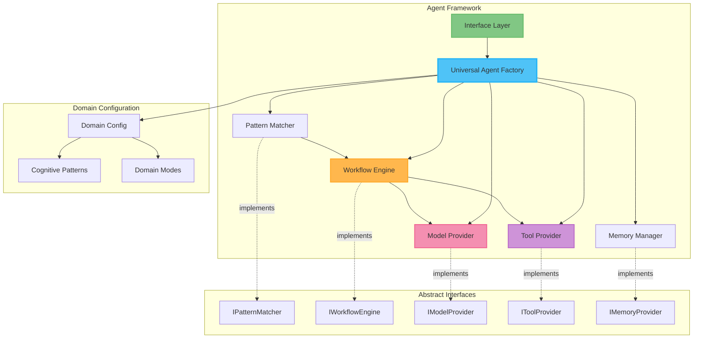

# Simplified Agent Framework

## Executive Summary

This document defines a **practical, simplified framework** for building intelligent AI agents based on opus4 review feedback. This framework provides:

- **Direct Cognitive Modes**: No abstract patterns - direct mode-to-tool mapping
- **Multi-Signal Pattern Detection**: Enhanced intent recognition with tool requirements
- **Technology Independence**: Clean interfaces with practical implementations  
- **Operational Focus**: Built-in retry logic, rate limiting, and cost tracking
- **Unified Configuration**: Single config file instead of scattered settings

### Core Design Principle
**Direct Modes + Enhanced Detection + Practical Operations = Production-Ready Agents**

The framework uses direct cognitive modes (planning, coding, information, debugging, generic) with sophisticated pattern detection and essential operational features.

---

## 1. Architecture Overview

### 1.1 Universal Agent Model



### 1.2 Simplified Architecture (4 Containers)

| Container | Purpose | Owns | Practical Focus |
|-----------|---------|------|-----------------|
| **Pattern Recognition** | Multi-signal mode detection | Intent analysis | Fast + accurate detection |
| **Tool Container** | Tool execution with retries | Individual tool calls | Reliability + timeouts |
| **Workflow Executor** | Orchestration + mode mapping | Tool chains + LLM calls | Simple execution patterns |
| **Input Container** | Request handling | CLI/UI interface | User interaction |

**Key Change**: Smart Router container eliminated - its lookup table functionality merged into Workflow Executor.

---

## 2. Direct Cognitive Modes

### 2.1 Direct Mode System (No Abstract Patterns)

The framework uses **direct cognitive modes** with clear tool requirements:

```mermaid
graph LR
    Input[User Input] --> PM[Multi-Signal Detection]
    
    PM --> Planning[📋 Planning Mode]
    PM --> Coding[💻 Coding Mode]  
    PM --> Information[📚 Information Mode]
    PM --> Debugging[🔧 Debugging Mode]
    PM --> Generic[💬 Generic Mode]
    
    Planning --> PT[sequential-thinking]
    Coding --> FT[filesystem]
    Information --> ST[web-search]
    Debugging --> FT2[filesystem + git]
    Generic --> None[No required tools]
    
    style PM fill:#29b6f6,stroke:#1976d2,stroke-width:2px
    style Planning fill:#ce93d8,stroke:#9c27b0,stroke-width:2px
    style Coding fill:#81c784,stroke:#388e3c,stroke-width:2px
    style Information fill:#64b5f6,stroke:#1976d2,stroke-width:2px
    style Debugging fill:#ffb74d,stroke:#f57c00,stroke-width:2px
    style Generic fill:#90a4ae,stroke:#546e7a,stroke-width:2px
```



### 2.2 Mode-Tool Mapping (Direct)

Each mode has **specific tool requirements** - no abstract mappings:

#### Planning Mode
- **Required Tools**: `sequential-thinking`
- **Optional Tools**: `web-search`, `memory`
- **Forbidden Tools**: `filesystem` (no editing during planning)
- **Triggers**: "plan", "architecture", "approach", "strategy"

#### Coding Mode  
- **Required Tools**: `filesystem`
- **Optional Tools**: `git`, `memory`
- **Forbidden Tools**: `sequential-thinking` (avoid analysis paralysis)
- **Triggers**: "implement", "code", "write", file extensions (.js, .py, .ts)

#### Information Mode
- **Required Tools**: `web-search`
- **Optional Tools**: `memory`
- **Forbidden Tools**: `filesystem`, `git` (no modifications for Q&A)
- **Triggers**: "what is", "explain", "how does", "documentation"

#### Debugging Mode
- **Required Tools**: `filesystem`
- **Recommended Tools**: `sequential-thinking`, `git`
- **Optional Tools**: `web-search`, `memory`
- **Triggers**: "error", "bug", "broken", "fix", "debug"

#### Generic Mode
- **Required Tools**: None
- **Optional Tools**: `memory`
- **Forbidden Tools**: `filesystem`, `git` (keep it safe)
- **Triggers**: General conversation without specific tool needs

### 2.3 Enhanced Multi-Signal Pattern Detection

**Problem with Keyword-Based Detection**: Too loose and ambiguous (from opus4 review)
```typescript
// BAD: Ambiguous keyword matching
"create a plan" → matches 'create' → Creative mode ❌ (should be Planning)
"build an analysis" → matches both 'build' and 'analysis' → ??? 
```

**Solution**: Multi-signal detection with weighted scoring:

#### Detection Signals (Weighted)

1. **Tool Mention Signals** (Weight: 0.9)
   - File extensions → Coding/Debugging modes
   - "plan/architecture" → Planning mode
   - "search/find" → Information mode

2. **Action Verb Signals** (Weight: 0.8)
   - "implement/code/write" → Coding mode
   - "analyze/review/plan" → Planning mode
   - "fix/debug/solve" → Debugging mode
   - "explain/describe/what" → Information mode

3. **Error Indicators** (Weight: 0.9)
   - "error/exception/bug/crash" → Debugging mode
   - "undefined/null/stack trace" → Debugging mode

4. **Context Continuation** (Weight: 0.4)
   - Previous mode influences next detection
   - Transition patterns: Planning → Coding → Debugging

#### Validation Rules

- **File extension + "error"** → Debugging (not Coding)
- **"Plan" + required tools check** → Planning (not Creative)
- **Tool availability validation** → Ensure detected mode has required tools

#### Example Classifications

```typescript
// Clear cases
"Plan the architecture for a REST API" 
→ Planning (signals: "plan", "architecture", needs sequential-thinking)

"Fix the TypeError on line 42"
→ Debugging (signals: "fix", "TypeError", "line", needs filesystem)

"implement the user authentication function"
→ Coding (signals: "implement", "function", needs filesystem)

"What is dependency injection?"
→ Information (signals: "what is", needs web-search)

// Ambiguous cases resolved by tool requirements
"Create a plan for the new feature"
→ Planning (not Coding because "plan" requires sequential-thinking)

"Analyze this error message"  
→ Debugging (not Planning because "error" + filesystem tool needed)
```
- **Purpose**: General dialog and interaction
- **Characteristics**: Responsive, contextual, adaptive, personable
- **Abstract Keywords**: chat, discuss, talk, general
- **Workflow Focus**: Maintaining natural conversation flow

### 2.3 Domain Specialization Model

Each domain maps abstract patterns to domain-specific modes:

```typescript
// Example: How different domains specialize the same abstract patterns
const DOMAIN_SPECIALIZATION_EXAMPLES = {
  coding: {
    analytical: { domainMode: 'planning', tools: ['static-analysis', 'architecture-review'] },
    creative: { domainMode: 'coding', tools: ['code-generation', 'file-operations'] },
    informational: { domainMode: 'documentation', tools: ['knowledge-base', 'examples'] },
    'problem-solving': { domainMode: 'debugging', tools: ['error-analysis', 'testing'] }
  },
  legal: {
    analytical: { domainMode: 'case-analysis', tools: ['legal-research', 'precedent-search'] },
    creative: { domainMode: 'document-drafting', tools: ['template-generation', 'contract-builder'] },
    informational: { domainMode: 'legal-advice', tools: ['statute-lookup', 'regulation-search'] },
    'problem-solving': { domainMode: 'compliance', tools: ['risk-assessment', 'audit-tools'] }
  },
  medical: {
    analytical: { domainMode: 'diagnosis', tools: ['symptom-analysis', 'medical-imaging'] },
    creative: { domainMode: 'treatment-planning', tools: ['protocol-generation', 'care-plans'] },
    informational: { domainMode: 'patient-education', tools: ['medical-knowledge', 'drug-database'] },
    'problem-solving': { domainMode: 'differential-diagnosis', tools: ['diagnostic-tools', 'lab-analysis'] }
  }
};
```

---

## 3. Framework Components

### 3.1 Universal Agent Factory

The central orchestrator that coordinates all framework components:

**Abstract Interface**: `IUniversalAgent` (see [agent.abstractions.md](./agent.abstractions.md))

**Key Responsibilities**:
- Pattern detection coordination
- Workflow orchestration
- Cross-component communication
- Domain configuration management
- Session and context management

**Technology Independence**: The Universal Agent Factory depends only on abstract interfaces, allowing any implementation technology.

### 3.2 Pattern Matching System

**Abstract Interface**: `IPatternMatcher`

**Core Functions**:
- Analyze user input to detect cognitive patterns
- Apply domain-specific pattern mappings
- Provide confidence scoring for pattern matches
- Support both rule-based and AI-based detection

**Reference**: See [Agent Mode System](./agent.mode.md) for detailed pattern matching documentation.

### 3.3 Workflow Orchestration

**Abstract Interface**: `IWorkflowEngine`

**Universal Workflow Pattern**:


**Pattern-Specific Customizations**:
- Each cognitive pattern can customize the universal workflow
- Domain specializations can add domain-specific processing steps
- Workflow nodes are composable and reusable across patterns

### 3.4 Model Provider System

**Abstract Interface**: `IModelProvider`

**Key Features**:
- Technology-agnostic model abstraction
- Support for multiple providers simultaneously
- Pattern-specific model selection
- Streaming and batch processing modes
- Token usage tracking and optimization

### 3.5 Tool Provider System

**Abstract Interface**: `IToolProvider`

**Capabilities**:
- Dynamic tool discovery and registration
- Pattern-aware tool selection
- Parallel and sequential tool execution
- Domain-specific tool categorization
- Execution monitoring and error handling

### 3.6 Memory Management

**Abstract Interface**: `IMemoryProvider`

**Functions**:
- Session context management
- Conversation state persistence
- Processing event logging
- Cross-session learning (optional)
- Privacy-preserving storage options

---

## 4. Domain Specialization

### 4.1 Creating Domain-Specific Agents

To specialize the universal framework for a specific domain:

1. **Define Domain Configuration**
   ```typescript
   const DOMAIN_CONFIG: DomainConfiguration = {
     domain: "your-domain",
     version: "1.0.0",
     description: "Domain-specific agent configuration",
     patterns: domainPatternMappings
   };
   ```

2. **Map Abstract Patterns to Domain Modes**
   ```typescript
   const domainPatternMappings = new Map([
     ['analytical', { domainMode: 'domain-analysis', tools: ['domain-tools'], ... }],
     ['creative', { domainMode: 'domain-creation', tools: ['creation-tools'], ... }],
     // ... other patterns
   ]);
   ```

3. **Configure Domain-Specific Tools**
   - Specify tools relevant to your domain
   - Map tools to appropriate cognitive patterns
   - Configure tool execution parameters

4. **Customize Workflows (Optional)**
   - Add domain-specific processing steps
   - Modify workflow edges for domain needs
   - Implement domain-specific validation

### 4.2 Example Domain Specializations

**Available Examples**:
- **[Coding Agent](./agent.coder.md)** - Software development specialization
- **Legal Agent** - Legal practice specialization (future)
- **Medical Agent** - Healthcare specialization (future)
- **Research Agent** - Academic research specialization (future)

Each domain demonstrates concrete implementation of the abstract patterns while maintaining framework consistency.

---

## 5. Configuration Framework

### 5.1 Universal Configuration Schema

```yaml
# Domain-agnostic configuration template
agent:
  domain:
    name: "domain-name"
    version: "1.0.0"
    description: "Domain description"
    
  patterns:
    confidence_threshold: 0.8
    context_weight: 0.1
    detection_strategy: "hybrid"  # rule-based, ai-based, hybrid
    
  workflow:
    enable_streaming: true
    parallel_execution: true
    timeout_ms: 30000
    enable_caching: true
    
  memory:
    enabled: true
    provider: "configurable"  # file, memory, database
    session_timeout: 3600
    
  performance:
    max_concurrent_requests: 10
    cache_size: 1000
    monitoring_enabled: true

# Implementation-specific configurations
implementations:
  pattern_matcher: "implementation-name"
  workflow_engine: "implementation-name"
  model_provider: "implementation-name"
  tool_provider: "implementation-name"
  memory_provider: "implementation-name"

# Domain-specific configurations  
domain_config:
  patterns: []  # Domain pattern mappings
  tools: []     # Domain tool configurations
  models: {}    # Domain model preferences
```

### 5.2 Configuration Composition

Configurations are composed in layers:
1. **Universal defaults** - Base framework settings
2. **Implementation defaults** - Technology-specific settings  
3. **Domain defaults** - Domain-specific settings
4. **User overrides** - Runtime customizations

This layered approach ensures consistent behavior while allowing full customization.

---

## 6. Implementation Guidelines

### 6.1 For Framework Implementers

**Technology Selection**:
- Choose appropriate technologies for each abstract interface
- Ensure implementations are thread-safe and performant
- Provide comprehensive error handling and logging
- Support graceful degradation and recovery

**Interface Compliance**:
- Implement all methods defined in abstract interfaces
- Follow interface contracts strictly
- Provide meaningful error messages and status reporting
- Support configurable timeouts and resource limits

**Reference**: See [Agent Implementations](./agent.impl.md) for concrete technology examples.

### 6.2 For Domain Specialists

**Pattern Mapping**:
- Map each abstract pattern to meaningful domain modes
- Choose appropriate tools for each pattern
- Define domain-specific keywords and detection rules
- Ensure patterns cover the full scope of domain operations

**Workflow Customization**:
- Add domain-specific processing steps where needed
- Maintain compatibility with universal workflow interfaces
- Document domain-specific behavior and requirements
- Test patterns work correctly across different scenarios

### 6.3 For Application Developers

**Dependency Management**:
- Depend only on abstract interfaces, not implementations
- Use dependency injection for implementation selection
- Configure implementations based on deployment requirements
- Handle implementation failures gracefully

**Testing Strategy**:
- Write tests against abstract interfaces
- Mock implementations for unit testing
- Test with multiple implementations for compatibility
- Validate domain specializations work correctly

---

## 7. Extension Points

### 7.1 Adding New Cognitive Patterns

The framework can be extended with new abstract cognitive patterns:

1. **Define Pattern Characteristics**
   - Purpose and description
   - Abstract keywords and triggers
   - Workflow customizations needed
   - Performance characteristics

2. **Update Framework Interfaces**
   - Add pattern to universal pattern definitions
   - Update pattern matcher to recognize new pattern
   - Define workflow customizations
   - Document usage guidelines

3. **Enable Domain Specialization**
   - Allow domains to map new pattern to domain modes
   - Provide example specializations
   - Document best practices for the new pattern

### 7.2 Adding New Interface Types

New abstract interfaces can be added to extend framework capabilities:

1. **Define Abstract Interface**
   - Clear method signatures and contracts
   - Error handling specifications
   - Performance requirements
   - Configuration options

2. **Update Universal Agent Factory**
   - Integrate new interface into orchestration
   - Define interaction patterns with existing interfaces
   - Handle initialization and cleanup

3. **Provide Reference Implementation**
   - Example implementation using appropriate technology
   - Performance benchmarks and characteristics
   - Best practices documentation

---

## 8. Performance and Scalability

### 8.1 Universal Performance Targets

| Component | Target Latency | Optimization Strategy |
|-----------|----------------|----------------------|
| **Pattern Detection** | <50ms | Fast rule-based path with AI fallback |
| **Workflow Initialization** | <100ms | Pre-compiled workflow caching |
| **Tool Execution** | <2s per tool | Parallel execution, configurable timeouts |
| **Model Inference** | Varies by model | Streaming, batching, caching |
| **Memory Operations** | <10ms | In-memory with async persistence |

### 8.2 Scalability Patterns

**Horizontal Scaling**:
- Stateless agent instances with shared configuration
- Load balancing across multiple agent processes
- Distributed tool execution and caching

**Vertical Scaling**:
- Resource allocation per cognitive pattern
- Adaptive concurrency based on load
- Memory and computation optimization

**Implementation-Specific**:
- Each technology implementation provides its own scaling characteristics
- Framework abstractions allow scaling strategies to be implementation-specific
- Monitoring interfaces enable performance optimization

---

## 9. Security and Privacy

### 9.1 Universal Security Principles

**Data Protection**:
- Configurable local-vs-cloud processing
- Data encryption at rest and in transit
- Configurable data retention policies
- Privacy-preserving processing options

**Access Control**:
- Role-based access to agent capabilities
- Tool execution permission management
- Resource usage limiting and monitoring
- Audit logging for security events

**Implementation Security**:
- Sandboxed tool execution where possible
- Input validation and sanitization
- Output filtering and content safety
- Secure configuration management

### 9.2 Domain-Specific Security

Each domain can implement additional security measures:
- **Medical**: HIPAA compliance, patient data protection
- **Legal**: Attorney-client privilege, confidentiality
- **Financial**: PCI compliance, financial data protection
- **Government**: Security clearance levels, classified data handling

---

## 10. Testing and Quality Assurance

### 10.1 Universal Testing Framework

**Interface Testing**:
- All implementations must pass interface compliance tests
- Performance benchmarks for each abstract interface
- Error handling and edge case validation
- Resource usage and cleanup verification

**Pattern Testing**:
- Pattern detection accuracy across domains
- Workflow execution correctness
- Tool integration and error handling
- End-to-end response quality

**Integration Testing**:
- Cross-component communication validation
- Configuration loading and validation
- Session management and persistence
- Performance under load

### 10.2 Domain-Specific Testing

**Pattern Mapping Validation**:
- Verify domain patterns map correctly to universal patterns
- Test domain-specific tool integration
- Validate domain workflows produce expected results
- Ensure domain configuration loads correctly

**Quality Metrics**:
- Response relevance and accuracy for domain queries
- Tool usage appropriateness and effectiveness
- Pattern detection accuracy for domain-specific input
- User satisfaction and task completion rates

---

## Summary

This universal agent framework provides a solid foundation for building intelligent agents across any domain while maintaining:

- **Technology Independence**: Pure abstractions enable any implementation choice
- **Domain Flexibility**: Universal patterns work across all domains  
- **Monolithic Simplicity**: Single process reduces operational complexity
- **Extensible Design**: New patterns, tools, and capabilities can be added
- **Consistent Quality**: Standardized interfaces ensure reliable behavior

The framework separates concerns clearly:
- **Universal patterns and interfaces** (this document + [agent.abstractions.md](./agent.abstractions.md))
- **Technology implementations** ([agent.impl.md](./agent.impl.md))
- **Domain specializations** ([agent.coder.md](./agent.coder.md), future domain docs)

This separation enables teams to work independently on different layers while maintaining system coherence and enabling rapid innovation across domains and technologies.