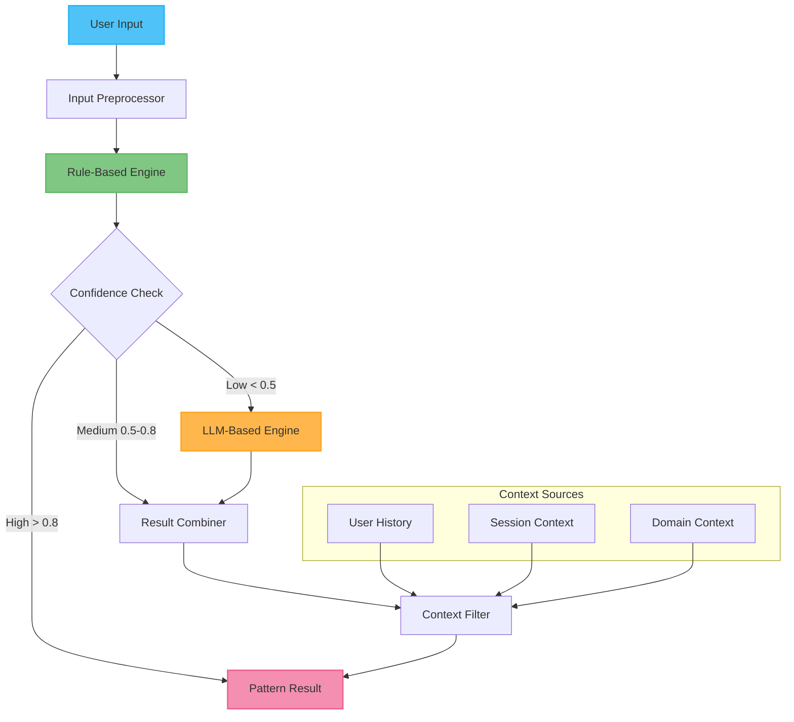

# Agent Mode System

## Overview

This document provides detailed documentation for the cognitive mode system defined in the [universal agent architecture](./agent.md). The mode system enables intelligent agents to adapt their behavior based on the type of thinking required for different tasks.

### Core Concepts

- **Cognitive Patterns**: Abstract thinking patterns that are universal across domains
- **Domain Modes**: Domain-specific implementations of cognitive patterns
- **Mode Detection**: Process of identifying which cognitive pattern applies to user input
- **Context Management**: How mode decisions influence subsequent interactions

---

## 1. Cognitive Pattern Framework

### 1.1 Abstract Cognitive Patterns

The framework defines five universal cognitive patterns that represent fundamental ways of thinking:

```typescript
interface CognitivePattern {
  name: string;
  description: string;
  purpose: string;
  characteristics: string[];
  abstractKeywords: string[];
  contextWeight: number;
  workflowFeatures: WorkflowFeature[];
}

const COGNITIVE_PATTERNS: CognitivePattern[] = [
  {
    name: 'analytical',
    description: 'Deep analysis and structured reasoning',
    purpose: 'Break down complex problems systematically',
    characteristics: ['methodical', 'thorough', 'structured', 'evidence-based'],
    abstractKeywords: ['analyze', 'review', 'examine', 'assess', 'evaluate'],
    contextWeight: 0.8,
    workflowFeatures: ['systematic-thinking', 'evidence-gathering', 'structured-output']
  },
  {
    name: 'creative',
    description: 'Generation and synthesis of new content',
    purpose: 'Create, build, and synthesize new artifacts',
    characteristics: ['innovative', 'constructive', 'synthesis', 'ideation'],
    abstractKeywords: ['create', 'build', 'generate', 'design', 'develop'],
    contextWeight: 0.9,
    workflowFeatures: ['content-generation', 'iterative-refinement', 'artifact-creation']
  },
  {
    name: 'informational',
    description: 'Knowledge sharing and explanation',
    purpose: 'Educate, clarify, and transfer understanding',
    characteristics: ['educational', 'clarifying', 'comprehensive', 'accessible'],
    abstractKeywords: ['explain', 'help', 'what', 'how', 'why', 'understand'],
    contextWeight: 0.6,
    workflowFeatures: ['knowledge-retrieval', 'explanation-formatting', 'example-generation']
  },
  {
    name: 'problem-solving',
    description: 'Issue identification and resolution',
    purpose: 'Diagnose problems and provide solutions',
    characteristics: ['diagnostic', 'solution-oriented', 'systematic', 'practical'],
    abstractKeywords: ['fix', 'solve', 'resolve', 'debug', 'troubleshoot'],
    contextWeight: 0.7,
    workflowFeatures: ['problem-diagnosis', 'solution-generation', 'validation-steps']
  },
  {
    name: 'conversational',
    description: 'General dialog and interaction',
    purpose: 'Maintain natural conversation flow',
    characteristics: ['responsive', 'contextual', 'adaptive', 'personable'],
    abstractKeywords: ['chat', 'discuss', 'talk', 'general'],
    contextWeight: 0.5,
    workflowFeatures: ['context-awareness', 'natural-flow', 'personality-adaptation']
  }
];
```

### 1.2 Pattern Characteristics

Each cognitive pattern has distinct characteristics that influence how it processes information:

#### Analytical Pattern
- **Thinking Style**: Systematic, methodical analysis
- **Information Processing**: Break down into components, examine relationships
- **Output Style**: Structured reports, evidence-based conclusions
- **Tool Preferences**: Analysis tools, data processors, validators

#### Creative Pattern  
- **Thinking Style**: Generative, innovative synthesis
- **Information Processing**: Combine elements in novel ways, iterate and refine
- **Output Style**: Artifacts, content, designs, implementations
- **Tool Preferences**: Generation tools, editors, builders, validators

#### Informational Pattern
- **Thinking Style**: Educational, explanatory communication
- **Information Processing**: Retrieve knowledge, structure for understanding
- **Output Style**: Clear explanations, examples, tutorials
- **Tool Preferences**: Knowledge bases, documentation, search tools

#### Problem-Solving Pattern
- **Thinking Style**: Diagnostic, solution-focused
- **Information Processing**: Identify issues, generate solutions, validate fixes
- **Output Style**: Action plans, step-by-step solutions, diagnostics
- **Tool Preferences**: Diagnostic tools, testing tools, monitoring systems

#### Conversational Pattern
- **Thinking Style**: Context-aware, adaptive dialog
- **Information Processing**: Maintain context, respond appropriately
- **Output Style**: Natural conversation, contextual responses
- **Tool Preferences**: Minimal tools, context management, basic operations

---

## 2. Mode Detection System

### 2.1 Detection Architecture

The mode detection system uses a multi-layered approach to identify the appropriate cognitive pattern:



### 2.2 Rule-Based Detection

The primary detection mechanism uses fast rule-based pattern matching:

```typescript
interface DetectionRule {
  pattern: string;
  keywords: string[];
  regexPatterns: RegExp[];
  weightFactors: {
    keywordWeight: number;
    patternWeight: number;
    contextWeight: number;
  };
}

class RuleBasedDetector {
  private rules: Map<string, DetectionRule[]>;
  
  constructor() {
    this.rules = new Map([
      ['analytical', [
        {
          pattern: 'analytical',
          keywords: ['analyze', 'review', 'examine', 'assess', 'evaluate', 'study'],
          regexPatterns: [
            /\b(analyze|review|examine|assess)\s+(?:the|this|that)\b/i,
            /\b(evaluation|analysis|assessment|review)\s+of\b/i,
            /\blets?\s+(analyze|review|examine)\b/i
          ],
          weightFactors: { keywordWeight: 0.6, patternWeight: 0.3, contextWeight: 0.1 }
        }
      ]],
      ['creative', [
        {
          pattern: 'creative',
          keywords: ['create', 'build', 'generate', 'design', 'develop', 'make'],
          regexPatterns: [
            /\b(create|build|generate|design)\s+(a|an|the)\s+\w+/i,
            /\blets?\s+(create|build|make|design)\b/i,
            /\bi\s+want\s+to\s+(create|build|make)\b/i
          ],
          weightFactors: { keywordWeight: 0.6, patternWeight: 0.3, contextWeight: 0.1 }
        }
      ]],
      ['informational', [
        {
          pattern: 'informational',
          keywords: ['explain', 'help', 'what', 'how', 'why', 'understand', 'learn'],
          regexPatterns: [
            /\b(what|how|why)\s+(is|are|does|do|can|should)\b/i,
            /\bexplain\s+(how|what|why)\b/i,
            /\bhelp\s+me\s+(understand|learn)\b/i,
            /\bcan\s+you\s+(explain|help|teach)\b/i
          ],
          weightFactors: { keywordWeight: 0.6, patternWeight: 0.3, contextWeight: 0.1 }
        }
      ]],
      ['problem-solving', [
        {
          pattern: 'problem-solving',
          keywords: ['fix', 'solve', 'resolve', 'debug', 'troubleshoot', 'issue', 'problem'],
          regexPatterns: [
            /\b(fix|solve|resolve|debug)\s+(this|the|a|an)\b/i,
            /\bis\s+(broken|not\s+working|failing)\b/i,
            /\bhaving\s+(issues?|problems?|trouble)\b/i,
            /\b(error|exception|failure)\b/i
          ],
          weightFactors: { keywordWeight: 0.6, patternWeight: 0.3, contextWeight: 0.1 }
        }
      ]],
      ['conversational', [
        {
          pattern: 'conversational',
          keywords: ['hello', 'hi', 'thanks', 'chat', 'talk', 'discuss'],
          regexPatterns: [
            /^(hello|hi|hey|greetings)\b/i,
            /\b(thanks?|thank\s+you)\b/i,
            /\blets?\s+(chat|talk|discuss)\b/i
          ],
          weightFactors: { keywordWeight: 0.4, patternWeight: 0.4, contextWeight: 0.2 }
        }
      ]]
    ]);
  }
  
  detect(input: string, context?: DetectionContext): DetectionResult {
    const results: PatternScore[] = [];
    
    for (const [patternName, rules] of this.rules) {
      let maxScore = 0;
      
      for (const rule of rules) {
        const score = this.calculateRuleScore(input, rule, context);
        maxScore = Math.max(maxScore, score);
      }
      
      results.push({ pattern: patternName, score: maxScore });
    }
    
    // Sort by score and return best match
    results.sort((a, b) => b.score - a.score);
    const bestMatch = results[0];
    
    return {
      pattern: bestMatch.pattern,
      confidence: bestMatch.score,
      allScores: results,
      method: 'rule-based'
    };
  }
  
  private calculateRuleScore(
    input: string, 
    rule: DetectionRule, 
    context?: DetectionContext
  ): number {
    let score = 0;
    const lowerInput = input.toLowerCase();
    
    // Keyword matching
    const keywordMatches = rule.keywords.filter(keyword =>
      lowerInput.includes(keyword.toLowerCase())
    ).length;
    const keywordScore = (keywordMatches / rule.keywords.length) * rule.weightFactors.keywordWeight;
    
    // Pattern matching
    const patternMatches = rule.regexPatterns.filter(regex =>
      regex.test(input)
    ).length;
    const patternScore = (patternMatches / rule.regexPatterns.length) * rule.weightFactors.patternWeight;
    
    // Context matching
    let contextScore = 0;
    if (context && context.currentPattern === rule.pattern) {
      contextScore = rule.weightFactors.contextWeight;
    }
    
    score = keywordScore + patternScore + contextScore;
    return Math.min(score, 1.0);
  }
}
```

### 2.3 LLM-Based Fallback

When rule-based detection has low confidence, the system falls back to LLM-based classification:

```typescript
class LLMBasedDetector {
  private llm: LanguageModel;
  private prompt: PromptTemplate;
  
  constructor(llm: LanguageModel) {
    this.llm = llm;
    this.prompt = PromptTemplate.fromTemplate(`
You are a cognitive pattern classifier. Given user input, classify it into one of these patterns:

1. **analytical** - Requests for analysis, review, examination, or assessment
2. **creative** - Requests to create, build, generate, or design something
3. **informational** - Requests for explanations, help, or understanding
4. **problem-solving** - Requests to fix, solve, debug, or resolve issues
5. **conversational** - General chat, greetings, or unclear requests

User input: "{input}"

Context: {context}

Respond with just the pattern name (one word) and confidence (0-1):
Format: pattern_name confidence_score

Example: analytical 0.85
    `);
  }
  
  async detect(input: string, context?: DetectionContext): Promise<DetectionResult> {
    try {
      const contextStr = context ? JSON.stringify(context) : 'none';
      const prompt = await this.prompt.format({ input, context: contextStr });
      
      const response = await this.llm.invoke(prompt);
      const result = this.parseResponse(response.content.toString());
      
      return {
        pattern: result.pattern,
        confidence: result.confidence,
        method: 'llm-based'
      };
    } catch (error) {
      console.warn('LLM detection failed, using conversational fallback:', error);
      return {
        pattern: 'conversational',
        confidence: 0.3,
        method: 'fallback'
      };
    }
  }
  
  private parseResponse(response: string): { pattern: string; confidence: number } {
    const match = response.trim().match(/^(\w+)\s+([\d.]+)$/);
    
    if (match) {
      const [, pattern, confidenceStr] = match;
      const confidence = Math.max(0, Math.min(1, parseFloat(confidenceStr)));
      
      if (COGNITIVE_PATTERNS.map(p => p.name).includes(pattern)) {
        return { pattern, confidence };
      }
    }
    
    // Fallback parsing
    const lowerResponse = response.toLowerCase();
    for (const pattern of COGNITIVE_PATTERNS) {
      if (lowerResponse.includes(pattern.name)) {
        return { pattern: pattern.name, confidence: 0.6 };
      }
    }
    
    return { pattern: 'conversational', confidence: 0.3 };
  }
}
```

### 2.4 Context-Aware Detection

The detection system maintains context to improve accuracy over time:

```typescript
interface DetectionContext {
  currentPattern?: string;
  sessionHistory: SessionEntry[];
  userPreferences: UserPreferences;
  domainContext: DomainContext;
}

interface SessionEntry {
  input: string;
  detectedPattern: string;
  confidence: number;
  timestamp: Date;
  userFeedback?: 'correct' | 'incorrect';
}

class ContextAwareDetector {
  private ruleDetector: RuleBasedDetector;
  private llmDetector: LLMBasedDetector;
  private contextManager: ContextManager;
  
  async detect(input: string, context?: DetectionContext): Promise<DetectionResult> {
    // Get rule-based result
    const ruleResult = this.ruleDetector.detect(input, context);
    
    // High confidence rule result
    if (ruleResult.confidence > 0.8) {
      return this.enhanceWithContext(ruleResult, context);
    }
    
    // Low confidence - use LLM
    if (ruleResult.confidence < 0.5) {
      const llmResult = await this.llmDetector.detect(input, context);
      return this.enhanceWithContext(llmResult, context);
    }
    
    // Medium confidence - combine approaches
    const llmResult = await this.llmDetector.detect(input, context);
    return this.combineResults(ruleResult, llmResult, context);
  }
  
  private enhanceWithContext(
    result: DetectionResult, 
    context?: DetectionContext
  ): DetectionResult {
    if (!context) return result;
    
    // Apply context-based adjustments
    let adjustedConfidence = result.confidence;
    
    // Session continuity bonus
    if (context.currentPattern === result.pattern) {
      adjustedConfidence += 0.1;
    }
    
    // Historical pattern bonus
    const recentPatterns = context.sessionHistory
      .slice(-5)
      .map(entry => entry.detectedPattern);
    
    const patternFrequency = recentPatterns.filter(p => p === result.pattern).length / recentPatterns.length;
    adjustedConfidence += patternFrequency * 0.05;
    
    // User feedback adjustment
    const feedbackScore = this.calculateFeedbackScore(result.pattern, context.sessionHistory);
    adjustedConfidence += feedbackScore * 0.1;
    
    return {
      ...result,
      confidence: Math.min(1.0, adjustedConfidence),
      contextFactors: {
        sessionContinuity: context.currentPattern === result.pattern,
        patternFrequency,
        feedbackScore
      }
    };
  }
  
  private combineResults(
    ruleResult: DetectionResult,
    llmResult: DetectionResult,
    context?: DetectionContext
  ): DetectionResult {
    // Weighted combination of rule and LLM results
    const ruleWeight = 0.6;
    const llmWeight = 0.4;
    
    if (ruleResult.pattern === llmResult.pattern) {
      // Agreement - boost confidence
      return {
        pattern: ruleResult.pattern,
        confidence: Math.min(1.0, ruleResult.confidence * ruleWeight + llmResult.confidence * llmWeight + 0.1),
        method: 'combined-agreement'
      };
    } else {
      // Disagreement - use higher confidence result
      const chosen = ruleResult.confidence > llmResult.confidence ? ruleResult : llmResult;
      return {
        ...chosen,
        confidence: chosen.confidence * 0.9, // Slight penalty for disagreement
        method: 'combined-disagreement'
      };
    }
  }
  
  private calculateFeedbackScore(pattern: string, history: SessionEntry[]): number {
    const patternEntries = history.filter(entry => entry.detectedPattern === pattern);
    if (patternEntries.length === 0) return 0;
    
    const feedbackEntries = patternEntries.filter(entry => entry.userFeedback);
    if (feedbackEntries.length === 0) return 0;
    
    const correctCount = feedbackEntries.filter(entry => entry.userFeedback === 'correct').length;
    return (correctCount / feedbackEntries.length) - 0.5; // -0.5 to 0.5 range
  }
}
```

---

## 3. Domain Mode Mapping

### 3.1 Specialization Framework

Each domain maps the abstract cognitive patterns to domain-specific modes:

```typescript
interface DomainModeMapping {
  domain: string;
  version: string;
  mappings: PatternMapping[];
}

interface PatternMapping {
  abstractPattern: CognitivePattern;
  domainMode: DomainMode;
  customizations: ModeCustomization[];
}

interface DomainMode {
  name: string;
  description: string;
  keywords: string[];
  tools: string[];
  prompts: PromptConfiguration[];
  workflowCustomizations: WorkflowCustomization[];
}

interface ModeCustomization {
  type: 'keyword-extension' | 'tool-assignment' | 'prompt-specialization' | 'workflow-modification';
  configuration: any;
}
```

### 3.2 Example Domain Mappings

#### Coding Domain
```typescript
const CODING_DOMAIN_MAPPING: DomainModeMapping = {
  domain: 'coding',
  version: '1.0.0',
  mappings: [
    {
      abstractPattern: COGNITIVE_PATTERNS.find(p => p.name === 'analytical')!,
      domainMode: {
        name: 'planning',
        description: 'Architectural analysis and code planning',
        keywords: ['review', 'analyze', 'design', 'architecture', 'plan', 'structure'],
        tools: ['static-analysis', 'architecture-review', 'code-metrics'],
        prompts: [{
          template: 'coding-planning-prompt',
          variables: ['codeContext', 'requirements', 'constraints']
        }],
        workflowCustomizations: [{
          type: 'add-node',
          nodeName: 'sequential-thinking',
          position: 'after-context'
        }]
      },
      customizations: [
        {
          type: 'keyword-extension',
          configuration: { additionalKeywords: ['refactor', 'optimize', 'improve'] }
        }
      ]
    },
    {
      abstractPattern: COGNITIVE_PATTERNS.find(p => p.name === 'creative')!,
      domainMode: {
        name: 'coding',
        description: 'Code generation and implementation',
        keywords: ['implement', 'code', 'create', 'build', 'develop', 'write'],
        tools: ['code-generation', 'file-operations', 'syntax-validation'],
        prompts: [{
          template: 'coding-implementation-prompt',
          variables: ['requirements', 'codeStyle', 'language']
        }],
        workflowCustomizations: []
      },
      customizations: []
    }
    // ... other patterns
  ]
};
```

#### Legal Domain
```typescript
const LEGAL_DOMAIN_MAPPING: DomainModeMapping = {
  domain: 'legal',
  version: '1.0.0',
  mappings: [
    {
      abstractPattern: COGNITIVE_PATTERNS.find(p => p.name === 'analytical')!,
      domainMode: {
        name: 'case-analysis',
        description: 'Legal case analysis and precedent research',
        keywords: ['analyze', 'review', 'case', 'precedent', 'legal', 'statute'],
        tools: ['legal-research', 'precedent-search', 'statute-lookup'],
        prompts: [{
          template: 'legal-analysis-prompt',
          variables: ['caseDetails', 'jurisdiction', 'relevantLaws']
        }],
        workflowCustomizations: []
      },
      customizations: [
        {
          type: 'keyword-extension',
          configuration: { additionalKeywords: ['jurisprudence', 'doctrine', 'ruling'] }
        }
      ]
    }
    // ... other patterns
  ]
};
```

### 3.3 Dynamic Mode Registration

Domains can register their mode mappings dynamically:

```typescript
class DomainModeRegistry {
  private mappings: Map<string, DomainModeMapping> = new Map();
  
  registerDomain(mapping: DomainModeMapping): void {
    this.validateMapping(mapping);
    this.mappings.set(mapping.domain, mapping);
  }
  
  getDomainMapping(domain: string): DomainModeMapping | undefined {
    return this.mappings.get(domain);
  }
  
  getPatternMapping(domain: string, pattern: string): PatternMapping | undefined {
    const domainMapping = this.mappings.get(domain);
    if (!domainMapping) return undefined;
    
    return domainMapping.mappings.find(m => m.abstractPattern.name === pattern);
  }
  
  getAllSupportedDomains(): string[] {
    return Array.from(this.mappings.keys());
  }
  
  private validateMapping(mapping: DomainModeMapping): void {
    // Validate that all abstract patterns are properly mapped
    const requiredPatterns = COGNITIVE_PATTERNS.map(p => p.name);
    const mappedPatterns = mapping.mappings.map(m => m.abstractPattern.name);
    
    const missingPatterns = requiredPatterns.filter(p => !mappedPatterns.includes(p));
    if (missingPatterns.length > 0) {
      throw new Error(`Domain mapping missing patterns: ${missingPatterns.join(', ')}`);
    }
    
    // Validate domain mode configurations
    for (const patternMapping of mapping.mappings) {
      this.validateDomainMode(patternMapping.domainMode);
    }
  }
  
  private validateDomainMode(mode: DomainMode): void {
    if (!mode.name || !mode.description) {
      throw new Error('Domain mode must have name and description');
    }
    
    if (mode.keywords.length === 0) {
      throw new Error('Domain mode must have at least one keyword');
    }
    
    // Additional validation logic...
  }
}
```

---

## 4. Mode Context Management

### 4.1 Session Context

Mode detection and workflow behavior adapt based on session context:

```typescript
interface SessionContext {
  sessionId: string;
  startTime: Date;
  currentPattern?: string;
  patternHistory: PatternHistoryEntry[];
  userProfile: UserProfile;
  domainContext: DomainContext;
}

interface PatternHistoryEntry {
  pattern: string;
  confidence: number;
  timestamp: Date;
  input: string;
  output: string;
  success: boolean;
  userFeedback?: UserFeedback;
}

interface UserProfile {
  preferredPatterns: string[];
  expertiseDomains: string[];
  communicationStyle: 'technical' | 'casual' | 'formal';
  feedbackHistory: FeedbackEntry[];
}

class SessionContextManager {
  private sessions: Map<string, SessionContext> = new Map();
  
  createSession(sessionId: string, domainContext: DomainContext): SessionContext {
    const context: SessionContext = {
      sessionId,
      startTime: new Date(),
      patternHistory: [],
      userProfile: this.getOrCreateUserProfile(sessionId),
      domainContext
    };
    
    this.sessions.set(sessionId, context);
    return context;
  }
  
  updatePatternHistory(
    sessionId: string, 
    pattern: string, 
    confidence: number,
    input: string,
    output: string,
    success: boolean
  ): void {
    const session = this.sessions.get(sessionId);
    if (!session) return;
    
    const entry: PatternHistoryEntry = {
      pattern,
      confidence,
      timestamp: new Date(),
      input,
      output,
      success
    };
    
    session.patternHistory.push(entry);
    session.currentPattern = pattern;
    
    // Keep only recent history (last 50 entries)
    if (session.patternHistory.length > 50) {
      session.patternHistory = session.patternHistory.slice(-50);
    }
  }
  
  addUserFeedback(
    sessionId: string, 
    entryIndex: number, 
    feedback: UserFeedback
  ): void {
    const session = this.sessions.get(sessionId);
    if (!session || entryIndex >= session.patternHistory.length) return;
    
    session.patternHistory[entryIndex].userFeedback = feedback;
    
    // Update user profile based on feedback
    this.updateUserProfile(session.userProfile, feedback);
  }
  
  getSessionContext(sessionId: string): SessionContext | undefined {
    return this.sessions.get(sessionId);
  }
  
  getPatternRecommendation(sessionId: string, input: string): PatternRecommendation {
    const session = this.sessions.get(sessionId);
    if (!session) {
      return { recommendedPattern: 'conversational', confidence: 0.5, reason: 'no-session' };
    }
    
    // Analyze recent patterns
    const recentPatterns = session.patternHistory
      .slice(-10)
      .map(entry => entry.pattern);
    
    const patternCounts = recentPatterns.reduce((counts, pattern) => {
      counts[pattern] = (counts[pattern] || 0) + 1;
      return counts;
    }, {} as Record<string, number>);
    
    const mostFrequentPattern = Object.entries(patternCounts)
      .sort(([,a], [,b]) => b - a)[0]?.[0];
    
    if (mostFrequentPattern && patternCounts[mostFrequentPattern] >= 3) {
      return {
        recommendedPattern: mostFrequentPattern,
        confidence: 0.7,
        reason: 'session-continuity'
      };
    }
    
    // Check user preferences
    const preferredPattern = session.userProfile.preferredPatterns[0];
    if (preferredPattern) {
      return {
        recommendedPattern: preferredPattern,
        confidence: 0.6,
        reason: 'user-preference'
      };
    }
    
    return { recommendedPattern: 'conversational', confidence: 0.5, reason: 'default' };
  }
  
  private updateUserProfile(profile: UserProfile, feedback: UserFeedback): void {
    if (feedback.type === 'pattern-correct') {
      const pattern = feedback.correctPattern;
      if (!profile.preferredPatterns.includes(pattern)) {
        profile.preferredPatterns.unshift(pattern);
        profile.preferredPatterns = profile.preferredPatterns.slice(0, 3); // Keep top 3
      }
    }
    
    profile.feedbackHistory.push({
      timestamp: new Date(),
      feedback
    });
  }
}
```

### 4.2 Cross-Pattern Transitions

The system handles smooth transitions between different cognitive patterns:

```typescript
interface PatternTransition {
  fromPattern: string;
  toPattern: string;
  confidence: number;
  reason: TransitionReason;
  bridgingStrategy: BridgingStrategy;
}

enum TransitionReason {
  USER_SHIFT = 'user-shift',
  TASK_COMPLETION = 'task-completion',
  CLARIFICATION_NEEDED = 'clarification-needed',
  CONTEXT_CHANGE = 'context-change'
}

enum BridgingStrategy {
  DIRECT = 'direct',           // Direct transition
  SUMMARIZE = 'summarize',     // Summarize previous work first
  CLARIFY = 'clarify',         // Ask for clarification
  CONTEXT_RESET = 'context-reset' // Reset context completely
}

class PatternTransitionManager {
  private transitionRules: Map<string, TransitionRule[]> = new Map();
  
  constructor() {
    this.initializeTransitionRules();
  }
  
  analyzeTransition(
    fromPattern: string,
    toPattern: string,
    context: SessionContext
  ): PatternTransition {
    if (fromPattern === toPattern) {
      return {
        fromPattern,
        toPattern,
        confidence: 1.0,
        reason: TransitionReason.USER_SHIFT,
        bridgingStrategy: BridgingStrategy.DIRECT
      };
    }
    
    const rules = this.transitionRules.get(fromPattern) || [];
    const applicableRule = rules.find(rule => rule.toPattern === toPattern);
    
    if (applicableRule) {
      return {
        fromPattern,
        toPattern,
        confidence: applicableRule.confidence,
        reason: this.determineTransitionReason(context),
        bridgingStrategy: applicableRule.bridgingStrategy
      };
    }
    
    // No specific rule - use default transition
    return {
      fromPattern,
      toPattern,
      confidence: 0.7,
      reason: TransitionReason.USER_SHIFT,
      bridgingStrategy: this.getDefaultBridgingStrategy(fromPattern, toPattern)
    };
  }
  
  generateBridgingMessage(transition: PatternTransition): string {
    switch (transition.bridgingStrategy) {
      case BridgingStrategy.SUMMARIZE:
        return `Let me summarize what we've covered so far before moving to ${transition.toPattern} mode...`;
      
      case BridgingStrategy.CLARIFY:
        return `I notice we're shifting from ${transition.fromPattern} to ${transition.toPattern}. Should I continue with the new approach or complete the current task first?`;
      
      case BridgingStrategy.CONTEXT_RESET:
        return `Switching to ${transition.toPattern} mode. Starting fresh with your new request...`;
      
      case BridgingStrategy.DIRECT:
      default:
        return `Now switching to ${transition.toPattern} mode...`;
    }
  }
  
  private initializeTransitionRules(): void {
    // Define transition rules between patterns
    this.transitionRules.set('analytical', [
      { toPattern: 'creative', confidence: 0.8, bridgingStrategy: BridgingStrategy.SUMMARIZE },
      { toPattern: 'problem-solving', confidence: 0.9, bridgingStrategy: BridgingStrategy.DIRECT },
      { toPattern: 'informational', confidence: 0.7, bridgingStrategy: BridgingStrategy.CLARIFY }
    ]);
    
    this.transitionRules.set('creative', [
      { toPattern: 'analytical', confidence: 0.8, bridgingStrategy: BridgingStrategy.SUMMARIZE },
      { toPattern: 'problem-solving', confidence: 0.8, bridgingStrategy: BridgingStrategy.DIRECT },
      { toPattern: 'informational', confidence: 0.9, bridgingStrategy: BridgingStrategy.DIRECT }
    ]);
    
    // ... more transition rules
  }
}
```

---

## 5. Performance and Optimization

### 5.1 Detection Performance

Optimizations for fast and accurate mode detection:

```typescript
class DetectionOptimizer {
  private patternCache: Map<string, CachedDetection> = new Map();
  private performanceMetrics: PerformanceMetrics;
  
  async optimizedDetection(
    input: string, 
    context?: DetectionContext
  ): Promise<DetectionResult> {
    const startTime = performance.now();
    
    // Check cache first
    const cacheKey = this.generateCacheKey(input, context);
    const cached = this.patternCache.get(cacheKey);
    
    if (cached && !this.isCacheExpired(cached)) {
      this.performanceMetrics.recordCacheHit();
      return cached.result;
    }
    
    // Perform detection
    let result: DetectionResult;
    
    // Fast path for very short inputs
    if (input.length < 10) {
      result = this.fastShortInputDetection(input);
    } else {
      result = await this.fullDetection(input, context);
    }
    
    // Cache result
    this.cacheResult(cacheKey, result);
    
    // Record performance metrics
    const duration = performance.now() - startTime;
    this.performanceMetrics.recordDetection(duration, result.method);
    
    return result;
  }
  
  private fastShortInputDetection(input: string): DetectionResult {
    const lowerInput = input.toLowerCase().trim();
    
    // Quick checks for common short patterns
    if (/^(hi|hello|hey)$/.test(lowerInput)) {
      return { pattern: 'conversational', confidence: 0.9, method: 'fast-path' };
    }
    
    if (/^(help|what|how|why)/.test(lowerInput)) {
      return { pattern: 'informational', confidence: 0.8, method: 'fast-path' };
    }
    
    if (/^(fix|debug|solve)/.test(lowerInput)) {
      return { pattern: 'problem-solving', confidence: 0.8, method: 'fast-path' };
    }
    
    return { pattern: 'conversational', confidence: 0.6, method: 'fast-path' };
  }
  
  private generateCacheKey(input: string, context?: DetectionContext): string {
    const inputKey = input.toLowerCase().slice(0, 50); // First 50 chars
    const contextKey = context?.currentPattern || 'none';
    return `${inputKey}:${contextKey}`;
  }
  
  private isCacheExpired(cached: CachedDetection): boolean {
    const TTL = 5 * 60 * 1000; // 5 minutes
    return Date.now() - cached.timestamp > TTL;
  }
}
```

### 5.2 Memory Management

Efficient management of mode history and context:

```typescript
class ModeMemoryManager {
  private maxHistorySize = 100;
  private compressionThreshold = 50;
  
  compressHistory(history: PatternHistoryEntry[]): PatternHistoryEntry[] {
    if (history.length <= this.compressionThreshold) {
      return history;
    }
    
    // Keep recent entries and compress older ones
    const recentEntries = history.slice(-20);
    const olderEntries = history.slice(0, -20);
    
    // Compress older entries by pattern frequency
    const compressed = this.compressEntriesByPattern(olderEntries);
    
    return [...compressed, ...recentEntries];
  }
  
  private compressEntriesByPattern(entries: PatternHistoryEntry[]): PatternHistoryEntry[] {
    const patternGroups = entries.reduce((groups, entry) => {
      if (!groups[entry.pattern]) {
        groups[entry.pattern] = [];
      }
      groups[entry.pattern].push(entry);
      return groups;
    }, {} as Record<string, PatternHistoryEntry[]>);
    
    const compressed: PatternHistoryEntry[] = [];
    
    for (const [pattern, patternEntries] of Object.entries(patternGroups)) {
      // Keep first and last entry of each pattern group
      if (patternEntries.length > 2) {
        compressed.push(patternEntries[0]);
        compressed.push(patternEntries[patternEntries.length - 1]);
      } else {
        compressed.push(...patternEntries);
      }
    }
    
    return compressed.sort((a, b) => a.timestamp.getTime() - b.timestamp.getTime());
  }
}
```

---

## 6. Monitoring and Analytics

### 6.1 Mode Detection Metrics

Track and analyze mode detection performance:

```typescript
class ModeAnalytics {
  private metrics: DetectionMetrics = {
    totalDetections: 0,
    patternCounts: {},
    accuracyScores: [],
    performanceData: [],
    errorCounts: {}
  };
  
  recordDetection(result: DetectionResult, actualPattern?: string): void {
    this.metrics.totalDetections++;
    
    // Count pattern usage
    this.metrics.patternCounts[result.pattern] = 
      (this.metrics.patternCounts[result.pattern] || 0) + 1;
    
    // Track accuracy if we have ground truth
    if (actualPattern) {
      const isCorrect = result.pattern === actualPattern;
      this.metrics.accuracyScores.push({
        predicted: result.pattern,
        actual: actualPattern,
        confidence: result.confidence,
        correct: isCorrect,
        timestamp: new Date()
      });
    }
  }
  
  getAccuracyReport(): AccuracyReport {
    const scores = this.metrics.accuracyScores;
    if (scores.length === 0) return { overallAccuracy: 0, patternAccuracies: {} };
    
    const correctCount = scores.filter(s => s.correct).length;
    const overallAccuracy = correctCount / scores.length;
    
    // Calculate per-pattern accuracy
    const patternAccuracies: Record<string, number> = {};
    for (const pattern of Object.keys(this.metrics.patternCounts)) {
      const patternScores = scores.filter(s => s.predicted === pattern);
      if (patternScores.length > 0) {
        const patternCorrect = patternScores.filter(s => s.correct).length;
        patternAccuracies[pattern] = patternCorrect / patternScores.length;
      }
    }
    
    return { overallAccuracy, patternAccuracies };
  }
  
  exportMetrics(): string {
    return JSON.stringify({
      summary: {
        totalDetections: this.metrics.totalDetections,
        patternDistribution: this.metrics.patternCounts,
        accuracy: this.getAccuracyReport()
      },
      details: this.metrics
    }, null, 2);
  }
}
```

---

## 7. Best Practices

### 7.1 Mode Design Guidelines

When creating new cognitive patterns or domain modes:

1. **Clear Purpose**: Each mode should have a distinct, well-defined purpose
2. **Consistent Keywords**: Use keywords that clearly indicate the mode's intent
3. **Balanced Detection**: Avoid keyword overlap that causes confusion
4. **Workflow Alignment**: Ensure workflow customizations match the mode's purpose
5. **Tool Appropriateness**: Select tools that align with the mode's objectives

### 7.2 Detection Optimization

For optimal mode detection performance:

1. **Rule Priority**: Use rule-based detection for common patterns
2. **LLM Fallback**: Reserve LLM detection for ambiguous cases
3. **Context Utilization**: Leverage session context for better accuracy
4. **Cache Strategy**: Cache frequent pattern detections
5. **Performance Monitoring**: Track detection latency and accuracy

### 7.3 User Experience

To provide excellent user experience:

1. **Transparent Transitions**: Clearly communicate mode changes to users
2. **Error Recovery**: Provide graceful fallbacks when detection fails
3. **User Feedback**: Allow users to correct incorrect mode detections
4. **Consistent Behavior**: Maintain predictable behavior within each mode
5. **Smooth Handoffs**: Handle mode transitions seamlessly

---

This mode system provides a flexible, extensible framework for building intelligent agents that can adapt their cognitive approach based on user intent and domain requirements. The combination of fast rule-based detection with LLM fallback ensures both performance and accuracy, while the domain specialization framework enables customization for specific use cases.