# Agent Model (C4 Level 1)

## Conceptual Agent Architecture

The qi-v2-agent system is built on a 5-container architecture implementing the **Agent = Tool Box + WE + LLM** model where each container has a single, well-defined responsibility in the agent workflow pipeline.

### Agent Definition

An **agent** in this system implements the **Agent = Tool Box + WE + LLM** model:
- **Tool Box**: Dedicated Tool Container for tool discovery, execution, and orchestration
- **WE (Workflow Executor)**: Workflow Executor Container for orchestration and LLM integration
- **LLM**: Language model capabilities integrated within the Workflow Executor

This creates a clear separation between tool execution capabilities, workflow orchestration logic, and language model intelligence.

### Container-Level Responsibilities

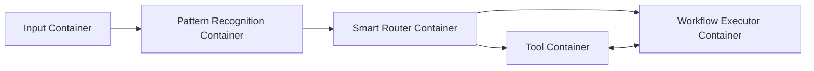

#### 1. Input Container
- **Input**: Raw user commands and text
- **Output**: Parsed commands and user requests
- **Responsibility**: User interaction interface
- **Mode Handling**: Explicit mode selection (--mode flag, Ctrl+Tab cycling)
- **Implementation**: CLI (Command Line Interface)

#### 2. Pattern Recognition Container  
- **Input**: User text requests + current mode context
- **Output**: Detected cognitive mode
- **Responsibility**: Intent classification and mode detection with context awareness
- **Core Function**: `detectMode(userInput, currentMode?) → Mode`

#### 3. Smart Router Container
- **Input**: Cognitive mode only
- **Output**: Workflow specification + parameter request
- **Responsibility**: Mode to workflow transformation
- **Core Function**: `transformMode(mode) → WorkflowSpec + ParameterRequest`

#### 4. Tool Container (Tool Box)
- **Input**: Tool execution requests from Smart Router and Workflow Executor
- **Output**: Tool execution results
- **Responsibility**: Tool discovery, execution, orchestration, and lifecycle management
- **Core Function**: `executeTool(toolSpec, parameters) → ToolResult`

#### 5. Workflow Executor Container (WE + LLM)
- **Input**: Workflow specification + execution parameters + tool results
- **Output**: Workflow execution results
- **Responsibility**: Workflow orchestration and LLM integration (no direct tool execution)
- **Core Function**: `executeWorkflow(workflowSpec, parameters) → Results`

## Container Abstract Architectures

This section defines the abstract architecture patterns for each container, providing implementation guidance while maintaining framework-agnostic interfaces.

### Input Container Abstract Architecture

The Input Container implements a **CLI Abstraction Pattern** supporting both syntactic and semantic command parsing strategies.

#### Architecture Options

**1. Syntactic Parsing (Current)**
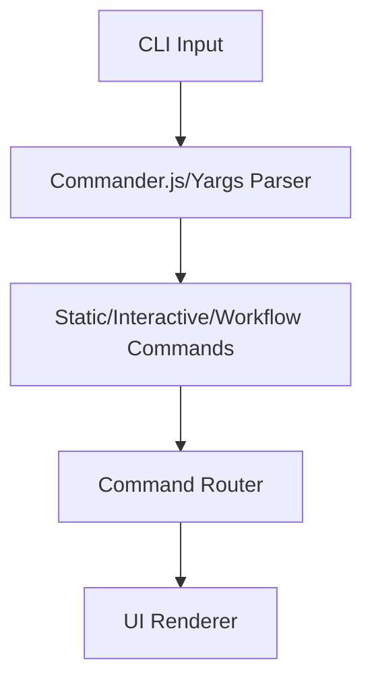

**2. Semantic Parsing (LangChain-Enhanced)**
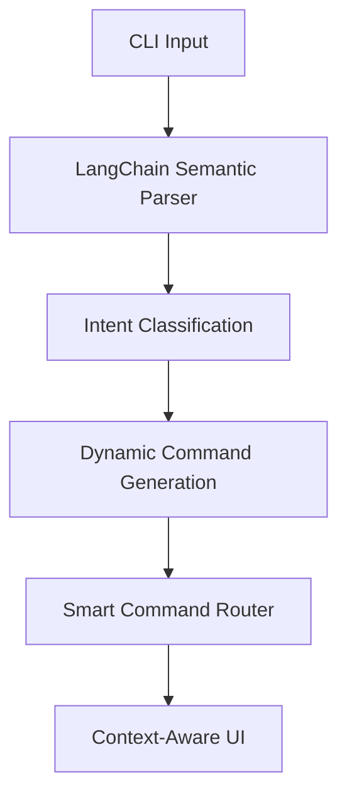

#### Implementation Strategies
- **Syntactic**: Uses traditional argument parsers (Commander.js, Yargs) for structured commands
- **Semantic**: Uses LangChain for natural language command understanding
- **Hybrid**: Combines both approaches with fallback mechanisms

#### Technology Selection Criteria
- **Syntactic**: Fast startup, predictable parsing, traditional CLI expectations
- **Semantic**: Natural language interface, reduced learning curve, context awareness
- **Evolution Path**: Start syntactic → Add semantic layer → Full semantic integration

### Pattern Recognition Container Abstract Architecture

The Pattern Recognition Container implements a **Multi-Strategy Analysis Pattern** providing flexible intent detection without framework lock-in.

#### Architecture Strategies

**1. Rule-Based Strategy**
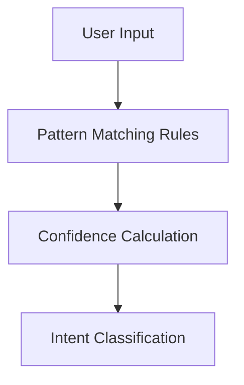

**2. LLM-Based Strategy**
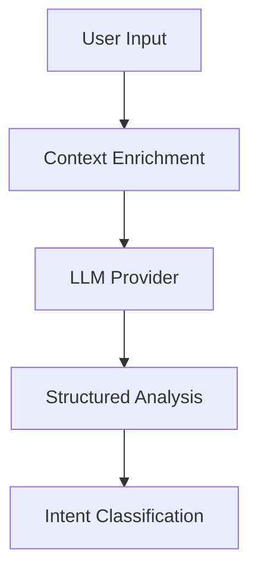

**3. Hybrid Strategy (Recommended)**
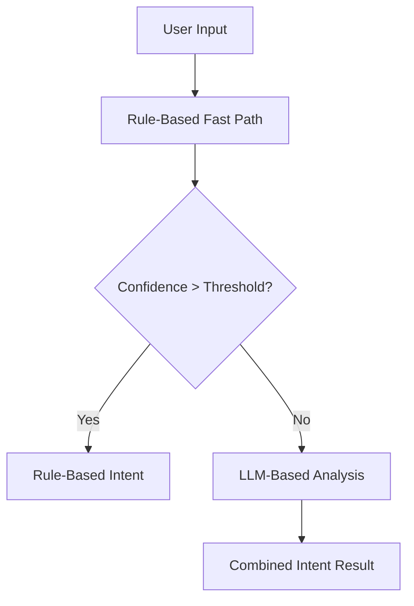

#### Framework Integration
- **Rule Engine**: Custom pattern matching (no external dependencies)
- **LLM Integration**: LangChain providers, Ollama, OpenAI, or custom implementations
- **ML Models**: Optional scikit-learn, TensorFlow, or custom trained models
- **Not a LangChain Blackbox**: Flexible architecture supporting multiple approaches

### Smart Router Container Abstract Architecture

The Smart Router Container implements an **Interface-Based Composition Pattern** enabling provider substitution and testing isolation.

#### Current Architecture Gap
```typescript
// Current: Monolithic AgentFactory
const agentFactory = new AgentFactory(config);
await agentFactory.chat(messages, options);

// Target: Interface-Based Composition
const smartRouter = new SmartRouter({
  llmProvider: new OllamaProvider(config.llm),
  toolManager: new CompositeTool([...]),
  intentAnalyzer: new HybridAnalyzer(config.routing),
  conversationManager: new MemoryManager(config.memory)
});
```

#### Composition Architecture
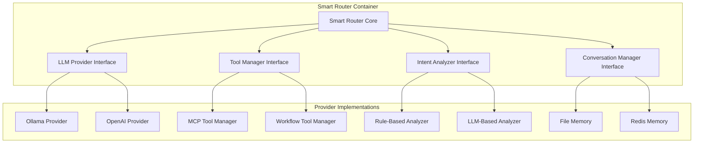

#### Benefits
- **Provider Substitution**: Switch LLM providers without code changes
- **Tool Composition**: Mix and match different tool providers
- **Intent Customization**: Replace or enhance intent analysis logic
- **Testing**: Mock individual components for testing
- **Monitoring**: Standardized metrics and error reporting

### Tool Container Abstract Architecture

The Tool Container implements a **Tool Box Pattern** providing unified tool discovery, execution, and orchestration.

#### Orchestration Patterns
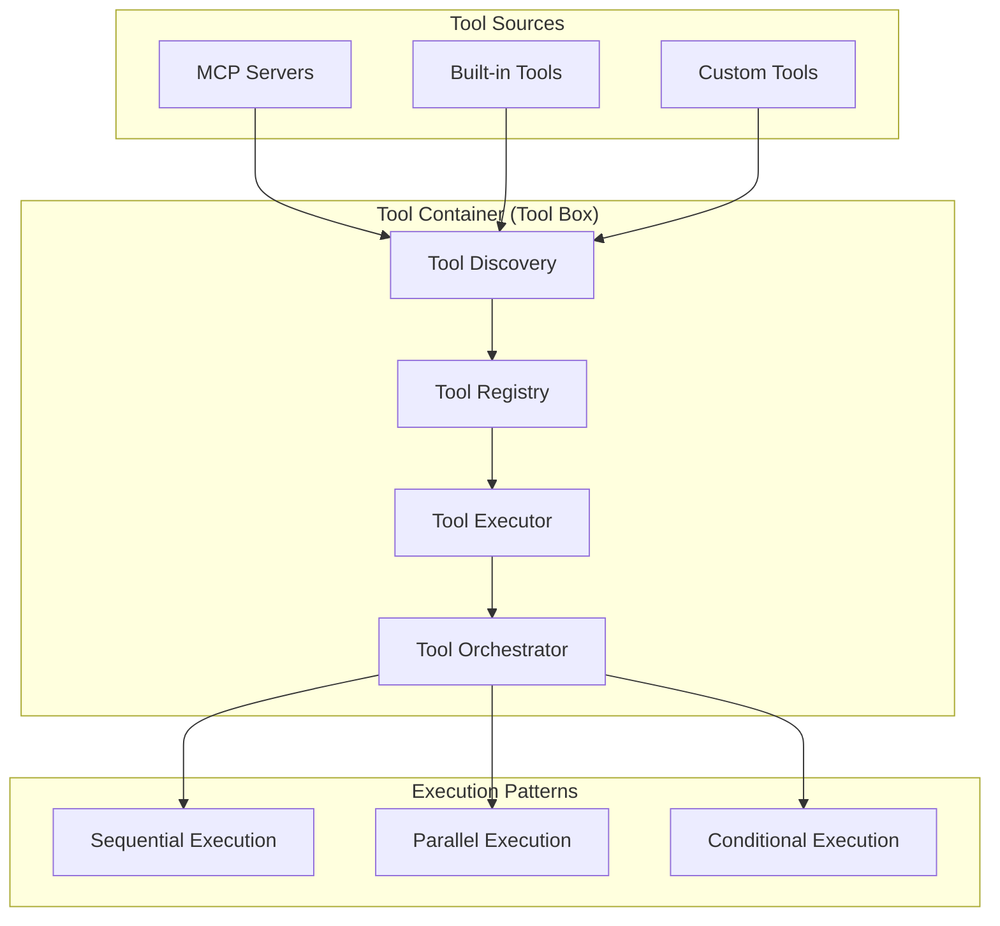

#### Security and Sandboxing
- **Process Isolation**: Each tool execution in separate process
- **Resource Limits**: Memory, CPU, and time constraints
- **Path Restrictions**: Sandbox file system access
- **Network Controls**: Limited external access

### Workflow Executor Container Abstract Architecture

The Workflow Executor Container implements a **WE + LLM Pattern** separating orchestration logic from tool execution.

#### Integration Architecture
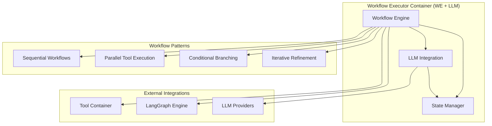

#### LLM Provider Abstraction
- **Provider Interface**: Unified interface for all LLM providers
- **Streaming Support**: Real-time response streaming
- **Context Management**: Conversation and tool result integration
- **Model Selection**: Dynamic model selection based on workflow requirements

## Agent Interface Contracts

### Standard Agent Interface
```typescript
interface Agent<TInput, TOutput> {
  process(input: TInput): Promise<TOutput>;
  validate(input: TInput): ValidationResult;
  getCapabilities(): AgentCapabilities;
}
```

### Container-Specific Interfaces

#### Input Container Interface
```typescript
interface InputContainer extends Agent<RawInput, ParsedRequest> {
  handleCommand(command: string[]): CommandResult;
  selectMode(mode: CognitiveMode): void;
  cycleMode(): CognitiveMode;
}
```

#### Pattern Recognition Container Interface  
```typescript
interface PatternRecognitionContainer extends Agent<PatternRecognitionInput, CognitiveMode> {
  detectMode(userInput: string, currentMode?: CognitiveMode): ModeDetectionResult;
  getConfidence(input: string, mode: CognitiveMode, context?: CognitiveMode): number;
  trainPattern(input: string, expectedMode: CognitiveMode, context?: CognitiveMode): void;
}

interface PatternRecognitionInput {
  userText: string;
  currentMode?: CognitiveMode;
  sessionContext?: SessionContext;
}
```

#### Smart Router Container Interface
```typescript
interface SmartRouterContainer extends Agent<CognitiveMode, WorkflowTransformation> {
  transformMode(mode: CognitiveMode): WorkflowSpecification;
  getParameterRequest(mode: CognitiveMode): ExecutionParameterRequest;
  validateMode(mode: CognitiveMode): boolean;
}
```

#### Tool Container Interface
```typescript
interface ToolContainer extends Agent<ToolExecutionRequest, ToolExecutionResult> {
  executeTool(toolSpec: ToolSpecification, params: ToolParameters): Promise<ToolResult>;
  discoverTools(): Promise<ToolDefinition[]>;
  orchestrateTools(toolChain: ToolCall[]): Promise<ToolChainResult>;
  getToolStatus(executionId: string): ToolExecutionStatus;
}
```

#### Workflow Executor Container Interface
```typescript
interface WorkflowExecutorContainer extends Agent<WorkflowExecution, WorkflowResult> {
  executeWorkflow(spec: WorkflowSpecification, params: ExecutionParameters): Promise<WorkflowResult>;
  integrateToolResults(toolResults: ToolResult[]): ProcessedResults;
  getWorkflowStatus(executionId: string): WorkflowStatus;
  cancelWorkflow(executionId: string): boolean;
}
```

## Agent Data Types

### Core Types
```typescript
type CognitiveMode = 'generic' | 'planning' | 'coding' | 'information' | 'debugging';

interface WorkflowSpecification {
  steps: WorkflowStep[];
  tools: string[];
  orchestration: 'sequential' | 'parallel' | 'langgraph';
  template: string;
}

interface ExecutionParameterRequest {
  requiredInputs: string[];
  optionalInputs: string[];
  contextRequirements: string[];
}

interface ExecutionParameters {
  userRequest: string;
  context: Record<string, any>;
  options: Record<string, any>;
}

interface ModeDetectionResult {
  detectedMode: CognitiveMode;
  confidence: number;
  fallbackMode?: CognitiveMode;
  contextInfluence?: {
    currentModeWeight: number;
    patternWeight: number;
  };
}
```

### Workflow Types
```typescript
interface WorkflowStep {
  id: string;
  type: 'llm' | 'tool_request' | 'transform' | 'condition';
  config: Record<string, any>;
  dependencies: string[];
  toolContainer?: ToolContainerRequest;
}

interface ToolContainerRequest {
  operation: 'execute_tool' | 'orchestrate_tools' | 'discover_tools';
  toolSpecs: ToolSpecification[];
  parameters: ToolParameters;
}

interface WorkflowResult {
  status: 'success' | 'error' | 'partial';
  output: any;
  metadata: WorkflowMetadata;
  errors?: Error[];
}
```

## Mode Context and Generic Mode

### Mode Context Behavior
The Pattern Recognition Agent considers current mode context when detecting new modes:

1. **Context-Aware Detection**: If user is in `planning` mode and says "now implement this", the agent can infer `coding` mode with higher confidence
2. **Mode Persistence**: Users can stay in a mode across multiple interactions until explicitly changed
3. **Generic Mode**: Default mode when no specific cognitive pattern is detected or system starts

### Generic Mode Characteristics
- **Purpose**: Handles general conversations and ambiguous requests
- **Workflow**: Simple LLM interaction without specialized tools
- **Fallback**: Used when pattern confidence is below threshold
- **Explicit Selection**: Users can explicitly select generic mode: `qi --mode=generic "chat with me"`

### Mode Detection Logic
```typescript
function detectMode(userInput: string, currentMode?: CognitiveMode): ModeDetectionResult {
  const patternScore = analyzePatterns(userInput);
  const contextScore = currentMode ? calculateContextWeight(currentMode, userInput) : 0;
  
  if (patternScore.confidence > 0.8) {
    return { detectedMode: patternScore.mode, confidence: patternScore.confidence };
  } else if (contextScore > 0.6 && currentMode !== 'generic') {
    return { detectedMode: currentMode, confidence: contextScore };
  } else {
    return { detectedMode: 'generic', confidence: 0.9 };
  }
}
```

## Agent Communication Patterns

### Synchronous Communication
```typescript
// Input → Pattern Recognition → Smart Router → Tool Container + Workflow Executor
const mode = await patternRecognitionContainer.process({
  userText: userInput,
  currentMode: sessionMode,
  sessionContext: context
});
const transformation = await smartRouterContainer.process(mode);

// Tool Container operates independently of workflow
const toolResults = await toolContainer.orchestrateTools(transformation.toolRequests);

// Workflow Executor integrates tool results with LLM processing
const result = await workflowExecutorContainer.process({
  specification: transformation.workflowSpec,
  parameters: collectedParameters,
  toolResults: toolResults
});
```

### Error Handling
```typescript
interface AgentError {
  agent: string;
  stage: 'input' | 'processing' | 'output';
  error: Error;
  fallback?: any;
}
```

### Container Composition
```typescript
class ContainerPipeline {
  constructor(
    private inputContainer: InputContainer,
    private patternRecognition: PatternRecognitionContainer,
    private smartRouter: SmartRouterContainer,
    private toolContainer: ToolContainer,
    private workflowExecutor: WorkflowExecutorContainer
  ) {}

  async processRequest(rawInput: RawInput): Promise<WorkflowResult> {
    const parsed = await this.inputContainer.process(rawInput);
    const mode = await this.patternRecognition.process({
      userText: parsed.text,
      currentMode: parsed.currentMode,
      sessionContext: parsed.context
    });
    const transformation = await this.smartRouter.process(mode);
    const parameters = await this.collectParameters(transformation.parameterRequest, parsed);
    
    // Execute tools independently in Tool Container
    const toolResults = await this.toolContainer.orchestrateTools(transformation.toolRequests);
    
    // Workflow Executor focuses on orchestration + LLM integration
    return await this.workflowExecutor.process({
      specification: transformation.workflowSpec,
      parameters,
      toolResults
    });
  }
}
```

## Container Lifecycle

### Initialization
1. **Container Startup**: Each container initializes independently
2. **Interface Registration**: Containers register their capabilities and interfaces
3. **Health Check**: System validates all container connections
4. **Ready State**: Pipeline becomes available for requests

### Request Processing
1. **Input Validation**: Each container validates its input contract
2. **Processing**: Container performs its specific responsibility  
3. **Output Generation**: Container produces output conforming to interface contract
4. **Error Handling**: Failures are contained and reported with fallback options

### State Management
- **Stateless Containers**: Pattern Recognition and Smart Router maintain no state
- **Tool State**: Tool Container maintains tool execution state and resource management
- **Workflow State**: Workflow Executor maintains orchestration state and LLM integration state
- **Session State**: Input Container maintains session state and user context
- **State Isolation**: Container state is encapsulated within container boundaries

## Container Testing Strategy

### Unit Testing
- Test each container interface independently
- Mock dependencies for isolated testing
- Validate input/output contracts

### Integration Testing  
- Test container communication patterns
- Validate data flow through pipeline
- Test error handling and fallback scenarios

### Contract Testing
- Verify interface compliance
- Test contract evolution and versioning
- Validate backward compatibility

## Container Deployment

### Container Independence
- Each container can be deployed independently
- Containers communicate via well-defined interfaces
- Horizontal scaling per container type

### Configuration
- Container-specific configuration management
- Interface endpoint configuration
- Capability and feature flags

## Implementation Notes

### Input Container Implementations
- **CLI Implementation**: Command-line interface (current implementation)
- **Future Implementations**: Web UI, REST API, gRPC, WebSocket interfaces
- **Interface Abstraction**: All implementations conform to InputContainer interface

### Container vs Implementation
- **Container**: Abstract responsibility and interface contract
- **Implementation**: Concrete technology realization (CLI, Web, etc.)
- **Flexibility**: Easy to swap implementations without affecting other containers

## Agent = Tool Box + WE + LLM Implementation

### Tool Box (Tool Container)
- **Purpose**: Pure tool execution and orchestration
- **Capabilities**: Tool discovery, execution, chaining, lifecycle management
- **Independence**: Operates independently of workflow logic
- **Reusability**: Can be used by any container requiring tool execution

### WE (Workflow Executor Container)
- **Purpose**: Workflow orchestration and LLM integration  
- **Capabilities**: Step sequencing, state management, LLM interaction
- **Focus**: Orchestration logic without direct tool execution
- **Integration**: Consumes tool results from Tool Container

### LLM (Integrated in Workflow Executor)
- **Purpose**: Language model inference and generation
- **Integration**: Embedded within Workflow Executor Container
- **Optimization**: Co-located with workflow logic for efficiency
- **Abstraction**: Provider-agnostic LLM interface

## Abstract Workflow Architecture

### Universal Workflow Pattern

All agent implementations follow a universal workflow architecture that can be specialized for any cognitive mode. This abstract pattern forms the foundation for all specific implementations:

```mermaid
graph TB
    subgraph "Abstract Workflow Architecture"
        A[Input Processing] --> B[Context Enrichment]
        B --> C[Tool Orchestration]
        C --> D[LLM Integration]
        D --> E[Result Synthesis]
        E --> F[Output Formatting]
    end
    
    subgraph "Workflow Implementation Pattern"
        A1[Input Node] --> B1[Context Node]
        B1 --> C1[Tool Execution Node]
        C1 --> D1[LLM Processing Node]
        D1 --> E1[Synthesis Node]
        E1 --> F1[Output Node]
        
        B1 -.->|Parallel| C1A[Tool A]
        B1 -.->|Parallel| C1B[Tool B]
        B1 -.->|Parallel| C1C[Tool C]
        C1A --> D1
        C1B --> D1
        C1C --> D1
    end
    
    subgraph "State Management"
        S1[Workflow State]
        S2[Tool Results State]
        S3[LLM Context State]
        S4[Output State]
        
        S1 --> S2
        S2 --> S3
        S3 --> S4
    end
    
    style A fill:#4fc3f7,stroke:#81d4fa,stroke-width:2px,color:#000
    style B fill:#ce93d8,stroke:#e1bee7,stroke-width:2px,color:#000
    style C fill:#81c784,stroke:#a5d6a7,stroke-width:2px,color:#000
    style D fill:#ffb74d,stroke:#ffcc02,stroke-width:2px,color:#000
    style E fill:#f48fb1,stroke:#f8bbd9,stroke-width:2px,color:#000
    style F fill:#64b5f6,stroke:#90caf9,stroke-width:2px,color:#000
```

### Workflow State Architecture

The abstract workflow maintains consistent state across all modes and agent implementations:

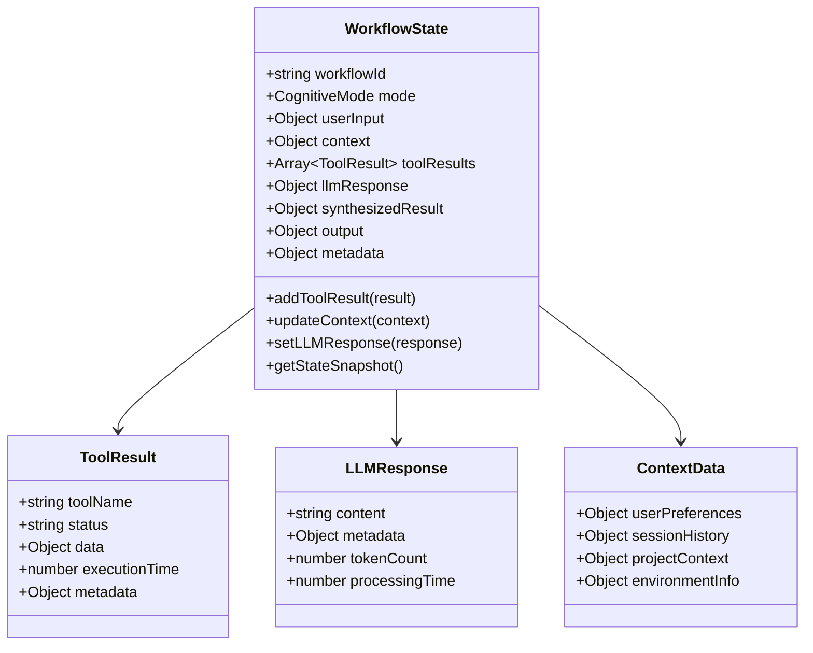

### Abstract Workflow Interface

All workflow implementations must conform to this abstract interface:

```typescript
interface AbstractWorkflow {
  // Core workflow nodes
  inputNode: (state: WorkflowState) => Promise<WorkflowState>;
  contextNode: (state: WorkflowState) => Promise<WorkflowState>;
  toolExecutionNode: (state: WorkflowState) => Promise<WorkflowState>;
  llmProcessingNode: (state: WorkflowState) => Promise<WorkflowState>;
  synthesisNode: (state: WorkflowState) => Promise<WorkflowState>;
  outputNode: (state: WorkflowState) => Promise<WorkflowState>;
  
  // State management
  stateSchema: WorkflowStateSchema;
  
  // Execution control
  conditionalEdges: ConditionalEdge[];
  parallelExecution: ParallelExecutionConfig;
}
```

### Workflow Orchestration Patterns

The system supports multiple orchestration patterns based on workflow complexity:

**1. Sequential Pattern (Simple Workflows)**
```typescript
const sequentialWorkflow = {
  nodes: ["input", "context", "tools", "llm", "output"],
  edges: [
    ["input", "context"],
    ["context", "tools"],
    ["tools", "llm"],
    ["llm", "output"]
  ]
};
```

**2. Parallel Tool Execution Pattern**
```typescript
const parallelToolWorkflow = {
  nodes: ["input", "context", "tool_parallel", "llm", "synthesis", "output"],
  parallelNodes: {
    tool_parallel: ["file_tools", "analysis_tools", "validation_tools"]
  },
  edges: [
    ["input", "context"],
    ["context", "tool_parallel"],
    ["tool_parallel", "llm"],
    ["llm", "synthesis"],
    ["synthesis", "output"]
  ]
};
```

**3. Iterative Workflow Pattern (Complex Analysis)**
```typescript
const iterativeWorkflow = {
  nodes: ["input", "context", "tools", "analysis", "validation", "llm", "output"],
  conditionalEdges: [
    {
      source: "analysis",
      condition: "needsMoreData",
      targets: { true: "tools", false: "llm" }
    },
    {
      source: "validation", 
      condition: "isComplete",
      targets: { true: "output", false: "analysis" }
    }
  ]
};
```

### Mode-Specific Specializations

Each cognitive mode specializes the abstract workflow pattern while maintaining the same underlying structure:

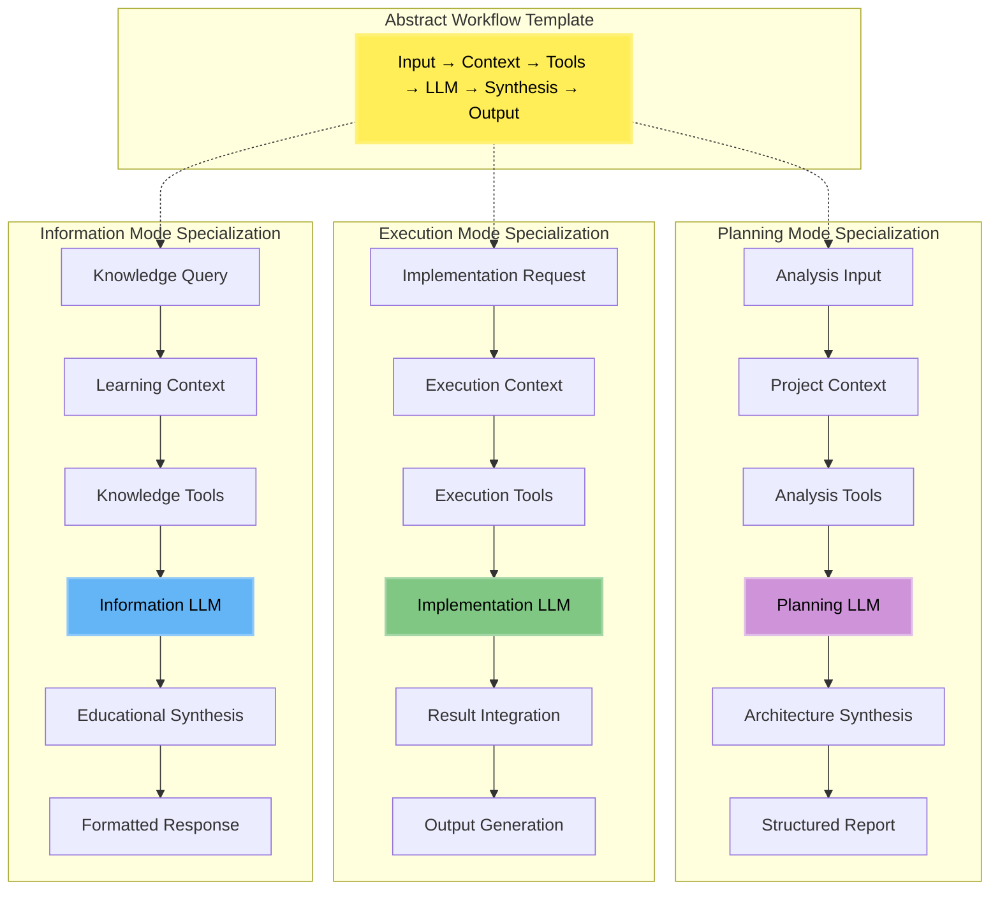

### Workflow Executor Container Implementation

The Workflow Executor Container implements this abstract pattern for any agent type:

```typescript
class WorkflowExecutorContainer {
  private workflowTemplates: Map<CognitiveMode, WorkflowTemplate>;
  
  async executeWorkflow(request: WorkflowExecutionRequest): Promise<WorkflowResult> {
    // 1. Select appropriate workflow template
    const template = this.workflowTemplates.get(request.mode);
    
    // 2. Create workflow instance following abstract pattern
    const workflow = this.createWorkflowInstance(template);
    
    // 3. Initialize workflow state
    const initialState: WorkflowState = {
      workflowId: request.workflowId,
      mode: request.mode,
      userInput: request.userInput,
      context: request.context,
      toolResults: request.toolResults || [],
      metadata: this.createMetadata()
    };
    
    // 4. Execute workflow following abstract pattern
    const finalState = await workflow.execute(initialState);
    
    // 5. Return formatted result
    return this.formatWorkflowResult(finalState);
  }
}
```

This abstract workflow architecture provides:
- **Consistency**: Same pattern across all cognitive modes and agent types
- **Flexibility**: Easy to add new modes or modify existing workflows
- **Scalability**: Supports simple to complex orchestration patterns
- **Maintainability**: Clear separation between workflow logic and mode-specific implementation
- **Universality**: Foundation for any agent implementation (coding, research, writing, etc.)

## Architecture Design Principles

### Framework-Agnostic Design

The agent architecture prioritizes **interface-driven design** over framework lock-in:

#### Core Principles
1. **Provider Abstraction**: All external services accessed through interfaces
2. **Strategy Pattern**: Multiple implementation approaches for each container
3. **Composition over Inheritance**: Interface-based composition for flexibility
4. **Dependency Inversion**: High-level modules independent of low-level implementations

#### Framework Independence Examples
```typescript
// CLI Container: Framework-agnostic command parsing
interface ICommandParser {
  parse(args: string[]): ParsedCommand;
}

// Implementations: Commander.js, Yargs, LangChain, Custom
class CommanderParser implements ICommandParser { /* ... */ }
class LangChainParser implements ICommandParser { /* ... */ }

// Pattern Recognition: Multiple analysis strategies
interface IIntentAnalyzer {
  analyzeIntent(request: IntentAnalysisRequest): IntentAnalysisResult;
}

// Implementations: Rule-based, LLM-based, Hybrid, ML Model
class RuleBasedAnalyzer implements IIntentAnalyzer { /* ... */ }
class LLMBasedAnalyzer implements IIntentAnalyzer { /* ... */ }
class HybridAnalyzer implements IIntentAnalyzer { /* ... */ }
```

### Implementation Strategy Guidance

#### Technology Selection Decision Matrix

| Container | Current Implementation | Alternative Options | Selection Criteria |
|-----------|----------------------|-------------------|-------------------|
| **Input** | Commander.js (Syntactic) | LangChain (Semantic), Yargs, Custom | Performance vs Natural Language |
| **Pattern Recognition** | Hybrid (Rules + LLM) | Pure Rule-based, Pure LLM, ML Model | Accuracy vs Speed vs Resources |
| **Smart Router** | Monolithic AgentFactory | Interface Composition | Testability vs Complexity |
| **Tool Container** | MCP Servers | Direct Integration, Plugin System | Security vs Flexibility |
| **Workflow Executor** | LangGraph + Ollama | Custom Orchestration, Cloud LLMs | Local vs Cloud, Cost vs Features |

#### Evolution Strategies

**1. CLI Container Evolution Path**
```
Phase 1: Commander.js (Current)
    ↓
Phase 2: Add LangChain semantic layer
    ↓
Phase 3: Hybrid syntactic/semantic parsing
    ↓  
Phase 4: Full semantic CLI with fallback
```

**2. Pattern Recognition Evolution Path**
```
Phase 1: Rule-based (Fast startup)
    ↓
Phase 2: Add LLM fallback for unknown patterns
    ↓
Phase 3: Hybrid with confidence thresholds
    ↓
Phase 4: ML model training from usage patterns
```

**3. Smart Router Evolution Path**
```
Phase 1: Extract interfaces from AgentFactory
    ↓
Phase 2: Implement provider abstractions
    ↓
Phase 3: Add alternative implementations
    ↓
Phase 4: Dynamic provider selection
```

#### Performance vs Capability Trade-offs

**Startup Time Considerations**
- **Rule-based Pattern Recognition**: ~10ms startup, limited accuracy
- **LLM-based Pattern Recognition**: ~2-5s startup, high accuracy
- **Hybrid Approach**: ~500ms startup, balanced accuracy/speed

**Memory Usage Considerations**
- **Syntactic CLI**: ~5MB memory footprint
- **Semantic CLI**: ~50-500MB memory footprint (LLM models)
- **Tool Container**: Scales with number of active MCP servers

**Accuracy vs Speed Trade-offs**
- **Fast Path**: Rule-based → 95% accuracy, <50ms response
- **Accurate Path**: LLM-based → 99% accuracy, 1-3s response
- **Balanced Path**: Hybrid → 98% accuracy, 200-500ms response

### Container Communication Patterns

#### Message Flow Architecture

**1. Synchronous Request-Response Pattern**
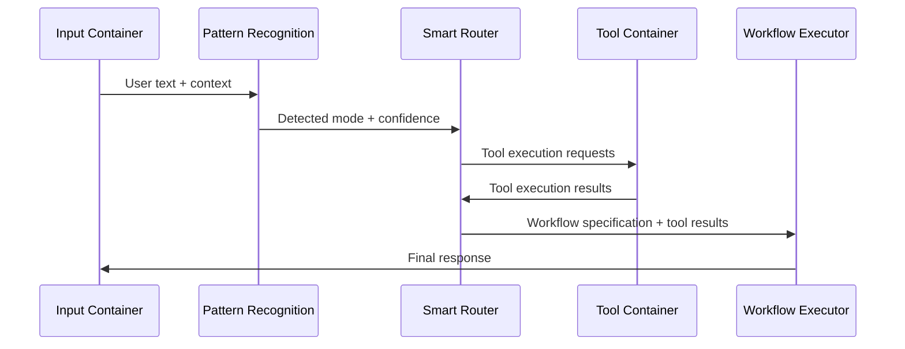

**2. Asynchronous Streaming Pattern**
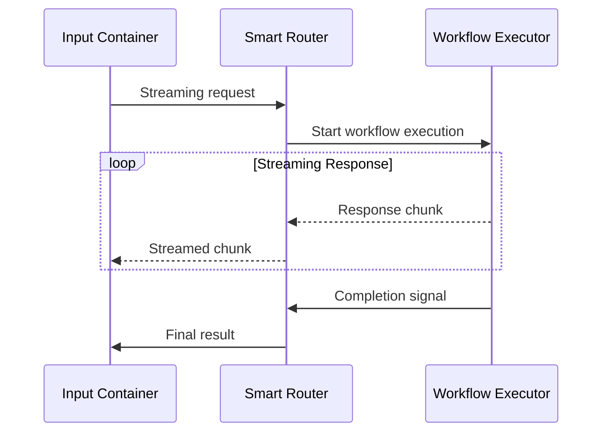

#### State Management Patterns

**1. Container State Isolation**
```typescript
// Each container maintains its own state
interface ContainerState {
  containerId: string;
  version: string;
  status: ContainerStatus;
  metrics: ContainerMetrics;
}

// Cross-container state through explicit contracts
interface SessionState {
  sessionId: string;
  currentMode: CognitiveMode;
  contextHistory: ContextSnapshot[];
  preferences: UserPreferences;
}
```

**2. Event-Driven State Synchronization**
```typescript
// State changes propagated through events
interface StateChangeEvent {
  containerId: string;
  changeType: 'mode_change' | 'context_update' | 'preference_change';
  oldState: any;
  newState: any;
  timestamp: Date;
}
```

#### Error Handling and Fallback Strategies

**1. Container-Level Error Handling**
```typescript
interface ContainerErrorHandler {
  handleError(error: ContainerError): Promise<ErrorResolution>;
  getFallbackStrategy(error: ContainerError): FallbackStrategy;
  reportError(error: ContainerError): Promise<void>;
}

enum FallbackStrategy {
  RETRY_WITH_BACKOFF = 'retry_with_backoff',
  DEGRADE_TO_SIMPLER = 'degrade_to_simpler',
  ROUTE_TO_ALTERNATIVE = 'route_to_alternative',
  FAIL_GRACEFULLY = 'fail_gracefully'
}
```

**2. System-Level Resilience Patterns**
```typescript
// Circuit breaker for container communication
class ContainerCircuitBreaker {
  private failureCount = 0;
  private lastFailureTime?: Date;
  private state: 'CLOSED' | 'OPEN' | 'HALF_OPEN' = 'CLOSED';
  
  async callContainer<T>(
    containerCall: () => Promise<T>,
    fallback: () => Promise<T>
  ): Promise<T> {
    if (this.state === 'OPEN') {
      return fallback();
    }
    
    try {
      const result = await containerCall();
      this.onSuccess();
      return result;
    } catch (error) {
      this.onFailure();
      return fallback();
    }
  }
}
```

#### Cross-Container Integration Patterns

**1. Container Discovery and Registration**
```typescript
interface ContainerRegistry {
  registerContainer(container: ContainerInfo): Promise<void>;
  discoverContainers(type?: ContainerType): Promise<ContainerInfo[]>;
  healthCheck(containerId: string): Promise<HealthStatus>;
}
```

**2. Message Bus Communication**
```typescript
interface InterContainerMessageBus {
  publish<T>(topic: string, message: T): Promise<void>;
  subscribe<T>(topic: string, handler: MessageHandler<T>): Subscription;
  request<TRequest, TResponse>(
    target: string, 
    request: TRequest
  ): Promise<TResponse>;
}
```

This agent model provides the conceptual foundation for the 5-container architecture implementing **Agent = Tool Box + WE + LLM**, ensuring clear separation of concerns, well-defined interfaces, maintainable container interactions with pure tool execution capabilities, and comprehensive architectural guidance for implementation decisions.