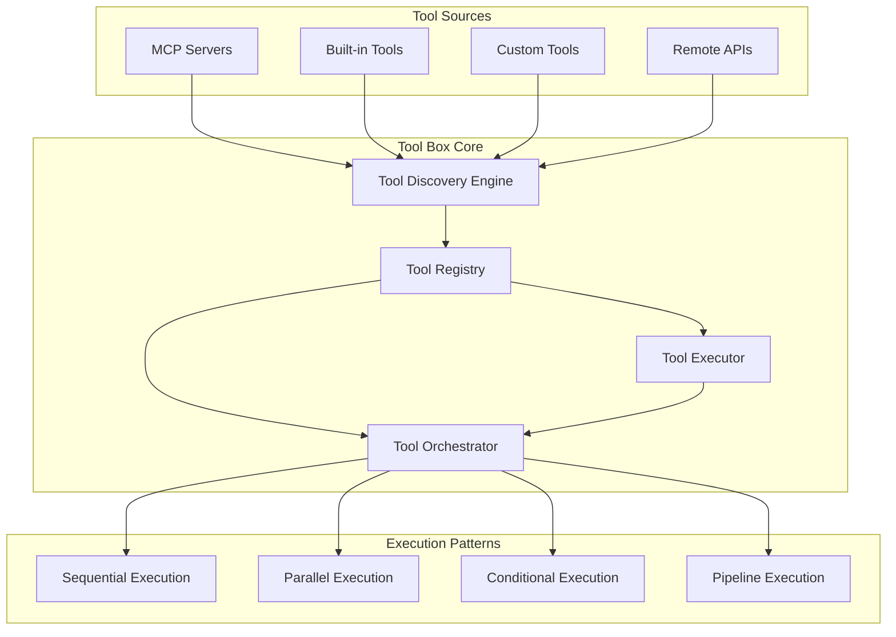

# Agent Model Architecture (C4 Level 1)

## Executive Summary

The qi-v2-agent system implements a **5-container microservices architecture** based on the **Agent = Tool Box + WE + LLM** model. This architecture provides:

- **Clear Separation of Concerns**: Each container has a single, well-defined responsibility
- **Framework Agnostic**: Interface-driven design prevents vendor lock-in
- **Scalable**: Containers can be independently scaled and deployed
- **Extensible**: New cognitive modes and tools can be added without architectural changes

### Key Architectural Decisions
1. **Tool execution is separated from workflow orchestration** (Tool Box pattern)
2. **Pattern recognition is decoupled from routing** (enabling flexible intent detection)
3. **LLM integration is embedded within workflow execution** (for efficiency)
4. **All containers communicate through well-defined interfaces** (enabling substitution)

---

## 1. Conceptual Architecture Overview

### 1.1 Core Model: Agent = Tool Box + WE + LLM


### 1.2 Five-Container Architecture


### 1.3 Container Responsibilities

| Container | Input | Output | Core Responsibility |
|-----------|-------|--------|-------------------|
| **Input** | Raw user commands | Parsed requests | User interaction interface |
| **Pattern Recognition** | User text + context | Cognitive mode | Intent classification |
| **Smart Router** | Cognitive mode | Workflow spec | Mode to workflow transformation |
| **Tool Container** | Tool requests | Execution results | Tool discovery & execution |
| **Workflow Executor** | Workflow spec + results | Final output | Orchestration + LLM integration |

---

## 2. Cognitive Modes and Workflows

### 2.1 Supported Cognitive Modes

The system recognizes five cognitive modes that map to specialized workflows:


### 2.2 Mode Detection Context

The Pattern Recognition container considers:
- **Current mode context**: Previous mode influences detection confidence
- **Pattern analysis**: Keywords, structure, and intent indicators
- **Confidence thresholds**: Falls back to generic mode when uncertain

```typescript
interface ModeDetectionResult {
  detectedMode: CognitiveMode;
  confidence: number;
  contextInfluence?: {
    currentModeWeight: number;
    patternWeight: number;
  };
}
```

---

## 3. Container Specifications

### 3.1 Input Container

**Purpose**: Provide user interaction interface with mode management


**Interface Contract**:
```typescript
interface InputContainer {
  handleCommand(command: string[]): CommandResult;
  selectMode(mode: CognitiveMode): void;
  cycleMode(): CognitiveMode;
}
```

### 3.2 Pattern Recognition Container

**Purpose**: Detect user intent and classify into cognitive modes


**Interface Contract**:
```typescript
interface PatternRecognitionContainer {
  detectMode(userInput: string, currentMode?: CognitiveMode): ModeDetectionResult;
  getConfidence(input: string, mode: CognitiveMode): number;
}
```

### 3.3 Smart Router Container

**Purpose**: Transform cognitive modes into executable workflow specifications


**Interface Contract**:
```typescript
interface SmartRouterContainer {
  transformMode(mode: CognitiveMode): WorkflowSpecification;
  getParameterRequest(mode: CognitiveMode): ParameterRequest;
}
```

### 3.4 Tool Container (Tool Box)

**Purpose**: Manage tool lifecycle, discovery, and execution


**Interface Contract**:
```typescript
interface ToolContainer {
  executeTool(toolSpec: ToolSpec, params: any): Promise<ToolResult>;
  discoverTools(): Promise<ToolDefinition[]>;
  orchestrateTools(toolChain: ToolCall[]): Promise<ToolChainResult>;
}
```

### 3.5 Workflow Executor Container (WE + LLM)

**Purpose**: Orchestrate workflows and integrate LLM processing


**Interface Contract**:
```typescript
interface WorkflowExecutorContainer {
  executeWorkflow(spec: WorkflowSpec, params: ExecutionParams): Promise<WorkflowResult>;
  integrateToolResults(results: ToolResult[]): ProcessedResults;
}
```

---

## 4. Container Abstract Architectures

This section provides detailed implementation architectures for each container, enabling framework-agnostic design while maintaining clear implementation patterns.

### 4.1 Input Container Abstract Architecture

The Input Container implements a **CLI Abstraction Pattern** supporting both syntactic and semantic command parsing strategies.

#### Architecture Options

**Option 1: Syntactic Parsing (Current)**


**Option 2: Semantic Parsing (LangChain-Enhanced)**


**Option 3: Hybrid Approach (Recommended)**


#### Implementation Strategies
- **Syntactic**: Fast startup, predictable parsing, traditional CLI expectations
- **Semantic**: Natural language interface, reduced learning curve, context awareness
- **Hybrid**: Best of both worlds with intelligent routing

#### Framework-Agnostic Interface
```typescript
interface ICommandParser {
  parse(args: string[]): ParsedCommand;
  supports(input: string): boolean;
}

// Multiple implementations
class CommanderParser implements ICommandParser { /* ... */ }
class LangChainParser implements ICommandParser { /* ... */ }
class HybridParser implements ICommandParser { /* ... */ }
```

### 4.2 Pattern Recognition Container Abstract Architecture

The Pattern Recognition Container implements a **Multi-Strategy Analysis Pattern** for flexible intent detection.

#### Architecture Strategies

**Strategy 1: Rule-Based Pattern Matching**


**Strategy 2: LLM-Based Analysis**


**Strategy 3: Hybrid Strategy (Recommended)**


#### Pattern Recognition Engine
```typescript
interface IPatternEngine {
  analyze(input: string, context?: AnalysisContext): PatternResult;
  train(examples: TrainingExample[]): void;
  getConfidenceFactors(): ConfidenceFactors;
}

interface AnalysisContext {
  currentMode?: CognitiveMode;
  recentHistory?: HistoryItem[];
  userPreferences?: Preferences;
}

// Pluggable implementations
class RuleEngine implements IPatternEngine { /* ... */ }
class LLMEngine implements IPatternEngine { /* ... */ }
class HybridEngine implements IPatternEngine { /* ... */ }
class MLEngine implements IPatternEngine { /* scikit-learn/TensorFlow */ }
```

### 4.3 Smart Router Container Abstract Architecture

The Smart Router Container implements an **Interface-Based Composition Pattern** for maximum flexibility and testability.

#### Current vs Target Architecture

**Current: Monolithic AgentFactory**
```typescript
// Tightly coupled, hard to test
const agentFactory = new AgentFactory(config);
await agentFactory.chat(messages, options);
```

**Target: Composable Architecture**
```typescript
// Loosely coupled, testable, extensible
const smartRouter = new SmartRouter({
  llmProvider: new OllamaProvider(config.llm),
  toolManager: new CompositeTool(tools),
  intentAnalyzer: new HybridAnalyzer(config.routing),
  conversationManager: new MemoryManager(config.memory)
});
```

#### Composition Architecture


#### Workflow Transformation Pipeline


#### Router Interfaces
```typescript
interface ISmartRouter {
  // Core routing
  route(mode: CognitiveMode): Promise<RoutingResult>;
  
  // Component management
  setProvider(type: ProviderType, provider: IProvider): void;
  getProvider<T extends IProvider>(type: ProviderType): T;
  
  // Workflow composition
  composeWorkflow(mode: CognitiveMode, params: any): WorkflowSpec;
  validateWorkflow(spec: WorkflowSpec): ValidationResult;
}

interface IProvider {
  initialize(): Promise<void>;
  healthCheck(): Promise<HealthStatus>;
  getCapabilities(): ProviderCapabilities;
}
```

### 4.4 Tool Container Abstract Architecture

The Tool Container implements a **Tool Box Pattern** providing unified tool discovery, execution, and orchestration.

#### Tool Container Architecture


#### Tool Lifecycle Management


#### Security and Sandboxing Architecture


#### Tool Orchestration Patterns
```typescript
interface IToolOrchestrator {
  // Execution patterns
  executeSequential(tools: ToolCall[]): Promise<ToolResult[]>;
  executeParallel(tools: ToolCall[]): Promise<ToolResult[]>;
  executeConditional(
    condition: ToolCondition, 
    branches: ToolBranch[]
  ): Promise<ToolResult>;
  executePipeline(
    pipeline: ToolPipeline
  ): Promise<PipelineResult>;
  
  // Advanced patterns
  executeWithRetry(
    tool: ToolCall, 
    retryPolicy: RetryPolicy
  ): Promise<ToolResult>;
  executeWithTimeout(
    tool: ToolCall, 
    timeout: number
  ): Promise<ToolResult>;
  executeWithCircuitBreaker(
    tool: ToolCall, 
    breaker: CircuitBreaker
  ): Promise<ToolResult>;
}

interface ToolSandbox {
  // Security controls
  processIsolation: ProcessIsolationLevel;
  resourceLimits: ResourceLimits;
  networkPolicy: NetworkPolicy;
  filesystemBoundaries: FileSystemBoundaries;
  
  // Execution context
  execute(tool: Tool, params: any): Promise<SandboxedResult>;
  terminate(executionId: string): void;
  getMetrics(executionId: string): ExecutionMetrics;
}
```

### 4.5 Cross-Container Integration Patterns

#### Service Discovery and Registration


#### Message Bus Architecture
```typescript
interface IMessageBus {
  // Publishing
  publish<T>(topic: string, message: T): Promise<void>;
  broadcast<T>(message: T): Promise<void>;
  
  // Subscribing
  subscribe<T>(
    topic: string, 
    handler: MessageHandler<T>
  ): Subscription;
  
  // Request-Response
  request<TReq, TRes>(
    target: string, 
    request: TReq
  ): Promise<TRes>;
  
  // Stream support
  stream<T>(
    topic: string
  ): AsyncIterator<T>;
}

interface ContainerEndpoint {
  containerId: string;
  version: string;
  capabilities: string[];
  healthEndpoint: string;
  messageEndpoint: string;
}
```

---

## 5. Universal Workflow Architecture

All cognitive modes follow a universal workflow pattern that can be specialized:

### 4.1 Abstract Workflow Template

```mermaid
graph LR
    I[Input<br/>Processing] --> C[Context<br/>Enrichment]
    C --> T[Tool<br/>Orchestration]
    T --> L[LLM<br/>Integration]
    L --> S[Result<br/>Synthesis]
    S --> O[Output<br/>Formatting]
    
    style I fill:#4fc3f7,stroke:#29b6f6,stroke-width:2px
    style C fill:#ce93d8,stroke:#ba68c8,stroke-width:2px
    style T fill:#81c784,stroke:#66bb6a,stroke-width:2px
    style L fill:#ffb74d,stroke:#ffa726,stroke-width:2px
    style S fill:#f48fb1,stroke:#f06292,stroke-width:2px
    style O fill:#64b5f6,stroke:#42a5f5,stroke-width:2px
```

### 4.2 Mode-Specific Specializations

Each mode specializes the template while maintaining the same structure:

| Mode | Input Type | Context Focus | Tools Used | LLM Role | Output Format |
|------|------------|---------------|------------|----------|---------------|
| **Planning** | Analysis Request | Project Context | Analysis Tools | Architecture Design | Structured Report |
| **Coding** | Implementation Task | Code Context | Dev Tools | Code Generation | Source Code |
| **Information** | Knowledge Query | Learning Context | Research Tools | Information Synthesis | Educational Content |
| **Debugging** | Problem Description | Error Context | Debug Tools | Solution Finding | Fix + Explanation |
| **Generic** | Open Query | Conversation Context | None/Minimal | General Response | Conversational |

### 4.3 Workflow State Management

```typescript
interface WorkflowState {
  workflowId: string;
  mode: CognitiveMode;
  userInput: any;
  context: ContextData;
  toolResults: ToolResult[];
  llmResponse: LLMResponse;
  synthesizedResult: any;
  metadata: WorkflowMetadata;
}
```

---

## 5. Communication and Integration

### 5.1 Inter-Container Communication

```mermaid
sequenceDiagram
    participant User
    participant Input
    participant Pattern
    participant Router
    participant Tools
    participant Workflow
    
    User->>Input: Raw command
    Input->>Pattern: Parsed request
    Pattern->>Router: Detected mode
    Router->>Tools: Tool requests
    Router->>Workflow: Workflow spec
    Tools-->>Workflow: Tool results
    Workflow->>User: Final response
```

### 5.2 Error Handling Strategy

Each container implements a fallback strategy:

```typescript
enum FallbackStrategy {
  RETRY_WITH_BACKOFF,    // Temporary failures
  DEGRADE_TO_SIMPLER,    // Reduce functionality
  ROUTE_TO_ALTERNATIVE,  // Use different provider
  FAIL_GRACEFULLY       // Return error to user
}
```

### 5.3 State Isolation Principles

- **Container State**: Each container maintains internal state
- **Session State**: Shared through explicit interfaces only
- **No Shared Memory**: All communication via messages
- **Immutable Messages**: Prevent side effects

---

## 6. Implementation Guidelines

### 6.1 Technology Selection Matrix

| Container | Recommended Stack | Alternative Options | Decision Factors |
|-----------|------------------|-------------------|------------------|
| **Input** | Commander.js | Yargs, LangChain | Startup time, UX |
| **Pattern** | Hybrid (Rules+LLM) | Pure Rule/LLM | Accuracy vs Speed |
| **Router** | Interface-based | Monolithic | Testability |
| **Tools** | MCP Servers | Direct, Plugins | Security, Standards |
| **Workflow** | LangGraph | Custom, Temporal | Complexity, Scale |

### 6.2 Evolution Roadmap

```mermaid
graph TB
    subgraph "Phase 1: Foundation"
        P1A[Basic CLI Input]
        P1B[Rule-based Patterns]
        P1C[Simple Workflows]
    end
    
    subgraph "Phase 2: Enhancement"
        P2A[Semantic CLI]
        P2B[LLM Pattern Detection]
        P2C[Complex Workflows]
    end
    
    subgraph "Phase 3: Scale"
        P3A[Multi-modal Input]
        P3B[ML Pattern Learning]
        P3C[Distributed Workflows]
    end
    
    P1A --> P2A --> P3A
    P1B --> P2B --> P3B
    P1C --> P2C --> P3C
```

### 6.3 Performance Considerations

| Optimization | Target | Trade-off |
|-------------|--------|-----------|
| **Rule-based fast path** | <50ms response | Limited flexibility |
| **LLM caching** | Reduce API calls | Memory usage |
| **Tool parallelization** | Faster execution | Complexity |
| **Streaming responses** | Better UX | Implementation effort |

---

## 7. Testing and Quality Assurance

### 7.1 Testing Levels

1. **Unit Tests**: Container interface compliance
2. **Integration Tests**: Inter-container communication
3. **Contract Tests**: API compatibility
4. **E2E Tests**: Full workflow validation

### 7.2 Key Test Scenarios

```typescript
// Example test structure
describe('Pattern Recognition Container', () => {
  it('should detect coding mode from implementation keywords');
  it('should consider current mode context');
  it('should fallback to generic mode when uncertain');
  it('should handle malformed input gracefully');
});
```

---

## 8. Deployment Architecture

### 8.1 Container Independence

- Each container can be deployed independently
- Version compatibility through interfaces
- Rolling updates without downtime
- Horizontal scaling per container type

### 8.2 Configuration Management

```yaml
# Example container configuration
containers:
  input:
    type: cli
    parser: commander
    semantic_layer: false
  
  pattern_recognition:
    strategy: hybrid
    confidence_threshold: 0.8
    llm_fallback: true
  
  tool_container:
    providers:
      - mcp_servers
      - builtin_tools
    sandbox: strict
```

---

## 9. Security Considerations

### 9.1 Container Security

- **Process Isolation**: Each tool runs in sandbox
- **Resource Limits**: CPU, memory, time constraints
- **Path Restrictions**: Limited filesystem access
- **Network Controls**: Allowlist for external APIs

### 9.2 Data Flow Security

```mermaid
graph LR
    subgraph "Security Boundaries"
        User[User Input] -->|Validation| Input[Input Container]
        Input -->|Sanitized| Pattern[Pattern Recognition]
        Pattern -->|Verified| Router[Smart Router]
        Router -->|Authorized| Tools[Tool Container]
        Tools -->|Sandboxed| Execution[Tool Execution]
    end
```

---

## 10. Future Enhancements

### 10.1 Planned Features

1. **Multi-modal Input**: Voice, images, files
2. **Distributed Execution**: Cross-machine workflows
3. **Plugin Ecosystem**: Third-party tool integration
4. **Learning System**: Improve pattern detection over time

### 10.2 Research Areas

- **Adaptive Workflows**: Self-modifying based on results
- **Federated Learning**: Privacy-preserving pattern improvement
- **Edge Deployment**: Local-first architecture
- **Multi-agent Collaboration**: Container swarm patterns

---

## Appendix A: Complete Interface Definitions

[Include all TypeScript interfaces here]

## Appendix B: Example Workflows

[Include concrete workflow examples for each mode]

## Appendix C: Migration Guide

[Guide for migrating from monolithic to container architecture]