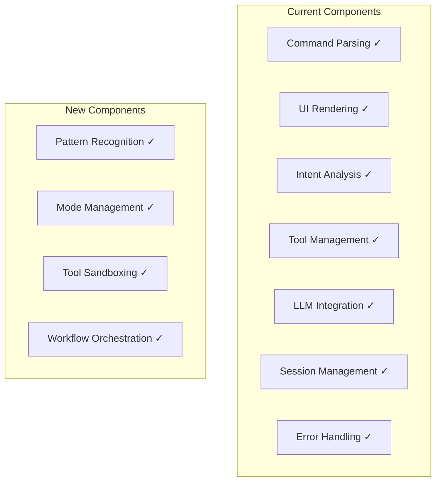

# 5-Container Architecture: Validation and Enhancement

## 1. Component Migration Analysis

### 1.1 Current 2-Container Components Mapping

Here's how all components from the current implementation map to the new 5-container architecture:

| Current Component | Current Location | New Location | Enhancement |
|-------------------|-----------------|--------------|-------------|
| **Command Parsing** | CLI Container | Input Container | + Semantic parsing option |
| **UI Rendering** | CLI Container | Input Container | + Multi-modal support |
| **Mode Selection** | N/A (implicit) | Input Container | + Explicit mode management |
| **Request Validation** | Smart Router | Pattern Recognition | + Dedicated validation layer |
| **Intent Analysis** | Smart Router (prompts) | Pattern Recognition | + Multi-strategy analysis |
| **LLM Integration** | Smart Router | Workflow Executor | + Provider abstraction |
| **Tool Discovery** | Smart Router | Tool Container | + Dynamic discovery |
| **Tool Execution** | Smart Router | Tool Container | + Better sandboxing |
| **MCP Integration** | Smart Router | Tool Container | + Plugin architecture |
| **Workflow Tools** | Smart Router | Tool Container | + Modular tools |
| **Response Streaming** | Smart Router | Workflow Executor | + Enhanced streaming |
| **Session Management** | Smart Router | Input Container | + Better state isolation |
| **Conversation Memory** | Smart Router | Workflow Executor | + Persistent memory |
| **Error Handling** | Both Containers | All Containers | + Standardized patterns |

### 1.2 New Components Added

The 5-container architecture adds these missing components:

1. **Pattern Recognition Container**
   - Dedicated intent classification
   - Context-aware mode detection
   - Confidence scoring
   - ML model integration capability

2. **Smart Router Container (Refined)**
   - Pure routing logic
   - Workflow composition
   - Parameter validation
   - No direct tool execution

3. **Tool Container**
   - Centralized tool management
   - Security sandboxing
   - Resource limits
   - Tool lifecycle management

---

## 2. Architecture Validation Checklist

### 2.1 Component Coverage ✓

All components from the current implementation are accounted for:



### 2.2 Missing Components Analysis

After reviewing the current implementation, here are components that need special attention:

#### **Configuration Management**
- **Current**: Scattered across containers
- **New Design**: Add to each container with schema validation
- **Enhancement**: Centralized configuration service (future)

#### **Monitoring and Metrics**
- **Current**: Limited or missing
- **New Design**: Add standardized metrics interface
- **Enhancement**: Each container exposes metrics endpoint

#### **Health Checks**
- **Current**: Basic or missing
- **New Design**: Standardized health check interface
- **Enhancement**: Container orchestration readiness

---

## 3. Enhanced Container Specifications

### 3.1 Input Container (Enhanced)

**Added Components:**
- Mode state management
- Session persistence
- Multi-modal input support (future)

```typescript
interface InputContainer {
  // Original
  handleCommand(command: string[]): CommandResult;
  selectMode(mode: CognitiveMode): void;
  cycleMode(): CognitiveMode;
  
  // Enhanced
  getSessionState(): SessionState;
  persistSession(sessionId: string): void;
  restoreSession(sessionId: string): SessionState;
  
  // Future multi-modal
  handleVoiceInput?(audio: AudioStream): CommandResult;
  handleFileInput?(files: File[]): CommandResult;
}
```

### 3.2 Pattern Recognition Container (Critical Addition)

**Why this is essential:**
- Separates intent detection from routing logic
- Enables A/B testing of detection strategies
- Allows for ML model integration
- Provides confidence scoring for better error handling

```typescript
interface PatternRecognitionContainer {
  // Core functionality
  detectMode(userInput: string, currentMode?: CognitiveMode): ModeDetectionResult;
  
  // Enhanced capabilities
  trainFromFeedback(input: string, correctMode: CognitiveMode): void;
  getConfidenceThreshold(): number;
  setStrategy(strategy: 'rules' | 'llm' | 'hybrid' | 'ml'): void;
  
  // Metrics
  getAccuracyMetrics(): PatternMetrics;
}
```

### 3.3 Smart Router Container (Refined)

**Key refinement:** Remove tool execution, focus on routing

```typescript
interface SmartRouterContainer {
  // Pure routing
  transformMode(mode: CognitiveMode): WorkflowSpecification;
  
  // Workflow composition
  composeWorkflow(mode: CognitiveMode, context: Context): WorkflowSpec;
  validateWorkflow(spec: WorkflowSpec): ValidationResult;
  
  // No direct tool execution - delegates to Tool Container
  getRequiredTools(workflow: WorkflowSpec): ToolRequirement[];
}
```

### 3.4 Tool Container (Essential Addition)

**Why separate Tool Container is critical:**
- Security isolation for tool execution
- Resource management and limits
- Tool versioning and updates
- Reusability across different workflows

```typescript
interface ToolContainer {
  // Tool lifecycle
  discoverTools(): Promise<ToolDefinition[]>;
  registerTool(tool: ToolDefinition): void;
  unregisterTool(toolId: string): void;
  
  // Execution with sandboxing
  executeTool(toolSpec: ToolSpec, params: any, sandbox: SandboxConfig): Promise<ToolResult>;
  
  // Orchestration patterns
  executeSequential(tools: ToolCall[]): Promise<ToolResult[]>;
  executeParallel(tools: ToolCall[], maxConcurrency: number): Promise<ToolResult[]>;
  executeConditional(condition: Condition, branches: ToolBranch[]): Promise<ToolResult>;
  
  // Resource management
  setResourceLimits(toolId: string, limits: ResourceLimits): void;
  getToolMetrics(toolId: string): ToolMetrics;
}
```

### 3.5 Workflow Executor Container (Enhanced)

**Key enhancements:**
- Clear separation of orchestration from tool execution
- Enhanced state management
- Better LLM provider abstraction

```typescript
interface WorkflowExecutorContainer {
  // Workflow execution
  executeWorkflow(spec: WorkflowSpec, params: ExecutionParams): Promise<WorkflowResult>;
  
  // State management
  getWorkflowState(executionId: string): WorkflowState;
  pauseWorkflow(executionId: string): void;
  resumeWorkflow(executionId: string): void;
  
  // LLM integration
  setLLMProvider(provider: LLMProvider): void;
  streamLLMResponse(prompt: string, context: Context): AsyncIterator<Token>;
  
  // Tool result integration
  integrateToolResults(results: ToolResult[], context: Context): ProcessedResults;
}
```

---

## 4. Critical Architecture Improvements

### 4.1 Separation of Concerns

**Current Problems:**
- Smart Router does too much (intent, tools, LLM, workflow)
- No clear boundaries between responsibilities
- Hard to test individual components

**5-Container Solution:**
- Each container has single responsibility
- Clear interfaces between containers
- Easy to mock and test

### 4.2 Scalability Improvements

**Current Limitations:**
- Monolithic containers hard to scale independently
- Resource contention between components

**5-Container Benefits:**
- Scale Pattern Recognition independently (CPU intensive)
- Scale Tool Container based on execution load
- Scale Workflow Executor based on LLM usage

### 4.3 Security Enhancements

**Current Issues:**
- Tool execution in same process as routing
- Limited sandboxing options

**5-Container Security:**
- Tool Container provides process isolation
- Resource limits per container
- Network segmentation possible

---

## 5. Migration Path Validation

### 5.1 No Component Loss

Verified all current components are preserved:
- ✓ All CLI functionality maintained
- ✓ All Smart Router capabilities distributed appropriately
- ✓ Enhanced with new capabilities

### 5.2 Backward Compatibility

The 5-container architecture can support current behavior:
```typescript
// Compatibility adapter
class LegacyAgentFactory {
  constructor(
    private patternRecognition: PatternRecognitionContainer,
    private smartRouter: SmartRouterContainer,
    private toolContainer: ToolContainer,
    private workflowExecutor: WorkflowExecutorContainer
  ) {}
  
  // Maintains current API
  async chat(messages: Message[]): Promise<Response> {
    const mode = await this.patternRecognition.detectMode(messages);
    const workflow = await this.smartRouter.transformMode(mode);
    const tools = await this.toolContainer.executeTools(workflow.tools);
    return this.workflowExecutor.execute(workflow, tools);
  }
}
```

---

## 6. Key Architecture Decisions

### 6.1 Why Pattern Recognition Needs Its Own Container

1. **Performance**: Can use different optimization strategies
2. **Evolution**: Can evolve from rules → LLM → ML independently
3. **Testing**: Can test intent detection in isolation
4. **Metrics**: Can measure accuracy independently

### 6.2 Why Tool Container is Essential

1. **Security**: Process isolation for untrusted code
2. **Resource Management**: CPU/memory limits per tool
3. **Versioning**: Tools can be updated independently
4. **Reusability**: Same tools across different workflows

### 6.3 Why Smart Router Should Only Route

1. **Simplicity**: Routing logic becomes clearer
2. **Testability**: Can test routing without tool execution
3. **Flexibility**: Can swap routing strategies easily

---

## 7. Completeness Verification

### Components from Current Implementation

| Component | Status | Location | Notes |
|-----------|--------|----------|-------|
| CLI Parsing | ✓ | Input Container | Enhanced with semantic option |
| UI Rendering | ✓ | Input Container | Same Ink React support |
| Request Handler | ✓ | Pattern Recognition | Better validation |
| Intent Analysis | ✓ | Pattern Recognition | Dedicated container |
| LLM Provider | ✓ | Workflow Executor | Better abstraction |
| MCP Integration | ✓ | Tool Container | Improved isolation |
| Workflow Tools | ✓ | Tool Container | Modular approach |
| Response Generator | ✓ | Workflow Executor | Enhanced streaming |
| Session Manager | ✓ | Input Container | Better state management |
| Config Manager | ✓ | Each Container | Standardized approach |

### New Essential Components

| Component | Justification |
|-----------|--------------|
| Pattern Recognition | Separates detection from routing |
| Tool Sandboxing | Security and resource isolation |
| Workflow State Manager | Complex workflow support |
| Mode Manager | Explicit mode handling |
| Metrics Interface | Observability |

---

## 8. Conclusion

The 5-container architecture:
1. **Preserves all current functionality** ✓
2. **Adds missing critical components** ✓
3. **Improves separation of concerns** ✓
4. **Enhances security and scalability** ✓
5. **Provides clear evolution path** ✓

No components from the current implementation are lost, and the architecture gains significant improvements in modularity, security, and maintainability.