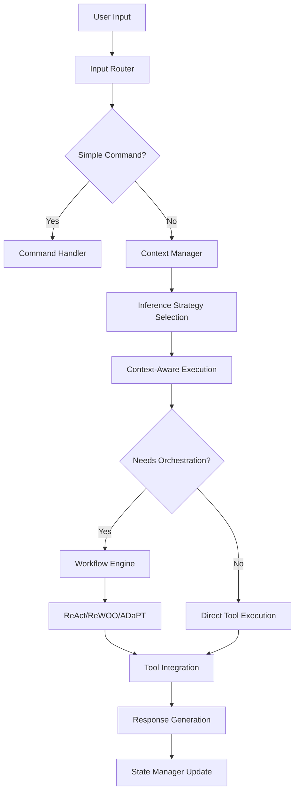

# Architecture Review: Component Analysis and Optimization

## Current Architecture Assessment

Based on new understanding of context management and workflow patterns, this document analyzes which components are essential and which need redesign.

## Component Analysis

### ✅ **Essential Components (Keep & Enhance)**

#### 1. **Context Manager** - **CORE COMPONENT**
- **Role**: Inference strategy engine + security isolation
- **Why Essential**: Handles all "learning paradigm" functionality through context manipulation
- **Enhancement Needed**: Add iterative refinement capabilities

#### 2. **Tool System** - **CORE COMPONENT** 
- **Role**: External system interaction layer
- **Why Essential**: Enables real-world actions (file ops, execution, search)
- **Status**: Excellently implemented, production-ready

#### 3. **Workflow Engine** - **CORE COMPONENT**
- **Role**: Task orchestration using ReAct/ReWOO/ADaPT patterns
- **Why Essential**: Handles complex multi-step task execution
- **Status**: Well-designed LangGraph implementation

#### 4. **State Manager** - **CORE COMPONENT**
- **Role**: Configuration, session, and conversation persistence
- **Why Essential**: Maintains system state across interactions
- **Status**: Solid implementation

### 🤔 **Questionable Components (Evaluate)**

#### 1. **Three-Category Classifier** - **POTENTIALLY REDUNDANT**

**Current Design**:
```typescript
type ClassificationType = 'command' | 'prompt' | 'workflow';
```

**Analysis**:
- **Commands**: Simple routing (`/help` → command handler)
- **Prompts**: Direct LLM calls → **Now handled by Context Manager**
- **Workflows**: Complex tasks → **Now handled by Workflow Engine**

**Problems Identified**:
1. **Overlap with Context Manager**: Context already handles inference strategies
2. **Workflow Detection**: ADaPT pattern can handle complexity assessment automatically
3. **Added Complexity**: Extra classification step before execution
4. **Misaligned Abstraction**: Doesn't match modern agentic patterns

**Recommendation**: **Simplify or eliminate**

### 🔄 **Redesigned Architecture Proposal**



### **Simplified Input Routing**

Replace three-category classifier with simple command detection:

```typescript
interface SimplifiedRouter {
  route(input: string): 'command' | 'execution';
}

class SimpleInputRouter implements SimplifiedRouter {
  route(input: string): 'command' | 'execution' {
    // Simple command detection
    if (input.startsWith('/') || isBuiltInCommand(input)) {
      return 'command';
    }
    
    // Everything else goes to context manager
    return 'execution';
  }
}
```

### **Context Manager as Primary Router**

```typescript
class EnhancedContextManager {
  async execute(input: string, sessionId: string): Promise<ExecutionResult> {
    // 1. Select inference strategy
    const strategy = this.selectInferenceStrategy(input);
    
    // 2. Assess complexity
    const complexity = this.assessComplexity(input);
    
    // 3. Route execution
    if (complexity === 'simple') {
      return this.executeDirectly(input, strategy);
    } else {
      return this.delegateToWorkflowEngine(input, strategy);
    }
  }
  
  private selectInferenceStrategy(input: string): InferenceStrategy {
    // Smart strategy selection based on context and input
    // No separate classifier needed
  }
}
```

## Component Architecture Redesign

### **Simplified Component Stack**

```
┌─────────────────────────────────────────┐
│                  CLI                    │
└─────────────────┬───────────────────────┘
                  │
┌─────────────────▼───────────────────────┐
│              QiCode Agent               │
│  ┌─────────────────────────────────────┐ │
│  │        Simple Input Router          │ │
│  └─────────────┬───────────────────────┘ │
│                │                         │
│       ┌────────▼────────┐                │
│       │ Command Handler │                │
│       └─────────────────┘                │
│                │                         │
│    ┌───────────▼──────────────────────┐  │
│    │        Context Manager          │  │
│    │  (Inference Strategy Engine)    │  │
│    └───────────┬──────────────────────┘  │
│                │                         │
│    ┌───────────▼──────────────────────┐  │
│    │       Workflow Engine           │  │
│    │   (ReAct/ReWOO/ADaPT)          │  │
│    └───────────┬──────────────────────┘  │
│                │                         │
│    ┌───────────▼──────────────────────┐  │
│    │        Tool System              │  │
│    └─────────────────────────────────┘  │
└─────────────────────────────────────────┘
```

### **Benefits of Simplified Architecture**

1. **Reduced Complexity**: One less classification layer
2. **Better Alignment**: Context manager becomes primary intelligence
3. **Natural Flow**: Input → Context → Workflow → Tools
4. **Easier Maintenance**: Fewer components to maintain
5. **Performance**: Faster routing without classification overhead

## Required Components for Full Implementation

### **Container Level Components**

```
┌─────────────────────────────────────────────────────────────┐
│                    qi-v2-agent System                      │
├─────────────────────────────────────────────────────────────┤
│  ┌─────────────────┐  ┌─────────────────┐  ┌─────────────┐ │
│  │   CLI Module    │  │   API Module    │  │ Config Mgmt │ │
│  └─────────────────┘  └─────────────────┘  └─────────────┘ │
├─────────────────────────────────────────────────────────────┤
│  ┌─────────────────┐  ┌─────────────────┐  ┌─────────────┐ │
│  │  Agent Core     │  │  Context Mgmt   │  │ Workflow    │ │
│  └─────────────────┘  └─────────────────┘  └─────────────┘ │
├─────────────────────────────────────────────────────────────┤
│  ┌─────────────────┐  ┌─────────────────┐  ┌─────────────┐ │
│  │  Tool System    │  │  State Mgmt     │  │ Security    │ │
│  └─────────────────┘  └─────────────────┘  └─────────────┘ │
├─────────────────────────────────────────────────────────────┤
│  ┌─────────────────┐  ┌─────────────────┐  ┌─────────────┐ │
│  │ LLM Providers   │  │ Data Storage    │  │ Monitoring  │ │
│  └─────────────────┘  └─────────────────┘  └─────────────┘ │
└─────────────────────────────────────────────────────────────┘
```

### **Essential Core Components**

1. **Agent Orchestrator** (simplified from current QiCodeAgent)
2. **Context Manager** (enhanced with inference strategies)
3. **Workflow Engine** (current LangGraph implementation)
4. **Tool System** (current comprehensive implementation)
5. **State Manager** (current implementation)

### **Supporting Components**

1. **Simple Input Router** (replaces three-category classifier)
2. **Security Gateway** (enhanced from current ContextManager)
3. **Configuration Manager** (current StateManager functionality)
4. **LLM Provider Abstraction** (current prompt handlers)
5. **Storage Backends** (current persistence layers)

## Implementation Strategy

### **Phase 1: Simplify Classification** ✅ **Ready to implement**
```typescript
// Replace IClassifier with SimpleInputRouter
interface SimpleInputRouter {
  isCommand(input: string): boolean;
  route(input: string): RouteTarget;
}
```

### **Phase 2: Enhance Context Manager** 🔄 **Design ready**
```typescript
// Add inference strategy capabilities
interface EnhancedContextManager extends IContextManager {
  selectInferenceStrategy(input: string): InferenceStrategy;
  executeWithStrategy(input: string, strategy: InferenceStrategy): Promise<Result>;
  shouldUseWorkflowEngine(input: string): boolean;
}
```

### **Phase 3: Agent Simplification** 📋 **Planned**
```typescript
// Simplified agent with direct routing
class SimplifiedQiAgent {
  async process(input: string): Promise<AgentResponse> {
    if (this.router.isCommand(input)) {
      return this.commandHandler.execute(input);
    }
    
    return this.contextManager.execute(input);
  }
}
```

## Answers to Specific Questions

### **Q: Do we still need the three-category classifiers?**

**Answer: NO** - Here's why:

1. **Commands**: Simple string matching (`input.startsWith('/')`)
2. **Prompts vs Workflows**: Context Manager can assess complexity and route automatically
3. **ADaPT Pattern**: Already includes complexity assessment and decomposition
4. **Redundant Layer**: Adds complexity without clear value

### **Q: What components are needed?**

**Essential Stack**:
1. ✅ **Context Manager** (inference strategy engine)
2. ✅ **Workflow Engine** (ReAct/ReWOO/ADaPT orchestration)  
3. ✅ **Tool System** (external interaction layer)
4. ✅ **State Manager** (persistence and configuration)
5. ⚡ **Simple Router** (replace classifier)
6. ⚡ **Agent Orchestrator** (simplified coordination)

**Optional/Future**:
- Sub-agent delegation (when ready for agent phase)
- MCP protocol integration
- Advanced security policies

## Conclusion

The current architecture is **80% correct** but has **over-engineered classification**. With our new understanding:

1. **Context Manager** becomes the primary intelligence layer
2. **Three-category classifier** can be simplified to command detection
3. **Workflow patterns** handle complexity assessment naturally
4. **Agent orchestration** should wait until core components are solid

**Recommendation**: Simplify classification, enhance context manager, then proceed with learning implementation.