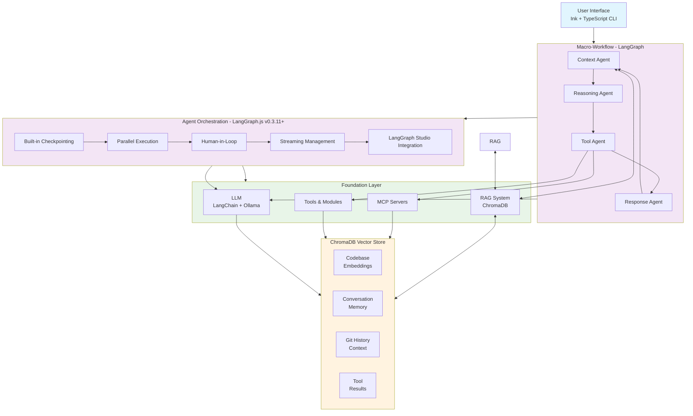

# Local AI Agent Design Document

## Executive Summary

This document outlines the design for an open-source AI coding assistant that provides Claude Code-like functionality with local LLM support. The system combines modern agent architecture with a polished terminal interface to create a professional-grade development tool.

## Core Concept Definitions

### Agent Definition
```
agent = toolbox + pe + llm
```

Where:
- **toolbox**: MCP servers + modules (external capabilities)
- **pe**: Process Executor (workflow orchestration)
- **llm**: Language model interaction layer

### Simplified Architecture Approach

**Agent Orchestration**: Unified LangGraph-based workflow management
- Single orchestration layer using LangGraph.js v0.3.11+ capabilities
- Built-in state management, checkpointing, and parallel execution
- Eliminates need for separate micro-workflow tools
- Leverages LangGraph Studio for visual debugging and development

## System Architecture

### High-Level Architecture

```
┌─────────────────────────────────────────────────────────────────┐
│                        User Interface                           │
│                   (Ink + TypeScript CLI)                        │
└─────────────────────────────┬───────────────────────────────────┘
                              │
┌─────────────────────────────▼───────────────────────────────────┐
│                   Agent Orchestration Layer                     │
│                    (LangGraph.js v0.3.11+)                      │
│  ┌─────────────┐ ┌─────────────┐ ┌─────────────┐ ┌───────────┐ │
│  │ Built-in    │ │ Parallel    │ │ Human-in-   │ │ Streaming │ │
│  │ Checkpoint  │ │ Execution   │ │ Loop        │ │ Management│ │
│  └─────────────┘ └─────────────┘ └─────────────┘ └───────────┘ │
│                                                                 │
│  ┌─────────────────────────────────────────────────────────┐   │
│  │           LangGraph Studio Integration                  │   │
│  │     (Visual Debugging & Development)                    │   │
│  └─────────────────────────────────────────────────────────┘   │
└─────────────────────────────┬───────────────────────────────────┘
                              │
┌─────────────────────────────▼───────────────────────────────────┐
│                      Foundation Layer                           │
│  ┌─────────────┐ ┌─────────────┐ ┌─────────────┐ ┌───────────┐ │
│  │ LLM         │ │ RAG System  │ │ MCP         │ │ Multi     │ │
│  │ (LangChain) │ │ (ChromaDB)  │ │ Integration │ │ Server    │ │
│  │ + Ollama    │ │ + Semantic  │ │ (Official   │ │ Client    │ │
│  │             │ │ Search      │ │ SDK)        │ │ Support   │ │
│  └─────────────┘ └─────────────┘ └─────────────┘ └───────────┘ │
└─────────────────────────────────────────────────────────────────┘

                    Knowledge & Context Management
┌─────────────────────────────────────────────────────────────────┐
│                      ChromaDB Vector Store                      │
│  ┌─────────────┐ ┌─────────────┐ ┌─────────────┐ ┌───────────┐ │
│  │ Codebase    │ │ Conversation│ │ Git History │ │ Tool      │ │
│  │ Embeddings  │ │ Memory      │ │ Context     │ │ Results   │ │
│  └─────────────┘ └─────────────┘ └─────────────┘ └───────────┘ │
└─────────────────────────────────────────────────────────────────┘
```

### Mermaid Architecture Diagram



### Component Architecture

#### 1. User Interface Layer
- **Framework**: Ink + TypeScript
- **Components**: 
  - Chat interface with streaming responses
  - Progress indicators and status displays
  - File diff visualization
  - Interactive command palette
- **Features**: React-based components, Flexbox layouts, terminal animations

#### 2. Macro-Workflow Layer (LangGraph.js v0.3.11+)
- **Purpose**: Unified agent orchestration with enhanced capabilities
- **Enhanced Features**:
  - **Built-in Checkpointing**: State persistence for debugging and recovery, eliminating custom checkpoint implementations
  - **Parallel Node Execution**: Concurrent agent operations for improved performance and reduced latency
  - **Human-in-the-Loop**: Interactive approval workflows with interrupt and resume capabilities
  - **Advanced Streaming**: Multiple streaming modes (messages, updates, events) with real-time feedback
  - **LangGraph Studio Integration**: Visual workflow debugging with automatic TypeScript type inference
- **Agent Components**:
  - **Context Agent**: RAG-powered file discovery with ChromaDB semantic search
  - **Reasoning Agent**: Enhanced task analysis with parallel reasoning paths
  - **Tool Agent**: MCP-integrated action execution with automatic tool conversion
  - **Response Agent**: Streaming-optimized output with structured response formatting

#### 3. Agent Orchestration Layer (LangGraph Enhanced)
- **Purpose**: Intelligent workflow orchestration with built-in capabilities
- **Components**:
  - **Built-in Checkpointing**: State persistence and debugging support
  - **Parallel Node Execution**: Concurrent agent operations for improved performance
  - **Human-in-the-Loop**: Interactive approval and intervention capabilities
  - **Streaming Management**: Real-time response streaming with multiple modes
  - **LangGraph Studio Integration**: Visual debugging and workflow development
  - **Prompt Chain Management**: Internal agent logic without external workflow tools

#### 4. Foundation Layer
- **LLM Interface (LangChain)**: 
  - Ollama integration (Llama 3.3, DeepSeek-R1, Phi-4, Gemma 3, Mistral Small 3.1)
  - Structured outputs support for JSON Schema constraints
  - Vision model support (Llama 3.2 Vision 11B/90B)
  - Multiple model support with model switching
  - Response streaming with async iterators
  - Full TypeScript integration with type safety
  - Error handling and retry logic
- **RAG System (ChromaDB + LangChain)**:
  - Vector database for codebase indexing
  - Semantic search for context retrieval
  - Document embedding and chunking
  - Relevance scoring and ranking
- **Context Management**:
  - Intelligent file discovery
  - Multi-turn conversation memory
  - Code relationship mapping
  - Token-efficient context compression
- **MCP Integration Architecture**:
  - **MultiServerMCPClient**: Official @langchain/mcp-adapters integration for managing multiple MCP servers
  - **Transport Support**: All transport types (stdio, SSE, HTTP, WebSocket) via @modelcontextprotocol/sdk
  - **Tool Auto-Loading**: Automatic conversion from MCP tools to LangChain tools with type safety
  - **Server Management**: Dynamic server configuration, health monitoring, and failover support
  - **Built-in MCP Servers**: File operations, shell commands, Git integration, web search
- **Security & Validation**:
  - Tool permission scoping with whitelist-based access control
  - Trusted server verification for MCP connections
  - Input sanitization and prompt injection protection
  - Audit logging for all tool calls and MCP interactions

## Data Flow

### Streamlined Request Processing Pipeline

1. **User Input** → Ink CLI Interface with real-time input validation
2. **Command Parsing** → LangGraph State Machine with built-in routing
3. **Context Retrieval** → ChromaDB semantic search with parallel embeddings
4. **Agent Orchestration** → LangGraph parallel execution with checkpointing
5. **Tool Execution** → MCP MultiServerClient with automatic tool conversion
6. **LLM Processing** → LangChain + Ollama with structured outputs and context injection
7. **Response Streaming** → Multi-mode streaming (messages/updates) with real-time UI updates
8. **Context Persistence** → ChromaDB updates with conversation memory and tool results

**Simplified from 10 to 8 steps** by eliminating separate agent routing and micro-workflow layers, leveraging LangGraph's built-in capabilities for orchestration and parallel execution.

### State Management

- **Conversation History**: Maintained in LangGraph state with vector embeddings
- **Codebase Knowledge**: Indexed in ChromaDB with semantic relationships
- **File Context**: Tracked per session with change detection and relevance scoring
- **Tool Results**: Cached with invalidation strategies and semantic indexing
- **User Preferences**: Persistent configuration storage with context personalization

## Core Features

### 1. Conversational Interface
- Natural language coding requests
- Context-aware responses
- Multi-turn conversation support
- Command history and replay

### 2. Project Intelligence
- RAG-powered codebase understanding and semantic search
- Automatic file discovery with relevance scoring via ChromaDB
- Git integration for change tracking and context evolution
- Dependency analysis and intelligent recommendations
- Code relationship mapping and impact analysis

### 3. Tool Integration
- File operations (read, write, edit)
- Shell command execution
- Git workflow automation
- Web search and documentation lookup

### 4. Local LLM Support
- Ollama integration with multiple models
- Model switching and comparison
- Offline operation capability
- Privacy-first architecture

## Technical Specifications

### Programming Language
- **Primary**: TypeScript
- **Runtime**: Node.js 18+
- **Package Manager**: npm/pnpm

### Key Dependencies
```json
{
  "ui": ["ink", "@inkjs/ui", "react"],
  "agents": ["@langchain/langgraph", "@langchain/core", "@langchain/mcp-adapters"],
  "mcp": ["@modelcontextprotocol/sdk"],
  "llm": ["@langchain/ollama", "@langchain/openai"],
  "rag": ["chromadb", "@langchain/community", "@langchain/textsplitters"],
  "embeddings": ["@langchain/ollama", "@langchain/openai"],
  "validation": ["zod"],
  "config": ["js-yaml"],
  "tools": ["commander", "chalk", "inquirer"]
}
```

**Critical Package Updates:**
- **@langchain/langgraph** (v0.3.11+): Complete LangGraph implementation with built-in checkpointing, parallel execution, and LangGraph Studio integration
- **@modelcontextprotocol/sdk**: Official MCP SDK with full TypeScript support for all transport types
- **@langchain/mcp-adapters**: Production-ready MCP-LangChain integration layer
- **@langchain/core**: Required peer dependency for LangGraph.js
- **zod**: Type-safe configuration validation
- **js-yaml**: YAML configuration file support

### Configuration
- YAML-based configuration files
- Environment variable support
- User-specific and project-specific settings
- Runtime configuration updates

## Security Considerations

### Data Privacy
- All processing happens locally
- No data sent to external services without explicit consent
- Conversation history encrypted at rest
- Configurable data retention policies

### MCP Security (2025 Updated)
- **Prompt Injection Protection**: Input sanitization and validation to prevent malicious prompt manipulation
- **Tool Permission Scoping**: Granular permissions for each MCP server with capability-based access control
- **Trusted Server Verification**: Cryptographic verification of MCP server authenticity and integrity
- **Lookalike Tool Prevention**: Server identity validation to prevent tool impersonation attacks
- **Audit Trail**: Comprehensive logging of all MCP interactions, tool calls, and security events

### Tool Execution
- Sandboxed command execution with restricted filesystem access
- User confirmation for destructive operations with risk assessment
- Whitelist-based tool access with dynamic permission updates
- Process isolation and resource limits for tool execution
- Automatic rollback capabilities for failed operations

## Performance Requirements

### Response Times
- Initial response: < 2 seconds
- Streaming latency: < 200ms
- File operations: < 1 second
- Model switching: < 5 seconds

### Resource Usage
- Memory: < 1GB base usage (updated for Ollama model requirements)
- CPU: Efficient batching for LLM calls with parallel processing support
- Storage: Configurable cache limits with ChromaDB optimization
- Network: Local-only by default with optional remote MCP server support

## Extensibility

### Plugin Architecture
- MCP server integration
- Custom tool development
- Workflow template system
- UI component extensions

### Model Support
- Ollama model management
- Multiple concurrent models
- Model-specific optimizations
- Custom model integration

## Deployment

### Installation
- npm package distribution
- Single binary builds (optional)
- Docker container support
- Development environment setup

### Configuration
- Guided setup wizard
- Model download automation
- Tool permission configuration
- Integration with existing development tools

## Success Metrics

### User Experience
- Setup time < 10 minutes
- Learning curve < 1 hour for basic usage
- 90%+ task completion rate
- Positive user feedback on UX quality

### Technical Performance
- 99% uptime in local environment
- Sub-second response times for common operations
- Memory usage within specified limits
- Successful integration with major development workflows

## Future Considerations

### Potential Enhancements
- Multi-agent collaboration
- Custom workflow builder UI
- Integration with IDEs
- Team/collaboration features

### Scalability
- Distributed agent execution
- Cloud deployment options
- Enterprise feature set
- API access for integrations

---

*This design document serves as the foundation for development and should be updated as the project evolves.*