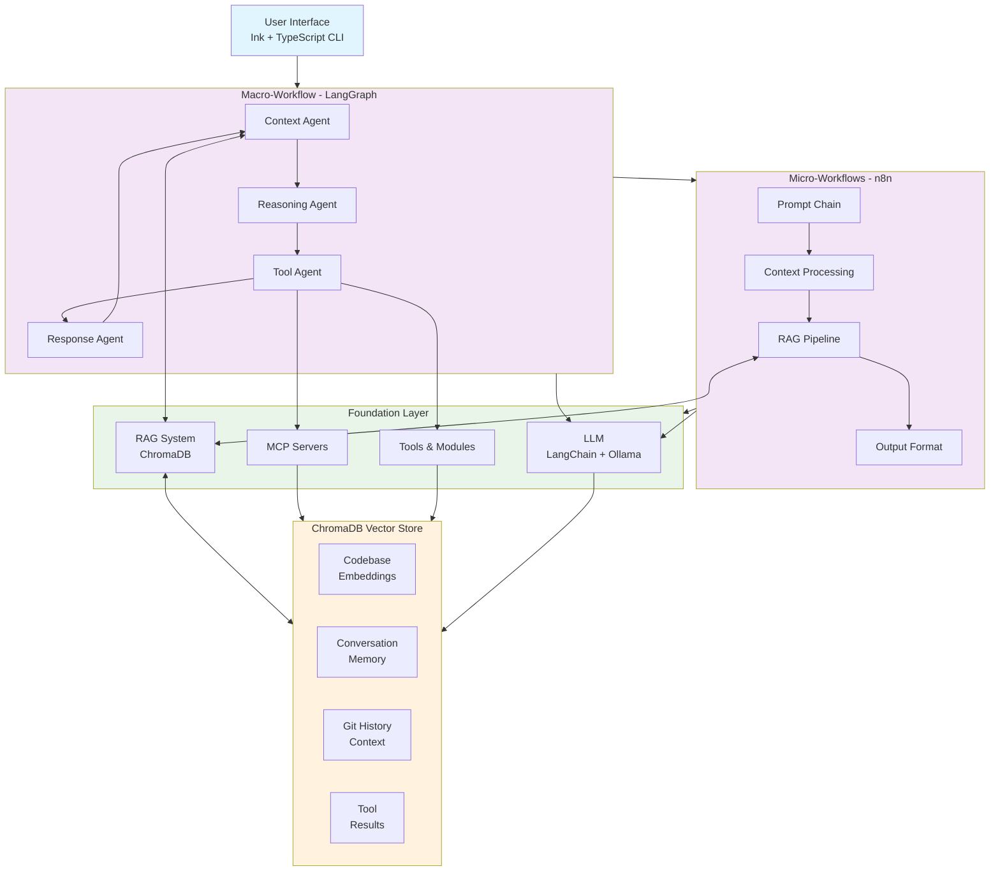

# Local AI Agent Design Document

## Executive Summary

This document outlines the design for an open-source AI coding assistant that provides Claude Code-like functionality with local LLM support. The system combines modern agent architecture with a polished terminal interface to create a professional-grade development tool.

## Core Concept Definitions

### Agent Definition
```
agent = toolbox + pe + llm
```

Where:
- **toolbox**: MCP servers + modules (external capabilities)
- **pe**: Process Executor (workflow orchestration)
- **llm**: Language model interaction layer

### Workflow Hierarchy

**Macro-workflow**: High-level agent orchestration
- Each node represents a complete subagent
- Handles routing between specialized agents
- Managed by LangGraph StateGraph

**Micro-workflow**: Internal agent logic
- Each node represents a prompt-based operation
- Handles prompt chains within agents
- Managed by n8n visual workflows

## System Architecture

### High-Level Architecture

```
┌─────────────────────────────────────────────────────────────────┐
│                        User Interface                           │
│                   (Ink + TypeScript CLI)                        │
└─────────────────────────────┬───────────────────────────────────┘
                              │
┌─────────────────────────────▼───────────────────────────────────┐
│                      Macro-Workflow                             │
│                       (LangGraph)                               │
│  ┌─────────────┐ ┌─────────────┐ ┌─────────────┐ ┌───────────┐ │
│  │ Context     │ │ Reasoning   │ │ Tool        │ │ Response  │ │
│  │ Agent       │ │ Agent       │ │ Agent       │ │ Agent     │ │
│  └─────────────┘ └─────────────┘ └─────────────┘ └───────────┘ │
└─────────────────────────────┬───────────────────────────────────┘
                              │
┌─────────────────────────────▼───────────────────────────────────┐
│                      Micro-Workflows                            │
│                          (n8n)                                  │
│  ┌─────────────┐ ┌─────────────┐ ┌─────────────┐ ┌───────────┐ │
│  │ Prompt      │ │ Context     │ │ RAG         │ │ Output    │ │
│  │ Chain       │ │ Processing  │ │ Pipeline    │ │ Format    │ │
│  └─────────────┘ └─────────────┘ └─────────────┘ └───────────┘ │
└─────────────────────────────┬───────────────────────────────────┘
                              │
┌─────────────────────────────▼───────────────────────────────────┐
│                      Foundation Layer                           │
│  ┌─────────────┐ ┌─────────────┐ ┌─────────────┐ ┌───────────┐ │
│  │ LLM         │ │ RAG System  │ │ MCP         │ │ Tools &   │ │
│  │ (LangChain) │ │ (ChromaDB)  │ │ Servers     │ │ Modules   │ │
│  └─────────────┘ └─────────────┘ └─────────────┘ └───────────┘ │
└─────────────────────────────────────────────────────────────────┘

                    Knowledge & Context Management
┌─────────────────────────────────────────────────────────────────┐
│                      ChromaDB Vector Store                      │
│  ┌─────────────┐ ┌─────────────┐ ┌─────────────┐ ┌───────────┐ │
│  │ Codebase    │ │ Conversation│ │ Git History │ │ Tool      │ │
│  │ Embeddings  │ │ Memory      │ │ Context     │ │ Results   │ │
│  └─────────────┘ └─────────────┘ └─────────────┘ └───────────┘ │
└─────────────────────────────────────────────────────────────────┘
```

### Mermaid Architecture Diagram



### Component Architecture

#### 1. User Interface Layer
- **Framework**: Ink + TypeScript
- **Components**: 
  - Chat interface with streaming responses
  - Progress indicators and status displays
  - File diff visualization
  - Interactive command palette
- **Features**: React-based components, Flexbox layouts, terminal animations

#### 2. Macro-Workflow Layer (LangGraph)
- **Purpose**: Agent orchestration and state management
- **Components**:
  - **Context Agent**: RAG-powered file discovery, semantic relevance filtering, context assembly with ChromaDB
  - **Reasoning Agent**: Task analysis, planning, decision making with enriched context
  - **Tool Agent**: Action execution, result processing, and knowledge base updates
  - **Response Agent**: Output formatting, streaming management, and conversation memory storage

#### 3. Micro-Workflow Layer (n8n)
- **Purpose**: Internal agent prompt chains with RAG integration
- **Components**:
  - Prompt template management with context injection
  - RAG pipeline orchestration and document retrieval
  - Data transformation nodes for embedding processing
  - Conditional logic branches based on context relevance
  - Error handling and retry mechanisms with fallback strategies

#### 4. Foundation Layer
- **LLM Interface (LangChain)**: 
  - Ollama integration
  - Multiple model support
  - Response streaming
  - Error handling
- **RAG System (ChromaDB + LangChain)**:
  - Vector database for codebase indexing
  - Semantic search for context retrieval
  - Document embedding and chunking
  - Relevance scoring and ranking
- **Context Management**:
  - Intelligent file discovery
  - Multi-turn conversation memory
  - Code relationship mapping
  - Token-efficient context compression
- **MCP Servers**: 
  - File operations
  - Shell command execution
  - Git integration
  - Web search capabilities
- **Tool Modules**:
  - Custom tool implementations
  - Plugin architecture
  - External service integrations

## Data Flow

### Request Processing Pipeline

1. **User Input** → Ink CLI Interface
2. **Command Parsing** → LangGraph State Machine
3. **Context Retrieval** → ChromaDB semantic search + RAG pipeline
4. **Agent Routing** → Appropriate specialized agent
5. **Micro-Workflow Execution** → n8n prompt chains with context
6. **Tool Execution** → MCP server calls
7. **LLM Processing** → LangChain + Ollama with enriched context
8. **Response Streaming** → Back through the stack
9. **UI Updates** → Real-time terminal display
10. **Context Update** → Update vector database with new interactions

### State Management

- **Conversation History**: Maintained in LangGraph state with vector embeddings
- **Codebase Knowledge**: Indexed in ChromaDB with semantic relationships
- **File Context**: Tracked per session with change detection and relevance scoring
- **Tool Results**: Cached with invalidation strategies and semantic indexing
- **User Preferences**: Persistent configuration storage with context personalization

## Core Features

### 1. Conversational Interface
- Natural language coding requests
- Context-aware responses
- Multi-turn conversation support
- Command history and replay

### 2. Project Intelligence
- RAG-powered codebase understanding and semantic search
- Automatic file discovery with relevance scoring via ChromaDB
- Git integration for change tracking and context evolution
- Dependency analysis and intelligent recommendations
- Code relationship mapping and impact analysis

### 3. Tool Integration
- File operations (read, write, edit)
- Shell command execution
- Git workflow automation
- Web search and documentation lookup

### 4. Local LLM Support
- Ollama integration with multiple models
- Model switching and comparison
- Offline operation capability
- Privacy-first architecture

## Technical Specifications

### Programming Language
- **Primary**: TypeScript
- **Runtime**: Node.js 18+
- **Package Manager**: npm/pnpm

### Key Dependencies
```json
{
  "ui": ["ink", "@inkjs/ui", "react"],
  "agents": ["langgraph", "langchain", "langchain-mcp-adapters"],
  "workflows": ["n8n", "n8n-nodes-base"],
  "llm": ["ollama", "@langchain/ollama"],
  "rag": ["chromadb", "@langchain/community", "@langchain/textsplitters"],
  "embeddings": ["@langchain/ollama", "@langchain/openai"],
  "tools": ["commander", "chalk", "inquirer"]
}
```

### Configuration
- YAML-based configuration files
- Environment variable support
- User-specific and project-specific settings
- Runtime configuration updates

## Security Considerations

### Data Privacy
- All processing happens locally
- No data sent to external services without explicit consent
- Conversation history encrypted at rest
- Configurable data retention policies

### Tool Execution
- Sandboxed command execution
- User confirmation for destructive operations
- Whitelist-based tool access
- Audit logging for all tool calls

## Performance Requirements

### Response Times
- Initial response: < 2 seconds
- Streaming latency: < 200ms
- File operations: < 1 second
- Model switching: < 5 seconds

### Resource Usage
- Memory: < 512MB base usage
- CPU: Efficient batching for LLM calls
- Storage: Configurable cache limits
- Network: Local-only by default

## Extensibility

### Plugin Architecture
- MCP server integration
- Custom tool development
- Workflow template system
- UI component extensions

### Model Support
- Ollama model management
- Multiple concurrent models
- Model-specific optimizations
- Custom model integration

## Deployment

### Installation
- npm package distribution
- Single binary builds (optional)
- Docker container support
- Development environment setup

### Configuration
- Guided setup wizard
- Model download automation
- Tool permission configuration
- Integration with existing development tools

## Success Metrics

### User Experience
- Setup time < 10 minutes
- Learning curve < 1 hour for basic usage
- 90%+ task completion rate
- Positive user feedback on UX quality

### Technical Performance
- 99% uptime in local environment
- Sub-second response times for common operations
- Memory usage within specified limits
- Successful integration with major development workflows

## Future Considerations

### Potential Enhancements
- Multi-agent collaboration
- Custom workflow builder UI
- Integration with IDEs
- Team/collaboration features

### Scalability
- Distributed agent execution
- Cloud deployment options
- Enterprise feature set
- API access for integrations

---

*This design document serves as the foundation for development and should be updated as the project evolves.*