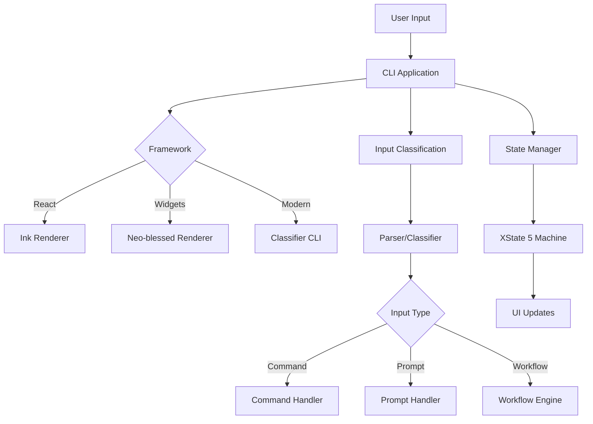

# CLI Module - Design and Implementation Guide

## 🎯 Overview

The `@qi/cli` module provides a professional command-line interface system with three-type input classification, dual framework support, and sophisticated state management. It bridges user interaction with the qi-v2-agent's powerful agent capabilities.

## 🏗️ Design Architecture

### Core Design Principles

1. **Technology-Agnostic Abstractions** - Framework-independent interfaces enable easy switching
2. **Three-Type Input Processing** - Intelligent classification of commands, prompts, and workflows
3. **Professional State Management** - XState 5 hierarchical state machines
4. **Dual Framework Support** - Choose between React-based (Ink) or widget-based (Neo-blessed)
5. **Seamless Integration** - Direct connection to lib layer's ThreeTypeAgent

### Module Structure

```
app/src/cli/
├── abstractions/
│   ├── cli-interfaces.ts       # Core CLI interfaces
│   ├── state-machine.ts        # XState 5 state definitions
│   └── index.ts                # Abstraction exports
├── impl/
│   ├── parser.ts               # Input parsing implementations
│   ├── command-handler.ts      # Built-in command system
│   ├── state-manager.ts        # XState 5 state management
│   └── index.ts                # Implementation exports
├── frameworks/
│   ├── ink/                    # React-based framework
│   ├── neo-blessed/            # Widget-based framework
│   ├── ClassifierCLI.ts        # Modern classifier-based CLI
│   └── index.ts                # Framework factory
└── index.ts                    # Main CLI exports
```

### Architecture Flow



## 🔧 Implementation Details

### 1. Core Interfaces

#### ICLIApplication Interface
```typescript
export interface ICLIApplication {
  initialize(config: CLIConfig): Promise<void>
  start(): Promise<void>
  stop(): Promise<void>
  processInput(input: string): Promise<void>
  getStatus(): CLIStatus
  handleKeyboardShortcut(key: KeyboardShortcut): void
}
```

#### CLI Configuration
```typescript
export interface CLIConfig {
  readonly framework: 'ink' | 'neo-blessed' | 'classifier'
  readonly enableShellCommands?: boolean
  readonly sessionPersistence?: boolean
  readonly theme?: CLITheme
}

export interface CLIStatus {
  readonly isRunning: boolean
  readonly currentState: AppState
  readonly currentSubState: AppSubState
  readonly uptime: number
  readonly commandsExecuted: number
  readonly errors: number
}
```

### 2. State Management System

#### XState 5 Hierarchical States
```typescript
// State machine definition
export type AppState = 'busy' | 'ready'
export type AppSubState = 'planning' | 'editing' | 'generic'

export interface AppStateContext {
  readonly currentState: AppState
  readonly currentSubState: AppSubState
  readonly lastSubState: AppSubState
  readonly taskName?: string
  readonly startTime?: Date
}
```

#### State Management Implementation
```typescript
export class CLIStateManager implements IStateManager {
  private machine: StateMachine<AppStateContext, StateEvent>
  private actor: ActorRef<StateMachine<AppStateContext, StateEvent>>
  
  constructor() {
    this.machine = createMachine({
      id: 'cliStateMachine',
      initial: 'ready',
      context: {
        currentState: 'ready' as AppState,
        currentSubState: 'generic' as AppSubState,
        lastSubState: 'generic' as AppSubState
      },
      states: {
        busy: {
          entry: ['setBusyContext'],
          on: {
            TASK_COMPLETE: 'ready.generic',
            TASK_ERROR: 'ready.generic'
          }
        },
        ready: {
          initial: 'generic',
          entry: ['setReadyContext'],
          states: {
            planning: {
              on: { CYCLE_STATE: 'editing' }
            },
            editing: {
              on: { CYCLE_STATE: 'generic' }
            },
            generic: {
              on: { CYCLE_STATE: 'planning' }
            }
          },
          on: {
            START_TASK: 'busy'
          }
        }
      }
    }, {
      actions: {
        setBusyContext: assign({
          currentState: 'busy',
          startTime: () => new Date()
        }),
        setReadyContext: assign({
          currentState: 'ready'
        })
      }
    })
  }
  
  setBusy(taskName: string): void {
    this.actor.send({ type: 'START_TASK', payload: { taskName } })
  }
  
  setReady(subState: AppSubState = 'generic'): void {
    this.actor.send({ type: 'TASK_COMPLETE', payload: { subState } })
  }
  
  cycleReadyStates(): void {
    if (this.getCurrentState() === 'ready') {
      this.actor.send({ type: 'CYCLE_STATE' })
    }
  }
}
```

### 3. Framework Implementations

#### A. Classifier CLI (Modern Implementation)

**Purpose**: Modern CLI using the new @qi/classifier module with intelligent input processing

```typescript
export class ClassifierCLIApplication implements ICLIApplication {
  private classifier: IClassifier
  private promptHandler: IPromptHandler
  private isRunning = false
  private commandsExecuted = 0
  private errors = 0
  private currentState: AppState = 'ready'
  
  constructor() {
    this.classifier = createClassifier({
      defaultMethod: 'rule-based',
      debugMode: false
    })
    this.promptHandler = createPromptHandler()
  }
  
  async processInput(input: string): Promise<void> {
    try {
      this.currentState = 'busy'
      
      // Classify input using new classifier module
      const classification: ClassificationResult = await this.classifier.classify(input, {
        includeMetadata: true,
        includeReasoning: true
      })
      
      console.log(`🔍 Classification: ${classification.type} (${(classification.confidence * 100).toFixed(1)}% confidence)`)
      
      // Route based on classification
      await this.routeInput(input, classification)
      
      this.currentState = 'ready'
    } catch (error) {
      this.errors++
      this.currentState = 'ready'
      console.error('❌ Error processing input:', error)
    }
  }
  
  private async routeInput(input: string, classification: ClassificationResult): Promise<void> {
    switch (classification.type) {
      case 'command':
        await this.handleCommand(input, classification)
        break
      case 'prompt':
        await this.handlePrompt(input, classification)
        break
      case 'workflow':
        await this.handleWorkflow(input, classification)
        break
    }
  }
}
```

#### B. Ink Framework (React-based)

**Purpose**: Familiar React patterns for rapid development

```typescript
export function InkCLIApplication(): React.FC {
  const [state, setState] = useState<AppState>('ready')
  const [input, setInput] = useState('')
  
  return (
    <Box flexDirection="column">
      <Box borderStyle="round" padding={1}>
        <Text color="blue">🤖 Qi CLI v2 - React Interface</Text>
      </Box>
      
      <StateIndicator state={state} />
      
      <Box marginTop={1}>
        <TextInput
          value={input}
          onChange={setInput}
          onSubmit={handleInput}
          placeholder="Enter command, prompt, or workflow..."
        />
      </Box>
      
      <CommandOutput />
    </Box>
  )
}
```

#### C. Neo-blessed Framework (Widget-based)

**Purpose**: Performance-optimized with native XState 5 integration

```typescript
export class NeoBlessedCLIApplication implements ICLIApplication {
  private screen: blessed.Widgets.Screen
  private inputBox: blessed.Widgets.Textbox
  private outputBox: blessed.Widgets.Box
  private stateManager: IStateManager
  
  constructor() {
    this.screen = blessed.screen({
      smartCSR: true,
      title: 'Qi CLI v2'
    })
    
    this.stateManager = createStateManager()
    this.setupUI()
    this.bindEvents()
  }
  
  private setupUI(): void {
    // Header
    const header = blessed.box({
      parent: this.screen,
      top: 0,
      left: 0,
      width: '100%',
      height: 3,
      content: '🤖 Qi CLI v2 - Professional Interface',
      style: {
        fg: 'blue',
        border: {
          fg: 'cyan'
        }
      },
      border: {
        type: 'line'
      }
    })
    
    // State indicator
    this.createStateIndicator()
    
    // Input box
    this.inputBox = blessed.textbox({
      parent: this.screen,
      bottom: 0,
      left: 0,
      width: '100%',
      height: 3,
      inputOnFocus: true,
      border: {
        type: 'line'
      },
      style: {
        fg: 'white',
        border: {
          fg: 'green'
        }
      }
    })
    
    // Output area
    this.outputBox = blessed.box({
      parent: this.screen,
      top: 3,
      left: 0,
      width: '100%',
      bottom: 3,
      scrollable: true,
      alwaysScroll: true,
      border: {
        type: 'line'
      }
    })
  }
}
```

### 4. Input Processing Pipeline

#### Classification Strategy
```typescript
// Three-type classification with confidence scoring
async function classifyInput(input: string): Promise<ClassificationResult> {
  // Stage 1: Command Detection (100% confidence)
  if (input.startsWith('/')) {
    return {
      type: 'command',
      confidence: 1.0,
      method: 'rule-based',
      reasoning: 'Starts with command prefix'
    }
  }
  
  // Stage 2: Workflow vs Prompt Analysis
  const workflowScore = calculateWorkflowScore(input)
  const promptScore = calculatePromptScore(input)
  
  if (workflowScore > promptScore && workflowScore >= 0.7) {
    return {
      type: 'workflow',
      confidence: workflowScore,
      method: 'rule-based',
      reasoning: 'Multi-step task indicators detected'
    }
  } else {
    return {
      type: 'prompt',
      confidence: promptScore,
      method: 'rule-based',
      reasoning: 'Conversational pattern detected'
    }
  }
}
```

#### Command Processing
```typescript
export class CLICommandHandler implements ICommandHandler {
  private commands = new Map<string, CommandDefinition>()
  
  constructor() {
    this.registerBuiltInCommands()
  }
  
  private registerBuiltInCommands(): void {
    this.register({
      name: 'help',
      description: 'Show available commands',
      execute: async () => this.showHelp()
    })
    
    this.register({
      name: 'status',
      description: 'Show application status',
      execute: async () => this.showStatus()
    })
    
    this.register({
      name: 'stats',
      description: 'Show classifier statistics',
      execute: async () => this.showClassifierStats()
    })
  }
  
  async execute(command: string, args: string[]): Promise<CommandResult> {
    const definition = this.commands.get(command)
    if (!definition) {
      return {
        success: false,
        error: `Unknown command: ${command}`
      }
    }
    
    try {
      const result = await definition.execute(args)
      return { success: true, data: result }
    } catch (error) {
      return {
        success: false,
        error: error instanceof Error ? error.message : 'Unknown error'
      }
    }
  }
}
```

### 5. Factory Functions

#### Framework Selection Factory
```typescript
export function createCLI(framework: 'ink' | 'neo-blessed' | 'classifier' = 'classifier'): ICLIApplication {
  switch (framework) {
    case 'ink':
      return createInkCLI()
    case 'neo-blessed':
      return createNeoBlessedCLI()
    case 'classifier':
      return createClassifierCLI()
    default:
      throw new Error(`Unknown CLI framework: ${framework}`)
  }
}

export async function startCLI(config: CLIConfig): Promise<ICLIApplication> {
  const cli = createCLI(config.framework)
  await cli.initialize(config)
  await cli.start()
  return cli
}
```

## 📊 Performance & Reliability

### Performance Characteristics

- **Input Processing**: <10ms for typical inputs
- **State Transitions**: O(1) with XState optimization
- **Command Lookup**: O(log n) with Map-based registry
- **Memory Usage**: 
  - Classifier CLI: ~15MB baseline
  - Ink Framework: ~50MB (React runtime)
  - Neo-blessed: ~10MB (native widgets)

### Error Handling Strategy

1. **Input Validation**: Sanitize and validate all user inputs
2. **Graceful Degradation**: Fallback to basic parsing if classifier fails
3. **State Recovery**: Automatic return to ready state on errors
4. **User Feedback**: Clear error messages with suggested actions
5. **Logging**: Comprehensive error logging for debugging

### Reliability Features

```typescript
// Graceful error handling with state recovery
async processInput(input: string): Promise<void> {
  const previousState = this.currentState
  
  try {
    this.currentState = 'busy'
    
    // Process input with timeout
    const result = await Promise.race([
      this.classify(input),
      new Promise((_, reject) => 
        setTimeout(() => reject(new Error('Classification timeout')), 5000)
      )
    ])
    
    await this.handleClassification(result)
    this.currentState = 'ready'
    
  } catch (error) {
    this.errors++
    this.currentState = previousState // Restore previous state
    this.showError(error)
  }
}
```

## 🔍 Key Design Decisions

### 1. Why Three Frameworks?

**Problem**: Different use cases require different approaches
**Solution**: Support multiple frameworks for different scenarios

- **Classifier CLI**: Modern, production-ready with intelligent classification
- **Ink Framework**: Rapid prototyping with familiar React patterns
- **Neo-blessed**: Performance-optimized with native state integration

### 2. Why XState 5 for State Management?

**Problem**: CLI state is complex (busy/ready + sub-states + transitions)
**Solution**: Professional state machine with visual debugging

**Benefits**:
- Type-safe state transitions
- Visual state machine debugging
- Predictable state behavior
- Easy testing and validation
- Hierarchical state support

### 3. Why Technology-Agnostic Abstractions?

**Problem**: Framework coupling makes testing and switching difficult
**Solution**: Abstract interfaces separate business logic from UI concerns

**Benefits**:
- Easy framework switching
- Simplified unit testing
- Clear separation of concerns
- Future-proof architecture

### 4. Why Intelligent Classification Integration?

**Problem**: Traditional command parsing is insufficient for modern AI workflows
**Solution**: Integrate @qi/classifier for sophisticated three-type classification

**Innovation**: Distinguishing simple requests from complex workflows automatically

## 🚀 Usage Examples

### Basic CLI Usage
```typescript
import { createCLI } from '@qi/cli'

async function basicExample() {
  const cli = createCLI('classifier')
  
  await cli.initialize({
    framework: 'classifier',
    enableShellCommands: false
  })
  
  await cli.start()
  
  // CLI now accepts input interactively
}
```

### Framework-Specific Usage
```typescript
// React-based UI
const reactCLI = createCLI('ink')
await reactCLI.initialize({
  framework: 'ink',
  theme: {
    primary: 'blue',
    success: 'green',
    error: 'red'
  }
})

// Widget-based UI with state management
const neoBlessedCLI = createCLI('neo-blessed')
await neoBlessedCLI.initialize({
  framework: 'neo-blessed',
  sessionPersistence: true
})
```

### Programmatic Input Processing
```typescript
const cli = createCLI('classifier')
await cli.initialize({ framework: 'classifier' })

// Process different input types
await cli.processInput('/help')                    // Command
await cli.processInput('What is async/await?')     // Prompt
await cli.processInput('Fix bug in auth.ts')       // Workflow

// Monitor status
const status = cli.getStatus()
console.log(`Commands executed: ${status.commandsExecuted}`)
```

### State Management Integration
```typescript
const cli = createCLI('neo-blessed')
await cli.initialize({ framework: 'neo-blessed' })

// Monitor state changes
cli.onStateChange((state, subState) => {
  console.log(`State: ${state}.${subState}`)
})

// Keyboard shortcuts
cli.handleKeyboardShortcut({ key: 'Tab', shift: true }) // Cycle states
```

## 🧪 Testing Strategy

### Unit Tests
- Test each framework implementation independently
- Mock state manager and verify state transitions
- Test command registration and execution
- Verify error handling and recovery

### Integration Tests
- Test complete input processing pipeline
- Verify framework switching works correctly
- Test state persistence across sessions
- Validate keyboard shortcut handling

### Performance Tests
- Measure input processing latency
- Test memory usage under load
- Verify state transition performance
- Test UI rendering performance

### User Experience Tests
- Test with real user input patterns
- Verify error message clarity
- Test keyboard navigation
- Validate visual state indicators

## 🔮 Future Enhancements

### 1. Advanced Features
- **Voice Input**: Speech-to-text integration for hands-free operation
- **Plugin System**: Third-party command and renderer plugins
- **Session Recording**: Replay and share CLI sessions
- **AI Assistance**: Context-aware command suggestions

### 2. Performance Optimizations
- **Virtual Scrolling**: Handle large output efficiently
- **Command Caching**: Cache frequently used command results
- **Lazy Loading**: Load framework components on demand
- **Background Processing**: Non-blocking long-running operations

### 3. Enhanced Integrations
- **VS Code Extension**: Embedded CLI within VS Code
- **Web Interface**: Browser-based CLI for remote access
- **Mobile Client**: Touch-friendly mobile interface
- **API Gateway**: REST/GraphQL API for programmatic access

This design provides a comprehensive, professional CLI system that bridges user interaction with the powerful qi-v2-agent capabilities while maintaining flexibility for different use cases and future enhancements.