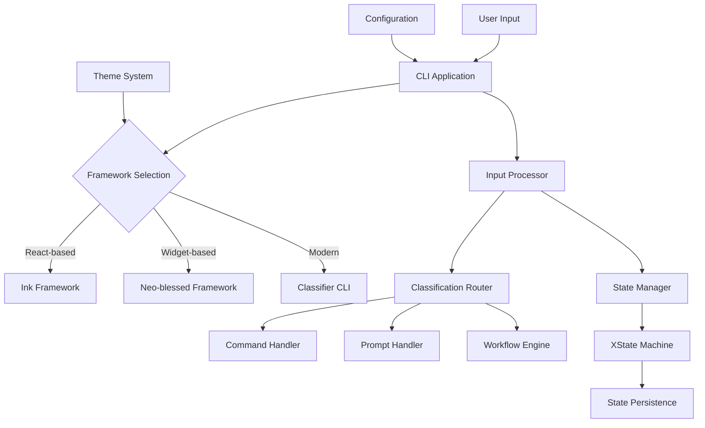

# CLI Module - Design Guide

## 🎯 Purpose

The CLI module provides a professional command-line interface system that bridges user interaction with the qi-v2-agent's capabilities through intelligent input classification, multiple UI frameworks, and sophisticated state management.

## 📋 Requirements

### Functional Requirements
1. **Three-Type Input Processing**: Intelligent classification of commands, prompts, and workflows
2. **Multiple UI Frameworks**: Support for different terminal interface approaches
3. **State Management**: Professional state handling with hierarchical substates
4. **Keyboard Shortcuts**: Intuitive navigation and mode switching
5. **Real-Time Feedback**: Visual indicators for processing state and classification results
6. **Session Management**: Persistent sessions with state recovery

### Non-Functional Requirements
1. **Responsiveness**: <100ms response time for UI updates
2. **Reliability**: Graceful error handling and recovery
3. **Usability**: Intuitive interface with clear visual feedback
4. **Extensibility**: Easy addition of new commands and UI components
5. **Cross-Platform**: Works on Windows, macOS, and Linux terminals

## 🏗️ Architecture Design

### Core Components



### Component Responsibilities

#### 1. CLI Application (Core Interface)
- **Purpose**: Main application lifecycle and coordination
- **Responsibilities**:
  - Initialize framework and components
  - Manage application state transitions
  - Coordinate input processing and output rendering
  - Handle keyboard shortcuts and user interactions

#### 2. Framework Layer (UI Abstraction)
- **Ink Framework**: React-based terminal interfaces
- **Neo-blessed Framework**: Traditional widget-based terminals  
- **Classifier CLI**: Modern input classification interface
- **Purpose**: Provide different approaches to terminal UI development

#### 3. State Management System
- **Purpose**: Professional state handling with XState 5
- **Responsibilities**:
  - Manage application state (busy/ready) and substates
  - Handle state transitions and persistence
  - Provide state introspection and debugging
  - Support hierarchical state nesting

#### 4. Input Processing Pipeline
- **Purpose**: Process and route user inputs appropriately
- **Responsibilities**:
  - Classify inputs using the classifier module
  - Route to appropriate handlers (command/prompt/workflow)
  - Provide visual feedback on classification results
  - Handle processing errors and edge cases

## 📊 Interfaces and Contracts

### Core CLI Interface

```typescript
interface ICLIApplication {
  // Lifecycle management
  initialize(config: CLIConfig): Promise<void>
  start(): Promise<void>
  stop(): Promise<void>
  
  // Input processing
  processInput(input: string): Promise<void>
  
  // State and status
  getStatus(): CLIStatus
  handleKeyboardShortcut(key: KeyboardShortcut): void
}

interface CLIConfig {
  framework: 'ink' | 'neo-blessed' | 'classifier'
  enableShellCommands?: boolean
  sessionPersistence?: boolean
  theme?: CLITheme
}

interface CLIStatus {
  isRunning: boolean
  currentState: AppState
  currentSubState: AppSubState
  uptime: number
  commandsExecuted: number
  errors: number
}
```

### State Management Types

```typescript
// Hierarchical state system
type AppState = 'busy' | 'ready'
type AppSubState = 'planning' | 'editing' | 'generic'

interface AppStateContext {
  currentState: AppState
  currentSubState: AppSubState
  lastSubState: AppSubState
  taskName?: string
  startTime?: Date
}

interface StateEvent {
  type: string
  payload?: unknown
}
```

### Framework Renderer Interface

```typescript
interface IFrameworkRenderer {
  // Core rendering
  render(state: AppStateContext): void
  handleInput(input: string): void
  
  // Output management
  showOutput(message: string, type?: 'info' | 'success' | 'error' | 'warning'): void
  showStateIndicator(state: AppState, subState?: AppSubState): void
  showBusyIndicator(taskName: string): void
  
  // Lifecycle
  clear(): void
  cleanup(): void
}
```

## 🎨 UI Framework Designs

### 1. Ink Framework (React-based)

#### Design Philosophy
- **Familiar Patterns**: Use React components and hooks
- **Rapid Development**: Leverage existing React knowledge
- **Component Reusability**: Build reusable UI components

#### Component Structure
```typescript
interface InkCLIComponents {
  // Layout components
  AppContainer: React.FC<{ state: AppStateContext }>
  Header: React.FC<{ title: string, state: AppState }>
  StatusBar: React.FC<{ status: CLIStatus }>
  
  // Input components
  InputBox: React.FC<{ onSubmit: (input: string) => void }>
  CommandSuggestions: React.FC<{ suggestions: string[] }>
  
  // Output components
  OutputArea: React.FC<{ messages: OutputMessage[] }>
  ClassificationIndicator: React.FC<{ result: ClassificationResult }>
  
  // State indicators
  BusyIndicator: React.FC<{ taskName: string }>
  StateIndicator: React.FC<{ state: AppState, subState: AppSubState }>
}
```

### 2. Neo-blessed Framework (Widget-based)

#### Design Philosophy
- **Performance First**: Direct widget manipulation for efficiency
- **Native Integration**: Works naturally with XState 5
- **Traditional Feel**: Classic terminal application experience

#### Widget Hierarchy
```typescript
interface NeoBlessedWidgets {
  // Container widgets
  screen: blessed.Widgets.Screen
  mainContainer: blessed.Widgets.Box
  
  // Header and status
  headerBox: blessed.Widgets.Box
  statusLine: blessed.Widgets.Box
  stateIndicator: blessed.Widgets.Box
  
  // Input and output
  inputBox: blessed.Widgets.Textbox
  outputBox: blessed.Widgets.Box
  
  // Interactive elements
  commandList: blessed.Widgets.List
  progressBar: blessed.Widgets.ProgressBar
}
```

### 3. Classifier CLI (Modern)

#### Design Philosophy
- **Intelligence First**: Showcase the three-type classification system
- **Transparency**: Clear feedback on how inputs are classified
- **Simplicity**: Clean, focused interface highlighting AI capabilities

#### Interface Elements
```typescript
interface ClassifierCLIElements {
  // Core display
  welcomeMessage: string
  inputPrompt: string
  classificationDisplay: ClassificationResult
  
  // Processing feedback
  thinkingIndicator: string
  confidenceDisplay: number
  reasoningExplanation: string
  
  // Command system
  builtInCommands: CommandDefinition[]
  helpSystem: HelpDisplay
  statisticsDisplay: ClassifierStats
}
```

## 🔄 State Management Design

### XState 5 Integration

#### State Machine Definition
```typescript
interface CLIStateMachine {
  // Top-level states
  states: {
    busy: {
      entry: ['setBusyContext']
      on: {
        TASK_COMPLETE: 'ready.generic'
        TASK_ERROR: 'ready.generic'
      }
    }
    ready: {
      initial: 'generic'
      entry: ['setReadyContext']
      states: {
        planning: { on: { CYCLE_STATE: 'editing' } }
        editing: { on: { CYCLE_STATE: 'generic' } }
        generic: { on: { CYCLE_STATE: 'planning' } }
      }
      on: {
        START_TASK: 'busy'
      }
    }
  }
}
```

#### State Context Management
```typescript
interface StateContext {
  // Current state information
  currentState: AppState
  currentSubState: AppSubState
  stateHistory: StateTransition[]
  
  // Task information
  currentTask?: {
    name: string
    startTime: Date
    progress?: number
  }
  
  // Performance metrics
  metrics: {
    commandsExecuted: number
    averageResponseTime: number
    errors: number
  }
}
```

### State Transitions

#### Keyboard-Driven Transitions
```typescript
interface KeyboardShortcuts {
  'Shift+Tab': () => void    // Cycle through ready substates
  'Ctrl+C': () => void       // Interrupt current task
  'Ctrl+L': () => void       // Clear screen
  'Ctrl+R': () => void       // Refresh/reload
  'F1': () => void           // Show help
}
```

## 🎯 Design Principles

### 1. Framework Flexibility
- **Multiple Options**: Different approaches for different preferences
- **Consistent Interface**: Same API regardless of framework choice
- **Easy Switching**: Change frameworks without losing functionality

### 2. State-Driven UI
- **Predictable Behavior**: UI updates based on state machine transitions
- **Visual Feedback**: Clear indicators for all state changes
- **Error Recovery**: Graceful handling of state inconsistencies

### 3. Intelligence Integration
- **Classification Transparency**: Show how inputs are classified
- **Confidence Display**: Visual indicators of classification certainty
- **Reasoning Explanation**: Help users understand system decisions

### 4. Professional UX
- **Responsive Interface**: Immediate feedback on user actions
- **Keyboard Navigation**: Full keyboard accessibility
- **Visual Hierarchy**: Clear information organization

## 🔍 Quality Attributes

### Performance Requirements

| Metric | Target | Measurement |
|--------|--------|-------------|
| Startup Time | <2s | From launch to ready |
| Input Response | <100ms | From keystroke to feedback |
| State Transitions | <50ms | Between state changes |
| Memory Usage | <50MB | Baseline + framework overhead |

### Usability Requirements

| Attribute | Requirement | Implementation |
|-----------|-------------|----------------|
| Learnability | 5min to basic proficiency | Built-in help and tutorials |
| Efficiency | <3 keystrokes for common tasks | Keyboard shortcuts |
| Error Recovery | Clear error messages + suggestions | Context-aware help |
| Accessibility | Full keyboard navigation | No mouse dependency |

### Reliability Requirements
- **Error Handling**: Graceful degradation on component failures
- **State Recovery**: Automatic recovery from invalid states
- **Session Persistence**: Save and restore user sessions
- **Cross-Platform**: Consistent behavior across operating systems

## 🚀 Success Criteria

### Functional Success
- ✅ Support multiple UI frameworks with consistent functionality
- ✅ Intelligent input classification with visual feedback
- ✅ Professional state management with hierarchical substates
- ✅ Comprehensive keyboard navigation and shortcuts

### Technical Success
- ✅ Meet performance requirements across all frameworks
- ✅ Maintain clean separation between UI and business logic
- ✅ Provide extensible architecture for new commands and features
- ✅ Enable easy framework switching without data loss

### User Experience Success
- ✅ Intuitive interface that requires minimal learning
- ✅ Clear visual feedback for all user actions
- ✅ Helpful error messages with actionable suggestions
- ✅ Consistent behavior across different terminal environments

## 🔮 Evolution Path

### Phase 1: Core Functionality (Current)
- ✅ Basic three-framework support (Ink, Neo-blessed, Classifier)
- ✅ XState 5 state management integration
- ✅ Three-type input classification
- ✅ Essential keyboard shortcuts

### Phase 2: Enhanced Experience (Near Term)
- 🎯 Advanced theming and customization
- 🎯 Session persistence and recovery
- 🎯 Plugin system for custom commands
- 🎯 Enhanced accessibility features

### Phase 3: Intelligence Features (Medium Term)
- 🎯 Context-aware command suggestions
- 🎯 Learning from user patterns
- 🎯 Predictive input completion
- 🎯 Advanced workflow visualization

### Phase 4: Integration Expansion (Long Term)
- 🎯 Web-based CLI interface
- 🎯 Mobile client support
- 🎯 VS Code extension integration
- 🎯 Remote CLI server capabilities

This design provides a solid foundation for a professional CLI system that can evolve from basic terminal interaction to sophisticated AI-assisted development workflows while maintaining usability and performance standards.