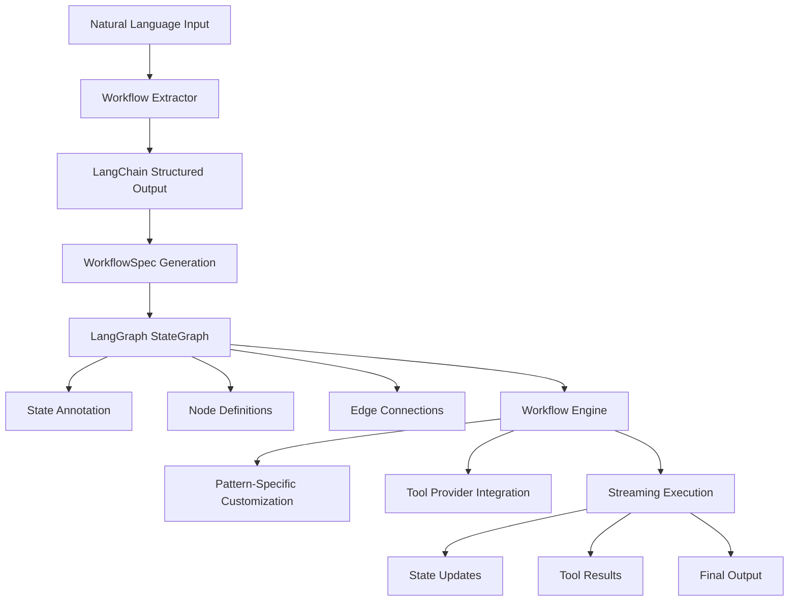

# Workflow Module - Design and Implementation Guide

## 🎯 Overview

The `@qi/workflow` module provides sophisticated multi-step task orchestration using LangGraph StateGraph for complex AI workflows. It enables natural language workflow extraction, stateful execution, and pattern-based cognitive processing with tool integration.

## 🏗️ Design Architecture

### Core Design Principles

1. **Natural Language to Workflow** - Convert user descriptions to executable workflows using LLM extraction
2. **LangGraph StateGraph** - Modern 2025 workflow orchestration with state persistence and streaming
3. **Cognitive Pattern-Based** - Different workflow patterns for analytical, creative, problem-solving tasks
4. **Tool Integration** - Seamless integration with MCP tool providers for external operations
5. **Streaming Execution** - Real-time workflow progress updates with intermediate results

### Module Structure

```
lib/src/impl/workflows/
├── workflow-extractor.ts       # Natural language → WorkflowSpec conversion
├── langgraph-workflow-engine.ts # LangGraph StateGraph execution engine
└── index.ts                    # Workflow exports

Core Components:
├── WorkflowExtractor           # LangChain structured output extraction
├── LangGraphWorkflowEngine     # StateGraph orchestration
├── WorkflowState              # Stateful execution context
└── WorkflowCustomization      # Pattern-specific behaviors
```

### Architecture Flow



## 🔧 Implementation Details

### 1. Workflow Extraction System

#### Natural Language to WorkflowSpec
```typescript
export class HybridWorkflowExtractor implements IWorkflowExtractor {
  private model: ChatOllama
  private structuredModel: any
  
  constructor(config: WorkflowExtractorConfig) {
    this.model = new ChatOllama({
      baseUrl: config.baseUrl || 'http://localhost:11434',
      model: config.modelId || 'qwen2.5:7b',
      temperature: 0.2
    })
    
    // Bind structured output schema
    this.structuredModel = this.model.withStructuredOutput(WorkflowSpecSchema, {
      name: 'workflow_extraction'
    })
  }
  
  async extractWorkflow(
    input: string,
    context?: ProcessingContext
  ): Promise<WorkflowExtractionResult> {
    // 1. Analyze complexity and determine mode
    const analysis = this.analyzeComplexity(input, context)
    const mode = analysis.detectedMode
    
    // 2. Generate workflow using LangChain structured output
    const prompt = this.buildExtractionPrompt(input, mode, context)
    const workflowSpec = await this.structuredModel.invoke(prompt)
    
    // 3. Post-process and validate
    const processedSpec = this.postProcessWorkflowSpec(workflowSpec)
    const isValid = await this.validateWorkflowSpec(processedSpec)
    
    return {
      success: isValid,
      mode,
      workflowSpec: processedSpec,
      confidence: 0.9, // High confidence with structured output
      extractionMethod: 'llm-based'
    }
  }
}
```

#### Zod Schema for Structured Output
```typescript
// Workflow specification schema for guaranteed valid output
const WorkflowSpecSchema = z.object({
  id: z.string().describe('Unique workflow identifier'),
  name: z.string().describe('Human-readable workflow name'),
  description: z.string().describe('Workflow description'),
  nodes: z.array(WorkflowNodeSchema).describe('Workflow nodes'),
  edges: z.array(WorkflowEdgeSchema).describe('Workflow edges'),
  parameters: z.record(z.unknown()).describe('Workflow parameters')
})

const WorkflowNodeSchema = z.object({
  id: z.string().describe('Unique node identifier'),
  name: z.string().describe('Human-readable node name'),
  type: z.enum(['input', 'processing', 'tool', 'reasoning', 'output', 'decision', 'validation']),
  parameters: z.record(z.unknown()).describe('Node parameters'),
  requiredTools: z.array(z.string()).optional(),
  dependencies: z.array(z.string()).optional()
})
```

### 2. LangGraph StateGraph Engine

#### State Annotation Definition
```typescript
// Proper LangGraph State Annotation following 2025 API patterns
const WorkflowStateAnnotation = Annotation.Root({
  input: Annotation<string>,
  patternName: Annotation<string>,
  domain: Annotation<string>,
  context: Annotation<Record<string, unknown>>,
  toolResults: Annotation<Array<{
    toolName: string
    status: 'success' | 'error' | 'timeout' | 'cancelled'
    data: unknown
    executionTime: number
    metadata: Record<string, unknown>
  }>>({
    reducer: (current, update) => current.concat(update),
    default: () => []
  }),
  reasoningOutput: Annotation<string>,
  output: Annotation<string>,
  metadata: Annotation<{
    startTime: number
    currentStage?: string
    processingSteps: string[]
    performance: Record<string, number>
  }>({
    reducer: (current, update) => ({ ...current, ...update }),
    default: () => ({
      startTime: Date.now(),
      processingSteps: [],
      performance: {}
    })
  })
})
```

#### Workflow Engine Implementation
```typescript
export class LangGraphWorkflowEngine implements IWorkflowEngine {
  private compiledWorkflows = new Map<string, CompiledGraph>()
  private memorySaver: MemorySaver
  private toolProvider?: IToolProvider
  
  createWorkflow(
    pattern: CognitivePattern,
    customizations?: WorkflowCustomization[]
  ): ExecutableWorkflow {
    // Create LangGraph StateGraph with proper state annotation
    const workflow = new StateGraph(WorkflowStateAnnotation)
    
    // Add standard workflow nodes
    workflow.addNode('processInput', this.processInputNode)
    workflow.addNode('enrichContext', this.enrichContextNode)
    workflow.addNode('executeTools', this.executeToolsNode)
    workflow.addNode('reasoning', this.reasoningNode)
    workflow.addNode('synthesizeResults', this.synthesizeResultsNode)
    workflow.addNode('formatOutput', this.formatOutputNode)
    
    // Apply pattern-specific customizations
    this.applyPatternCustomizations(workflow, pattern)
    
    // Set up workflow flow
    this.setupWorkflowFlow(workflow, pattern)
    
    // Compile with persistence
    const compiled = workflow.compile({
      checkpointer: this.memorySaver
    })
    
    this.compiledWorkflows.set(pattern.name, compiled)
    return executable
  }
}
```

### 3. Pattern-Specific Customizations

#### Analytical Pattern
```typescript
private applyPatternCustomizations(workflow: any, pattern: CognitivePattern): void {
  switch (pattern.name) {
    case 'analytical':
      // Add sequential thinking for analytical pattern
      workflow.addNode('sequentialThinking', this.sequentialThinkingNode)
      break
      
    case 'creative':
      // Add ideation step for creative pattern
      workflow.addNode('ideation', this.ideationNode)
      break
      
    case 'problem-solving':
      // Add diagnostic step for problem-solving
      workflow.addNode('diagnostics', this.diagnosticsNode)
      break
  }
}

private sequentialThinkingNode = async (state: LangGraphState) => {
  const thinking = `🧠 Sequential Analysis:
1. Problem decomposition
2. Context evaluation  
3. Solution methodology
Input: ${state.input}`
  
  return {
    context: {
      ...state.context,
      sequentialThinking: thinking
    },
    metadata: {
      ...state.metadata,
      currentStage: 'sequentialThinking',
      processingSteps: [...state.metadata.processingSteps, 'sequential-thinking-applied']
    }
  }
}
```

### 4. Tool Integration and Execution

#### Tool Execution Node
```typescript
private executeToolsNode = async (state: LangGraphState) => {
  const toolResults: any[] = []
  const toolStartTime = Date.now()
  
  try {
    if (this.toolProvider) {
      const pattern = { name: state.patternName } as CognitivePattern
      const availableTools = await this.toolProvider.getAvailableTools(pattern)
      
      // Execute relevant tools based on pattern and input
      for (const tool of availableTools.slice(0, 3)) {
        const toolRequest = {
          toolName: tool.name,
          parameters: new Map([
            ['input', state.input],
            ['pattern', state.patternName]
          ]),
          context: new Map([
            ['executionContext', JSON.stringify(state.context)],
            ['domain', state.domain],
            ['patternName', state.patternName]
          ]),
          executionOptions: {
            timeout: tool.capabilities.maxExecutionTime,
            retryCount: 1
          }
        }
        
        const result = await this.toolProvider.executeTool(toolRequest)
        toolResults.push({
          toolName: result.toolName,
          status: result.status,
          data: result.data,
          executionTime: result.executionTime,
          metadata: Object.fromEntries(result.metadata)
        })
      }
    }
    
    // Handle no-tools case gracefully
    if (toolResults.length === 0) {
      console.warn(`No tools available for pattern '${state.patternName}' - workflow will proceed without tool execution`)
    }
  } catch (error) {
    toolResults.push({
      toolName: 'error-handler',
      status: 'error',
      data: null,
      executionTime: Date.now() - toolStartTime,
      metadata: { 
        error: error instanceof Error ? error.message : String(error),
        pattern: state.patternName
      }
    })
  }
  
  return {
    toolResults,
    metadata: {
      ...state.metadata,
      currentStage: 'executeTools',
      processingSteps: [...state.metadata.processingSteps, 
        toolResults.length > 0 ? 'tools-executed' : 'tools-skipped'],
      performance: {
        ...state.metadata.performance,
        toolExecutionTime: toolResults.reduce((sum, tr) => sum + tr.executionTime, 0),
        toolsExecuted: toolResults.length,
        hasToolResults: toolResults.length > 0
      }
    }
  }
}
```

### 5. Streaming Execution

#### Real-time Workflow Progress
```typescript
async *stream(
  workflow: ExecutableWorkflow,
  initialState: WorkflowState
): AsyncIterableIterator<WorkflowStreamChunk> {
  const compiled = this.compiledWorkflows.get(workflow.pattern.name)
  if (!compiled) {
    throw new Error(`Workflow not compiled for pattern: ${workflow.pattern.name}`)
  }

  const langGraphState = this.convertToLangGraphState(initialState)
  const threadId = `stream-${Date.now()}`

  try {
    const stream = compiled.stream(langGraphState, {
      configurable: { thread_id: threadId },
      streamMode: 'values'
    })

    for await (const chunk of stream) {
      const currentState = this.convertFromLangGraphState(chunk)
      const nodeId = this.getCurrentNodeFromChunk(chunk)
      const isComplete = this.isStreamComplete(chunk)

      yield {
        nodeId,
        state: currentState,
        isComplete
      }

      if (isComplete) break
    }
  } catch (error) {
    yield {
      nodeId: 'error',
      state: initialState,
      isComplete: true,
      error: {
        nodeId: 'unknown',
        error: error instanceof Error ? error : new Error(String(error)),
        retryable: false
      }
    }
  }
}
```

### 6. Complexity Analysis and Mode Detection

#### Smart Input Analysis
```typescript
private analyzeComplexity(input: string, context?: ProcessingContext): ComplexityAnalysis {
  const wordCount = input.split(/\s+/).length
  const lowerInput = input.toLowerCase()

  // Detect complexity indicators
  const multiStepIndicators = ['then', 'after', 'next', 'followed by', 'and then', 'subsequently']
  const toolIndicators = ['create', 'build', 'generate', 'implement', 'deploy', 'test', 'debug']
  const fileIndicators = ['.js', '.ts', '.py', '.java', '.html', '.css', '.md']
  const complexityKeywords = ['architecture', 'system', 'integration', 'workflow', 'pipeline']

  const multiStepCount = multiStepIndicators.filter(indicator => lowerInput.includes(indicator)).length
  const toolCount = toolIndicators.filter(indicator => lowerInput.includes(indicator)).length
  const fileCount = fileIndicators.filter(indicator => lowerInput.includes(indicator)).length
  const complexityCount = complexityKeywords.filter(keyword => lowerInput.includes(keyword)).length

  // Determine complexity level and mode
  let level: 'simple' | 'moderate' | 'complex'
  let detectedMode = 'general'

  if (wordCount < 20 && multiStepCount <= 1 && toolCount <= 2) {
    level = 'simple'
    detectedMode = this.detectSimpleMode(lowerInput)
  } else if (wordCount > 50 || multiStepCount > 3 || complexityCount > 1) {
    level = 'complex'
    detectedMode = this.detectComplexMode(lowerInput)
  } else {
    level = 'moderate'
    detectedMode = this.detectModeFromTools(lowerInput, toolCount, fileCount)
  }

  return { level, detectedMode, indicators: { wordCount, multiStepCount, toolCount, fileCount, complexityCount } }
}
```

## 📊 Performance & Reliability

### Performance Characteristics

- **Workflow Extraction**: ~2-5 seconds for complex workflows using LLM
- **State Transitions**: <1ms with LangGraph optimization
- **Tool Execution**: Parallel execution with timeout controls
- **Memory Usage**: ~20MB baseline + tool provider overhead
- **Streaming Latency**: <100ms between node updates

### Error Handling Strategy

1. **Extraction Validation**: Zod schema validation ensures valid WorkflowSpecs
2. **Tool Timeout Handling**: Configurable timeouts with graceful degradation
3. **State Recovery**: LangGraph checkpointing enables resume from failures
4. **Circular Dependency Detection**: Graph validation prevents infinite loops
5. **Resource Management**: Automatic cleanup and memory management

### Reliability Features

```typescript
// Workflow validation with comprehensive checks
async validateWorkflowSpec(spec: WorkflowSpec): Promise<boolean> {
  try {
    // Basic validation checks
    if (!spec.id || !spec.name || !spec.nodes || spec.nodes.length === 0) {
      return false
    }

    // Validate each node
    for (const node of spec.nodes) {
      if (!node.id || !node.name || !node.type) {
        return false
      }

      // Validate node type
      const validTypes = ['input', 'processing', 'tool', 'reasoning', 'output', 'decision', 'validation']
      if (!validTypes.includes(node.type)) {
        return false
      }
    }

    // Validate edges reference existing nodes
    const nodeIds = new Set(spec.nodes.map(n => n.id))
    for (const edge of spec.edges) {
      if (!nodeIds.has(edge.from) || !nodeIds.has(edge.to)) {
        return false
      }
    }

    // Check for circular dependencies
    if (this.hasCircularDependencies(spec)) {
      return false
    }

    return true
  } catch (error) {
    return false
  }
}
```

## 🔍 Key Design Decisions

### 1. Why LangGraph StateGraph?

**Problem**: Complex workflows need robust state management and orchestration
**Solution**: LangGraph provides enterprise-grade workflow execution with persistence

**Benefits**:
- Built-in state persistence and checkpointing
- Streaming execution with real-time updates
- Visual workflow debugging and monitoring
- Robust error handling and recovery
- Production-ready scalability

### 2. Why Natural Language Extraction?

**Problem**: Manually defining workflows is complex and error-prone
**Solution**: Use LLM with structured output to convert natural language to WorkflowSpecs

**Innovation**: 
- Zod schema validation ensures output validity
- Complexity analysis determines appropriate workflow patterns
- No template-based parsing - fully dynamic extraction

### 3. Why Pattern-Based Customization?

**Problem**: Different types of tasks require different processing approaches
**Solution**: Cognitive patterns drive workflow customization

**Pattern Examples**:
- **Analytical**: Sequential thinking → tools → reasoning
- **Creative**: Ideation → tools → synthesis
- **Problem-solving**: Diagnostics → tools → solutions

### 4. Why Tool Integration?

**Problem**: AI workflows often need external tool execution
**Solution**: Seamless MCP tool provider integration with error handling

**Features**:
- Automatic tool selection based on patterns
- Parallel tool execution for performance
- Graceful handling of tool unavailability
- Rich metadata collection for monitoring

## 🚀 Usage Examples

### Basic Workflow Extraction
```typescript
import { HybridWorkflowExtractor } from '@qi/workflow'

const extractor = new HybridWorkflowExtractor({
  supportedModes: ['analytical', 'creative', 'problem-solving'],
  baseUrl: 'http://localhost:11434',
  modelId: 'qwen2.5:7b'
})

// Extract workflow from natural language
const result = await extractor.extractWorkflow(
  "Analyze the codebase architecture, identify improvement opportunities, and create documentation"
)

if (result.success) {
  console.log('Workflow:', result.workflowSpec)
  console.log('Pattern:', result.mode)
  console.log('Confidence:', result.confidence)
}
```

### LangGraph Workflow Execution
```typescript
import { LangGraphWorkflowEngine } from '@qi/workflow'

const engine = new LangGraphWorkflowEngine({
  toolProvider: mcpToolProvider,
  enableCheckpointing: true
})

// Create workflow from pattern
const pattern = {
  name: 'analytical',
  description: 'Systematic analysis and reasoning',
  characteristics: ['structured', 'thorough', 'methodical']
}

const workflow = engine.createWorkflow(pattern)

// Execute workflow
const initialState = {
  input: 'Analyze the authentication system security',
  pattern,
  domain: 'security',
  context: new Map([['scope', 'authentication']]),
  toolResults: [],
  reasoningOutput: '',
  output: '',
  metadata: {
    startTime: Date.now(),
    processingSteps: [],
    performance: new Map()
  }
}

const result = await engine.execute(workflow, initialState)
console.log('Final output:', result.finalState.output)
console.log('Execution path:', result.executionPath)
```

### Streaming Workflow Execution
```typescript
// Stream workflow execution for real-time updates
for await (const chunk of engine.stream(workflow, initialState)) {
  console.log(`Node: ${chunk.nodeId}`)
  console.log(`Stage: ${chunk.state.metadata.currentStage}`)
  
  if (chunk.state.toolResults.length > 0) {
    console.log('Tool results:', chunk.state.toolResults)
  }
  
  if (chunk.isComplete) {
    console.log('Final output:', chunk.state.output)
    break
  }
}
```

### Advanced Pattern Customization
```typescript
// Create custom workflow with additional nodes
const customizations: WorkflowCustomization[] = [
  {
    type: 'add-node',
    nodeDefinition: {
      id: 'customValidation',
      name: 'Custom Validation',
      type: 'validation',
      handler: async (state) => {
        // Custom validation logic
        const isValid = await validateResults(state.output)
        
        return {
          ...state,
          context: state.context.set('validationPassed', isValid),
          metadata: {
            ...state.metadata,
            processingSteps: [...state.metadata.processingSteps, 'custom-validation']
          }
        }
      }
    }
  },
  {
    type: 'add-edge',
    edgeDefinition: {
      from: 'synthesizeResults',
      to: 'customValidation'
    }
  }
]

const customWorkflow = engine.createWorkflow(pattern, customizations)
```

## 🧪 Testing Strategy

### Unit Tests
- Test workflow extraction with various input complexities
- Verify Zod schema validation with invalid inputs
- Test pattern-specific node behaviors
- Validate state conversion between interfaces

### Integration Tests
- Test complete workflow execution with tool providers
- Verify streaming behavior and state updates
- Test error handling and recovery scenarios
- Validate checkpoint persistence and restoration

### Performance Tests
- Measure workflow extraction latency
- Test concurrent workflow execution
- Verify memory usage under load
- Test streaming performance with large workflows

### Validation Tests
- Test circular dependency detection
- Verify node and edge validation
- Test malformed workflow handling
- Validate pattern matching accuracy

## 🔮 Future Enhancements

### 1. Advanced Workflow Features
- **Conditional Branching**: Dynamic workflow paths based on runtime conditions
- **Parallel Execution**: Concurrent node execution for independent operations
- **Workflow Templates**: Pre-built templates for common patterns
- **Visual Workflow Editor**: GUI for workflow design and editing

### 2. ML-Enhanced Extraction
- **Fine-tuned Models**: Domain-specific models for better workflow extraction
- **Learning from Execution**: Improve extraction based on execution feedback
- **Multi-modal Inputs**: Support for diagrams and flowcharts
- **Context-aware Extraction**: Use conversation history for better workflows

### 3. Production Features
- **Workflow Monitoring**: Real-time dashboards and analytics
- **A/B Testing**: Compare workflow variants for optimization
- **Workflow Versioning**: Track changes and rollback capabilities
- **Distributed Execution**: Scale across multiple nodes

### 4. Integration Enhancements
- **CI/CD Integration**: Workflows triggered by code changes
- **External APIs**: REST/GraphQL API for workflow management
- **Cloud Providers**: Native integration with AWS/Azure/GCP
- **Enterprise Tools**: Integration with JIRA, Slack, Teams

This design provides a comprehensive, production-ready workflow system that transforms natural language into executable multi-step processes while maintaining high performance and reliability standards.