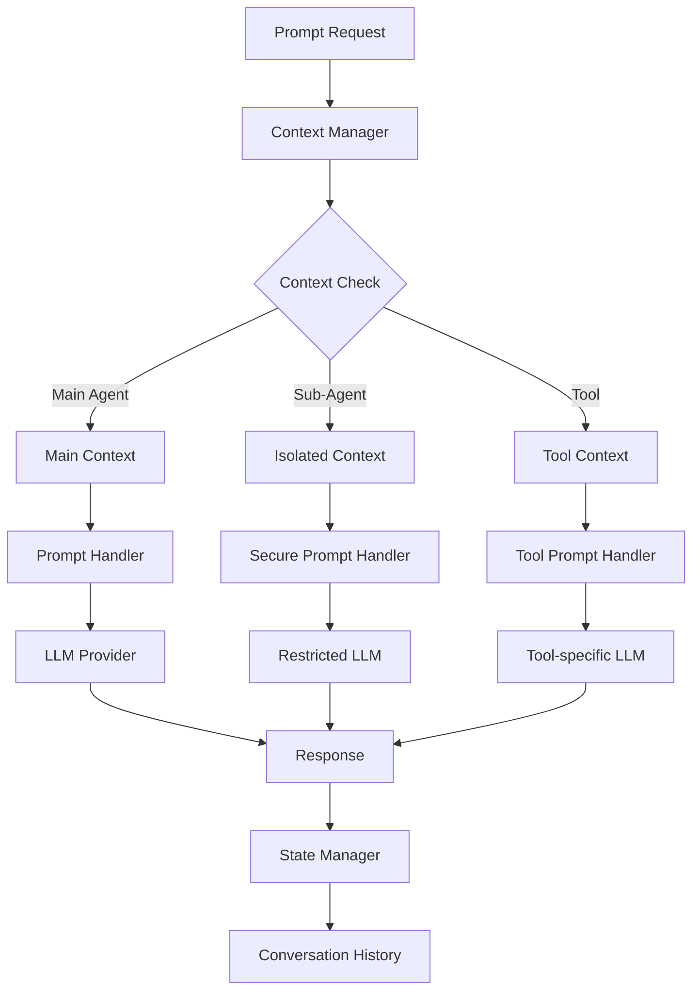

# Context-Prompt Integration Design

## Overview

This document defines the detailed integration patterns between the Context Manager and Prompt Handler, establishing how context isolation and security boundaries work with prompt processing in the qi-v2 agent system.

## Integration Architecture

### Core Integration Flow

```
User Prompt → Agent → Context Manager → Prompt Handler → LLM Provider
     ↓           ↓           ↓              ↓              ↓
   Request → Context → Isolated Context → Execution → Response
     ↓           ↓           ↓              ↓              ↓
  History → Conversation → Security → Result → State Update
```

### Context-Aware Prompt Processing



## Context Types and Prompt Handling

### 1. Main Agent Context

**Characteristics:**
- Full LLM access with all model capabilities
- Complete conversation history access
- No security restrictions on prompt content
- Full tool integration available

**Implementation:**
```typescript
interface MainContextPromptExecution {
  contextId: string;
  promptContent: string;
  modelConfig: {
    provider: string;
    model: string;
    temperature: number;
    maxTokens: number;
  };
  toolAccess: 'full';
  securityLevel: 'none';
  conversationHistory: ConversationEntry[];
}
```

### 2. Sub-Agent Context (Isolated)

**Characteristics:**
- Restricted LLM access with filtered capabilities
- Limited conversation history (task-specific only)
- Security boundaries enforced on prompt content
- Filtered tool integration

**Implementation:**
```typescript
interface IsolatedContextPromptExecution {
  contextId: string;
  parentContextId: string;
  task: string;
  promptContent: string; // Filtered and sanitized
  modelConfig: {
    provider: string;
    model: string; // May be restricted to specific models
    temperature: number; // May be limited range
    maxTokens: number; // Reduced limit
  };
  toolAccess: 'restricted';
  securityLevel: 'high';
  allowedOperations: string[];
  timeLimit: number;
  conversationHistory: ContextMessage[]; // Task-specific only
}
```

### 3. Tool Context

**Characteristics:**
- Minimal LLM access for tool-specific operations
- No conversation history access
- Strict security boundaries
- Single-purpose operation only

**Implementation:**
```typescript
interface ToolContextPromptExecution {
  contextId: string;
  toolName: string;
  operation: string;
  promptContent: string; // Highly constrained
  modelConfig: {
    provider: 'local'; // Only local models
    model: string; // Specific tool-optimized model
    temperature: 0.1; // Low temperature for consistency
    maxTokens: 512; // Very limited
  };
  toolAccess: 'single';
  securityLevel: 'maximum';
  allowedOperations: [string]; // Single operation only
  timeLimit: 30000; // 30 seconds max
}
```

## Security Integration Patterns

### 1. Prompt Content Filtering

**Security Boundary Enforcement:**
```typescript
class ContextAwarePromptHandler implements IPromptHandler {
  async complete(prompt: string, options: PromptOptions, contextId: string): Promise<PromptResponse> {
    // Get context and validate access
    const context = await this.contextManager.getIsolatedContext(contextId);
    if (!context) {
      return { success: false, error: 'Invalid context' };
    }
    
    // Apply context-specific filtering
    const filteredPrompt = await this.applyContextFiltering(prompt, context);
    if (!filteredPrompt) {
      return { success: false, error: 'Prompt violates security boundaries' };
    }
    
    // Execute with context-aware configuration
    const contextualOptions = this.mergeContextualOptions(options, context);
    return await this.executePrompt(filteredPrompt, contextualOptions, context);
  }
  
  private async applyContextFiltering(prompt: string, context: IsolatedContext): Promise<string | null> {
    // Check for forbidden content
    if (this.containsForbiddenOperations(prompt, context)) {
      return null;
    }
    
    // Filter out restricted paths/commands
    const filtered = this.filterRestrictedContent(prompt, context);
    
    // Add safety prefixes for isolated contexts
    if (context.boundaries.includes('mode:readonly')) {
      return `[READ-ONLY MODE] ${filtered}`;
    }
    
    return filtered;
  }
}
```

### 2. Response Filtering

**Output Security:**
```typescript
private async filterResponse(response: string, context: IsolatedContext): Promise<string> {
  let filtered = response;
  
  // Remove potentially sensitive information
  filtered = this.removeSensitiveData(filtered, context);
  
  // Filter out restricted operations in responses
  filtered = this.filterOperationSuggestions(filtered, context);
  
  // Add security disclaimers for isolated contexts
  if (context.boundaries.includes('approval:required')) {
    filtered += '\n\n[Note: This response is from an isolated context and requires approval for execution]';
  }
  
  return filtered;
}
```

## Context Lifecycle in Prompt Processing

### 1. Context Creation for Prompt Tasks

```typescript
async function createPromptContext(
  parentContext: string,
  task: string,
  specialization: AgentSpecialization
): Promise<IsolatedContext> {
  const restrictions: SecurityRestrictions = {
    readOnlyMode: true,
    allowedPaths: ['/workspace/current-task'],
    blockedCommands: ['rm', 'sudo', 'curl'],
    blockedTools: ['SystemTool', 'NetworkTool'],
    requireApproval: true,
    maxExecutionTime: 180000, // 3 minutes
    maxMemoryUsage: 50 * 1024 * 1024, // 50MB
    networkAccess: false,
    systemAccess: false
  };
  
  return contextManager.createIsolatedContext({
    parentContextId: parentContext,
    task,
    specialization,
    restrictions,
    timeLimit: 180000
  });
}
```

### 2. Context Cleanup After Prompt Processing

```typescript
async function processPromptWithContext(
  prompt: string,
  parentContextId: string,
  task: string
): Promise<PromptResponse> {
  let contextId: string | null = null;
  
  try {
    // Create isolated context
    const context = await createPromptContext(parentContextId, task, 'general');
    contextId = context.id;
    
    // Process prompt with context
    const response = await promptHandler.complete(prompt, {}, contextId);
    
    // Update conversation history in parent context
    await contextManager.addMessageToContext(parentContextId, {
      id: generateId(),
      role: 'user',
      content: prompt,
      timestamp: new Date(),
      metadata: new Map([['contextId', contextId], ['task', task]])
    });
    
    if (response.success) {
      await contextManager.addMessageToContext(parentContextId, {
        id: generateId(),
        role: 'assistant',
        content: response.data,
        timestamp: new Date(),
        metadata: new Map([['contextId', contextId], ['filtered', 'true']])
      });
    }
    
    return response;
    
  } finally {
    // Always cleanup isolated context
    if (contextId) {
      contextManager.terminateContext(contextId);
    }
  }
}
```

## Memory and State Management

### 1. Context-Aware Conversation History

```typescript
interface ContextAwareConversationEntry {
  id: string;
  timestamp: Date;
  role: 'user' | 'assistant' | 'system';
  content: string;
  contextId: string;
  contextType: 'main' | 'sub-agent' | 'tool';
  securityLevel: 'none' | 'low' | 'medium' | 'high' | 'maximum';
  filtered: boolean;
  metadata: ReadonlyMap<string, unknown>;
}
```

### 2. Context Memory Isolation

```typescript
class ContextAwareMemoryManager {
  async getContextualHistory(
    contextId: string,
    maxEntries: number = 10
  ): Promise<ContextAwareConversationEntry[]> {
    const context = await this.contextManager.getIsolatedContext(contextId);
    if (!context) {
      return [];
    }
    
    // Get only entries visible to this context
    const allHistory = await this.stateManager.getConversationHistory();
    const contextualHistory = allHistory.filter(entry => 
      this.isEntryVisibleToContext(entry, context)
    );
    
    return contextualHistory.slice(-maxEntries);
  }
  
  private isEntryVisibleToContext(
    entry: ContextAwareConversationEntry,
    context: IsolatedContext
  ): boolean {
    // Main context entries are always visible
    if (entry.contextType === 'main') {
      return true;
    }
    
    // Same context entries are visible
    if (entry.contextId === context.id) {
      return true;
    }
    
    // Parent context entries may be visible based on security level
    if (entry.contextId === context.parentContextId && 
        context.boundaries.includes('parent:visible')) {
      return true;
    }
    
    return false;
  }
}
```

## Error Handling and Fallbacks

### 1. Context Failure Handling

```typescript
async function handleContextPromptWithFallback(
  prompt: string,
  contextId: string,
  options: PromptOptions
): Promise<PromptResponse> {
  try {
    // Try with isolated context first
    const response = await processPromptInContext(prompt, contextId, options);
    return response;
    
  } catch (error) {
    // Context error - fallback to main context with restrictions
    console.warn(`Context ${contextId} failed, falling back to main context:`, error);
    
    const fallbackOptions = {
      ...options,
      temperature: Math.min(options.temperature || 0.7, 0.3), // Lower temperature
      maxTokens: Math.min(options.maxTokens || 2048, 1024)    // Reduce tokens
    };
    
    const mainContextId = await this.contextManager.getApplicationContext().sessionId;
    return await this.promptHandler.complete(
      `[FALLBACK MODE] ${prompt}`,
      fallbackOptions
    );
  }
}
```

### 2. Security Violation Recovery

```typescript
async function handleSecurityViolation(
  contextId: string,
  violation: string,
  prompt: string
): Promise<PromptResponse> {
  // Log security violation
  await this.contextManager.auditContextAccess(
    contextId,
    'prompt:security-violation',
    false,
    violation
  );
  
  // Terminate context if too many violations
  const violationCount = await this.contextManager.getViolationCount(contextId);
  if (violationCount > 3) {
    await this.contextManager.terminateContext(contextId);
    return {
      success: false,
      error: 'Context terminated due to repeated security violations'
    };
  }
  
  // Try to sanitize and retry once
  const sanitizedPrompt = await this.sanitizePromptForContext(prompt, contextId);
  if (sanitizedPrompt) {
    return await this.promptHandler.complete(sanitizedPrompt, {}, contextId);
  }
  
  return {
    success: false,
    error: 'Prompt violates security boundaries and cannot be processed'
  };
}
```

## Performance Considerations

### 1. Context Caching

```typescript
class ContextCache {
  private contextCache = new Map<string, CachedContext>();
  private readonly CACHE_TTL = 300000; // 5 minutes
  
  async getCachedContext(contextId: string): Promise<IsolatedContext | null> {
    const cached = this.contextCache.get(contextId);
    if (!cached || Date.now() - cached.timestamp > this.CACHE_TTL) {
      return null;
    }
    return cached.context;
  }
  
  setCachedContext(contextId: string, context: IsolatedContext): void {
    this.contextCache.set(contextId, {
      context,
      timestamp: Date.now()
    });
  }
}
```

### 2. Prompt Preprocessing

```typescript
class ContextAwarePromptPreprocessor {
  async preprocessPrompt(
    prompt: string,
    context: IsolatedContext
  ): Promise<PreprocessedPrompt> {
    // Template-based preprocessing for common patterns
    const templates = await this.getContextTemplates(context.specialization);
    const enhanced = await this.applyTemplates(prompt, templates);
    
    // Add context-specific instructions
    const instructions = this.getContextInstructions(context);
    const instructed = `${instructions}\n\n${enhanced}`;
    
    return {
      original: prompt,
      processed: instructed,
      contextId: context.id,
      preprocessing: {
        templatesApplied: templates.length,
        instructionsAdded: instructions.length > 0,
        securityFiltered: true
      }
    };
  }
}
```

## Integration Testing Patterns

### 1. Context-Prompt Integration Tests

```typescript
describe('Context-Prompt Integration', () => {
  test('isolated context restricts dangerous operations', async () => {
    const context = await createRestrictedContext();
    const response = await promptHandler.complete(
      'Delete all files in the current directory',
      {},
      context.id
    );
    
    expect(response.success).toBe(false);
    expect(response.error).toContain('security boundaries');
  });
  
  test('main context allows full operations', async () => {
    const mainContext = await createMainContext();
    const response = await promptHandler.complete(
      'List files in the current directory',
      {},
      mainContext.id
    );
    
    expect(response.success).toBe(true);
    expect(response.data).toContain('files');
  });
});
```

This integration design ensures that the Context Manager and Prompt Handler work together seamlessly while maintaining security boundaries and providing appropriate isolation for different types of agent operations.