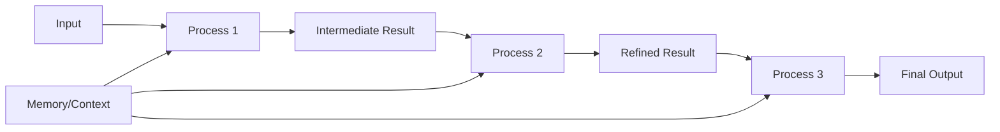

# "Learning Paradigm" Misconception: Clarification

## The Conceptual Problem

You're absolutely correct to be confused by the term **"learning paradigm"** - it's misleading! The LLM model parameters are **frozen** during inference, so no actual "learning" occurs in the machine learning sense.

## What's Actually Happening

### Traditional ML Learning (What's NOT happening)
```
Training Data → Model Parameters Update → Improved Performance
```
- Model weights change
- Permanent knowledge acquisition
- Improved capability over time

### "Learning Paradigms" (What IS happening)
```
Input Context → Information Processing Strategy → Output Generation
```
- Model weights remain frozen
- No permanent knowledge acquisition
- Different **prompting strategies** for utilizing existing knowledge

## Correct Terminology

### Instead of "Learning Paradigms", these are:

#### 1. **Prompting Strategies** or **Inference Patterns**

**Zero-Shot Prompting**:
```
Task description only → Direct inference → Output
```

**One-Shot Prompting**: 
```
Task description + 1 example → Pattern matching → Output
```

**Few-Shot Prompting**:
```
Task description + N examples → Pattern matching → Output
```

#### 2. **Context Utilization Patterns**

The model uses different strategies to process the **context window**:

- **Zero-shot**: Relies purely on pre-trained knowledge
- **One-shot**: Uses single example as template/pattern
- **Few-shot**: Uses multiple examples for pattern recognition

#### 3. **In-Context Learning** (Still misleading but standard term)

This term is used in the literature but is conceptually problematic:
- No actual "learning" in the ML sense
- Actually **pattern recognition** within the context window
- Model identifies patterns in the prompt and applies them

## What About "Agentic Workflows"?

### Also Not "Learning" - It's **Iterative Processing**



**What's happening**:
- Multiple inference passes
- Context accumulation across iterations
- Self-evaluation and refinement
- **No parameter updates**

### Correct Term: **Iterative Inference Pattern**

## Real Examples to Clarify

### Zero-Shot Prompting
```
Prompt: "Classify the sentiment: 'I love this product!'"
Model: Uses pre-trained knowledge → "positive"
```

### One-Shot Prompting  
```
Prompt: "Classify sentiment. Example: 'Great service!' → positive
Now classify: 'I love this product!'"
Model: Recognizes pattern → "positive"
```

### Iterative Inference (Agentic)
```
Pass 1: "Analyze this code for bugs"
Output 1: "Found 3 potential issues"

Pass 2: "Review your analysis. Are you confident?"  
Output 2: "Upon reflection, issue #2 might be false positive"

Pass 3: "Provide final bug report"
Output 3: "Confirmed 2 bugs with high confidence"
```

## Why the Confusion Exists

### 1. Academic Literature Uses Misleading Terms
- "In-context learning" (no learning happens)
- "Few-shot learning" (no learning happens)
- "Meta-learning" (no meta-learning during inference)

### 2. Anthropomorphic Language
- We project human learning concepts onto AI systems
- Humans do learn from examples, AI models just pattern-match

### 3. Historical Terminology
- Terms carried over from traditional ML where learning did occur
- Now applied to inference-time behaviors

## Corrected Conceptual Framework

### For qi-v2-agent Documentation

Replace "Learning Paradigms" with:

#### **Inference Strategies**
1. **Zero-Shot Inference**: Direct application of pre-trained knowledge
2. **One-Shot Inference**: Template-guided generation using single example
3. **Iterative Inference**: Multi-pass refinement through self-evaluation

#### **Context Utilization Patterns**
1. **Instruction-Only**: Task description without examples
2. **Example-Guided**: Task description with demonstration examples
3. **Iterative-Refinement**: Progressive improvement through multiple passes

#### **Processing Paradigms**
1. **Single-Pass Processing**: One inference call, direct output
2. **Template-Based Processing**: Example-guided format matching
3. **Multi-Pass Processing**: Iterative refinement with context accumulation

## Technical Implementation Reality

### What Actually Happens in Code

```typescript
// "Zero-shot" - really just single inference
const result = await llm.generate(prompt);

// "One-shot" - really just prompt with example
const promptWithExample = `${example}\n${task}`;
const result = await llm.generate(promptWithExample);

// "Agentic" - really just multiple inference calls
let context = initialPrompt;
for (let i = 0; i < maxIterations; i++) {
  const result = await llm.generate(context);
  context += `\nPrevious: ${result}\nReflection: `;
  const reflection = await llm.generate(context + "Analyze and improve");
  if (isGoodEnough(reflection)) break;
  context += reflection;
}
```

**No learning occurs** - just different prompting strategies!

## Implications for Architecture

### 1. Focus on **Prompting Engineering** not "Learning"
- Optimize prompt templates
- Design effective context management
- Implement smart iteration strategies

### 2. **Context Management** is Key
- How to accumulate information across iterations
- When to prune context to fit limits  
- How to maintain coherence

### 3. **Iteration Control** Strategies
- Termination criteria
- Quality assessment
- Error recovery

## Recommended Terminology Update

### Old (Misleading)
- "Zero-shot learning"
- "One-shot learning" 
- "Agentic learning"

### New (Accurate)
- "Zero-shot inference"
- "Example-guided inference"
- "Iterative refinement inference"

Or even better:
- "Direct prompting"
- "Template prompting"
- "Iterative prompting"

## Conclusion

You're absolutely right to be conceptually confused! The term "learning" is inappropriate here since:

1. **No model parameters change**
2. **No permanent knowledge acquisition**
3. **No capability improvement over time**

What we're really discussing are different **inference strategies** and **prompting patterns** for utilizing the model's fixed, pre-trained capabilities.

The "agentic workflow" is simply **iterative inference with context accumulation** - not learning in any traditional sense.

This clarification should resolve the conceptual confusion and help focus on what's actually happening: sophisticated prompting strategies, not learning.