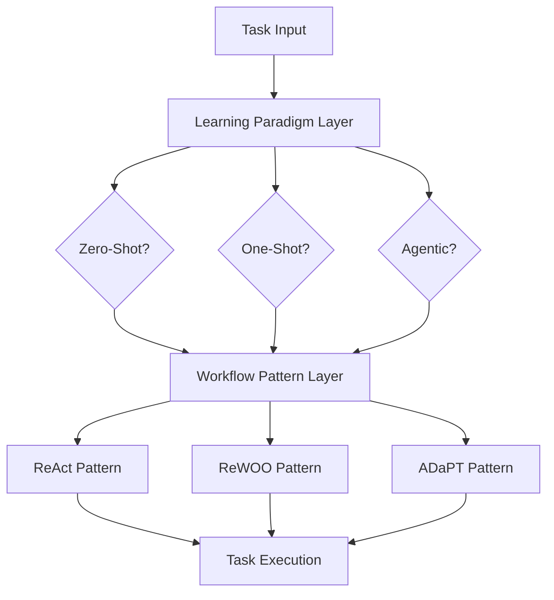

# Learning Paradigms vs Workflow Patterns: Clarification

## The Confusion

There are **two different concepts** that are often conflated but operate at different levels of AI system design:

1. **Learning Paradigms**: How AI models learn from input data
2. **Workflow Execution Patterns**: How tasks are orchestrated and executed

## Learning Paradigms (Data Input Level)

### Zero-Shot Learning
```
Input: Task description only
Process: Direct inference from pre-training
Output: Single response
```

### One-Shot Learning  
```
Input: Task description + 1 example
Process: Pattern matching + inference
Output: Single response
```

### Agentic Learning
```
Input: Goal description
Process: Iterative loops with self-reflection
Output: Refined response through multiple cycles
```

## Workflow Execution Patterns (Task Orchestration Level)

### ReAct Pattern
```
Loop: Think → Act → Observe → Decide
Purpose: Dynamic adaptation based on observations
Use: Exploratory tasks, debugging, real-time problem solving
```

### ReWOO Pattern  
```
Flow: Plan → Execute (Parallel) → Solve
Purpose: Comprehensive upfront planning with parallel execution
Use: Well-defined complex tasks, optimal resource utilization
```

### ADaPT Pattern
```
Flow: Analyze → Decompose (if needed) → Execute → Combine
Purpose: Adaptive task breakdown based on complexity
Use: Variable complexity tasks, recursive problem solving
```

## How They Interact

### Orthogonal Concepts
These operate at **different layers** and can be **combined**:



### Combination Examples

#### Zero-Shot + ReAct
```
Learning: No examples provided
Execution: Think → Act → Observe loops
Result: Exploratory problem solving without examples
```

#### One-Shot + ReWOO
```
Learning: Single example provided for format
Execution: Plan → Parallel execution → Synthesis
Result: Efficient execution with example-guided output format
```

#### Agentic + ADaPT
```
Learning: Iterative improvement cycles
Execution: Recursive task decomposition
Result: Self-improving hierarchical problem solving
```

## Practical Implementation Matrix

| Learning Paradigm | + ReAct | + ReWOO | + ADaPT |
|-------------------|---------|---------|---------|
| **Zero-Shot** | Exploratory with no examples | Planned execution, no examples | Adaptive decomposition, no examples |
| **One-Shot** | Guided exploration with format | Structured execution with example | Hierarchical execution with format |
| **Agentic** | Self-improving exploration | Self-improving planned execution | Self-improving adaptive decomposition |

## qi-v2-agent Architecture Context

### Current State
- ✅ **Workflow Patterns**: ReAct, ReWOO, ADaPT implemented in `docs/workflow/research-patterns.md`
- ✅ **Tool Infrastructure**: Comprehensive tool ecosystem for execution
- 🔄 **Learning Paradigms**: Mostly zero-shot/one-shot, limited agentic capabilities

### Missing Integration
```typescript
interface IntegratedAgent {
  // Learning layer
  learningParadigm: 'zero-shot' | 'one-shot' | 'agentic';
  
  // Execution layer  
  workflowPattern: 'react' | 'rewoo' | 'adapt';
  
  // Combined execution
  execute(input: Input): Promise<Output>;
}
```

## Recommended Clarifications

### 1. Rename/Reorganize Documentation
```
docs/agent/
├── learning-paradigms/
│   ├── zero-shot-architecture.md
│   ├── one-shot-architecture.md  
│   └── agentic-workflow-architecture.md
└── workflow-patterns/
    ├── react-pattern.md
    ├── rewoo-pattern.md
    └── adapt-pattern.md
```

### 2. Create Integration Guide
Document how learning paradigms combine with workflow patterns for different use cases.

### 3. Update Terminology
- **Learning Paradigms**: How models process input data
- **Workflow Patterns**: How tasks are orchestrated and executed
- **Agentic Systems**: Systems that combine agentic learning with iterative workflow patterns

## Summary

The confusion arises because:

1. **"Agentic workflow"** in our research refers to a **learning paradigm** (iterative improvement)
2. **"Workflow patterns"** in `research-patterns.md` refers to **execution orchestration** (ReAct, ReWOO, ADaPT)

These are **complementary concepts** that operate at different architectural layers and can be combined for powerful AI systems. The qi-v2-agent system already implements excellent workflow patterns but needs to integrate agentic learning paradigms for complete capability.