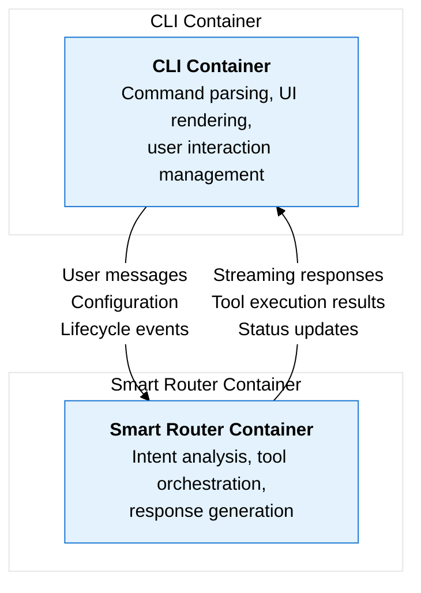

# Design Documentation

This directory contains comprehensive design documentation for the qi-v2-agent system, structured according to the C4 framework and interface-driven design principles.

## Documentation Structure

### 🏗️ [Architecture](./architecture/)
C4 framework architecture documentation providing multiple levels of detail:
- **System Context**: How qi-v2-agent fits in the larger ecosystem
- **Container Diagram**: Two-container architecture (CLI + Smart Router)
- **Component Diagrams**: Internal structure and interactions
- **Code Diagrams**: Implementation-specific details

### 📦 [Containers](./containers/)
Interface contracts for the two main containers:
- **[CLI Container](./containers/cli-container.md)**: Command parsing, UI rendering, user interaction
- **[Smart Router Container](./containers/smart-router-container.md)**: NLP, intent analysis, tool orchestration

### 🔧 [Components](./components/)
Interface contracts for internal components within each container:
- **CLI Components**: Command Parser, UI Renderer, Command Handler, Smart Router Client
- **Smart Router Components**: Intent Analyzer, LLM Provider, Tool Manager, Conversation Manager

### 📋 Legacy Analysis (Reference Only)
- **[CLI Analysis](./cli/)**: Current CLI implementation analysis
- **[Smart Routing](./smart-routing/)**: Current smart routing implementation
- **[LangChain](./langchain/)**: LangChain component usage
- **[LangGraph](./langgraph/)**: LangGraph component usage

## Key Architectural Insights

### 🧠 Two-Container Architecture



### 🎯 Smart Routing as Core Intelligence

The **Smart Router is the brain** of the entire system:
- **CLI Container**: Simple orchestrator that delegates to Smart Router
- **Smart Router Container**: Contains all intelligence for intent analysis and tool orchestration
- **Interface-Based Design**: Containers communicate through well-defined contracts

### 🔄 Progressive Enhancement Pattern

```typescript
// Static commands: No smart routing
qi config --show → Direct console output

// Interactive commands: Full smart routing  
qi unified → User input → Smart Router → Tools/Direct response

// Workflow commands: Pre-loaded smart routing
qi edit file.js "fix bug" → Workflow messages → Smart Router → Tool execution
```

## Current vs. Proposed Architecture

### ❌ Current Implementation Gaps

1. **Missing Container Abstractions**
   ```typescript
   // Current: Direct coupling
   const agent = new AgentFactory(config);
   render(SimpleChatApp({ agentFactory: agent }));
   
   // Missing: Container interfaces
   ```

2. **Missing Component Interfaces**
   ```typescript
   // Current: Monolithic components
   export class AgentFactory { /* everything */ }
   
   // Missing: IIntentAnalyzer, IToolManager, etc.
   ```

3. **No Configuration Contracts**
   ```typescript
   // Current: Implicit configuration
   const config = configLoader.loadConfig();
   
   // Missing: Typed configuration schemas
   ```

### ✅ Proposed Improvements

1. **Container Interface Contracts**
   ```typescript
   interface ICommandLineInterface {
     execute(args: string[]): Promise<CommandResult>;
   }
   
   interface ISmartRouter {
     processMessage(request: MessageRequest): AsyncIterableIterator<ResponseChunk>;
   }
   ```

2. **Component Interface Contracts**
   ```typescript
   interface IIntentAnalyzer {
     analyzeIntent(request: IntentAnalysisRequest): Promise<IntentAnalysisResult>;
   }
   
   interface IToolManager {
     executeTool(name: string, params: any): Promise<ToolResult>;
   }
   ```

3. **Configuration Schema**
   ```typescript
   interface CLIConfig {
     app: AppMetadata;
     ui: UIConfig;
     smartRouter: SmartRouterConfig;
   }
   ```

## Design Principles

### 🎯 Single Responsibility Principle
- **CLI Container**: Only handles user interaction
- **Smart Router Container**: Only handles intelligence
- **Each Component**: One clear responsibility

### 🔄 Dependency Inversion
```typescript
// Good: Depend on abstractions
class CommandHandler {
  constructor(private smartRouterClient: ISmartRouterClient) {}
}

// Bad: Depend on concrete implementations  
class CommandHandler {
  constructor(private agentFactory: AgentFactory) {}
}
```

### 🔌 Interface Segregation
```typescript
// Good: Focused interfaces
interface ICommandParser {
  parse(args: string[]): ParsedCommand;
}

interface ICommandValidator {
  validate(command: ParsedCommand): ValidationResult;
}

// Bad: Monolithic interface
interface ICommandProcessor {
  parse(args: string[]): ParsedCommand;
  validate(command: ParsedCommand): ValidationResult;
  execute(command: ParsedCommand): Promise<CommandResult>;
  render(result: CommandResult): void;
}
```

### 🏗️ Composition Over Inheritance
```typescript
// Good: Composition
class SmartRouter {
  constructor(
    private intentAnalyzer: IIntentAnalyzer,
    private toolManager: IToolManager,
    private conversationManager: IConversationManager
  ) {}
}

// Bad: Inheritance
class SmartRouter extends BaseAgent implements IAnalyzer, IToolExecutor, IStateManager {}
```

## Benefits of Interface-Driven Design

### 🧪 Testing
```typescript
// Easy to mock for testing
const mockSmartRouter: ISmartRouter = {
  processMessage: jest.fn().mockReturnValue(mockResponseStream)
};

const cliContainer = new CLIContainer(mockSmartRouter);
```

### 🔄 Substitutability
```typescript
// Easy to swap implementations
const smartRouter = config.useAdvancedRouting
  ? new AdvancedSmartRouter(config)
  : new BasicSmartRouter(config);

const cliContainer = new CLIContainer(smartRouter);
```

### 📊 Monitoring
```typescript
// Standardized metrics across implementations
interface IMonitored {
  getMetrics(): ComponentMetrics;
  healthCheck(): HealthStatus;
}
```

## Migration Strategy

### Phase 1: Container Interfaces
1. Define `ICommandLineInterface` and `ISmartRouter`
2. Create adapter classes for current implementations
3. Update tests to use interfaces

### Phase 2: Component Interfaces
1. Extract component interfaces from current monoliths
2. Refactor implementations to match interfaces
3. Introduce dependency injection

### Phase 3: Configuration Contracts
1. Define typed configuration schemas
2. Add configuration validation
3. Standardize error handling

### Phase 4: Full Interface Implementation
1. Replace adapter classes with true interface implementations
2. Add comprehensive testing
3. Performance optimization and monitoring

## Usage Guidelines

### For New Development
1. **Always define interfaces first** before implementation
2. **Use dependency injection** for component composition
3. **Follow configuration contracts** for consistency
4. **Implement error handling standards** from day one

### For Refactoring Existing Code
1. **Extract interfaces** from existing classes
2. **Introduce adapters** for gradual migration
3. **Add tests** using interface mocks
4. **Measure impact** of changes

### For Architecture Reviews
1. **Check interface compliance** - Are components following contracts?
2. **Verify separation of concerns** - Is each component focused?
3. **Review dependencies** - Are components properly decoupled?
4. **Assess testability** - Can components be easily tested in isolation?

## Related Resources

- **[C4 Model](https://c4model.com/)**: Framework for software architecture documentation
- **[SOLID Principles](https://en.wikipedia.org/wiki/SOLID)**: Object-oriented design principles
- **[Dependency Injection](https://en.wikipedia.org/wiki/Dependency_injection)**: Design pattern for loose coupling
- **[Interface Segregation](https://en.wikipedia.org/wiki/Interface_segregation_principle)**: Principle for focused interfaces

This design documentation provides a complete blueprint for transforming the qi-v2-agent from a tightly-coupled implementation to a flexible, testable, and maintainable architecture through interface-driven design principles.