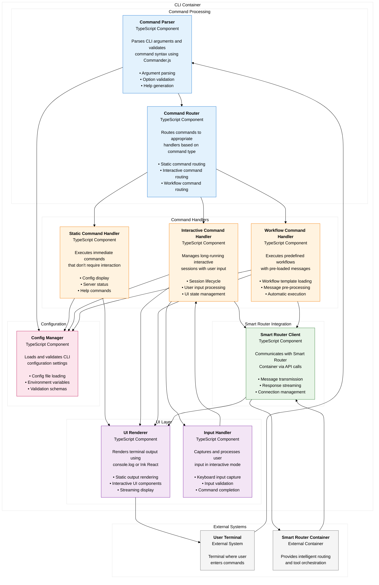
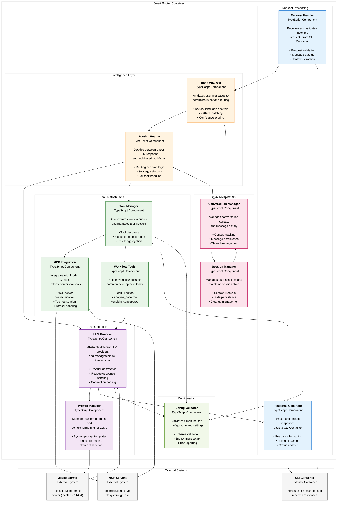
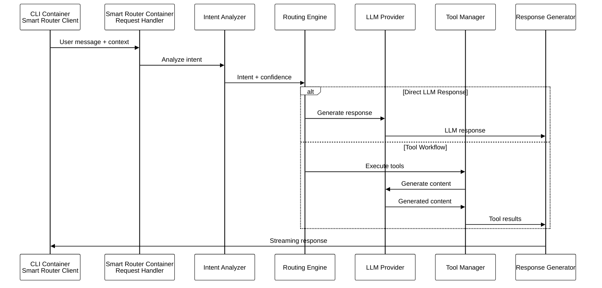

# Component Diagrams (C4 Level 3)

## Overview

This document presents the component-level architecture for both containers in the qi-v2-agent system, showing the internal structure and interactions within each container.

## CLI Container Components

### CLI Container Component Diagram



### CLI Container Component Responsibilities

#### Command Processing Layer
- **Command Parser**: 
  - Parses `process.argv` using Commander.js
  - Validates command syntax and options
  - Generates help documentation
  
- **Command Router**: 
  - Determines command type (static/interactive/workflow)
  - Routes to appropriate handler
  - Manages command lifecycle

#### Command Handlers Layer
- **Static Command Handler**:
  - Handles `qi config --show`, `qi servers --list`
  - Immediate execution and exit
  - Direct console output

- **Interactive Command Handler**:
  - Handles `qi unified`, `qi chat`
  - Long-running sessions
  - Real-time user interaction

- **Workflow Command Handler**:
  - Handles `qi edit file.js "fix bug"`
  - Pre-loaded workflow execution
  - Automatic tool triggering

#### UI Layer
- **UI Renderer**:
  - Static output via console.log
  - Interactive UI via Ink React
  - Streaming response display

- **Input Handler**:
  - Keyboard input capture
  - Input validation and processing
  - Command completion support

#### Integration Layer
- **Smart Router Client**:
  - HTTP/IPC communication with Smart Router
  - Message serialization/deserialization
  - Connection pooling and retry logic

#### Configuration Layer
- **Config Manager**:
  - YAML configuration loading
  - Environment variable override
  - Configuration validation

## Smart Router Container Components

### Smart Router Container Component Diagram



### Smart Router Container Component Responsibilities

#### Request Processing Layer
- **Request Handler**:
  - Validates incoming requests from CLI Container
  - Extracts message content and context
  - Handles authentication and rate limiting

- **Response Generator**:
  - Formats responses for CLI Container
  - Manages streaming token delivery
  - Provides status updates and error handling

#### Intelligence Layer
- **Intent Analyzer**:
  - Performs natural language analysis
  - Classifies user intent (conversation, workflow, etc.)
  - Provides confidence scores for routing decisions

- **Routing Engine**:
  - Makes routing decisions based on intent analysis
  - Selects between direct LLM and tool workflows
  - Handles fallback strategies for ambiguous inputs

#### LLM Integration Layer
- **LLM Provider**:
  - Abstracts different LLM providers (Ollama, OpenAI, etc.)
  - Manages model loading and inference
  - Handles connection pooling and retry logic

- **Prompt Manager**:
  - Manages system prompt templates
  - Formats context for LLM consumption
  - Optimizes token usage and context windows

#### Tool Management Layer
- **Tool Manager**:
  - Orchestrates tool discovery and execution
  - Manages tool dependencies and sequencing
  - Aggregates results from multiple tools

- **MCP Integration**:
  - Communicates with MCP servers via JSON-RPC
  - Handles tool registration and lifecycle
  - Manages protocol compliance and error handling

- **Workflow Tools**:
  - Implements built-in development workflow tools
  - Provides edit_files, analyze_code, explain_concept
  - Integrates with LLM for content generation

#### State Management Layer
- **Conversation Manager**:
  - Tracks conversation context and history
  - Manages message threading and continuity
  - Provides context for intent analysis

- **Session Manager**:
  - Manages user session lifecycle
  - Persists session state across interactions
  - Handles session cleanup and resource management

#### Configuration Layer
- **Config Validator**:
  - Validates Smart Router configuration schemas
  - Manages environment-specific settings
  - Provides configuration error reporting

## Component Interaction Patterns

### Cross-Container Communication



### Intra-Container Component Flow

#### CLI Container Flow
```
User Input → Command Parser → Command Router → Handler → UI Renderer → User Output
                                    ↓
                            Smart Router Client ← → Smart Router Container
```

#### Smart Router Container Flow
```
CLI Request → Request Handler → Intent Analyzer → Routing Engine
                                                        ↓
                                              LLM Provider ← → Ollama
                                                        ↓
                                               Tool Manager ← → MCP Servers
                                                        ↓
                                             Response Generator → CLI Response
```

## Component Dependencies

### CLI Container Dependencies
- **Command Parser** → ConfigManager
- **Command Router** → StaticHandler, InteractiveHandler, WorkflowHandler
- **Interactive/Workflow Handlers** → SmartRouterClient, UIRenderer
- **UI Renderer** → External Terminal
- **Smart Router Client** → Smart Router Container API

### Smart Router Container Dependencies
- **Request Handler** → ConfigValidator
- **Intent Analyzer** → ConversationManager, LLMProvider
- **Routing Engine** → IntentAnalyzer, ToolManager, LLMProvider
- **LLM Provider** → OllamaServer, PromptManager
- **Tool Manager** → MCPIntegration, WorkflowTools
- **MCP Integration** → External MCP Servers
- **All Components** → ConfigValidator

## Error Handling Between Components

### CLI Container Error Flow
```
Component Error → Error Handler → UI Renderer → User-Friendly Message
                      ↓
                Smart Router Client → Retry/Fallback Logic
```

### Smart Router Container Error Flow
```
Component Error → Error Logger → Response Generator → Error Response to CLI
                      ↓
                Circuit Breaker → Fallback Strategy
```

## Performance Considerations

### CLI Container
- **Command Parser**: <50ms parsing time
- **UI Renderer**: 16ms frame rate for smooth streaming
- **Smart Router Client**: Connection pooling for efficiency

### Smart Router Container  
- **Intent Analyzer**: <500ms analysis time
- **LLM Provider**: Connection pooling, request batching
- **Tool Manager**: Parallel tool execution where possible
- **Conversation Manager**: Efficient context windowing

This component-level view provides the detailed internal structure needed to understand how each container achieves its responsibilities through well-defined component interactions and clear separation of concerns.