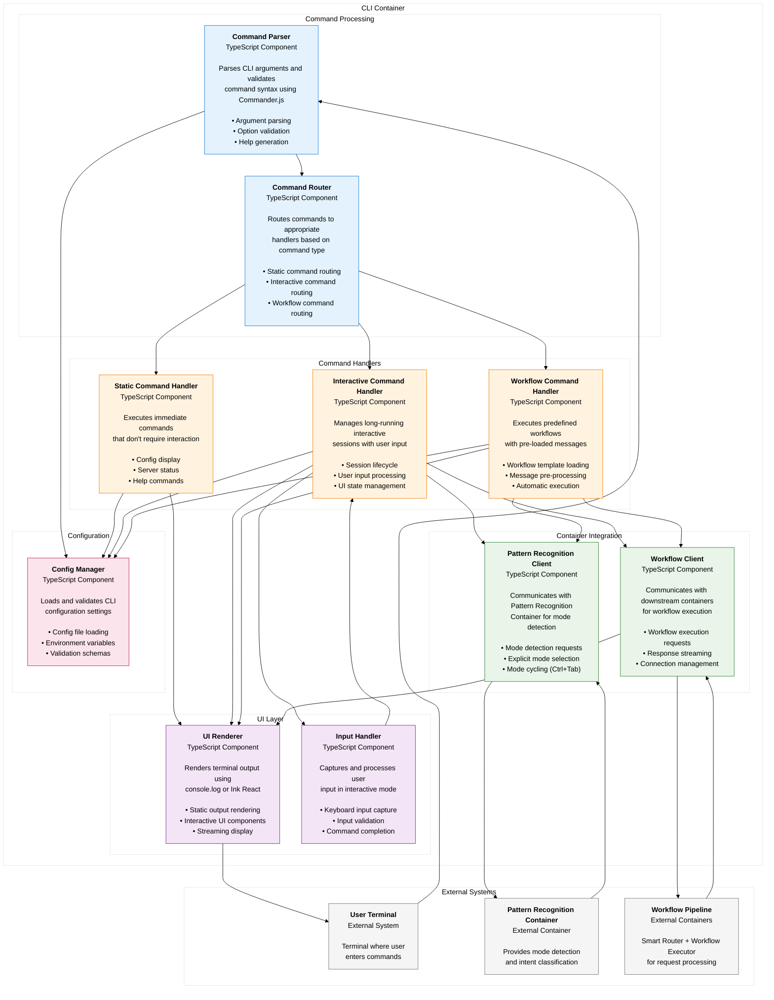
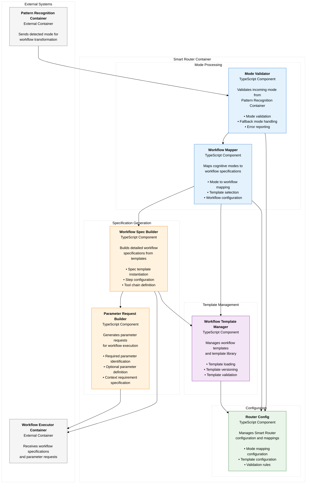
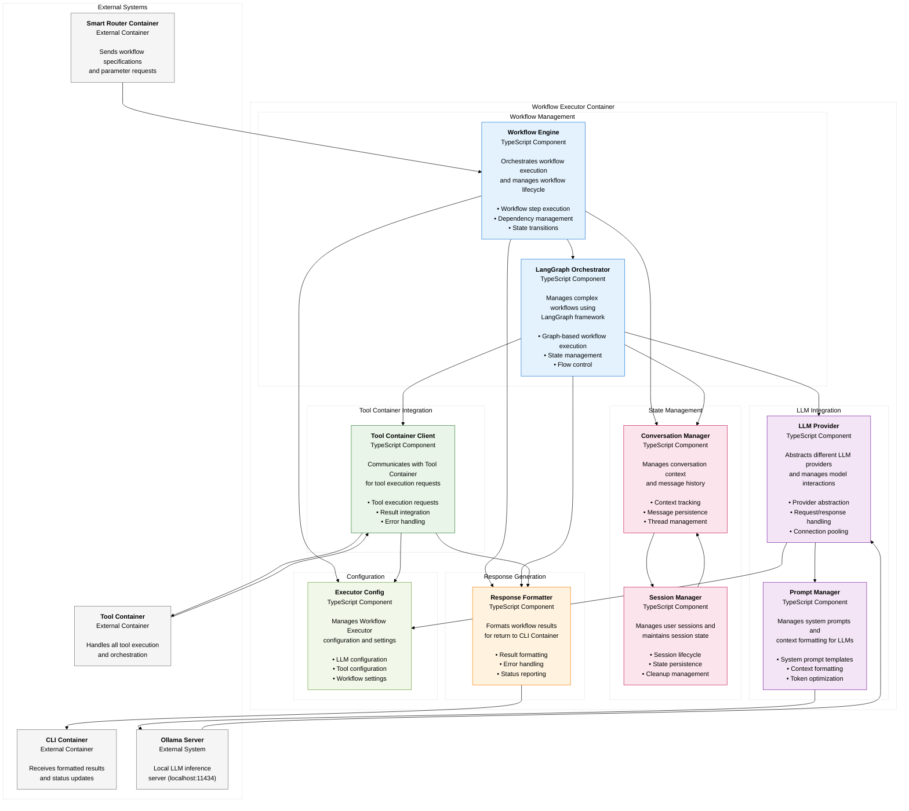
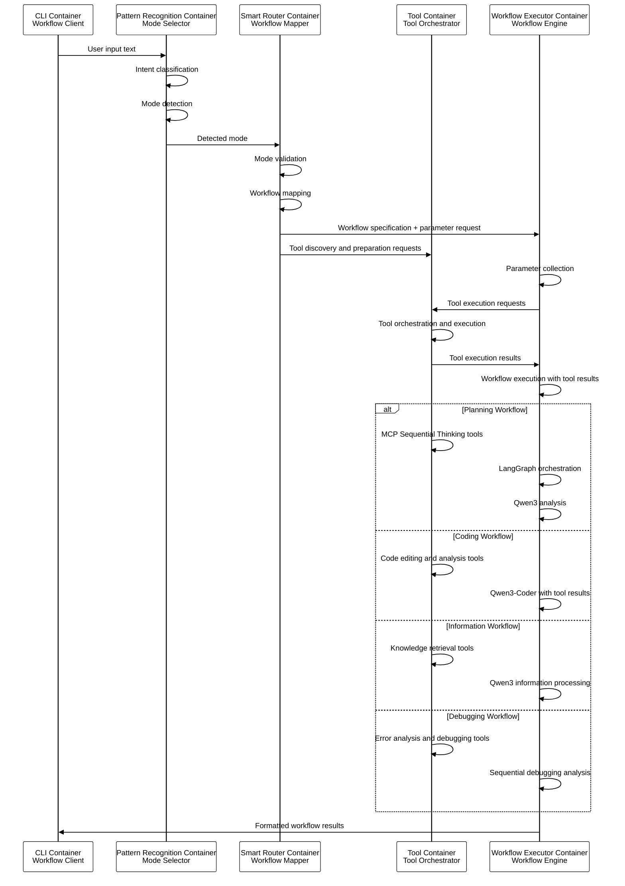

# Component Diagrams (C4 Level 3)

## Overview

This document presents the component-level architecture for the 5-container qi-v2-agent system, showing the internal structure and interactions within each container implementing the **Agent = Tool Box + WE + LLM** model.

## CLI Container Components

### CLI Container Component Diagram



### CLI Container Component Responsibilities

#### Command Processing Layer
- **Command Parser**: 
  - Parses `process.argv` using Commander.js
  - Validates command syntax and options
  - Generates help documentation
  
- **Command Router**: 
  - Determines command type (static/interactive/workflow)
  - Routes to appropriate handler
  - Manages command lifecycle

#### Command Handlers Layer
- **Static Command Handler**:
  - Handles `qi config --show`, `qi servers --list`
  - Immediate execution and exit
  - Direct console output

- **Interactive Command Handler**:
  - Handles `qi unified`, `qi chat`
  - Long-running sessions
  - Real-time user interaction

- **Workflow Command Handler**:
  - Handles `qi edit file.js "fix bug"`
  - Pre-loaded workflow execution
  - Automatic tool triggering

#### UI Layer
- **UI Renderer**:
  - Static output via console.log
  - Interactive UI via Ink React
  - Streaming response display

- **Input Handler**:
  - Keyboard input capture
  - Input validation and processing
  - Command completion support

#### Integration Layer
- **Pattern Recognition Client**:
  - API communication with Pattern Recognition Container
  - Mode detection and explicit mode selection
  - Mode cycling and state management

- **Workflow Client**:
  - Communication with Smart Router and Workflow Executor
  - Request orchestration and response streaming
  - Connection pooling and retry logic

#### Configuration Layer
- **Config Manager**:
  - YAML configuration loading
  - Environment variable override
  - Configuration validation

## Pattern Recognition Container Components

### Pattern Recognition Container Component Diagram

```mermaid
%%{init: {"theme": "base", "themeVariables": {"primaryColor": "#ffffff", "primaryTextColor": "#000000", "primaryBorderColor": "#000000", "lineColor": "#000000"}}}%%
graph TB
    subgraph "Pattern Recognition Container"
        subgraph "Input Processing"
            InputValidator["<b>Input Validator</b><br/>TypeScript Component<br/><br/>Validates and sanitizes<br/>incoming user input<br/><br/>• Input sanitization<br/>• Format validation<br/>• Length constraints"]
            
            TextNormalizer["<b>Text Normalizer</b><br/>TypeScript Component<br/><br/>Preprocesses text for<br/>pattern analysis<br/><br/>• Text cleaning<br/>• Tokenization<br/>• Normalization"]
        end
        
        subgraph "Pattern Analysis"
            IntentClassifier["<b>Intent Classifier</b><br/>TypeScript Component<br/><br/>LangChain-based classification<br/>of user intent patterns<br/><br/>• NLP pattern matching<br/>• Intent categorization<br/>• Confidence scoring"]
            
            ModeDetector["<b>Mode Detector</b><br/>TypeScript Component<br/><br/>Maps classified intents to<br/>cognitive modes<br/><br/>• Intent to mode mapping<br/>• Mode confidence scoring<br/>• Fallback mode selection"]
        end
        
        subgraph "Context Generation"
            ContextBuilder["<b>Context Builder</b><br/>TypeScript Component<br/><br/>Builds mode-specific context<br/>for downstream processing<br/><br/>• Context template selection<br/>• Parameter extraction<br/>• Context enrichment"]
        end
        
        subgraph "Mode Management"
            ModeSelector["<b>Mode Selector</b><br/>TypeScript Component<br/><br/>Handles explicit mode selection<br/>and mode cycling<br/><br/>• Manual mode override<br/>• Mode cycling logic<br/>• Mode persistence"]
        end
        
        subgraph "Configuration"
            PatternConfig["<b>Pattern Config</b><br/>TypeScript Component<br/><br/>Manages pattern recognition<br/>configuration and rules<br/><br/>• Pattern rule loading<br/>• Classification thresholds<br/>• Model configuration"]
        end
    end
    
    subgraph "External Systems"
        CLIContainerAPI["<b>CLI Container</b><br/>External Container<br/><br/>Sends user input and<br/>receives mode decisions"]
        
        SmartRouterAPI["<b>Smart Router Container</b><br/>External Container<br/><br/>Receives mode for<br/>workflow transformation"]
        
        LangChainAPI["<b>LangChain API</b><br/>External System<br/><br/>NLP processing and<br/>intent classification"]
    end
    
    %% Input flow
    CLIContainerAPI --> InputValidator
    InputValidator --> TextNormalizer
    TextNormalizer --> IntentClassifier
    
    %% Classification flow
    IntentClassifier --> ModeDetector
    ModeDetector --> ContextBuilder
    ContextBuilder --> ModeSelector
    
    %% External integration
    IntentClassifier --> LangChainAPI
    LangChainAPI --> IntentClassifier
    
    %% Output flow
    ModeSelector --> SmartRouterAPI
    
    %% Configuration
    IntentClassifier --> PatternConfig
    ModeDetector --> PatternConfig
    ModeSelector --> PatternConfig
    
    classDef input fill:#e3f2fd,stroke:#1976d2,color:#000000
    classDef analysis fill:#fff3e0,stroke:#f57c00,color:#000000
    classDef context fill:#f3e5f5,stroke:#7b1fa2,color:#000000
    classDef mode fill:#e8f5e8,stroke:#2e7d32,color:#000000
    classDef config fill:#fce4ec,stroke:#c2185b,color:#000000
    classDef external fill:#f5f5f5,stroke:#757575,color:#000000
    
    class InputValidator,TextNormalizer input
    class IntentClassifier,ModeDetector analysis
    class ContextBuilder context
    class ModeSelector mode
    class PatternConfig config
    class CLIContainerAPI,SmartRouterAPI,LangChainAPI external
```



### Pattern Recognition Container Component Responsibilities

#### Input Processing Layer
- **Input Validator**:
  - Sanitizes user input for security
  - Validates input format and constraints
  - Filters malicious or invalid content

- **Text Normalizer**:
  - Cleans and preprocesses text
  - Handles tokenization and normalization
  - Prepares text for pattern analysis

#### Pattern Analysis Layer
- **Intent Classifier**:
  - Uses LangChain for natural language processing
  - Classifies user intent from text patterns
  - Provides confidence scores for classifications

- **Mode Detector**:
  - Maps classified intents to cognitive modes
  - Handles ambiguous intent resolution
  - Selects appropriate fallback modes

#### Context Generation Layer
- **Context Builder**:
  - Creates mode-specific context information
  - Extracts relevant parameters from input
  - Enriches context for downstream processing

#### Mode Management Layer
- **Mode Selector**:
  - Handles explicit mode selection from CLI
  - Manages mode cycling (Ctrl+Tab)
  - Persists mode state across interactions

#### Configuration Layer
- **Pattern Config**:
  - Loads pattern recognition rules and thresholds
  - Configures LangChain models and parameters
  - Manages classification confidence thresholds

## Smart Router Container Components

### Smart Router Container Component Diagram



### Smart Router Container Component Responsibilities

#### Mode Processing Layer
- **Mode Validator**:
  - Validates incoming mode from Pattern Recognition Container
  - Handles invalid or unsupported modes
  - Provides fallback mode selection

- **Workflow Mapper**:
  - Maps cognitive modes to workflow specifications
  - Selects appropriate workflow templates
  - Configures mode-specific workflow parameters

#### Specification Generation Layer
- **Workflow Spec Builder**:
  - Builds detailed workflow specifications from templates
  - Configures workflow steps and dependencies
  - Defines tool chains and execution parameters

- **Parameter Request Builder**:
  - Generates parameter requests for workflow execution
  - Identifies required and optional execution parameters
  - Specifies context requirements for workflows

#### Template Management Layer
- **Workflow Template Manager**:
  - Manages workflow template library
  - Handles template loading and versioning
  - Validates template compliance and structure

#### Configuration Layer
- **Router Config**:
  - Manages mode to workflow mapping configuration
  - Configures workflow template settings
  - Maintains validation rules and constraints

## Workflow Executor Container Components

### Workflow Executor Container Component Diagram



### Workflow Executor Container Component Responsibilities

#### Workflow Management Layer
- **Workflow Engine**:
  - Orchestrates workflow execution from specifications
  - Manages workflow step dependencies and sequencing
  - Handles workflow state transitions and error recovery

- **LangGraph Orchestrator**:
  - Executes complex workflows using LangGraph framework
  - Manages graph-based workflow state and flow control
  - Handles parallel and conditional workflow execution

#### LLM Integration Layer
- **LLM Provider**:
  - Abstracts different LLM providers (Ollama, OpenAI, etc.)
  - Manages model loading and inference
  - Handles connection pooling and retry logic

- **Prompt Manager**:
  - Manages system prompt templates for different workflow types
  - Formats context for LLM consumption
  - Optimizes token usage and context windows

#### Tool Container Integration Layer
- **Tool Container Client**:
  - Communicates with Tool Container for all tool execution
  - Sends tool execution requests and receives results
  - Handles Tool Container integration and error handling

## Tool Container Components

### Tool Container Component Diagram

```mermaid
%%{init: {"theme": "base", "themeVariables": {"primaryColor": "#ffffff", "primaryTextColor": "#000000", "primaryBorderColor": "#000000", "lineColor": "#000000"}}}%%
graph TB
    subgraph "Tool Container"
        subgraph "Tool Execution"
            ToolExecutor["<b>Tool Executor</b><br/>TypeScript Component<br/><br/>Executes individual tools<br/>and manages execution lifecycle<br/><br/>• Tool invocation<br/>• Parameter validation<br/>• Result processing"]
            
            ToolOrchestrator["<b>Tool Orchestrator</b><br/>TypeScript Component<br/><br/>Orchestrates complex tool chains<br/>and parallel execution<br/><br/>• Tool chain execution<br/>• Dependency management<br/>• Result aggregation"]
        end
        
        subgraph "Tool Types"
            BuiltinTools["<b>Builtin Tools</b><br/>TypeScript Component<br/><br/>Built-in tool implementations<br/>for common operations<br/><br/>• File operations<br/>• Code analysis<br/>• Text processing"]
            
            MCPIntegration["<b>MCP Integration</b><br/>TypeScript Component<br/><br/>Integrates with Model Context<br/>Protocol servers<br/><br/>• MCP server communication<br/>• Tool registration<br/>• Protocol handling"]
            
            ExternalTools["<b>External Tools</b><br/>TypeScript Component<br/><br/>Integration with external<br/>APIs and services<br/><br/>• API communication<br/>• Authentication handling<br/>• Response processing"]
        end
        
        subgraph "Tool Management"
            ToolRegistry["<b>Tool Registry</b><br/>TypeScript Component<br/><br/>Manages tool discovery<br/>and registration<br/><br/>• Tool cataloging<br/>• Capability discovery<br/>• Metadata management"]
            
            ToolValidator["<b>Tool Validator</b><br/>TypeScript Component<br/><br/>Validates tool inputs<br/>and security constraints<br/><br/>• Input validation<br/>• Security checks<br/>• Permission enforcement"]
        end
        
        subgraph "Security & Sandboxing"
            SecurityManager["<b>Security Manager</b><br/>TypeScript Component<br/><br/>Manages tool security<br/>and sandboxing<br/><br/>• Permission management<br/>• Sandbox creation<br/>• Security validation"]
        end
        
        subgraph "Configuration"
            ToolConfig["<b>Tool Config</b><br/>TypeScript Component<br/><br/>Manages Tool Container<br/>configuration and settings<br/><br/>• Tool configuration<br/>• MCP server config<br/>• Security policies"]
        end
    end
    
    subgraph "External Systems"
        WorkflowExecutorAPI["<b>Workflow Executor Container</b><br/>External Container<br/><br/>Sends tool execution<br/>requests"]
        
        SmartRouterAPI["<b>Smart Router Container</b><br/>External Container<br/><br/>May send direct tool<br/>discovery requests"]
        
        MCPServers["<b>MCP Servers</b><br/>External System<br/><br/>Tool execution servers<br/>(filesystem, git, etc.)"]
        
        ExternalAPIs["<b>External APIs</b><br/>External System<br/><br/>Third-party services<br/>and APIs"]
    end
    
    %% Tool execution flow
    WorkflowExecutorAPI --> ToolOrchestrator
    SmartRouterAPI --> ToolRegistry
    ToolOrchestrator --> ToolExecutor
    ToolExecutor --> BuiltinTools
    ToolExecutor --> MCPIntegration
    ToolExecutor --> ExternalTools
    
    %% Tool management flow
    ToolOrchestrator --> ToolRegistry
    ToolExecutor --> ToolValidator
    ToolValidator --> SecurityManager
    
    %% External integration
    MCPIntegration --> MCPServers
    MCPServers --> MCPIntegration
    ExternalTools --> ExternalAPIs
    ExternalAPIs --> ExternalTools
    
    %% Result flow
    BuiltinTools --> ToolExecutor
    ToolExecutor --> ToolOrchestrator
    ToolOrchestrator --> WorkflowExecutorAPI
    
    %% Configuration
    ToolExecutor --> ToolConfig
    ToolOrchestrator --> ToolConfig
    MCPIntegration --> ToolConfig
    SecurityManager --> ToolConfig
    
    classDef execution fill:#e3f2fd,stroke:#1976d2,color:#000000
    classDef types fill:#fff3e0,stroke:#f57c00,color:#000000
    classDef management fill:#f3e5f5,stroke:#7b1fa2,color:#000000
    classDef security fill:#e8f5e8,stroke:#2e7d32,color:#000000
    classDef config fill:#fce4ec,stroke:#c2185b,color:#000000
    classDef external fill:#f5f5f5,stroke:#757575,color:#000000
    
    class ToolExecutor,ToolOrchestrator execution
    class BuiltinTools,MCPIntegration,ExternalTools types
    class ToolRegistry,ToolValidator management
    class SecurityManager security
    class ToolConfig config
    class WorkflowExecutorAPI,SmartRouterAPI,MCPServers,ExternalAPIs external
```



### Tool Container Component Responsibilities

#### Tool Execution Layer
- **Tool Executor**:
  - Executes individual tools with parameter validation
  - Manages tool execution lifecycle and resource usage
  - Processes tool results and error handling

- **Tool Orchestrator**:
  - Orchestrates complex tool chains and workflows
  - Manages dependencies and parallel execution
  - Aggregates results from multiple tool executions

#### Tool Types Layer
- **Builtin Tools**:
  - Implements built-in tools for file operations, code analysis
  - Provides high-performance native tool implementations
  - Handles common development workflow operations

- **MCP Integration**:
  - Communicates with MCP servers via JSON-RPC protocol
  - Handles tool registration and lifecycle management
  - Manages protocol compliance and error handling

- **External Tools**:
  - Integrates with external APIs and third-party services
  - Handles authentication and rate limiting
  - Processes external API responses and errors

#### Tool Management Layer
- **Tool Registry**:
  - Maintains catalog of available tools and capabilities
  - Handles tool discovery and metadata management
  - Provides tool search and filtering capabilities

- **Tool Validator**:
  - Validates tool inputs and parameters
  - Enforces security constraints and permissions
  - Sanitizes inputs to prevent security vulnerabilities

#### Security & Sandboxing Layer
- **Security Manager**:
  - Manages tool execution permissions and sandboxing
  - Creates isolated execution environments
  - Enforces security policies and access controls

#### Configuration Layer
- **Tool Config**:
  - Manages tool configuration and settings
  - Configures MCP server connections and authentication
  - Maintains security policies and validation rules

#### State Management Layer
- **Conversation Manager**:
  - Tracks conversation context and history
  - Manages message threading and continuity
  - Provides context for workflow execution

- **Session Manager**:
  - Manages user session lifecycle
  - Persists session state across interactions
  - Handles session cleanup and resource management

#### Response Generation Layer
- **Response Formatter**:
  - Formats workflow execution results
  - Handles error reporting and status updates
  - Prepares responses for CLI Container consumption

#### Configuration Layer
- **Executor Config**:
  - Manages LLM provider configuration
  - Configures tool and MCP server settings
  - Maintains workflow execution parameters

## Component Interaction Patterns

### Cross-Container Communication



### Intra-Container Component Flow

#### CLI Container Flow
```
User Input → Command Parser → Command Router → Handler → Pattern Recognition Client
                                    ↓                              ↓
                                UI Renderer ← Workflow Client ← Mode Detection
```

#### Pattern Recognition Container Flow
```
User Text → Input Validator → Text Normalizer → Intent Classifier → Mode Detector
                                                        ↓                ↓
                                                 LangChain API    Context Builder
                                                                        ↓
                                                                 Mode Selector → Smart Router
```

#### Smart Router Container Flow
```
Mode → Mode Validator → Workflow Mapper → Workflow Spec Builder
                            ↓                      ↓
                    Template Manager       Parameter Request Builder
                                                  ↓
                                          Workflow Executor
```

#### Workflow Executor Container Flow
```
Workflow Spec → Workflow Engine → LangGraph Orchestrator → LLM Provider ← → Ollama
                     ↓                      ↓                     ↓
               Conversation Manager    Tool Container       Prompt Manager
                     ↓                      Client               ↓
               Session Manager             ↓               Response Formatter
                                     Tool Container                 ↓
                                   Tool Orchestrator         CLI Container
```

#### Tool Container Flow
```
Tool Requests → Tool Orchestrator → Tool Executor → Tool Types (Builtin/MCP/External)
                      ↓                   ↓                    ↓
                Tool Registry      Tool Validator        External Systems
                      ↓                   ↓                    ↓
                Security Manager   Tool Results ← → Tool Execution Results
                      ↓
              Workflow Executor Container
```

## Component Dependencies

### CLI Container Dependencies
- **Command Parser** → ConfigManager
- **Command Router** → StaticHandler, InteractiveHandler, WorkflowHandler
- **Interactive/Workflow Handlers** → PatternRecognitionClient, WorkflowClient, UIRenderer
- **UI Renderer** → External Terminal
- **Pattern Recognition Client** → Pattern Recognition Container API
- **Workflow Client** → Smart Router + Workflow Executor Containers

### Pattern Recognition Container Dependencies
- **Input Validator** → PatternConfig
- **Intent Classifier** → LangChain API, PatternConfig
- **Mode Detector** → PatternConfig
- **Context Builder** → PatternConfig
- **Mode Selector** → PatternConfig

### Smart Router Container Dependencies
- **Mode Validator** → RouterConfig
- **Workflow Mapper** → WorkflowTemplateManager, RouterConfig
- **Workflow Spec Builder** → WorkflowTemplateManager
- **Parameter Request Builder** → RouterConfig
- **Workflow Template Manager** → RouterConfig

### Tool Container Dependencies
- **Tool Orchestrator** → ToolConfig, ToolRegistry, SecurityManager
- **Tool Executor** → ToolConfig, ToolValidator, SecurityManager
- **Builtin Tools** → Internal implementations
- **MCP Integration** → External MCP Servers, ToolConfig
- **External Tools** → External APIs, ToolConfig
- **Tool Registry** → ToolConfig
- **Tool Validator** → SecurityManager, ToolConfig
- **Security Manager** → ToolConfig

### Workflow Executor Container Dependencies
- **Workflow Engine** → ExecutorConfig, ConversationManager
- **LangGraph Orchestrator** → ConversationManager, LLMProvider, ToolContainerClient
- **LLM Provider** → OllamaServer, PromptManager, ExecutorConfig
- **Tool Container Client** → Tool Container API
- **Conversation Manager** → SessionManager
- **All Components** → ExecutorConfig

## Error Handling Between Components

### CLI Container Error Flow
```
Component Error → Error Handler → UI Renderer → User-Friendly Message
                      ↓
            Pattern Recognition Client → Retry/Fallback Logic
                      ↓
               Workflow Client → Error Recovery
```

### Pattern Recognition Container Error Flow
```
Component Error → Error Logger → Fallback Mode Selection → Smart Router
                      ↓
               Confidence Threshold → Default Mode Assignment
```

### Smart Router Container Error Flow
```
Component Error → Error Logger → Fallback Workflow Selection → Workflow Executor
                      ↓
              Template Validation → Default Template Assignment
```

### Tool Container Error Flow
```
Tool Error → Error Logger → Tool Error Handler → Fallback Tool Strategy
                ↓                   ↓                    ↓
        Security Manager    Circuit Breaker      Tool Result to Workflow Executor
                ↓                   ↓
        Sandbox Cleanup    Tool Retry Logic
```

### Workflow Executor Container Error Flow
```
Component Error → Error Logger → Response Formatter → Error Response to CLI
                      ↓
              Circuit Breaker → Workflow Retry/Fallback Strategy
                      ↓
            Tool Container Client → Tool Error Recovery
```

## Performance Considerations

### CLI Container
- **Command Parser**: <50ms parsing time
- **UI Renderer**: 16ms frame rate for smooth streaming
- **Pattern Recognition Client**: Connection pooling for mode detection
- **Workflow Client**: Connection pooling for workflow execution

### Pattern Recognition Container
- **Intent Classifier**: <300ms LangChain classification time
- **Mode Detector**: <100ms mode mapping time
- **Text Normalizer**: <50ms preprocessing time
- **Mode Selector**: <10ms mode selection time

### Smart Router Container
- **Mode Validator**: <50ms validation time
- **Workflow Mapper**: <100ms template selection time
- **Workflow Spec Builder**: <200ms specification generation time
- **Template Manager**: Cached template loading for efficiency

### Tool Container
- **Tool Orchestrator**: Parallel tool execution, dependency optimization
- **Tool Executor**: Resource pooling, execution caching
- **MCP Integration**: Connection pooling, batch requests
- **Security Manager**: Lightweight sandboxing, permission caching

### Workflow Executor Container
- **LLM Provider**: Connection pooling, request batching
- **Tool Container Client**: Request batching, result caching
- **LangGraph Orchestrator**: Efficient state management and flow control
- **Conversation Manager**: Optimized context windowing and persistence

## Architecture Benefits

### 5-Container Separation of Concerns
1. **CLI Container**: Pure user interaction and interface management
2. **Pattern Recognition Container**: Specialized intelligence for mode detection
3. **Smart Router Container**: Pure transformation from mode to workflow
4. **Tool Container**: Dedicated tool execution and orchestration (Tool Box)
5. **Workflow Executor Container**: Focused workflow orchestration + LLM integration (WE + LLM)

### Scalability and Maintainability
- **Independent Scaling**: Each container can scale based on its specific load
- **Clear Interfaces**: Well-defined contracts between containers
- **Fault Isolation**: Failures contained within container boundaries
- **Technology Specialization**: Each container optimized for its specific purpose

This component-level view provides the detailed internal structure needed to understand how each container achieves its responsibilities through well-defined component interactions and clear separation of concerns in the 5-container architecture implementing the **Agent = Tool Box + WE + LLM** model.