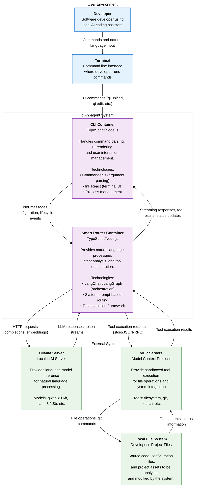

# Container Diagram (C4 Level 2)

## Overview

This document presents the container-level architecture of the qi-v2-agent system, showing the major containers and how they interact to provide local AI coding assistance functionality.

## Container Diagram



## Container Responsibilities

### CLI Container
**Technology**: TypeScript/Node.js with Commander.js and Ink React

**Primary Responsibilities**:
- Parse command-line arguments and validate user input
- Render terminal UI (both static output and interactive components)
- Manage user interaction lifecycle (initialization, execution, cleanup)
- Route commands to appropriate execution strategies
- Handle user input in interactive mode and forward to Smart Router
- Present streaming responses and tool execution results to users

**Key Features**:
- **Multi-Modal Commands**: Static (`qi config`), Interactive (`qi unified`), Workflow (`qi edit file.js`)
- **Rich Terminal UI**: Real-time streaming, progress indicators, error handling
- **Context Management**: Maintain session state and user preferences

### Smart Router Container  
**Technology**: TypeScript/Node.js with LangChain/LangGraph

**Primary Responsibilities**:
- Analyze user messages to determine intent and required actions
- Route between direct LLM responses and tool-based workflows
- Orchestrate multi-step tool execution and workflow management
- Generate contextually appropriate responses
- Maintain conversation context and learning from interactions

**Key Features**:
- **Intent Analysis**: Natural language understanding and classification
- **Smart Routing**: Automatic decision between conversation and workflow modes
- **Tool Orchestration**: Coordinate multiple tools for complex workflows
- **Context Awareness**: Maintain conversation history and project context

## Container Interactions

### CLI → Smart Router Communication

```typescript
// Request Contract
interface MessageRequest {
  messages: Message[];
  options: ProcessingOptions;
  context: RequestContext;
}

// Response Contract  
interface ResponseStream {
  type: 'token' | 'tool_call' | 'status' | 'complete';
  content: string;
  metadata?: ResponseMetadata;
}
```

**Key Interactions**:
1. **User Message Processing**: CLI forwards user input to Smart Router for analysis
2. **Streaming Responses**: Smart Router streams tokens and status updates back to CLI
3. **Tool Execution Updates**: Smart Router reports tool progress and results
4. **Error Handling**: Smart Router reports errors; CLI presents user-friendly messages
5. **Configuration**: CLI provides configuration and context to Smart Router

### Smart Router → External Systems

#### Ollama Server Integration
```http
POST /api/generate
Content-Type: application/json

{
  "model": "qwen3:0.6b",
  "prompt": "...",
  "stream": true,
  "options": {
    "temperature": 0.1
  }
}
```

#### MCP Server Integration
```json
{
  "jsonrpc": "2.0",
  "method": "tools/call",
  "params": {
    "name": "write_file",
    "arguments": {
      "path": "src/utils.js",
      "content": "..."
    }
  }
}
```

## Data Flow Scenarios

### Scenario 1: Simple Conversation
```
Developer types: "hi"
┌─────────────┐    ┌─────────────┐    ┌─────────────┐
│ CLI         │───▶│ Smart Router│───▶│ Ollama      │
│ Container   │    │ Container   │    │ Server      │
└─────────────┘    └─────────────┘    └─────────────┘
       ▲                   │                   │
       │                   ▼                   ▼
       └──────────── "Hello! How can I help?" ◀──
```

### Scenario 2: File Operation Workflow
```
Developer types: "write to file foo.py quicksort function"
┌─────────────┐    ┌─────────────┐    ┌─────────────┐
│ CLI         │───▶│ Smart Router│───▶│ Ollama      │
│ Container   │    │ Container   │    │ Server      │
└─────────────┘    └─────────────┘    └─────────────┘
       ▲                   │                   │
       │                   ▼                   ▼
       │                   │            Code generation
       │                   ▼                   │
       │            ┌─────────────┐           │
       │            │ MCP Servers │◀──────────┘
       │            └─────────────┘
       │                   │
       │                   ▼
       │            ┌─────────────┐
       │            │ File System │
       │            └─────────────┘
       │                   │
       └──────────── "✅ File created successfully" ◀──
```

### Scenario 3: Complex Workflow
```
Developer runs: qi edit auth.js "add error handling"
┌─────────────┐    ┌─────────────┐
│ CLI         │───▶│ Smart Router│
│ Container   │    │ Container   │
└─────────────┘    └─────────────┘
       ▲                   │
       │                   ▼
       │            1. Read current file
       │            2. Analyze code structure  
       │            3. Generate improvements
       │            4. Apply changes
       │            5. Validate syntax
       │                   │
       └──────────── Progress updates and final result ◀──
```

## Technology Stack

### CLI Container Technologies
- **Commander.js**: Command-line argument parsing and validation
- **Ink React**: Rich terminal UI components and state management
- **Node.js Process**: Lifecycle management and signal handling
- **TypeScript**: Type safety and development productivity

### Smart Router Container Technologies
- **LangChain Core**: LLM abstraction and message handling
- **LangGraph**: Agent orchestration and workflow management
- **@langchain/ollama**: Ollama LLM provider integration
- **MCP Protocol**: Tool integration and execution framework

### External System Technologies
- **Ollama**: Local LLM inference server
- **Model Context Protocol**: Standardized tool execution protocol
- **Local File System**: Direct file system access for development workflows

## Quality Attributes

### Performance
- **CLI Startup**: Sub-200ms for static commands, <2s for interactive
- **Smart Router Response**: First token within 2s, tool execution <30s
- **Memory Usage**: <50MB for CLI operations, <200MB for Smart Router
- **Concurrent Sessions**: Support 10+ concurrent conversations

### Reliability
- **Graceful Degradation**: CLI works when Smart Router unavailable
- **Error Recovery**: Automatic retry and fallback strategies
- **Resource Management**: Proper cleanup and memory management
- **Data Integrity**: Consistent state across container interactions

### Security
- **Local Processing**: No external data transmission
- **Sandboxed Execution**: MCP servers provide isolated tool execution
- **User Confirmation**: Destructive operations require user approval
- **Configuration Security**: Environment variable support for sensitive data

### Usability
- **Natural Language**: Intuitive command interface
- **Progressive Disclosure**: Simple commands → complex workflows
- **Real-time Feedback**: Streaming responses and progress indicators
- **Error Messages**: Clear, actionable error reporting

## Deployment Architecture

### Local Development Setup
```
┌─────────────────────────────────────────────────────────────┐
│ Developer Machine                                           │
│                                                             │
│ ┌─────────────┐  ┌─────────────┐  ┌─────────────────────┐  │
│ │ CLI         │  │ Smart Router│  │ Ollama Server       │  │
│ │ Container   │  │ Container   │  │ (localhost:11434)   │  │
│ │ (Node.js)   │  │ (Node.js)   │  │                     │  │
│ └─────────────┘  └─────────────┘  └─────────────────────┘  │
│        │                │                       │         │
│        └────────────────┼───────────────────────┘         │
│                         │                                 │
│ ┌─────────────────────────────────────────────────────────┐ │
│ │ MCP Servers (stdio processes)                          │ │
│ │ • Filesystem server                                    │ │
│ │ • Git server                                           │ │
│ │ • Search server                                        │ │
│ └─────────────────────────────────────────────────────────┘ │
│                         │                                 │
│ ┌─────────────────────────────────────────────────────────┐ │
│ │ Local File System                                      │ │
│ │ • Project source code                                  │ │
│ │ • Configuration files                                  │ │
│ │ • Development artifacts                                │ │
│ └─────────────────────────────────────────────────────────┘ │
└─────────────────────────────────────────────────────────────┘
```

## Future Considerations

### Scalability
- **Distributed LLM**: Support for remote LLM providers
- **Multi-User**: Shared Smart Router with user isolation
- **Tool Registry**: Dynamic tool discovery and registration

### Extensibility  
- **Plugin Architecture**: Third-party container integration
- **Custom Tools**: User-defined MCP servers
- **Configuration Management**: Advanced configuration and templating

### Integration
- **IDE Integration**: VS Code extension and language server
- **CI/CD Integration**: Pipeline integration for automated workflows
- **Team Collaboration**: Shared configurations and workflows

This container diagram provides the foundation for understanding how the qi-v2-agent system delivers local AI coding assistance through well-defined container interactions and clear separation of concerns.