# CLI Architecture: From Command Parsing to User Interface

## Overview

This document explains how the qi-v2-agent CLI system transforms command-line arguments into interactive user interfaces, handling both simple commands (`qi config --show`) and complex interactive workflows (`qi unified`). The key insight is that there is **no CLI abstraction layer** - instead, everything is tightly coupled to specific implementation frameworks.

## The Problem: Unified CLI for Different Interaction Modes

Users need a single CLI that can handle:
- **Simple commands**: `qi config --show`, `qi servers --list`  
- **Interactive workflows**: `qi unified`, `qi chat`, `qi edit file.js "fix bug"`
- **Streaming interfaces**: Real-time chat with progress indicators

The challenge is providing consistent command parsing while supporting vastly different UI interaction patterns.

## Conceptual Architecture: Universal Command Handler with Smart Routing


## Current Implementation: CLI → Smart Routing Integration

```mermaid
%%{init: {"theme": "base", "themeVariables": {"primaryColor": "#ffffff", "primaryTextColor": "#000000", "primaryBorderColor": "#000000", "lineColor": "#000000"}}}%%
graph TB
    subgraph "CLI Input Layer"
        CLIInput["<b>CLI Arguments</b><br/>process.argv parsing"]
    end
    
    subgraph "Commander.js Layer"
        CommanderProgram["<b>Commander Program</b><br/>program.command().option().action()"]
        
        StaticHandlers["<b>Static Command Handlers</b><br/>config, servers, etc.<br/>• Direct console output<br/>• No smart routing needed"]
        
        InteractiveHandlers["<b>Interactive Command Handlers</b><br/>unified, chat, edit, etc.<br/>• AgentFactory initialization<br/>• UI component rendering"]
    end
    
    subgraph "UI Framework Layer"
        ConsoleOutput["<b>Console Output</b><br/>console.log() statements<br/>• Static information<br/>• No smart routing"]
        
        InkReactApp["<b>Ink React Rendering</b><br/>render(React.createElement())<br/>• SimpleChatApp component<br/>• User input → Smart routing"]
    end
    
    subgraph "Smart Routing Integration Layer"
        AgentFactory["<b>AgentFactory</b><br/>Contains THE smart router<br/>• LangChain ReAct agent<br/>• System prompt routing<br/>• Tool orchestration"]
        
        SimpleChatApp["<b>SimpleChatApp</b><br/>UI for smart routing<br/>• Captures user input<br/>• Passes to AgentFactory.chat()<br/>• Displays routed responses"]
        
        WorkflowMessages["<b>Workflow Messages</b><br/>Pre-built templates that<br/>trigger smart routing<br/>• 'edit file.js fix bug'<br/>• 'analyze code complexity'"]
    end
    
    subgraph "Smart Router (The Core)"
        ReActAgent["<b>LangChain ReAct Agent</b><br/>THE smart router itself<br/>• Analyzes ALL user input<br/>• Direct response vs tool usage<br/>• Workflow orchestration"]
    end
    
    CLIInput --> CommanderProgram
    CommanderProgram --> StaticHandlers
    CommanderProgram --> InteractiveHandlers
    StaticHandlers --> ConsoleOutput
    InteractiveHandlers --> InkReactApp
    InteractiveHandlers --> AgentFactory
    InteractiveHandlers --> WorkflowMessages
    InkReactApp --> SimpleChatApp
    SimpleChatApp --> AgentFactory
    AgentFactory --> ReActAgent
    WorkflowMessages --> ReActAgent
    
    classDef input fill:#e3f2fd,stroke:#1976d2,color:#000000
    classDef commander fill:#fff3e0,stroke:#f57c00,color:#000000
    classDef ui fill:#f3e5f5,stroke:#7b1fa2,color:#000000
    classDef routing fill:#e8f5e8,stroke:#2e7d32,color:#000000
    classDef smartrouter fill:#ffebee,stroke:#d32f2f,color:#000000
    
    class CLIInput input
    class CommanderProgram,StaticHandlers,InteractiveHandlers commander
    class ConsoleOutput,InkReactApp ui
    class AgentFactory,SimpleChatApp,WorkflowMessages routing
    class ReActAgent smartrouter
```



## The Real Implementation: Tightly Coupled Command Handlers

### 1. No CLI Abstraction

The system does **NOT** have a unified CLI interface. Instead, each command directly handles its own execution:

```typescript
// Location: app/src/cli/commands.ts
export function createCLI(): Command {
  const program = new Command();

  // Each command has its own complete implementation
  program
    .command('unified')
    .action(async (options) => {
      // Direct implementation - no abstraction
      const configLoader = new ConfigLoader(options.config);
      const config = configLoader.loadConfig();
      const agent = new AgentFactory(config);
      await agent.initialize();
      
      // Direct Ink React rendering
      render(React.createElement(SimpleChatApp, {
        agentFactory: agent,
        threadId: options.thread,
        onExit: () => process.exit(0)
      }));
    });

  program
    .command('config')
    .action(async (options) => {
      // Completely different implementation pattern
      const configLoader = new ConfigLoader(configPath);
      const config = configLoader.loadConfig();
      console.log('✅ Configuration is valid');
      console.log(JSON.stringify(config, null, 2));
    });
}
```

### 2. Commander.js Decision Matrix

The CLI uses Commander.js action handlers to route commands:

| Input Pattern | Command Handler | UI Pattern | Implementation |
|---------------|----------------|------------|----------------|
| `qi config --show` | Static action | console.log() | Direct configuration display |
| `qi servers --list` | Static action | console.log() | Direct server information |
| `qi unified` | Interactive action | Ink React render() | SimpleChatApp component |
| `qi edit file.js "fix"` | Workflow action | Ink React + initial messages | SimpleChatApp with pre-loaded workflow |

## Detailed Flow Analysis

### Case 1: Static Command - `qi config --show`

#### Command Processing
```typescript
// Direct command execution with no abstraction
program
  .command('config')
  .option('-s, --show [path]', 'Show current configuration')
  .action(async (options) => {
    const configLoader = new ConfigLoader(configPath);
    const config = configLoader.loadConfig();
    console.log('📋 Current Configuration:');
    console.log(JSON.stringify(config, null, 2));
  });
```

#### Processing Flow


#### Implementation Details
```typescript
// app/src/cli/commands.ts - Static command pattern
.action(async (options) => {
  try {
    // 1. Load configuration
    const configLoader = new ConfigLoader(configPath);
    const config = configLoader.loadConfig();
    
    // 2. Display information directly
    console.log('📋 Current Configuration:');
    console.log(JSON.stringify(config, null, 2));
    
    // 3. Exit immediately
    process.exit(0);
  } catch (error) {
    console.error('❌ Configuration error:', error);
    process.exit(1);
  }
});
```

### Case 2: Interactive Workflow - `qi unified` → Smart Routing

#### Command Processing  
```typescript
// Interactive command launches React UI connected to smart router
program
  .command('unified')
  .action(async (options) => {
    const agent = new AgentFactory(config);  // Contains smart router
    await agent.initialize();
    
    // Launch Ink React application
    render(React.createElement(SimpleChatApp, {
      agentFactory: agent,        // Smart router connection
      threadId: options.thread,
      onExit: cleanup
    }));
  });
```

#### CLI → Smart Routing Flow


### Case 3: Workflow Command - `qi edit file.js "fix bug"` → Pre-loaded Smart Routing

#### Command Processing
```typescript
// Workflow command creates messages that trigger smart routing immediately
program
  .command('edit')
  .action(async (files, options) => {
    const agent = new AgentFactory(config);  // Contains smart router
    await agent.initialize();
    
    // Pre-create workflow messages that will trigger smart routing
    const workflowMessages = createEditWorkflowMessages(files, options);
    
    // Launch UI with pre-loaded messages
    render(React.createElement(SimpleChatApp, {
      agentFactory: agent,           // Smart router connection
      initialMessages: workflowMessages  // Triggers immediate smart routing
    }));
  });
```

#### Workflow → Smart Routing Flow

```mermaid
sequenceDiagram
    participant User
    participant Commander
    participant WorkflowMessages
    participant SimpleChatApp
    participant AgentFactory
    participant ReActAgent
    
    User->>Commander: qi edit auth.js "fix null check"
    Note over Commander: Parse arguments and call action
    Commander->>WorkflowMessages: createEditWorkflowMessages(["auth.js"], "fix null check")
    WorkflowMessages-->>Commander: ["Please edit auth.js to fix null check"]
    
    Commander->>SimpleChatApp: render with initialMessages
    Note over SimpleChatApp: Auto-process first workflow message
    SimpleChatApp->>AgentFactory: agentFactory.chat(workflowMessages)
    AgentFactory->>ReActAgent: agent.stream(workflowMessages)
    
    Note over ReActAgent: Smart routing decision
    ReActAgent->>ReActAgent: Analyze: "edit auth.js" → use edit_files tool
    ReActAgent-->>AgentFactory: Tool execution + file modification
    AgentFactory-->>SimpleChatApp: Stream response
    SimpleChatApp-->>User: "✅ Fixed null check in auth.js"
    
    Note over User,ReActAgent: Workflow pre-loads smart routing
    
    %%{wrap}%%
    %%{config: {"theme": "base", "themeVariables": {"primaryTextColor": "#000"}}}%%
```


## CLI-to-Smart Router Integration: The Real Architecture

### 1. The Key Integration Points

The CLI doesn't have its own routing logic - it **delegates to the smart router** for all interactive commands:

```typescript
// CLI Layer: Commander.js routes commands
program.command('unified').action(async (options) => {
  const agent = new AgentFactory(config);    // Contains smart router
  render(SimpleChatApp({ agentFactory: agent }));
});

// UI Layer: SimpleChatApp captures user input
const handleUserInput = (message) => {
  agentFactory.chat([{ role: 'user', content: message }]);
};

// Smart Router Layer: AgentFactory.chat() → ReAct agent
async chat(messages) {
  const stream = await this.agent.stream({ messages });  // Smart routing happens here
}
```

### 2. Three Integration Patterns

| CLI Command | Integration Pattern | Smart Router Usage |
|-------------|-------------------|-------------------|
| **Static Commands** (`qi config`) | No integration | Smart router not used |
| **Interactive Commands** (`qi unified`) | Real-time integration | Every user input → smart router |
| **Workflow Commands** (`qi edit file.js`) | Pre-loaded integration | Initial workflow message → smart router |

### 3. The Smart Router is the CLI's "Brain"

```mermaid
%%{init: {"theme": "base", "themeVariables": {"primaryColor": "#ffffff", "primaryTextColor": "#000000", "primaryBorderColor": "#000000", "lineColor": "#000000"}}}%%
graph TB
    subgraph "CLI Commands"
        UnifiedCmd["<b>qi unified</b><br/>Interactive chat"]
        EditCmd["<b>qi edit file.js 'fix'</b><br/>Workflow command"]
        ChatCmd["<b>qi chat</b><br/>Basic chat"]
    end
    
    subgraph "Integration Layer"
        AgentFactory["<b>AgentFactory</b><br/>Smart router container"]
        SimpleChatApp["<b>SimpleChatApp</b><br/>UI that connects to smart router"]
    end
    
    subgraph "The Smart Router"
        ReActAgent["<b>LangChain ReAct Agent</b><br/>THE decision maker<br/>• 'hi' → direct response<br/>• 'write to file' → edit_files tool<br/>• 'analyze code' → analyze_code tool"]
    end
    
    UnifiedCmd --> AgentFactory
    EditCmd --> AgentFactory  
    ChatCmd --> AgentFactory
    AgentFactory --> SimpleChatApp
    SimpleChatApp --> ReActAgent
    
    classDef cli fill:#e3f2fd,stroke:#1976d2,color:#000000
    classDef integration fill:#fff3e0,stroke:#f57c00,color:#000000
    classDef smartrouter fill:#ffebee,stroke:#d32f2f,color:#000000
    
    class UnifiedCmd,EditCmd,ChatCmd cli
    class AgentFactory,SimpleChatApp integration
    class ReActAgent smartrouter
```



## The CLI Architecture Pattern: Why This Works

### 1. CLI as Simple Orchestrator

Commander.js provides a unified command parsing layer that routes to completely different execution strategies:

```typescript
// Single program definition handles all command types
const program = new Command();

// Static execution pattern
program.command('config').action(staticHandler);

// Interactive execution pattern  
program.command('unified').action(interactiveHandler);

// Workflow execution pattern
program.command('edit').action(workflowHandler);
```

### 2. No Shared CLI Infrastructure

Each command type uses its own implementation approach:

```typescript
// Static commands: Direct console output
const staticHandler = async (options) => {
  console.log(result);
  process.exit(0);
};

// Interactive commands: Ink React rendering
const interactiveHandler = async (options) => {
  render(React.createElement(SimpleChatApp));
};

// Workflow commands: Pre-loaded React with initial messages
const workflowHandler = async (options) => {
  render(React.createElement(SimpleChatApp, { 
    initialMessages: workflowMessages 
  }));
};
```

### 3. Framework-Specific Optimizations

```typescript
// Each execution pattern optimized for its use case:

// Static: Minimal overhead, immediate exit
// - No React components
// - No persistent state
// - Direct console output

// Interactive: Rich UI, persistent session  
// - Full Ink React application
// - State management
// - Real-time streaming

// Workflow: Hybrid approach
// - React UI for interaction
// - Pre-loaded workflow messages
// - Automatic workflow initiation
```

## Performance Implications

### Command Startup Time Characteristics

| Command Type | Startup Components | Typical Startup Time | Factors |
|--------------|-------------------|---------------------|---------|
| **Static Commands** | Commander + ConfigLoader | 50-200ms | File I/O only |
| **Interactive Commands** | Commander + AgentFactory + Ink React | 2-5 seconds | LLM initialization + UI setup |
| **Workflow Commands** | Commander + AgentFactory + Ink React + Workflow | 2-5 seconds | Same as interactive + message processing |

### Memory Usage

```typescript
// Static commands: Minimal memory footprint
const staticMemory = {
  commanderInstance: ~50KB,
  configData: ~1-10KB,
  nodeRuntime: ~10-20MB
};

// Interactive commands: Significant memory overhead
const interactiveMemory = {
  commanderInstance: ~50KB,
  agentFactory: ~5-20MB,  // LLM models, MCP servers
  inkReactApp: ~5-10MB,   // React runtime, UI state
  nodeRuntime: ~10-20MB
};
```

## Error Handling Strategy

### 1. Command-Specific Error Handling

```typescript
// Each command type handles errors differently
const staticCommandHandler = async (options) => {
  try {
    // Simple operation
    const result = performOperation();
    console.log(result);
    process.exit(0);
  } catch (error) {
    console.error('❌ Operation failed:', error);
    process.exit(1);
  }
};

const interactiveCommandHandler = async (options) => {
  try {
    // Complex initialization
    const agent = await initializeAgent();
    render(ReactComponent);
  } catch (error) {
    console.error('❌ Failed to start interactive session:', error);
    process.exit(1);
  }
};
```

### 2. No Shared Error Recovery

```typescript
// No unified error handling - each command fails independently
// Static commands: Immediate exit with error code
// Interactive commands: UI-level error display + graceful shutdown
// Workflow commands: Fallback to basic interaction mode
```

## Configuration and Customization

### 1. Command-Specific Configuration

```typescript
// Each command loads configuration independently
program
  .command('unified')
  .option('-c, --config <path>', 'Configuration file path', '../config/qi-config.yaml')
  .action(async (options) => {
    const configLoader = new ConfigLoader(options.config);
    const config = configLoader.loadConfig();
    // Command-specific config usage
  });
```

### 2. No Shared Configuration Abstraction

```yaml
# config/qi-config.yaml - Used differently by each command
model:
  name: "qwen3:0.6b"        # Used by interactive/workflow commands
  temperature: 0.1          # Ignored by static commands

ui:
  theme: "dark"             # Only used by Ink React commands
  progressIndicators: true  # Ignored by static commands
```

## Best Practices

### 1. Command Handler Design
- Keep static commands lightweight and fast
- Initialize heavy components only for interactive commands
- Use consistent error handling patterns within command types
- Provide clear feedback for long-running operations

### 2. UI Framework Integration
- Use console.log() for static output
- Use Ink React for rich interactive experiences  
- Provide consistent keyboard shortcuts across interactive commands
- Handle terminal resize and cleanup gracefully

### 3. Workflow Integration
- Pre-load workflow messages for immediate execution
- Reuse SimpleChatApp component for consistency
- Provide clear progress indicators for multi-step workflows

## Key Architectural Insights

### 1. No Universal CLI Abstraction
```typescript
// The elegance is in the lack of abstraction:
program.command('config').action(directConsoleOutput);
program.command('unified').action(launchReactUI);
program.command('edit').action(launchWorkflowUI);
```

### 2. Commander.js as Routing Only
The command parser serves purely as a router:
- Argument parsing and validation
- Option processing and defaults
- Direct action handler invocation
- No shared execution infrastructure

### 3. Framework-Specific Execution Paths
Instead of CLI abstraction layers, each command uses:
- **Static commands**: Direct Node.js console operations
- **Interactive commands**: Full Ink React applications  
- **Workflow commands**: Hybrid React UI with pre-loaded state

## Missing CLI Abstractions

Looking at the conceptual vs. implementation diagrams reveals missing abstractions:

### **Should Have:**
- `ICommandRouter` - Abstract command routing interface
- `IUIRenderer` - Abstract UI rendering interface  
- `ICommandHandler` - Abstract command execution interface

### **Currently Has:**
- Direct Commander.js action handlers
- Direct Ink React render() calls
- No shared CLI infrastructure

This explains why adding new command types requires duplicating initialization logic, and why switching from Ink React to a different terminal UI framework would require rewriting all interactive commands.

## Conclusion

The qi-v2-agent CLI demonstrates how Commander.js can provide unified command parsing while supporting diverse execution patterns. The key architectural insight is:

**There is no CLI abstraction** - instead, Commander.js serves as a simple router to completely different execution strategies:

- **Unified Parsing**: Commander.js handles all argument processing
- **Diverse Execution**: Each command type uses optimal implementation approach
- **Framework-Specific Optimization**: Static vs. Interactive vs. Workflow patterns
- **No Forced Abstraction**: Commands aren't forced into artificial unified patterns

This creates a system that provides:

- **Performance**: Static commands start in milliseconds, interactive commands optimize for user experience
- **Flexibility**: Each command type uses appropriate tools and frameworks
- **Simplicity**: No complex CLI abstraction layers to maintain
- **Usability**: Consistent command-line interface with diverse execution capabilities

The **missing abstractions** become apparent when considering framework changes or command type additions, but the current approach prioritizes simplicity and performance over abstract flexibility.