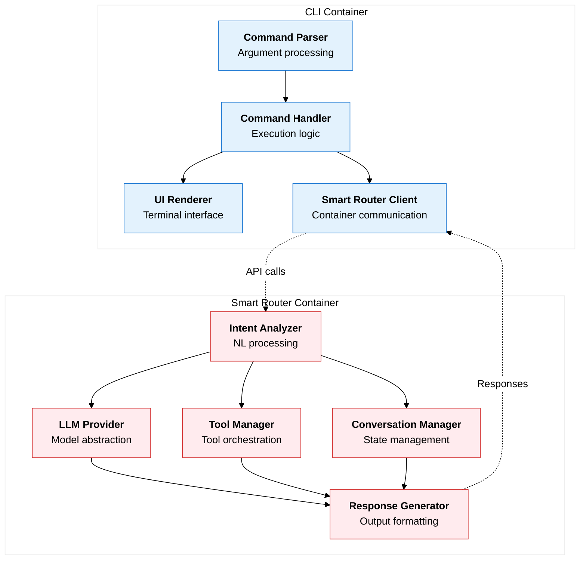

# Component Interface Contracts

This directory contains interface contract specifications for the internal components within each container, following C4 framework principles.

## Components Overview

### CLI Container Components

1. **[Command Parser Component](./command-parser.md)** - Argument parsing and validation
2. **[UI Renderer Component](./ui-renderer.md)** - Terminal output and interactive UI
3. **[Command Handler Component](./command-handler.md)** - Command execution logic
4. **[Smart Router Client Component](./smart-router-client.md)** - Communication with Smart Router

### Smart Router Container Components  

1. **[Intent Analyzer Component](./intent-analyzer.md)** - Natural language intent detection
2. **[LLM Provider Component](./llm-provider.md)** - Language model abstraction
3. **[Tool Manager Component](./tool-manager.md)** - Tool orchestration and execution
4. **[Conversation Manager Component](./conversation-manager.md)** - State and context management
5. **[Response Generator Component](./response-generator.md)** - Response formatting and streaming

## Component Architecture



## Interface Design Principles

### Single Responsibility
Each component has a single, well-defined responsibility:
- **Command Parser**: Only handles argument parsing
- **Intent Analyzer**: Only handles intent detection
- **Tool Manager**: Only handles tool execution

### Dependency Inversion
Components depend on abstractions, not concrete implementations:
```typescript
// Good: Depends on interface
class CommandHandler {
  constructor(private smartRouterClient: ISmartRouterClient) {}
}

// Bad: Depends on concrete implementation
class CommandHandler {
  constructor(private agentFactory: AgentFactory) {}
}
```

### Interface Segregation
Interfaces are focused and minimal:
```typescript
// Good: Focused interface
interface ICommandParser {
  parse(args: string[]): ParsedCommand;
}

// Bad: Kitchen sink interface
interface ICommandProcessor {
  parse(args: string[]): ParsedCommand;
  execute(command: ParsedCommand): void;
  render(result: any): void;
  cleanup(): void;
}
```

## Component Communication Patterns

### Synchronous Interfaces
For immediate operations:
```typescript
interface ICommandParser {
  parse(args: string[]): ParsedCommand;
  validate(command: ParsedCommand): ValidationResult;
}
```

### Asynchronous Interfaces
For I/O operations:
```typescript
interface ILLMProvider {
  generateResponse(prompt: string): Promise<LLMResponse>;
  streamResponse(prompt: string): AsyncIterableIterator<ResponseChunk>;
}
```

### Event-Driven Interfaces
For loose coupling:
```typescript
interface IToolManager extends EventEmitter {
  on('tool:start', (toolName: string) => void): void;
  on('tool:complete', (result: ToolResult) => void): void;
  on('tool:error', (error: ToolError) => void): void;
}
```

## Component Lifecycle

### Initialization
```typescript
interface IComponent {
  initialize(config: ComponentConfig): Promise<void>;
  isInitialized(): boolean;
}
```

### Health Monitoring
```typescript
interface IHealthMonitored {
  healthCheck(): Promise<HealthStatus>;
  getMetrics(): ComponentMetrics;
}
```

### Resource Management
```typescript
interface IDisposable {
  dispose(): Promise<void>;
  isDisposed(): boolean;
}
```

## Testing Contracts

### Mockable Interfaces
All component interfaces should be easily mockable:
```typescript
// Component can be easily mocked for testing
const mockLLMProvider: ILLMProvider = {
  generateResponse: jest.fn().mockResolvedValue(mockResponse),
  streamResponse: jest.fn().mockReturnValue(mockStream)
};
```

### Testable Behaviors
Components should expose testable behaviors:
```typescript
interface IIntentAnalyzer {
  // Testable: given input, verify output
  analyzeIntent(message: string): Promise<IntentResult>;
  
  // Testable: verify configuration affects behavior
  setConfidenceThreshold(threshold: number): void;
}
```

## Configuration Contracts

### Component Configuration
Each component defines its own configuration schema:
```typescript
interface CommandParserConfig {
  caseSensitive: boolean;
  allowUnknownOptions: boolean;
  exitOnError: boolean;
}

interface LLMProviderConfig {
  provider: 'ollama' | 'openai';
  model: string;
  temperature: number;
  timeout: number;
}
```

### Configuration Validation
Components should validate their configuration:
```typescript
interface IConfigurable<T> {
  validateConfig(config: T): ConfigValidationResult;
  updateConfig(config: Partial<T>): void;
}
```

## Error Handling Contracts

### Component-Specific Errors
Each component defines its own error types:
```typescript
enum CommandParserError {
  INVALID_SYNTAX = 'INVALID_SYNTAX',
  MISSING_REQUIRED = 'MISSING_REQUIRED',
  UNKNOWN_OPTION = 'UNKNOWN_OPTION'
}

enum LLMProviderError {
  CONNECTION_FAILED = 'CONNECTION_FAILED',
  MODEL_NOT_FOUND = 'MODEL_NOT_FOUND',
  RESPONSE_TIMEOUT = 'RESPONSE_TIMEOUT'
}
```

### Error Recovery
Components should provide recovery mechanisms:
```typescript
interface IRecoverable {
  canRecover(error: ComponentError): boolean;
  recover(error: ComponentError): Promise<RecoveryResult>;
}
```

## Usage Guidelines

### Component Design
- **Keep interfaces minimal** - Only expose what's necessary
- **Use composition over inheritance** - Combine components to build functionality
- **Design for testability** - Make components easy to mock and test
- **Handle errors gracefully** - Provide clear error messages and recovery options

### Implementation Flexibility
- **Multiple implementations** - Each interface can have multiple implementations
- **Runtime selection** - Choose implementation based on configuration
- **Gradual migration** - Replace implementations one at a time

### Documentation Standards
Each component contract should include:
- **Purpose** - What the component does
- **Interface** - Public API specification
- **Configuration** - Required and optional settings
- **Error handling** - Possible errors and recovery
- **Examples** - Usage examples and patterns