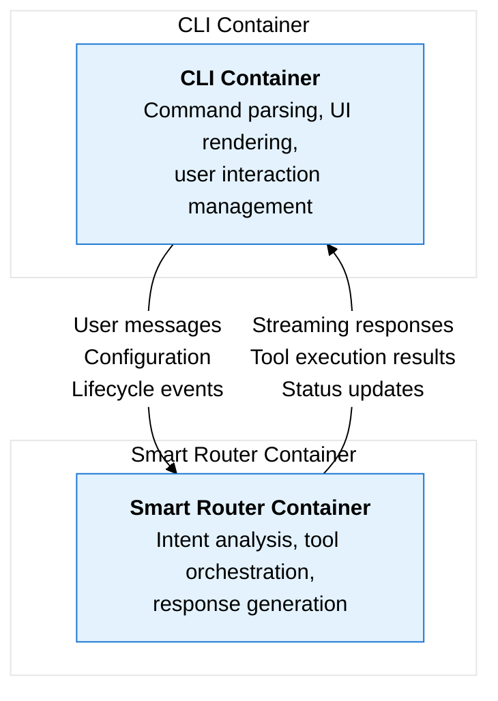

# Container Interface Contracts

This directory contains interface contract specifications for the two main containers in the qi-v2-agent system, following C4 framework principles.

## Containers Overview

The qi-v2-agent system consists of two primary containers:

1. **[CLI Container](./cli-container.md)** - Command-line interface and user interaction
2. **[Smart Router Container](./smart-router-container.md)** - Natural language processing and workflow orchestration

## Container Interaction

## Interface Contract Principles

Each container exposes:
- **Public APIs** - Well-defined interfaces for external communication
- **Configuration Contracts** - Expected configuration structure and validation
- **Event Contracts** - Lifecycle events and error handling
- **Data Contracts** - Message formats and data structures

## Usage

- **Container contracts** define what each container does and how they communicate
- **Component contracts** (in `../components/`) define internal implementation details
- **Architecture design** (in `../architecture/`) provides the overall system view

This separation allows for:
- **Container substitution** - Replace CLI or Smart Router with different implementations
- **Interface versioning** - Evolve contracts while maintaining compatibility  
- **Integration testing** - Test container interactions without implementation details
- **Documentation clarity** - Clear separation between what and how