# LangChain Component Tutorial

## Overview

This tutorial explores how LangChain operates as a foundational component in the qi-v2-agent system, focusing on its core abstractions, tool integration, and the transformation logic that distinguishes between simple prompts and workflow commands.

## What is LangChain?

LangChain is a framework for developing applications powered by language models. In qi-v2-agent, it provides:

- **LLM Abstraction**: Unified interface to different language models
- **Tool Integration**: Seamless function calling and tool execution
- **Message Handling**: Standardized message format and processing
- **Chain Composition**: Building complex workflows from simple components

## Core Architecture

### 1. Component Hierarchy


## Component Contracts

### 1. LLM Component

#### Interface Definition
```typescript
interface LLMInput {
  messages: Array<{
    role: 'user' | 'assistant' | 'system';
    content: string;
  }>;
  options?: {
    temperature?: number;
    maxTokens?: number;
    stop?: string[];
  };
}

interface LLMOutput {
  content: string;
  usage?: {
    promptTokens: number;
    completionTokens: number;
    totalTokens: number;
  };
}
```

#### Usage Example
```typescript
import { ChatOllama } from '@langchain/ollama';

// Initialize LLM component
const llm = new ChatOllama({
  model: 'qwen3:0.6b',
  temperature: 0.1,
  baseUrl: 'http://localhost:11434'
});

// Direct invocation
const response = await llm.invoke([
  { role: 'user', content: 'Hello, how are you?' }
]);

console.log(response.content);
// Output: "Hello! I'm doing well, thank you for asking. How can I assist you today?"
```

#### Streaming Example
```typescript
// Streaming response
const stream = await llm.stream([
  { role: 'user', content: 'Write a Python function for fibonacci' }
]);

for await (const chunk of stream) {
  process.stdout.write(chunk.content);
}
```

### 2. Tool Component

#### Tool Definition Contract
```typescript
interface ToolDefinition {
  name: string;
  description: string;
  schema: ZodSchema;
  func: (input: any) => Promise<string>;
}
```

#### Example Tool Implementation
```typescript
import { tool } from '@langchain/core/tools';
import { z } from 'zod';

const calculatorTool = tool(
  async ({ expression }) => {
    try {
      const result = eval(expression); // In practice, use safer evaluation
      return `The result is: ${result}`;
    } catch (error) {
      return `Error: ${error.message}`;
    }
  },
  {
    name: "calculator",
    description: "Perform mathematical calculations",
    schema: z.object({
      expression: z.string().describe("Mathematical expression to evaluate")
    })
  }
);
```

### 3. Message Processing

#### Message Flow Contract
```typescript
interface MessageFlow {
  input: HumanMessage;
  processing: Array<BaseMessage>;
  output: AIMessage;
}

// Example flow
const messageFlow = {
  input: new HumanMessage("write to file hello.py a hello world program"),
  processing: [
    new SystemMessage("You are a coding assistant with file operations"),
    new HumanMessage("write to file hello.py a hello world program"),
    new AIMessage("I'll help you create a hello world program", {
      tool_calls: [{
        name: "edit_files",
        args: { files: ["hello.py"], instruction: "hello world program" }
      }]
    })
  ],
  output: new AIMessage("✅ Successfully created hello.py with hello world program")
};
```

## Smart Routing Implementation

### 1. Intent Classification Logic

```typescript
class SmartRouter {
  private classifyIntent(message: string): 'prompt' | 'workflow' {
    const content = message.toLowerCase();
    
    // Workflow patterns
    const workflowKeywords = [
      'write to file',
      'create file', 
      'edit file',
      'analyze code',
      'explain code',
      'review code'
    ];
    
    // Check for workflow patterns
    const isWorkflow = workflowKeywords.some(keyword => 
      content.includes(keyword)
    );
    
    return isWorkflow ? 'workflow' : 'prompt';
  }
  
  async route(messages: BaseMessage[]): Promise<'direct_llm' | 'langgraph_agent'> {
    const latestMessage = messages[messages.length - 1];
    
    if (latestMessage instanceof HumanMessage) {
      const intent = this.classifyIntent(latestMessage.content);
      
      if (intent === 'workflow') {
        console.log('🔄 Routing to LangGraph agent (tools required)');
        return 'langgraph_agent';
      } else {
        console.log('💬 Routing to direct LLM (simple conversation)');
        return 'direct_llm';
      }
    }
    
    return 'direct_llm';
  }
}
```

### 2. Routing Examples

#### Example 1: Simple Prompt → Direct LLM

**Input**: `"hi"`

**Processing**:
```typescript
// 1. Intent classification
const intent = classifyIntent("hi"); // Returns: 'prompt'

// 2. Route to direct LLM
const response = await llm.invoke([
  { role: 'user', content: 'hi' }
]);

// 3. Direct response without tools
console.log(response.content);
// Output: "Hello! How can I assist you today? 😊"
```

**Flow Diagram**:


#### Example 2: Workflow Command → LangGraph Agent

**Input**: `"write to file foo.py a quicksort function in python"`

**Processing**:
```typescript
// 1. Intent classification
const intent = classifyIntent("write to file foo.py a quicksort function"); 
// Returns: 'workflow'

// 2. Route to LangGraph agent
const stream = await langGraphAgent.stream({
  messages: [{ role: 'user', content: userInput }]
});

// 3. LangGraph processes with tools
// - Calls edit_files tool
// - Generates Python code
// - Writes file to filesystem
// - Returns confirmation
```

**Flow Diagram**:


```mermaid
graph TD
    Input["write to file foo.py quicksort"] --> Classify[Intent: 'workflow']
    Classify --> LangGraph[LangGraph Agent]
    LangGraph --> ToolCall[edit_files Tool]
    ToolCall --> CodeGen[Generate Python Code]
    CodeGen --> FileWrite[Write to Filesystem]
    FileWrite --> Confirm["✅ File created successfully"]
    
    classDef workflow fill:#fff3e0,stroke:#f57c00
    class Input,Classify,LangGraph,ToolCall,CodeGen,FileWrite,Confirm workflow
```

## Detailed Component Examples

### 1. LLM Component Isolation

```typescript
// Pure LLM component usage (no tools, no routing)
class PureLLMExample {
  private llm: ChatOllama;
  
  constructor() {
    this.llm = new ChatOllama({
      model: 'qwen3:0.6b',
      temperature: 0.1
    });
  }
  
  async simpleConversation(userMessage: string): Promise<string> {
    const response = await this.llm.invoke([
      { 
        role: 'system', 
        content: 'You are a helpful AI assistant. Provide clear, concise responses.' 
      },
      { 
        role: 'user', 
        content: userMessage 
      }
    ]);
    
    return response.content;
  }
  
  async codeGeneration(prompt: string): Promise<string> {
    const response = await this.llm.invoke([
      { 
        role: 'system', 
        content: 'You are a programming assistant. Generate clean, working code without explanations.' 
      },
      { 
        role: 'user', 
        content: prompt 
      }
    ]);
    
    return response.content;
  }
}

// Usage examples
const llmExample = new PureLLMExample();

// Simple conversation
const greeting = await llmExample.simpleConversation("hi");
console.log(greeting); // "Hello! How can I help you today?"

// Code generation
const code = await llmExample.codeGeneration("Python quicksort function");
console.log(code); 
// Output: Clean Python quicksort implementation
```

### 2. Tool Component Isolation

```typescript
// Pure tool component usage (no LLM integration)
class PureToolExample {
  async demonstrateToolExecution() {
    // Create a simple tool
    const mathTool = tool(
      async ({ operation, a, b }) => {
        switch (operation) {
          case 'add': return `${a} + ${b} = ${a + b}`;
          case 'multiply': return `${a} × ${b} = ${a * b}`;
          default: return 'Unknown operation';
        }
      },
      {
        name: "math_calculator",
        description: "Perform basic math operations",
        schema: z.object({
          operation: z.enum(['add', 'multiply']),
          a: z.number(),
          b: z.number()
        })
      }
    );
    
    // Direct tool execution
    const result1 = await mathTool.func({
      operation: 'add',
      a: 15,
      b: 25
    });
    console.log(result1); // "15 + 25 = 40"
    
    const result2 = await mathTool.func({
      operation: 'multiply', 
      a: 7,
      b: 8
    });
    console.log(result2); // "7 × 8 = 56"
  }
}
```

### 3. Message Processing Pipeline

```typescript
class MessageProcessingExample {
  private processMessage(input: string): BaseMessage[] {
    // Convert string to LangChain message format
    const humanMessage = new HumanMessage(input);
    
    // Add system context
    const systemMessage = new SystemMessage(
      "You are qi-v2 agent, an AI coding assistant."
    );
    
    return [systemMessage, humanMessage];
  }
  
  private formatResponse(content: string): AIMessage {
    return new AIMessage(content);
  }
  
  async demonstrateMessageFlow() {
    // Input processing
    const userInput = "explain how quicksort works";
    const messages = this.processMessage(userInput);
    
    console.log('Processed messages:', messages);
    
    // Response formatting
    const responseContent = "Quicksort is a divide-and-conquer algorithm...";
    const aiResponse = this.formatResponse(responseContent);
    
    console.log('Formatted response:', aiResponse);
  }
}
```

## Component Integration Patterns

### 1. LLM + Tools Integration

```typescript
class LLMToolIntegration {
  private llm: ChatOllama;
  private tools: Tool[];
  
  constructor() {
    this.llm = new ChatOllama({ model: 'qwen3:0.6b' });
    this.tools = [
      this.createCalculatorTool(),
      this.createCodeGeneratorTool()
    ];
  }
  
  private createCalculatorTool() {
    return tool(
      async ({ expression }) => {
        // Safe evaluation logic here
        return `Result: ${eval(expression)}`;
      },
      {
        name: "calculator",
        description: "Evaluate mathematical expressions",
        schema: z.object({
          expression: z.string()
        })
      }
    );
  }
  
  private createCodeGeneratorTool() {
    return tool(
      async ({ language, description }) => {
        const prompt = `Generate ${language} code for: ${description}`;
        const response = await this.llm.invoke([
          { role: 'user', content: prompt }
        ]);
        return response.content;
      },
      {
        name: "code_generator",
        description: "Generate code in specified language",
        schema: z.object({
          language: z.string(),
          description: z.string()
        })
      }
    );
  }
  
  async processWithTools(userInput: string): Promise<string> {
    // Determine if tools are needed
    if (userInput.includes('calculate') || userInput.includes('math')) {
      const calculator = this.tools.find(t => t.name === 'calculator');
      const expression = this.extractExpression(userInput);
      return await calculator.func({ expression });
    }
    
    if (userInput.includes('code') || userInput.includes('program')) {
      const codeGen = this.tools.find(t => t.name === 'code_generator');
      const { language, description } = this.parseCodeRequest(userInput);
      return await codeGen.func({ language, description });
    }
    
    // Default to LLM response
    const response = await this.llm.invoke([
      { role: 'user', content: userInput }
    ]);
    return response.content;
  }
  
  private extractExpression(input: string): string {
    // Extract mathematical expression from user input
    const match = input.match(/calculate\s+(.+)/i);
    return match ? match[1] : '';
  }
  
  private parseCodeRequest(input: string): { language: string; description: string } {
    // Parse language and description from user input
    const languageMatch = input.match(/(python|javascript|java|c\+\+)\s+/i);
    const language = languageMatch ? languageMatch[1] : 'python';
    
    const description = input.replace(/generate|code|program|in\s+\w+/gi, '').trim();
    
    return { language, description };
  }
}
```

### 2. Chain Composition

```typescript
class ChainCompositionExample {
  private createAnalysisChain() {
    // Step 1: Intent analysis
    const intentStep = async (input: { message: string }) => {
      const intent = this.classifyIntent(input.message);
      return { ...input, intent };
    };
    
    // Step 2: Processing based on intent
    const processingStep = async (input: { message: string; intent: string }) => {
      if (input.intent === 'workflow') {
        return await this.processWorkflow(input.message);
      } else {
        return await this.processPrompt(input.message);
      }
    };
    
    // Step 3: Response formatting
    const formattingStep = async (input: { result: string }) => {
      return {
        response: input.result,
        timestamp: new Date().toISOString()
      };
    };
    
    return { intentStep, processingStep, formattingStep };
  }
  
  async demonstrateChain() {
    const chain = this.createAnalysisChain();
    
    // Execute chain
    const input = { message: "write to file test.py hello world" };
    
    const step1Result = await chain.intentStep(input);
    console.log('After intent analysis:', step1Result);
    
    const step2Result = await chain.processingStep(step1Result);
    console.log('After processing:', step2Result);
    
    const finalResult = await chain.formattingStep({ result: step2Result });
    console.log('Final result:', finalResult);
  }
  
  private classifyIntent(message: string): 'prompt' | 'workflow' {
    return message.includes('write to file') ? 'workflow' : 'prompt';
  }
  
  private async processWorkflow(message: string): Promise<string> {
    return "File operation completed";
  }
  
  private async processPrompt(message: string): Promise<string> {
    return "Conversational response";
  }
}
```

## Performance Characteristics

### Component Performance Comparison

| Component | Cold Start | Warm Response | Memory Usage | Best Use Case |
|-----------|------------|---------------|---------------|---------------|
| **Pure LLM** | 1-2s | 0.5-3s | Low | Simple conversations |
| **LLM + Tools** | 2-3s | 2-8s | Medium | Function calling |
| **Chain Composition** | 3-5s | 1-5s | Medium | Multi-step workflows |
| **Full LangGraph** | 4-6s | 3-15s | High | Complex reasoning |

### Optimization Strategies

```typescript
class PerformanceOptimization {
  private llmCache = new Map<string, string>();
  private toolCache = new Map<string, any>();
  
  async optimizedLLMCall(prompt: string): Promise<string> {
    // Cache frequent responses
    if (this.llmCache.has(prompt)) {
      return this.llmCache.get(prompt)!;
    }
    
    const response = await this.llm.invoke([
      { role: 'user', content: prompt }
    ]);
    
    this.llmCache.set(prompt, response.content);
    return response.content;
  }
  
  async batchToolExecution(tools: Array<{name: string, params: any}>): Promise<any[]> {
    // Execute multiple tools in parallel
    const promises = tools.map(({ name, params }) => {
      const tool = this.findTool(name);
      return tool.func(params);
    });
    
    return await Promise.all(promises);
  }
  
  private findTool(name: string): Tool {
    return this.tools.find(t => t.name === name)!;
  }
}
```

## Error Handling Patterns

### 1. LLM Error Handling

```typescript
class LLMErrorHandling {
  async safeInvoke(messages: BaseMessage[]): Promise<string> {
    try {
      const response = await this.llm.invoke(messages);
      return response.content;
    } catch (error) {
      if (error.message.includes('timeout')) {
        return 'I apologize, but I took too long to respond. Please try again.';
      } else if (error.message.includes('connection')) {
        return 'I\'m having trouble connecting. Please check your connection and try again.';
      } else {
        return 'I encountered an error processing your request. Please try rephrasing.';
      }
    }
  }
}
```

### 2. Tool Error Handling

```typescript
class ToolErrorHandling {
  async safeToolExecution(toolName: string, params: any): Promise<string> {
    try {
      const tool = this.findTool(toolName);
      const result = await tool.func(params);
      return result;
    } catch (error) {
      console.error(`Tool ${toolName} failed:`, error);
      
      // Provide graceful degradation
      if (toolName === 'edit_files') {
        return `❌ File operation failed: ${error.message}. Please check file permissions and path.`;
      } else if (toolName === 'analyze_code') {
        return `❌ Code analysis failed: ${error.message}. Please verify the file exists.`;
      } else {
        return `❌ Tool execution failed: ${error.message}`;
      }
    }
  }
}
```

## Best Practices

### 1. Component Design
- Keep components focused and single-purpose
- Use clear interfaces and type definitions
- Implement proper error handling and fallbacks
- Cache expensive operations when possible

### 2. Message Handling
- Standardize on LangChain message formats
- Preserve conversation context appropriately
- Handle different message types gracefully

### 3. Tool Integration
- Design tools to be composable and reusable
- Provide clear descriptions for automatic selection
- Handle tool failures gracefully with meaningful error messages

### 4. Performance
- Use appropriate caching strategies
- Batch operations when possible
- Monitor and optimize slow components
- Implement timeouts for long-running operations

This tutorial demonstrates how LangChain provides the foundational abstractions that enable the qi-v2-agent's smart routing between simple prompts and complex workflows, creating a seamless user experience regardless of query complexity.