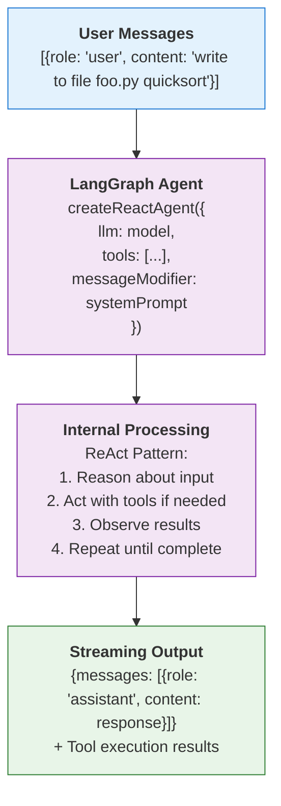
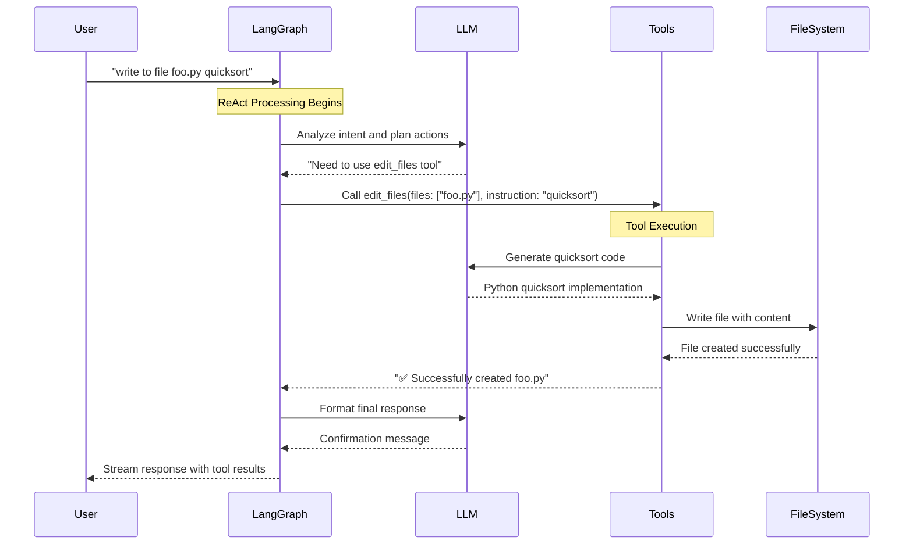

# LangGraph Component Tutorial

## Overview

This tutorial demonstrates how LangGraph operates as a pure component in the qi-v2-agent system, focusing on its contracts, inputs, outputs, and internal behavior without external dependencies.

## What is LangGraph?

LangGraph is a framework for building stateful, multi-actor applications with language models. It provides:

- **Cyclic Flows**: Create workflows that loop and branch based on conditions
- **Built-in Checkpointing**: Persist state between interactions 
- **Tool Integration**: Seamlessly integrate tools and function calling
- **Human-in-the-Loop**: Support for human intervention and approval
- **Streaming**: Real-time token and intermediate step streaming

## Core Concepts

### 1. Agent Architecture



### 2. Message Flow Contracts

#### Input Contract

```typescript
interface LangGraphInput {
  messages: Array<{
    role: 'user' | 'assistant' | 'system';
    content: string;
  }>;
}

interface LangGraphConfig {
  configurable?: {
    thread_id?: string;  // For conversation persistence
  };
  streamMode?: 'values' | 'updates';
  signal?: AbortSignal;  // For cancellation
}
```

#### Output Contract

```typescript
interface LangGraphOutput {
  messages: Array<{
    role: 'assistant';
    content: string;
    tool_calls?: Array<{
      id: string;
      type: 'function';
      function: {
        name: string;
        arguments: string;
      };
    }>;
  }>;
}
```

## Working Examples

### Example 1: Simple Chat (No Tools)

#### Input
```typescript
const input = {
  messages: [
    { role: 'user', content: 'hi' }
  ]
};

const config = {
  streamMode: 'values'
};
```

#### LangGraph Processing
1. **Analyze Intent**: "hi" is a simple greeting, no tools needed
2. **Generate Response**: Use LLM to create friendly response
3. **Return Result**: Single message response

#### Output
```typescript
{
  messages: [
    {
      role: 'assistant',
      content: 'Hello! How can I assist you today? 😊'
    }
  ]
}
```

### Example 2: Tool-Required Workflow

#### Input
```typescript
const input = {
  messages: [
    { 
      role: 'user', 
      content: 'write to file foo.py a quicksort function in python' 
    }
  ]
};
```

#### LangGraph Processing
1. **Analyze Intent**: "write to file" requires tools
2. **Plan Actions**: 
   - Generate Python quicksort code
   - Use file writing tool
3. **Execute Tools**: Call `edit_files` tool
4. **Generate Response**: Confirm completion

#### Output
```typescript
{
  messages: [
    {
      role: 'assistant',
      content: '✅ Successfully created foo.py with a quicksort function in Python',
      tool_calls: [
        {
          id: 'call_1234',
          type: 'function',
          function: {
            name: 'edit_files',
            arguments: '{"files": ["foo.py"], "instruction": "a quicksort function in python"}'
          }
        }
      ]
    }
  ]
}
```

## Detailed Component Behavior

### 1. Agent Initialization

```typescript
import { createReactAgent } from '@langchain/langgraph/prebuilt';
import { ChatOllama } from '@langchain/ollama';

// Component initialization
const llm = new ChatOllama({
  model: 'qwen3:0.6b',
  temperature: 0.1,
  baseUrl: 'http://localhost:11434'
});

const agent = createReactAgent({
  llm: llm,
  tools: [editFilesTool, analyzeCodeTool, explainConceptTool],
  messageModifier: `You are qi-v2 agent, an AI coding assistant.
  
  When users request file operations, use the appropriate tools:
  - edit_files: For creating, editing, or modifying files
  - analyze_code: For code analysis and complexity review
  - explain_concept: For explaining code or programming concepts
  
  For regular conversation, respond naturally without tools.`
});
```

### 2. Streaming Processing

```typescript
// Component usage
const stream = await agent.stream(
  { messages: inputMessages },
  { 
    streamMode: 'values',
    configurable: { thread_id: 'session-123' }
  }
);

// Process streaming chunks
for await (const chunk of stream) {
  if (chunk && chunk.messages && Array.isArray(chunk.messages)) {
    const lastMessage = chunk.messages[chunk.messages.length - 1];
    
    if (lastMessage && lastMessage.content) {
      // Stream token processing
      onToken?.(newToken);
    }
  }
}
```

### 3. Tool Integration Flow



## Smart Routing Logic

### Intent Detection Patterns

LangGraph uses the following decision matrix:

| User Input Pattern | Intent Classification | Action Taken |
|-------------------|----------------------|--------------|
| `"hi"`, `"hello"`, `"how are you"` | **Chat** | Direct LLM response |
| `"write to file X"`, `"create file Y"` | **File Operation** | Use `edit_files` tool |
| `"analyze code"`, `"check complexity"` | **Code Analysis** | Use `analyze_code` tool |
| `"explain X"`, `"how does Y work"` | **Educational** | Use `explain_concept` tool |

### Implementation Logic

```typescript
// Internal LangGraph reasoning process
function analyzeUserIntent(userMessage: string): 'chat' | 'file_operation' | 'analysis' | 'explanation' {
  const content = userMessage.toLowerCase();
  
  // File operation patterns
  if (content.includes('write to file') || 
      content.includes('create file') || 
      content.includes('save to')) {
    return 'file_operation';
  }
  
  // Analysis patterns
  if (content.includes('analyze') || 
      content.includes('complexity') || 
      content.includes('review')) {
    return 'analysis';
  }
  
  // Explanation patterns
  if (content.includes('explain') || 
      content.includes('how does') || 
      content.includes('what is')) {
    return 'explanation';
  }
  
  // Default to chat
  return 'chat';
}
```

## Performance Characteristics

### Response Times by Operation Type

| Operation Type | Tool Usage | Typical Response Time | Factors |
|---------------|------------|----------------------|---------|
| **Simple Chat** | None | 2-6 seconds | LLM model size, prompt complexity |
| **File Operations** | edit_files | 8-15 seconds | LLM generation + file I/O |
| **Code Analysis** | analyze_code | 10-20 seconds | File reading + analysis depth |
| **Explanations** | explain_concept | 5-12 seconds | Complexity of concept |

### Memory Usage

```typescript
// Memory management with checkpointing
const memorySaver = new MemorySaver();

const agent = createReactAgent({
  llm: llm,
  tools: tools,
  checkpointSaver: memorySaver  // Enables conversation persistence
});

// Each conversation thread maintains:
// - Message history
// - Tool execution results  
// - Intermediate reasoning steps
```

## Error Handling Patterns

### Tool Execution Failures

```typescript
// LangGraph handles tool failures gracefully
try {
  const toolResult = await executeTool(toolName, parameters);
  return formatSuccessResponse(toolResult);
} catch (error) {
  // LangGraph automatically retries or provides fallback
  return formatErrorResponse(error);
}
```

### Stream Completion Detection

```typescript
// Detecting when LangGraph completes processing
let streamCompleted = false;

const streamTimeout = setTimeout(() => {
  if (!streamCompleted) {
    console.warn('Stream timeout - forcing completion');
    streamCompleted = true;
    onComplete?.(currentResponse);
  }
}, 30000);

for await (const chunk of stream) {
  // Process chunks...
}

clearTimeout(streamTimeout);
streamCompleted = true;
```

## Configuration Options

### Agent Configuration

```typescript
interface ReactAgentConfig {
  llm: BaseLLM;                    // Language model instance
  tools: Tool[];                   // Available tools array
  messageModifier?: string;        // System prompt
  checkpointSaver?: CheckpointSaver; // For memory persistence
  interrupt?: string[];            // Breakpoints for human-in-loop
}
```

### Stream Configuration

```typescript
interface StreamConfig {
  streamMode: 'values' | 'updates'; // What to stream
  configurable?: {
    thread_id?: string;             // Conversation persistence
  };
  signal?: AbortSignal;             // Cancellation support
}
```

## Best Practices

### 1. Tool Design
- Keep tools focused and single-purpose
- Provide clear descriptions for intent detection
- Handle errors gracefully within tools
- Return descriptive success/failure messages

### 2. System Prompts
- Be explicit about tool usage patterns
- Provide examples of when to use each tool
- Include fallback instructions for edge cases

### 3. Streaming
- Always implement timeout handling
- Buffer tokens for smooth UI rendering
- Handle partial responses gracefully

### 4. Memory Management
- Use thread IDs for conversation persistence
- Clean up old conversations periodically
- Consider memory limits for long conversations

## Troubleshooting Common Issues

### Issue 1: Tools Not Being Called
**Symptom**: Agent responds with text instead of using tools
**Solution**: Improve tool descriptions and system prompt clarity

### Issue 2: Stream Hanging
**Symptom**: Stream never completes, UI shows "thinking" forever
**Solution**: Implement timeout handling with forced completion

### Issue 3: Tool Execution Errors
**Symptom**: Tools fail but agent doesn't recover
**Solution**: Add error handling within tools and return descriptive errors

### Issue 4: Memory Issues
**Symptom**: Conversation context lost between messages
**Solution**: Ensure consistent thread_id usage and checkpoint configuration

This tutorial provides the foundation for understanding how LangGraph operates as a component in the qi-v2-agent system, handling both simple conversations and complex tool-based workflows.