# Smart Routing: From Simple Prompts to Complex Workflows

## Overview

This document explains how the qi-v2-agent system's architectural design enables seamless transformation between simple conversational prompts (`"hi"`) and complex workflow commands (`"write to file foo.py for quicksort function in python"`). The key insight is that there is **no manual routing** - instead, LangChain's ReAct agent performs intelligent decision-making through system prompts and natural language understanding.

## The Problem: Unified Interface for Different Complexities

Users need a single interface that can handle:
- **Simple conversations**: `"hi"`, `"hello"`, `"how are you?"`
- **Complex workflows**: `"write to file foo.py quicksort"`, `"analyze code complexity"`

The challenge is enabling the system to automatically decide whether to respond directly or use tools, without forcing users to learn different commands or interfaces.

## Conceptual Architecture: Universal Message Handler


## Current Implementation: LangChain ReAct Agent


## The Real Implementation: System Prompt-Based Intelligence

### 1. No Manual Pattern Recognition

The system does **NOT** use keyword matching or manual classification. Instead, everything goes through LangChain's ReAct agent:

```typescript
// Location: lib/src/agent/unified-factory.ts
export class AgentFactory {
  async initialize(): Promise<void> {
    // ALL messages go to this single agent
    this.agent = createReactAgent({
      llm: this.llm.getModel(),
      tools: allTools,
      messageModifier: `You are qi-v2 agent, an AI coding assistant with access to powerful workflow tools.

You can handle two types of requests:

## 1. CODE GENERATION & PROGRAMMING HELP
For requests like "write a Python program", "create a function", "show me how to...", provide direct code solutions:
- Write complete, working code with examples
- Include explanations and comments
- Provide multiple approaches when helpful

## 2. FILE/PROJECT WORKFLOW OPERATIONS
Use tools for working with existing files and projects:

🔧 **edit_files** - Use when users want to modify existing files:
- "Fix the bug in auth.ts", "add error handling to utils.js"

📊 **analyze_code** - Use when users want insights about existing code:
- "analyze my code complexity", "review the architecture"

📚 **explain_concept** - Use when users want to understand existing code:
- "explain this function in main.py", "how does this algorithm work?"

**Examples:**
- "write a quicksort program" → Generate code directly (no tools needed)
- "fix the null check in auth.ts" → Use edit_files tool
- "analyze my project structure" → Use analyze_code tool`
    });
  }

  async chat(messages: AgentMessage[]): Promise<void> {
    // No routing logic - everything goes to LangChain agent
    const stream = await this.agent.stream(
      { messages: langchainMessages },
      { streamMode: 'values' }
    );
    // LangChain decides whether to use tools or respond directly
  }
}
```

### 2. LangChain's Decision Matrix

The ReAct agent uses the system prompt to automatically decide:

| Input Pattern | LLM Decision | Action Taken | Reasoning |
|---------------|--------------|--------------|-----------|
| `"hi"` | No tools needed | Direct response | Simple greeting, generate friendly response |
| `"write a quicksort program"` | No tools needed | Direct code generation | Code generation request, provide complete solution |
| `"fix the bug in auth.ts"` | Use edit_files tool | Tool execution | File modification request, use appropriate tool |
| `"analyze my code complexity"` | Use analyze_code tool | Tool execution | Code analysis request, tool provides insights |

## Detailed Flow Analysis

### Case 1: Simple Prompt - "hi"

#### LangChain Processing
```typescript
// All messages go through the same path
const userMessage = "hi";
const stream = await this.agent.stream(
  { messages: [{ role: 'user', content: 'hi' }] },
  { streamMode: 'values' }
);
// LangChain ReAct agent analyzes system prompt and decides no tools needed
```

#### LLM Decision Process
1. **Analyze System Prompt**: ReAct agent reads tool descriptions and examples
2. **Evaluate Input**: `"hi"` doesn't match any tool usage patterns
3. **Decision**: Respond directly without function calls
4. **Generate Response**: Create friendly greeting

#### Processing Flow


#### Actual Implementation
```typescript
// lib/src/agent/unified-factory.ts
async chat(messages: AgentMessage[]): Promise<void> {
  // Single path for ALL messages - no routing logic
  const stream = await this.agent.stream(
    { messages: langchainMessages },
    { streamMode: 'values' }
  );
  
  // LangChain's ReAct agent handles everything:
  // - Reads system prompt
  // - Analyzes user input
  // - Decides whether to use tools
  // - Executes tools or responds directly
  
  for await (const chunk of stream) {
    // Process response chunks (may include tool calls)
    if (chunk?.messages?.length > 0) {
      const lastMessage = chunk.messages[chunk.messages.length - 1];
      if (lastMessage.content) {
        onToken?.(newToken);
      }
    }
  }
}
```

### Case 2: Workflow Command - "write to file foo.py for quicksort function in python"

#### LangChain Processing  
```typescript
// Same exact code path as simple prompt!
const userMessage = "write to file foo.py for quicksort function in python";
const stream = await this.agent.stream(
  { messages: [{ role: 'user', content: userMessage }] },
  { streamMode: 'values' }
);
// LangChain ReAct agent analyzes and decides to use edit_files tool
```

#### LLM Decision Process
1. **Analyze System Prompt**: ReAct agent reads tool descriptions and examples
2. **Pattern Matching**: `"write to file"` matches edit_files tool examples
3. **Decision**: Use edit_files tool with appropriate parameters  
4. **Function Calling**: LangChain automatically calls the tool

#### Processing Flow


```mermaid
sequenceDiagram
    participant User
    participant ReActAgent
    participant LLM
    participant EditFilesTool
    participant FileSystem
    
    User->>ReActAgent: "write to file foo.py for quicksort function"
    Note over ReActAgent: Same entry point as simple messages
    ReActAgent->>LLM: Analyze input against system prompt
    LLM-->>ReActAgent: "This matches edit_files tool pattern"
    
    Note over ReActAgent: LangChain function calling begins
    ReActAgent->>EditFilesTool: call edit_files({files: ["foo.py"], instruction: "quicksort"})
    
    Note over EditFilesTool: Tool executes LLM + MCP operations
    EditFilesTool->>LLM: Generate Python quicksort code
    LLM-->>EditFilesTool: Complete implementation
    EditFilesTool->>FileSystem: Write foo.py via MCP
    FileSystem-->>EditFilesTool: File created successfully
    
    EditFilesTool-->>ReActAgent: "✅ Successfully created foo.py with quicksort"
    ReActAgent-->>User: Stream final response
    
    Note over User,FileSystem: Total time: ~8-15 seconds
    
    %%{wrap}%%
    %%{config: {"theme": "base", "themeVariables": {"primaryTextColor": "#000"}}}%%
```

## The Transformation Logic: Why This Works

### 1. Single Universal Interface

LangChain's ReAct agent provides a unified processing layer that handles everything:
- **Intent Detection**: LLM analyzes system prompt against user input
- **Tool Selection**: Automatic function calling based on pattern matching  
- **Execution Strategy**: Direct response or tool orchestration as needed

### 2. System Prompt as "Routing Rules"

The `messageModifier` acts as intelligent routing instructions:

```typescript
messageModifier: `You are qi-v2 agent, an AI coding assistant...

## 1. CODE GENERATION & PROGRAMMING HELP
For requests like "write a Python program", provide direct code solutions:
- Write complete, working code with examples

## 2. FILE/PROJECT WORKFLOW OPERATIONS  
Use tools for working with existing files:

🔧 **edit_files** - Use when users want to modify existing files:
- "Fix the bug in auth.ts", "add error handling to utils.js"

**Examples:**
- "write a quicksort program" → Generate code directly (no tools needed)
- "fix the null check in auth.ts" → Use edit_files tool`
```

### 3. Progressive Complexity Through Function Calling

```typescript
// The LLM automatically escalates complexity as needed:

// Level 1: Direct LLM Response (fastest, simplest)
"hi" → ReAct decides: no tools → Direct response → "Hello!"

// Level 2: LLM + Single Tool (moderate complexity)  
"write to file" → ReAct decides: edit_files → Function call → File created

// Level 3: LLM + Multiple Tools (highest complexity)
"analyze and refactor code" → ReAct decides: analyze_code + edit_files → Chain execution
```

### 4. Transparent Complexity Scaling

From the user's perspective, both requests use identical syntax:
```bash
# Simple conversation
echo "hi" | bun --cwd app src/main.ts unified

# Complex workflow  
echo "write to file foo.py quicksort" | bun --cwd app src/main.ts unified
```

The complexity scaling is handled transparently by LangChain's ReAct pattern.

## Performance Implications

### Response Time Characteristics

| Request Type | Processing Path | Typical Response Time | Factors |
|--------------|----------------|----------------------|---------|
| **Simple Prompt** | Direct LLM | 2-3 seconds | LLM model size only |
| **Single Tool Workflow** | LangGraph + 1 Tool | 8-15 seconds | LLM + tool execution |
| **Multi-Tool Workflow** | LangGraph + N Tools | 15-30 seconds | LLM + sequential tool calls |

### Memory Usage

```typescript
// Direct LLM: Minimal memory overhead
const directMemory = {
  messages: inputMessages,      // ~1-5KB
  response: llmResponse        // ~1-10KB
};

// LangGraph Agent: Higher memory overhead
const agentMemory = {
  messages: inputMessages,      // ~1-5KB
  toolDefinitions: tools,       // ~10-50KB
  intermediateSteps: reasoning, // ~5-20KB
  toolResults: results,        // ~1-100KB (varies by tool)
  checkpointData: state        // ~10-100KB
};
```

## Error Handling Strategy

### 1. LangChain's Built-in Resilience

```typescript
// No manual error handling needed - LangChain ReAct handles failures
export class AgentFactory {
  async chat(messages: AgentMessage[]): Promise<void> {
    try {
      // Single entry point - LangChain handles all error scenarios
      const stream = await this.agent.stream(
        { messages: langchainMessages },
        { streamMode: 'values' }
      );
      
      // LangChain automatically:
      // - Retries failed tool calls
      // - Falls back to direct responses if tools fail
      // - Handles malformed function calls gracefully
      
    } catch (error) {
      // Only handle complete system failures
      onError?.(error);
    }
  }
}
```

### 2. Tool Execution Failures

```typescript
// LangChain ReAct automatically provides fallback responses
// Example: If edit_files tool fails, the agent responds with:

const autoFallbackResponse = `
❌ I encountered an issue creating the file directly. 
Let me provide you with the quicksort code instead:

\`\`\`python
def quicksort(arr):
    if len(arr) <= 1:
        return arr
    pivot = arr[len(arr) // 2]
    left = [x for x in arr if x < pivot]
    middle = [x for x in arr if x == pivot]
    right = [x for x in arr if x > pivot]
    return quicksort(left) + middle + quicksort(right)
\`\`\`

You can save this to foo.py manually.
`;
```

## Configuration and Customization

### 1. System Prompt Tuning

The "routing" is controlled entirely through the system prompt:

```typescript
// Modify tool usage patterns in messageModifier
messageModifier: `You are qi-v2 agent, an AI coding assistant...

🔧 **edit_files** - Use when users want to CREATE or MODIFY files:
- "write to file X", "create file Y", "save code to Z"
- "fix bug in auth.ts", "add error handling to utils.js"
- "refactor the login function"

📊 **analyze_code** - Use when users want CODE INSIGHTS:
- "analyze complexity", "review architecture"  
- "check dependencies", "audit security"

📚 **explain_concept** - Use when users want UNDERSTANDING:
- "explain this function", "how does X work?"
- "walk through the algorithm"

**Critical Examples:**
- "write a quicksort program" → Code generation (NO TOOLS)
- "write quicksort to foo.py" → File creation (USE edit_files)
- "explain quicksort" → Educational (USE explain_concept)`
```

### 2. Model Configuration

```yaml
# config/qi-config.yaml
model:
  name: "qwen3:0.6b"        # Same model for all operations
  temperature: 0.1          # Low temperature for consistent tool selection
  baseUrl: "http://localhost:11434"
```

## Best Practices

### 1. System Prompt Design
- Use clear, unambiguous examples in tool descriptions
- Provide explicit negative examples (when NOT to use tools)
- Test edge cases regularly with the LLM

### 2. Tool Organization
- Keep tool descriptions focused and specific
- Use consistent naming patterns across tools
- Provide multiple example patterns for each tool

### 3. Performance Optimization
- Use appropriate temperature settings (0.1 for consistent tool selection)
- Monitor tool usage patterns and adjust descriptions
- Implement timeout handling for long-running operations

### 4. User Experience
- The LLM provides automatic feedback about tool usage
- No need for explicit "routing" messages to users
- LangChain handles progress and error communication

## Key Architectural Insights

### 1. No Manual Routing Required
```typescript
// The elegance is in the simplicity:
async chat(messages: AgentMessage[]): Promise<void> {
  // Single line does everything - LangChain handles all complexity
  const stream = await this.agent.stream({ messages }, { streamMode: 'values' });
}
```

### 2. System Prompt as Intelligence
The `messageModifier` is the entire "routing engine":
- Tool selection logic
- Usage pattern recognition  
- Error handling instructions
- Response formatting rules

### 3. LLM as Universal Router
Instead of code-based pattern matching, the LLM itself:
- Reads tool descriptions
- Analyzes user input
- Makes function calling decisions
- Handles edge cases naturally

## Conclusion

The qi-v2-agent's approach to handling diverse user requests demonstrates the power of LangChain's ReAct pattern combined with carefully crafted system prompts. The key architectural insight is:

**There is no "smart routing" code** - instead, the LLM itself serves as an intelligent router through:

- **Single Entry Point**: All messages flow through `agent.stream()`
- **System Prompt Intelligence**: Tool descriptions and examples guide LLM decisions  
- **Automatic Function Calling**: LangChain handles tool selection and execution
- **Natural Fallbacks**: Built-in error handling and response generation

This creates a system that provides:

- **Simplicity**: One code path handles all complexity levels
- **Reliability**: LangChain's proven ReAct pattern with automatic fallbacks
- **Extensibility**: Adding new tools only requires updating the system prompt  
- **Performance**: Direct LLM responses for simple cases, tools only when needed

The **transformation** from simple prompts to complex workflows happens entirely within the LLM's reasoning process, guided by system prompt instructions. This eliminates manual pattern matching code while providing more intelligent and context-aware routing decisions.