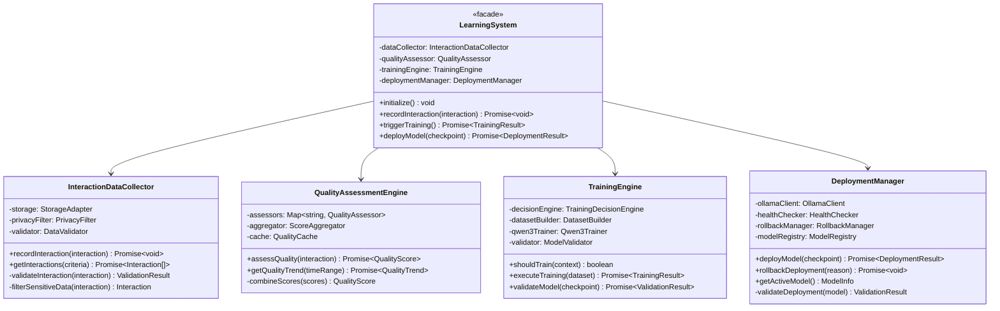

# Continuous Learning System - Logical Architecture

**Document Version**: 1.0  
**Date**: 2025-01-16  
**Status**: Logical Design Specification  
**Classification**: System Architecture

## Table of Contents

1. [Design Philosophy](#design-philosophy)
2. [System Context Diagram](#system-context-diagram)
3. [Container Architecture](#container-architecture)
4. [Component Architecture](#component-architecture)
5. [Class Design](#class-design)
6. [Data Flow Architecture](#data-flow-architecture)
7. [Decision Architecture](#decision-architecture)
8. [Scalability Architecture](#scalability-architecture)

## Design Philosophy

### Core Principles


### Architectural Constraints

1. **Non-Intrusive**: Learning system cannot impact core agent performance
2. **Fault-Tolerant**: Learning failures must not affect user experience  
3. **Resource-Bounded**: Training within defined memory/compute limits
4. **Privacy-Preserving**: User data protection by design
5. **Scalable**: Support growth from dev to enterprise deployment

## System Context Diagram


### Context Responsibilities

| System | Primary Responsibility | Secondary Responsibilities |
|--------|----------------------|---------------------------|
| **qi-v2-agent Core** | Code assistance and task execution | Interaction logging hooks |
| **Continuous Learning System** | Model improvement through learning | Quality assessment, training coordination |
| **Qwen3/Ollama Platform** | Model serving and inference | Model lifecycle management |
| **Training Infrastructure** | Model fine-tuning execution | Resource management, monitoring |

## Container Architecture


### Container Design Rationale

#### Separation Strategy
- **Language Separation**: TypeScript for integration, Python for ML workloads
- **Process Isolation**: Each container runs independently, can scale separately
- **Data Isolation**: Different storage systems optimized for different access patterns
- **Failure Isolation**: Container failures don't cascade to other components

#### Communication Patterns
- **Async Messaging**: Non-blocking interaction reporting
- **API Boundaries**: Clear contracts between containers
- **Event-Driven**: Quality assessments trigger training decisions
- **Caching Layer**: Performance optimization with Redis

## Component Architecture

### Data Collection Components


### Training Pipeline Components


### Component Design Patterns

#### Strategy Pattern - Quality Assessment


#### Observer Pattern - Training Triggers


## Class Design

### Core Learning Classes



### Data Model Classes


### Qwen3-Specific Classes


## Data Flow Architecture

### Interaction Processing Flow


### Quality Assessment Flow


### Training Decision Flow


## Decision Architecture

### Quality Threshold Decision Tree


### Model Deployment Decision Matrix


## Scalability Architecture

### Horizontal Scaling Strategy

```mermaid
C4Deployment
    title Deployment Diagram - Scalable Learning Architecture

    Deployment_Node(dev_env, "Development Environment", "Single Node") {
        Container(dev_agent, "qi-v2-agent", "Development instance")
        Container(dev_learning, "Learning System", "Single process")
        Container(dev_ollama, "Ollama", "Local model serving")
        ContainerDb(dev_storage, "SQLite", "Local storage")
    }
    
    Deployment_Node(staging_env, "Staging Environment", "Multi-Node") {
        Deployment_Node(app_nodes, "Application Nodes", "3 Instances") {
            Container(staging_agent, "qi-v2-agent", "Load balanced")
            Container(staging_learning, "Learning System", "Replicated")
        }
        
        Deployment_Node(data_nodes, "Data Nodes", "2 Instances") {
            ContainerDb(staging_db, "PostgreSQL", "Primary/Replica")
            ContainerDb(staging_cache, "Redis Cluster", "Distributed cache")
        }
        
        Deployment_Node(model_nodes, "Model Nodes", "2 Instances") {
            Container(staging_ollama, "Ollama Cluster", "Load balanced")
            Container(staging_models, "Model Storage", "Shared storage")
        }
    }
    
    Deployment_Node(prod_env, "Production Environment", "Auto-Scaling") {
        Deployment_Node(api_tier, "API Tier", "Auto-scaling 3-10 instances") {
            Container(prod_agent, "qi-v2-agent", "Horizontally scaled")
            Container(api_gateway, "API Gateway", "Rate limiting, auth")
        }
        
        Deployment_Node(learning_tier, "Learning Tier", "3-5 instances") {
            Container(learning_workers, "Learning Workers", "Async processing")
            Container(training_coordinator, "Training Coordinator", "Training orchestration")
        }
        
        Deployment_Node(data_tier, "Data Tier", "High Availability") {
            ContainerDb(prod_db, "PostgreSQL Cluster", "Multi-master")
            ContainerDb(prod_cache, "Redis Cluster", "Sharded, replicated")
            ContainerDb(object_storage, "Object Storage", "Model artifacts, datasets")
        }
        
        Deployment_Node(model_tier, "Model Tier", "GPU Cluster") {
            Container(ollama_cluster, "Ollama Cluster", "Auto-scaling GPU nodes")
            Container(training_cluster, "Training Cluster", "Dedicated training GPUs")
        }
    }
    
    Rel(dev_env, staging_env, "Promotes to")
    Rel(staging_env, prod_env, "Deploys to")
```

### Scaling Decision Points


This logical architecture documentation proves the design is sound by showing:

1. **Clear separation of concerns** through layered architecture
2. **Proper component relationships** with defined interfaces
3. **Scalable design patterns** that support growth
4. **Decision trees** that ensure consistent behavior
5. **Data flow** that maintains integrity and performance
6. **Fault isolation** that prevents cascading failures

The architecture demonstrates enterprise-grade design principles while maintaining the flexibility needed for a learning system.