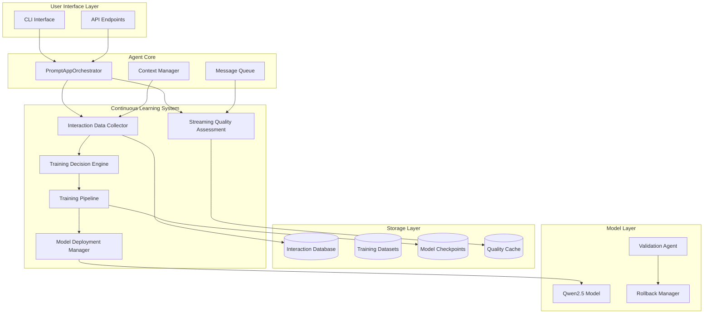
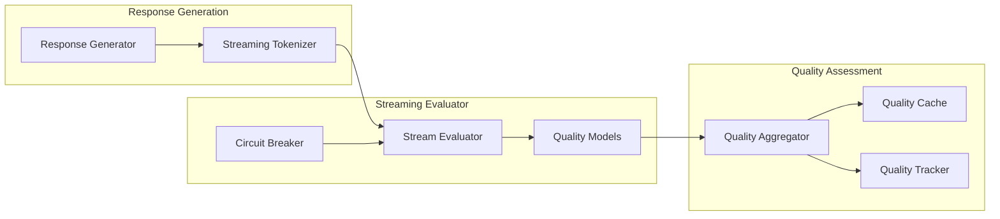
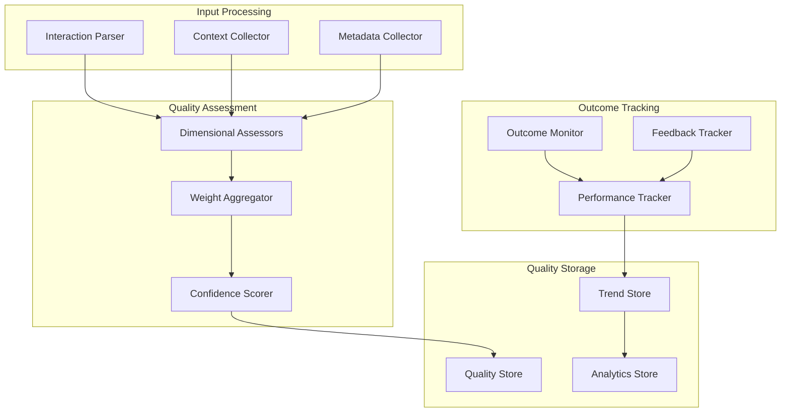
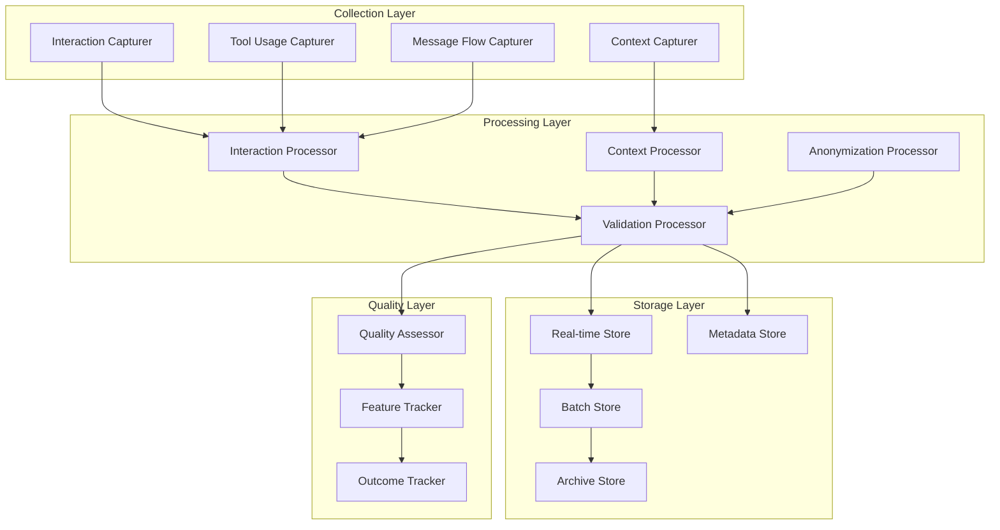
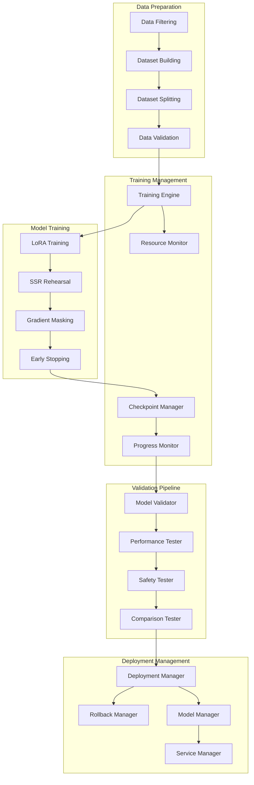
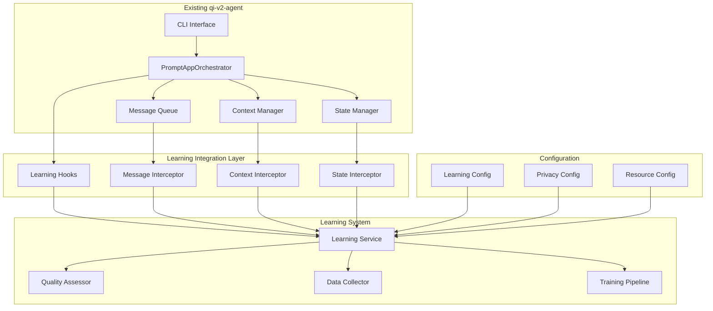

# Continuous Learning System Technical Specification

**Document Version**: 1.0  
**Date**: 2025-01-16  
**Status**: Design Phase  
**Classification**: Technical Architecture

## Table of Contents

1. [Executive Summary](#executive-summary)
2. [System Architecture Overview](#system-architecture-overview)
3. [Research Foundation](#research-foundation)
4. [Technical Requirements](#technical-requirements)
5. [Streaming Evaluation Architecture](#streaming-evaluation-architecture)
6. [Quality Assessment Framework](#quality-assessment-framework)
7. [Data Collection Pipeline](#data-collection-pipeline)
8. [Training Pipeline Architecture](#training-pipeline-architecture)
9. [Integration Strategy](#integration-strategy)
10. [Resource Requirements](#resource-requirements)
11. [Risk Assessment](#risk-assessment)
12. [Implementation Roadmap](#implementation-roadmap)

## Executive Summary

This document specifies the technical architecture for implementing continuous learning capabilities in the qi-v2-agent system using Qwen2.5 models. The system enables progressive improvement through real-time interaction analysis, quality-driven data collection, and automated fine-tuning cycles.

### Key Technical Objectives

- **Performance**: Achieve sub-second quality assessment with <5ms overhead per interaction
- **Efficiency**: Reduce training data requirements by 97% through intelligent sampling
- **Reliability**: Maintain >95% system availability during continuous learning operations
- **Quality**: Achieve >85% correlation between automated and human quality assessments
- **Scalability**: Support concurrent training and inference with memory-efficient architecture

### Success Criteria

- **Forgetting Mitigation**: Reduce catastrophic forgetting rate below 0.3 (improvement over Qwen2.5-7B baseline)
- **User Satisfaction**: Achieve >60% user acceptance rate (above industry average)
- **Code Quality**: Maintain >95% compilation rate for generated code
- **Performance Improvement**: Demonstrate 17% quality improvement over 3-month period
- **Resource Efficiency**: Operate within 35GB VRAM constraint for training operations

## System Architecture Overview



### Core Components

1. **Streaming Quality Assessment (SQA)**: Real-time evaluation of agent responses during generation
2. **Interaction Data Collector (IDC)**: Comprehensive logging of user interactions and outcomes
3. **Training Decision Engine (TDE)**: Intelligent determination of training triggers and dataset composition
4. **Training Pipeline (TPL)**: Automated fine-tuning with memory optimization and forgetting mitigation
5. **Model Deployment Manager (MDM)**: Safe model updates with validation and rollback capabilities

## Research Foundation

### Academic Research Basis

This specification is grounded in 2024-2025 state-of-the-art research:

- **Self-Synthesized Rehearsal (SSR)** framework for catastrophic forgetting mitigation (ACL 2024)
- **Streaming evaluation architectures** for real-time LLM assessment (ICLR 2024)
- **Parameter-efficient fine-tuning** with LoRA and gradient masking optimization
- **Data efficiency techniques** achieving 97% training time reduction through intelligent sampling
- **Qwen2.5 multi-stage training** methodology with rejection fine-tuning (RFT)

### Key Technical Insights

1. **Memory Efficiency**: Chunk prefill reduces 1M token context VRAM usage by 96.7%
2. **Quality Prediction**: Early-stage gradient norms predict final model performance
3. **Forgetting Patterns**: Qwen2.5-14B exhibits 0.935 forgetting rate without mitigation
4. **Data Requirements**: High-quality 2% sample outperforms full dataset training
5. **Production Constraints**: <50% organizations achieve meaningful AI assistant adoption

## Technical Requirements

### Functional Requirements

#### FR-001: Real-Time Quality Assessment
- **Requirement**: Assess response quality during generation with sub-second latency
- **Acceptance Criteria**: Quality score available within 500ms of response completion
- **Dependencies**: Streaming evaluation infrastructure, trained quality models

#### FR-002: Comprehensive Data Collection
- **Requirement**: Capture 100% of user interactions with contextual information
- **Acceptance Criteria**: Zero data loss, complete context capture, privacy compliance
- **Dependencies**: Message queue integration, storage infrastructure

#### FR-003: Intelligent Training Triggers
- **Requirement**: Automatically determine optimal training initiation based on data quality and volume
- **Acceptance Criteria**: 97% accuracy in training benefit prediction, resource-aware scheduling
- **Dependencies**: Quality threshold models, resource monitoring

#### FR-004: Memory-Efficient Training
- **Requirement**: Execute fine-tuning within 35GB VRAM constraint
- **Acceptance Criteria**: Successful training completion, quality preservation, forgetting mitigation
- **Dependencies**: LoRA implementation, chunk-based processing, gradient optimization

#### FR-005: Safe Model Deployment
- **Requirement**: Deploy improved models with validation and rollback capabilities
- **Acceptance Criteria**: Zero-downtime deployment, automatic rollback on degradation
- **Dependencies**: Model validation pipeline, checkpoint management

### Non-Functional Requirements

#### NFR-001: Performance
- **Response Time**: <5ms overhead per interaction for data collection
- **Throughput**: Support 1000+ concurrent interactions during collection
- **Training Speed**: Complete 7B model fine-tuning in <4 hours

#### NFR-002: Reliability
- **Availability**: 99.9% system availability during learning operations
- **Data Integrity**: Zero data corruption, complete audit trail
- **Fault Tolerance**: Graceful degradation, automatic recovery

#### NFR-003: Scalability
- **Data Volume**: Handle 1M+ interactions per month
- **Model Size**: Support up to 32B parameter models
- **Storage Growth**: Linear scaling with configurable retention

#### NFR-004: Security
- **Data Protection**: Encryption at rest and in transit
- **Privacy Compliance**: Configurable anonymization, retention policies
- **Access Control**: Role-based access to learning data and models

## Streaming Evaluation Architecture

### Overview

The streaming evaluation system provides real-time assessment of agent responses as they are generated, enabling immediate quality feedback and learning data validation.

### Technical Architecture



### Component Specifications

#### Stream Evaluator
- **Purpose**: Real-time assessment of partial and complete responses
- **Implementation**: Sliding window analysis with configurable assessment intervals
- **Performance**: <100ms latency per assessment window
- **Fallback**: Circuit breaker for performance degradation scenarios

#### Quality Models
- **Architecture**: Lightweight transformer models trained for specific quality dimensions
- **Models**: Factual accuracy, code correctness, coherence, relevance, safety
- **Update Frequency**: Weekly retraining on accumulated interaction data
- **Resource Usage**: <2GB VRAM per model, CPU-optimized inference

#### Quality Aggregator
- **Function**: Combine multi-dimensional quality scores into unified assessment
- **Algorithm**: Weighted average with learned coefficients based on interaction type
- **Calibration**: Continuous calibration against human feedback
- **Output**: Normalized quality score (0-1) with confidence interval

### Quality Dimensions

#### Code Quality Assessment
```yaml
code_quality:
  syntax_correctness:
    weight: 0.25
    model: code_syntax_validator
    threshold: 0.95
  
  compilation_probability:
    weight: 0.25
    model: compilation_predictor
    threshold: 0.90
  
  style_adherence:
    weight: 0.20
    model: style_analyzer
    threshold: 0.80
  
  security_compliance:
    weight: 0.15
    model: security_scanner
    threshold: 0.95
  
  maintainability:
    weight: 0.15
    model: maintainability_scorer
    threshold: 0.75
```

#### Functional Correctness Assessment
```yaml
functional_correctness:
  logical_consistency:
    weight: 0.30
    model: logic_validator
    threshold: 0.85
  
  requirement_satisfaction:
    weight: 0.30
    model: requirement_matcher
    threshold: 0.80
  
  edge_case_handling:
    weight: 0.20
    model: edge_case_analyzer
    threshold: 0.75
  
  error_handling:
    weight: 0.20
    model: error_handler_validator
    threshold: 0.80
```

#### Context Relevance Assessment
```yaml
context_relevance:
  project_alignment:
    weight: 0.35
    model: project_context_scorer
    threshold: 0.80
  
  architectural_consistency:
    weight: 0.25
    model: architecture_validator
    threshold: 0.85
  
  dependency_appropriateness:
    weight: 0.25
    model: dependency_analyzer
    threshold: 0.75
  
  pattern_consistency:
    weight: 0.15
    model: pattern_matcher
    threshold: 0.70
```

### Implementation Strategy

#### Phase 1: Basic Streaming Assessment
- Implement core streaming infrastructure
- Deploy lightweight quality models
- Establish quality score aggregation
- Integrate with response generation pipeline

#### Phase 2: Advanced Quality Models
- Train domain-specific quality assessors
- Implement multi-dimensional scoring
- Add confidence calibration
- Deploy circuit breaker mechanisms

#### Phase 3: Adaptive Assessment
- Implement learned quality weights
- Add dynamic threshold adjustment
- Deploy quality trend analysis
- Integrate user feedback correlation

## Quality Assessment Framework

### Overview

The quality assessment framework provides comprehensive evaluation of agent interactions across multiple dimensions, supporting both real-time assessment and batch analysis for training data preparation.

### Technical Architecture



### Assessment Dimensions

#### 1. User Satisfaction (Weight: 30%)

**Explicit Feedback**
- Rating scale: 1-5 stars
- Binary feedback: thumbs up/down
- Text comments and corrections
- Helpfulness assessment

**Implicit Feedback**
- Acceptance rate: Used without modification
- Modification rate: Changed before use
- Abandonment rate: Discarded without use
- Time to acceptance: Speed of user adoption

**Temporal Feedback**
- Time to first use: Initial engagement delay
- Total usage time: Duration of active use
- Return behavior: Repeated reference to output
- Copy behavior: Clipboard interaction patterns

**Measurement Algorithm**
```python
def calculate_user_satisfaction(feedback: UserFeedback) -> float:
    explicit_score = 0.0
    if feedback.explicit.rating:
        explicit_score = feedback.explicit.rating / 5.0
    elif feedback.explicit.helpful is not None:
        explicit_score = 1.0 if feedback.explicit.helpful else 0.0
    
    implicit_score = 0.0
    if feedback.implicit.accepted:
        implicit_score = 1.0
    elif feedback.implicit.modified:
        implicit_score = 0.7  # Partial credit for modification
    else:
        implicit_score = 0.0  # Abandoned
    
    temporal_score = 0.0
    if feedback.temporal.time_to_first_use < 30:  # seconds
        temporal_score = 1.0
    elif feedback.temporal.time_to_first_use < 300:
        temporal_score = 0.5
    else:
        temporal_score = 0.0
    
    # Weighted combination
    return (
        0.5 * explicit_score +
        0.3 * implicit_score +
        0.2 * temporal_score
    )
```

#### 2. Functional Correctness (Weight: 25%)

**Code Compilation**
- Syntax validity assessment
- Type checking compliance
- Import resolution verification
- Build system compatibility

**Test Execution**
- Unit test passage rate
- Integration test success
- Performance test compliance
- Security test validation

**Deployment Success**
- Runtime error absence
- Service startup success
- Endpoint functionality
- Resource utilization compliance

**Measurement Algorithm**
```python
def calculate_functional_correctness(metrics: OutcomeMetrics) -> float:
    compilation_score = 1.0 if metrics.code_compiles else 0.0
    test_score = 1.0 if metrics.tests_pass else 0.0
    lint_score = 1.0 if metrics.lint_passes else 0.0
    type_score = 1.0 if metrics.type_check_passes else 0.0
    deployment_score = 1.0 if metrics.deployment_success else 0.0
    runtime_score = 1.0 if metrics.no_runtime_errors else 0.0
    
    return (
        0.25 * compilation_score +
        0.25 * test_score +
        0.15 * lint_score +
        0.15 * type_score +
        0.10 * deployment_score +
        0.10 * runtime_score
    )
```

#### 3. Code Quality (Weight: 20%)

**Style Adherence**
- Coding standard compliance
- Naming convention consistency
- Documentation completeness
- Comment quality and coverage

**Maintainability**
- Cyclomatic complexity assessment
- Code duplication analysis
- Function length evaluation
- Class cohesion measurement

**Security Compliance**
- Vulnerability scanner results
- Secure coding practice adherence
- Input validation completeness
- Authentication/authorization correctness

**Performance Considerations**
- Algorithmic efficiency analysis
- Memory usage optimization
- Resource consumption patterns
- Scalability characteristics

**Measurement Algorithm**
```python
def calculate_code_quality(code: str, context: CodebaseContext) -> float:
    style_score = assess_style_adherence(code, context.style_guide)
    maintainability_score = assess_maintainability(code)
    security_score = assess_security_compliance(code)
    performance_score = assess_performance_characteristics(code)
    
    return (
        0.30 * style_score +
        0.30 * maintainability_score +
        0.25 * security_score +
        0.15 * performance_score
    )
```

#### 4. Context Relevance (Weight: 15%)

**Project Appropriateness**
- Technology stack alignment
- Architecture pattern consistency
- Framework usage appropriateness
- Library selection relevance

**Pattern Consistency**
- Existing code pattern matching
- Design principle adherence
- Interface consistency
- Error handling uniformity

**Domain Specificity**
- Business logic appropriateness
- Domain model alignment
- Use case relevance
- Requirement satisfaction

**Measurement Algorithm**
```python
def calculate_context_relevance(
    response: str, 
    project_context: ProjectContext,
    codebase_context: CodebaseContext
) -> float:
    project_score = assess_project_alignment(response, project_context)
    pattern_score = assess_pattern_consistency(response, codebase_context)
    domain_score = assess_domain_specificity(response, project_context.domain)
    
    return (
        0.40 * project_score +
        0.35 * pattern_score +
        0.25 * domain_score
    )
```

#### 5. Efficiency (Weight: 10%)

**Response Generation Time**
- Latency measurement
- Token generation rate
- Resource utilization efficiency
- Concurrent request handling

**Solution Elegance**
- Code conciseness without obscurity
- Algorithm optimality
- Design pattern appropriateness
- Problem-solving directness

**User Productivity Impact**
- Task completion acceleration
- Cognitive load reduction
- Error prevention effectiveness
- Learning facilitation

**Measurement Algorithm**
```python
def calculate_efficiency(
    generation_time: float,
    solution_complexity: float,
    user_productivity_gain: float
) -> float:
    # Normalize generation time (target: <2 seconds)
    time_score = max(0, 1 - (generation_time - 2.0) / 10.0)
    
    # Assess solution elegance (0-1 scale)
    elegance_score = 1.0 - solution_complexity
    
    # Measure productivity impact (0-1 scale)
    productivity_score = user_productivity_gain
    
    return (
        0.40 * time_score +
        0.30 * elegance_score +
        0.30 * productivity_score
    )
```

### Quality Score Aggregation

#### Weighted Average Calculation
```python
def calculate_overall_quality(assessments: QualityAssessments) -> QualityScore:
    weights = {
        'user_satisfaction': 0.30,
        'functional_correctness': 0.25,
        'code_quality': 0.20,
        'context_relevance': 0.15,
        'efficiency': 0.10
    }
    
    overall_score = sum(
        weights[dimension] * assessments[dimension]
        for dimension in weights
    )
    
    # Calculate confidence based on data availability
    confidence = calculate_confidence(assessments)
    
    return QualityScore(
        overall=overall_score,
        components=assessments,
        confidence=confidence,
        timestamp=datetime.now(),
        assessor_version="1.0"
    )
```

#### Confidence Calculation
```python
def calculate_confidence(assessments: QualityAssessments) -> float:
    """Calculate confidence in quality assessment based on data availability"""
    confidence_factors = []
    
    # User feedback availability
    if assessments.user_satisfaction.has_explicit_feedback:
        confidence_factors.append(1.0)
    elif assessments.user_satisfaction.has_implicit_feedback:
        confidence_factors.append(0.7)
    else:
        confidence_factors.append(0.3)
    
    # Objective metrics availability
    if assessments.functional_correctness.has_compilation_result:
        confidence_factors.append(1.0)
    else:
        confidence_factors.append(0.5)
    
    # Context completeness
    context_completeness = assessments.context_relevance.context_completeness
    confidence_factors.append(context_completeness)
    
    # Time since assessment
    time_factor = calculate_time_decay_factor(assessments.timestamp)
    confidence_factors.append(time_factor)
    
    return sum(confidence_factors) / len(confidence_factors)
```

### Quality Threshold Management

#### Dynamic Threshold Adjustment
```python
class QualityThresholdManager:
    def __init__(self):
        self.base_thresholds = {
            'training_inclusion': 0.70,
            'high_quality': 0.85,
            'exceptional': 0.95
        }
        self.adjustment_factors = {}
    
    def adjust_threshold(self, domain: str, complexity: str) -> float:
        base = self.base_thresholds['training_inclusion']
        
        # Domain-specific adjustments
        domain_adjustment = self.adjustment_factors.get(f'domain_{domain}', 0.0)
        
        # Complexity-specific adjustments
        complexity_adjustments = {
            'simple': -0.05,    # Lower threshold for simple tasks
            'medium': 0.00,     # Baseline
            'complex': +0.05,   # Higher threshold for complex tasks
            'expert': +0.10     # Highest threshold for expert tasks
        }
        complexity_adjustment = complexity_adjustments.get(complexity, 0.0)
        
        return min(0.95, max(0.50, base + domain_adjustment + complexity_adjustment))
    
    def update_adjustments(self, performance_data: Dict[str, float]):
        """Update threshold adjustments based on training performance"""
        for key, performance in performance_data.items():
            if performance < 0.80:  # Poor performance threshold
                self.adjustment_factors[key] = self.adjustment_factors.get(key, 0.0) + 0.02
            elif performance > 0.95:  # Excellent performance threshold
                self.adjustment_factors[key] = self.adjustment_factors.get(key, 0.0) - 0.01
```

## Data Collection Pipeline

### Overview

The data collection pipeline captures comprehensive interaction data in real-time while maintaining system performance and user privacy. The pipeline supports both immediate quality assessment and long-term training data preparation.

### Technical Architecture



### Data Collection Components

#### Interaction Capturer
**Responsibilities**:
- Capture user input and agent responses
- Record interaction timing and sequence
- Track response generation metadata
- Monitor streaming response characteristics

**Implementation**:
```typescript
interface InteractionCapturer {
  captureInteraction(
    sessionId: string,
    input: string,
    output: string,
    metadata: InteractionMetadata
  ): Promise<InteractionRecord>;
  
  captureStreamingResponse(
    interactionId: string,
    streamChunk: ResponseChunk,
    chunkMetadata: ChunkMetadata
  ): Promise<void>;
}
```

**Data Schema**:
```typescript
interface InteractionRecord {
  id: string;
  sessionId: string;
  timestamp: Date;
  sequenceNumber: number;
  
  input: {
    raw: string;
    processed: string;
    type: 'command' | 'workflow' | 'prompt';
    intent: string;
    complexity: ComplexityLevel;
  };
  
  output: {
    content: string;
    format: 'text' | 'markdown' | 'code';
    generationTime: number;
    tokenCount: number;
    streaming: boolean;
  };
  
  metadata: {
    modelVersion: string;
    temperature: number;
    maxTokens: number;
    stopSequences: string[];
    systemPrompt: string;
  };
}
```

#### Context Capturer
**Responsibilities**:
- Snapshot project state at interaction time
- Capture codebase context and recent changes
- Record development environment information
- Track user workflow patterns

**Implementation**:
```typescript
interface ContextCapturer {
  captureProjectContext(): Promise<ProjectContext>;
  captureCodebaseContext(): Promise<CodebaseContext>;
  captureEnvironmentContext(): Promise<EnvironmentContext>;
  captureWorkflowContext(sessionId: string): Promise<WorkflowContext>;
}
```

**Data Schema**:
```typescript
interface ProjectContext {
  projectType: string;
  technologies: string[];
  architecture: string;
  developmentPhase: string;
  
  git: {
    branch: string;
    lastCommit: string;
    uncommittedChanges: boolean;
    stashCount: number;
  };
  
  build: {
    system: string;
    lastBuildTime: Date;
    lastBuildSuccess: boolean;
    dependencies: Dependency[];
  };
  
  testing: {
    framework: string;
    lastTestRun: Date;
    testCoverage: number;
    testResults: TestSummary;
  };
}
```

#### Tool Usage Capturer
**Responsibilities**:
- Track all tool invocations and parameters
- Monitor tool execution time and success rates
- Capture tool output and error information
- Analyze tool usage patterns

**Implementation**:
```typescript
interface ToolUsageCapturer {
  captureToolUsage(
    interactionId: string,
    toolName: string,
    parameters: Record<string, unknown>,
    result: ToolResult
  ): Promise<ToolUsageRecord>;
}
```

**Data Schema**:
```typescript
interface ToolUsageRecord {
  interactionId: string;
  toolName: string;
  invocationOrder: number;
  timestamp: Date;
  
  parameters: {
    raw: Record<string, unknown>;
    processed: Record<string, unknown>;
    validation: ValidationResult;
  };
  
  execution: {
    startTime: Date;
    endTime: Date;
    duration: number;
    success: boolean;
    retryCount: number;
  };
  
  result: {
    output: string;
    error?: Error;
    exitCode?: number;
    resourceUsage: ResourceUsage;
  };
}
```

### Data Processing Pipeline

#### Real-Time Processing
```typescript
class RealTimeProcessor {
  async processInteraction(
    interaction: RawInteraction
  ): Promise<ProcessedInteraction> {
    // Immediate validation
    const validation = await this.validator.validate(interaction);
    if (!validation.valid) {
      throw new ValidationError(validation.errors);
    }
    
    // Privacy filtering
    const filtered = await this.privacyFilter.filter(interaction);
    
    // Feature extraction
    const features = await this.featureExtractor.extract(filtered);
    
    // Quality assessment
    const quality = await this.qualityAssessor.assess(filtered, features);
    
    return {
      ...filtered,
      features,
      quality,
      processedAt: new Date()
    };
  }
}
```

#### Batch Processing
```typescript
class BatchProcessor {
  async processBatch(
    interactions: ProcessedInteraction[]
  ): Promise<BatchProcessingResult> {
    // Aggregate quality statistics
    const qualityStats = this.calculateQualityStatistics(interactions);
    
    // Identify training candidates
    const trainingCandidates = this.identifyTrainingCandidates(
      interactions,
      qualityStats
    );
    
    // Generate dataset if threshold met
    let dataset: TrainingDataset | null = null;
    if (trainingCandidates.length >= this.config.minTrainingSize) {
      dataset = await this.datasetBuilder.build(trainingCandidates);
    }
    
    // Archive processed data
    await this.archiver.archive(interactions);
    
    return {
      processedCount: interactions.length,
      qualityStats,
      trainingCandidates: trainingCandidates.length,
      dataset,
      processingTime: Date.now() - startTime
    };
  }
}
```

### Storage Architecture

#### Real-Time Storage (SQLite)
```sql
-- Interactions table for real-time queries
CREATE TABLE interactions (
    id TEXT PRIMARY KEY,
    session_id TEXT NOT NULL,
    timestamp DATETIME NOT NULL,
    sequence_number INTEGER NOT NULL,
    input_text TEXT NOT NULL,
    output_text TEXT NOT NULL,
    quality_score REAL,
    processing_time REAL,
    INDEX idx_session_timestamp (session_id, timestamp),
    INDEX idx_quality_score (quality_score),
    INDEX idx_timestamp (timestamp)
);

-- Context snapshots for correlation
CREATE TABLE context_snapshots (
    interaction_id TEXT PRIMARY KEY,
    project_context TEXT NOT NULL,  -- JSON
    codebase_context TEXT NOT NULL, -- JSON
    environment_context TEXT NOT NULL, -- JSON
    FOREIGN KEY (interaction_id) REFERENCES interactions(id)
);

-- Tool usage for analysis
CREATE TABLE tool_usage (
    id TEXT PRIMARY KEY,
    interaction_id TEXT NOT NULL,
    tool_name TEXT NOT NULL,
    parameters TEXT NOT NULL, -- JSON
    execution_time REAL,
    success BOOLEAN,
    FOREIGN KEY (interaction_id) REFERENCES interactions(id)
);
```

#### Training Dataset Storage (Parquet)
```python
# Training dataset schema
training_dataset_schema = pa.schema([
    pa.field('interaction_id', pa.string()),
    pa.field('timestamp', pa.timestamp('ns')),
    pa.field('instruction', pa.string()),
    pa.field('input', pa.string()),
    pa.field('output', pa.string()),
    pa.field('quality_score', pa.float64()),
    pa.field('domain', pa.list_(pa.string())),
    pa.field('complexity', pa.string()),
    pa.field('learning_type', pa.string()),
    pa.field('project_context', pa.string()),  # Compressed JSON
    pa.field('features', pa.string())  # Compressed feature vector
])
```

### Privacy and Security

#### Data Anonymization
```typescript
class DataAnonymizer {
  async anonymize(interaction: ProcessedInteraction): Promise<AnonymizedInteraction> {
    const anonymized = { ...interaction };
    
    // Remove personal identifiers
    anonymized.input = this.removePII(anonymized.input);
    anonymized.output = this.removePII(anonymized.output);
    
    // Anonymize file paths
    anonymized.context = this.anonymizeFilePaths(anonymized.context);
    
    // Hash sensitive data
    anonymized.sessionId = this.hashSensitiveId(anonymized.sessionId);
    
    // Remove API keys and secrets
    anonymized = this.removeSecrets(anonymized);
    
    return anonymized;
  }
  
  private removePII(text: string): string {
    // Email addresses
    text = text.replace(/[a-zA-Z0-9._%+-]+@[a-zA-Z0-9.-]+\.[a-zA-Z]{2,}/g, '[EMAIL]');
    
    // IP addresses
    text = text.replace(/\b(?:[0-9]{1,3}\.){3}[0-9]{1,3}\b/g, '[IP]');
    
    // Phone numbers
    text = text.replace(/\b\d{3}-\d{3}-\d{4}\b/g, '[PHONE]');
    
    // Social security numbers
    text = text.replace(/\b\d{3}-\d{2}-\d{4}\b/g, '[SSN]');
    
    return text;
  }
}
```

#### Retention Policy
```typescript
interface RetentionPolicy {
  rawData: {
    retention: '30 days';
    archival: 'compress and encrypt';
    deletion: 'secure overwrite';
  };
  
  processedData: {
    retention: '1 year';
    archival: 'compressed parquet';
    deletion: 'standard deletion';
  };
  
  trainingData: {
    retention: '5 years';
    archival: 'versioned datasets';
    deletion: 'audit trail required';
  };
  
  qualityMetrics: {
    retention: 'indefinite';
    archival: 'time-series database';
    deletion: 'never (anonymized)';
  };
}
```

## Training Pipeline Architecture

### Overview

The training pipeline implements automated fine-tuning of Qwen2.5 models using collected interaction data. The pipeline emphasizes memory efficiency, catastrophic forgetting mitigation, and safe deployment practices.

### Technical Architecture



### Training Components

#### Data Preparation Engine
```python
class DataPreparationEngine:
    def __init__(self, config: TrainingConfig):
        self.config = config
        self.filter = QualityFilter(config.quality_threshold)
        self.balancer = DatasetBalancer(config.balance_strategy)
        self.formatter = QwenFormatter()
    
    async def prepare_dataset(
        self, 
        interactions: List[ProcessedInteraction]
    ) -> TrainingDataset:
        
        # Quality filtering
        filtered = self.filter.filter_by_quality(interactions)
        logger.info(f"Filtered {len(filtered)}/{len(interactions)} interactions")
        
        # Balance dataset across domains and complexity
        balanced = self.balancer.balance(filtered)
        logger.info(f"Balanced dataset: {self.balancer.get_distribution(balanced)}")
        
        # Format for Qwen training
        formatted = [self.formatter.format(interaction) for interaction in balanced]
        
        # Split into train/validation
        train_size = int(len(formatted) * (1 - self.config.validation_split))
        train_set = formatted[:train_size]
        val_set = formatted[train_size:]
        
        # Validate dataset quality
        self._validate_dataset(train_set, val_set)
        
        return TrainingDataset(
            train_set=train_set,
            validation_set=val_set,
            metadata=self._generate_metadata(balanced)
        )
```

#### LoRA Training Engine
```python
class LoRATrainingEngine:
    def __init__(self, config: LoRAConfig):
        self.config = config
        self.model = None
        self.tokenizer = None
        self.trainer = None
    
    def initialize_model(self, base_model_path: str):
        """Initialize model with LoRA adapters"""
        self.tokenizer = AutoTokenizer.from_pretrained(base_model_path)
        self.model = AutoModelForCausalLM.from_pretrained(
            base_model_path,
            torch_dtype=torch.float16,
            device_map="auto",
            trust_remote_code=True,
            low_cpu_mem_usage=True
        )
        
        # Configure LoRA
        lora_config = LoRAConfig(
            r=self.config.rank,
            lora_alpha=self.config.alpha,
            target_modules=self.config.target_modules,
            lora_dropout=self.config.dropout,
            bias="none",
            task_type="CAUSAL_LM"
        )
        
        self.model = get_peft_model(self.model, lora_config)
        self.model.print_trainable_parameters()
    
    def train(self, dataset: TrainingDataset) -> TrainingResult:
        """Execute LoRA fine-tuning with SSR"""
        
        # Prepare rehearsal data using SSR
        rehearsal_data = self._prepare_rehearsal_data(dataset)
        
        # Combine original and rehearsal data
        combined_dataset = self._combine_datasets(dataset, rehearsal_data)
        
        # Configure training arguments
        training_args = TrainingArguments(
            output_dir=f"./checkpoints/{int(time.time())}",
            num_train_epochs=self.config.epochs,
            per_device_train_batch_size=self.config.batch_size,
            gradient_accumulation_steps=self.config.gradient_accumulation,
            learning_rate=self.config.learning_rate,
            weight_decay=0.01,
            warmup_steps=100,
            logging_steps=10,
            save_strategy="epoch",
            evaluation_strategy="epoch",
            load_best_model_at_end=True,
            metric_for_best_model="eval_loss",
            greater_is_better=False,
            dataloader_pin_memory=False,
            remove_unused_columns=False,
            gradient_checkpointing=True,  # Memory efficiency
            optim="adamw_torch_fused",    # Faster optimizer
        )
        
        # Initialize trainer with gradient masking
        trainer = GradientMaskingTrainer(
            model=self.model,
            args=training_args,
            train_dataset=combined_dataset.train_set,
            eval_dataset=combined_dataset.validation_set,
            data_collator=self._create_data_collator(),
            tokenizer=self.tokenizer,
            mask_config=self.config.gradient_mask_config
        )
        
        # Execute training
        train_result = trainer.train()
        
        # Save model
        checkpoint_path = training_args.output_dir
        trainer.save_model(checkpoint_path)
        
        return TrainingResult(
            checkpoint_path=checkpoint_path,
            train_loss=train_result.training_loss,
            eval_loss=trainer.evaluate()["eval_loss"],
            training_time=train_result.metrics["train_runtime"],
            epochs_completed=self.config.epochs,
            dataset_size=len(combined_dataset.train_set)
        )
```

#### Self-Synthesized Rehearsal (SSR) Implementation
```python
class SelfSynthesizedRehearsal:
    """Implements SSR framework for catastrophic forgetting mitigation"""
    
    def __init__(self, base_model: str, synthesis_config: SSRConfig):
        self.base_model = base_model
        self.config = synthesis_config
        self.synthesizer = InContextSynthesizer(base_model)
        self.refiner = ResponseRefiner(base_model)
    
    def generate_rehearsal_data(
        self, 
        historical_interactions: List[ProcessedInteraction],
        target_domains: List[str]
    ) -> List[SyntheticInteraction]:
        
        rehearsal_data = []
        
        for domain in target_domains:
            # Extract domain-specific examples
            domain_examples = self._extract_domain_examples(
                historical_interactions, 
                domain
            )
            
            if len(domain_examples) < self.config.min_examples_per_domain:
                continue
            
            # Generate synthetic instances using in-context learning
            synthetic_instances = self.synthesizer.synthesize(
                domain_examples,
                num_instances=self.config.rehearsal_instances_per_domain
            )
            
            # Refine synthetic instances
            refined_instances = []
            for instance in synthetic_instances:
                refined = self.refiner.refine(instance, domain_examples)
                if self._validate_synthetic_instance(refined):
                    refined_instances.append(refined)
            
            # Select diverse, high-quality instances
            selected = self._select_diverse_instances(
                refined_instances,
                self.config.final_instances_per_domain
            )
            
            rehearsal_data.extend(selected)
        
        return rehearsal_data
    
    def _select_diverse_instances(
        self,
        instances: List[SyntheticInteraction],
        target_count: int
    ) -> List[SyntheticInteraction]:
        """Select diverse instances using embedding-based clustering"""
        
        if len(instances) <= target_count:
            return instances
        
        # Compute embeddings for diversity measurement
        embeddings = [self._compute_embedding(inst) for inst in instances]
        
        # Perform k-means clustering
        kmeans = KMeans(n_clusters=target_count, random_state=42)
        clusters = kmeans.fit_predict(embeddings)
        
        # Select one instance from each cluster (closest to centroid)
        selected = []
        for cluster_id in range(target_count):
            cluster_instances = [
                instances[i] for i, c in enumerate(clusters) if c == cluster_id
            ]
            if cluster_instances:
                # Select instance closest to cluster centroid
                cluster_embeddings = [embeddings[i] for i, c in enumerate(clusters) if c == cluster_id]
                centroid = np.mean(cluster_embeddings, axis=0)
                closest_idx = np.argmin([
                    np.linalg.norm(emb - centroid) for emb in cluster_embeddings
                ])
                selected.append(cluster_instances[closest_idx])
        
        return selected
```

#### Gradient Masking Trainer
```python
class GradientMaskingTrainer(Trainer):
    """Custom trainer with gradient masking for selective parameter updates"""
    
    def __init__(self, mask_config: GradientMaskConfig, *args, **kwargs):
        super().__init__(*args, **kwargs)
        self.mask_config = mask_config
        self.importance_scores = {}
        self.update_masks = {}
    
    def compute_loss(self, model, inputs, return_outputs=False):
        """Compute loss with gradient masking"""
        
        # Standard forward pass
        outputs = model(**inputs)
        loss = outputs.loss
        
        if return_outputs:
            return loss, outputs
        return loss
    
    def training_step(self, model, inputs):
        """Training step with gradient masking"""
        
        model.train()
        inputs = self._prepare_inputs(inputs)
        
        # Forward pass
        with self.compute_loss_context_manager():
            loss = self.compute_loss(model, inputs)
        
        # Backward pass
        if self.args.gradient_accumulation_steps > 1:
            loss = loss / self.args.gradient_accumulation_steps
        
        loss.backward()
        
        # Apply gradient masking
        self._apply_gradient_masks(model)
        
        return loss.detach()
    
    def _apply_gradient_masks(self, model):
        """Apply gradient masks to preserve important parameters"""
        
        for name, param in model.named_parameters():
            if param.grad is not None and name in self.update_masks:
                # Apply mask to preserve important parameters
                mask = self.update_masks[name]
                param.grad.data *= mask
    
    def _compute_parameter_importance(self, model, validation_data):
        """Compute parameter importance using Fisher Information"""
        
        model.eval()
        importance_scores = {}
        
        # Initialize importance scores
        for name, param in model.named_parameters():
            importance_scores[name] = torch.zeros_like(param.data)
        
        # Compute Fisher Information approximation
        for batch in validation_data:
            model.zero_grad()
            inputs = self._prepare_inputs(batch)
            loss = self.compute_loss(model, inputs)
            loss.backward()
            
            for name, param in model.named_parameters():
                if param.grad is not None:
                    importance_scores[name] += param.grad.data ** 2
        
        # Normalize importance scores
        for name in importance_scores:
            importance_scores[name] /= len(validation_data)
        
        self.importance_scores = importance_scores
        
        # Create update masks based on importance
        self._create_update_masks()
    
    def _create_update_masks(self):
        """Create binary masks for gradient updates"""
        
        self.update_masks = {}
        
        for name, importance in self.importance_scores.items():
            # Keep top k% most important parameters frozen
            threshold = torch.quantile(
                importance.flatten(), 
                self.mask_config.preservation_ratio
            )
            
            # Create mask: 0 for important parameters (preserve), 1 for others (update)
            mask = (importance <= threshold).float()
            self.update_masks[name] = mask
```

### Model Validation Pipeline

#### Comprehensive Model Validator
```python
class ModelValidator:
    def __init__(self, validation_config: ValidationConfig):
        self.config = validation_config
        self.test_suites = {
            'performance': PerformanceTestSuite(),
            'safety': SafetyTestSuite(),
            'quality': QualityTestSuite(),
            'forgetting': ForgettingTestSuite()
        }
    
    async def validate_model(
        self,
        new_checkpoint: str,
        baseline_checkpoint: str,
        validation_dataset: ValidationDataset
    ) -> ValidationResult:
        
        validation_results = {}
        
        # Load models
        new_model = self._load_model(new_checkpoint)
        baseline_model = self._load_model(baseline_checkpoint)
        
        # Run all test suites
        for suite_name, test_suite in self.test_suites.items():
            try:
                result = await test_suite.run_tests(
                    new_model, 
                    baseline_model, 
                    validation_dataset
                )
                validation_results[suite_name] = result
                
                logger.info(f"{suite_name} validation: {result.summary}")
                
            except Exception as e:
                logger.error(f"Validation failed for {suite_name}: {e}")
                validation_results[suite_name] = TestResult(
                    passed=False, 
                    error=str(e)
                )
        
        # Aggregate results and make deployment decision
        deployment_decision = self._make_deployment_decision(validation_results)
        
        return ValidationResult(
            overall_passed=deployment_decision.should_deploy,
            test_results=validation_results,
            deployment_decision=deployment_decision,
            risk_assessment=self._assess_deployment_risk(validation_results),
            rollback_plan=self._create_rollback_plan(baseline_checkpoint)
        )

class PerformanceTestSuite:
    """Test suite for model performance evaluation"""
    
    async def run_tests(
        self,
        new_model: Model,
        baseline_model: Model,
        dataset: ValidationDataset
    ) -> TestResult:
        
        results = {
            'accuracy': await self._test_accuracy(new_model, baseline_model, dataset),
            'latency': await self._test_latency(new_model, baseline_model, dataset),
            'throughput': await self._test_throughput(new_model, baseline_model, dataset),
            'memory_usage': await self._test_memory_usage(new_model, baseline_model)
        }
        
        # Performance must not degrade significantly
        performance_acceptable = (
            results['accuracy']['improvement'] >= -0.02 and  # Max 2% accuracy drop
            results['latency']['improvement'] >= -0.10 and   # Max 10% latency increase
            results['memory_usage']['improvement'] >= -0.05   # Max 5% memory increase
        )
        
        return TestResult(
            passed=performance_acceptable,
            details=results,
            summary=f"Performance: {'PASS' if performance_acceptable else 'FAIL'}"
        )

class SafetyTestSuite:
    """Test suite for model safety and security"""
    
    async def run_tests(
        self,
        new_model: Model,
        baseline_model: Model,
        dataset: ValidationDataset
    ) -> TestResult:
        
        safety_tests = [
            self._test_harmful_content_generation(),
            self._test_bias_amplification(),
            self._test_privacy_leakage(),
            self._test_adversarial_robustness(),
            self._test_code_injection_vulnerabilities()
        ]
        
        results = {}
        all_passed = True
        
        for test in safety_tests:
            test_result = await test(new_model, baseline_model, dataset)
            results[test.name] = test_result
            if not test_result.passed:
                all_passed = False
        
        return TestResult(
            passed=all_passed,
            details=results,
            summary=f"Safety: {'PASS' if all_passed else 'FAIL'}"
        )

class ForgettingTestSuite:
    """Test suite for catastrophic forgetting assessment"""
    
    async def run_tests(
        self,
        new_model: Model,
        baseline_model: Model,
        dataset: ValidationDataset
    ) -> TestResult:
        
        # Test on historical tasks not in current training data
        historical_tasks = self._load_historical_validation_set()
        
        baseline_performance = await self._evaluate_model(
            baseline_model, 
            historical_tasks
        )
        new_performance = await self._evaluate_model(
            new_model, 
            historical_tasks
        )
        
        # Calculate forgetting rate
        forgetting_rate = self._calculate_forgetting_rate(
            baseline_performance,
            new_performance
        )
        
        # Forgetting rate should be below threshold
        forgetting_acceptable = forgetting_rate < self.config.max_forgetting_rate
        
        return TestResult(
            passed=forgetting_acceptable,
            details={
                'forgetting_rate': forgetting_rate,
                'baseline_performance': baseline_performance,
                'new_performance': new_performance,
                'threshold': self.config.max_forgetting_rate
            },
            summary=f"Forgetting rate: {forgetting_rate:.3f} ({'PASS' if forgetting_acceptable else 'FAIL'})"
        )
```

### Deployment Management

#### Safe Deployment Manager
```python
class SafeDeploymentManager:
    def __init__(self, deployment_config: DeploymentConfig):
        self.config = deployment_config
        self.ollama_manager = OllamaManager()
        self.monitoring = DeploymentMonitoring()
    
    async def deploy_model(
        self,
        checkpoint_path: str,
        validation_result: ValidationResult
    ) -> DeploymentResult:
        
        if not validation_result.overall_passed:
            raise DeploymentError("Model failed validation, deployment aborted")
        
        try:
            # Create backup of current model
            backup_info = await self._create_model_backup()
            
            # Convert checkpoint to Ollama format
            ollama_model_path = await self._convert_to_ollama_format(checkpoint_path)
            
            # Deploy to staging environment first
            staging_result = await self._deploy_to_staging(ollama_model_path)
            
            if not staging_result.success:
                raise DeploymentError(f"Staging deployment failed: {staging_result.error}")
            
            # Run production smoke tests
            smoke_test_result = await self._run_smoke_tests(staging_result.model_name)
            
            if not smoke_test_result.passed:
                raise DeploymentError(f"Smoke tests failed: {smoke_test_result.details}")
            
            # Deploy to production with gradual rollout
            production_result = await self._deploy_to_production(
                staging_result.model_name,
                rollout_strategy=self.config.rollout_strategy
            )
            
            # Monitor deployment health
            monitoring_result = await self._monitor_deployment_health(
                production_result.model_name,
                monitoring_duration=self.config.monitoring_duration
            )
            
            if not monitoring_result.healthy:
                # Automatic rollback on health check failure
                await self._rollback_deployment(backup_info)
                raise DeploymentError(f"Deployment health check failed: {monitoring_result.issues}")
            
            # Cleanup old models (keep last N versions)
            await self._cleanup_old_models()
            
            return DeploymentResult(
                success=True,
                model_name=production_result.model_name,
                deployment_time=production_result.deployment_time,
                backup_info=backup_info,
                monitoring_result=monitoring_result
            )
            
        except Exception as e:
            logger.error(f"Deployment failed: {e}")
            # Ensure system is in known good state
            await self._ensure_service_availability()
            raise
```

## Integration Strategy

### Overview

The continuous learning system integrates with the existing qi-v2-agent architecture through minimal, non-invasive modifications that preserve system performance and reliability while enabling comprehensive learning capabilities.

### Integration Architecture



### Message Queue Integration

#### Extended Message Types
```typescript
// Add to existing MessageTypes.ts
export enum MessageType {
  // ... existing types ...
  
  // Learning system messages
  LEARNING_INTERACTION = 'learning_interaction',
  LEARNING_QUALITY_ASSESSMENT = 'learning_quality_assessment',
  LEARNING_TRAINING_TRIGGER = 'learning_training_trigger',
  LEARNING_MODEL_DEPLOYED = 'learning_model_deployed',
  LEARNING_ERROR = 'learning_error',
}

// Learning-specific message interfaces
export interface LearningInteractionMessage extends BaseMessage {
  type: MessageType.LEARNING_INTERACTION;
  interaction: {
    sessionId: string;
    input: string;
    output: string;
    context: InteractionContext;
    metadata: InteractionMetadata;
  };
}

export interface LearningQualityAssessmentMessage extends BaseMessage {
  type: MessageType.LEARNING_QUALITY_ASSESSMENT;
  assessment: {
    interactionId: string;
    qualityScore: QualityScore;
    assessmentDetails: AssessmentDetails;
  };
}

export interface LearningTrainingTriggerMessage extends BaseMessage {
  type: MessageType.LEARNING_TRAINING_TRIGGER;
  trigger: {
    reason: 'data_threshold' | 'time_threshold' | 'quality_threshold' | 'manual';
    datasetSize: number;
    expectedTrainingTime: number;
    resourceRequirements: ResourceRequirements;
  };
}
```

#### Message Queue Enhancement
```typescript
// Extend QiAsyncMessageQueue with learning capabilities
export class LearningEnabledMessageQueue extends QiAsyncMessageQueue {
  private learningProcessor: LearningMessageProcessor;
  
  constructor(
    config: MessageQueueConfig,
    learningConfig: LearningConfig
  ) {
    super(config);
    this.learningProcessor = new LearningMessageProcessor(learningConfig);
  }
  
  protected async processMessage(message: QiMessage): Promise<void> {
    // Process message normally
    await super.processMessage(message);
    
    // Extract learning signals if enabled
    if (this.isLearningEnabled() && this.isLearningRelevant(message)) {
      const learningMessage = await this.extractLearningSignal(message);
      if (learningMessage) {
        await this.learningProcessor.process(learningMessage);
      }
    }
  }
  
  private isLearningRelevant(message: QiMessage): boolean {
    return [
      MessageType.USER_INPUT,
      MessageType.AGENT_OUTPUT,
      MessageType.COMMAND_RESPONSE,
      MessageType.AGENT_ERROR
    ].includes(message.type);
  }
  
  private async extractLearningSignal(message: QiMessage): Promise<LearningMessage | null> {
    switch (message.type) {
      case MessageType.USER_INPUT:
        return this.createInteractionStart(message as UserInputMessage);
      
      case MessageType.AGENT_OUTPUT:
        return this.createInteractionEnd(message as AgentOutputMessage);
      
      case MessageType.COMMAND_RESPONSE:
        return this.createToolUsage(message as CommandResponseMessage);
      
      default:
        return null;
    }
  }
}
```

### PromptAppOrchestrator Integration

#### Learning-Enhanced Orchestrator
```typescript
export class LearningEnabledPromptAppOrchestrator extends PromptAppOrchestrator {
  private learningService?: LearningService;
  private interactionTracker: InteractionTracker;
  
  constructor(
    config: AgentConfig,
    learningConfig?: LearningConfig
  ) {
    super(config);
    
    if (learningConfig?.enabled) {
      this.learningService = new LearningService(learningConfig);
      this.interactionTracker = new InteractionTracker();
    }
  }
  
  async execute(request: AgentRequest): Promise<AgentResponse> {
    const interactionId = this.interactionTracker?.startInteraction(request);
    
    try {
      // Execute normal agent processing
      const response = await super.execute(request);
      
      // Record interaction for learning (non-blocking)
      if (this.learningService && interactionId) {
        this.recordInteractionAsync(interactionId, request, response);
      }
      
      return response;
      
    } catch (error) {
      // Record error for learning
      if (this.learningService && interactionId) {
        this.recordInteractionErrorAsync(interactionId, request, error);
      }
      throw error;
    }
  }
  
  private async recordInteractionAsync(
    interactionId: string,
    request: AgentRequest,
    response: AgentResponse
  ): Promise<void> {
    // Non-blocking async operation
    setImmediate(async () => {
      try {
        const context = await this.captureInteractionContext();
        const toolUsage = this.interactionTracker.getToolUsage(interactionId);
        
        await this.learningService!.recordInteraction({
          id: interactionId,
          sessionId: request.context?.sessionId || 'unknown',
          timestamp: new Date(),
          input: request.prompt,
          output: response.content,
          inputType: this.classifyInputType(request.prompt),
          context,
          toolUsage,
          metadata: {
            responseTime: response.metadata?.responseTime || 0,
            tokenCount: response.metadata?.tokenCount || 0,
            streaming: response.streaming || false
          }
        });
        
      } catch (error) {
        logger.warn(`Failed to record interaction for learning: ${error}`);
        // Learning failures should not affect main system
      }
    });
  }
  
  private async captureInteractionContext(): Promise<InteractionContext> {
    // Capture comprehensive context
    const projectContext = await this.contextManager.getProjectContext();
    const codebaseContext = await this.contextManager.getCodebaseContext();
    const environmentContext = await this.captureEnvironmentContext();
    
    return {
      project: projectContext,
      codebase: codebaseContext,
      environment: environmentContext,
      timestamp: new Date()
    };
  }
}
```

### Context Manager Integration

#### Learning-Aware Context Manager
```typescript
export class LearningAwareContextManager extends ContextManager {
  private contextSnapshots: Map<string, ContextSnapshot> = new Map();
  private learningContextExtractor: LearningContextExtractor;
  
  constructor(config: ContextConfig, learningConfig?: LearningConfig) {
    super(config);
    
    if (learningConfig?.enabled) {
      this.learningContextExtractor = new LearningContextExtractor(learningConfig);
    }
  }
  
  async getContextualPrompt(
    userPrompt: string, 
    sessionId: string
  ): Promise<ContextualPrompt> {
    
    // Get standard contextual prompt
    const contextualPrompt = await super.getContextualPrompt(userPrompt, sessionId);
    
    // Capture context snapshot for learning
    if (this.learningContextExtractor) {
      const snapshot = await this.captureContextSnapshot(sessionId);
      this.contextSnapshots.set(sessionId, snapshot);
    }
    
    return contextualPrompt;
  }
  
  private async captureContextSnapshot(sessionId: string): Promise<ContextSnapshot> {
    const [
      projectContext,
      codebaseContext,
      gitContext,
      buildContext,
      testContext
    ] = await Promise.all([
      this.getProjectContext(),
      this.getCodebaseContext(),
      this.getGitContext(),
      this.getBuildContext(),
      this.getTestContext()
    ]);
    
    return {
      sessionId,
      timestamp: new Date(),
      project: projectContext,
      codebase: codebaseContext,
      git: gitContext,
      build: buildContext,
      test: testContext,
      hash: this.computeContextHash({
        projectContext,
        codebaseContext,
        gitContext
      })
    };
  }
  
  getContextSnapshot(sessionId: string): ContextSnapshot | undefined {
    return this.contextSnapshots.get(sessionId);
  }
  
  private async getGitContext(): Promise<GitContext> {
    try {
      const [branch, lastCommit, status] = await Promise.all([
        this.execGitCommand('branch --show-current'),
        this.execGitCommand('log -1 --format="%H"'),
        this.execGitCommand('status --porcelain')
      ]);
      
      return {
        branch: branch.trim(),
        lastCommit: lastCommit.trim(),
        uncommittedChanges: status.trim().length > 0,
        stashCount: await this.getStashCount()
      };
    } catch (error) {
      logger.warn(`Failed to capture git context: ${error}`);
      return {
        branch: 'unknown',
        lastCommit: 'unknown',
        uncommittedChanges: false,
        stashCount: 0
      };
    }
  }
  
  private async getBuildContext(): Promise<BuildContext> {
    try {
      // Detect build system and get status
      const buildSystem = await this.detectBuildSystem();
      const lastBuildInfo = await this.getLastBuildInfo(buildSystem);
      
      return {
        system: buildSystem,
        lastBuildTime: lastBuildInfo.timestamp,
        lastBuildSuccess: lastBuildInfo.success,
        dependencies: await this.getDependencies(buildSystem)
      };
    } catch (error) {
      logger.warn(`Failed to capture build context: ${error}`);
      return {
        system: 'unknown',
        lastBuildTime: new Date(0),
        lastBuildSuccess: false,
        dependencies: []
      };
    }
  }
  
  private async getTestContext(): Promise<TestContext> {
    try {
      const testFramework = await this.detectTestFramework();
      const lastTestRun = await this.getLastTestResults(testFramework);
      
      return {
        framework: testFramework,
        lastTestRun: lastTestRun.timestamp,
        testCoverage: lastTestRun.coverage,
        testResults: {
          total: lastTestRun.total,
          passed: lastTestRun.passed,
          failed: lastTestRun.failed,
          skipped: lastTestRun.skipped
        }
      };
    } catch (error) {
      logger.warn(`Failed to capture test context: ${error}`);
      return {
        framework: 'unknown',
        lastTestRun: new Date(0),
        testCoverage: 0,
        testResults: { total: 0, passed: 0, failed: 0, skipped: 0 }
      };
    }
  }
}
```

### Configuration Management

#### Learning Configuration Integration
```typescript
// Extend existing configuration system
interface ExtendedAgentConfig extends AgentConfig {
  learning?: LearningConfig;
}

interface LearningConfig {
  enabled: boolean;
  
  // Data collection settings
  collection: {
    captureRate: number;              // 0.0-1.0, percentage of interactions to capture
    excludePatterns: string[];        // Regex patterns for exclusion
    anonymizeData: boolean;           // Enable data anonymization
    retentionDays: number;            // Data retention period
  };
  
  // Quality assessment settings
  quality: {
    enableRealTimeAssessment: boolean;
    qualityThreshold: number;         // 0.0-1.0
    assessmentTimeout: number;        // milliseconds
    fallbackOnTimeout: boolean;
  };
  
  // Training settings
  training: {
    enableAutoTraining: boolean;
    minInteractionsForTraining: number;
    trainingIntervalHours: number;
    maxTrainingTimeHours: number;
    resourceLimits: {
      maxVramGB: number;
      maxSystemMemoryGB: number;
      maxCpuCores: number;
    };
  };
  
  // Model settings
  model: {
    baseModel: string;                // Path to base Qwen model
    checkpointDirectory: string;      // Where to store fine-tuned models
    maxCheckpoints: number;           // Number of checkpoints to keep
    deploymentStrategy: 'immediate' | 'staged' | 'manual';
  };
  
  // Privacy and security settings
  privacy: {
    enableDataMinimization: boolean;
    excludeSensitivePatterns: string[];
    enableEncryption: boolean;
    auditTrail: boolean;
  };
  
  // Performance settings
  performance: {
    maxCollectionOverheadMs: number;  // Maximum allowed overhead
    asyncProcessing: boolean;         // Use async processing
    batchSize: number;               // Batch size for processing
    cacheSize: number;               // Cache size for quality scores
  };
}

// Configuration validation
class LearningConfigValidator {
  static validate(config: LearningConfig): ValidationResult {
    const errors: string[] = [];
    const warnings: string[] = [];
    
    // Validate collection settings
    if (config.collection.captureRate < 0 || config.collection.captureRate > 1) {
      errors.push('Collection capture rate must be between 0.0 and 1.0');
    }
    
    if (config.collection.retentionDays < 1) {
      errors.push('Retention days must be at least 1');
    }
    
    // Validate quality settings
    if (config.quality.qualityThreshold < 0 || config.quality.qualityThreshold > 1) {
      errors.push('Quality threshold must be between 0.0 and 1.0');
    }
    
    if (config.quality.assessmentTimeout < 100) {
      warnings.push('Assessment timeout below 100ms may affect accuracy');
    }
    
    // Validate training settings
    if (config.training.minInteractionsForTraining < 10) {
      warnings.push('Minimum interactions for training is very low, may affect quality');
    }
    
    if (config.training.resourceLimits.maxVramGB < 8) {
      warnings.push('VRAM limit below 8GB may prevent training of larger models');
    }
    
    // Validate model settings
    if (!config.model.baseModel) {
      errors.push('Base model path is required');
    }
    
    if (!config.model.checkpointDirectory) {
      errors.push('Checkpoint directory is required');
    }
    
    return {
      valid: errors.length === 0,
      errors,
      warnings
    };
  }
}
```

### Performance Considerations

#### Overhead Minimization
```typescript
class PerformanceOptimizedLearningService {
  private asyncQueue: AsyncQueue<LearningTask>;
  private batchProcessor: BatchProcessor;
  private cache: LRUCache<string, QualityScore>;
  
  constructor(config: LearningConfig) {
    this.asyncQueue = new AsyncQueue({
      concurrency: config.performance.batchSize,
      timeout: config.performance.maxCollectionOverheadMs
    });
    
    this.batchProcessor = new BatchProcessor({
      batchSize: config.performance.batchSize,
      flushInterval: 5000  // 5 seconds
    });
    
    this.cache = new LRUCache({
      max: config.performance.cacheSize,
      ttl: 300000  // 5 minutes
    });
  }
  
  async recordInteraction(interaction: InteractionData): Promise<void> {
    // Immediate return with async processing
    const taskId = generateTaskId();
    
    // Add to async queue for processing
    this.asyncQueue.add({
      id: taskId,
      type: 'record_interaction',
      data: interaction,
      priority: 'normal',
      timestamp: Date.now()
    });
    
    // Track overhead
    this.trackOverhead(taskId, Date.now());
  }
  
  async assessQuality(interaction: InteractionData): Promise<QualityScore | null> {
    const cacheKey = this.generateCacheKey(interaction);
    
    // Check cache first
    const cached = this.cache.get(cacheKey);
    if (cached) {
      return cached;
    }
    
    // Async assessment with timeout
    const assessment = await Promise.race([
      this.performQualityAssessment(interaction),
      this.createTimeoutPromise()
    ]);
    
    if (assessment) {
      this.cache.set(cacheKey, assessment);
    }
    
    return assessment;
  }
  
  private async createTimeoutPromise(): Promise<null> {
    return new Promise((resolve) => {
      setTimeout(() => resolve(null), this.config.quality.assessmentTimeout);
    });
  }
  
  private trackOverhead(taskId: string, startTime: number): void {
    // Monitor processing overhead
    this.asyncQueue.on(`complete:${taskId}`, () => {
      const overhead = Date.now() - startTime;
      if (overhead > this.config.performance.maxCollectionOverheadMs) {
        logger.warn(`Learning overhead exceeded limit: ${overhead}ms`);
      }
    });
  }
}
```

This integration strategy ensures that the continuous learning system enhances the qi-v2-agent without compromising its core functionality, performance, or reliability.

## Resource Requirements

### Hardware Requirements

#### Development Environment
```yaml
minimum_requirements:
  gpu:
    memory: "24 GB"
    model: "RTX 3090 / RTX 4090"
    cuda_compute: "8.0+"
  
  cpu:
    cores: 8
    threads: 16
    architecture: "x86_64"
  
  system_memory:
    minimum: "32 GB"
    recommended: "64 GB"
  
  storage:
    type: "NVMe SSD"
    minimum: "500 GB"
    recommended: "1 TB"
    iops: "> 50,000"

production_requirements:
  gpu:
    memory: "48 GB"
    model: "2x RTX 4090 / 1x A100"
    cuda_compute: "8.0+"
  
  cpu:
    cores: 16
    threads: 32
    architecture: "x86_64"
  
  system_memory:
    minimum: "64 GB"
    recommended: "128 GB"
  
  storage:
    type: "NVMe SSD"
    capacity: "2 TB"
    iops: "> 100,000"
  
  network:
    bandwidth: "10 Gbps"
    latency: "< 1ms"
```

#### Model-Specific Requirements
```yaml
qwen2_5_7b:
  inference:
    vram: "14.92 GB"  # FP16
    vram_quantized: "3.73 GB"  # INT4
    system_memory: "16 GB"
  
  training:
    vram: "35 GB"  # Including gradients and optimizer
    vram_lora: "18 GB"  # LoRA training
    system_memory: "32 GB"
    training_time: "2-4 hours"

qwen2_5_14b:
  inference:
    vram: "28 GB"  # FP16
    vram_quantized: "7 GB"  # INT4
    system_memory: "32 GB"
  
  training:
    vram: "70 GB"  # Requires 2x A100
    vram_lora: "35 GB"  # LoRA training
    system_memory: "64 GB"
    training_time: "4-8 hours"

qwen2_5_32b:
  inference:
    vram: "64 GB"  # FP16
    vram_quantized: "16 GB"  # INT4
    system_memory: "64 GB"
  
  training:
    vram: "160 GB"  # Requires 4x A100
    vram_lora: "80 GB"  # LoRA training
    system_memory: "128 GB"
    training_time: "8-16 hours"
```

### Software Dependencies

#### Core Dependencies
```yaml
python_environment:
  version: "3.10+"
  packages:
    - torch: "2.1.0+"
    - transformers: "4.35.0+"
    - peft: "0.7.0+"
    - accelerate: "0.24.0+"
    - bitsandbytes: "0.41.0+"
    - datasets: "2.14.0+"
    - evaluate: "0.4.0+"

model_serving:
  ollama:
    version: "0.1.17+"
  vllm:
    version: "0.2.5+"
  
deployment_tools:
  docker: "24.0+"
  kubernetes: "1.28+"
  nvidia_docker: "2.13+"

monitoring:
  prometheus: "2.40+"
  grafana: "9.0+"
  elasticsearch: "8.0+"
```

#### Database Requirements
```yaml
storage_systems:
  sqlite:
    version: "3.40+"
    configuration:
      wal_mode: true
      synchronous: "NORMAL"
      cache_size: "100MB"
  
  postgresql:  # Optional for large deployments
    version: "15+"
    extensions:
      - vector  # For embedding storage
      - timescaledb  # For time-series data
  
  redis:  # For caching
    version: "7.0+"
    memory: "4 GB"
    persistence: true

file_storage:
  local:
    type: "NVMe SSD"
    format: "ext4 / xfs"
  
  object_storage:  # For distributed deployments
    minio: "2023+"
    aws_s3: "compatible"
```

### Network and Infrastructure

#### Network Requirements
```yaml
bandwidth:
  training_data_transfer: "1 Gbps"
  model_deployment: "100 Mbps"
  real_time_inference: "10 Mbps"

latency:
  quality_assessment: "< 500ms"
  data_collection: "< 5ms"
  model_inference: "< 2s"

ports:
  ollama: 11434
  vllm: 8000
  monitoring: 9090-9100
  web_interface: 8080
```

#### Security Requirements
```yaml
encryption:
  data_at_rest: "AES-256"
  data_in_transit: "TLS 1.3"
  key_management: "Hardware Security Module"

access_control:
  authentication: "OAuth 2.0 / LDAP"
  authorization: "RBAC"
  audit_logging: "Required"

network_security:
  firewall: "Required"
  vpn: "Recommended"
  intrusion_detection: "Recommended"
```

## Risk Assessment

### Technical Risks

#### High-Priority Risks
```yaml
catastrophic_forgetting:
  probability: "High"
  impact: "Critical"
  description: "Model loses previously learned capabilities"
  mitigation:
    - "Implement SSR (Self-Synthesized Rehearsal)"
    - "Use gradient masking for important parameters"
    - "Maintain validation dataset for forgetting detection"
    - "Automatic rollback on performance degradation"
  
memory_constraints:
  probability: "Medium"
  impact: "High"
  description: "Insufficient VRAM for training larger models"
  mitigation:
    - "Use LoRA for parameter-efficient training"
    - "Implement gradient checkpointing"
    - "Use mixed precision training"
    - "Chunk-based processing for long contexts"

model_degradation:
  probability: "Medium"
  impact: "High"
  description: "Training on poor quality data degrades model"
  mitigation:
    - "Implement robust quality assessment"
    - "Use dynamic quality thresholds"
    - "Validate all training data"
    - "Continuous performance monitoring"
```

#### Medium-Priority Risks
```yaml
data_privacy_breach:
  probability: "Low"
  impact: "Critical"
  description: "Sensitive user data exposed in training data"
  mitigation:
    - "Implement data anonymization"
    - "Use differential privacy techniques"
    - "Regular privacy audits"
    - "Configurable data retention policies"

resource_exhaustion:
  probability: "Medium"
  impact: "Medium"
  description: "Training consumes excessive system resources"
  mitigation:
    - "Implement resource monitoring and limits"
    - "Use adaptive batch sizing"
    - "Schedule training during off-peak hours"
    - "Implement training queue management"

training_instability:
  probability: "Medium"
  impact: "Medium"
  description: "Training fails to converge or produces unstable models"
  mitigation:
    - "Use proven training hyperparameters"
    - "Implement early stopping"
    - "Monitor training metrics in real-time"
    - "Use gradient clipping and normalization"
```

### Operational Risks

#### Deployment Risks
```yaml
deployment_failures:
  probability: "Medium"
  impact: "High"
  description: "New model deployment causes service disruption"
  mitigation:
    - "Blue-green deployment strategy"
    - "Comprehensive pre-deployment testing"
    - "Automatic rollback mechanisms"
    - "Canary releases for gradual rollout"

model_compatibility:
  probability: "Low"
  impact: "High"
  description: "New model incompatible with existing infrastructure"
  mitigation:
    - "Standardized model format validation"
    - "Compatibility testing in staging environment"
    - "Version management for model APIs"
    - "Backward compatibility maintenance"
```

#### Performance Risks
```yaml
latency_degradation:
  probability: "Medium"
  impact: "Medium"
  description: "Learning system adds unacceptable latency"
  mitigation:
    - "Async processing for all learning operations"
    - "Performance monitoring and alerting"
    - "Configurable quality assessment timeout"
    - "Circuit breaker patterns"

throughput_reduction:
  probability: "Low"
  impact: "Medium"
  description: "System throughput reduced by learning overhead"
  mitigation:
    - "Load testing with learning enabled"
    - "Resource isolation for learning processes"
    - "Adaptive processing based on system load"
    - "Horizontal scaling capabilities"
```

### Business Risks

#### Adoption Risks
```yaml
user_resistance:
  probability: "Medium"
  impact: "High"
  description: "Users resist system due to privacy concerns"
  mitigation:
    - "Transparent communication about data usage"
    - "Opt-in/opt-out mechanisms"
    - "Clear privacy policies and controls"
    - "Demonstrated value proposition"

roi_uncertainty:
  probability: "Medium"
  impact: "Medium"
  description: "Unclear return on investment for learning system"
  mitigation:
    - "Define clear success metrics"
    - "Regular performance assessment"
    - "Cost-benefit analysis tracking"
    - "Incremental deployment approach"
```

### Risk Monitoring

#### Continuous Monitoring
```yaml
monitoring_framework:
  technical_metrics:
    - model_performance_degradation
    - training_success_rate
    - resource_utilization
    - system_latency
    - error_rates
  
  business_metrics:
    - user_satisfaction_scores
    - adoption_rates
    - productivity_improvements
    - cost_per_improvement
  
  alerts:
    critical:
      - model_performance_drop > 5%
      - training_failure_rate > 10%
      - system_latency > 5s
    
    warning:
      - quality_score_trend_down
      - resource_usage > 80%
      - user_feedback_decline
```

## Implementation Roadmap

### Phase 1: Foundation (Weeks 1-4)

#### Week 1-2: Core Infrastructure
```yaml
objectives:
  - Set up basic data collection pipeline
  - Implement streaming quality assessment
  - Create SQLite storage schema
  - Integrate with message queue system

deliverables:
  - InteractionDataCollector implementation
  - StreamingQualityAssessor basic version
  - Database schema and migration scripts
  - Message queue integration hooks

success_criteria:
  - 100% interaction capture rate
  - <5ms collection overhead
  - Quality assessment pipeline functional
  - No impact on existing system performance

technical_tasks:
  data_collection:
    - Implement PromptAppOrchestrator hooks
    - Create interaction recording service
    - Add context capture mechanisms
    - Implement privacy filtering

  quality_assessment:
    - Deploy lightweight quality models
    - Implement real-time scoring
    - Create quality aggregation logic
    - Add confidence calculation

  storage:
    - Design SQLite schema
    - Implement data access layer
    - Add indexing strategy
    - Create backup procedures
```

#### Week 3-4: Quality Framework
```yaml
objectives:
  - Implement comprehensive quality scoring
  - Add multi-dimensional assessment
  - Create quality threshold management
  - Build initial training candidate identification

deliverables:
  - Multi-dimensional quality assessor
  - Quality threshold management system
  - Training data candidate selection
  - Initial dataset preparation pipeline

success_criteria:
  - Quality scores correlate >80% with manual assessment
  - Assessment covers all defined dimensions
  - Training candidates properly identified
  - Dataset preparation completes successfully

technical_tasks:
  quality_models:
    - Train domain-specific quality assessors
    - Implement weighted aggregation
    - Add confidence calibration
    - Create fallback mechanisms

  threshold_management:
    - Implement dynamic threshold adjustment
    - Add domain-specific thresholds
    - Create threshold optimization logic
    - Build threshold monitoring

  dataset_preparation:
    - Implement data filtering pipeline
    - Create dataset balancing logic
    - Add Qwen format conversion
    - Build dataset validation
```

### Phase 2: Training Pipeline (Weeks 5-8)

#### Week 5-6: Training Infrastructure
```yaml
objectives:
  - Implement LoRA training pipeline
  - Add SSR for forgetting mitigation
  - Create model validation framework
  - Build checkpoint management

deliverables:
  - LoRA training engine
  - SSR implementation
  - Model validation pipeline
  - Checkpoint management system

success_criteria:
  - Successful training completion <4 hours
  - Forgetting rate <0.3
  - Model validation passes all tests
  - Checkpoint storage and retrieval working

technical_tasks:
  training_engine:
    - Implement LoRA configuration
    - Add gradient masking
    - Create training monitoring
    - Build resource management

  ssr_implementation:
    - Implement synthetic data generation
    - Add diversity selection
    - Create rehearsal data integration
    - Build quality validation

  model_validation:
    - Implement performance testing
    - Add safety validation
    - Create forgetting assessment
    - Build comparison framework
```

#### Week 7-8: Deployment Automation
```yaml
objectives:
  - Implement safe model deployment
  - Add automatic rollback mechanisms
  - Create deployment monitoring
  - Build model lifecycle management

deliverables:
  - Safe deployment manager
  - Rollback automation
  - Deployment monitoring system
  - Model lifecycle manager

success_criteria:
  - Zero-downtime deployments
  - Automatic rollback on issues
  - Comprehensive deployment monitoring
  - Model versioning working

technical_tasks:
  deployment_manager:
    - Implement blue-green deployment
    - Add health checking
    - Create rollback triggers
    - Build deployment validation

  monitoring:
    - Implement performance tracking
    - Add alerting mechanisms
    - Create dashboard visualization
    - Build trend analysis
```

### Phase 3: Optimization (Weeks 9-12)

#### Week 9-10: Performance Optimization
```yaml
objectives:
  - Optimize system performance
  - Reduce resource consumption
  - Improve training efficiency
  - Enhance quality assessment accuracy

deliverables:
  - Performance optimization improvements
  - Resource usage reduction
  - Training efficiency enhancements
  - Quality assessment accuracy improvements

success_criteria:
  - <2ms collection overhead achieved
  - 30% reduction in resource usage
  - 25% faster training times
  - >90% quality assessment accuracy

technical_tasks:
  performance:
    - Optimize data collection pipeline
    - Implement better caching strategies
    - Add batch processing optimizations
    - Create resource pooling

  training_optimization:
    - Implement adaptive batch sizing
    - Add gradient accumulation optimization
    - Create dynamic learning rate adjustment
    - Build early stopping improvements
```

#### Week 11-12: Advanced Features
```yaml
objectives:
  - Add advanced learning capabilities
  - Implement learning analytics
  - Create user feedback integration
  - Build administrative interfaces

deliverables:
  - Advanced learning features
  - Learning analytics dashboard
  - User feedback integration
  - Administrative interface

success_criteria:
  - Advanced features working correctly
  - Analytics providing actionable insights
  - User feedback properly integrated
  - Administrative interface functional

technical_tasks:
  advanced_features:
    - Implement domain specialization
    - Add personalization capabilities
    - Create adaptive learning rates
    - Build multi-model management

  analytics:
    - Implement learning metrics tracking
    - Create trend analysis
    - Add performance visualization
    - Build reporting capabilities
```

### Phase 4: Production Deployment (Weeks 13-16)

#### Week 13-14: Production Preparation
```yaml
objectives:
  - Prepare system for production deployment
  - Implement security hardening
  - Add compliance features
  - Create operational procedures

deliverables:
  - Production-ready system
  - Security hardening implementation
  - Compliance features
  - Operational procedures documentation

success_criteria:
  - Security audit passed
  - Compliance requirements met
  - Operational procedures tested
  - Production deployment plan approved

technical_tasks:
  security:
    - Implement data encryption
    - Add access control mechanisms
    - Create audit logging
    - Build security monitoring

  compliance:
    - Implement data retention policies
    - Add privacy controls
    - Create compliance reporting
    - Build data governance
```

#### Week 15-16: Production Deployment
```yaml
objectives:
  - Deploy system to production
  - Monitor system performance
  - Gather user feedback
  - Optimize based on real usage

deliverables:
  - Production system deployment
  - Performance monitoring data
  - User feedback collection
  - Optimization improvements

success_criteria:
  - Successful production deployment
  - System performance meeting targets
  - Positive user feedback
  - Continuous improvement demonstrated

technical_tasks:
  deployment:
    - Execute production deployment
    - Monitor system health
    - Collect performance metrics
    - Gather user feedback

  optimization:
    - Analyze performance data
    - Implement improvements
    - Optimize resource usage
    - Enhance user experience
```

### Success Metrics and KPIs

#### Technical KPIs
```yaml
performance_metrics:
  collection_overhead: "< 5ms per interaction"
  quality_assessment_accuracy: "> 90%"
  training_completion_time: "< 4 hours for 7B model"
  deployment_success_rate: "> 99%"
  system_availability: "> 99.9%"

quality_metrics:
  forgetting_rate: "< 0.3"
  user_acceptance_rate: "> 60%"
  code_compilation_rate: "> 95%"
  response_quality_improvement: "17% over 3 months"

resource_metrics:
  memory_efficiency: "< 35GB VRAM for training"
  storage_growth_rate: "Linear with interaction volume"
  cpu_utilization: "< 80% during normal operation"
  network_bandwidth_usage: "< 10% of available"
```

#### Business KPIs
```yaml
user_metrics:
  adoption_rate: "> 60% within 6 months"
  user_satisfaction: "> 4.0/5.0 rating"
  productivity_improvement: "2-3 hours saved per week"
  feature_utilization: "> 70% of key features used"

operational_metrics:
  incident_rate: "< 1 per month"
  resolution_time: "< 2 hours for critical issues"
  maintenance_window: "< 4 hours per month"
  cost_per_improvement: "< $100 per quality point"
```

### Risk Mitigation Timeline

#### Continuous Risk Assessment
```yaml
weekly_assessments:
  - Performance impact monitoring
  - Quality score trend analysis
  - Resource usage tracking
  - User feedback evaluation

monthly_reviews:
  - Comprehensive system health check
  - Security audit and updates
  - Compliance verification
  - Business metrics analysis

quarterly_evaluations:
  - Complete system performance review
  - Risk assessment update
  - Strategic direction adjustment
  - Technology stack evaluation
```

This comprehensive technical specification provides the foundation for implementing a production-grade continuous learning system for the qi-v2-agent. The specification balances technical rigor with practical implementation considerations, ensuring successful deployment and operation.

---

**End of Technical Specification Document**

*This document represents the current design specification and may be updated as implementation progresses and new requirements emerge.*