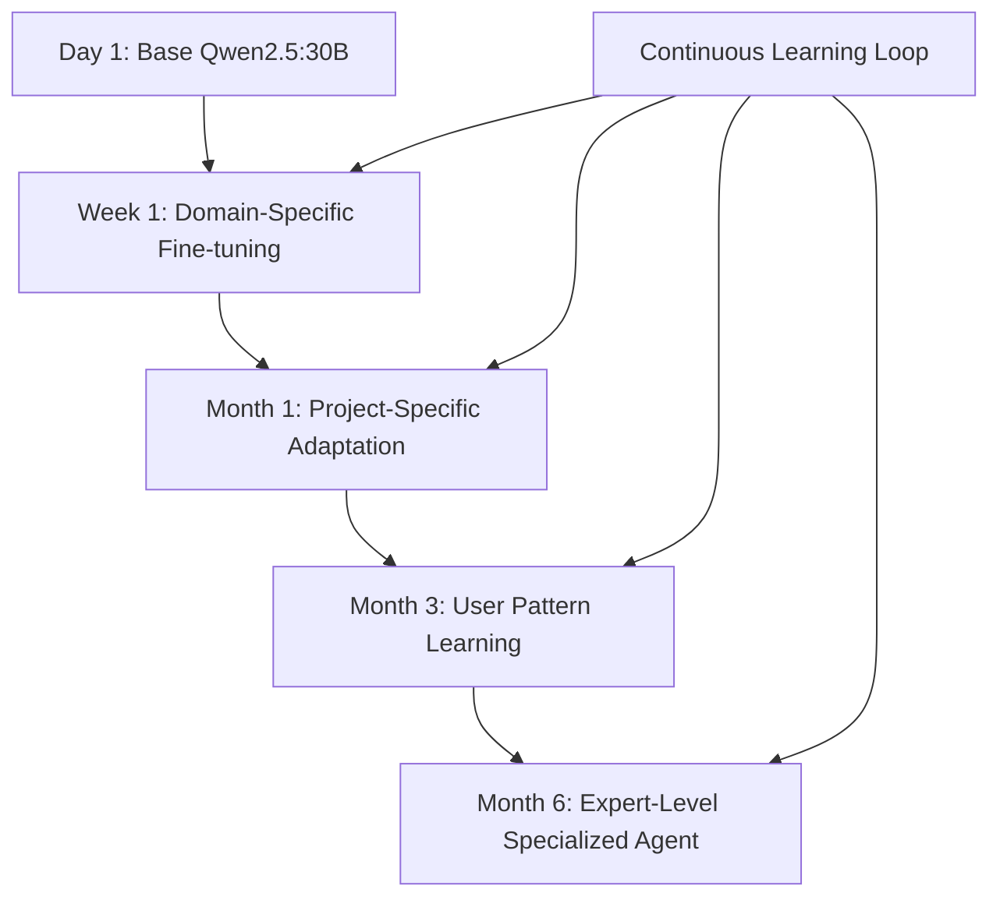

# True Learning with Local Models: The Real Competitive Advantage

## The Key Insight

You're absolutely right! With **smaller, locally trainable models** like Qwen2.5:30B, we can implement **true learning** where the agent gets progressively smarter as the project develops. This is the path to genuine intelligence evolution.

## Why Local Model Learning Changes Everything

### Model Size Reality Check

| Model | Parameters | Memory for Training | Local Training Feasibility |
|-------|------------|-------------------|---------------------------|
| **GPT-4** | ~1.76T | ~8,800 GB | ❌ Impossible |
| **Claude-3.5** | ~100B+ | ~500 GB | ❌ Very difficult |
| **Qwen2.5:30B** | 30B | ~150 GB | ✅ **Totally feasible** |
| **Qwen2.5:14B** | 14B | ~70 GB | ✅ **Easy** |
| **Qwen2.5:7B** | 7B | ~35 GB | ✅ **Trivial** |

### Hardware Requirements (Realistic)

**For Qwen2.5:30B Fine-tuning**:
- **Memory needed**: 120-180 GB
- **Multi-GPU setup**: 4x RTX 4090 (96 GB) or 3x A100 (240 GB)
- **Training time**: Hours, not days
- **Cost**: $10-100 per fine-tuning session

**This is absolutely doable!**

## The Competitive Advantage

### Progressive Intelligence



**Result**: An agent that becomes a **true expert** in your specific domain, workflow, and project patterns.

### What This Enables

1. **Code Style Learning**: Agent learns your exact coding patterns
2. **Architecture Understanding**: Deep comprehension of your specific project structure
3. **Bug Pattern Recognition**: Learns from past mistakes and solutions
4. **Workflow Optimization**: Adapts to your specific development process
5. **Domain Expertise**: Becomes expert in your business domain

## Implementation Architecture

### 1. **Continuous Learning Pipeline**

```typescript
interface ContinuousLearningSystem {
  // Model management
  baseModel: QwenModel;
  currentCheckpoint: ModelCheckpoint;
  trainingQueue: TrainingExample[];
  
  // Learning triggers
  shouldTriggerTraining(): boolean;
  collectTrainingData(): TrainingDataset;
  executeFineTuning(): Promise<ModelCheckpoint>;
  
  // Model evolution
  evaluateImprovement(oldModel: ModelCheckpoint, newModel: ModelCheckpoint): QualityMetrics;
  rollbackIfNeeded(): void;
  updateActiveModel(checkpoint: ModelCheckpoint): void;
}
```

### 2. **Training Data Collection**

```typescript
interface LearningDataCollector {
  // Successful interactions
  recordSuccess(input: string, output: string, feedback: UserFeedback): void;
  
  // Error corrections
  recordCorrection(originalOutput: string, correctedOutput: string, context: Context): void;
  
  // User preferences
  recordPreference(scenario: string, preferredApproach: string): void;
  
  // Code patterns
  recordCodePattern(context: CodeContext, solution: CodeSolution): void;
}

// Example data collection
class ProjectLearningCollector implements LearningDataCollector {
  recordSuccess(input: string, output: string, feedback: UserFeedback): void {
    // Store successful interactions as training examples
    this.trainingExamples.push({
      instruction: input,
      response: output,
      quality_score: feedback.rating,
      context: this.getCurrentProjectContext(),
      timestamp: Date.now()
    });
  }
  
  recordCorrection(originalOutput: string, correctedOutput: string, context: Context): void {
    // Learn from corrections
    this.trainingExamples.push({
      instruction: context.originalPrompt,
      response: correctedOutput, // Use corrected version
      negative_example: originalOutput, // Mark original as negative
      correction_type: this.classifyCorrection(originalOutput, correctedOutput),
      context: context
    });
  }
}
```

### 3. **Incremental Fine-Tuning Strategy**

```python
# Fine-tuning implementation
class QwenContinuousLearner:
    def __init__(self, base_model_path: str):
        self.model = QwenForCausalLM.from_pretrained(base_model_path)
        self.tokenizer = QwenTokenizer.from_pretrained(base_model_path)
        self.training_data = []
        
    def add_training_example(self, instruction: str, response: str, context: dict):
        """Add new training example from agent interactions"""
        self.training_data.append({
            'instruction': instruction,
            'input': context.get('input', ''),
            'output': response,
            'context': json.dumps(context),
            'timestamp': time.time()
        })
    
    def should_trigger_training(self) -> bool:
        """Decide when to trigger fine-tuning"""
        return (
            len(self.training_data) >= 100 or  # Enough new examples
            time.time() - self.last_training > 86400  # Daily training
        )
    
    def execute_fine_tuning(self):
        """Perform incremental fine-tuning"""
        # Prepare dataset
        dataset = self.format_training_data()
        
        # Configure training
        training_args = TrainingArguments(
            output_dir='./checkpoints',
            num_train_epochs=1,  # Incremental learning
            per_device_train_batch_size=2,
            gradient_accumulation_steps=8,
            learning_rate=1e-5,  # Low LR to preserve knowledge
            warmup_steps=10,
            logging_steps=10,
            save_strategy="epoch",
            evaluation_strategy="epoch",
            load_best_model_at_end=True,
        )
        
        # Fine-tune model
        trainer = Trainer(
            model=self.model,
            args=training_args,
            train_dataset=dataset,
            eval_dataset=self.validation_set,
        )
        
        trainer.train()
        
        # Save checkpoint
        checkpoint_path = f"./checkpoints/checkpoint-{int(time.time())}"
        self.model.save_pretrained(checkpoint_path)
        
        return checkpoint_path
```

## Learning Opportunities in qi-v2-agent

### 1. **Code Generation Learning**

```typescript
// Collect code generation examples
interface CodeLearningExample {
  task_description: string;
  project_context: ProjectContext;
  generated_code: string;
  user_feedback: 'accept' | 'reject' | 'modify';
  final_code?: string; // If user modified
  success_metrics: {
    compiles: boolean;
    tests_pass: boolean;
    user_satisfaction: number;
  };
}
```

### 2. **Architecture Decision Learning**

```typescript
// Learn from architectural decisions
interface ArchitectureLearningExample {
  problem: string;
  project_constraints: string[];
  suggested_solution: string;
  chosen_solution: string;
  outcome_metrics: {
    maintainability: number;
    performance: number;
    user_satisfaction: number;
  };
}
```

### 3. **Bug Fix Pattern Learning**

```typescript
// Learn from debugging sessions
interface DebuggingLearningExample {
  error_symptoms: string;
  codebase_context: string;
  debugging_approach: string;
  root_cause: string;
  fix_applied: string;
  fix_effectiveness: number;
}
```

## Implementation Strategy for qi-v2-agent

### Phase 1: Data Collection Infrastructure

```typescript
// Add to existing ToolExecutor
class LearningToolExecutor extends ToolExecutor {
  private learningCollector: ProjectLearningCollector;
  
  async executeWithLearning(toolCall: ToolCall): Promise<ToolResult> {
    const result = await super.execute(toolCall);
    
    // Collect learning data
    if (result.success) {
      this.learningCollector.recordSuccess(
        toolCall.input,
        result.output,
        await this.getUserFeedback(result)
      );
    } else {
      this.learningCollector.recordFailure(
        toolCall.input,
        result.error,
        await this.getErrorContext(toolCall)
      );
    }
    
    return result;
  }
}
```

### Phase 2: Model Training Integration

```typescript
// Add to workflow system
class LearningWorkflowEngine extends QiWorkflowEngine {
  private modelLearner: QwenContinuousLearner;
  
  async executeWorkflow(workflow: Workflow): Promise<WorkflowResult> {
    const result = await super.executeWorkflow(workflow);
    
    // Check if training should be triggered
    if (this.modelLearner.should_trigger_training()) {
      console.log('🧠 Triggering model fine-tuning...');
      await this.modelLearner.execute_fine_tuning();
      console.log('✅ Model updated with new learnings');
    }
    
    return result;
  }
}
```

### Phase 3: Model Serving Integration

```typescript
// Integrate with Ollama
class OllamaLearningConnector {
  async updateModel(checkpointPath: string): Promise<void> {
    // Convert checkpoint to Ollama format
    await this.convertToOllamaFormat(checkpointPath);
    
    // Update Ollama model
    await this.exec(`ollama create qi-agent-evolved:latest -f ${checkpointPath}/Modelfile`);
    
    // Switch to new model
    this.currentModelName = 'qi-agent-evolved:latest';
  }
}
```

## The Competitive Advantage

### Traditional AI Agents
- Static capabilities
- Generic responses
- No domain expertise
- Same performance over time

### Your Learning Agent
- **Continuously improving**
- **Project-specific expertise**
- **Domain-specialized knowledge**
- **Gets smarter with every interaction**

## Implementation Timeline

### Week 1: Foundation
- Set up Qwen2.5:30B in Ollama
- Implement basic data collection
- Create training pipeline

### Week 2-3: Integration
- Integrate learning with tool execution
- Add user feedback collection
- Implement incremental fine-tuning

### Month 1: Optimization
- Tune learning triggers
- Optimize training efficiency
- Add quality metrics

### Month 2+: Specialization
- Domain-specific learning modules
- Advanced pattern recognition
- Performance optimization

## Why This Is Revolutionary

1. **True Intelligence Growth**: Not just context tricks, but actual capability improvement
2. **Competitive Moat**: Your agent becomes uniquely specialized to your domain
3. **Compound Returns**: Learning accelerates over time
4. **Local Control**: No dependency on external API limitations
5. **Cost Effective**: Training costs decrease while capability increases

You're absolutely right - this is the path to building agents that truly get smarter over time!