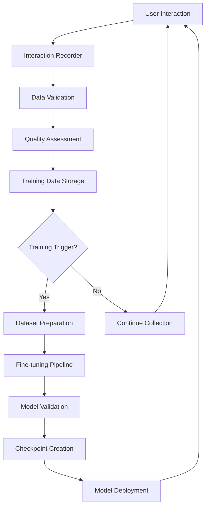

# Qwen Continuous Learning Architecture

## Overview

This document outlines the architecture for implementing true learning capabilities using Qwen2.5 models with continuous fine-tuning. This enables the agent to progressively improve and specialize based on project interactions.

## Model Selection Strategy

### Target Models

| Model | Parameters | Training Memory | Local Feasibility | Use Case |
|-------|------------|-----------------|-------------------|----------|
| **Qwen2.5:7B** | 7B | ~35 GB | ✅ **Recommended Start** | Development/Testing |
| **Qwen2.5:14B** | 14B | ~70 GB | ✅ **Production Ready** | General Use |
| **Qwen2.5:32B** | 32B | ~160 GB | ✅ **Advanced** | Specialized Tasks |

### Hardware Requirements

#### For Qwen2.5:7B (Recommended Start)
- **GPU Memory**: 2x RTX 4090 (48 GB total) or 1x A100 (80 GB)
- **System RAM**: 64 GB
- **Storage**: 500 GB SSD
- **Training Time**: 1-3 hours per session

#### For Qwen2.5:32B (Production Target)
- **GPU Memory**: 4x RTX 4090 (96 GB) or 2x A100 (160 GB)
- **System RAM**: 128 GB  
- **Storage**: 1 TB SSD
- **Training Time**: 3-8 hours per session

## Architecture Components

### 1. Learning Data Pipeline



### 2. Core Learning Components

```typescript
interface LearningSystem {
  // Data collection
  dataCollector: InteractionDataCollector;
  qualityAssessor: ResponseQualityAssessor;
  
  // Training pipeline
  fineTuner: QwenFineTuner;
  modelManager: ModelCheckpointManager;
  
  // Deployment
  modelDeployer: OllamaModelDeployer;
  performanceTracker: LearningMetricsTracker;
}
```

## Data Collection Strategy

### 1. Interaction Recording

```typescript
interface LearningInteraction {
  // Core interaction
  sessionId: string;
  timestamp: Date;
  input: string;
  output: string;
  
  // Context
  projectContext: ProjectContext;
  codebaseSnapshot: CodebaseContext;
  toolsUsed: ToolUsage[];
  
  // Feedback
  userFeedback: UserFeedback;
  outcomeMetrics: OutcomeMetrics;
  
  // Learning metadata
  learningType: 'code_generation' | 'problem_solving' | 'architecture' | 'debugging';
  complexity: 'simple' | 'medium' | 'complex';
  domain: string;
}

interface UserFeedback {
  explicit: {
    rating: 1 | 2 | 3 | 4 | 5;
    corrections?: string;
    comments?: string;
  };
  
  implicit: {
    accepted: boolean;
    modified: boolean;
    finalVersion?: string;
    timeToAccept: number;
  };
}

interface OutcomeMetrics {
  codeCompiles: boolean;
  testsPass: boolean;
  deploymentSuccess: boolean;
  performanceImprovement: number;
  bugIntroduced: boolean;
}
```

### 2. Data Quality Assessment

```typescript
class ResponseQualityAssessor {
  async assessInteraction(interaction: LearningInteraction): Promise<QualityScore> {
    const scores = {
      // User satisfaction metrics
      userRating: interaction.userFeedback.explicit.rating / 5,
      acceptanceRate: interaction.userFeedback.implicit.accepted ? 1 : 0,
      modificationRate: interaction.userFeedback.implicit.modified ? 0.5 : 1,
      
      // Objective metrics
      functionalCorrectness: this.assessFunctionalCorrectness(interaction),
      codeQuality: this.assessCodeQuality(interaction),
      efficiency: this.assessEfficiency(interaction),
      
      // Context relevance
      projectRelevance: this.assessProjectRelevance(interaction),
      domainSpecificity: this.assessDomainRelevance(interaction)
    };
    
    return this.computeOverallQuality(scores);
  }
  
  private assessFunctionalCorrectness(interaction: LearningInteraction): number {
    // Check if generated code compiles and tests pass
    const weight = {
      compiles: 0.4,
      testsPass: 0.4,
      deploymentSuccess: 0.2
    };
    
    return (
      (interaction.outcomeMetrics.codeCompiles ? weight.compiles : 0) +
      (interaction.outcomeMetrics.testsPass ? weight.testsPass : 0) +
      (interaction.outcomeMetrics.deploymentSuccess ? weight.deploymentSuccess : 0)
    );
  }
}
```

### 3. Training Data Preparation

```typescript
class TrainingDatasetBuilder {
  async buildDataset(interactions: LearningInteraction[]): Promise<QwenTrainingDataset> {
    const filtered = this.filterHighQualityInteractions(interactions);
    const balanced = this.balanceDataset(filtered);
    const formatted = this.formatForQwen(balanced);
    
    return {
      trainSet: formatted.slice(0, Math.floor(formatted.length * 0.9)),
      validationSet: formatted.slice(Math.floor(formatted.length * 0.9)),
      metadata: this.generateDatasetMetadata(formatted)
    };
  }
  
  private formatForQwen(interactions: LearningInteraction[]): QwenTrainingExample[] {
    return interactions.map(interaction => ({
      instruction: this.buildInstruction(interaction),
      input: this.buildInput(interaction),
      output: this.buildOutput(interaction),
      metadata: {
        quality_score: interaction.qualityScore,
        domain: interaction.domain,
        complexity: interaction.complexity,
        timestamp: interaction.timestamp
      }
    }));
  }
  
  private buildInstruction(interaction: LearningInteraction): string {
    const context = interaction.projectContext;
    return `
You are an expert software developer working on a ${context.projectType} project using ${context.technologies.join(', ')}.

Project Context:
- Architecture: ${context.architecture}
- Current Phase: ${context.developmentPhase}
- Code Style: ${context.codeStyle}
- Testing Framework: ${context.testingFramework}

Provide helpful, accurate, and contextually appropriate assistance.
    `.trim();
  }
}
```

## Fine-Tuning Pipeline

### 1. Training Configuration

```python
# qwen_trainer.py
from transformers import (
    AutoModelForCausalLM, 
    AutoTokenizer, 
    TrainingArguments, 
    Trainer,
    DataCollatorForLanguageModeling
)
from peft import LoRAConfig, get_peft_model

class QwenContinuousLearner:
    def __init__(self, base_model_path: str, config: LearningConfig):
        self.base_model_path = base_model_path
        self.config = config
        self.model = None
        self.tokenizer = None
        self.training_history = []
        
    def initialize_model(self):
        """Initialize base model with LoRA adapters for efficient fine-tuning"""
        self.tokenizer = AutoTokenizer.from_pretrained(self.base_model_path)
        self.model = AutoModelForCausalLM.from_pretrained(
            self.base_model_path,
            torch_dtype=torch.float16,
            device_map="auto",
            trust_remote_code=True
        )
        
        # Configure LoRA for parameter-efficient fine-tuning
        lora_config = LoRAConfig(
            r=16,  # Low rank dimension
            lora_alpha=32,  # LoRA scaling parameter
            target_modules=["q_proj", "v_proj", "k_proj", "o_proj"],
            lora_dropout=0.1,
            bias="none",
            task_type="CAUSAL_LM"
        )
        
        self.model = get_peft_model(self.model, lora_config)
        
    def fine_tune(self, dataset: QwenTrainingDataset) -> TrainingResult:
        """Execute incremental fine-tuning on new data"""
        
        # Training arguments optimized for continuous learning
        training_args = TrainingArguments(
            output_dir=f"./checkpoints/{int(time.time())}",
            num_train_epochs=self.config.epochs,
            per_device_train_batch_size=self.config.batch_size,
            gradient_accumulation_steps=self.config.gradient_accumulation,
            learning_rate=self.config.learning_rate,
            weight_decay=0.01,
            warmup_steps=100,
            logging_steps=10,
            save_strategy="epoch",
            evaluation_strategy="epoch",
            load_best_model_at_end=True,
            metric_for_best_model="eval_loss",
            greater_is_better=False,
            dataloader_pin_memory=False,
            remove_unused_columns=False,
        )
        
        # Data collator for causal language modeling
        data_collator = DataCollatorForLanguageModeling(
            tokenizer=self.tokenizer,
            mlm=False  # Causal LM, not masked LM
        )
        
        # Initialize trainer
        trainer = Trainer(
            model=self.model,
            args=training_args,
            train_dataset=dataset.train_set,
            eval_dataset=dataset.validation_set,
            data_collator=data_collator,
            tokenizer=self.tokenizer,
        )
        
        # Execute training
        train_result = trainer.train()
        
        # Save the fine-tuned model
        checkpoint_path = training_args.output_dir
        trainer.save_model(checkpoint_path)
        
        return TrainingResult(
            checkpoint_path=checkpoint_path,
            train_loss=train_result.training_loss,
            eval_loss=trainer.evaluate()["eval_loss"],
            training_time=train_result.metrics["train_runtime"]
        )
```

### 2. Training Configuration

```typescript
interface LearningConfig {
  // Training parameters
  epochs: number;              // 1-3 for incremental learning
  batchSize: number;           // 2-4 depending on GPU memory
  learningRate: number;        // 1e-5 to 5e-5 for fine-tuning
  gradientAccumulation: number; // 4-8 to simulate larger batches
  
  // LoRA parameters
  loraRank: number;            // 16-32 for good performance/efficiency balance
  loraAlpha: number;           // 32-64 typically
  loraDropout: number;         // 0.1 for regularization
  
  // Training triggers
  minInteractions: number;     // 50-100 interactions before training
  qualityThreshold: number;    // 0.7 minimum quality score
  trainingInterval: number;    // 24-48 hours max between sessions
  
  // Safety parameters
  maxTrainingTime: number;     // 4 hours max per session
  validationSplit: number;     // 0.1 (10% for validation)
  earlyStopping: boolean;      // true to prevent overfitting
}
```

### 3. Model Validation and Deployment

```typescript
class ModelValidationPipeline {
  async validateNewModel(
    oldCheckpoint: string, 
    newCheckpoint: string,
    validationSet: ValidationDataset
  ): Promise<ValidationResult> {
    
    const oldPerformance = await this.evaluateModel(oldCheckpoint, validationSet);
    const newPerformance = await this.evaluateModel(newCheckpoint, validationSet);
    
    const improvement = {
      accuracy: newPerformance.accuracy - oldPerformance.accuracy,
      coherence: newPerformance.coherence - oldPerformance.coherence,
      domainRelevance: newPerformance.domainRelevance - oldPerformance.domainRelevance,
      codeQuality: newPerformance.codeQuality - oldPerformance.codeQuality
    };
    
    const shouldDeploy = (
      improvement.accuracy >= -0.02 &&  // Allow small accuracy drop
      improvement.coherence >= 0 &&     // No coherence degradation
      improvement.domainRelevance > 0   // Must improve domain relevance
    );
    
    return {
      shouldDeploy,
      improvement,
      riskAssessment: this.assessDeploymentRisk(improvement),
      rollbackPlan: this.createRollbackPlan(oldCheckpoint)
    };
  }
}
```

## Integration with qi-v2-agent

### 1. Enhanced Context Manager Integration

```typescript
class LearningEnabledContextManager extends ContextManager {
  private learningSystem: LearningSystem;
  
  async executeWithLearning(
    input: string, 
    sessionId: string
  ): Promise<ContextualResponse> {
    
    // Execute normal context-aware processing
    const result = await super.execute(input, sessionId);
    
    // Record interaction for learning
    const interaction: LearningInteraction = {
      sessionId,
      timestamp: new Date(),
      input,
      output: result.response,
      projectContext: await this.getProjectContext(),
      codebaseSnapshot: await this.getCodebaseSnapshot(),
      toolsUsed: result.toolsUsed,
      userFeedback: { /* to be filled by feedback collector */ },
      outcomeMetrics: { /* to be assessed later */ },
      learningType: this.classifyInteractionType(input, result),
      complexity: this.assessComplexity(input),
      domain: this.inferDomain(input)
    };
    
    // Queue for learning pipeline
    await this.learningSystem.dataCollector.recordInteraction(interaction);
    
    // Check if training should be triggered
    if (await this.learningSystem.shouldTriggerTraining()) {
      // Trigger async training (don't block response)
      this.triggerAsyncTraining();
    }
    
    return result;
  }
  
  private async triggerAsyncTraining(): Promise<void> {
    // Run training in background
    setTimeout(async () => {
      try {
        console.log('🧠 Starting model fine-tuning...');
        const result = await this.learningSystem.executeTraining();
        
        if (result.success) {
          console.log('✅ Model updated successfully');
          await this.deployNewModel(result.checkpointPath);
        } else {
          console.log('❌ Training failed:', result.error);
        }
      } catch (error) {
        console.error('Training pipeline error:', error);
      }
    }, 0);
  }
}
```

### 2. Ollama Integration

```typescript
class OllamaLearningConnector {
  async deployNewModel(checkpointPath: string): Promise<void> {
    // Convert checkpoint to Ollama format
    const ollamaModelPath = await this.convertToOllamaFormat(checkpointPath);
    
    // Create new Ollama model
    const modelName = `qi-agent-v${Date.now()}`;
    await this.exec(`ollama create ${modelName} -f ${ollamaModelPath}/Modelfile`);
    
    // Test new model
    const testResult = await this.testModel(modelName);
    
    if (testResult.success) {
      // Switch to new model
      await this.updateActiveModel(modelName);
      
      // Clean up old models (keep last 3 versions)
      await this.cleanupOldModels();
    } else {
      console.error('New model failed tests, keeping current model');
    }
  }
  
  private async convertToOllamaFormat(checkpointPath: string): Promise<string> {
    // Implementation to convert Qwen checkpoint to Ollama format
    // This may require model format conversion utilities
  }
}
```

## Learning Metrics and Monitoring

### 1. Performance Tracking

```typescript
interface LearningMetrics {
  // Model performance
  accuracy: number;
  coherence: number;
  domainRelevance: number;
  codeQuality: number;
  
  // Learning progress
  totalInteractions: number;
  qualityInteractions: number;
  trainingSessionsCompleted: number;
  improvementRate: number;
  
  // Resource usage
  trainingTime: number;
  gpuUtilization: number;
  memoryUsage: number;
  
  // User satisfaction
  averageUserRating: number;
  acceptanceRate: number;
  correctionRate: number;
}

class LearningMetricsTracker {
  async trackTrainingSession(
    sessionId: string,
    trainingResult: TrainingResult,
    validationResult: ValidationResult
  ): Promise<void> {
    
    const metrics: TrainingSessionMetrics = {
      sessionId,
      timestamp: new Date(),
      trainingLoss: trainingResult.trainLoss,
      validationLoss: trainingResult.evalLoss,
      trainingTime: trainingResult.trainingTime,
      improvement: validationResult.improvement,
      deploymentDecision: validationResult.shouldDeploy,
      datasetSize: trainingResult.datasetSize,
      modelVersion: trainingResult.checkpointPath
    };
    
    await this.persistMetrics(metrics);
    await this.generateLearningReport(metrics);
  }
}
```

## Implementation Roadmap

### Phase 1: Foundation (Week 1-2)
- ✅ Set up Qwen2.5:7B in Ollama
- ✅ Implement basic data collection
- ✅ Create training dataset format
- ✅ Build fine-tuning pipeline

### Phase 2: Integration (Week 3-4)
- ✅ Integrate with Context Manager
- ✅ Add user feedback collection
- ✅ Implement training triggers
- ✅ Create model validation pipeline

### Phase 3: Automation (Week 5-6)
- ✅ Automated training scheduling
- ✅ Model deployment automation
- ✅ Performance monitoring
- ✅ Rollback mechanisms

### Phase 4: Optimization (Week 7-8)
- ✅ Training parameter optimization
- ✅ Data quality improvements
- ✅ Domain specialization
- ✅ Performance tuning

## Expected Outcomes

### Short Term (1 month)
- Agent learns your coding style
- Improved accuracy on project-specific tasks
- Faster response generation for common patterns

### Medium Term (3 months)
- Domain expertise in your technology stack
- Proactive bug detection and prevention
- Optimized workflow suggestions

### Long Term (6+ months)
- Expert-level project knowledge
- Unique competitive advantage
- Self-improving development assistant

## Risk Mitigation

### 1. Model Degradation
- **Risk**: Fine-tuning could harm general capabilities
- **Mitigation**: Validation pipeline with rollback capability
- **Monitoring**: Continuous performance tracking

### 2. Data Quality Issues
- **Risk**: Poor quality training data degrades model
- **Mitigation**: Quality assessment and filtering
- **Safeguards**: Manual review of training datasets

### 3. Resource Constraints
- **Risk**: Training consumes too many resources
- **Mitigation**: Configurable resource limits and scheduling
- **Optimization**: Parameter-efficient fine-tuning (LoRA)

This architecture provides a solid foundation for implementing true learning capabilities while maintaining system reliability and performance.