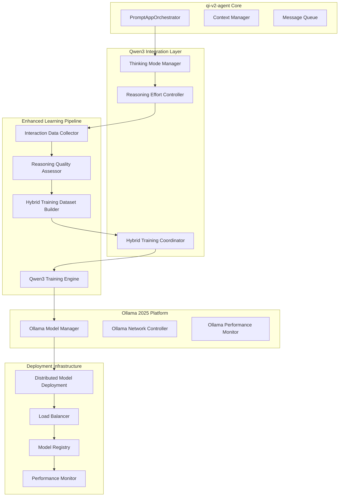

# Qwen3 & Ollama 2025 Integration Addendum

**Document Version**: 1.1  
**Date**: 2025-01-16  
**Status**: Updated Technical Specification  
**Classification**: Technical Architecture Update

## Executive Summary

This addendum updates the continuous learning technical specification to incorporate the latest capabilities of Qwen3 (2025) and Ollama's enhanced 2025 features. The integration strategy leverages Qwen3's hybrid reasoning capabilities, improved fine-tuning efficiency, and Ollama's enhanced model management platform.

## Qwen3 (2025) Capabilities Update

### Model Architecture Evolution

#### Available Model Variants
```yaml
qwen3_models:
  dense_models:
    qwen3_600m:
      parameters: "600M"
      context_length: "128K"
      vram_required: "2GB"
      use_case: "lightweight_development"
    
    qwen3_1_8b:
      parameters: "1.8B"
      context_length: "128K"
      vram_required: "4GB"
      use_case: "edge_deployment"
    
    qwen3_7b:
      parameters: "7B"
      context_length: "128K"
      vram_required: "14GB"
      use_case: "standard_development"
    
    qwen3_14b:
      parameters: "14B"
      context_length: "128K"
      vram_required: "28GB"
      use_case: "production_ready"
    
    qwen3_32b:
      parameters: "32B"
      context_length: "128K"
      vram_required: "64GB"
      use_case: "high_performance"
  
  moe_models:
    qwen3_30b_a3b:
      total_parameters: "30B"
      active_parameters: "3B"
      context_length: "128K"
      vram_required: "17.5GB"
      use_case: "efficient_large_model"
    
    qwen3_235b_a22b:
      total_parameters: "235B"
      active_parameters: "22B"
      context_length: "128K"
      vram_required: "90GB"
      use_case: "enterprise_scale"
  
  extended_context:
    qwen3_2507:
      context_length: "1M tokens"
      variants: ["7B", "14B", "30B-A3B"]
      use_case: "ultra_long_context"
```

#### Hybrid Thinking Architecture
```typescript
interface Qwen3ThinkingCapabilities {
  thinking_modes: {
    reasoning_mode: {
      description: "Deep chain-of-thought reasoning";
      use_cases: ["complex_problem_solving", "code_analysis", "architectural_decisions"];
      latency: "higher";
      quality: "maximum";
      configurability: ["thinking_effort_level", "reasoning_depth"];
    };
    
    direct_mode: {
      description: "Fast, concise responses";
      use_cases: ["simple_queries", "code_completion", "quick_assistance"];
      latency: "minimal";
      quality: "optimized";
      configurability: ["response_length", "detail_level"];
    };
    
    adaptive_mode: {
      description: "Context-aware mode selection";
      use_cases: ["general_purpose", "multi_turn_conversations"];
      latency: "variable";
      quality: "balanced";
      configurability: ["complexity_threshold", "mode_switching_logic"];
    };
  };
  
  reasoning_effort: {
    low: {
      compute_cost: "minimal";
      response_time: "< 1s";
      reasoning_depth: "surface_level";
    };
    
    medium: {
      compute_cost: "moderate";
      response_time: "1-3s";
      reasoning_depth: "structured_analysis";
    };
    
    high: {
      compute_cost: "maximum";
      response_time: "3-10s";
      reasoning_depth: "comprehensive_exploration";
    };
  };
}
```

### Enhanced Training Capabilities

#### Four-Stage Training Pipeline
```python
class Qwen3TrainingPipeline:
    """Updated training pipeline for Qwen3 continuous learning"""
    
    def __init__(self, config: Qwen3Config):
        self.config = config
        self.stages = {
            'cold_start': LongChainOfThoughtTraining(),
            'reasoning_rl': ReasoningReinforcementLearning(),
            'thinking_fusion': ThinkingModeFusion(),
            'general_rl': GeneralReinforcementLearning()
        }
    
    async def execute_continuous_learning(
        self, 
        interaction_data: List[InteractionData]
    ) -> TrainingResult:
        
        # Prepare dataset with hybrid reasoning preservation
        dataset = await self.prepare_hybrid_dataset(interaction_data)
        
        # Execute staged training
        results = {}
        for stage_name, stage in self.stages.items():
            if self.should_execute_stage(stage_name, dataset):
                stage_result = await stage.train(dataset, self.config)
                results[stage_name] = stage_result
                
                # Validate reasoning preservation
                reasoning_check = await self.validate_reasoning_preservation(
                    stage_result.checkpoint
                )
                
                if not reasoning_check.passed:
                    await self.apply_reasoning_recovery(stage_result.checkpoint)
        
        return TrainingResult(
            stages_completed=list(results.keys()),
            final_checkpoint=results[list(results.keys())[-1]].checkpoint,
            reasoning_preserved=True,
            thinking_modes_functional=True
        )
    
    async def prepare_hybrid_dataset(
        self, 
        interactions: List[InteractionData]
    ) -> HybridDataset:
        """Prepare dataset preserving both reasoning and direct response capabilities"""
        
        reasoning_examples = []
        direct_examples = []
        
        for interaction in interactions:
            if self.requires_reasoning(interaction):
                # Convert to chain-of-thought format
                reasoning_example = await self.convert_to_cot_format(interaction)
                reasoning_examples.append(reasoning_example)
            else:
                # Keep as direct response
                direct_example = await self.format_direct_response(interaction)
                direct_examples.append(direct_example)
        
        # Maintain 75% reasoning, 25% direct ratio for capability preservation
        balanced_dataset = self.balance_dataset(
            reasoning_examples, 
            direct_examples,
            reasoning_ratio=0.75
        )
        
        return HybridDataset(
            reasoning_examples=reasoning_examples,
            direct_examples=direct_examples,
            balanced_mix=balanced_dataset,
            metadata=self.generate_dataset_metadata(balanced_dataset)
        )
```

#### Enhanced Fine-Tuning Efficiency
```yaml
qwen3_fine_tuning_specs:
  unsloth_optimization:
    speed_improvement: "2x faster"
    memory_reduction: "70% less VRAM"
    context_extension: "8x longer context"
    cost_efficiency: "< $3 for medical reasoning dataset"
  
  memory_requirements:
    qwen3_14b:
      base_inference: "14GB"
      fine_tuning_full: "35GB"
      fine_tuning_lora: "16GB"  # Fits in Google Colab T4
      fine_tuning_unsloth: "8GB"  # 70% reduction
    
    qwen3_30b_a3b:
      base_inference: "17.5GB"
      fine_tuning_full: "50GB"
      fine_tuning_lora: "25GB"
      fine_tuning_unsloth: "12GB"
  
  training_configurations:
    reasoning_preservation:
      reasoning_ratio: 0.75
      direct_ratio: 0.25
      cot_augmentation: true
      thinking_mode_validation: true
    
    efficiency_optimization:
      gradient_checkpointing: true
      mixed_precision: "fp16"
      lora_rank: 64  # Higher for Qwen3
      lora_alpha: 128
      learning_rate: 1e-5
```

## Ollama 2025 Platform Enhancements

### Enhanced Model Management

#### Custom Model Deployment Pipeline
```typescript
class Ollama2025ModelManager {
  private ollamaAPI: OllamaAPI;
  private modelRegistry: ModelRegistry;
  
  constructor(config: OllamaConfig) {
    this.ollamaAPI = new OllamaAPI(config.endpoint);
    this.modelRegistry = new ModelRegistry(config.registry);
  }
  
  async deployFineTunedModel(
    checkpointPath: string,
    modelConfig: ModelConfig
  ): Promise<DeploymentResult> {
    
    // Convert checkpoint to Ollama format
    const modelFile = await this.createModelFile(checkpointPath, modelConfig);
    
    // Deploy using Ollama's 2025 API
    const deployment = await this.ollamaAPI.create({
      name: modelConfig.name,
      modelfile: modelFile,
      stream: true  // Monitor deployment progress
    });
    
    // Validate deployment
    const validation = await this.validateDeployment(modelConfig.name);
    
    if (!validation.success) {
      await this.rollbackDeployment(modelConfig.name);
      throw new DeploymentError(`Deployment validation failed: ${validation.error}`);
    }
    
    // Register in model registry
    await this.modelRegistry.register({
      name: modelConfig.name,
      version: modelConfig.version,
      baseModel: modelConfig.baseModel,
      fineTuningData: modelConfig.trainingMetadata,
      performance: validation.performanceMetrics,
      deployedAt: new Date()
    });
    
    return {
      success: true,
      modelName: modelConfig.name,
      endpoint: `${this.ollamaAPI.endpoint}/api/chat`,
      capabilities: this.extractCapabilities(validation)
    };
  }
  
  private async createModelFile(
    checkpointPath: string,
    config: ModelConfig
  ): string {
    return `
FROM ${checkpointPath}

# Set custom parameters for fine-tuned model
PARAMETER temperature ${config.temperature || 0.7}
PARAMETER top_p ${config.top_p || 0.9}
PARAMETER top_k ${config.top_k || 40}

# Custom system prompt for specialized behavior
SYSTEM "${config.systemPrompt}"

# Template for conversation format
TEMPLATE """
{{ if .System }}<|im_start|>system
{{ .System }}<|im_end|>
{{ end }}{{ if .Prompt }}<|im_start|>user
{{ .Prompt }}<|im_end|>
{{ end }}<|im_start|>assistant
{{ .Response }}<|im_end|>
"""

# Thinking mode configuration (Qwen3 specific)
PARAMETER thinking_mode ${config.thinkingMode || 'adaptive'}
PARAMETER reasoning_effort ${config.reasoningEffort || 'medium'}
`;
  }
}
```

#### Network Deployment & Scaling
```yaml
ollama_2025_deployment:
  network_capabilities:
    distributed_access: "Expose Ollama across network devices"
    cross_device_serving: "Access from less powerful devices"
    internet_exposure: "Secure external access capabilities"
    load_balancing: "Multi-instance deployment support"
  
  storage_flexibility:
    custom_model_directory: "External storage support"
    model_versioning: "Git-like model version control"
    distributed_storage: "Multi-location model caching"
    compression: "Advanced model compression techniques"
  
  performance_improvements:
    multi_gpu_optimization: "10-30% performance increase"
    quantization_support: "INT4, INT2 low-bit quantization"
    hardware_optimization: "Apple Silicon and GPU-aware optimization"
    streaming_improvements: "Enhanced streaming with tool calling"
```

### API Enhancements

#### OpenAI-Compatible API Integration
```typescript
interface Ollama2025APIFeatures {
  openai_compatibility: {
    chat_completions: "Full OpenAI Chat Completions API support";
    function_calling: "Native function calling with streaming";
    multimodal_support: "WebP images and multimodal processing";
    structured_outputs: "JSON schema-based output formatting";
  };
  
  reasoning_controls: {
    thinking_toggle: "Enable/disable thinking mode per request";
    effort_configuration: "Configure reasoning effort (low/medium/high)";
    cot_access: "Full chain-of-thought reasoning visibility";
    reasoning_monitoring: "Production monitoring for reasoning processes";
  };
  
  advanced_features: {
    web_browsing: "Built-in web search capabilities";
    python_tools: "Native Python tool execution";
    file_processing: "Drag-and-drop PDF and text processing";
    agentic_capabilities: "Native agent and task orchestration";
  };
}

class Ollama2025APIClient {
  async chatWithThinking(
    messages: ChatMessage[],
    options: ChatOptions = {}
  ): Promise<ChatResponse> {
    
    const request = {
      model: options.model || 'qwen3:latest',
      messages,
      stream: options.stream || false,
      
      // Qwen3-specific thinking controls
      thinking: options.thinking ?? 'adaptive',
      reasoning_effort: options.reasoningEffort || 'medium',
      
      // Enhanced capabilities
      tools: options.tools || [],
      tool_choice: options.toolChoice || 'auto',
      
      // Response formatting
      format: options.format || 'json',
      response_format: options.responseFormat
    };
    
    const response = await fetch(`${this.baseURL}/api/chat`, {
      method: 'POST',
      headers: {
        'Content-Type': 'application/json',
        'Authorization': `Bearer ${this.apiKey}`
      },
      body: JSON.stringify(request)
    });
    
    if (options.stream) {
      return this.handleStreamingResponse(response);
    }
    
    return await response.json();
  }
  
  async deployCustomModel(
    modelDefinition: CustomModelDefinition
  ): Promise<DeploymentResult> {
    
    const modelFile = this.generateModelFile(modelDefinition);
    
    return await fetch(`${this.baseURL}/api/create`, {
      method: 'POST',
      headers: { 'Content-Type': 'application/json' },
      body: JSON.stringify({
        name: modelDefinition.name,
        modelfile: modelFile,
        stream: true
      })
    });
  }
}
```

## Updated Integration Architecture

### Qwen3-Optimized Continuous Learning Pipeline



### Reasoning-Aware Quality Assessment

```typescript
class ReasoningAwareQualityAssessor {
  async assessQuality(
    interaction: InteractionData,
    qwen3Response: Qwen3Response
  ): Promise<EnhancedQualityScore> {
    
    const baseQuality = await this.assessBaseQuality(interaction);
    
    // Assess reasoning quality if thinking mode was used
    let reasoningQuality = null;
    if (qwen3Response.thinkingMode === 'reasoning') {
      reasoningQuality = await this.assessReasoningQuality(
        qwen3Response.chainOfThought,
        interaction.context
      );
    }
    
    // Assess response appropriateness (thinking vs direct)
    const modeAppropriatenessScore = await this.assessModeAppropriateness(
      interaction.complexity,
      qwen3Response.thinkingMode,
      qwen3Response.responseTime
    );
    
    return {
      overall: this.calculateOverallScore(baseQuality, reasoningQuality, modeAppropriatenessScore),
      baseQuality,
      reasoningQuality,
      modeAppropriateness: modeAppropriatenessScore,
      thinkingModeUsed: qwen3Response.thinkingMode,
      reasoningEffort: qwen3Response.reasoningEffort,
      contextLength: qwen3Response.contextLength,
      timestamp: new Date()
    };
  }
  
  private async assessReasoningQuality(
    chainOfThought: string,
    context: InteractionContext
  ): Promise<ReasoningQualityScore> {
    
    const metrics = {
      logicalCoherence: await this.assessLogicalCoherence(chainOfThought),
      problemDecomposition: await this.assessProblemDecomposition(chainOfThought),
      evidenceUsage: await this.assessEvidenceUsage(chainOfThought, context),
      conclusionValidity: await this.assessConclusionValidity(chainOfThought),
      stepByStepClarity: await this.assessStepClarity(chainOfThought)
    };
    
    return {
      overall: Object.values(metrics).reduce((a, b) => a + b, 0) / Object.keys(metrics).length,
      components: metrics,
      chainOfThoughtLength: chainOfThought.length,
      reasoningSteps: this.countReasoningSteps(chainOfThought)
    };
  }
}
```

### Hybrid Dataset Management

```python
class HybridDatasetManager:
    """Manages dataset preparation for Qwen3's hybrid reasoning capabilities"""
    
    def __init__(self, config: HybridDatasetConfig):
        self.config = config
        self.reasoning_preservaton_ratio = 0.75
        self.direct_response_ratio = 0.25
    
    async def prepare_training_dataset(
        self, 
        interactions: List[InteractionData]
    ) -> HybridTrainingDataset:
        
        # Classify interactions by reasoning requirements
        reasoning_interactions = []
        direct_interactions = []
        
        for interaction in interactions:
            if await self.requires_reasoning(interaction):
                reasoning_interactions.append(interaction)
            else:
                direct_interactions.append(interaction)
        
        # Augment reasoning interactions with CoT
        cot_examples = []
        for interaction in reasoning_interactions:
            cot_example = await self.augment_with_chain_of_thought(interaction)
            cot_examples.append(cot_example)
        
        # Format direct interactions
        direct_examples = []
        for interaction in direct_interactions:
            direct_example = await self.format_direct_response(interaction)
            direct_examples.append(direct_example)
        
        # Create balanced dataset
        balanced_dataset = self.create_balanced_mix(
            cot_examples, 
            direct_examples,
            reasoning_ratio=self.reasoning_preservaton_ratio
        )
        
        # Validate dataset quality
        validation_result = await self.validate_hybrid_dataset(balanced_dataset)
        if not validation_result.passed:
            raise DatasetValidationError(validation_result.issues)
        
        return HybridTrainingDataset(
            reasoning_examples=cot_examples,
            direct_examples=direct_examples,
            balanced_training_set=balanced_dataset,
            validation_result=validation_result,
            metadata=self.generate_metadata(balanced_dataset)
        )
    
    async def augment_with_chain_of_thought(
        self, 
        interaction: InteractionData
    ) -> CoTExample:
        """Convert interaction to chain-of-thought format"""
        
        # Generate thinking process for the response
        thinking_process = await self.generate_thinking_process(
            interaction.input,
            interaction.output,
            interaction.context
        )
        
        return CoTExample(
            input=interaction.input,
            thinking=thinking_process,
            output=interaction.output,
            metadata={
                'original_interaction_id': interaction.id,
                'complexity': interaction.complexity,
                'domain': interaction.domain,
                'generated_thinking': True
            }
        )
    
    async def requires_reasoning(self, interaction: InteractionData) -> bool:
        """Determine if interaction benefits from reasoning mode"""
        
        complexity_threshold = self.config.reasoning_complexity_threshold
        reasoning_indicators = [
            interaction.complexity in ['complex', 'expert'],
            'architecture' in interaction.tags,
            'debug' in interaction.tags,
            'analyze' in interaction.input.lower(),
            'explain' in interaction.input.lower(),
            'why' in interaction.input.lower(),
            len(interaction.input.split()) > 50,  # Long queries
            interaction.context.codebaseSize > 10000  # Large codebases
        ]
        
        reasoning_score = sum(reasoning_indicators) / len(reasoning_indicators)
        return reasoning_score >= complexity_threshold
```

## Updated Resource Requirements

### Qwen3 Model Resource Specifications

```yaml
qwen3_2025_requirements:
  development_environment:
    minimum_setup:
      model: "qwen3:7b"
      vram: "14GB (RTX 3090/4090)"
      system_ram: "32GB"
      storage: "100GB SSD"
      fine_tuning: "Unsloth optimization"
    
    recommended_setup:
      model: "qwen3:14b or qwen3:30b-a3b"
      vram: "24GB (RTX 4090) or 32GB (A100)"
      system_ram: "64GB"
      storage: "500GB NVMe SSD"
      fine_tuning: "LoRA + Unsloth"
  
  production_environment:
    standard_deployment:
      model: "qwen3:14b"
      vram: "2x RTX 4090 (48GB total)"
      system_ram: "128GB"
      storage: "1TB NVMe SSD"
      network: "10Gbps"
    
    enterprise_deployment:
      model: "qwen3:235b-a22b"
      vram: "4x A100 (320GB total)"
      system_ram: "512GB"
      storage: "5TB NVMe SSD RAID"
      network: "25Gbps"
  
  extended_context_deployment:
    qwen3_2507_1m:
      model: "qwen3-2507:7b (1M context)"
      vram: "48GB minimum"
      system_ram: "256GB"
      storage: "2TB NVMe SSD"
      context_processing: "Chunk-based with 96.7% memory reduction"
```

### Ollama 2025 Infrastructure Requirements

```yaml
ollama_2025_infrastructure:
  single_node_deployment:
    hardware:
      cpu: "16 cores, 32 threads"
      memory: "64GB"
      storage: "1TB NVMe SSD"
      network: "1Gbps"
    
    software:
      ollama_version: "0.9.0+"
      docker: "24.0+"
      monitoring: "Prometheus + Grafana"
  
  distributed_deployment:
    load_balancer:
      type: "nginx or traefik"
      ssl_termination: "TLS 1.3"
      health_checks: "enabled"
    
    model_nodes:
      count: "3-5 nodes"
      hardware_per_node:
        cpu: "32 cores"
        memory: "128GB"
        gpu: "2x RTX 4090 or 1x A100"
        storage: "2TB NVMe SSD"
    
    storage_backend:
      type: "distributed object storage"
      replication: "3x"
      backup: "automated daily"
      encryption: "AES-256"
  
  network_architecture:
    internal_network: "10Gbps"
    external_access: "VPN or authenticated proxy"
    api_endpoints:
      chat: "/api/chat"
      models: "/api/tags"
      create: "/api/create"
      monitoring: "/metrics"
```

## Performance Optimizations

### Qwen3-Specific Optimizations

```python
class Qwen3PerformanceOptimizer:
    """Optimizations specific to Qwen3's hybrid reasoning capabilities"""
    
    def __init__(self, config: OptimizationConfig):
        self.config = config
        self.thinking_cache = LRUCache(maxsize=1000)
        self.reasoning_predictor = ReasoningRequirementPredictor()
    
    async def optimize_request(
        self, 
        request: ChatRequest
    ) -> OptimizedChatRequest:
        
        # Predict optimal thinking mode
        predicted_mode = await self.reasoning_predictor.predict(
            request.messages,
            request.context
        )
        
        # Optimize reasoning effort based on complexity
        reasoning_effort = self.calculate_optimal_effort(
            request.complexity,
            request.latency_requirements
        )
        
        # Check thinking cache for similar requests
        cache_key = self.generate_cache_key(request)
        cached_thinking = self.thinking_cache.get(cache_key)
        
        optimized_request = request.copy()
        optimized_request.thinking_mode = predicted_mode
        optimized_request.reasoning_effort = reasoning_effort
        
        if cached_thinking and self.is_cache_valid(cached_thinking, request):
            optimized_request.cached_thinking = cached_thinking
        
        return optimized_request
    
    def calculate_optimal_effort(
        self, 
        complexity: str, 
        latency_requirements: LatencyRequirements
    ) -> str:
        """Calculate optimal reasoning effort based on complexity and latency"""
        
        if latency_requirements.max_response_time < 2:
            return 'low'
        elif complexity in ['simple', 'medium'] and latency_requirements.max_response_time < 5:
            return 'medium'
        elif complexity in ['complex', 'expert']:
            return 'high'
        else:
            return 'medium'
```

### Ollama 2025 Performance Tuning

```yaml
ollama_performance_tuning:
  gpu_optimization:
    multi_gpu_usage: "Automatic distribution across available GPUs"
    memory_management: "Dynamic VRAM allocation"
    quantization: "INT4/INT2 for inference optimization"
    batch_processing: "Optimized batch sizes per GPU"
  
  network_optimization:
    connection_pooling: "Persistent connection reuse"
    request_batching: "Automatic request batching"
    streaming_optimization: "Improved streaming performance"
    compression: "Response compression for large outputs"
  
  storage_optimization:
    model_caching: "Intelligent model caching strategies"
    lazy_loading: "Load models on demand"
    compression: "Model compression without quality loss"
    deduplication: "Shared model layers across versions"
  
  monitoring_integration:
    metrics_collection: "Comprehensive performance metrics"
    alerting: "Real-time performance alerts"
    profiling: "Request-level performance profiling"
    optimization_recommendations: "AI-driven optimization suggestions"
```

## Updated Implementation Timeline

### Phase 1: Qwen3 & Ollama 2025 Integration (Weeks 1-2)

```yaml
week_1:
  objectives:
    - Set up Qwen3 models in Ollama 2025
    - Implement hybrid thinking mode detection
    - Create reasoning-aware quality assessment
  
  deliverables:
    - Qwen3 model deployment in Ollama
    - Thinking mode controller implementation
    - Enhanced quality assessment framework
  
  technical_tasks:
    - Deploy qwen3:14b and qwen3:30b-a3b models
    - Implement ThinkingModeManager
    - Create ReasoningAwareQualityAssessor
    - Set up Ollama 2025 API integration

week_2:
  objectives:
    - Build hybrid dataset preparation pipeline
    - Implement Unsloth-optimized training
    - Create Ollama network deployment
  
  deliverables:
    - HybridDatasetManager implementation
    - Unsloth training integration
    - Distributed Ollama deployment
  
  technical_tasks:
    - Implement CoT augmentation for reasoning examples
    - Set up Unsloth fine-tuning pipeline
    - Configure Ollama network access
    - Create model registry system
```

### Phase 2: Advanced Features Integration (Weeks 3-4)

```yaml
week_3:
  objectives:
    - Implement thinking mode optimization
    - Add reasoning effort control
    - Create performance monitoring
  
  deliverables:
    - Thinking mode optimizer
    - Reasoning effort controller
    - Performance monitoring dashboard
  
  technical_tasks:
    - Build reasoning requirement predictor
    - Implement thinking cache system
    - Set up Prometheus monitoring
    - Create Grafana dashboards

week_4:
  objectives:
    - Deploy extended context capabilities
    - Implement multi-modal support
    - Add advanced tool integration
  
  deliverables:
    - Extended context processing
    - Multi-modal capabilities
    - Tool calling integration
  
  technical_tasks:
    - Deploy qwen3-2507 for 1M context
    - Implement chunk-based processing
    - Add WebP image support
    - Create tool calling framework
```

This addendum brings the continuous learning specification up to date with the latest Qwen3 and Ollama 2025 capabilities, ensuring the architecture leverages the most advanced features available.