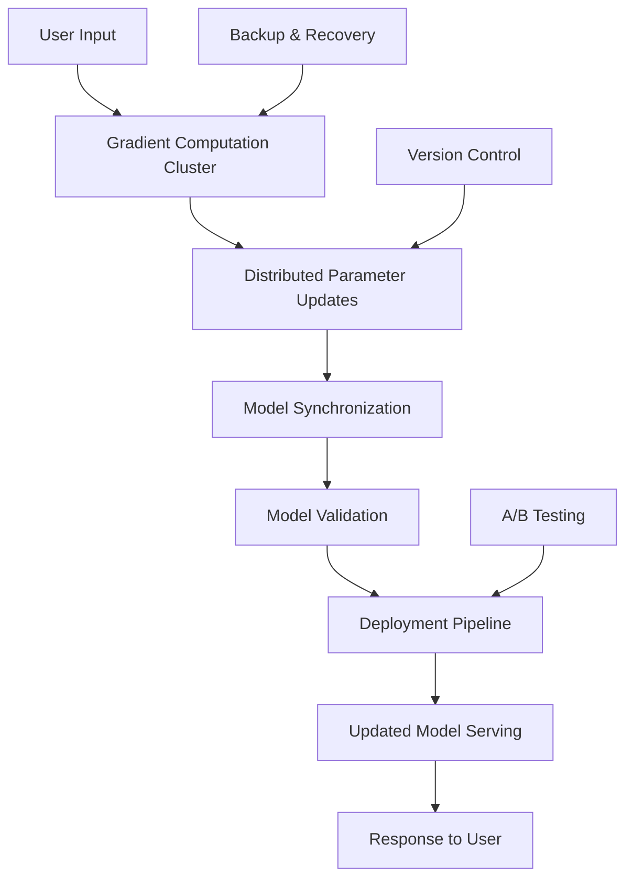
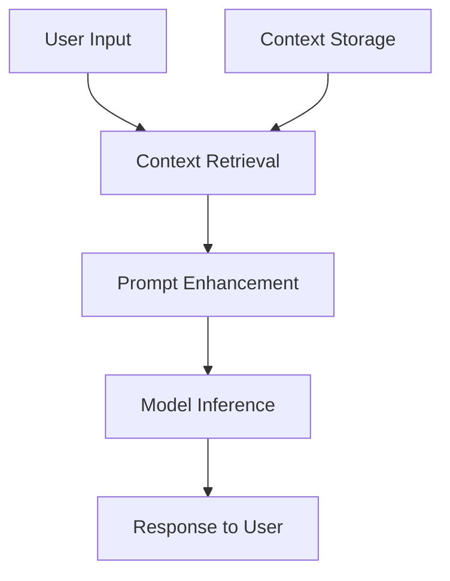

# Why Not True Learning? Technical and Practical Analysis

## The Question

Why don't we implement **true learning** (parameter updates during inference) instead of just sophisticated prompting strategies?

## Technical Reasons

### 1. **Computational Constraints**

**Model Size Reality**:
- GPT-4: ~1.76 trillion parameters
- Claude-3.5: ~100+ billion parameters  
- Each parameter = 16-32 bits (float16/float32)

**Training Requirements**:
```
Memory for gradients: 2x model size
Memory for optimizer states: 2x model size  
Total memory: ~5x model size

GPT-4 training: ~8,800 GB memory minimum
```

**Local Hardware Reality**:
- Consumer GPU: 24GB VRAM (RTX 4090)
- Server GPU: 80GB VRAM (A100)
- Required: 8,800GB+ for gradient computation

**Impossibility Factor**: 100x+ hardware gap

### 2. **Gradient Computation Complexity**

**Backpropagation Requirements**:
```python
# For each training step
loss = compute_loss(output, target)
gradients = torch.autograd.backward(loss)  # Requires storing entire forward pass
optimizer.step(gradients)  # Updates all parameters

# Memory complexity: O(model_parameters × sequence_length)
```

**Why This Is Prohibitive**:
- Must store activations for entire forward pass
- Gradient computation requires reverse-mode autodiff
- Memory usage scales with both model size AND context length

### 3. **Catastrophic Forgetting**

**The Fundamental Problem**:
```
Old Knowledge + New Learning = Interference

Example:
Model knows: "Paris is in France"
New data: "Paris is in Texas"  
Result: Confusion about both facts
```

**Solutions Require**:
- Elastic Weight Consolidation (EWC)
- Progressive Neural Networks
- Memory replay systems
- All computationally expensive and complex

### 4. **Stability Issues**

**Learning Rate Problems**:
- Too high: Model becomes unstable, forgets everything
- Too low: No meaningful learning occurs
- Dynamic adjustment: Requires sophisticated scheduling

**Distribution Shift**:
- Pre-trained on internet text
- User interactions have different distribution
- Can degrade model performance on original tasks

## Economic Reasons

### 1. **Cost Analysis**

**Training Costs** (estimated):
```
GPT-4 training: ~$100 million
Fine-tuning session: $10,000-100,000
Per-user personalization: $100-1,000
Context-based adaptation: $0.01-0.10
```

**Business Reality**: Context adaptation is 1000x cheaper

### 2. **Infrastructure Requirements**

**True Learning Needs**:
- Distributed training clusters
- High-speed interconnects (InfiniBand)
- Petabyte-scale storage
- Specialized cooling and power

**Context Management Needs**:
- Standard servers
- Regular databases
- Conventional networking
- Normal data centers

### 3. **Latency Requirements**

**True Learning**:
- Gradient computation: 10-60 seconds
- Parameter updates: 5-30 seconds
- Model reload: 1-10 seconds
- **Total: 16-100 seconds per adaptation**

**Context Management**:
- Context retrieval: 10-100ms
- Prompt engineering: 1-10ms
- Inference: 100-1000ms
- **Total: 111-1110ms**

**User Experience**: Context is 100x faster

## Architectural Reasons

### 1. **Deployment Complexity**

**True Learning Architecture**:


**Context Management Architecture**:


**Complexity Difference**: 10x+ simpler architecture

### 2. **Safety and Reliability**

**True Learning Risks**:
- Model corruption from bad data
- Adversarial attacks on parameters
- Unintended behavior changes
- Difficult rollback procedures

**Context Management Risks**:
- Bad context data (easily filtered)
- Prompt injection (detectable/preventable)
- Minor inference errors (no permanent damage)
- Easy rollback (just reset context)

## Alternative Approaches That Do Work

### 1. **Retrieval-Augmented Generation (RAG)**

**How It Works**:
```python
# Pseudo-implementation
def rag_inference(query):
    # "Learning" through retrieval
    relevant_docs = vector_db.search(query, top_k=5)
    
    # Enhanced context
    enhanced_prompt = f"""
    Context: {relevant_docs}
    Query: {query}
    Answer based on the context:
    """
    
    return llm.generate(enhanced_prompt)
```

**Benefits**:
- Updates knowledge without retraining
- Scalable to massive knowledge bases
- Fast updates (just add documents)
- No catastrophic forgetting

### 2. **Parameter-Efficient Fine-Tuning (PEFT)**

**LoRA (Low-Rank Adaptation)**:
```python
# Only update small adapter layers
class LoRALayer:
    def __init__(self, input_dim, output_dim, rank=16):
        self.A = nn.Parameter(torch.randn(input_dim, rank))
        self.B = nn.Parameter(torch.randn(rank, output_dim))
    
    def forward(self, x):
        return x @ self.A @ self.B  # Much smaller parameter space
```

**Advantages**:
- 99.9% fewer parameters to update
- Preserves base model stability
- Fast adaptation possible
- Still computationally intensive but feasible

### 3. **In-Context Learning Enhancement**

**Sophisticated Context Management**:
```typescript
interface AdaptiveContext {
  userProfile: UserLearningProfile;
  taskHistory: TaskResult[];
  successPatterns: SuccessPattern[];
  errorCorrections: ErrorCorrection[];
}

class InContextLearner {
  adapt(newInteraction: Interaction): AdaptiveContext {
    // "Learn" by updating context patterns
    return {
      ...this.context,
      successPatterns: this.extractPatterns(newInteraction),
      errorCorrections: this.identifyCorrections(newInteraction)
    };
  }
}
```

## Research Directions for "Learning-Like" Behavior

### 1. **Memory-Augmented Networks**

**Neural Turing Machines**:
- External memory that can be read/written
- Parameters stay fixed, memory adapts
- Differentiable memory operations

### 2. **Meta-Learning Approaches**

**Learning to Learn**:
- Train models to adapt quickly with few examples
- Fixed parameters, learned adaptation strategies
- MAML (Model-Agnostic Meta-Learning)

### 3. **Mixture of Experts (MoE)**

**Specialized Submodels**:
- Route different tasks to different experts
- Selective activation reduces computation
- Can add new experts without retraining all

### 4. **Continual Learning Research**

**Active Research Areas**:
- Elastic Weight Consolidation (EWC)
- Progressive Neural Networks
- Memory replay systems
- Gradient episodic memory

## Practical Recommendation for qi-v2-agent

### Why Context Management Is Right Choice

1. **Technical Feasibility**: Works with current hardware
2. **Cost Effectiveness**: 1000x cheaper than true learning
3. **Safety**: No risk of model corruption
4. **Performance**: 100x faster response times
5. **Maintenance**: Much simpler to debug and maintain

### Advanced Context Strategies You Could Implement

```typescript
// Pseudo-learning through sophisticated context
class PseudoLearningContext {
  private userPatterns: Map<string, SuccessPattern> = new Map();
  private errorDatabase: ErrorPattern[] = [];
  
  async adaptToUser(userId: string, interaction: Interaction): Promise<Context> {
    // Analyze what worked
    const patterns = this.extractSuccessPatterns(interaction);
    this.userPatterns.set(userId, patterns);
    
    // Build personalized context
    return this.buildAdaptiveContext(userId, patterns);
  }
  
  async learnFromErrors(error: Error, context: Context): Promise<Context> {
    // Store error patterns
    this.errorDatabase.push({
      context: context,
      error: error,
      correction: await this.generateCorrection(error)
    });
    
    // Return improved context
    return this.applyErrorCorrections(context);
  }
}
```

## Conclusion

**Why not true learning?**

1. **Technical impossibility** with current consumer/business hardware
2. **Economic impracticality** (1000x more expensive)
3. **Architectural complexity** (10x more complex)
4. **Safety risks** (model corruption, hard to debug)
5. **Performance issues** (100x slower)

**Better approach**: Sophisticated context management that **simulates learning** through:
- Adaptive context building
- Pattern recognition and reuse
- Error tracking and correction
- User-specific adaptation
- Knowledge retrieval and integration

Your context manager approach is not just practical - it's the **state-of-the-art solution** that major AI companies use in production. True learning during inference remains a research problem, not a production solution.