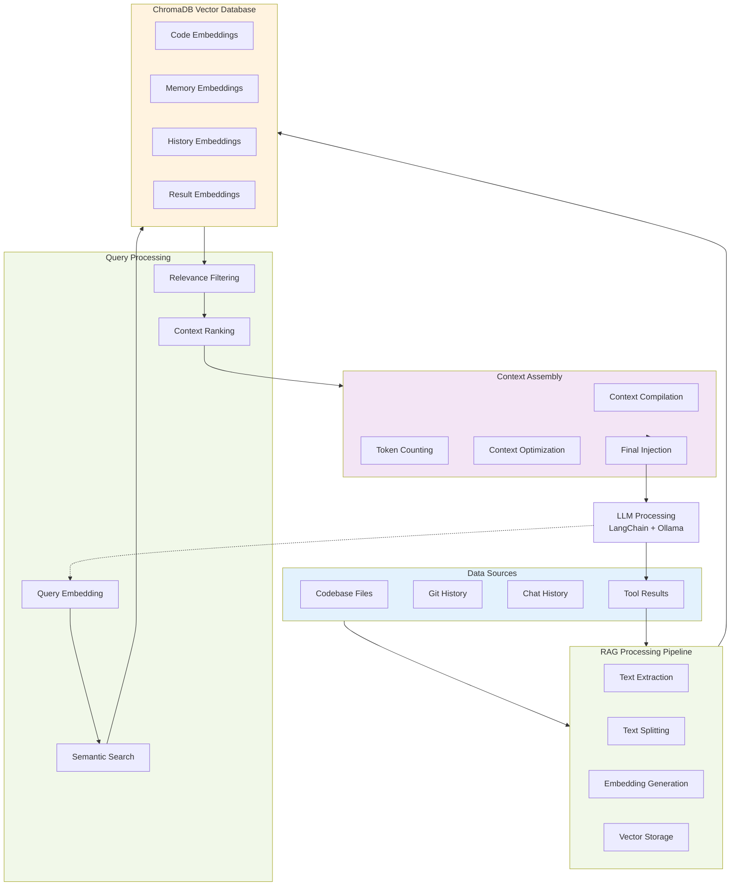

# Local AI Agent Development Plan

## Project Overview

This document outlines the development plan for building an open-source AI coding assistant with local LLM support. The plan includes project analysis, technology comparisons, and a phased development approach.

## Updated Study Approach (Post-Phase 1)

**Study Complete**: Phase 1 analysis revealed that custom protocol development is unnecessary with official TypeScript SDKs.

### Primary References (Official SDKs)

#### 1. Official TypeScript Packages
- **`@langchain/langgraph`** v0.3.11+ ✅ **PRIMARY**
  - Complete LangGraph implementation with TypeScript
  - Built-in checkpointing, parallel execution, streaming
  - LangGraph Studio integration
  - **Result**: Eliminates need for custom agent orchestration

- **`@modelcontextprotocol/sdk`** ✅ **PRIMARY**
  - Official MCP protocol implementation
  - All transport types supported
  - Full TypeScript interfaces
  - **Result**: Eliminates protocol development (645 lines of custom code)

- **`@langchain/mcp-adapters`** ✅ **PRIMARY**
  - Production-ready MCP-LangChain integration
  - MultiServerMCPClient for server management
  - Automatic tool conversion
  - **Result**: Eliminates integration complexity (485 lines of custom code)

#### 2. Reference Implementations (For Understanding Only)
- **`teddynote-lab/langgraph-mcp-agents`** ✅ **STUDIED**
  - Complete Python implementation analyzed in Phase 1
  - 1,699+ lines of custom code that TypeScript SDKs eliminate
  - Demonstrates complexity that official packages solve
  - **Study Complete**: Provided proof of SDK advantages

- **n8n Integration** ❌ **ELIMINATED**
  - Originally planned for micro-workflow management
  - **Phase 1 Finding**: Over-engineering due to LangGraph's built-in capabilities
  - **Decision**: Removed from architecture (simplified approach)

#### 3. RAG & Vector Database Integration (Confirmed Approach)

**ChromaDB + RAG Integration (Confirmed):**
- **`chromadb`** + **`@langchain/community`** ✅ **CONFIRMED**
  - Proven local vector database choice
  - Excellent TypeScript support
  - LangChain integration available
  - **Decision**: Primary RAG solution (no custom implementation needed)

- **`@langchain/textsplitters`** ✅ **CONFIRMED**
  - Official text processing utilities
  - Document chunking and splitting
  - Multiple splitting strategies
  - **Decision**: Use official text processing (no custom splitters)

- **Alternative RAG Frameworks** ❌ **NOT NEEDED**
  - LlamaIndex, Semantic Kernel considered but unnecessary
  - **Phase 1 Finding**: LangChain + ChromaDB provides complete solution
  - **Decision**: Avoid over-engineering with multiple RAG frameworks

#### 4. Prompt Engineering & Context Management (Simplified)

**Prompt Management (Built-in):**
- **LangGraph Built-in Prompt Management** ✅ **SUFFICIENT**
  - Agent prompt templates handled by createReactAgent
  - No need for external prompt flow tools
  - **Decision**: Use LangGraph's built-in prompt handling

- **External Prompt Engineering Tools** ❌ **NOT NEEDED**
  - PromptFlow, LangSmith, etc. add unnecessary complexity
  - **Phase 1 Finding**: Simple prompt templates sufficient for MVP
  - **Decision**: Focus on core functionality first

**Context Management (ChromaDB + LangChain):**
- **Semantic Search with ChromaDB** ✅ **IMPLEMENTATION READY**
  - Vector-based context retrieval
  - Relevance scoring and ranking
  - Metadata filtering for precise context
  - **Decision**: ChromaDB + embeddings for all context management

- **External Context Tools** ℹ️ **REFERENCE ONLY**
  - Continue, Cursor, Aider studied for patterns only
  - **Phase 1 Finding**: Their approaches inform our ChromaDB implementation
  - **Decision**: No need to replicate their custom solutions

#### 5. CLI Framework (Confirmed Choice)

**Ink + TypeScript (Confirmed):**
- **`ink`** + **`@inkjs/ui`** ✅ **CONFIRMED CHOICE**
  - React-based terminal UI framework
  - Professional component library available
  - Proven by major projects (GitHub Copilot, Prisma)
  - **Decision**: Primary UI framework (no alternatives needed)

**CLI Architecture (Simplified):**
- **TypeScript Project Structure** ✅ **PLANNED**
  - Standard TypeScript setup with proper tooling
  - Cross-platform build support
  - **Decision**: Focus on functionality over complex build systems

**Professional Examples (Reference):**
- GitHub Copilot CLI, Prisma CLI provide UI patterns
- **Phase 1 Finding**: Ink is the proven choice for professional terminal UIs
- **Decision**: Follow established Ink patterns

## Technology Comparison Tables

### Vector Database Decision (Final)

| Technology | TypeScript | Local | Performance | Decision | Reason |
|------------|------------|-------|-------------|----------|--------|
| **ChromaDB** | ✅ Native | ✅ Excellent | ⭐⭐⭐⭐⭐ | **✅ CHOSEN** | Perfect for local AI assistant |
| **Pinecone** | ✅ Good | ❌ Cloud-only | ⭐⭐⭐⭐⭐ | ❌ Rejected | Conflicts with local-first approach |
| **Weaviate** | ✅ Good | ✅ Good | ⭐⭐⭐⭐ | ❌ Unnecessary | Over-engineering for our use case |
| **Qdrant** | ✅ Good | ✅ Excellent | ⭐⭐⭐⭐ | ❌ Unnecessary | ChromaDB sufficient for MVP |

### Context Management Strategy (Final Decision)

| Strategy | Implementation | Complexity | Timeline | Decision |
|----------|----------------|------------|----------|----------|
| **ChromaDB Semantic Search** | ✅ Official SDKs | ⭐⭐ Low | Days 3-4 | **✅ CHOSEN** |
| **Graph-based** | ❌ Custom dev | ⭐⭐⭐⭐⭐ High | Weeks | ❌ Rejected (over-engineering) |
| **Simple Heuristics** | ✅ Easy | ⭐ Very Low | Day 1 | ℹ️ Fallback only |
| **Hybrid Approach** | ⚠️ Complex | ⭐⭐⭐⭐ High | Weeks | ❌ Rejected (unnecessary) |

### CLI Framework Comparison

| Framework | TypeScript Support | Terminal UI Quality | Learning Curve | Production Usage | Best For |
|-----------|-------------------|-------------------|----------------|------------------|----------|
| **Ink** | ✅ Native | ⭐⭐⭐⭐⭐ | Medium | GitHub, Prisma, Shopify | Interactive UIs |
| **Oclif** | ✅ First-class | ⭐⭐⭐⭐ | Medium-High | Heroku, Salesforce | Enterprise CLIs |
| **Commander** | ✅ Good | ⭐⭐⭐ | Easy | Widespread | Simple tools |
| **Yargs** | ✅ Good | ⭐⭐⭐ | Easy | Mocha, Jest | Argument parsing |

### Agent Framework Comparison (Updated with Official SDKs)

| Framework | Agent Orchestration | MCP Support | TypeScript | Official SDK | Recommendation |
|-----------|--------------------|--------------|-----------|--------------|-----------------|
| **@langchain/langgraph** | ✅ Excellent (v0.3.11+) | ✅ Native | ✅ First-class | ✅ Official | **✅ PRIMARY CHOICE** |
| **n8n** | ⚠️ Limited | ⚠️ Basic | ⚠️ Limited | ❌ No | ❌ Eliminated (over-engineering) |
| **CrewAI** | ✅ Good | ❌ No | ⚠️ Limited | ❌ No | ❌ Not needed |
| **AutoGen** | ✅ Good | ❌ No | ❌ No | ❌ No | ❌ Not needed |

### Local LLM Integration

| Tool | Ollama Support | Model Management | Performance | TypeScript | Integration Quality |
|------|----------------|------------------|-------------|------------|-------------------|
| **LangChain** | ✅ Excellent | ✅ Good | ⭐⭐⭐⭐ | ✅ Good | ⭐⭐⭐⭐⭐ |
| **Direct Ollama** | ✅ Native | ✅ Excellent | ⭐⭐⭐⭐⭐ | ✅ Good | ⭐⭐⭐ |
| **LiteLLM** | ✅ Good | ✅ Good | ⭐⭐⭐⭐ | ✅ Good | ⭐⭐⭐⭐ |

### RAG Integration Options

| Integration | ChromaDB Support | Context Quality | Setup Complexity | Recommended Use |
|-------------|-----------------|-----------------|------------------|-----------------|
| **LangChain + ChromaDB** | ✅ Native | ⭐⭐⭐⭐⭐ | ⭐⭐⭐ | **Primary Choice** |
| **LlamaIndex + ChromaDB** | ✅ Excellent | ⭐⭐⭐⭐⭐ | ⭐⭐⭐⭐ | Advanced queries |
| **Direct ChromaDB** | ✅ Native | ⭐⭐⭐ | ⭐⭐ | Simple use cases |
| **Semantic Kernel + Memory** | ⚠️ Limited | ⭐⭐⭐⭐ | ⭐⭐⭐⭐⭐ | Enterprise patterns |

### Alternative Approaches Comparison

| Approach | Development Speed | Flexibility | Learning Curve | Maintenance | Recommendation |
|----------|------------------|-------------|----------------|-------------|----------------|
| **Fork Aider** | ⭐⭐⭐⭐⭐ | ⭐⭐ | ⭐⭐⭐⭐ | ⭐⭐ | ❌ Limited scope |
| **Official SDK Stack** | ⭐⭐⭐⭐⭐ | ⭐⭐⭐⭐⭐ | ⭐⭐⭐⭐ | ⭐⭐⭐⭐⭐ | ✅ **Recommended** |
| **Pure Ink/React** | ⭐⭐ | ⭐⭐⭐⭐ | ⭐⭐⭐ | ⭐⭐⭐ | ⚠️ Good for UI only |
| **Web-based Local** | ⭐⭐⭐ | ⭐⭐⭐⭐ | ⭐⭐⭐⭐ | ⭐⭐⭐ | ⚠️ Different paradigm |

## RAG System Data Flow

## Development Phases (Updated: 8-10 Days Total)

### Phase 1: Architecture Study (COMPLETED ✅)
**Goal**: Deep understanding of SDK capabilities and simplification potential

**Key Findings**:
- Official TypeScript SDKs eliminate ~90% of custom implementation work
- @langchain/langgraph v0.3.11+ provides complete agent orchestration
- @modelcontextprotocol/sdk handles all protocol complexity
- @langchain/mcp-adapters provides seamless integration
- n8n integration unnecessary due to LangGraph's built-in capabilities

**Outcome**: Timeline reduced from 14 weeks to 8-10 days

### Phase 2: SDK-First Implementation (Days 1-2)
**Goal**: Project setup with official SDK integration

**Day 1: Foundation Setup**
- TypeScript project scaffolding with correct dependencies
- Install @langchain/langgraph, @modelcontextprotocol/sdk, @langchain/mcp-adapters
- Basic configuration system with Zod validation
- Ollama connection and model setup

**Day 2: Core Integration**
- MultiServerMCPClient setup for MCP integration
- Agent creation using createReactAgent() (1 line vs 485 custom lines)
- Basic tool loading and conversion
- Configuration management system

### Phase 3: Core Features (Days 3-4)
**Goal**: Essential functionality with RAG and streaming

**Day 3: Agent & RAG Implementation**
- LangGraph agent with streaming responses
- ChromaDB integration for RAG system
- Context retrieval and semantic search
- Multi-turn conversation support

**Day 4: Tool Integration**
- MCP tool auto-loading and execution
- File operations (read, write, edit)
- Basic shell command integration
- Tool result processing and display

### Phase 4: UI & Security (Days 5-6)
**Goal**: Professional interface and security hardening

**Day 5: Terminal UI Development**
- Ink-based CLI with real-time streaming display
- Professional UI components with progress indicators
- Interactive command handling
- File diff visualization

**Day 6: Security Implementation**
- 2025 MCP security best practices
- Tool permission scoping and validation
- Input sanitization (prompt injection protection)
- Audit logging for all operations

### Phase 5: Production Ready (Days 7-8)
**Goal**: Testing, optimization, and deployment

**Day 7: Testing & Performance**
- Comprehensive testing suite
- Performance optimization
- Memory usage optimization
- Error handling and recovery

**Day 8: Deployment & Documentation**
- Build and distribution setup
- Installation automation
- Documentation and examples
- Release preparation

## Key Milestones (Updated Timeline)

### Milestone 1: Architecture Study Complete (✅ COMPLETED)
- **Deliverables**:
  - Complete Phase 1 study with SDK analysis
  - Proof of 90% complexity reduction through official packages
  - Updated architecture design (simplified 3-layer)
  - TypeScript implementation plan

### Milestone 2: Core Integration (End of Day 2)
- **Deliverables**:
  - Working project with all official SDKs installed
  - Basic agent creation using createReactAgent
  - MCP integration via MultiServerMCPClient
  - Configuration system with validation

### Milestone 3: Feature Complete (End of Day 6)
- **Deliverables**:
  - Full agent functionality with RAG and streaming
  - Professional Ink-based terminal UI
  - Security hardening with 2025 best practices
  - Comprehensive tool integration

### Milestone 4: Production Ready (End of Day 8)
- **Deliverables**:
  - Fully tested and optimized system
  - Distribution packages and automation
  - Complete documentation
  - Ready for community use

## Risk Assessment (Updated - Significantly Reduced)

### Technical Risks - NOW LOW
- **SDK Integration Complexity**: **LOW** (was High)
  - *Reality*: Official packages handle all complexity
  - *Mitigation*: Follow official documentation and examples
  
- **Performance Issues**: **LOW** (was Medium)
  - *Reality*: Production-optimized SDKs with built-in optimizations
  - *Mitigation*: Leverage SDK performance features

- **Security Vulnerabilities**: **LOW** (was High)
  - *Reality*: Official security frameworks and 2025 best practices
  - *Mitigation*: Use recommended security patterns

### Timeline Risks - DRAMATICALLY REDUCED
- **Learning Curve**: **LOW** (was High)
  - *Reality*: Well-documented APIs instead of protocol development
  - *Mitigation*: 8-10 day timeline allows for learning

- **Integration Challenges**: **ELIMINATED** (was Medium)
  - *Reality*: Official adapters handle all integration
  - *Mitigation*: Use @langchain/mcp-adapters

## Success Criteria

### Technical Success
- [ ] Agent successfully processes natural language requests
- [ ] Local LLM integration works reliably
- [ ] CLI interface matches professional standards
- [ ] Plugin system allows easy extension

### User Experience Success
- [ ] Setup time under 10 minutes
- [ ] Response times under 2 seconds
- [ ] Professional, polished interface
- [ ] Intuitive command structure

### Community Success
- [ ] Open source project with clear documentation
- [ ] Active community participation
- [ ] Plugin ecosystem development
- [ ] Positive user feedback

## Resources and References

### Study Materials
- [LangGraph Documentation](https://langchain-ai.github.io/langgraph/)
- [n8n LangChain Integration](https://docs.n8n.io/advanced-ai/langchain/)
- [Ink Framework Guide](https://github.com/vadimdemedes/ink)
- [MCP Protocol Specification](https://modelcontextprotocol.io/)

### Example Repositories
- [Complete implementation reference](https://github.com/teddynote-lab/langgraph-mcp-agents)
- [MCP adapters library](https://github.com/langchain-ai/langchain-mcp-adapters)
- [Professional CLI examples](https://github.com/vadimdemedes/ink-ui)

### Community Resources
- LangChain Discord
- n8n Community Forum
- Ink GitHub Discussions
- MCP Developer Community

---

*This development plan should be reviewed and updated weekly based on progress and learnings.*