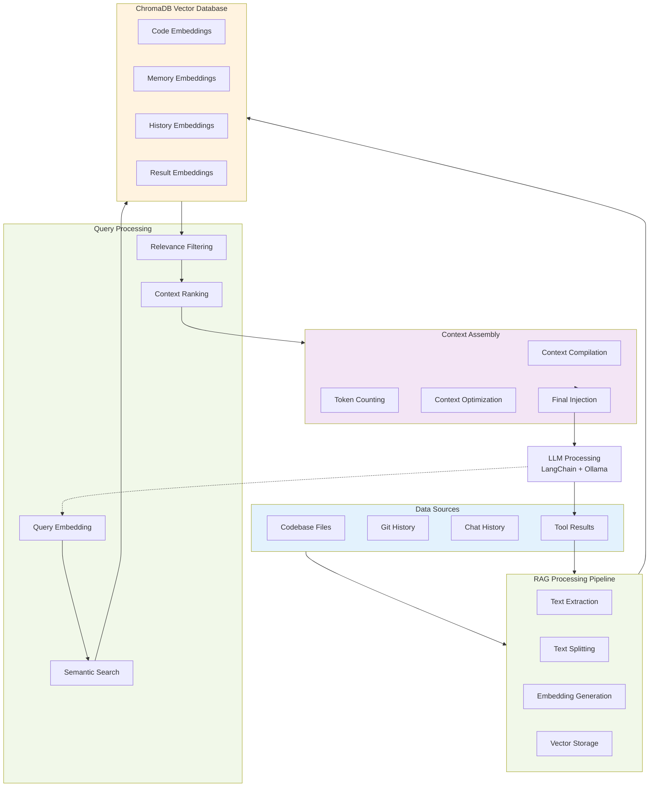

# Local AI Agent Development Plan

## Project Overview

This document outlines the development plan for building an open-source AI coding assistant with local LLM support. The plan includes project analysis, technology comparisons, and a phased development approach.

## Projects to Study

### Core Architecture References

#### 1. LangGraph + MCP Integration
- **`langchain-ai/langchain-mcp-adapters`** ⭐⭐⭐⭐⭐
  - Official MCP integration library
  - Multiple server support
  - Production-ready examples
  - **Study Focus**: MCP integration patterns, multi-server management

- **`teddynote-lab/langgraph-mcp-agents`** ⭐⭐⭐⭐⭐
  - Complete LangGraph + MCP implementation
  - Streamlit web interface
  - Dynamic tool configuration
  - **Study Focus**: Complete architecture, UI patterns, configuration management

- **`cnoe-io/agent-github`** ⭐⭐⭐⭐
  - GitHub AI agent using LangGraph + MCP
  - ReAct agent workflow
  - Multiple transport protocols
  - **Study Focus**: Real-world agent implementation, authentication patterns

#### 2. n8n Integration Examples
- **Supply Chain Automation Example** (Medium article)
  - n8n + LangChain agents
  - Two sub-workflows pattern
  - Production workflow design
  - **Study Focus**: n8n workflow patterns, sub-workflow architecture

- **n8n LangChain Documentation**
  - Official integration guide
  - Component mapping
  - Cluster node architecture
  - **Study Focus**: Best practices, official patterns

#### 3. RAG & Vector Database Integration

**ChromaDB + RAG Projects:**
- **`chroma-core/chroma`** ⭐⭐⭐⭐⭐
  - High-performance vector database
  - Python and TypeScript clients
  - Local and distributed deployment
  - **Study Focus**: Vector storage patterns, similarity search, metadata filtering

- **`langchain-ai/langchainjs`** (RAG examples) ⭐⭐⭐⭐⭐
  - Comprehensive RAG implementations
  - Multiple vector store integrations
  - Document loaders and text splitters
  - **Study Focus**: RAG pipelines, document processing, retrieval strategies

- **`run-llama/LlamaIndexTS`** ⭐⭐⭐⭐
  - TypeScript RAG framework
  - Advanced indexing strategies
  - Query engine patterns
  - **Study Focus**: Index construction, query optimization, context ranking

- **`microsoft/semantic-kernel`** ⭐⭐⭐⭐
  - Enterprise RAG patterns
  - Memory management
  - Plugin architecture with RAG
  - **Study Focus**: Memory systems, semantic search, enterprise patterns

#### 4. Prompt Engineering & Context Management

**Prompt Engineering Projects:**
- **`microsoft/promptflow`** ⭐⭐⭐⭐⭐
  - Visual prompt engineering
  - Flow-based prompt chains
  - A/B testing for prompts
  - **Study Focus**: Prompt chaining, evaluation metrics, flow design

- **`langchain-ai/langsmith`** ⭐⭐⭐⭐
  - Prompt tracking and versioning
  - Performance analytics
  - Prompt optimization tools
  - **Study Focus**: Prompt lifecycle management, optimization strategies

- **`anthropics/prompt-eng-interactive-tutorial`** ⭐⭐⭐⭐
  - Interactive prompt engineering guide
  - Best practices and patterns
  - Common pitfalls and solutions
  - **Study Focus**: Prompt design principles, iterative improvement

**Context Management Projects:**
- **`continuedev/continue`** ⭐⭐⭐⭐⭐
  - VS Code AI extension
  - Advanced context gathering
  - Codebase understanding
  - **Study Focus**: IDE integration, context selection, relevance scoring

- **`getcursor/cursor`** (analyze approach) ⭐⭐⭐⭐⭐
  - AI-first code editor
  - Contextual code understanding
  - Multi-file reasoning
  - **Study Focus**: Context window management, code relationship mapping

- **`Aider-AI/aider`** ⭐⭐⭐⭐
  - Git-aware AI coding assistant
  - Intelligent context selection
  - Repository understanding
  - **Study Focus**: Git integration, change tracking, context pruning

- **`paul-gauthier/aider`** ⭐⭐⭐⭐
  - Advanced context management
  - Token-efficient strategies
  - Multi-turn conversation context
  - **Study Focus**: Context compression, relevance ranking, memory management

#### 5. CLI Framework Examples

**Ink-based Projects:**
- **`vadimdemedes/ink`** ⭐⭐⭐⭐⭐
  - Core React terminal framework
  - Component examples
  - Animation capabilities
  - **Study Focus**: Terminal UI patterns, component architecture

- **`vadimdemedes/ink-ui`** ⭐⭐⭐⭐
  - Professional UI component library
  - Form inputs, progress bars, status messages
  - Theming system
  - **Study Focus**: Professional UI components, theming

**TypeScript CLI Projects:**
- **`khalidx/typescript-cli-starter`** ⭐⭐⭐
  - Zero-opinion TypeScript starter
  - Cross-platform builds
  - Professional setup
  - **Study Focus**: Project structure, build system

- **`bitjson/typescript-starter`** ⭐⭐⭐⭐
  - Comprehensive TypeScript setup
  - Documentation generation
  - Testing infrastructure
  - **Study Focus**: Development workflow, tooling

**Professional CLI Examples:**
- **GitHub Copilot CLI** (uses Ink)
- **Prisma CLI** (uses Ink)
- **Shopify CLI** (oclif-based)

## Technology Comparison Tables

### RAG & Vector Database Comparison

| Technology | TypeScript Support | Local Deployment | Performance | Embedding Models | Best For |
|------------|-------------------|------------------|-------------|-----------------|----------|
| **ChromaDB** | ✅ Native | ✅ Excellent | ⭐⭐⭐⭐⭐ | Multiple | Local development |
| **Pinecone** | ✅ Good | ❌ Cloud-only | ⭐⭐⭐⭐⭐ | OpenAI, Custom | Production scale |
| **Weaviate** | ✅ Good | ✅ Good | ⭐⭐⭐⭐ | Multiple | Hybrid search |
| **Qdrant** | ✅ Good | ✅ Excellent | ⭐⭐⭐⭐ | Multiple | High performance |

### Context Management Strategies

| Strategy | Memory Efficiency | Relevance Quality | Implementation Complexity | Best For |
|----------|------------------|-------------------|--------------------------|----------|
| **Semantic Search** | ⭐⭐⭐ | ⭐⭐⭐⭐⭐ | ⭐⭐⭐ | Code similarity |
| **Graph-based** | ⭐⭐ | ⭐⭐⭐⭐ | ⭐⭐⭐⭐⭐ | Code relationships |
| **Recency + Frequency** | ⭐⭐⭐⭐⭐ | ⭐⭐⭐ | ⭐⭐ | Simple heuristics |
| **Hybrid Approach** | ⭐⭐⭐ | ⭐⭐⭐⭐⭐ | ⭐⭐⭐⭐ | **Recommended** |

### CLI Framework Comparison

| Framework | TypeScript Support | Terminal UI Quality | Learning Curve | Production Usage | Best For |
|-----------|-------------------|-------------------|----------------|------------------|----------|
| **Ink** | ✅ Native | ⭐⭐⭐⭐⭐ | Medium | GitHub, Prisma, Shopify | Interactive UIs |
| **Oclif** | ✅ First-class | ⭐⭐⭐⭐ | Medium-High | Heroku, Salesforce | Enterprise CLIs |
| **Commander** | ✅ Good | ⭐⭐⭐ | Easy | Widespread | Simple tools |
| **Yargs** | ✅ Good | ⭐⭐⭐ | Easy | Mocha, Jest | Argument parsing |

### Agent Framework Comparison

| Framework | Macro-Workflow | Micro-Workflow | MCP Support | TypeScript | Maturity |
|-----------|----------------|----------------|-------------|------------|----------|
| **LangGraph** | ✅ Excellent | ❌ No | ✅ Native | ✅ Good | High |
| **n8n** | ⚠️ Limited | ✅ Excellent | ⚠️ Basic | ⚠️ Limited | High |
| **CrewAI** | ✅ Good | ❌ No | ❌ No | ⚠️ Limited | Medium |
| **AutoGen** | ✅ Good | ❌ No | ❌ No | ❌ No | Medium |

### Local LLM Integration

| Tool | Ollama Support | Model Management | Performance | TypeScript | Integration Quality |
|------|----------------|------------------|-------------|------------|-------------------|
| **LangChain** | ✅ Excellent | ✅ Good | ⭐⭐⭐⭐ | ✅ Good | ⭐⭐⭐⭐⭐ |
| **Direct Ollama** | ✅ Native | ✅ Excellent | ⭐⭐⭐⭐⭐ | ✅ Good | ⭐⭐⭐ |
| **LiteLLM** | ✅ Good | ✅ Good | ⭐⭐⭐⭐ | ✅ Good | ⭐⭐⭐⭐ |

### RAG Integration Options

| Integration | ChromaDB Support | Context Quality | Setup Complexity | Recommended Use |
|-------------|-----------------|-----------------|------------------|-----------------|
| **LangChain + ChromaDB** | ✅ Native | ⭐⭐⭐⭐⭐ | ⭐⭐⭐ | **Primary Choice** |
| **LlamaIndex + ChromaDB** | ✅ Excellent | ⭐⭐⭐⭐⭐ | ⭐⭐⭐⭐ | Advanced queries |
| **Direct ChromaDB** | ✅ Native | ⭐⭐⭐ | ⭐⭐ | Simple use cases |
| **Semantic Kernel + Memory** | ⚠️ Limited | ⭐⭐⭐⭐ | ⭐⭐⭐⭐⭐ | Enterprise patterns |

### Alternative Approaches Comparison

| Approach | Development Speed | Flexibility | Learning Curve | Maintenance | Recommendation |
|----------|------------------|-------------|----------------|-------------|----------------|
| **Fork Aider** | ⭐⭐⭐⭐⭐ | ⭐⭐ | ⭐⭐⭐⭐ | ⭐⭐ | ❌ Limited scope |
| **LangGraph + n8n** | ⭐⭐⭐ | ⭐⭐⭐⭐⭐ | ⭐⭐ | ⭐⭐⭐⭐ | ✅ **Recommended** |
| **Pure Ink/React** | ⭐⭐ | ⭐⭐⭐⭐ | ⭐⭐⭐ | ⭐⭐⭐ | ⚠️ Good for UI only |
| **Web-based Local** | ⭐⭐⭐ | ⭐⭐⭐⭐ | ⭐⭐⭐⭐ | ⭐⭐⭐ | ⚠️ Different paradigm |

## RAG System Data Flow

## Development Phases

### Phase 1: Architecture Study (Weeks 1-2)
**Goal**: Deep understanding of reference implementations

#### Week 1: Core Architecture Analysis
- **Day 1-2**: Study `teddynote-lab/langgraph-mcp-agents`
  - Clone and run the complete implementation
  - Analyze LangGraph + MCP integration patterns
  - Document component interactions
  
- **Day 3-4**: Study `langchain-mcp-adapters`
  - Understand official MCP integration
  - Analyze multi-server management
  - Test with different MCP servers
  
- **Day 5-7**: Study n8n LangChain integration
  - Set up n8n locally
  - Build example workflows
  - Understand cluster node architecture

#### Week 2: UI Framework Analysis  
- **Day 1-3**: Ink framework deep dive
  - Study `vadimdemedes/ink` examples
  - Analyze `vadimdemedes/ink-ui` components
  - Build test CLI applications
  
- **Day 4-5**: Professional CLI analysis
  - Study TypeScript CLI starters
  - Analyze build and deployment patterns
  - Document best practices
  
- **Day 6-7**: Integration planning
  - Design component architecture
  - Plan data flow patterns
  - Create technical specifications

### Phase 2: MVP Development (Weeks 3-6)
**Goal**: Basic working system with core functionality

#### Week 3: Foundation Setup
- Project scaffolding with TypeScript + Ink
- Basic LangGraph integration
- Ollama connection setup
- Core configuration system

#### Week 4: Agent Implementation
- Context agent development
- Basic reasoning agent
- Simple tool agent
- MCP server integration

#### Week 5: Workflow Integration
- n8n setup and configuration
- Basic micro-workflows
- LangGraph + n8n integration
- Error handling and recovery

#### Week 6: CLI Interface
- Ink-based terminal UI
- Basic chat interface
- Progress indicators
- Command handling

### Phase 3: Feature Development (Weeks 7-10)
**Goal**: Claude Code feature parity

#### Week 7: File Operations
- Project file discovery
- Context management
- File editing capabilities
- Diff visualization

#### Week 8: Tool Integration
- Shell command execution
- Git integration
- Web search capabilities
- Tool result processing

#### Week 9: Advanced Features
- Streaming responses
- Multi-turn conversations
- Session management
- Configuration management

#### Week 10: Polish and Testing
- UI/UX improvements
- Error handling refinement
- Performance optimization
- Documentation

### Phase 4: Advanced Features (Weeks 11-14)
**Goal**: Professional-grade features

#### Week 11: Plugin System
- MCP server management
- Custom tool development
- Plugin discovery and installation

#### Week 12: Model Management
- Multiple model support
- Model switching
- Performance optimization
- Memory management

#### Week 13: Developer Experience
- Setup automation
- Integration guides
- Troubleshooting tools
- Community features

#### Week 14: Release Preparation
- Packaging and distribution
- Documentation completion
- Community outreach
- Initial release

## Key Milestones

### Milestone 1: Architecture Validation (End of Week 2)
- **Deliverables**:
  - Complete architecture study report
  - Technical specification document
  - Component interaction diagrams
  - Risk assessment and mitigation plans

### Milestone 2: MVP Completion (End of Week 6)
- **Deliverables**:
  - Working prototype with basic agent functionality
  - Ollama integration
  - Simple CLI interface
  - Core workflow implementations

### Milestone 3: Feature Complete (End of Week 10)
- **Deliverables**:
  - Claude Code feature parity
  - Professional CLI interface
  - Comprehensive tool integration
  - Documentation and examples

### Milestone 4: Production Ready (End of Week 14)
- **Deliverables**:
  - Stable, tested release
  - Plugin architecture
  - Community documentation
  - Distribution packages

## Risk Assessment

### Technical Risks
- **LangGraph + n8n integration complexity**: Medium risk
  - *Mitigation*: Start with simple integration, gradually increase complexity
  
- **Ink UI performance with complex interfaces**: Low risk
  - *Mitigation*: Profile early, optimize rendering patterns

- **MCP server reliability**: Medium risk
  - *Mitigation*: Implement robust error handling, fallback mechanisms

### Timeline Risks
- **Learning curve for new technologies**: High risk
  - *Mitigation*: Dedicate sufficient time to study phase

- **Integration challenges**: Medium risk
  - *Mitigation*: Build incrementally, test frequently

## Success Criteria

### Technical Success
- [ ] Agent successfully processes natural language requests
- [ ] Local LLM integration works reliably
- [ ] CLI interface matches professional standards
- [ ] Plugin system allows easy extension

### User Experience Success
- [ ] Setup time under 10 minutes
- [ ] Response times under 2 seconds
- [ ] Professional, polished interface
- [ ] Intuitive command structure

### Community Success
- [ ] Open source project with clear documentation
- [ ] Active community participation
- [ ] Plugin ecosystem development
- [ ] Positive user feedback

## Resources and References

### Study Materials
- [LangGraph Documentation](https://langchain-ai.github.io/langgraph/)
- [n8n LangChain Integration](https://docs.n8n.io/advanced-ai/langchain/)
- [Ink Framework Guide](https://github.com/vadimdemedes/ink)
- [MCP Protocol Specification](https://modelcontextprotocol.io/)

### Example Repositories
- [Complete implementation reference](https://github.com/teddynote-lab/langgraph-mcp-agents)
- [MCP adapters library](https://github.com/langchain-ai/langchain-mcp-adapters)
- [Professional CLI examples](https://github.com/vadimdemedes/ink-ui)

### Community Resources
- LangChain Discord
- n8n Community Forum
- Ink GitHub Discussions
- MCP Developer Community

---

*This development plan should be reviewed and updated weekly based on progress and learnings.*