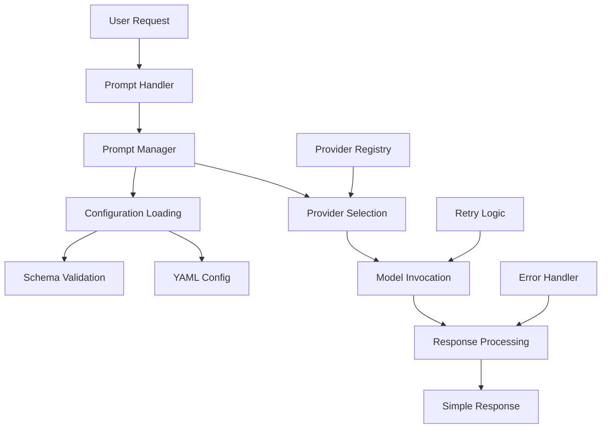

# Prompt Module - Design Guide

## 🎯 Purpose

The Prompt module provides simple, user-friendly LLM interactions with multi-provider support, abstracting away complex backend patterns to deliver a clean promise-based API for conversational AI and code generation tasks.

## 📋 Requirements

### Functional Requirements
1. **Simple API**: Promise-based interface hiding complex Result<T> patterns
2. **Multi-Provider Support**: Support for Ollama, OpenAI, and other LLM providers
3. **Configuration Management**: YAML-based configuration with schema validation
4. **Error Handling**: Comprehensive timeout, retry, and fallback logic
5. **Provider Discovery**: Automatic detection of available providers
6. **Response Streaming**: Real-time token streaming for better user experience

### Non-Functional Requirements
1. **Performance**: <500ms response time for local providers (Ollama)
2. **Reliability**: 99% success rate for well-formed prompts
3. **Usability**: Zero-configuration default setup with Ollama
4. **Maintainability**: Clear separation between user interface and provider integration
5. **Extensibility**: Easy addition of new LLM providers

## 🏗️ Architecture Design

### Core Components



### Component Responsibilities

#### 1. Prompt Handler (User Interface)
- **Purpose**: Main user-facing interface for prompt processing
- **Responsibilities**:
  - Provide simple promise-based API
  - Handle user authentication and session management
  - Convert complex backend responses to simple success/error format
  - Manage provider preferences and defaults

#### 2. Prompt Manager (Provider Integration)
- **Purpose**: Bridge between user interface and provider implementations
- **Responsibilities**:
  - Load and validate YAML configuration
  - Initialize and manage LLM providers
  - Route requests to appropriate providers
  - Handle provider failover and load balancing

#### 3. Configuration System
- **Purpose**: Manage provider configurations and user preferences
- **Responsibilities**:
  - Parse YAML configuration files
  - Validate configuration against JSON schemas
  - Support environment variable substitution
  - Provide configuration hot-reloading

#### 4. Provider Abstraction
- **Purpose**: Uniform interface for different LLM providers
- **Responsibilities**:
  - Abstract provider-specific APIs
  - Handle authentication and rate limiting
  - Normalize response formats
  - Provide capability introspection

## 📊 Interfaces and Contracts

### Core Interfaces

```typescript
// Main user-facing interface
interface IPromptHandler {
  complete(prompt: string, options?: PromptOptions): Promise<PromptResponse>
  stream(prompt: string, options?: PromptOptions): AsyncIterableIterator<PromptStreamChunk>
  getAvailableProviders(): Promise<ProviderInfo[]>
  validateProvider(providerId: string): Promise<boolean>
  initialize(configPath: string, schemaPath: string): Promise<InitializationResult>
}

// Simple response format (no complex Result<T> patterns)
type PromptResponse = 
  | { success: true; data: string; metadata?: ResponseMetadata }
  | { success: false; error: string; suggestions?: string[] }

interface PromptOptions {
  provider?: string              // 'ollama', 'openai', etc.
  model?: string                // Model name
  temperature?: number          // 0.0 - 1.0
  maxTokens?: number           // Token limit
  timeout?: number             // Request timeout in ms
  retryCount?: number          // Number of retries
}
```

### Provider Management

```typescript
// Provider information and capabilities
interface ProviderInfo {
  id: string
  name: string
  type: 'local' | 'cloud' | 'api'
  status: 'available' | 'unavailable' | 'error'
  capabilities: ProviderCapabilities
  models: ModelInfo[]
  metrics?: ProviderMetrics
}

interface ProviderCapabilities {
  streaming: boolean
  functionCalling: boolean
  imageInput: boolean
  maxContextLength: number
  supportedFormats: string[]
}

interface ModelInfo {
  name: string
  displayName: string
  contextLength: number
  isDefault: boolean
  capabilities: string[]
}
```

### Configuration Structure

```typescript
interface PromptConfiguration {
  providers: Record<string, ProviderConfig>
  defaults: {
    provider: string
    model?: string
    temperature: number
    maxTokens: number
    timeout: number
  }
  features: {
    enableStreaming: boolean
    enableRetries: boolean
    enableFallback: boolean
  }
}

interface ProviderConfig {
  type: string
  baseUrl?: string
  apiKey?: string
  timeout: number
  models: ModelConfig[]
  features?: ProviderFeatures
}
```

## 🔄 Data Flow and Processing

### Request Processing Flow

```typescript
// High-level processing pipeline
interface ProcessingPipeline {
  // Stage 1: Input Validation and Preprocessing
  validateInput: (prompt: string, options?: PromptOptions) => ValidationResult
  
  // Stage 2: Provider Selection and Model Configuration
  selectProvider: (options?: PromptOptions) => ProviderSelection
  
  // Stage 3: Request Execution with Error Handling
  executeRequest: (provider: Provider, request: PromptRequest) => Promise<ProviderResponse>
  
  // Stage 4: Response Processing and Formatting
  processResponse: (response: ProviderResponse) => Promise<PromptResponse>
  
  // Stage 5: Error Handling and Retry Logic
  handleErrors: (error: Error, context: RequestContext) => Promise<PromptResponse>
}
```

### Provider Selection Logic

```typescript
interface ProviderSelectionStrategy {
  // Primary selection criteria
  userPreference: string | undefined
  availability: Record<string, boolean>
  capabilities: Record<string, ProviderCapabilities>
  
  // Fallback strategy
  fallbackOrder: string[]
  loadBalancing: 'round-robin' | 'least-loaded' | 'random'
  
  // Selection algorithm
  selectProvider(requirements: ProviderRequirements): ProviderSelection
}
```

## 🛡️ Error Handling and Resilience

### Error Categories

```typescript
interface ErrorHandlingStrategy {
  // Network and connectivity errors
  networkErrors: {
    timeout: RetryStrategy
    connectionRefused: FallbackStrategy
    networkUnreachable: FallbackStrategy
  }
  
  // Provider-specific errors
  providerErrors: {
    authenticationFailed: UserActionRequired
    rateLimited: BackoffStrategy
    modelUnavailable: ModelFallbackStrategy
    invalidRequest: UserErrorResponse
  }
  
  // System errors
  systemErrors: {
    outOfMemory: GracefulDegradation
    configurationError: DefaultConfiguration
    unexpectedError: SafeFailure
  }
}

interface RetryStrategy {
  maxAttempts: number
  backoffMultiplier: number
  maxBackoffTime: number
  retryableErrors: string[]
}
```

### Resilience Patterns

```typescript
interface ResilienceConfiguration {
  // Circuit breaker pattern
  circuitBreaker: {
    failureThreshold: number
    resetTimeout: number
    monitoringPeriod: number
  }
  
  // Timeout management
  timeouts: {
    connection: number
    request: number
    total: number
  }
  
  // Fallback strategies
  fallbacks: {
    providerFallback: boolean
    modelFallback: boolean
    simplifiedResponse: boolean
  }
}
```

## 🎯 Design Principles

### 1. Simplicity Over Complexity
- Hide complex Result<T> patterns behind simple success/error responses
- Provide sensible defaults that work out of the box
- Minimize configuration required for basic usage

### 2. Provider Agnostic Design
- Uniform interface regardless of underlying provider
- Easy switching between local and cloud providers
- Automatic capability detection and adaptation

### 3. Graceful Degradation
- Fallback to alternative providers on failure
- Simplified responses when advanced features unavailable
- Clear error messages with actionable suggestions

### 4. Performance and Efficiency
- Connection pooling and reuse
- Request/response caching where appropriate
- Streaming support for real-time interaction

## 🔍 Quality Attributes

### Performance Requirements

| Metric | Local (Ollama) | Cloud (OpenAI) | Target |
|--------|----------------|----------------|--------|
| Response Time | <500ms | <2000ms | <1000ms avg |
| Streaming Latency | <50ms | <200ms | <100ms avg |
| Throughput | >10 req/s | Provider-limited | >5 req/s |
| Memory Usage | <20MB | <10MB | <50MB total |

### Reliability Requirements

| Attribute | Requirement | Measurement |
|-----------|-------------|-------------|
| Availability | 99.9% | Excluding provider downtime |
| Error Rate | <1% | For well-formed requests |
| Recovery Time | <30s | From provider failures |
| Data Integrity | 100% | No request/response corruption |

### Usability Requirements
- **Zero Configuration**: Works with default Ollama setup
- **Clear Errors**: Human-readable error messages with suggestions
- **Progressive Enhancement**: Advanced features available when supported
- **Documentation**: Comprehensive examples and API documentation

## 🚀 Success Criteria

### Functional Success
- ✅ Support multiple LLM providers with uniform interface
- ✅ Provide simple promise-based API hiding backend complexity
- ✅ Handle provider failures gracefully with automatic fallback
- ✅ Support both synchronous responses and streaming

### Technical Success
- ✅ Meet performance requirements for local and cloud providers
- ✅ Maintain high reliability with comprehensive error handling
- ✅ Enable easy addition of new providers without API changes
- ✅ Provide clear separation between user interface and provider logic

### User Experience Success
- ✅ Work out of the box with minimal configuration
- ✅ Provide clear feedback on errors and provider status
- ✅ Support common use cases with simple API calls
- ✅ Enable advanced usage through optional parameters

## 🔮 Evolution Path

### Phase 1: Core Functionality (Current)
- ✅ Basic Ollama provider support
- ✅ Simple promise-based API
- ✅ YAML configuration system
- ✅ Error handling and retry logic

### Phase 2: Provider Expansion (Near Term)
- 🎯 OpenAI and Anthropic provider support
- 🎯 Streaming response implementation
- 🎯 Advanced error handling and fallback
- 🎯 Provider capability detection

### Phase 3: Advanced Features (Medium Term)
- 🎯 Function calling and tool integration
- 🎯 Conversation context management
- 🎯 Response caching and optimization
- 🎯 Advanced provider load balancing

### Phase 4: Intelligence Features (Long Term)
- 🎯 Automatic provider selection based on task
- 🎯 Response quality optimization
- 🎯 Cost optimization across providers
- 🎯 Custom model fine-tuning integration

This design provides a solid foundation for a user-friendly prompt processing system that can evolve from basic local LLM support to sophisticated multi-provider AI orchestration while maintaining simplicity and reliability.