# Qi-Prompt v0.6.1 - Detailed Architecture Documentation

## Overview

Qi-Prompt v0.6.1 implements a **Pure Message-Driven Architecture** inspired by the h2A pattern, eliminating EventEmitter race conditions through sequential message processing. This document provides detailed logical structure and message flow patterns.

## Core Architecture Principles

### 1. Message-Driven Coordination
- **No EventEmitter**: All communication through message queue
- **Sequential Processing**: Single message processing loop prevents race conditions
- **Asynchronous Flow**: Non-blocking message handling with Promise-based iteration

### 2. Component Isolation
- **Clear Boundaries**: Each component has specific message responsibilities
- **Loose Coupling**: Components communicate only through message queue
- **Single Responsibility**: Each component handles one aspect of the system

### 3. Functional Patterns
- **QiCore Integration**: Uses Result<T> patterns for error handling
- **Immutable Messages**: Messages are read-only after creation
- **Pure Functions**: Message processors are side-effect free where possible

## System Architecture Overview

### System Architecture Overview

```mermaid
flowchart TD
    User([👤 Developer]) --> CLI[🖥️ CLI Framework<br/>React/Ink UI]
    
    subgraph "Qi-Prompt Application"
        CLI --> Queue[📬 Message Queue<br/>h2A Async Iterator]
        Queue --> App[⚙️ QiPromptApp<br/>Main Coordinator]
        App --> Orchestrator[🎯 Orchestrator<br/>Request Router]
        Orchestrator --> Workflows[📋 Workflows<br/>Context Manager]
        StateManager[🏛️ State Manager<br/>Config & Session Store]
        App --> StateManager
        Orchestrator --> StateManager
        CLI --> StateManager
    end
    
    Orchestrator --> LLM[🤖 LLM Provider<br/>Ollama/OpenAI]
    StateManager --> Storage[(💾 Context Storage<br/>History & Project Data)]
    
    LLM --> Orchestrator
    Orchestrator --> CLI
    
    classDef userNode fill:#e1f5fe,stroke:#01579b,stroke-width:2px
    classDef appNode fill:#f3e5f5,stroke:#4a148c,stroke-width:2px
    classDef stateNode fill:#e8f5e8,stroke:#2e7d32,stroke-width:3px
    classDef extNode fill:#fff3e0,stroke:#e65100,stroke-width:2px
    
    class User userNode
    class CLI,Queue,App,Orchestrator,Workflows appNode
    class StateManager stateNode
    class LLM,Storage extNode
```



### Component Architecture


### Message Flow Sequence


### Class Relationship Diagram


## Message Flow Architecture

### 1. Message Types and Responsibilities

```typescript
enum MessageType {
  USER_INPUT = 'user_input',           // Raw user input from CLI
  AGENT_OUTPUT = 'agent_output',       // LLM responses to display
  SYSTEM_CONTROL = 'system_control',   // Lifecycle management
  CLI_MESSAGE_RECEIVED = 'cli_message_received',  // UI state updates
}
```

**Message Ownership:**
- `USER_INPUT`: Created by InkCLIFramework, consumed by QiPromptCLI
- `AGENT_OUTPUT`: Created by QiPromptCLI, consumed by InkCLIFramework
- `SYSTEM_CONTROL`: Created by QiPromptCLI, consumed by system components
- `CLI_MESSAGE_RECEIVED`: Internal CLI framework communication

**State Management Integration:**
- `StateManager`: Central store for configuration, session data, and conversation history
- Components read configuration and current state from StateManager
- StateManager handles LLM provider configuration and model selection
- Conversation history is automatically maintained in StateManager
- State changes trigger notifications to subscribed components

### 2. Critical Message Flow Patterns

#### Pattern 1: User Input Processing (Primary Flow)
```
┌─────────────┐    USER_INPUT     ┌─────────────┐
│InkCLI       │ ────────────────► │QiPromptCLI  │
│Framework    │                   │             │
└─────────────┘                   └─────────────┘
                                         │
                                         ▼
                                  ┌─────────────┐
                                  │PromptApp    │
                                  │Orchestrator │
                                  └─────────────┘
                                         │
                                         ▼ (LLM Response)
                                  ┌─────────────┐
                                  │QiPromptCLI  │
                                  │.displayMsg()│ ◄─── DIRECT DISPLAY
                                  └─────────────┘
                                         │
                                         ▼
                                  ┌─────────────┐
                                  │InkCLI       │
                                  │Framework    │
                                  └─────────────┘
```

**Key Rule**: LLM responses are displayed **directly** without re-enqueueing to prevent loops.

#### Pattern 2: State Management Flow
```
┌─────────────┐    Config Read    ┌─────────────┐
│QiPromptCLI  │ ────────────────► │StateManager │
│             │                   │             │
└─────────────┘                   └─────────────┘
       ▲                                  │
       │                                  ▼
       │                           ┌─────────────┐
       │                           │Conversation │
       │                           │History      │
       │                           └─────────────┘
       │                                  │
       │          State Update            │
       └──────────────────────────────────┘

┌─────────────┐   Model Config    ┌─────────────┐
│Orchestrator │ ◄───────────────► │StateManager │
│             │                   │             │
└─────────────┘                   └─────────────┘
```

#### Pattern 3: System Control Flow
```
┌─────────────┐  SYSTEM_CONTROL  ┌─────────────┐
│QiPromptCLI  │ ────────────────► │QiAsyncMsgQ  │
│             │                   │             │
└─────────────┘                   └─────────────┘
                                         │
                                         ▼
                                  ┌─────────────┐
                                  │Component    │
                                  │Shutdown     │
                                  └─────────────┘
```

### 3. Message Queue Implementation Details

#### h2A-Inspired Async Iterator Pattern
```typescript
class QiAsyncMessageQueue<T extends QiMessage> {
  // Core iterator - implements h2A non-blocking pattern
  async *[Symbol.asyncIterator](): AsyncIterator<T> {
    while (!this.state.isDone) {
      const message = await this.waitForMessage();
      if (message) yield message;
    }
  }

  // Non-blocking message waiting
  private async waitForMessage(): Promise<T | null> {
    // If message available, return immediately
    if (this.queue.length > 0) {
      return this.dequeue();
    }
    
    // Otherwise, wait for new message
    return new Promise((resolve) => {
      this.readResolve = resolve;
    });
  }
}
```

**Critical Design Decision**: Queue can only be iterated **once** to prevent duplicate processing.

## Component Detailed Specifications

### 1. QiPromptCLI (Core Message Processor)

**Responsibilities:**
- Single message processing loop using `for await`
- Route USER_INPUT to PromptAppOrchestrator
- Display responses directly (no re-enqueueing)
- Handle system lifecycle messages

**Message Processing Logic:**
```typescript
private async processMessage(message: QiMessage): Promise<void> {
  switch (message.type) {
    case MessageType.USER_INPUT:
      // Process through orchestrator
      const result = await this.orchestrator.process(request);
      
      // CRITICAL: Display directly, do NOT enqueue AGENT_OUTPUT
      this.cli.displayMessage(result.content);
      break;
      
    case MessageType.AGENT_OUTPUT:
      // Legacy support - should be rare in normal flow
      this.cli.displayMessage(message.content);
      break;
  }
}
```

**Anti-Pattern Prevented:**
```typescript
// ❌ WRONG - Creates infinite loop
const agentOutputMessage = { type: MessageType.AGENT_OUTPUT, ... };
this.messageQueue.enqueue(agentOutputMessage);

// ✅ CORRECT - Direct display
this.cli.displayMessage(result.content);
```

### 2. StateManager (Central State Store)

**Responsibilities:**
- Manage application configuration (models, providers, settings)
- Maintain session data and conversation history
- Handle LLM provider configuration and credentials
- Provide state change notifications to components
- Store user preferences and context information

**Core State Components:**
```typescript
interface StateManager {
  // Configuration Management
  getConfig(): AppConfig
  updateConfig(updates: Partial<AppConfig>): void
  loadLLMConfig(configPath: string): Promise<void>
  
  // Model Management
  getCurrentModel(): string
  setCurrentModel(modelId: string): void
  getPromptConfig(): LLMRoleConfig | null
  updatePromptModel(model: string): void
  updatePromptProvider(provider: string): void
  
  // Session Management
  getCurrentSession(): SessionData
  createSession(userId?: string): SessionData
  addConversationEntry(entry): void
  clearConversationHistory(): void
  
  // State Notifications
  subscribe(listener: StateChangeListener): () => void
}
```

**State Change Patterns:**
- **Configuration Changes**: Model selection, provider switching
- **Session Updates**: New conversation entries, context changes
- **Mode Transitions**: Processing state, error states
- **Notification System**: Observer pattern for component updates

**Integration Points:**
- `QiPromptApp`: Initializes StateManager during startup
- `QiPromptCLI`: Reads current model config for request processing
- `InkCLIFramework`: Updates processing state and UI state
- `PromptAppOrchestrator`: Gets LLM configuration and adds conversation history

### 3. QiAsyncMessageQueue (h2A Message Hub)

**Design Principles:**
- **Single Producer, Single Consumer**: One iterator, multiple enqueuers
- **Priority Queuing**: High-priority messages processed first
- **TTL Support**: Messages expire to prevent memory leaks
- **Statistics**: Performance monitoring built-in

**Key Safeguards:**
```typescript
[Symbol.asyncIterator](): AsyncIterator<T> {
  if (this.state.started) {
    throw new Error('Queue can only be iterated once');
  }
  this.state.started = true;
  return this;
}
```

**Message Lifecycle:**
1. **Enqueue**: Message added to priority queue
2. **Dequeue**: Retrieved by iterator when available
3. **Processing**: Marked as in-progress
4. **Completion**: Marked as completed or error
5. **Cleanup**: TTL-based automatic cleanup

### 3. PromptAppOrchestrator (Routing Logic)

**Input Classification:**
```typescript
export function parseInput(input: string): ParsedInput {
  const trimmed = input.trim();
  
  if (trimmed.startsWith('/')) {
    return { type: 'command', content: trimmed.slice(1) };
  }
  
  if (trimmed.includes('@') && (trimmed.includes('.') || trimmed.includes('/'))) {
    return { type: 'workflow', content: trimmed };
  }
  
  return { type: 'prompt', content: trimmed };
}
```

**Processing Pipeline:**
1. **Parse Input**: Classify as command, workflow, or prompt
2. **Route to Handler**: CommandHandler, WorkflowHandler, or PromptHandler
3. **Context Management**: Maintain conversation history
4. **Response Generation**: Return formatted response

### 4. InkCLIFramework (UI Management)

**Message Integration:**
```typescript
private handleUserInput(input: string): void {
  if (this.messageQueue) {
    this.messageQueue.enqueue({
      type: MessageType.USER_INPUT,
      id: generateUniqueId(),         // Crypto-based unique ID
      input: input,
      timestamp: new Date(),
      priority: MessagePriority.NORMAL
    });
  }
}
```

**Display Pipeline:**
1. **Input Capture**: React-based input handling
2. **Message Creation**: Generate USER_INPUT message
3. **Queue Enqueue**: Send to message queue
4. **Display Updates**: Receive responses and update UI

## Security and Performance Considerations

### 1. Message ID Generation
**Problem**: `Math.random().toString(36)` can cause collisions
**Solution**: `crypto.randomBytes(8).toString('hex')` for unique IDs

### 2. Memory Management
- **TTL Cleanup**: Automatic message expiration
- **Queue Limits**: Configurable maximum queue size
- **Reference Cleanup**: Proper cleanup of Promise resolvers

### 3. Error Handling
- **QiCore Patterns**: Result<T> for all operations
- **Graceful Degradation**: Continue processing on non-fatal errors
- **Circuit Breakers**: Stop processing on critical errors

## Testing Strategy

### 1. Unit Testing
- **Message Processing**: Test individual message type handling
- **Queue Operations**: Test enqueue, dequeue, iteration
- **Component Isolation**: Mock dependencies for pure unit tests

### 2. Integration Testing
- **End-to-End Flow**: Test complete user input → LLM response cycle
- **Error Scenarios**: Test failure modes and recovery
- **Performance**: Test under load and stress conditions

### 3. Architecture Testing
- **Loop Detection**: Verify no circular message patterns
- **Resource Cleanup**: Verify proper shutdown and cleanup
- **State Consistency**: Verify system state remains consistent

## Migration and Evolution

### From v0.5.x to v0.6.1
- **Removed EventEmitter**: All event-based communication replaced with messages
- **Single Processing Loop**: Eliminated race conditions from parallel processing
- **Improved Error Handling**: QiCore Result<T> patterns throughout

### Future Evolution (v0.7.x+)
- **Multiple Processing Loops**: Support for parallel processing of different message types
- **Message Routing**: Advanced routing based on message metadata
- **Distributed Processing**: Support for multi-process message handling

## Troubleshooting Guide

### Common Issues

**1. Infinite Loops**
- **Symptom**: Continuous message processing, high CPU
- **Cause**: Circular message enqueueing
- **Solution**: Verify message flow doesn't create cycles

**2. Message Loss**
- **Symptom**: User input not processed
- **Cause**: Queue iteration not started or multiple iterators
- **Solution**: Verify single iterator and proper initialization

**3. Memory Leaks**
- **Symptom**: Increasing memory usage over time
- **Cause**: Messages not cleaned up, Promise resolvers not cleared
- **Solution**: Enable TTL cleanup and proper shutdown

**4. Race Conditions**
- **Symptom**: Inconsistent behavior, out-of-order responses
- **Cause**: Multiple processing loops or EventEmitter usage
- **Solution**: Ensure single message processing loop

## Use Case Scenarios

Understanding how different types of user input flow through the system is crucial for comprehending the architecture. Here are detailed scenarios:

### Scenario 1: Command Execution (`/status`)

**Flow**: User types `/status` → CLI Framework → Message Queue → QiPromptCLI → PromptAppOrchestrator → StateManager → Response


**Key Points:**
1. **Input Classification**: `parseInput()` detects "/" prefix → command type
2. **Command Routing**: Orchestrator routes to `handleCommand()` method
3. **State Access**: Command handler directly queries StateManager for current status
4. **Synchronous Response**: No LLM call needed, immediate response from StateManager
5. **History Tracking**: Command and response added to conversation history

### Scenario 2: LLM Prompt (`hello`)

**Flow**: User types `hello` → CLI Framework → Message Queue → QiPromptCLI → PromptAppOrchestrator → LLM Provider → Response


**Key Points:**
1. **Input Classification**: `parseInput()` detects no special prefix → prompt type
2. **Async Processing**: UI shows loading indicator during LLM call
3. **Configuration Retrieval**: Orchestrator gets LLM config from StateManager
4. **External API Call**: Actual LLM provider integration
5. **State Updates**: Processing state managed through StateManager

### Scenario 3: Workflow Reference (`@src/app.ts`)

**Flow**: User types `@src/app.ts` → CLI Framework → Message Queue → QiPromptCLI → PromptAppOrchestrator → WorkflowHandler → Response


**Key Points:**
1. **Input Classification**: `parseInput()` detects "@" + file path → workflow type
2. **File Processing**: WorkflowHandler reads and analyzes the referenced file
3. **Context Building**: File content becomes part of conversation context
4. **No LLM Call**: File analysis is synchronous, no external API needed
5. **Context Enrichment**: File information available for subsequent prompts

### Scenario 4: Error Handling

**Flow**: User types `/invalid` → Error Response


## Architecture Flow Patterns Summary

### 1. Message Processing Pipeline
```
User Input → InputBox → InkCLIFramework → MessageQueue → QiPromptCLI → PromptAppOrchestrator
```

### 2. Input Classification Logic
```typescript
function parseInput(input: string): ParsedInput {
  if (input.startsWith('/')) return { type: 'command' }
  if (input.includes('@') && hasPathPattern) return { type: 'workflow' }
  return { type: 'prompt' }
}
```

### 3. Response Routing
- **Commands**: StateManager → Immediate response
- **Prompts**: LLM Provider → Async response  
- **Workflows**: WorkflowHandler → File system → Context response
- **Errors**: ErrorHandler → Error response

### 4. State Management Touch Points
- **Input Processing**: Read current model configuration
- **Command Execution**: Access system state and configuration
- **Response Handling**: Update conversation history
- **UI Updates**: Manage processing state indicators

## Conclusion

The v0.6.1 architecture successfully eliminates race conditions through pure message-driven coordination while maintaining responsive user experience. The key insight is that **message flow topology** is as important as individual component design - circular dependencies in message flow create subtle but critical bugs that are hard to detect and debug.

The use case scenarios demonstrate how the same message queue infrastructure handles different types of user input through intelligent routing and classification, while maintaining consistent state management throughout the system.

Future development should maintain these architectural principles while extending functionality through additional message types and processing patterns.