# QiPrompt v-0.6.1 Component Architecture

## Component Dependency Map

```mermaid
graph TB
    subgraph "Entry Point"
        QiPromptApp["QiPromptApp<br/>📁 app/src/prompt/qi-prompt.ts"]
    end

    subgraph "Framework Layer"
        CreateCLI["createCLI()<br/>📁 lib/src/cli/index.ts<br/>🔧 Creates CLI framework"]
        InkFramework["InkCLIFramework<br/>📁 lib/src/cli/frameworks/ink/<br/>🎨 React UI components"]
        ReadlineFramework["ReadlineCLI<br/>📁 lib/src/cli/frameworks/readline/<br/>⌨️ Simple terminal input"]
        HybridFramework["HybridCLI<br/>📁 lib/src/cli/frameworks/hybrid/<br/>🔀 Auto-detection"]
    end

    subgraph "Architectural Layer"
        EventDrivenCLI["EventDrivenCLI<br/>📁 lib/src/cli/impl/EventDrivenCLI.ts<br/>🎯 handleInput() + displayMessage()"]
        MessageQueue["QiAsyncMessageQueue<br/>📁 lib/src/messaging/impl/<br/>📨 Message coordination hub"]
    end

    subgraph "Processing Layer"
        QiPromptCLI["QiPromptCLI<br/>📁 app/src/prompt/QiPromptCLI.ts<br/>⚙️ processMessage() switch"]
        Orchestrator["PromptAppOrchestrator<br/>📁 lib/src/agent/PromptAppOrchestrator.ts<br/>🤖 process() → LLM calls"]
    end

    %% Dependencies
    QiPromptApp --> CreateCLI
    QiPromptApp --> MessageQueue
    QiPromptApp --> QiPromptCLI
    QiPromptApp --> Orchestrator

    CreateCLI --> InkFramework
    CreateCLI --> ReadlineFramework  
    CreateCLI --> HybridFramework
    CreateCLI --> EventDrivenCLI

    InkFramework --> EventDrivenCLI
    ReadlineFramework --> EventDrivenCLI
    HybridFramework --> EventDrivenCLI

    EventDrivenCLI --> MessageQueue
    QiPromptCLI --> MessageQueue
    QiPromptCLI --> Orchestrator
    QiPromptCLI --> EventDrivenCLI
```



## Component Specifications

### 1. QiPromptApp (Entry Point)
**File**: `app/src/prompt/qi-prompt.ts`
**Dependencies**: 
- `createCLI()` → Framework creation
- `QiAsyncMessageQueue` → Message coordination
- `QiPromptCLI` → Message processing
- `PromptAppOrchestrator` → LLM processing

**Responsibilities**:
```typescript
class QiPromptApp {
  // Creates and wires all components
  async initialize() {
    this.messageQueue = new QiAsyncMessageQueue()
    this.cli = createCLI({ framework: 'hybrid' })
    this.qiPromptCore = new QiPromptCLI(cli, orchestrator, messageQueue)
  }
}
```

### 2. createCLI() (Framework Factory)
**File**: `lib/src/cli/index.ts`
**Dependencies**: Framework implementations
**Input**: `{ framework: 'ink' | 'readline' | 'hybrid' }`
**Output**: `ICLIFramework` instance

**Responsibilities**:
```typescript
function createCLI(options: { framework?: string }) {
  switch (options.framework) {
    case 'ink': return new InkCLIFramework()
    case 'readline': return new ReadlineCLI()  
    case 'hybrid': return new HybridCLI()
  }
}
```

### 3. Framework Implementations

#### InkCLIFramework
**File**: `lib/src/cli/frameworks/ink/InkCLIFramework.tsx`
**Dependencies**: React, Ink components
**UI**: Rich React-based terminal interface
**Input**: Ink `<TextInput>` components
**Output**: Ink rendering system

#### ReadlineCLI  
**File**: `lib/src/cli/frameworks/readline/ReadlineCLI.ts`
**Dependencies**: Node.js readline
**UI**: Simple terminal prompt
**Input**: `readline.createInterface()`
**Output**: `process.stdout`

#### HybridCLI
**File**: `lib/src/cli/frameworks/hybrid/HybridCLI.ts` 
**Dependencies**: Auto-detects best framework
**UI**: Combines multiple frameworks
**Input**: Dynamic framework selection
**Output**: Delegates to selected framework

### 4. EventDrivenCLI (Architectural Layer)
**File**: `lib/src/cli/impl/EventDrivenCLI.ts`
**Dependencies**: `QiAsyncMessageQueue`
**Design Specification**: v-0.6.1 design lines 107-119

**Current Implementation Problems**:
- ❌ Has complex event handling (violates design)
- ❌ Has multiple private methods (violates design)
- ❌ Has EventEmitter patterns (violates design)

**Required Implementation**:
```typescript
class EventDrivenCLI {
  constructor(messageQueue: QiAsyncMessageQueue)

  handleInput(input: string) {
    // ONLY responsibility: enqueue
    messageQueue.enqueue(UserInputMessage(input))
  }

  displayMessage(content: string) {
    // ONLY responsibility: display
    terminal.writeLine(content)
  }
}
```

### 5. QiAsyncMessageQueue (Message Hub)
**File**: `lib/src/messaging/impl/QiAsyncMessageQueue.ts`  
**Dependencies**: Message type definitions
**Pattern**: h2A-inspired async queue

**Current Implementation Problems**:
- ❌ May be delivering duplicate messages
- ❌ Complex concurrent processing (design says sequential)

**Required Behavior**:
```typescript
class QiAsyncMessageQueue {
  enqueue(message: QiMessage): void
  [Symbol.asyncIterator](): AsyncIterator<QiMessage>
  // Must deliver each message exactly once
  // Must process sequentially per design
}
```

### 6. QiPromptCLI (Message Processor)
**File**: `app/src/prompt/QiPromptCLI.ts`
**Dependencies**: CLI, Orchestrator, MessageQueue
**Design Specification**: v-0.6.1 design lines 92-100

**Required Implementation**:
```typescript
class QiPromptCLI {
  async processMessage(message: QiMessage) {
    switch(message.type) {
      case USER_INPUT:
        result = await orchestrator.process()
        enqueue(AgentOutputMessage(result))
      case AGENT_OUTPUT:
        cli.displayMessage(message.content)
    }
  }
}
```

### 7. PromptAppOrchestrator (LLM Processor)
**File**: `lib/src/agent/PromptAppOrchestrator.ts`
**Dependencies**: LLM providers, context management

**Current Implementation Problems**:
- ❌ Making duplicate LLM calls internally
- ❌ May have internal event loops causing duplication

**Required Behavior**:
```typescript
class PromptAppOrchestrator {
  async process(request: AgentRequest): Promise<AgentResponse> {
    // Must make exactly ONE LLM call per request
    // Must return exactly ONE response
  }
}
```

## Message Flow Implementation

### Current Flow (Has Duplicates)
```
User types "hi"
    ↓
Framework captures input
    ↓  
EventDrivenCLI.handleInput("hi") 
    ↓
❌ PROBLEM: Multiple message processing loops?
❌ PROBLEM: Duplicate message delivery?
    ↓
QiPrompt.processMessage() called TWICE
    ↓  
Orchestrator.process() called TWICE
    ↓
❌ TWO LLM calls: [ollama] prompting model (duplicate)
```

### Required Flow (No Duplicates)
```
User types "hi"
    ↓
Framework captures input → EventDrivenCLI.handleInput("hi")
    ↓
MessageQueue.enqueue(USER_INPUT: "hi") 
    ↓
QiPrompt.processMessage() called ONCE
    ↓
Orchestrator.process() called ONCE  
    ↓
✅ ONE LLM call: [ollama] prompting model  
    ↓
MessageQueue.enqueue(AGENT_OUTPUT: response)
    ↓
EventDrivenCLI.displayMessage(response)
    ↓
Framework displays response to user
```

## Framework Integration

### Current Framework Support
- **Ink Framework**: React-based rich UI with components
- **Readline Framework**: Simple terminal input/output  
- **Blessed Framework**: Curses-based terminal UI
- **Hybrid Framework**: Combines multiple frameworks

### Framework Selection
```bash
# User chooses framework via CLI argument
bun run qi-prompt --framework=ink      # Rich React UI
bun run qi-prompt --framework=readline # Simple terminal
bun run qi-prompt --framework=blessed  # Curses UI
bun run qi-prompt --framework=hybrid   # Combined approach
```

## Architectural Components

### 1. EventDrivenCLI (Architectural Layer)

**Purpose**: Abstract coordination layer that works with ANY framework

**Design Specification**:
```typescript
class EventDrivenCLI {
  constructor(messageQueue: QiAsyncMessageQueue) // Framework agnostic

  handleInput(input: string) {
    // Only responsibility: enqueue
    messageQueue.enqueue(UserInputMessage(input))
  }

  displayMessage(content: string) {
    // Only responsibility: display  
    terminal.writeLine(content)
  }
}
```

**Framework Integration**:
- **Ink**: `EventDrivenCLI` receives input from Ink components, displays via Ink rendering
- **Readline**: `EventDrivenCLI` receives input from readline interface, displays via stdout
- **Blessed**: `EventDrivenCLI` receives input from blessed widgets, displays via blessed screen

### 2. QiAsyncMessageQueue (Coordination Hub)

**Purpose**: Framework-agnostic message coordination

**Responsibilities**:
- Queue USER_INPUT messages from any framework
- Queue AGENT_OUTPUT messages from processing
- Coordinate between CLI and processing layers
- Maintain single source of truth for message flow

### 3. Framework Adapters

Each framework provides its own adapter that connects to `EventDrivenCLI`:

```typescript
// Ink Framework Adapter
class InkFramework {
  constructor(private eventDrivenCLI: EventDrivenCLI) {}
  
  onUserInput(input: string) {
    this.eventDrivenCLI.handleInput(input); // Delegate to architectural layer
  }
  
  displayMessage(content: string) {
    // Render via Ink components
  }
}

// Readline Framework Adapter  
class ReadlineFramework {
  constructor(private eventDrivenCLI: EventDrivenCLI) {}
  
  onUserInput(input: string) {
    this.eventDrivenCLI.handleInput(input); // Same delegation
  }
  
  displayMessage(content: string) {
    // Output via process.stdout
  }
}
```

## Message Flow

### Universal Flow (Framework Independent)
```
User Input (Any Framework)
    ↓
Framework Adapter
    ↓  
EventDrivenCLI.handleInput()
    ↓
QiAsyncMessageQueue.enqueue(USER_INPUT)
    ↓
QiPrompt.processMessage()
    ↓
Orchestrator.process() → LLM
    ↓
QiAsyncMessageQueue.enqueue(AGENT_OUTPUT)
    ↓
EventDrivenCLI.displayMessage()
    ↓
Framework Adapter → User sees response
```

### Framework-Specific Examples

**Ink Framework Flow**:
```
Ink Input Component → InkAdapter → EventDrivenCLI → MessageQueue → QiPrompt → Orchestrator → LLM → MessageQueue → EventDrivenCLI → InkAdapter → Ink Display Component
```

**Readline Framework Flow**:
```
readline.on('line') → ReadlineAdapter → EventDrivenCLI → MessageQueue → QiPrompt → Orchestrator → LLM → MessageQueue → EventDrivenCLI → ReadlineAdapter → process.stdout
```

## Implementation Strategy

### Phase 1: Fix Architectural Layer
1. Fix `EventDrivenCLI` to match design specification exactly
2. Ensure `QiAsyncMessageQueue` works correctly (no duplicates)
3. Verify `QiPrompt.processMessage()` follows 2-line switch pattern

### Phase 2: Framework Integration  
1. Ensure `setupQuickCLI()` creates proper framework adapters
2. Verify each framework connects to `EventDrivenCLI` correctly
3. Test message flow with each framework

### Phase 3: Testing
1. Test `--framework=ink` with rich UI
2. Test `--framework=readline` with simple terminal  
3. Test `--framework=hybrid` with combined approach
4. Verify no duplicate LLM calls in any framework

## Key Principles

1. **Framework Choice**: User chooses UI framework, architecture remains constant
2. **Separation of Concerns**: Frameworks handle UI, architecture handles coordination  
3. **Universal Message Flow**: Same message flow regardless of framework
4. **Single Source of Truth**: `QiAsyncMessageQueue` coordinates everything
5. **Design Compliance**: `EventDrivenCLI` must match specification exactly

## Current Issue Resolution

The duplicate LLM calls issue should be fixed by:
1. **Keep frameworks** - Don't remove Ink, readline, blessed support
2. **Fix EventDrivenCLI** - Make it match the simple design specification  
3. **Fix QiAsyncMessageQueue** - Ensure no duplicate message delivery
4. **Maintain Framework Choice** - User can still choose `--framework=hybrid|ink|readline`

The goal is **architectural purity with framework flexibility**.