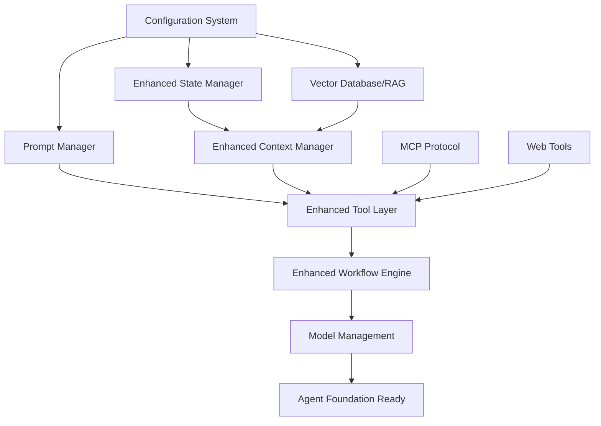

# Pre-Agent Foundation Analysis

**Document Version**: 1.0  
**Date**: 2025-01-16  
**Status**: Foundation Gap Analysis  
**Classification**: System Architecture Planning

## Executive Summary

This document systematically identifies all foundational components required before implementing the core agent system in v-0.9.x. Based on analysis of current implementation status and modern agent architecture patterns, we identify missing components and define implementation priorities.

## Current Implementation Status Analysis

### ✅ **STRONG FOUNDATIONS (v-0.8.0 Complete)**

```yaml
completed_systems:
  cli_framework: 
    status: "Production Ready"
    coverage: 95%
    details: "Multiple framework support, binary compilation, professional CLI"
  
  messaging_system:
    status: "Advanced"
    coverage: 90%
    details: "Async message processing, message-driven architecture"
  
  tool_system:
    status: "Comprehensive"
    coverage: 95%
    details: "6-phase execution, 14 tools operational, security framework"
  
  workflow_engine:
    status: "Research-Grade"
    coverage: 90%
    details: "ReAct, ReWOO, ADaPT patterns, LangGraph integration"
  
  basic_state_management:
    status: "Solid"
    coverage: 85%
    details: "Centralized state, session persistence, state machines"
```

### 🔧 **NEEDS ENHANCEMENT (Partial Implementation)**

```yaml
enhancement_needed:
  context_manager:
    current_status: "Excellent Foundation"
    coverage: 80%
    missing:
      - "Advanced context strategies"
      - "RAG integration"
      - "Context optimization"
      - "Multi-modal context handling"
  
  state_manager:
    current_status: "Basic Implementation"
    coverage: 75%
    missing:
      - "Multi-tier memory (short/medium/long-term)"
      - "State persistence strategies"
      - "Distributed state management"
      - "State conflict resolution"
  
  agent_orchestration:
    current_status: "Basic Orchestrator Exists"
    coverage: 70%
    missing:
      - "Advanced agent patterns"
      - "Multi-agent coordination"
      - "Agent lifecycle management"
      - "Performance optimization"
```

### ❌ **MISSING COMPONENTS (Not Implemented)**

```yaml
missing_critical_components:
  prompt_manager:
    status: "Not Implemented"
    priority: "High"
    required_for: "Dynamic prompt engineering, context-aware prompting"
  
  memory_vector_db:
    status: "Not Implemented"
    priority: "High"
    required_for: "RAG, long-term memory, semantic search"
  
  mcp_protocol:
    status: "Not Implemented"
    priority: "Medium"
    required_for: "External tool integration, extensibility"
  
  advanced_tool_layer:
    status: "Partial (missing web tools, MCP)"
    priority: "Medium"
    required_for: "Comprehensive tool ecosystem"
  
  model_management:
    status: "Not Implemented"
    priority: "Medium"
    required_for: "Model switching, optimization, serving"
  
  quality_assessment:
    status: "Not Implemented"
    priority: "Low (for continuous learning)"
    required_for: "Response quality evaluation, learning feedback"
```

## Comprehensive Pre-Agent Component List

### 1. **State Manager (Enhanced)**
```yaml
component: "Enhanced State Management System"
current_status: "Basic implementation exists"
implementation_needed:
  multi_tier_memory:
    short_term: "Working memory for current session"
    medium_term: "Session history and patterns"
    long_term: "Knowledge base and learned behaviors"
  
  state_persistence:
    local_storage: "SQLite for development"
    distributed_storage: "PostgreSQL/Redis for production"
    backup_recovery: "State backup and recovery mechanisms"
  
  state_synchronization:
    concurrent_access: "Handle multiple agent instances"
    conflict_resolution: "Merge conflicting state updates"
    consistency_guarantees: "Ensure state integrity"
  
  performance_optimization:
    lazy_loading: "Load state components on demand"
    caching_strategies: "Cache frequently accessed state"
    cleanup_policies: "Automatic state cleanup and archival"
```

### 2. **Context Manager (Enhanced)**
```yaml
component: "Advanced Context Management System"
current_status: "Excellent foundation, needs enhancement"
implementation_needed:
  context_strategies:
    static_context: "Fixed project and environment context"
    dynamic_context: "Adaptive context based on task"
    semantic_context: "Meaning-aware context selection"
    temporal_context: "Time-aware context management"
  
  context_optimization:
    context_compression: "Reduce context size while preserving meaning"
    relevance_scoring: "Score context relevance for current task"
    context_pruning: "Remove irrelevant context automatically"
    context_ranking: "Prioritize most important context"
  
  multi_modal_context:
    text_context: "Code, documentation, conversations"
    visual_context: "Images, diagrams, UI screenshots"
    structured_context: "JSON, XML, database schemas"
    binary_context: "Files, executables, media"
  
  rag_integration:
    vector_search: "Semantic similarity search"
    hybrid_search: "Combine keyword and semantic search"
    context_retrieval: "Retrieve relevant context from knowledge base"
    context_injection: "Inject retrieved context into prompts"
```

### 3. **Prompt Manager (New)**
```yaml
component: "Dynamic Prompt Management System"
current_status: "Not implemented"
implementation_needed:
  prompt_templates:
    template_library: "Reusable prompt templates"
    template_composition: "Combine multiple templates"
    template_variables: "Dynamic variable substitution"
    template_validation: "Validate prompt correctness"
  
  prompt_strategies:
    zero_shot: "Direct task prompting"
    few_shot: "Example-based prompting"
    chain_of_thought: "Step-by-step reasoning"
    tree_of_thought: "Multi-path reasoning exploration"
  
  dynamic_prompting:
    context_aware: "Adapt prompts based on context"
    task_specific: "Optimize prompts for specific tasks"
    model_specific: "Adapt prompts for different models"
    performance_optimized: "Optimize for speed vs quality"
  
  prompt_optimization:
    prompt_engineering: "Automatically improve prompts"
    a_b_testing: "Test prompt variations"
    performance_tracking: "Track prompt effectiveness"
    prompt_versioning: "Version control for prompts"
```

### 4. **Enhanced Tools Layer + MCP Protocol**
```yaml
component: "Comprehensive Tool Ecosystem with MCP"
current_status: "Strong foundation, missing web tools and MCP"
implementation_needed:
  web_tools:
    web_fetch: "HTTP requests and web scraping"
    web_search: "Search engine integration"
    api_client: "REST API interaction"
    webhook_handler: "Webhook receiving and processing"
  
  mcp_protocol:
    mcp_server: "Host MCP tools for external clients"
    mcp_client: "Connect to external MCP servers"
    protocol_implementation: "Full MCP specification compliance"
    security_framework: "Secure MCP communication"
  
  advanced_tools:
    database_tools: "SQL query execution, schema analysis"
    cloud_tools: "AWS, Azure, GCP integration"
    dev_tools: "Git, Docker, Kubernetes integration"
    ai_tools: "Image generation, speech processing"
  
  tool_orchestration:
    tool_chaining: "Chain tools for complex workflows"
    parallel_execution: "Execute tools concurrently"
    error_handling: "Robust tool error recovery"
    resource_management: "Manage tool resource usage"
```

### 5. **Memory and Vector Database (RAG)**
```yaml
component: "Knowledge Management and RAG System"
current_status: "Not implemented"
implementation_needed:
  vector_database:
    embedding_storage: "Store and retrieve embeddings"
    similarity_search: "Find semantically similar content"
    indexing_strategies: "Optimize for different search patterns"
    distributed_storage: "Scale across multiple nodes"
  
  knowledge_ingestion:
    document_processing: "Parse and chunk documents"
    code_analysis: "Extract knowledge from codebases"
    conversation_mining: "Learn from user interactions"
    external_sources: "Integrate external knowledge sources"
  
  retrieval_strategies:
    semantic_search: "Meaning-based retrieval"
    keyword_search: "Traditional text search"
    hybrid_retrieval: "Combine multiple strategies"
    contextual_retrieval: "Context-aware knowledge retrieval"
  
  knowledge_management:
    knowledge_graphs: "Represent relationships between concepts"
    fact_verification: "Verify knowledge accuracy"
    knowledge_updating: "Keep knowledge current"
    knowledge_versioning: "Track knowledge evolution"
```

### 6. **Enhanced Workflow Execution**
```yaml
component: "Advanced Workflow Orchestration"
current_status: "Research-grade implementation exists"
implementation_needed:
  workflow_patterns:
    sequential_workflows: "Step-by-step task execution"
    parallel_workflows: "Concurrent task execution"
    conditional_workflows: "Branching based on conditions"
    iterative_workflows: "Loop until conditions met"
  
  workflow_optimization:
    execution_planning: "Optimize workflow execution order"
    resource_allocation: "Allocate resources efficiently"
    load_balancing: "Distribute work across resources"
    failure_recovery: "Handle and recover from failures"
  
  advanced_orchestration:
    multi_agent_workflows: "Coordinate multiple agents"
    human_in_loop: "Integrate human feedback and approval"
    external_integration: "Integrate with external systems"
    event_driven: "React to external events and triggers"
  
  workflow_monitoring:
    execution_tracking: "Track workflow progress"
    performance_metrics: "Measure workflow performance"
    error_analysis: "Analyze and categorize failures"
    optimization_recommendations: "Suggest improvements"
```

### 7. **Model Management System**
```yaml
component: "Model Serving and Management"
current_status: "Basic Ollama integration exists"
implementation_needed:
  model_serving:
    model_loading: "Dynamic model loading and unloading"
    model_switching: "Switch between models for different tasks"
    model_caching: "Cache models for performance"
    model_routing: "Route requests to appropriate models"
  
  model_optimization:
    quantization: "Reduce model size while preserving quality"
    distillation: "Create smaller, faster models"
    pruning: "Remove unnecessary model parameters"
    optimization_profiles: "Different optimization strategies"
  
  model_monitoring:
    performance_tracking: "Monitor model response time and quality"
    resource_usage: "Track GPU, CPU, and memory usage"
    health_checking: "Ensure models are functioning correctly"
    alerting: "Alert on model performance issues"
  
  model_lifecycle:
    model_registration: "Register and catalog available models"
    version_management: "Track model versions and updates"
    deployment_automation: "Automated model deployment"
    rollback_capabilities: "Rollback to previous model versions"
```

### 8. **Configuration and Environment Management**
```yaml
component: "Environment and Configuration System"
current_status: "Basic configuration exists"
implementation_needed:
  environment_detection:
    development_mode: "Local development configuration"
    staging_mode: "Staging environment configuration"
    production_mode: "Production environment configuration"
    testing_mode: "Testing environment configuration"
  
  configuration_management:
    hierarchical_config: "Environment-specific configuration overrides"
    dynamic_config: "Runtime configuration updates"
    validation: "Configuration validation and error handling"
    secrets_management: "Secure handling of sensitive configuration"
  
  feature_flags:
    component_toggles: "Enable/disable system components"
    experiment_flags: "A/B testing and gradual rollouts"
    emergency_switches: "Emergency system controls"
    user_preferences: "User-specific feature preferences"
  
  monitoring_integration:
    health_checks: "System health monitoring"
    metrics_collection: "Performance and usage metrics"
    logging_configuration: "Structured logging setup"
    alerting_setup: "Alert configuration and management"
```

## Implementation Priority Matrix

### **Phase 1: Core Enhancement (v-0.8.x completion)**
```yaml
phase_1_priorities:
  high_priority:
    - "Enhanced State Manager (multi-tier memory)"
    - "Enhanced Context Manager (RAG integration)"
    - "Basic Prompt Manager (template system)"
  
  medium_priority:
    - "Web Tools (WebFetch, WebSearch)"
    - "Model Management (basic serving)"
    - "Configuration Enhancement"
  
  low_priority:
    - "MCP Protocol (foundation)"
    - "Advanced Workflow Features"
    - "Monitoring and Observability"
```

### **Phase 2: Agent Foundation (v-0.9.x preparation)**
```yaml
phase_2_priorities:
  high_priority:
    - "Complete MCP Protocol Implementation"
    - "Vector Database and RAG System"
    - "Advanced Prompt Management"
  
  medium_priority:
    - "Enhanced Tool Orchestration"
    - "Multi-Agent Coordination Framework"
    - "Performance Optimization"
  
  low_priority:
    - "Advanced Model Management"
    - "Distributed System Features"
    - "Enterprise Security Features"
```

### **Phase 3: Agent Implementation (v-0.9.x)**
```yaml
phase_3_focus:
  agent_core:
    - "Agent Lifecycle Management"
    - "Multi-Agent Coordination"
    - "Agent Communication Protocols"
    - "Agent Performance Optimization"
  
  agent_capabilities:
    - "Dynamic Task Planning"
    - "Adaptive Behavior Learning"
    - "Collaborative Problem Solving"
    - "Autonomous Goal Achievement"
```

## Dependencies and Implementation Order

### **Dependency Graph**


### **Critical Path Analysis**
```yaml
critical_path:
  tier_1_foundations:
    duration: "4-6 weeks"
    components:
      - "Enhanced State Manager"
      - "Enhanced Context Manager"  
      - "Basic Prompt Manager"
      - "Vector Database/RAG"
  
  tier_2_integration:
    duration: "3-4 weeks"
    components:
      - "MCP Protocol"
      - "Web Tools"
      - "Model Management"
      - "Tool Orchestration"
  
  tier_3_optimization:
    duration: "2-3 weeks"
    components:
      - "Performance Optimization"
      - "Advanced Features"
      - "Monitoring and Observability"
```

## Resource Requirements

### **Development Team Structure**
```yaml
team_requirements:
  core_engineers: 3
  specializations:
    - "Backend Systems Engineer (State, Context, Config)"
    - "ML/AI Engineer (RAG, Vector DB, Model Management)"
    - "Integration Engineer (MCP, Tools, Workflows)"
  
  support_roles:
    - "DevOps Engineer (25% allocation)"
    - "QA Engineer (50% allocation)"
    - "Technical Writer (25% allocation)"
```

### **Timeline Estimation**
```yaml
timeline_breakdown:
  phase_1_core_enhancement: "6-8 weeks"
  phase_2_agent_foundation: "4-6 weeks"
  phase_3_agent_implementation: "6-8 weeks"
  total_timeline: "16-22 weeks (4-5.5 months)"
```

## Success Criteria

### **Component Completion Criteria**
```yaml
completion_criteria:
  enhanced_state_manager:
    - "Multi-tier memory operational"
    - "State persistence working across sessions"
    - "Performance benchmarks met (<100ms state access)"
  
  enhanced_context_manager:
    - "RAG integration functional"
    - "Context optimization reducing context size by 30%"
    - "Multi-modal context support operational"
  
  prompt_manager:
    - "Template system with 50+ templates"
    - "Dynamic prompting functional"
    - "Prompt optimization showing 15% improvement"
  
  vector_database_rag:
    - "Semantic search operational"
    - "Knowledge ingestion pipeline functional"
    - "Sub-second retrieval performance"
  
  mcp_protocol:
    - "Full MCP specification compliance"
    - "Secure external tool integration"
    - "Performance overhead <10ms per call"
```

### **Integration Success Criteria**
```yaml
integration_success:
  system_performance:
    - "Overall system response time <2s"
    - "Memory usage <4GB for standard operations"
    - "CPU usage <50% during normal operations"
  
  reliability:
    - "System availability >99.5%"
    - "Error recovery rate >95%"
    - "Data consistency maintained"
  
  extensibility:
    - "New tools can be added in <1 day"
    - "New agents can be integrated in <1 week"
    - "External systems can connect via MCP"
```

## Risk Assessment

### **Technical Risks**
```yaml
high_risk:
  complexity_management:
    probability: "Medium"
    impact: "High"
    mitigation: "Incremental development, comprehensive testing"
  
  performance_degradation:
    probability: "Medium"
    impact: "Medium"
    mitigation: "Performance budgets, continuous monitoring"

medium_risk:
  integration_challenges:
    probability: "Medium"
    impact: "Medium"
    mitigation: "Early integration testing, API contracts"
  
  scope_creep:
    probability: "High"
    impact: "Medium"
    mitigation: "Clear requirements, phased delivery"
```

## Conclusion

This analysis identifies **8 major foundational components** that need to be implemented or enhanced before the core agent system in v-0.9.x:

1. **Enhanced State Manager** - Multi-tier memory and persistence
2. **Enhanced Context Manager** - RAG integration and optimization  
3. **Prompt Manager** - Dynamic prompt engineering system
4. **Enhanced Tools Layer + MCP** - Comprehensive tool ecosystem
5. **Memory and Vector Database** - Knowledge management and RAG
6. **Enhanced Workflow Execution** - Advanced orchestration
7. **Model Management System** - Model serving and optimization
8. **Configuration and Environment** - Robust environment management

The **critical path** requires approximately **16-22 weeks** of development with a team of 3 core engineers. The implementation should proceed in **3 phases**:

- **Phase 1**: Core enhancements to existing systems
- **Phase 2**: New foundational components 
- **Phase 3**: Integration and optimization

This systematic approach ensures a **solid foundation** for the advanced agent system planned for v-0.9.x, while maintaining the quality and reliability standards established in the current codebase.