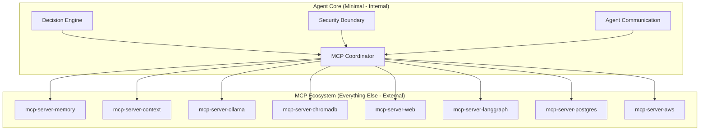
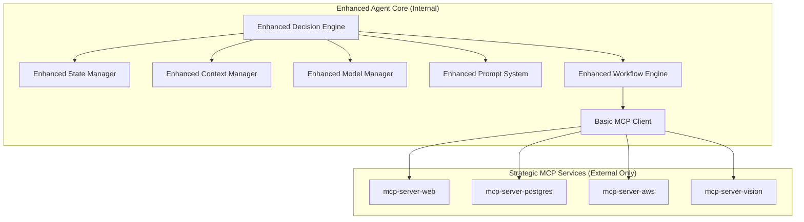

# Two Architecture Proposals for qi-v2-agent

**Document Version**: 1.0  
**Date**: 2025-01-16  
**Status**: Architecture Decision  
**Classification**: System Design Proposals

## Overview

This document presents two distinct architectural approaches for completing qi-v2-agent before the core agent implementation in v-0.9.x. Each proposal has different implications for development timeline, system complexity, and architectural philosophy.

---

## **Proposal A: Thin Agent + Thick MCP Ecosystem**

### **Philosophy: "Microservices for AI"**

The agent becomes a lightweight orchestration layer that coordinates specialized MCP services. Everything beyond core decision-making and coordination is externalized.

### **Current Status Analysis (Proposal A)**

```yaml
existing_strong_foundations:
  cli_framework: "✅ Production ready (95%)"
  messaging_system: "✅ Advanced implementation (90%)"
  tool_system: "✅ Comprehensive (95%)"
  workflow_engine: "✅ Research-grade (90%)"
  prompt_system: "✅ Multi-provider support (90%)"
  basic_state: "✅ Solid foundation (85%)"
  basic_context: "✅ Excellent foundation (80%)"
  agent_orchestration: "✅ Basic implementation (70%)"
```

### **True Core Components (Internal)**

```yaml
agent_core_only:
  decision_engine:
    current_status: "Partial (in PromptAppOrchestrator)"
    enhancement_needed:
      - "Advanced task planning and decomposition"
      - "Goal reasoning and adaptation"
      - "Multi-step decision making"
      - "Learning from feedback loops"
  
  mcp_coordinator:
    current_status: "❌ Not implemented"
    required_capabilities:
      - "MCP client protocol implementation"
      - "Service discovery and connection management"
      - "Cross-service capability orchestration"
      - "Service health monitoring and failover"
  
  security_boundary:
    current_status: "✅ Basic implementation exists"
    enhancement_needed:
      - "MCP service authentication and authorization"
      - "Cross-service permission management"
      - "Security policy enforcement"
      - "Audit trail across services"
  
  agent_communication:
    current_status: "✅ Basic messaging exists"
    enhancement_needed:
      - "Agent-to-agent communication protocols"
      - "Distributed agent coordination"
      - "Message routing and delivery guarantees"
      - "Conflict resolution mechanisms"
```

### **Everything Else → MCP Servers**

```yaml
externalized_to_mcp:
  memory_management:
    mcp_server: "mcp-server-memory"
    capabilities: ["short_term_memory", "long_term_memory", "state_persistence", "memory_retrieval"]
    rationale: "Memory is a capability service, not core reasoning"
  
  context_management:
    mcp_server: "mcp-server-context"
    capabilities: ["context_optimization", "context_search", "context_ranking", "context_caching"]
    rationale: "Context management is a specialized service"
  
  model_management:
    mcp_server: "mcp-server-ollama"
    capabilities: ["model_serving", "model_switching", "model_optimization", "model_monitoring"]
    rationale: "Model serving is infrastructure, not agent logic"
  
  rag_capabilities:
    mcp_server: "mcp-server-chromadb"
    capabilities: ["vector_search", "document_ingestion", "semantic_retrieval", "knowledge_graphs"]
    rationale: "RAG is a knowledge service"
  
  workflow_execution:
    mcp_server: "mcp-server-langgraph"
    capabilities: ["workflow_orchestration", "pattern_execution", "multi_agent_coordination"]
    rationale: "Workflow execution is orchestration service"
  
  web_capabilities:
    mcp_server: "mcp-server-web"
    capabilities: ["web_fetch", "web_search", "browser_automation", "api_integration"]
    rationale: "Web interactions are external integrations"
  
  database_tools:
    mcp_server: "mcp-server-postgres"
    capabilities: ["sql_query", "schema_analysis", "data_modeling", "migration_management"]
    rationale: "Database operations are external capabilities"
  
  cloud_integration:
    mcp_server: "mcp-server-aws"
    capabilities: ["cloud_deployment", "container_management", "infrastructure_provisioning"]
    rationale: "Cloud platforms are external services"
```

### **Proposal A Architecture**



### **Proposal A Implementation Timeline**

```yaml
implementation_timeline:
  v_0_8_x_completion:
    duration: "3-4 weeks"
    focus: "MCP Client + Minimal Agent Core"
    deliverables:
      - "MCP client protocol implementation"
      - "Service discovery and routing system"
      - "Enhanced decision engine"
      - "Basic multi-service orchestration"
  
  v_0_9_x_agent:
    duration: "4-6 weeks"
    focus: "Advanced Agent Reasoning"
    deliverables:
      - "Advanced decision engine with planning"
      - "Multi-agent communication protocols"
      - "Goal reasoning and adaptation"
      - "Cross-service coordination optimization"
  
  total_timeline: "7-10 weeks"
```

### **Proposal A Advantages**

```yaml
advantages:
  development_speed: "Fastest development (7-10 weeks)"
  architectural_simplicity: "Clean separation of concerns"
  ecosystem_leverage: "Leverages existing MCP servers"
  scalability: "Each service can scale independently"
  maintainability: "Smaller core codebase to maintain"
  flexibility: "Easy to swap or upgrade individual services"
  fault_isolation: "Service failures don't crash entire system"
```

### **Proposal A Disadvantages**

```yaml
disadvantages:
  external_dependencies: "Heavy reliance on external MCP servers"
  network_complexity: "Inter-service communication overhead"
  debugging_difficulty: "Distributed system debugging challenges"
  deployment_complexity: "Multiple services to deploy and monitor"
  performance_overhead: "Network latency between services"
  ecosystem_maturity: "Dependent on MCP ecosystem maturity"
```

---

## **Proposal B: Enhanced Monolith + Selective MCP Usage**

### **Philosophy: "Enhanced Core + Strategic External Services"**

Build comprehensive internal capabilities while strategically using MCP servers for truly external integrations (web, cloud, databases). Keep core agent capabilities (memory, context, models) internal for performance and control.

### **Current Status Analysis (Proposal B)**

```yaml
existing_implementations:
  strong_foundations:
    cli_framework: "✅ Production ready (95%)"
    messaging_system: "✅ Advanced (90%)"
    tool_system: "✅ Comprehensive (95%)"
    workflow_engine: "✅ Research-grade (90%)"
    prompt_system: "✅ Multi-provider (90%)"
    agent_orchestration: "✅ Basic (70%)"
  
  needs_enhancement:
    state_management: "✅ Basic exists (75%) → Enhance to multi-tier"
    context_management: "✅ Foundation exists (80%) → Enhance with optimization"
    model_management: "✅ Basic Ollama (60%) → Enhance lifecycle management"
```

### **Internal Core Components (Enhanced)**

```yaml
enhanced_internal_core:
  enhanced_state_manager:
    current_status: "✅ Basic implementation (lib/src/state/)"
    enhancements_needed:
      - "Multi-tier memory (short/medium/long-term)"
      - "Cross-session persistence with SQLite/PostgreSQL"
      - "State synchronization for multi-agent scenarios"
      - "Intelligent state pruning and archival"
      - "State conflict resolution mechanisms"
  
  enhanced_context_manager:
    current_status: "✅ Excellent foundation (lib/src/context/)"
    enhancements_needed:
      - "Context optimization and intelligent pruning"
      - "Dynamic context strategies (task-adaptive)"
      - "Context relevance scoring and ranking"
      - "Multi-modal context handling (text/visual/structured)"
      - "Context caching and performance optimization"
  
  enhanced_model_manager:
    current_status: "✅ Basic Ollama integration exists"
    enhancements_needed:
      - "Advanced model lifecycle management"
      - "Model switching and routing strategies"
      - "Model performance monitoring and optimization"
      - "Model version management and rollback"
      - "Resource-aware model loading and caching"
  
  enhanced_prompt_system:
    current_status: "✅ Comprehensive implementation (lib/src/prompt/)"
    enhancements_needed:
      - "Dynamic prompt template system"
      - "Context-aware prompt optimization"
      - "Prompt performance tracking and A/B testing"
      - "Chain-of-thought and reasoning pattern integration"
  
  enhanced_workflow_engine:
    current_status: "✅ Research-grade patterns (lib/src/workflow/)"
    enhancements_needed:
      - "Production-grade error handling and recovery"
      - "Multi-agent workflow coordination"
      - "Human-in-the-loop workflow patterns"
      - "Workflow performance optimization and monitoring"
      - "Dynamic workflow adaptation based on context"
  
  enhanced_decision_engine:
    current_status: "✅ Basic in PromptAppOrchestrator"
    enhancements_needed:
      - "Advanced task planning and decomposition"
      - "Goal reasoning and adaptive planning"
      - "Multi-step decision making with backtracking"
      - "Learning from outcomes and feedback"
      - "Risk assessment and mitigation strategies"
```

### **Strategic MCP Usage (External)**

```yaml
strategic_mcp_usage:
  truly_external_integrations:
    web_capabilities:
      mcp_server: "mcp-server-web"
      rationale: "Web interactions are inherently external"
      capabilities: ["web_fetch", "web_search", "browser_automation"]
    
    database_integration:
      mcp_server: "mcp-server-postgres"
      rationale: "Database systems are external infrastructure"
      capabilities: ["sql_query", "schema_analysis", "data_modeling"]
    
    cloud_platforms:
      mcp_server: "mcp-server-aws"
      rationale: "Cloud platforms are external services"
      capabilities: ["deployment", "container_management", "infrastructure"]
    
    specialized_ai_services:
      mcp_server: "mcp-server-vision"
      rationale: "Specialized AI models are external services"
      capabilities: ["image_generation", "vision_analysis", "speech_processing"]
  
  hybrid_approach:
    basic_mcp_client:
      purpose: "Connect to truly external services only"
      scope: "Limited to external integrations"
      complexity: "Simpler than full MCP orchestration"
```

### **Proposal B Architecture**



### **Proposal B Implementation Timeline**

```yaml
implementation_timeline:
  v_0_8_x_completion:
    duration: "8-10 weeks"
    focus: "Enhanced Core Components"
    phase_1: "4-5 weeks"
      - "Enhanced State Manager with multi-tier memory"
      - "Enhanced Context Manager with optimization"
      - "Enhanced Model Manager with lifecycle management"
    phase_2: "4-5 weeks"
      - "Enhanced Decision Engine with planning"
      - "Enhanced Workflow Engine with error handling"
      - "Basic MCP Client for external services"
  
  v_0_9_x_agent:
    duration: "6-8 weeks"
    focus: "Advanced Agent Capabilities"
    deliverables:
      - "Multi-agent coordination and communication"
      - "Advanced planning and reasoning capabilities"
      - "Performance optimization and monitoring"
      - "Production deployment features"
  
  total_timeline: "14-18 weeks"
```

### **Proposal B Advantages**

```yaml
advantages:
  performance: "No network latency for core operations"
  control: "Full control over core agent capabilities"
  debugging: "Easier debugging of integrated system"
  deployment_simplicity: "Single deployment unit for core"
  data_locality: "Memory and state co-located with logic"
  reliability: "Less dependent on external service availability"
  customization: "Full customization of core behaviors"
```

### **Proposal B Disadvantages**

```yaml
disadvantages:
  development_time: "Longer development timeline (14-18 weeks)"
  complexity: "Larger, more complex codebase to maintain"
  resource_usage: "Higher memory and CPU requirements"
  scaling_challenges: "Monolithic scaling constraints"
  update_coordination: "All components must be updated together"
  technology_lock_in: "Harder to replace individual components"
```

---

## **Detailed Comparison**

### **Development Timeline**

| Aspect | Proposal A (Thin Agent) | Proposal B (Enhanced Monolith) |
|--------|-------------------------|--------------------------------|
| **v-0.8.x Completion** | 3-4 weeks | 8-10 weeks |
| **v-0.9.x Agent** | 4-6 weeks | 6-8 weeks |
| **Total Timeline** | 7-10 weeks | 14-18 weeks |
| **Time to MVP** | ~2 months | ~4 months |

### **Resource Requirements**

| Resource | Proposal A | Proposal B |
|----------|------------|------------|
| **Development Team** | 2-3 engineers | 3-4 engineers |
| **Runtime Memory** | Low (thin agent) | Higher (full capabilities) |
| **CPU Usage** | Distributed across services | Concentrated in single process |
| **Network Usage** | High (inter-service) | Low (internal calls) |
| **Storage** | Distributed | Centralized |

### **Operational Complexity**

| Aspect | Proposal A | Proposal B |
|--------|------------|------------|
| **Deployment** | Multiple services | Single deployment |
| **Monitoring** | Distributed tracing required | Centralized monitoring |
| **Debugging** | Complex (distributed) | Simpler (monolithic) |
| **Scaling** | Per-service scaling | Vertical scaling |
| **Maintenance** | Multiple codebases | Single codebase |

### **Technical Capabilities**

| Capability | Proposal A | Proposal B |
|------------|------------|------------|
| **Performance** | Network latency overhead | Direct memory access |
| **Flexibility** | High (service swapping) | Medium (code changes) |
| **Reliability** | Dependent on service mesh | Self-contained reliability |
| **Extensibility** | MCP ecosystem | Custom development |
| **Fault Tolerance** | Service-level isolation | Process-level isolation |

---

## **Recommendation Framework**

### **Choose Proposal A (Thin Agent) If:**

```yaml
conditions_for_proposal_a:
  priorities:
    - "Fastest time to market (7-10 weeks)"
    - "Leverage existing MCP ecosystem"
    - "Minimize development effort"
    - "Maximum architectural flexibility"
  
  team_characteristics:
    - "Small development team (2-3 engineers)"
    - "Strong DevOps and distributed systems experience"
    - "Comfortable with microservices architecture"
  
  acceptable_tradeoffs:
    - "Network latency for core operations"
    - "Dependency on external service ecosystem"
    - "Increased operational complexity"
    - "Distributed system debugging challenges"
```

### **Choose Proposal B (Enhanced Monolith) If:**

```yaml
conditions_for_proposal_b:
  priorities:
    - "Maximum performance and control"
    - "Simpler operational model"
    - "Custom optimization capabilities"
    - "Reduced external dependencies"
  
  team_characteristics:
    - "Larger development team (3-4 engineers)"
    - "Strong systems programming experience"
    - "Preference for integrated architectures"
  
  acceptable_tradeoffs:
    - "Longer development timeline (14-18 weeks)"
    - "Higher resource requirements"
    - "More complex codebase maintenance"
    - "Slower individual component evolution"
```

---

## **Decision Matrix**

| Criteria | Weight | Proposal A Score | Proposal B Score |
|----------|--------|------------------|------------------|
| **Time to Market** | 25% | 9/10 | 6/10 |
| **Performance** | 20% | 6/10 | 9/10 |
| **Maintainability** | 20% | 7/10 | 8/10 |
| **Scalability** | 15% | 9/10 | 6/10 |
| **Team Fit** | 10% | 8/10 | 7/10 |
| **Operational Complexity** | 10% | 5/10 | 8/10 |

**Weighted Scores:**
- **Proposal A**: 7.4/10
- **Proposal B**: 7.3/10

---

## **Conclusion**

Both proposals are viable with different tradeoffs:

- **Proposal A** optimizes for speed and architectural flexibility
- **Proposal B** optimizes for performance and operational simplicity

The choice depends on team priorities, timeline constraints, and operational preferences. Both lead to a production-ready agent system, but via different architectural philosophies.

The decision should align with:
1. **Available development timeline**
2. **Team size and expertise**
3. **Performance requirements**
4. **Operational complexity tolerance**
5. **Long-term architectural vision**