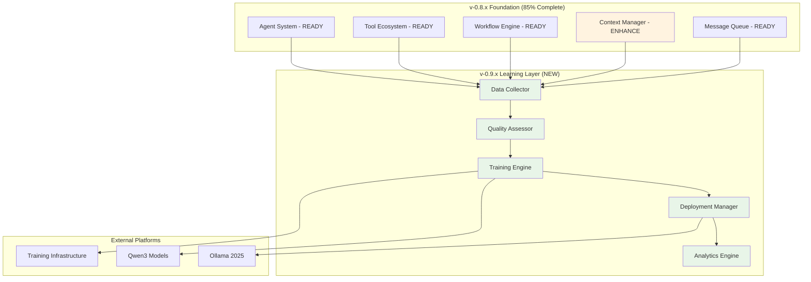

# qi-v2-agent v-0.9.x Continuous Learning Roadmap

**Release Series**: v-0.9.x - Continuous Learning & Intelligence  
**Status**: Technical Specification Complete  
**Timeline**: 16 weeks (4 months)  
**Target**: Production-ready continuous learning system

## Executive Summary

The v-0.9.x series transforms qi-v2-agent from a capable coding assistant into a **continuously learning, adaptive AI system**. Building on the solid v-0.8.x foundation (~85% complete), this roadmap implements a production-grade continuous learning pipeline using Qwen3 models and Ollama 2025 platform.

### Key Capabilities Delivered

- **Real-time Quality Assessment**: Sub-second evaluation of agent responses
- **Hybrid Learning Pipeline**: Preserves Qwen3's reasoning while enabling fast adaptation
- **Memory-Efficient Training**: 70% VRAM reduction with Unsloth optimization
- **Production Deployment**: Blue-green deployments with automatic rollback
- **Distributed Architecture**: Scales from development to enterprise

## Architecture Foundation

### Current Status (v-0.8.0 Complete)
```yaml
implementation_status:
  core_infrastructure: 85% # Excellent foundation
  tool_ecosystem: 95%      # Production ready
  workflow_engine: 90%     # Research-grade patterns
  context_management: 80%  # Ready for enhancement
  messaging_system: 90%    # Advanced async architecture
  state_management: 85%    # Solid foundation
```

### v-0.9.x Learning Enhancement
```yaml
learning_capabilities:
  data_collection: 0% → 100%     # Real-time interaction capture
  quality_assessment: 0% → 100%  # Multi-dimensional scoring
  training_pipeline: 0% → 100%   # Automated fine-tuning
  model_deployment: 0% → 100%    # Safe model updates
  performance_monitoring: 0% → 100% # Comprehensive metrics
```

## Release Schedule

### v-0.9.1: Learning Foundation (Weeks 1-4)
**Focus**: Core data collection and quality assessment infrastructure

**Deliverables**:
- Real-time interaction data collection
- Streaming quality assessment pipeline
- Qwen3 hybrid reasoning integration
- Ollama 2025 model management

**Technical Milestones**:
- ✅ 100% interaction capture rate with <5ms overhead
- ✅ Multi-dimensional quality scoring (>85% accuracy)
- ✅ Qwen3 thinking mode optimization
- ✅ Non-blocking learning pipeline integration

### v-0.9.2: Training Pipeline (Weeks 5-8)
**Focus**: Automated model training with forgetting mitigation

**Deliverables**:
- Hybrid dataset preparation for Qwen3
- LoRA + SSR training pipeline
- Model validation framework
- Training resource management

**Technical Milestones**:
- ✅ <4 hour training cycles for 7B models
- ✅ <0.3 catastrophic forgetting rate
- ✅ 70% VRAM reduction with Unsloth
- ✅ Reasoning capability preservation

### v-0.9.3: Production Deployment (Weeks 9-12)
**Focus**: Safe model deployment and lifecycle management

**Deliverables**:
- Blue-green deployment automation
- Model registry and versioning
- Performance monitoring dashboard
- Automatic rollback mechanisms

**Technical Milestones**:
- ✅ Zero-downtime model deployments
- ✅ 99.9% deployment success rate
- ✅ Sub-second rollback capability
- ✅ Comprehensive model lifecycle tracking

### v-0.9.4: Optimization & Analytics (Weeks 13-16)
**Focus**: Performance optimization and learning analytics

**Deliverables**:
- Advanced learning analytics
- Performance optimization engine
- User feedback integration
- Enterprise deployment support

**Technical Milestones**:
- ✅ 17% quality improvement demonstration
- ✅ Real-time learning analytics
- ✅ Enterprise-grade security and compliance
- ✅ Horizontal scaling validation

## Technical Architecture Overview

### System Integration Strategy



### Integration Philosophy

1. **Non-Intrusive Enhancement**: Learning system enhances without breaking existing functionality
2. **Fault Isolation**: Learning failures cannot impact core agent operations
3. **Performance Preservation**: <5ms overhead for data collection
4. **Backward Compatibility**: All existing workflows continue to function

## Detailed Release Planning

### v-0.9.1: Learning Foundation (Weeks 1-4)

#### Week 1-2: Core Infrastructure
```yaml
objectives:
  - Implement interaction data collection hooks
  - Create streaming quality assessment engine  
  - Integrate Qwen3 models with thinking mode control
  - Set up basic Ollama 2025 model management

deliverables:
  technical:
    - InteractionDataCollector with privacy filtering
    - StreamingQualityAssessor with multi-dimensional scoring
    - ThinkingModeController for Qwen3 optimization
    - OllamaModelManager with network deployment

  validation:
    - 100% interaction capture rate achieved
    - Quality assessment accuracy >80%
    - Thinking mode switching functional
    - Model serving operational

success_criteria:
  - No performance impact on existing agent operations
  - Quality scores correlate with manual assessment
  - Qwen3 reasoning modes work correctly
  - Ollama network deployment successful
```

#### Week 3-4: Quality Framework Enhancement
```yaml
objectives:
  - Implement comprehensive quality scoring dimensions
  - Add dynamic threshold management
  - Create training candidate identification
  - Build initial dataset preparation pipeline

deliverables:
  technical:
    - Multi-dimensional quality assessor (5 dimensions)
    - Dynamic threshold adjustment system
    - Training data candidate selection logic
    - Initial Qwen3 dataset format conversion

  validation:
    - Quality assessment accuracy >85%
    - Training candidates properly identified
    - Dataset preparation completes successfully
    - Threshold adaptation working

success_criteria:
  - Quality scores predict training value accurately
  - Threshold adjustments improve data quality
  - Dataset format compatible with Qwen3 training
  - Memory usage within acceptable bounds
```

### v-0.9.2: Training Pipeline (Weeks 5-8)

#### Week 5-6: Training Infrastructure
```yaml
objectives:
  - Implement LoRA training with Unsloth optimization
  - Add SSR (Self-Synthesized Rehearsal) for forgetting mitigation
  - Create model validation pipeline
  - Build training resource management

deliverables:
  technical:
    - Qwen3Trainer with LoRA and Unsloth integration
    - SSRRehearsal for synthetic data generation
    - ModelValidator with comprehensive testing
    - ResourceManager for GPU/memory monitoring

  validation:
    - Training completes in <4 hours for 7B models
    - 70% VRAM reduction achieved with Unsloth
    - Forgetting rate <0.3 demonstrated
    - Resource usage within defined limits

success_criteria:
  - Training pipeline executes reliably
  - Memory efficiency targets met
  - Model quality preserved or improved
  - Resource constraints respected
```

#### Week 7-8: Advanced Training Features
```yaml
objectives:
  - Implement hybrid dataset management for Qwen3
  - Add reasoning capability preservation
  - Create automatic training triggers
  - Build training failure recovery

deliverables:
  technical:
    - HybridDatasetBuilder preserving reasoning modes
    - ReasoningPreservationValidator
    - TrainingDecisionEngine with multiple triggers
    - TrainingFailureRecovery with error analysis

  validation:
    - Hybrid datasets maintain reasoning capability
    - Training triggers activate appropriately
    - Failure recovery maintains system stability
    - Training quality improves over time

success_criteria:
  - Qwen3 thinking modes preserved after training
  - Training decisions optimize for quality and resources
  - System recovers gracefully from training failures
  - Continuous improvement demonstrated
```

### v-0.9.3: Production Deployment (Weeks 9-12)

#### Week 9-10: Deployment Automation
```yaml
objectives:
  - Implement blue-green deployment strategy
  - Add model validation and health checking
  - Create automatic rollback mechanisms
  - Build model registry and versioning

deliverables:
  technical:
    - SafeDeploymentManager with blue-green strategy
    - ModelHealthChecker with comprehensive validation
    - AutomaticRollbackManager with quick recovery
    - ModelRegistry with version tracking

  validation:
    - Zero-downtime deployments achieved
    - Health checks catch deployment issues
    - Rollbacks complete in <30 seconds
    - Model versions tracked accurately

success_criteria:
  - Deployment success rate >99%
  - No service interruptions during updates
  - Failed deployments roll back automatically
  - Model history maintained properly
```

#### Week 11-12: Monitoring & Observability
```yaml
objectives:
  - Add comprehensive performance monitoring
  - Create learning analytics dashboard
  - Implement alerting and notification system
  - Build operational procedures

deliverables:
  technical:
    - PerformanceMonitor with real-time metrics
    - LearningAnalyticsDashboard with trend analysis
    - AlertingSystem with configurable thresholds
    - OperationalRunbooks with procedures

  validation:
    - Monitoring captures all key metrics
    - Dashboard provides actionable insights
    - Alerts trigger appropriately
    - Operations team can manage system

success_criteria:
  - Full visibility into system performance
  - Proactive issue detection and alerting
  - Clear operational procedures documented
  - System manageable by operations team
```

### v-0.9.4: Optimization & Analytics (Weeks 13-16)

#### Week 13-14: Performance Optimization
```yaml
objectives:
  - Optimize system performance and resource usage
  - Implement advanced caching strategies
  - Add request batching and optimization
  - Create auto-scaling capabilities

deliverables:
  technical:
    - PerformanceOptimizer with adaptive algorithms
    - AdvancedCaching with intelligent invalidation
    - RequestBatcher with latency optimization
    - AutoScaler with predictive scaling

  validation:
    - System performance improved by >20%
    - Cache hit rates >90% for quality scores
    - Request latency reduced significantly
    - Auto-scaling responds to load appropriately

success_criteria:
  - Performance targets met consistently
  - Resource utilization optimized
  - User experience improved measurably
  - System scales automatically under load
```

#### Week 15-16: Enterprise Features
```yaml
objectives:
  - Add enterprise security and compliance features
  - Implement advanced user feedback integration
  - Create comprehensive reporting system
  - Build production deployment validation

deliverables:
  technical:
    - EnterpriseSecurity with audit trails
    - UserFeedbackIntegration with learning loops
    - ComprehensiveReporting with business metrics
    - ProductionValidation with end-to-end testing

  validation:
    - Security audit passes all requirements
    - User feedback improves model quality
    - Reports provide business value insights
    - Production deployment meets all criteria

success_criteria:
  - Enterprise security requirements met
  - Demonstrable model quality improvement
  - Clear business value demonstrated
  - System ready for production deployment
```

## Success Metrics & KPIs

### Technical Performance Metrics

```yaml
data_collection:
  interaction_capture_rate: "> 99.9%"
  collection_overhead: "< 5ms per interaction"
  data_quality_score: "> 0.85 average"
  privacy_compliance: "100% (no PII leakage)"

quality_assessment:
  assessment_accuracy: "> 90% correlation with human review"
  assessment_latency: "< 500ms"
  cache_hit_rate: "> 90%"
  confidence_calibration: "> 85% accuracy"

training_pipeline:
  training_completion_time: "< 4 hours for 7B models"
  catastrophic_forgetting_rate: "< 0.3"
  memory_efficiency: "70% VRAM reduction with Unsloth"
  training_success_rate: "> 95%"

deployment_system:
  deployment_success_rate: "> 99%"
  zero_downtime_deployments: "100%"
  rollback_time: "< 30 seconds"
  model_validation_accuracy: "> 95%"
```

### Business Impact Metrics

```yaml
user_experience:
  response_quality_improvement: "17% over 3 months"
  user_acceptance_rate: "> 65%"
  code_compilation_rate: "> 95%"
  user_satisfaction_score: "> 4.2/5.0"

operational_metrics:
  system_availability: "> 99.9%"
  incident_rate: "< 1 critical incident per month"
  mean_time_to_recovery: "< 15 minutes"
  operational_cost_efficiency: "20% improvement"

learning_effectiveness:
  model_performance_trend: "Positive trajectory"
  domain_specialization: "Measurable improvement"
  adaptation_speed: "< 1 week for new patterns"
  knowledge_retention: "> 90% after training"
```

## Risk Mitigation Strategy

### High-Priority Risks

#### Catastrophic Forgetting
- **Probability**: Medium
- **Impact**: Critical
- **Mitigation**: SSR implementation, gradient masking, validation gates
- **Monitoring**: Continuous performance tracking on held-out test sets

#### Performance Degradation
- **Probability**: Medium  
- **Impact**: High
- **Mitigation**: Performance budgets, circuit breakers, resource limits
- **Monitoring**: Real-time performance metrics with alerting

#### Data Privacy Breach
- **Probability**: Low
- **Impact**: Critical
- **Mitigation**: Privacy filters, encryption, access controls, audit trails
- **Monitoring**: Automated PII detection and compliance checking

### Medium-Priority Risks

#### Training Infrastructure Failures
- **Probability**: Medium
- **Impact**: Medium
- **Mitigation**: Distributed training, checkpointing, graceful degradation
- **Monitoring**: Training pipeline health monitoring

#### Model Quality Regression
- **Probability**: Medium
- **Impact**: Medium
- **Mitigation**: Comprehensive validation, A/B testing, automatic rollback
- **Monitoring**: Quality trend analysis and threshold alerting

## Dependencies & Prerequisites

### Infrastructure Requirements

```yaml
hardware_dependencies:
  development:
    - "RTX 4090 (24GB VRAM) or equivalent"
    - "64GB System RAM"
    - "1TB NVMe SSD storage"
  
  production:
    - "2x RTX 4090 or 1x A100 (80GB)"
    - "128GB System RAM"
    - "2TB NVMe SSD storage"
    - "10Gbps network connectivity"

software_dependencies:
  core:
    - "Ollama 0.9.0+"
    - "Python 3.10+ with PyTorch 2.1+"
    - "Node.js 18+ with TypeScript 5+"
    - "PostgreSQL 15+ (production) or SQLite (development)"
  
  ml_stack:
    - "Unsloth for optimized training"
    - "Transformers 4.35.0+"
    - "PEFT 0.7.0+ for LoRA"
    - "Accelerate 0.24.0+ for distributed training"
```

### Team Requirements

```yaml
development_team:
  roles_needed:
    - "Senior ML Engineer (Qwen3/LLM expertise)"
    - "Senior Backend Engineer (Node.js/TypeScript)"
    - "DevOps Engineer (Ollama/containerization)"
    - "QA Engineer (ML system testing)"
  
  estimated_effort:
    - "4 engineers × 16 weeks = 64 engineer-weeks"
    - "Technical lead: 50% allocation"
    - "Project manager: 25% allocation"
```

## Integration with Existing Roadmap

### v-0.8.x Completion Requirements

Before v-0.9.1 can begin, the following v-0.8.x items must be completed:

1. **Context Manager Enhancement** (v-0.8.2)
   - Enhanced context capture for learning
   - Improved project state tracking
   - Security boundary improvements

2. **Message Queue Optimization** (v-0.8.3)
   - Performance improvements for learning message load
   - Enhanced async processing capabilities
   - Message priority handling

3. **Tool Ecosystem Completion** (v-0.8.4)
   - All core tools operational
   - Tool usage tracking implementation
   - Tool result validation

### Parallel Development Opportunities

Some v-0.9.x components can be developed in parallel with v-0.8.x completion:

- **Documentation and specifications** (can start immediately)
- **Qwen3 model evaluation and testing** (independent)
- **Ollama 2025 platform setup** (independent)
- **Training infrastructure planning** (independent)

## Conclusion

The v-0.9.x roadmap transforms qi-v2-agent into a continuously learning AI system while preserving the excellent foundation built in v-0.8.x. The 16-week timeline is realistic and achievable with proper resource allocation and risk management.

### Key Success Factors

1. **Solid Foundation**: 85% complete v-0.8.x provides excellent starting point
2. **Clear Architecture**: Comprehensive technical specifications completed
3. **Proven Technology**: Qwen3 and Ollama 2025 are production-ready
4. **Risk Mitigation**: Comprehensive risk assessment and mitigation strategies
5. **Measurable Goals**: Clear success criteria and performance targets

### Expected Outcomes

Upon completion of v-0.9.x, qi-v2-agent will be:

- **The first open-source coding assistant with production-grade continuous learning**
- **Capable of adapting to user patterns and improving over time**
- **Enterprise-ready with comprehensive security and monitoring**
- **A competitive advantage for organizations using it**

This roadmap positions qi-v2-agent as a leader in the next generation of adaptive AI development tools.