# Unified Chat Fixed Implementation Guide

## Overview

This document provides a comprehensive implementation guide for fixing the catastrophic recursive workflow tools architecture in the unified chat interface. The current implementation creates infinite recursion instead of performing file operations. This guide provides the complete blueprint for creating a truly functional unified chat system.

## Quick Context for New AI

### Project Structure
- **Root**: `/home/zzhang/dev/qi/github/qi-v2-agent`
- **Lib Package**: `lib/src/` - Core agent functionality
- **App Package**: `app/src/` - CLI and UI components
- **Config**: `config/qi-config.yaml` - System configuration
- **Docs**: `docs/study/phase2/` - Implementation documentation

### Files to Fix
- **Primary**: `lib/src/tools/workflow-tools.ts` (completely broken - infinite recursion)
- **Secondary**: `lib/src/agent/unified-factory.ts` (needs dependency updates)
- **Reference**: Use `/knowledge-phase2` command for latest tech info

### Build Commands
```bash
# Build lib package
bun --cwd lib build

# Build app package  
bun --cwd app build

# Test unified chat
bun --cwd app src/main.ts unified
```

### Verification Test
```bash
# This should create foo.py file - currently fails
echo "write to file foo.py a quicksort function" | bun --cwd app src/main.ts unified
ls -la foo.py  # Should exist after fix
```

## Critical Problem Summary

**Current Status**: The unified chat interface is **0% functional** for file operations due to recursive workflow tools that call the agent factory instead of executing actual file operations.

**Required Solution**: Complete architectural rewrite of workflow tools to use MCP tools and LLM directly instead of creating infinite recursion loops.

## Architecture Overview

### Current Broken Architecture

```mermaid
graph TD
    A[User: "write to file foo.py quicksort"] --> B[AgentFactory.stream]
    B --> C[Smart Router]
    C --> D{File Operation?}
    D -->|Yes| E[LangGraph Agent]
    E --> F[edit_files Workflow Tool]
    F --> G[agentFactory.stream RECURSIVE CALL]
    G --> H[Smart Router AGAIN]
    H --> I[LangGraph Agent AGAIN] 
    I --> J[edit_files Tool AGAIN]
    J --> K[INFINITE RECURSION ∞]
    
    L[❌ NO FILE CREATED]
    M[❌ NO MCP TOOLS CALLED]
    N[❌ COMPLETE SYSTEM FAILURE]
    
    K -.-> L
    K -.-> M
    K -.-> N
    
    style F fill:#ff9999
    style G fill:#ff6666
    style K fill:#ff3333
    style L fill:#ff0000
    style M fill:#ff0000
    style N fill:#ff0000
```

### Correct Fixed Architecture

```mermaid
graph TD
    A[User: "write to file foo.py quicksort"] --> B[AgentFactory.stream]
    B --> C[Smart Router]
    C --> D{File Operation?}
    D -->|Yes| E[LangGraph Agent]
    E --> F[edit_files Workflow Tool]
    F --> G[LLM.invoke for code generation]
    G --> H[mcpManager.executeTool write_file]
    H --> I[MCP Filesystem Server]
    I --> J[File System]
    J --> K[✅ foo.py CREATED]
    
    style F fill:#99ff99
    style G fill:#66ff66
    style H fill:#33ff33
    style I fill:#00ff00
    style J fill:#00ff00
    style K fill:#00cc00
```

## Detailed Component Flow

### Complete System Sequence Diagram

```mermaid
sequenceDiagram
    participant U as User
    participant AF as AgentFactory
    participant SR as Smart Router
    participant LG as LangGraph Agent
    participant WT as Workflow Tools
    participant LLM as OllamaLLM
    participant MCP as MCP Manager
    participant FS as File System
    
    U->>AF: "write to file foo.py quicksort"
    AF->>SR: Route request
    
    Note over SR: Detects file operation
    SR->>LG: needsTools = true
    
    LG->>WT: Call edit_files tool
    Note over WT: NEW: Direct operations
    
    WT->>LLM: Generate quicksort code
    LLM-->>WT: Python quicksort function
    
    WT->>MCP: executeTool('write_file', {path, content})
    MCP->>FS: Create foo.py with content
    FS-->>MCP: File created successfully
    MCP-->>WT: {success: true}
    
    WT-->>LG: "✅ Successfully created foo.py"
    LG-->>AF: Tool execution complete
    AF-->>U: File created with quicksort
    
    Note over U,FS: RESULT: foo.py exists on filesystem
```



### Architecture Component Comparison

```mermaid
graph LR
    subgraph "BROKEN (Current Implementation)"
        A1[User Input] --> B1[AgentFactory]
        B1 --> C1[Smart Router ✅]
        C1 --> D1[LangGraph ✅]
        D1 --> E1[Workflow Tools ❌]
        E1 --> B1
        E1 -.-> F1[INFINITE LOOP ∞]
        
        style E1 fill:#ff6666
        style F1 fill:#ff3333
    end
    
    subgraph "FIXED (New Implementation)"
        A2[User Input] --> B2[AgentFactory]
        B2 --> C2[Smart Router ✅]
        C2 --> D2[LangGraph ✅]
        D2 --> E2[Workflow Tools ✅]
        E2 --> F2[LLM Direct]
        E2 --> G2[MCP Manager]
        G2 --> H2[File System]
        H2 --> I2[✅ FILE CREATED]
        
        style E2 fill:#66ff66
        style F2 fill:#99ff99
        style G2 fill:#99ff99
        style I2 fill:#00cc00
    end
```



## Core Implementation Changes

### 1. Fixed WorkflowToolsConfig Interface

```typescript
// ❌ BROKEN (Current)
export interface WorkflowToolsConfig {
  agentFactory: qi-v2 agentFactory; // Creates infinite recursion
  threadId?: string;
}

// ✅ FIXED (New)
export interface WorkflowToolsConfig {
  mcpManager: MCPManager;  // Direct MCP operations
  llm: OllamaLLM;         // Direct LLM calls
  threadId?: string;
}
```

### 2. Complete edit_files Tool Rewrite

```typescript
// ❌ BROKEN (Current Implementation)
const editFilesTool = tool(
  async ({ files, instruction }) => {
    // INFINITE RECURSION: Calls agent factory again
    await agentFactory.stream(workflowMessages, {
      onToken: (token) => response += token,
      onComplete: (final) => response = final
    }, threadId);
    
    // Never reaches actual file operations
    return `Response: ${response}`;
  }
);

// ✅ FIXED (New Implementation)  
const editFilesTool = tool(
  async ({ files, instruction }) => {
    try {
      console.log(`🔧 Creating file: ${files[0]} with instruction: ${instruction}`);
      
      // 1. Generate code using LLM directly (no recursion)
      const messages = [{
        role: 'user' as const,
        content: `Generate ${instruction} for file ${files[0]}. 
                 Provide complete, working code without explanations.`
      }];
      
      const codeResponse = await llm.invoke(messages);
      const code = codeResponse.content;
      
      // 2. Write file using MCP directly (no agent factory)
      const result = await mcpManager.executeTool('write_file', {
        path: files[0],
        content: code
      });
      
      // 3. Handle MCP operation result
      if (result && typeof result === 'object' && 'error' in result) {
        throw new Error(`File operation failed: ${result.error}`);
      }
      
      console.log(`✅ Successfully created ${files[0]}`);
      return `✅ Successfully created ${files[0]} with ${instruction}`;
      
    } catch (error) {
      const errorMsg = `❌ Failed to create ${files[0]}: ${error instanceof Error ? error.message : String(error)}`;
      console.error(errorMsg);
      return errorMsg;
    }
  },
  {
    name: "edit_files",
    description: `Create, edit, or modify files with AI-generated content.

WHEN TO USE:
- User wants to create new files with specific content
- User wants to modify existing files  
- User says: "write to file X", "create file Y", "save code to Z"

EXAMPLES:
- "write to file foo.py a quicksort function" → files: ["foo.py"], instruction: "a quicksort function in Python"
- "create file utils.js with helper functions" → files: ["utils.js"], instruction: "helper functions in JavaScript"`,
    schema: z.object({
      files: z.array(z.string()).describe("Array of file paths to create/edit"),
      instruction: z.string().describe("What content to generate or how to modify the files")
    })
  }
);
```

### 3. Complete analyze_code Tool Rewrite

```typescript
// ✅ FIXED (New Implementation)
const analyzeCodeTool = tool(
  async ({ target, options = {} }) => {
    try {
      console.log(`🔍 Analyzing: ${target}`);
      
      // 1. Read file/directory using MCP directly
      let content = '';
      try {
        const readResult = await mcpManager.executeTool('read_file', { path: target });
        content = typeof readResult === 'string' ? readResult : 
                 (readResult && typeof readResult === 'object' && 'content' in readResult) ? 
                 readResult.content : String(readResult);
      } catch (readError) {
        // If single file fails, try directory listing
        const listResult = await mcpManager.executeTool('list_directory', { path: target });
        content = `Directory listing: ${JSON.stringify(listResult, null, 2)}`;
      }
      
      // 2. Analyze using LLM directly
      let analysisPrompt = `Analyze this code/directory: ${target}\n\nContent:\n${content}\n\n`;
      
      if (options.complexity) {
        analysisPrompt += "Focus on code complexity, cyclomatic complexity, and maintainability.\n";
      }
      if (options.dependencies) {
        analysisPrompt += "Focus on dependencies, imports, and module relationships.\n";
      }
      
      analysisPrompt += "Provide detailed analysis with actionable recommendations.";
      
      const analysisResponse = await llm.invoke([{
        role: 'user',
        content: analysisPrompt
      }]);
      
      console.log(`✅ Analysis completed for: ${target}`);
      return `📊 Code Analysis for ${target}:\n\n${analysisResponse.content}`;
      
    } catch (error) {
      const errorMsg = `❌ Analysis failed for ${target}: ${error instanceof Error ? error.message : String(error)}`;
      console.error(errorMsg);
      return errorMsg;
    }
  },
  {
    name: "analyze_code",
    description: `Analyze code complexity, structure, dependencies, and quality.

WHEN TO USE:
- User wants code complexity analysis
- User wants dependency analysis
- User wants code quality review
- User says: "analyze X", "check complexity of Y", "review dependencies in Z"

EXAMPLES:
- "analyze the complexity of utils.js" → target: "utils.js", options: {complexity: true}
- "check dependencies in src/" → target: "src/", options: {dependencies: true}`,
    schema: z.object({
      target: z.string().describe("File path or directory to analyze"),
      options: z.object({
        complexity: z.boolean().optional().describe("Focus on complexity analysis"),
        dependencies: z.boolean().optional().describe("Analyze dependencies and imports"),
        format: z.string().optional().describe("Output format: text, json, or markdown")
      }).optional().describe("Analysis options")
    })
  }
);
```

### 4. Complete explain_concept Tool Rewrite  

```typescript
// ✅ FIXED (New Implementation)
const explainConceptTool = tool(
  async ({ target, options = {} }) => {
    try {
      console.log(`📚 Explaining: ${target}`);
      
      let explanationPrompt = '';
      
      if (options.concept) {
        // Explaining a programming concept
        explanationPrompt = `Explain the programming concept: "${options.concept}"
        
Provide a clear explanation suitable for ${options.level || 'intermediate'} level understanding.
Include examples, use cases, and best practices.`;
      } else {
        // Explaining code in a file
        const readResult = await mcpManager.executeTool('read_file', { path: target });
        const content = typeof readResult === 'string' ? readResult : 
                       (readResult && typeof readResult === 'object' && 'content' in readResult) ? 
                       readResult.content : String(readResult);
        
        explanationPrompt = `Explain this code from ${target}:

${content}

Explanation level: ${options.level || 'intermediate'}

Please:
1. Break down complex parts into understandable components
2. Explain the purpose and functionality  
3. Provide context and practical examples
4. Suggest best practices and common patterns
5. Make it clear and educational`;
      }
      
      const explanationResponse = await llm.invoke([{
        role: 'user',
        content: explanationPrompt
      }]);
      
      console.log(`✅ Explanation completed for: ${target}`);
      return `📚 Explanation for ${target}:\n\n${explanationResponse.content}`;
      
    } catch (error) {
      const errorMsg = `❌ Explanation failed for ${target}: ${error instanceof Error ? error.message : String(error)}`;
      console.error(errorMsg);
      return errorMsg;
    }
  },
  {
    name: "explain_concept", 
    description: `Explain code concepts, functions, or programming topics.

WHEN TO USE:
- User wants to understand specific code
- User wants to learn programming concepts
- User needs educational assistance
- User says: "explain X", "how does Y work", "what is Z"

EXAMPLES:
- "explain how async/await works" → target: "async/await", options: {concept: "async/await", level: "intermediate"}
- "explain this function in utils.js" → target: "utils.js", options: {level: "beginner"}`,
    schema: z.object({
      target: z.string().describe("File path, function, or concept to explain"),
      options: z.object({
        concept: z.string().optional().describe("Specific programming concept to explain"),
        level: z.string().optional().describe("Explanation level: beginner, intermediate, or advanced")
      }).optional().describe("Explanation options")
    })
  }
);
```

### 5. Updated UnifiedQiAgentFactory Initialization

```typescript
// ❌ BROKEN (Current)
const workflowTools = createWorkflowTools({
  agentFactory: this as any, // Creates self-reference recursion
  threadId: undefined
});

// ✅ FIXED (New)
const workflowTools = createWorkflowTools({
  mcpManager: this.mcpManager,  // Direct MCP access
  llm: this.llm,              // Direct LLM access
  threadId: undefined
});

// Combine MCP tools + fixed workflow tools  
const allTools = [...langchainMcpTools, ...workflowTools];

console.log(`🔧 Loaded ${allTools.length} tools (${mcpTools.length} MCP + ${workflowTools.length} workflow)`);
```

## Error Handling Flow


## Implementation Steps

### Phase 1: Interface Rewrite
1. **Update WorkflowToolsConfig interface**
   - Remove `agentFactory` dependency
   - Add `mcpManager` and `llm` dependencies
   - Update all imports and type references

### Phase 2: Core Tool Implementation
1. **Rewrite edit_files tool**
   - Remove recursive `agentFactory.stream()` calls
   - Add direct `llm.invoke()` for code generation
   - Add direct `mcpManager.executeTool()` for file operations
   - Add comprehensive error handling

2. **Rewrite analyze_code tool**
   - Add direct `mcpManager.executeTool()` for file reading
   - Add direct `llm.invoke()` for analysis
   - Handle both file and directory analysis

3. **Rewrite explain_concept tool**  
   - Support both concept explanation and code explanation
   - Add direct MCP file reading when needed
   - Add direct LLM explanation generation

### Phase 3: Factory Integration
1. **Update UnifiedQiAgentFactory**
   - Pass `mcpManager` and `llm` to workflow tools
   - Remove self-reference patterns
   - Update tool initialization logging

### Phase 4: Error Handling Enhancement
1. **Add robust error handling**
   - MCP connection failures
   - LLM generation failures
   - File operation failures
   - Network timeout handling

### Phase 5: Testing and Validation
1. **Create integration tests**
   - File creation validation
   - File modification validation
   - Error scenario handling
   - Performance comparisons

## Testing Strategy

### Primary Integration Test

```mermaid
graph TD
    A[Start Integration Test] --> B[Send: 'write to file test.py hello world']
    B --> C[Wait for Response]
    C --> D{File Created on Filesystem?}
    D -->|Yes| E[✅ CORE FUNCTIONALITY WORKING]
    D -->|No| F[❌ SYSTEM STILL BROKEN]
    
    E --> G[Check File Content]
    G --> H{Content Correct?}
    H -->|Yes| I[✅ FULL SUCCESS]
    H -->|No| J[⚠️ PARTIAL SUCCESS - Content Issue]
    
    F --> K[🛑 HALT - Architecture Still Broken]
    
    I --> L[Run Secondary Tests]
    J --> M[Debug Content Generation]
    
    style E fill:#ccffcc
    style I fill:#00ff00
    style F fill:#ffcccc
    style K fill:#ff0000
```



### Test Matrix

| Test Case | Input | Expected File | Expected Content | Status |
|-----------|-------|---------------|------------------|---------|
| **File Creation** | `"write to file hello.py a hello world program"` | `hello.py` | Python hello world code | ❓ To Test |
| **Quicksort Test** | `"write to file quicksort.py a quicksort function"` | `quicksort.py` | Python quicksort implementation | ❓ To Test |
| **JavaScript Test** | `"create file utils.js with helper functions"` | `utils.js` | JavaScript utility functions | ❓ To Test |
| **Error Handling** | `"write to file /invalid/path/test.py code"` | None | Error message returned | ❓ To Test |
| **Code Analysis** | `"analyze complexity of existing.py"` | None | Analysis report | ❓ To Test |

### Validation Commands

```bash
# Primary Test - File Creation
echo "write to file test.py a hello world program" | bun --cwd app src/main.ts unified
ls -la test.py  # Must exist and contain Python code

# Secondary Test - File Content Validation  
cat test.py  # Must contain valid Python hello world code

# Tertiary Test - Complex File Creation
echo "write to file quicksort.py a quicksort function in python" | bun --cwd app src/main.ts unified
ls -la quicksort.py && cat quicksort.py

# Error Handling Test
echo "write to file /invalid/path/test.py code" | bun --cwd app src/main.ts unified
# Should return error message, not crash
```

## Migration Guide

### Step-by-Step Conversion

1. **Backup Current Implementation**
   ```bash
   cp lib/src/tools/workflow-tools.ts lib/src/tools/workflow-tools.ts.backup
   cp lib/src/agent/unified-factory.ts lib/src/agent/unified-factory.ts.backup
   ```

2. **Update Interface First**
   - Modify `WorkflowToolsConfig` interface
   - Update imports in affected files

3. **Implement Tools One by One**
   - Start with `edit_files` (most critical)
   - Test after each tool implementation
   - Verify file operations work before proceeding

4. **Update Factory Integration**
   - Modify `UnifiedQiAgentFactory` initialization
   - Test complete integration

5. **Validation & Rollback**
   - Run comprehensive test suite
   - If tests fail, rollback to backup files
   - Fix issues and retry

### Rollback Procedure

```bash
# If implementation fails, restore backups
cp lib/src/tools/workflow-tools.ts.backup lib/src/tools/workflow-tools.ts
cp lib/src/agent/unified-factory.ts.backup lib/src/agent/unified-factory.ts

# Rebuild and test
bun --cwd lib build
bun --cwd app build
```

## Performance Comparison

### Expected Performance Improvements

| Metric | Broken (Current) | Fixed (New) | Improvement |
|--------|------------------|-------------|-------------|
| **File Creation** | ❌ Never completes (infinite loop) | ✅ ~2-3 seconds | ∞% improvement |
| **Error Handling** | ❌ Stack overflow/timeout | ✅ Immediate error response | 100% improvement |
| **Resource Usage** | ❌ High CPU (infinite recursion) | ✅ Normal CPU usage | ~90% reduction |
| **Memory Usage** | ❌ Memory leak (call stack) | ✅ Stable memory | ~95% reduction |
| **User Experience** | ❌ System appears broken | ✅ Files actually created | 100% improvement |

## Conclusion

This implementation guide provides the complete blueprint for fixing the catastrophic recursive workflow tools architecture. The key insight is that workflow tools must directly use MCP tools and LLM services instead of recursively calling the agent factory.

**Critical Success Factors:**
1. **Direct MCP Integration**: Tools must call `mcpManager.executeTool()` directly
2. **Direct LLM Integration**: Tools must call `llm.invoke()` directly  
3. **No Recursive Calls**: Never call `agentFactory.stream()` from within tools
4. **Comprehensive Testing**: Verify actual file operations, not just response generation
5. **Error Handling**: Handle MCP and LLM failures gracefully

**Post-Implementation Verification:**
- ✅ Files are actually created on the filesystem
- ✅ File content matches user requests
- ✅ Error scenarios are handled properly
- ✅ No infinite recursion or performance issues
- ✅ System is truly functional for its primary purpose

Once this implementation is complete, the unified chat interface will be genuinely **production-ready** with verified file operation capabilities.