# Unified Chat Interface Implementation Guide

## Overview

This guide provides a roadmap for implementing a unified chat interface using LangChain function calling, enabling natural language workflow conversion similar to Claude Code. Users can interact through a single chat session where AI automatically detects intent and executes appropriate workflows.

## User Experience Vision

### Current Experience (v-0.2.5)
```bash
qi chat                           # Chat mode
qi edit file.ts -m "fix bug"      # Separate command
qi analyze src/                   # Separate command
```

### Target Experience (Unified Interface)
```bash
qi                               # Single unified interface
> Hello, how are you?            # Regular chat
AI: Hi! I'm ready to help with your code.

> Can you fix the null check issue in auth.ts?
AI: I'll help you fix the null check in auth.ts. Let me analyze and edit the file.
    [Automatically calls edit_files tool]
    ✅ Fixed null check validation in auth.ts on lines 23-25

> What's the complexity of my utils directory?  
AI: I'll analyze the complexity of your utils directory.
    [Automatically calls analyze_code tool]
    📊 Utils directory analysis: Average complexity 3.2/10...

> Thanks, explain how async/await works
AI: Async/await is a JavaScript feature that... [Regular conversation]
```

## Architecture Overview

### LangChain Function Calling Integration

```mermaid
graph TB
    User["`**User Input**
    'Fix the bug in auth.ts'
    'Analyze my code complexity'
    'Explain async/await'`"]
    
    UnifiedChat["`**Unified Chat Interface**
    Single conversation session
    Natural language processing`"]
    
    LangChainAgent["`**LangChain Agent**
    Function calling enabled
    Intent detection`"]
    
    IntentDetection{"`**Intent Detection**
    Tool needed?`"}
    
    WorkflowTools["`**Workflow Tools**
    edit_files()
    analyze_code()
    explain_concept()`"]
    
    ExistingWorkflows["`**Existing Workflows**
    ✅ AgentFactory.stream()
    ✅ Smart routing
    ✅ MCP integration`"]
    
    DirectResponse["`**Direct Response**
    Regular conversation
    No workflow needed`"]
    
    User --> UnifiedChat
    UnifiedChat --> LangChainAgent
    LangChainAgent --> IntentDetection
    
    IntentDetection -->|"Tool Required"| WorkflowTools
    IntentDetection -->|"Regular Chat"| DirectResponse
    
    WorkflowTools --> ExistingWorkflows
    
    classDef new fill:#e3f2fd,stroke:#1976d2,stroke-width:2px
    classDef existing fill:#e8f5e8,stroke:#2e7d32,stroke-width:2px
    
    class UnifiedChat,LangChainAgent,IntentDetection,WorkflowTools new
    class ExistingWorkflows existing
```



## Technical Implementation

### Phase 1: LangChain Tool Integration (v-0.2.6)

#### 1.1 Create Workflow Tools

**File:** `lib/src/tools/workflow-tools.ts`

```typescript
import { DynamicTool } from '@langchain/core/tools';
import { QiV2AgentFactory } } from '../agent/factory.js';
import { createEditWorkflowMessages, createAnalyzeWorkflowMessages, createExplainWorkflowMessages } from '../../app/src/workflows/messages.js';

export interface WorkflowToolsConfig {
  agentFactory: qi-v2 agentFactory;
  threadId?: string;
}

export function createWorkflowTools(config: WorkflowToolsConfig): DynamicTool[] {
  const { agentFactory, threadId } = config;

  return [
    new DynamicTool({
      name: "edit_files",
      description: `Edit, modify, fix, or update code files with natural language instructions.
      Call this when user wants to:
      - Fix bugs or issues in code
      - Modify existing functionality
      - Add new features to files
      - Refactor or improve code
      
      Input should be JSON: {"files": ["path1", "path2"], "instruction": "what to do"}`,
      
      func: async (input: string) => {
        try {
          const { files, instruction } = JSON.parse(input);
          const workflowMessages = createEditWorkflowMessages(files, { message: instruction });
          
          // Execute through existing validated infrastructure
          let response = '';
          await agentFactory.stream(workflowMessages, {
            onToken: (token) => response += token,
            onComplete: (final) => response = final,
          }, threadId);
          
          return `Successfully processed edit request: ${response}`;
        } catch (error) {
          return `Edit workflow failed: ${error.message}`;
        }
      }
    }),

    new DynamicTool({
      name: "analyze_code",
      description: `Analyze code complexity, structure, dependencies, and quality.
      Call this when user wants to:
      - Check code complexity or quality
      - Analyze file or directory structure
      - Review dependencies and imports
      - Get insights about codebase
      
      Input should be JSON: {"target": "path", "options": {"complexity": true, "dependencies": false}}`,
      
      func: async (input: string) => {
        try {
          const { target, options = {} } = JSON.parse(input);
          const workflowMessages = createAnalyzeWorkflowMessages(target, options);
          
          let response = '';
          await agentFactory.stream(workflowMessages, {
            onToken: (token) => response += token,
            onComplete: (final) => response = final,
          }, threadId);
          
          return `Analysis complete: ${response}`;
        } catch (error) {
          return `Analysis workflow failed: ${error.message}`;
        }
      }
    }),

    new DynamicTool({
      name: "explain_concept",
      description: `Explain code concepts, functions, or programming topics.
      Call this when user wants to:
      - Understand specific code or functions
      - Learn programming concepts
      - Get explanations of complex logic
      - Educational assistance
      
      Input should be JSON: {"target": "concept or file", "options": {"level": "beginner|intermediate|advanced"}}`,
      
      func: async (input: string) => {
        try {
          const { target, options = {} } = JSON.parse(input);
          const workflowMessages = createExplainWorkflowMessages(target, options);
          
          let response = '';
          await agentFactory.stream(workflowMessages, {
            onToken: (token) => response += token,
            onComplete: (final) => response = final,
          }, threadId);
          
          return `Explanation: ${response}`;
        } catch (error) {
          return `Explanation workflow failed: ${error.message}`;
        }
      }
    })
  ];
}
```

#### 1.2 Enhanced Agent Factory with Function Calling

**File:** `lib/src/agent/unified-factory.ts`

```typescript
import { createReactAgent } from '@langchain/langgraph/prebuilt';
import { MemorySaver } from '@langchain/langgraph';
import { OllamaLLM } from '../llm/ollama.js';
import { MCPManager } from '../mcp/manager.js';
import { createWorkflowTools } from '../tools/workflow-tools.js';
import type { QiConfig } from '../config/schema.js';
import type { AgentMessage, StreamingOptions } from '../utils/types.js';

export class UnifiedQiAgentFactory {
  private config: QiConfig;
  private llm: OllamaLLM;
  private mcpManager: MCPManager;
  private agent: any;
  private memorySaver?: MemorySaver;

  constructor(config: QiConfig) {
    this.config = config;
    this.llm = new OllamaLLM(config.model);
    this.mcpManager = new MCPManager(config);
  }

  async initialize(): Promise<void> {
    console.log('🤖 Initializing Unified Qi Agent...');

    // Initialize memory if enabled
    if (this.config.memory.enabled) {
      this.memorySaver = new MemorySaver();
      console.log('💾 Memory persistence enabled');
    }

    // Initialize MCP servers
    await this.mcpManager.initialize();

    // Get MCP tools
    const mcpTools = await this.mcpManager.getTools();
    const langchainMcpTools = this.mcpManager.convertToLangChainTools(mcpTools);
    
    // Get workflow tools (function calling)
    const workflowTools = createWorkflowTools({
      agentFactory: this as any, // Circular reference handling
      threadId: undefined // Will be provided per conversation
    });
    
    // Combine all tools
    const allTools = [...langchainMcpTools, ...workflowTools];
    
    console.log(`🔧 Loaded ${allTools.length} tools (${mcpTools.length} MCP + ${workflowTools.length} workflow)`);

    // Create LangGraph agent with function calling capability
    this.agent = createReactAgent({
      llm: this.llm.getModel(),
      tools: allTools,
      ...(this.memorySaver && { checkpointSaver: this.memorySaver }),
      systemMessage: `You are qi-v2 agent, an AI coding assistant with access to powerful workflow tools.

IMPORTANT: When users ask you to edit files, analyze code, or need explanations, automatically use the appropriate tools:

- edit_files: For fixing bugs, modifying code, adding features, refactoring
- analyze_code: For complexity analysis, code review, dependency analysis  
- explain_concept: For explaining code, functions, or programming concepts

For regular conversation, respond naturally without using tools.

Available MCP tools: ${langchainMcpTools.map(t => t.name).join(', ')}
Available workflow tools: edit_files, analyze_code, explain_concept

Always provide helpful, accurate responses and use tools when they would be beneficial to the user.`
    });

    console.log('✅ Unified Qi Agent initialized successfully');
  }

  async chat(
    messages: AgentMessage[],
    options: StreamingOptions = {},
    threadId?: string
  ): Promise<void> {
    if (!this.agent) {
      throw new Error('Agent not initialized. Call initialize() first.');
    }

    const { onToken, onComplete, onError, controller } = options;

    try {
      console.log('🔄 Processing unified chat message...');
      const startTime = Date.now();
      
      const langchainMessages = messages.map((msg) => ({
        role: msg.role,
        content: msg.content,
      }));

      const config = {
        ...(threadId && this.memorySaver && { configurable: { thread_id: threadId } }),
        ...(controller && { signal: controller.signal }),
      };

      console.log('🚀 Starting unified agent stream...');
      const stream = await this.agent.stream(
        { messages: langchainMessages },
        { ...config, streamMode: 'values' }
      );
      
      let fullResponse = '';
      let firstChunkTime: number | null = null;
      let streamCompleted = false;
      
      const streamTimeout = setTimeout(() => {
        if (!streamCompleted) {
          console.warn(`⚠️ Stream timeout after 5 seconds - completing with current response`);
          streamCompleted = true;
          onComplete?.(fullResponse);
        }
      }, 5000);
      
      try {
        for await (const chunk of stream) {
          if (streamCompleted) break;
          
          if (!firstChunkTime) {
            firstChunkTime = Date.now();
            console.log(`⚡ First chunk received after ${firstChunkTime - startTime}ms`);
          }
          
          // Process LangGraph response (may include tool calls)
          if (chunk && chunk.messages && Array.isArray(chunk.messages)) {
            const lastMessage = chunk.messages[chunk.messages.length - 1];
            
            if (lastMessage && lastMessage.content && typeof lastMessage.content === 'string') {
              const newContent = lastMessage.content;
              
              if (newContent.length > fullResponse.length) {
                const newToken = newContent.slice(fullResponse.length);
                onToken?.(newToken);
                fullResponse = newContent;
              }
            }
          }
        }
        
        clearTimeout(streamTimeout);
        
        if (!streamCompleted) {
          console.log(`🏁 Unified chat completed naturally`);
          streamCompleted = true;
          onComplete?.(fullResponse);
        }
        
      } catch (streamError) {
        console.error(`❌ Stream error:`, streamError);
        throw streamError;
      }
    } catch (error) {
      const errorObj = error instanceof Error ? error : new Error(String(error));
      onError?.(errorObj);
      throw errorObj;
    }
  }

  // Maintain compatibility with existing interface
  async stream(
    messages: AgentMessage[],
    options: StreamingOptions = {},
    threadId?: string
  ): Promise<void> {
    return this.chat(messages, options, threadId);
  }

  // Other methods remain the same...
  async getAvailableTools(): Promise<string[]> {
    const mcpTools = await this.mcpManager.getTools();
    const workflowTools = ['edit_files', 'analyze_code', 'explain_concept'];
    return [...mcpTools.map(t => t.name), ...workflowTools];
  }

  async getConnectedServers(): Promise<string[]> {
    return this.mcpManager.getConnectedServers();
  }

  async healthCheck(): Promise<boolean> {
    try {
      const llmHealthy = await this.llm.healthCheck();
      return llmHealthy && !!this.agent;
    } catch (error) {
      console.warn('Unified agent health check failed:', error);
      return false;
    }
  }

  async cleanup(): Promise<void> {
    console.log('🧹 Cleaning up unified agent resources...');
    await this.mcpManager.cleanup();
  }

  getConfig(): QiConfig {
    return { ...this.config };
  }
}
```

#### 1.3 Unified Chat Command

**File:** `app/src/cli/commands.ts` - Add unified command

```typescript
// Add to imports
import { QiV2AgentFactory } } from '@qi/agent/unified';

// Add unified command
program
  .command('unified')
  .alias('u')
  .description('Unified chat interface with natural language workflows')
  .option('-c, --config <path>', 'Configuration file path', '../config/qi-config.yaml')
  .option('-t, --thread <id>', 'Thread ID for conversation persistence')
  .option('--debug', 'Enable debug logging')
  .action(async (options) => {
    try {
      if (options.debug) {
        console.log('🐛 Debug mode enabled for unified chat');
      }

      console.log('🚀 Starting Unified Qi Agent...');

      // Load configuration
      const configLoader = new ConfigLoader(options.config);
      const config = configLoader.loadConfig();

      // Initialize unified agent
      const unifiedAgent = new UnifiedQiAgentFactory(config);
      await unifiedAgent.initialize();

      // Use existing SimpleChatApp but with unified agent
      const { SimpleChatApp } = await import('../ui/SimpleChatApp.js');
      
      console.log('🎯 Starting unified chat interface...');
      console.log('💡 You can now use natural language for workflows:');
      console.log('   - "Fix the bug in auth.ts"');
      console.log('   - "Analyze my code complexity"'); 
      console.log('   - "Explain how this function works"');
      
      // Create cleanup function
      const cleanup = async () => {
        await unifiedAgent.cleanup();
        process.exit(0);
      };

      // Render unified chat UI
      render(React.createElement(SimpleChatApp, {
        agentFactory: unifiedAgent,
        threadId: options.thread,
        debug: options.debug,
        onExit: cleanup
      }));

    } catch (error) {
      console.error('❌ Failed to start unified chat:', error);
      process.exit(1);
    }
  });
```

### Phase 2: Enhanced Intent Detection (v-0.2.7)

#### 2.1 Advanced Tool Descriptions

```typescript
// Enhanced tool descriptions with examples
new DynamicTool({
  name: "edit_files",
  description: `Edit, modify, fix, or update code files with natural language instructions.

  WHEN TO USE:
  - User says: "fix the bug in auth.ts"
  - User says: "add error handling to utils.js" 
  - User says: "refactor the login function"
  - User says: "update the API endpoint"
  
  EXAMPLES:
  - "Fix the null check issue in auth.ts" → {"files": ["auth.ts"], "instruction": "fix null check issue"}
  - "Add logging to all functions in utils/" → {"files": ["utils/"], "instruction": "add logging to all functions"}
  
  Input format: {"files": ["path1", "path2"], "instruction": "detailed instruction"}`,
  
  func: editWorkflowImplementation
})
```

#### 2.2 Context-Aware Tool Selection

```typescript
// Enhanced system message for better intent detection
systemMessage: `You are qi-v2 agent, an intelligent coding assistant.

TOOL USAGE GUIDELINES:

1. **edit_files** - Use when user wants to modify, fix, or update code:
   - Keywords: "fix", "edit", "modify", "update", "change", "add", "remove"
   - Examples: "fix bug", "add feature", "refactor code"

2. **analyze_code** - Use when user wants insights about code:
   - Keywords: "analyze", "complexity", "review", "check", "dependencies"
   - Examples: "how complex is", "analyze my code", "check dependencies"

3. **explain_concept** - Use when user wants to understand code or concepts:
   - Keywords: "explain", "how does", "what is", "understand"
   - Examples: "explain this function", "how does async work"

4. **Regular conversation** - For greetings, general questions, or non-code topics

IMPORTANT: Always prefer using tools when they would be helpful, even if not explicitly requested.`
```

### Phase 3: Advanced Natural Language Processing (v-0.3.0)

#### 3.1 Intent Classification Pipeline

```typescript
// Advanced intent detection with confidence scoring
interface IntentClassification {
  intent: 'edit' | 'analyze' | 'explain' | 'chat';
  confidence: number;
  entities: {
    files?: string[];
    instruction?: string;
    concept?: string;
  };
}

async function classifyIntent(message: string): Promise<IntentClassification> {
  // Could use lightweight ML model or rule-based classification
  const patterns = {
    edit: /\b(fix|edit|modify|update|change|add|remove|refactor)\b.*\b(file|code|function)\b/i,
    analyze: /\b(analyze|complexity|review|check|dependencies|quality)\b/i,
    explain: /\b(explain|how|what|understand|clarify)\b/i
  };
  
  for (const [intent, pattern] of Object.entries(patterns)) {
    if (pattern.test(message)) {
      return {
        intent: intent as any,
        confidence: 0.8,
        entities: extractEntities(message, intent)
      };
    }
  }
  
  return { intent: 'chat', confidence: 0.9, entities: {} };
}
```

## Implementation Roadmap

### v-0.2.6: Basic Function Calling
- ✅ Create workflow tools (edit_files, analyze_code, explain_concept)
- ✅ Implement UnifiedQiAgentFactory with LangChain agent
- ✅ Add unified chat command (`qi unified`)
- ✅ Basic intent detection through tool descriptions

### v-0.2.7: Enhanced Intent Detection  
- 🔄 Improved tool descriptions with examples
- 🔄 Context-aware system messages
- 🔄 Better natural language understanding
- 🔄 Support for complex multi-step workflows

### v-0.3.0: Advanced NLP
- 📋 Intent classification pipeline
- 📋 Entity extraction (files, instructions, concepts)
- 📋 Confidence scoring and fallback handling
- 📋 Multi-turn conversation context

## Migration Strategy

### Backward Compatibility
- Keep existing commands (`qi edit`, `qi analyze`, `qi explain`) for power users
- Add unified interface as new command (`qi unified` or `qi`)
- Allow gradual adoption without breaking existing workflows

### User Education
```bash
# Traditional approach (still works)
qi edit auth.ts -m "fix null check"

# New unified approach  
qi unified
> Fix the null check issue in auth.ts
```

## Performance Considerations

### Tool Call Optimization
- **Caching**: Cache tool descriptions and agent initialization
- **Streaming**: Maintain streaming performance for tool executions  
- **Fallback**: Direct conversation when no tools needed (same as current smart routing)

### Response Time Targets
- **Intent detection**: <100ms (rule-based) or <500ms (ML-based)
- **Tool execution**: Maintain current 2-4 second workflow times
- **Regular chat**: Maintain current 12ms first token performance

## Success Metrics

### v-0.2.6 Success Criteria
- [ ] Unified chat interface accepts natural language commands
- [ ] Automatic tool selection works for basic requests
- [ ] Existing workflow infrastructure integration maintained
- [ ] Performance targets met (no regression from current implementation)

### v-0.2.7 Success Criteria  
- [ ] 90%+ accuracy in intent detection for clear requests
- [ ] Support for complex, multi-parameter workflow requests
- [ ] Natural conversation flow between chat and workflows
- [ ] User satisfaction with natural language interface

### v-0.3.0 Success Criteria
- [ ] Claude Code-level natural language understanding
- [ ] Confidence scoring prevents incorrect tool usage
- [ ] Multi-turn conversation maintains context
- [ ] Production-ready for all workflow types

## Technical Benefits

### Architecture Reuse
- **100% reuse** of existing validated AgentFactory patterns
- **Zero changes** to current MCP integration and streaming optimizations
- **Additive enhancement** - doesn't break existing functionality

### LangChain Integration
- **Official SDK** - Uses standard LangChain function calling patterns
- **Proven approach** - Same technique used by Claude Code, Cursor, etc.
- **Extensible** - Easy to add new workflow tools as they're implemented

This unified interface represents the natural evolution of the current CLI into a Claude Code-style conversational AI coding assistant, while maintaining all the performance and architecture benefits achieved in v-0.2.4 and v-0.2.5.